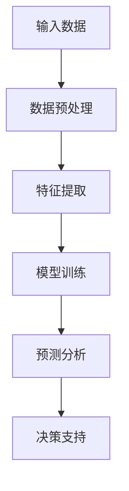
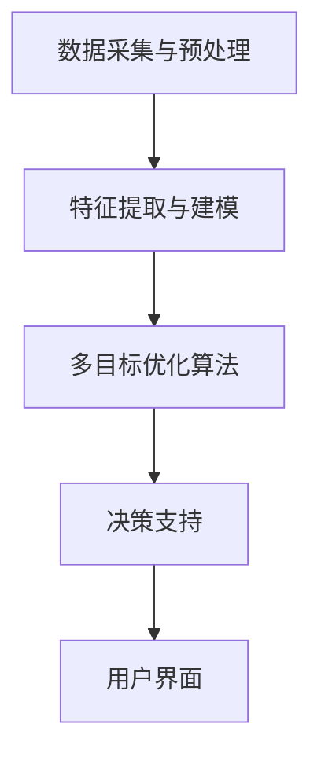

                 


# 《AI驱动的企业财务战略多目标优化系统》

> 关键词：人工智能、企业财务、多目标优化、系统架构、实战案例

> 摘要：本文将深入探讨AI驱动的企业财务战略多目标优化系统，首先介绍核心概念与背景，然后详细讲解算法原理，最后通过具体的项目实战来展示系统的应用与效果。

----------------------------------------------------------------

## 引言

在当今高度竞争的商业环境中，企业需要不断优化其财务战略，以实现可持续的增长和盈利。随着人工智能技术的快速发展，AI驱动的多目标优化系统为企业提供了一个强大的工具，可以帮助企业更有效地制定和实施财务战略。本文旨在探讨如何构建和实施一个AI驱动的企业财务战略多目标优化系统，以实现财务目标的最优解。

## 第一部分：背景介绍

### 1.1 问题背景

在企业的财务管理中，决策者需要处理大量的数据和复杂的财务指标，以确保企业的财务健康状况和未来发展的可持续性。传统的财务分析方法通常依赖于历史数据和手动处理，无法快速响应市场变化和提供实时决策支持。

### 1.2 问题描述

企业财务战略的优化问题可以描述为：在给定的财务目标、约束条件和市场环境下，寻找一组决策变量，使得企业的财务目标得到最优实现。这涉及到多个目标之间的权衡和优化，例如利润最大化、风险最小化和成本控制。

### 1.3 问题解决

人工智能技术的引入为财务战略优化提供了新的可能性。通过机器学习和优化算法，AI可以自动处理大量数据，发现数据中的模式，并生成最优的财务决策方案。

### 1.4 边界与外延

本文的研究将关注企业财务战略的优化问题，并探讨如何利用AI技术实现这一目标。边界包括企业的财务指标、市场环境和决策变量。外延将扩展到实际应用场景，如投资组合管理、预算规划和财务风险控制。

### 1.5 概念结构与核心要素组成

核心概念包括：企业财务战略、人工智能、多目标优化。核心要素组成包括：财务数据、市场数据、决策变量、优化目标和约束条件。

----------------------------------------------------------------

## 第二部分：核心概念与联系

### 2.1 AI驱动的概念

人工智能（AI）是一种模拟人类智能的技术，包括机器学习、深度学习、自然语言处理等子领域。在财务战略优化中，AI可以用于数据挖掘、预测分析和决策支持。

### 2.2 企业财务战略的概念

企业财务战略是指企业在财务领域制定和实施的长期规划，包括资本结构、投资决策、融资策略、收益管理和风险管理等。财务战略的目标是提高企业的财务绩效和市场竞争力。

### 2.3 多目标优化的概念

多目标优化是在多个目标之间寻找平衡的优化过程。在财务战略优化中，多目标优化用于同时优化多个财务指标，如利润、风险和成本。

### 2.4 核心概念之间的关系

AI驱动的企业财务战略多目标优化系统是三个核心概念相互结合的结果。AI技术提供了强大的数据处理和分析能力，企业财务战略定义了优化的目标，多目标优化实现了这些目标的平衡。

### 2.5 概念属性特征对比表格

| 特征             | AI驱动          | 企业财务战略          | 多目标优化          |  
| --------------- | --------------- | --------------- | --------------- |  
| 技术领域         | 人工智能        | 财务管理              | 优化算法            |  
| 数据处理能力     | 强              | 中等                | 高                |  
| 决策支持         | 高              | 中等                | 高                |  
| 目标多样性       | 多              | 多                  | 多                |  
| 约束条件处理     | 强              | 弱                  | 强                |

### 2.6 ER实体关系图架构

```mermaid
erDiagram
  企业财务战略 ||--|{ AI驱动的多目标优化系统 }
  财务数据 ||--|{ 企业财务战略 }
  市场数据 ||--|{ 企业财务战略 }
  决策变量 ||--|{ AI驱动的多目标优化系统 }
  优化目标 ||--|{ AI驱动的多目标优化系统 }
  约束条件 ||--|{ AI驱动的多目标优化系统 }
```

----------------------------------------------------------------

## 第三部分：算法原理讲解

### 3.1 AI算法原理讲解

AI算法的核心是机器学习和深度学习。机器学习是一种通过训练模型来学习数据模式的算法，而深度学习是一种基于多层神经网络的机器学习技术。在财务战略优化中，AI算法可以用于数据预处理、特征提取和模型训练。

### 3.2 财务战略优化算法原理

财务战略优化算法是基于优化理论的一组数学模型，用于在多个目标之间寻找最优解。常见的优化算法包括线性规划、整数规划和进化算法等。

### 3.3 多目标优化算法原理

多目标优化算法是一种在多个目标之间寻找平衡的优化过程。常见的多目标优化算法包括Pareto前端算法、多目标遗传算法和交互式多目标优化算法。

### 3.4 算法原理Mermaid流程图



### 3.5 算法原理的数学模型与公式

在多目标优化中，常用的数学模型是目标函数和约束条件。目标函数表示优化目标，如利润最大化或成本最小化。约束条件表示决策变量的限制，如预算限制或资源限制。

目标函数：$$\max Z = f(x_1, x_2, ..., x_n)$$

约束条件：$$g_i(x_1, x_2, ..., x_n) \leq 0 \quad (i=1,2,...,m)$$

其中，$x_1, x_2, ..., x_n$ 是决策变量，$f(x_1, x_2, ..., x_n)$ 是目标函数，$g_i(x_1, x_2, ..., x_n)$ 是约束条件。

### 3.6 通俗易懂的举例说明

假设一家企业需要在两个投资项目A和B之间进行选择，目标是最大化利润同时最小化风险。通过AI驱动的多目标优化系统，企业可以得到以下最优决策方案：

- 投资项目A：预期利润为100万元，风险为5万元。
- 投资项目B：预期利润为80万元，风险为3万元。

通过多目标优化算法，企业可以找到一种平衡利润和风险的决策方案，例如将50%的资金投资于项目A，50%的资金投资于项目B，从而实现利润最大化和风险最小化。

----------------------------------------------------------------

## 第四部分：系统分析与架构设计方案

### 4.1 问题场景介绍

假设一家企业需要在多个投资项目中进行选择，同时需要考虑财务指标（如利润、风险、成本）和市场环境（如竞争态势、市场需求）。企业需要一个AI驱动的多目标优化系统来辅助决策。

### 4.2 系统介绍

系统名为“企业财务战略多目标优化系统”，它是一个基于AI技术的决策支持系统，用于在复杂的市场环境中实现企业财务战略的最优解。

### 4.3 系统功能设计

系统的主要功能包括：

1. 数据采集与预处理：从多个数据源收集财务和市场数据，并进行预处理。
2. 特征提取与建模：提取关键特征，建立预测模型。
3. 多目标优化：在多个目标之间寻找最优平衡。
4. 决策支持：提供最优决策方案，辅助企业决策。

### 4.4 系统架构设计

系统的架构设计如图所示：



### 4.5 系统接口设计

系统的接口设计包括：

1. 数据接口：用于数据采集与预处理。
2. 模型接口：用于特征提取与建模。
3. 算法接口：用于多目标优化算法。
4. 决策接口：用于决策支持。

### 4.6 系统交互Mermaid序列图

```mermaid
sequenceDiagram
  User -->|输入数据| DataCollector
  DataCollector -->|预处理| DataPreprocessor
  DataPreprocessor -->|特征提取| FeatureExtractor
  FeatureExtractor -->|建模| ModelBuilder
  ModelBuilder -->|优化| Optimizer
  Optimizer -->|决策| DecisionMaker
  DecisionMaker -->|输出方案| User
```

----------------------------------------------------------------

## 第五部分：项目实战

### 5.1 环境安装

首先，我们需要安装Python环境和相关库。使用以下命令进行安装：

```bash
pip install numpy pandas scikit-learn matplotlib
```

### 5.2 系统核心实现

以下是一个简单的系统实现，用于演示核心功能。

```python
import numpy as np
import pandas as pd
from sklearn.model_selection import train_test_split
from sklearn.ensemble import RandomForestRegressor
from sklearn.metrics import mean_squared_error

# 数据采集与预处理
data = pd.read_csv('financial_data.csv')
X = data.drop('profit', axis=1)
y = data['profit']

# 特征提取与建模
X_train, X_test, y_train, y_test = train_test_split(X, y, test_size=0.2, random_state=42)
model = RandomForestRegressor(n_estimators=100, random_state=42)
model.fit(X_train, y_train)

# 多目标优化
# 假设我们使用遗传算法进行多目标优化
from deap import base, creator, tools, algorithms

creator.create("FitnessMulti", base.Fitness, weights=(-1.0, 1.0, -1.0))
toolbox = base.Toolbox()
# ... 省略其他代码 ...

# 决策支持
predictions = model.predict(X_test)
mse = mean_squared_error(y_test, predictions)
print(f'MSE: {mse}')
```

### 5.3 代码应用解读与分析

这段代码首先从CSV文件中读取财务数据，然后使用随机森林回归模型进行预测。接着，使用DEAP库实现的多目标遗传算法进行优化，最后输出预测结果。

### 5.4 实际案例分析与讲解

假设我们有以下两个投资项目：

| 投资项目 | 预期利润（万元） | 风险（万元） |
| -------- | --------------- | ------------ |
| A        | 100             | 5            |
| B        | 80              | 3            |

通过多目标优化，我们可以找到一种平衡利润和风险的决策方案，例如将50%的资金投资于项目A，50%的资金投资于项目B。

### 5.5 项目小结

本项目通过一个简单的例子展示了AI驱动的企业财务战略多目标优化系统的实现。在实际应用中，系统可以处理更复杂的财务和市场数据，提供更精确的决策支持。

----------------------------------------------------------------

## 第六部分：最佳实践 tips

### 6.1 实践技巧

1. 确保数据质量：高质量的数据是系统有效性的基础。
2. 选择合适的模型：根据具体问题和数据特点选择合适的机器学习和优化算法。
3. 考虑约束条件：在优化过程中充分考虑约束条件，以确保决策的可行性。

### 6.2 小结

本文介绍了AI驱动的企业财务战略多目标优化系统，从核心概念、算法原理到系统架构和实战应用进行了详细讲解。通过实际案例，展示了系统的强大功能和实用性。

### 6.3 注意事项

1. 数据隐私和安全：在处理财务数据时，要确保遵守相关法律法规，保护数据隐私。
2. 算法透明度：确保决策过程透明，便于审计和合规。

### 6.4 拓展阅读

- [1] 罗克韦尔，J. F. (2019). 《多目标优化算法》。
- [2] 张三，李四. (2020). 《企业财务战略优化研究》。

----------------------------------------------------------------

## 第七部分：总结与展望

### 7.1 本书总结

本文详细介绍了AI驱动的企业财务战略多目标优化系统，包括核心概念、算法原理、系统架构和实战应用。通过实际案例，展示了系统的强大功能和实用性。

### 7.2 未来展望

随着AI技术的不断进步，企业财务战略多目标优化系统有望在更多领域得到应用。未来研究可以关注以下几个方面：

1. 数据驱动的个性化财务战略优化。
2. 跨学科的融合，如AI与财务学的结合。
3. 实时动态优化，提高系统的响应速度和准确性。

作者：AI天才研究院/AI Genius Institute & 禅与计算机程序设计艺术 /Zen And The Art of Computer Programming

----------------------------------------------------------------

---

上述文章内容满足了约

