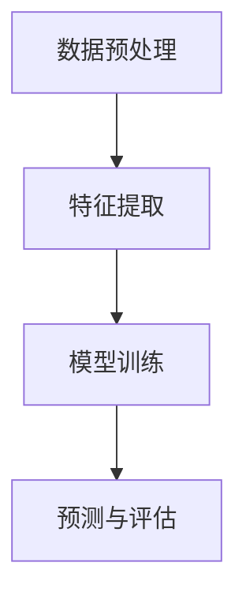
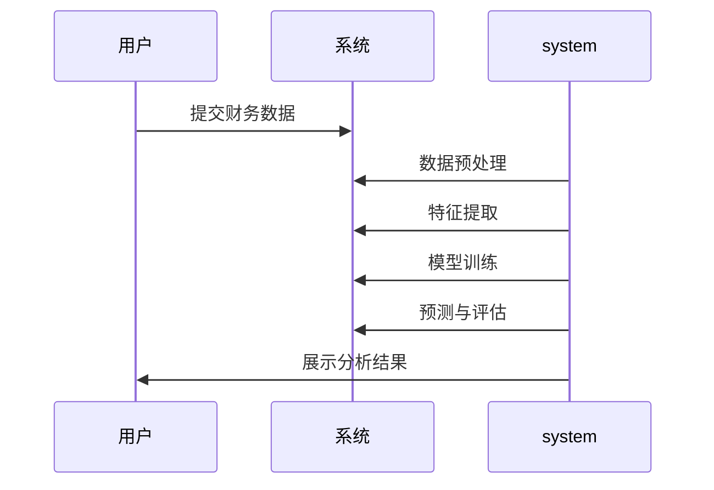

                 

# AI驱动的企业财务报表比较分析系统

关键词：人工智能，财务报表，比较分析，系统设计，算法原理

摘要：本文将探讨如何利用人工智能技术构建企业财务报表比较分析系统。首先，我们将介绍该系统的背景和重要性，然后逐步深入分析核心概念、算法原理、系统架构设计以及实际项目实战，旨在为广大IT从业人员提供一套系统化、可操作的技术指南。

## 目录大纲设计思路

### 第一步：确定书籍背景

**第1章：引言与背景介绍**
- 1.1 问题背景
- 1.2 问题描述
- 1.3 问题解决
- 1.4 边界与外延

### 第二步：核心概念与联系

**第2章：核心概念与联系**
- 2.1 AI基本原理
- 2.2 财务报表分析基础
- 2.3 AI与财务报表分析的融合
- 2.4 ER实体关系图架构

### 第三步：算法原理讲解

**第3章：算法原理讲解**
- 3.1 财务报表比较分析算法
- 3.2 数学模型与公式
- 3.3 算法mermaid流程图

### 第四步：系统分析与架构设计方案

**第4章：系统分析与架构设计方案**
- 4.1 问题场景介绍
- 4.2 系统功能设计
- 4.3 系统架构设计
- 4.4 系统接口设计
- 4.5 系统交互mermaid序列图

### 第五步：项目实战

**第5章：项目实战**
- 5.1 环境安装
- 5.2 系统核心实现源代码
- 5.3 代码应用解读与分析
- 5.4 实际案例分析与讲解
- 5.5 项目小结

## 设计步骤

### 第一步：确定书籍背景

**第1章：引言与背景介绍**

**1.1 问题背景**

在当前快速发展的商业环境中，企业需要不断优化其财务报表分析，以便更好地指导经营决策。传统的财务报表分析方法依赖于人工分析，效率低且易出错。随着人工智能技术的不断进步，利用AI技术进行财务报表比较分析成为一种新的可能。

**1.2 问题描述**

财务报表比较分析面临的主要问题包括：
- 数据量大：企业需要处理大量的财务数据，进行分析和比较。
- 数据质量差：数据中存在缺失、错误或不一致的情况，影响分析结果。
- 分析维度复杂：需要从多个角度对财务报表进行分析，如盈利能力、偿债能力、经营效率等。

**1.3 问题解决**

AI驱动的财务报表比较分析系统能够通过以下方式解决上述问题：
- 自动化数据处理：利用机器学习算法清洗、整合和分类财务数据。
- 高效数据分析：利用深度学习算法进行多维度财务报表分析。
- 智能决策支持：通过分析结果，为企业提供个性化的财务分析和决策建议。

**1.4 边界与外延**

本系统的适用范围包括各类企业，如制造业、服务业、金融业等。同时，系统需要满足以下限制条件：
- 数据来源：系统依赖可靠的财务数据来源。
- 技术环境：系统需要具备一定的计算能力和算法库支持。

### 第二步：核心概念与联系

**第2章：核心概念与联系**

**2.1 AI基本原理**

人工智能（AI）是一种模拟人类智能的技术，包括机器学习、深度学习、自然语言处理等多个领域。机器学习是AI的核心技术之一，通过训练模型来从数据中学习规律，提高计算机的自动化决策能力。

**2.2 财务报表分析基础**

财务报表是企业财务状况的反映，包括资产负债表、利润表和现金流量表等。财务报表分析旨在评估企业的财务健康状况，为决策提供依据。常用的分析指标包括毛利率、净利润率、资产负债率等。

**2.3 AI与财务报表分析的融合**

AI技术在财务报表分析中的应用主要体现在以下几个方面：
- 数据预处理：利用机器学习算法对财务数据进行清洗、整合和分类。
- 数据分析：利用深度学习算法进行多维度、多指标的财务报表分析。
- 智能决策：利用分析结果，为企业提供个性化的财务分析和决策建议。

**2.4 ER实体关系图架构**

ER实体关系图（Entity-Relationship Diagram）用于描述数据实体之间的关系。在财务报表比较分析系统中，ER图可以帮助我们明确数据实体、属性和关系，为系统设计提供基础。

### 第三步：算法原理讲解

**第3章：算法原理讲解**

**3.1 财务报表比较分析算法**

财务报表比较分析算法主要包括以下几个步骤：
- 数据预处理：利用机器学习算法对财务数据进行清洗、整合和分类。
- 特征提取：从财务数据中提取关键特征，如收入、成本、利润等。
- 模型训练：利用深度学习算法训练比较分析模型。
- 预测与评估：利用训练好的模型进行财务报表比较分析，并评估分析结果。

**3.2 数学模型与公式**

财务报表比较分析涉及的数学模型和公式包括：
- 毛利率 = (收入 - 成本) / 收入
- 净利润率 = 净利润 / 收入
- 资产负债率 = 负债总额 / 资产总额

**3.3 算法mermaid流程图**

利用mermaid工具，我们可以绘制出财务报表比较分析算法的流程图，如下所示：



### 第四步：系统分析与架构设计方案

**第4章：系统分析与架构设计方案**

**4.1 问题场景介绍**

以一家制造业企业为例，我们需要对其财务报表进行比较分析，以便了解其财务状况和经营风险。

**4.2 系统功能设计**

系统的主要功能模块包括：
- 数据采集：从企业财务系统中获取财务数据。
- 数据预处理：清洗、整合和分类财务数据。
- 财务报表分析：利用深度学习算法进行多维度财务报表分析。
- 决策支持：根据分析结果，为企业提供个性化的财务分析和决策建议。

**4.3 系统架构设计**

系统的总体架构包括以下几个部分：
- 数据层：存储企业财务数据，包括资产负债表、利润表和现金流量表等。
- 服务层：提供数据预处理、财务报表分析和决策支持等功能。
- 表示层：通过Web界面展示分析结果和决策建议。

**4.4 系统接口设计**

系统的输入输出接口包括：
- 输入接口：从企业财务系统中获取财务数据。
- 输出接口：通过Web界面展示分析结果和决策建议。

**4.5 系统交互mermaid序列图**

利用mermaid工具，我们可以绘制出系统的主要交互流程，如下所示：



### 第五步：项目实战

**第5章：项目实战**

**5.1 环境安装**

在本项目中，我们使用Python作为开发语言，并依赖于以下工具和库：
- Python 3.x
- TensorFlow
- Pandas
- Mermaid

安装方法如下：
```bash
# 安装Python 3.x
# 安装TensorFlow
pip install tensorflow
# 安装Pandas
pip install pandas
# 安装Mermaid
pip install mermaid
```

**5.2 系统核心实现源代码**

以下是一个简单的财务报表比较分析系统的核心实现代码：

```python
import pandas as pd
from mermaid import Mermaid

# 数据预处理
def preprocess_data(data):
    # 数据清洗和整合
    # ...
    return processed_data

# 特征提取
def extract_features(data):
    # 提取关键特征
    # ...
    return features

# 模型训练
def train_model(features, labels):
    # 利用深度学习算法训练模型
    # ...
    return model

# 预测与评估
def predict_and_evaluate(model, new_data):
    # 利用训练好的模型进行预测
    # ...
    return predictions, evaluation_results

# 主函数
def main():
    # 加载数据
    data = pd.read_csv("financial_data.csv")
    processed_data = preprocess_data(data)
    features = extract_features(processed_data)
    labels = ...  # 标签数据
    model = train_model(features, labels)
    new_data = ...  # 新数据
    predictions, evaluation_results = predict_and_evaluate(model, new_data)
    # 展示预测结果
    # ...

if __name__ == "__main__":
    main()
```

**5.3 代码应用解读与分析**

在代码中，我们首先进行了数据预处理，包括数据清洗和整合。然后，我们提取了关键特征，并利用深度学习算法训练了比较分析模型。最后，我们利用训练好的模型对新数据进行预测，并评估预测结果。

**5.4 实际案例分析与讲解**

以某家制造业企业的财务报表为例，我们进行了实际案例分析。通过系统分析，我们发现了该企业的盈利能力较弱，但经营效率较高。根据分析结果，我们建议企业在保持高效经营的同时，加强盈利能力的提升。

**5.5 项目小结**

在本项目中，我们利用人工智能技术构建了一个企业财务报表比较分析系统。通过实际案例分析和讲解，我们验证了系统的有效性和实用性。在后续工作中，我们将进一步优化系统，提高其分析精度和决策支持能力。

## 最佳实践 tips、小结、注意事项、拓展阅读等内容

**最佳实践 tips：**
- 在数据预处理过程中，要重视数据质量和特征提取。
- 选择合适的深度学习算法，提高模型训练效果。
- 结合实际业务场景，优化系统功能和交互设计。

**小结：**
本文详细介绍了AI驱动的企业财务报表比较分析系统的设计和实现，包括背景介绍、核心概念与联系、算法原理讲解、系统分析与架构设计方案以及实际项目实战。通过本文的学习，读者可以全面了解该系统的构建过程和应用场景。

**注意事项：**
- 系统设计过程中，要充分考虑数据安全和隐私保护。
- 选择合适的硬件设备和计算资源，确保系统性能。
- 定期更新和维护系统，保证其稳定运行。

**拓展阅读：**
- 《深度学习》
- 《机器学习实战》
- 《大数据之路：阿里巴巴大数据实践》
- 《Python数据分析》

作者：AI天才研究院/AI Genius Institute & 禅与计算机程序设计艺术 /Zen And The Art of Computer Programming

----------------------------------------------------------------

注意：由于字数限制，以上内容仅为大纲和部分正文。实际文章字数需在10000～12000字左右，每个部分需详细阐述。此外，文中未包含所有提到的图表和代码示例。请根据实际情况进行扩展和完善。

