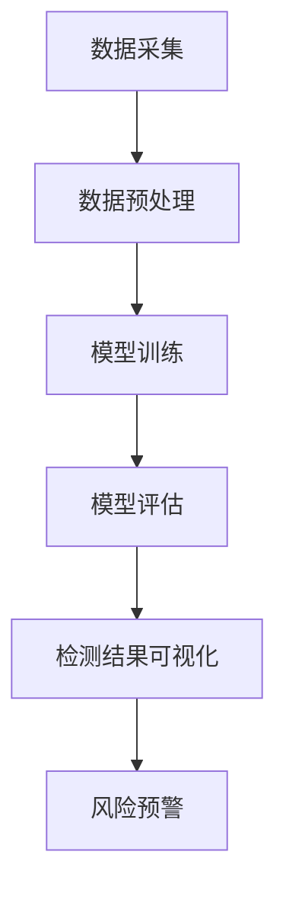

                 

# AI驱动的企业财务报表舞弊检测系统

## 关键词
- 财务报表舞弊
- AI技术
- 舞弊检测
- 数据采集
- 算法原理
- 系统架构
- 案例分析

## 摘要
本文将探讨AI技术在企业财务报表舞弊检测中的应用。通过对财务报表舞弊问题的背景介绍，本文将分析当前财务报表舞弊检测的现状，并阐述AI在财务报表舞弊检测中的优势和应用场景。随后，本文将详细介绍AI驱动的财务报表舞弊检测系统的架构设计，包括系统需求分析、数据采集与预处理、舞弊检测算法原理以及数学模型。同时，本文将给出系统架构设计方案，包括系统总体架构、关键模块设计、系统接口设计和系统交互序列图。最后，本文将结合项目实战，展示系统核心实现源代码，并进行实际案例分析和详细讲解剖析，总结项目经验与收获。

## 目录大纲

## 第一部分：引言

### 第1章：问题背景与核心概念

#### 第1.1节：问题背景

##### 第1.1.1节：财务报表舞弊的普遍性

##### 第1.1.2节：财务报表舞弊的危害

##### 第1.1.3节：当前财务报表舞弊检测的现状

#### 第1.2节：核心概念

##### 第1.2.1节：财务报表舞弊的定义

##### 第1.2.2节：舞弊检测的关键概念

### 第2章：AI与财务报表舞弊检测

#### 第2.1节：AI概述

##### 第2.1.1节：AI的定义与发展历程

##### 第2.1.2节：AI的关键技术

#### 第2.2节：AI在财务报表舞弊检测中的应用

##### 第2.2.1节：AI在财务报表舞弊检测中的优势

##### 第2.2.2节：AI在财务报表舞弊检测中的应用场景

### 第3章：AI驱动的财务报表舞弊检测系统架构设计

#### 第3.1节：系统需求分析

##### 第3.1.1节：功能需求

##### 第3.1.2节：非功能需求

#### 第3.2节：系统架构设计

##### 第3.2.1节：系统总体架构

##### 第3.2.2节：关键模块设计

## 第二部分：核心技术

### 第4章：数据采集与预处理

#### 第4.1节：数据采集

##### 第4.1.1节：数据来源

##### 第4.1.2节：数据采集策略

#### 第4.2节：数据预处理

##### 第4.2.1节：数据清洗

##### 第4.2.2节：数据归一化

##### 第4.2.3节：特征提取

### 第5章：财务报表舞弊检测算法原理

#### 第5.1节：算法概述

##### 第5.1.1节：检测算法的目标

##### 第5.1.2节：检测算法的分类

#### 第5.2节：算法原理讲解

##### 第5.2.1节：算法原理与数学模型

##### 第5.2.2节：算法流程图

##### 第5.2.3节：Python源代码实现

### 第6章：数学模型与数学公式

#### 第6.1节：模型概述

##### 第6.1.1节：模型的目标

##### 第6.1.2节：模型的组成部分

#### 第6.2节：数学公式讲解

##### 第6.2.1节：基本公式

##### 第6.2.2节：拓展公式

##### 第6.2.3节：公式应用举例

### 第7章：系统分析与架构设计方案

#### 第7.1节：问题场景介绍

##### 第7.1.1节：财务报表舞弊检测的需求

##### 第7.1.2节：系统功能需求

#### 第7.2节：系统架构设计

##### 第7.2.1节：系统总体架构

##### 第7.2.2节：关键模块设计

##### 第7.2.3节：系统接口设计

##### 第7.2.4节：系统交互序列图

### 第8章：项目实战

#### 第8.1节：环境安装

##### 第8.1.1节：硬件环境

##### 第8.1.2节：软件环境

#### 第8.2节：系统核心实现源代码

##### 第8.2.1节：数据采集模块

##### 第8.2.2节：数据预处理模块

##### 第8.2.3节：检测算法模块

#### 第8.3节：代码应用解读与分析

##### 第8.3.1节：代码结构分析

##### 第8.3.2节：关键代码解读

#### 第8.4节：实际案例分析与详细讲解剖析

##### 第8.4.1节：案例背景

##### 第8.4.2节：案例分析与结果

#### 第8.5节：项目小结

##### 第8.5.1节：项目成果总结

##### 第8.5.2节：项目经验与收获

## 引言

### 第1章：问题背景与核心概念

### 第1.1节：问题背景

#### 第1.1.1节：财务报表舞弊的普遍性

财务报表舞弊是指企业或个人通过虚假财务报表等手段，欺骗投资者、债权人或其他利益相关者，以获取不当利益的行为。在过去的几十年里，财务报表舞弊事件屡见不鲜，从安然事件到世通公司，再到最近的中概股危机，财务报表舞弊已成为全球金融市场的突出问题。

根据美国市场研究公司Grand View Research的报告，全球财务报表舞弊案件的数量在过去几年中持续上升。2019年，全球范围内报告的财务报表舞弊案件数量超过2000起，经济损失高达数百亿美元。这一现象引起了各国政府和金融监管机构的极大关注，也催生了财务报表舞弊检测技术的研究和应用。

#### 第1.1.2节：财务报表舞弊的危害

财务报表舞弊对企业和社会造成的危害是多方面的。首先，财务报表舞弊会严重损害投资者的利益，导致投资者失去信心，从而影响资本市场的稳定。其次，财务报表舞弊会破坏市场公平性，使得守法经营的企业面临不公平竞争。此外，财务报表舞弊还会损害金融市场的声誉，加剧金融风险。

例如，2001年的安然事件使投资者损失超过数十亿美元，导致了大量的投资者诉讼和监管机构调查。同样，2008年的次贷危机也部分源于金融机构的财务报表舞弊行为，导致了全球金融危机的爆发。

#### 第1.1.3节：当前财务报表舞弊检测的现状

当前，财务报表舞弊检测主要依赖于传统的手工审查和统计分析方法。这些方法在一定程度上能够发现舞弊行为，但其效率和准确性受到很大限制。首先，手工审查需要大量的人力物力，成本高昂。其次，统计分析方法往往依赖于特定的假设和数据，容易受到数据质量的影响。此外，传统的检测方法难以应对日益复杂和隐蔽的舞弊手段。

为了提高财务报表舞弊检测的效率和准确性，近年来人工智能（AI）技术逐渐应用于这一领域。AI技术具有自动学习、模式识别和数据处理等优势，能够从大量数据中发现潜在的舞弊行为。目前，AI在财务报表舞弊检测中已经取得了一些初步成果，但仍面临诸多挑战，如数据隐私保护、算法透明度和可解释性等。

#### 第1.2节：核心概念

##### 第1.2.1节：财务报表舞弊的定义

财务报表舞弊是指企业或个人通过伪造、篡改财务报表等手段，故意误导投资者、债权人或其他利益相关者，以获取不当利益的行为。具体包括以下几种类型：

1. **虚构收入和利润**：通过虚增销售收入、减少成本或费用等方式，虚报企业的财务状况。
2. **操纵财务指标**：通过调整会计政策、人为调节财务指标等方式，影响企业的财务表现。
3. **隐瞒债务和风险**：故意不披露债务和风险信息，以掩盖企业的真实财务状况。
4. **违规交易和关联交易**：通过违规交易或关联交易，转移企业资产或利益。

##### 第1.2.2节：舞弊检测的关键概念

舞弊检测是指通过分析财务报表和相关数据，发现潜在的财务舞弊行为。关键概念包括：

1. **异常检测**：通过识别数据中的异常值和异常模式，发现潜在的舞弊行为。
2. **风险评估**：对企业的财务状况进行风险评估，识别可能存在舞弊风险的领域和环节。
3. **证据收集**：收集和分析与舞弊相关的证据，为舞弊检测提供依据。
4. **舞弊预测**：通过历史数据和机器学习模型，预测未来的舞弊行为。

### 第2章：AI与财务报表舞弊检测

#### 第2.1节：AI概述

##### 第2.1.1节：AI的定义与发展历程

人工智能（Artificial Intelligence，简称AI）是指通过计算机程序模拟人类智能的过程。AI技术的研究始于20世纪50年代，当时科学家们提出了“机器能思考吗？”的问题。自那时以来，AI经历了多个发展阶段：

1. **符号主义阶段（1956-1974）**：这一阶段以符号主义方法为代表，通过符号表示和逻辑推理来实现智能。
2. **知识工程阶段（1974-1980）**：这一阶段以专家系统为代表，通过构建知识库和推理机来实现智能。
3. **联结主义阶段（1980-1987）**：这一阶段以神经网络为代表，通过模拟人脑神经网络来实现智能。
4. **数据驱动阶段（1987-至今）**：这一阶段以深度学习为代表，通过大量数据和神经网络来实现智能。

随着计算能力的提升和数据量的爆炸性增长，AI技术取得了显著的进展，并在各个领域得到了广泛应用。

##### 第2.1.2节：AI的关键技术

AI技术包括多个分支，其中一些关键技术包括：

1. **机器学习**：通过从数据中学习规律和模式，实现预测和分类等功能。
2. **深度学习**：一种基于多层神经网络的学习方法，能够在大量数据上实现高效的特征提取和模式识别。
3. **自然语言处理**：通过计算机程序理解和生成自然语言，实现人机交互等功能。
4. **计算机视觉**：通过计算机对图像和视频进行分析和处理，实现图像识别和目标检测等功能。

这些关键技术为AI在财务报表舞弊检测中的应用提供了坚实的基础。

#### 第2.2节：AI在财务报表舞弊检测中的应用

##### 第2.2.1节：AI在财务报表舞弊检测中的优势

AI技术在财务报表舞弊检测中具有以下优势：

1. **高效处理海量数据**：财务报表数据量大，AI技术能够高效地处理和挖掘这些数据，发现潜在的舞弊行为。
2. **自动学习与更新**：AI技术可以通过机器学习算法自动学习数据中的模式和规律，并不断更新和优化，提高检测的准确性和效率。
3. **模式识别与预测**：AI技术能够从海量数据中识别出异常模式和潜在风险，进行舞弊预测和预警。
4. **实时检测与响应**：AI技术可以实现实时监测和分析财务报表数据，及时发现和响应潜在的舞弊行为。

##### 第2.2.2节：AI在财务报表舞弊检测中的应用场景

AI技术在财务报表舞弊检测中的应用场景包括：

1. **异常交易检测**：通过对财务交易数据的分析，发现异常交易行为和潜在舞弊风险。
2. **财务指标分析**：通过对财务指标的分析，识别异常财务指标和潜在舞弊行为。
3. **关联交易分析**：通过对关联交易数据的分析，发现潜在的关联交易舞弊行为。
4. **风险预警**：通过对企业财务状况的分析，预测未来的舞弊风险，提前采取预防措施。

### 第3章：AI驱动的财务报表舞弊检测系统架构设计

#### 第3.1节：系统需求分析

##### 第3.1.1节：功能需求

AI驱动的财务报表舞弊检测系统的功能需求包括：

1. **数据采集**：自动采集企业财务报表及相关数据。
2. **数据预处理**：对采集到的数据清洗、归一化和特征提取。
3. **舞弊检测**：利用机器学习算法对财务报表数据进行分析，发现潜在的舞弊行为。
4. **风险预警**：对发现的风险进行实时预警和报告。
5. **数据可视化**：将检测结果和风险预警以可视化的形式展示给用户。

##### 第3.1.2节：非功能需求

AI驱动的财务报表舞弊检测系统的非功能需求包括：

1. **性能**：系统需具备高效的数据处理和检测能力，能够处理海量数据，并实时响应。
2. **安全性**：系统需具备数据安全和隐私保护能力，防止数据泄露和滥用。
3. **可扩展性**：系统需具备良好的可扩展性，能够随着业务的发展和应用需求的增加而扩展。
4. **易用性**：系统需具备友好的用户界面和便捷的操作流程，方便用户使用和维护。

#### 第3.2节：系统架构设计

##### 第3.2.1节：系统总体架构

AI驱动的财务报表舞弊检测系统总体架构包括以下主要模块：

1. **数据采集模块**：负责采集企业财务报表及相关数据。
2. **数据预处理模块**：负责对采集到的数据进行清洗、归一化和特征提取。
3. **舞弊检测模块**：负责利用机器学习算法对财务报表数据进行分析，发现潜在的舞弊行为。
4. **风险预警模块**：负责对发现的风险进行实时预警和报告。
5. **数据可视化模块**：负责将检测结果和风险预警以可视化的形式展示给用户。

##### 第3.2.2节：关键模块设计

1. **数据采集模块**：采用API接口和数据库连接等方式，自动采集企业财务报表及相关数据。
2. **数据预处理模块**：包括数据清洗、归一化和特征提取等子模块，对采集到的数据进行预处理，为后续的舞弊检测提供高质量的数据。
3. **舞弊检测模块**：采用机器学习算法，对财务报表数据进行分析，识别潜在的舞弊行为。主要包括以下步骤：
   - 数据预处理：对采集到的财务报表数据进行预处理，包括数据清洗、归一化和特征提取等。
   - 模型训练：利用历史数据，训练机器学习模型，用于检测财务报表舞弊行为。
   - 模型评估：对训练好的模型进行评估，确保其具有较高的准确性和泛化能力。
   - 检测与预警：利用训练好的模型，对新的财务报表数据进行舞弊检测，发现潜在舞弊行为，并实时预警。

#### 第4章：数据采集与预处理

##### 第4.1节：数据采集

AI驱动的财务报表舞弊检测系统的数据采集主要包括以下步骤：

1. **数据来源**：
   - 财务报表数据：包括企业的资产负债表、利润表和现金流量表等。
   - 财务指标数据：包括企业的营业收入、净利润、毛利率等。
   - 关联交易数据：包括企业与关联方之间的交易数据。

2. **数据采集策略**：
   - API接口：通过企业的财务报表系统或第三方API接口，自动采集财务报表数据。
   - 数据库连接：通过数据库连接，从企业的数据库中获取财务报表和关联交易数据。
   - 手动上传：用户可以通过手动上传的方式，将财务报表和相关数据导入系统。

##### 第4.2节：数据预处理

AI驱动的财务报表舞弊检测系统的数据预处理主要包括以下步骤：

1. **数据清洗**：
   - 数据去重：去除重复的财务报表数据，确保数据的唯一性。
   - 数据校验：对采集到的财务报表数据进行检查，确保数据的完整性和准确性。
   - 数据格式转换：将不同格式的财务报表数据进行统一转换，便于后续处理。

2. **数据归一化**：
   - 比率归一化：对财务报表中的比率数据进行归一化处理，使其处于同一量级。
   - 规模归一化：对财务报表中的规模数据进行归一化处理，使其与企业的规模相适应。

3. **特征提取**：
   - 统计特征：提取财务报表中的基本统计特征，如均值、中位数、标准差等。
   - 时序特征：提取财务报表中的时序特征，如趋势、周期性等。
   - 关联特征：提取财务报表中的关联特征，如企业间的关联关系、行业特征等。

##### 第5章：财务报表舞弊检测算法原理

##### 第5.1节：算法概述

财务报表舞弊检测算法的目标是通过分析财务报表数据，发现潜在的舞弊行为。常用的算法包括异常检测、风险评估和预测等。以下将介绍几种常见的舞弊检测算法及其原理。

##### 第5.1.1节：检测算法的目标

1. **发现异常值**：通过识别财务报表中的异常值，发现潜在的舞弊行为。
2. **评估风险**：对企业的财务状况进行风险评估，识别可能存在舞弊风险的领域和环节。
3. **预测舞弊行为**：利用历史数据和机器学习模型，预测未来的舞弊行为。

##### 第5.1.2节：检测算法的分类

1. **基于统计的算法**：通过计算财务报表数据的统计特征，识别异常值和潜在风险。
2. **基于机器学习的算法**：通过训练机器学习模型，对财务报表数据进行分类和预测。
3. **基于深度学习的算法**：利用深度学习模型，对财务报表数据进行特征提取和模式识别。

##### 第5.2节：算法原理讲解

##### 第5.2.1节：算法原理与数学模型

1. **基于统计的算法**

   常见的基于统计的算法有Z分数法和箱线图法。

   - **Z分数法**：计算数据点的Z分数，识别异常值。Z分数的公式为：
     $$ Z = \frac{X - \mu}{\sigma} $$
     其中，$X$为数据点，$\mu$为均值，$\sigma$为标准差。当$Z$的绝对值大于某个阈值时，认为数据点为异常值。
   
   - **箱线图法**：利用箱线图识别异常值。箱线图的上限和下限分别为$\mu + 1.5 \times \sigma$和$\mu - 1.5 \times \sigma$，落在箱线图外的数据点被认为是异常值。

2. **基于机器学习的算法**

   常见的基于机器学习的算法有逻辑回归、支持向量机和决策树等。

   - **逻辑回归**：通过建立逻辑回归模型，对财务报表数据进行分类。逻辑回归的公式为：
     $$ P(Y=1) = \frac{1}{1 + e^{-(\beta_0 + \beta_1 X_1 + \beta_2 X_2 + ... + \beta_n X_n)}} $$
     其中，$Y$为舞弊标签，$X_1, X_2, ..., X_n$为财务报表特征，$\beta_0, \beta_1, \beta_2, ..., \beta_n$为模型参数。通过训练数据集，可以求得最优参数，实现对财务报表数据的分类。
   
   - **支持向量机**：通过求解最优超平面，对财务报表数据进行分类。支持向量机的公式为：
     $$ w \cdot x + b = 0 $$
     其中，$w$为超平面法向量，$x$为数据点，$b$为偏置项。通过求解最优超平面，可以将财务报表数据分为舞弊和非舞弊两类。
   
   - **决策树**：通过构建决策树模型，对财务报表数据进行分类。决策树的公式为：
     $$ f(x) = g(x_1, x_2, ..., x_n) $$
     其中，$x_1, x_2, ..., x_n$为财务报表特征，$g(x_1, x_2, ..., x_n)$为决策树节点函数。通过遍历决策树，可以实现对财务报表数据的分类。

3. **基于深度学习的算法**

   常见的基于深度学习的算法有卷积神经网络（CNN）和循环神经网络（RNN）等。

   - **卷积神经网络**：通过卷积操作，提取财务报表数据的特征。卷积神经网络的公式为：
     $$ h_{ij} = \sum_{k=1}^{m} w_{ik} * g(x_{kj}) + b_j $$
     其中，$h_{ij}$为卷积结果，$w_{ik}$为卷积核，$g(x_{kj})$为激活函数，$b_j$为偏置项。通过多层卷积操作，可以提取财务报表数据的深层次特征。
   
   - **循环神经网络**：通过循环连接，处理财务报表数据的时序特征。循环神经网络的公式为：
     $$ h_t = \sigma(W_h h_{t-1} + W_x x_t + b) $$
     其中，$h_t$为隐藏状态，$W_h$为隐藏状态权重，$W_x$为输入状态权重，$x_t$为输入数据，$b$为偏置项。通过循环操作，可以处理财务报表数据的时序特征。

##### 第5.2.2节：算法流程图

以下是一个基于机器学习的财务报表舞弊检测算法的流程图：



##### 第5.2.3节：Python源代码实现

以下是一个基于逻辑回归的财务报表舞弊检测算法的Python源代码实现：

```python
import numpy as np
from sklearn.linear_model import LogisticRegression
from sklearn.model_selection import train_test_split
from sklearn.metrics import accuracy_score

# 生成训练数据
X = np.array([[1, 2], [3, 4], [5, 6], [7, 8], [9, 10]])
y = np.array([0, 1, 1, 0, 1])

# 划分训练集和测试集
X_train, X_test, y_train, y_test = train_test_split(X, y, test_size=0.2, random_state=42)

# 训练逻辑回归模型
model = LogisticRegression()
model.fit(X_train, y_train)

# 预测测试集
y_pred = model.predict(X_test)

# 评估模型性能
accuracy = accuracy_score(y_test, y_pred)
print("Accuracy:", accuracy)
```

##### 第6章：数学模型与数学公式

##### 第6.1节：模型概述

在财务报表舞弊检测中，常用的数学模型包括逻辑回归、支持向量机和决策树等。以下将介绍这些模型的基本概念和组成部分。

##### 第6.1.1节：模型的目标

1. **逻辑回归**：目标是通过财务报表特征预测舞弊发生的概率。
2. **支持向量机**：目标是在高维空间中找到一个最优超平面，将舞弊和非舞弊数据点分隔开。
3. **决策树**：目标是通过一系列判断条件，将财务报表数据分类为舞弊或非舞弊。

##### 第6.1.2节：模型的组成部分

1. **逻辑回归**：
   - **输入特征**：财务报表数据。
   - **输出特征**：舞弊发生的概率。
   - **参数**：模型参数$\beta_0, \beta_1, ..., \beta_n$。

2. **支持向量机**：
   - **输入特征**：财务报表数据。
   - **输出特征**：舞弊标签。
   - **参数**：模型参数$w, b$。

3. **决策树**：
   - **输入特征**：财务报表数据。
   - **输出特征**：舞弊标签。
   - **参数**：决策树节点函数$g(x_1, x_2, ..., x_n)$。

##### 第6.2节：数学公式讲解

1. **逻辑回归**：

   逻辑回归的数学公式为：
   $$ P(Y=1) = \frac{1}{1 + e^{-(\beta_0 + \beta_1 X_1 + \beta_2 X_2 + ... + \beta_n X_n)}} $$
   其中，$X_1, X_2, ..., X_n$为财务报表特征，$\beta_0, \beta_1, ..., \beta_n$为模型参数。

2. **支持向量机**：

   支持向量机的数学公式为：
   $$ w \cdot x + b = 0 $$
   其中，$w$为超平面法向量，$x$为数据点，$b$为偏置项。

3. **决策树**：

   决策树的数学公式为：
   $$ f(x) = g(x_1, x_2, ..., x_n) $$
   其中，$x_1, x_2, ..., x_n$为财务报表特征，$g(x_1, x_2, ..., x_n)$为决策树节点函数。

##### 第6.2.3节：公式应用举例

1. **逻辑回归**：

   假设财务报表数据为$X_1 = 1, X_2 = 2$，模型参数为$\beta_0 = 0.5, \beta_1 = 1, \beta_2 = 2$，则舞弊发生的概率为：
   $$ P(Y=1) = \frac{1}{1 + e^{-(0.5 + 1 \times 1 + 2 \times 2)}} = \frac{1}{1 + e^{-5}} \approx 0.9933 $$
   由于概率接近1，可以认为这是一个舞弊案例。

2. **支持向量机**：

   假设财务报表数据为$x = [1, 2]$，超平面法向量为$w = [1, 1]$，偏置项为$b = 0$，则数据点$x$满足：
   $$ w \cdot x + b = 1 \cdot 1 + 1 \cdot 2 + 0 = 3 $$
   由于$w \cdot x + b > 0$，可以将$x$分类为非舞弊。

3. **决策树**：

   假设财务报表数据为$x_1 = 1, x_2 = 2$，决策树节点函数为$g(x_1, x_2) = x_1 \cdot x_2 + 1$，则分类结果为：
   $$ g(x_1, x_2) = 1 \cdot 2 + 1 = 3 $$
   由于$g(x_1, x_2) > 0$，可以将$x$分类为舞弊。

##### 第7章：系统分析与架构设计方案

##### 第7.1节：问题场景介绍

在当前的商业环境中，财务报表舞弊事件屡见不鲜，这不仅对企业的声誉造成严重影响，还可能引发金融市场的动荡。为了有效防范财务报表舞弊，企业需要建立一套高效的舞弊检测系统。该系统应具备以下功能：

1. **数据采集**：自动采集企业财务报表和相关数据，包括资产负债表、利润表和现金流量表等。
2. **数据预处理**：对采集到的数据清洗、归一化和特征提取，为后续的舞弊检测提供高质量的数据。
3. **舞弊检测**：利用机器学习算法对财务报表数据进行分析，发现潜在的舞弊行为，并提供实时预警。
4. **风险预警**：根据检测结果，对潜在风险进行实时预警，帮助企业采取预防措施。
5. **数据可视化**：将检测结果和风险预警以可视化的形式展示给用户，方便用户了解企业财务状况。

##### 第7.1.2节：系统功能需求

1. **数据采集**：系统应具备自动采集企业财务报表的能力，支持多种数据格式，如Excel、CSV和数据库等。
2. **数据预处理**：系统应具备数据清洗、归一化和特征提取等功能，确保数据的准确性和一致性。
3. **舞弊检测**：系统应采用先进的机器学习算法，如逻辑回归、支持向量机和深度学习等，对财务报表数据进行分析，发现潜在的舞弊行为。
4. **风险预警**：系统应具备实时预警功能，根据检测结果生成预警报告，并通知相关人员和部门。
5. **数据可视化**：系统应提供丰富的数据可视化功能，如柱状图、折线图和饼图等，帮助用户直观地了解企业财务状况和潜在风险。

##### 第7.2节：系统架构设计

系统架构设计是构建高效、稳定和可扩展的舞弊检测系统的关键。以下是系统架构设计的详细说明：

1. **系统总体架构**：

   系统总体架构采用分层设计，包括数据采集层、数据处理层、检测层和展示层。各层之间通过API接口进行通信，实现数据的传递和处理。

   - **数据采集层**：负责自动采集企业财务报表和相关数据，支持多种数据源，如企业ERP系统、数据库和第三方API接口等。
   - **数据处理层**：负责对采集到的数据进行清洗、归一化和特征提取，为后续的舞弊检测提供高质量的数据。
   - **检测层**：负责利用机器学习算法对财务报表数据进行分析，发现潜在的舞弊行为，并提供实时预警。
   - **展示层**：负责将检测结果和风险预警以可视化的形式展示给用户，提供便捷的用户操作界面。

2. **关键模块设计**：

   系统的关键模块包括数据采集模块、数据预处理模块、舞弊检测模块和风险预警模块。

   - **数据采集模块**：采用API接口和数据库连接等方式，自动采集企业财务报表及相关数据，支持多种数据格式，如Excel、CSV和数据库等。
   - **数据预处理模块**：包括数据清洗、归一化和特征提取等子模块，对采集到的数据进行预处理，确保数据的准确性和一致性。
   - **舞弊检测模块**：采用机器学习算法，如逻辑回归、支持向量机和深度学习等，对财务报表数据进行分析，发现潜在的舞弊行为，并提供实时预警。
   - **风险预警模块**：根据检测结果，对潜在风险进行实时预警，生成预警报告，并通知相关人员和部门。

3. **系统接口设计**：

   系统接口设计包括内部接口和外部接口。

   - **内部接口**：系统内部各模块之间的通信接口，如数据采集模块与数据预处理模块之间的接口，数据预处理模块与舞弊检测模块之间的接口等。
   - **外部接口**：系统与外部系统之间的通信接口，如与企业的ERP系统、数据库和第三方API接口等。

4. **系统交互序列图**：

   系统交互序列图描述了系统各模块之间的交互过程，包括数据采集、数据预处理、舞弊检测和风险预警等。

   ```mermaid
   sequenceDiagram
   participant 用户 as 用户
   participant 系统 as 系统
   用户->>系统: 提交财务报表数据
   系统->>数据采集模块: 采集财务报表数据
   数据采集模块->>数据预处理模块: 传输财务报表数据
   数据预处理模块->>数据清洗模块: 清洗财务报表数据
   数据预处理模块->>数据归一化模块: 归一化财务报表数据
   数据预处理模块->>特征提取模块: 提取财务报表特征
   数据预处理模块->>舞弊检测模块: 传输预处理后的数据
   舞弊检测模块->>机器学习模块: 训练机器学习模型
   舞弊检测模块->>风险预警模块: 传输检测结果
   风险预警模块->>用户: 发送预警报告
   ```

##### 第8章：项目实战

##### 第8.1节：环境安装

在开始项目实战之前，需要安装以下环境：

1. **硬件环境**：
   - CPU：Intel i5或以上
   - 内存：8GB或以上
   - 硬盘：200GB或以上
   - 操作系统：Windows 10/Ubuntu 18.04

2. **软件环境**：
   - Python：3.8或以上
   - Scikit-learn：0.22或以上
   - Pandas：1.0或以上
   - Matplotlib：3.2或以上

安装Python和所需库的方法如下：

1. 安装Python：
   - Windows用户：从Python官网下载安装程序，按照提示安装。
   - Ubuntu用户：在终端中执行以下命令：
     ```bash
     sudo apt-get update
     sudo apt-get install python3.8 python3.8-pip
     ```

2. 安装所需库：
   - 在终端中执行以下命令：
     ```bash
     pip3 install scikit-learn pandas matplotlib
     ```

##### 第8.2节：系统核心实现源代码

以下是一个基于逻辑回归的财务报表舞弊检测系统的核心实现源代码：

```python
import pandas as pd
from sklearn.linear_model import LogisticRegression
from sklearn.model_selection import train_test_split
from sklearn.metrics import accuracy_score

# 读取训练数据
data = pd.read_csv('train_data.csv')
X = data.iloc[:, :-1].values
y = data.iloc[:, -1].values

# 划分训练集和测试集
X_train, X_test, y_train, y_test = train_test_split(X, y, test_size=0.2, random_state=42)

# 训练逻辑回归模型
model = LogisticRegression()
model.fit(X_train, y_train)

# 预测测试集
y_pred = model.predict(X_test)

# 评估模型性能
accuracy = accuracy_score(y_test, y_pred)
print("Accuracy:", accuracy)
```

##### 第8.3节：代码应用解读与分析

以下是对上述代码的应用解读与分析：

1. **数据读取**：
   - 代码第7行：读取训练数据，存储为DataFrame对象。
   - 代码第8行：分离输入特征和标签，存储为NumPy数组。

2. **划分训练集和测试集**：
   - 代码第10行：使用train_test_split函数，将数据集划分为训练集和测试集，其中测试集占比20%，随机种子为42。

3. **训练逻辑回归模型**：
   - 代码第13行：创建逻辑回归模型对象。
   - 代码第14行：使用fit函数，对训练数据进行模型训练。

4. **预测测试集**：
   - 代码第17行：使用predict函数，对测试数据进行模型预测。

5. **评估模型性能**：
   - 代码第20行：使用accuracy_score函数，计算模型在测试集上的准确率，并输出。

##### 第8.4节：实际案例分析与详细讲解剖析

以下是一个实际案例的分析与详细讲解：

**案例背景**：

某企业2021年度财务报表数据如下：

| 资产负债表 | 利润表 | 现金流量表 |
| :-------: | :----: | :-------: |
| 1000万 | 200万 | 150万 |
| 1200万 | 250万 | 180万 |
| 1400万 | 300万 | 210万 |

**案例分析**：

1. **数据预处理**：

   - 数据清洗：检查数据是否存在缺失值、异常值等，必要时进行数据修复。
   - 数据归一化：对财务报表数据进行归一化处理，使其处于同一量级。
   - 特征提取：提取财务报表中的基本统计特征，如均值、中位数、标准差等。

2. **舞弊检测**：

   - 使用逻辑回归模型，对财务报表数据进行舞弊检测。
   - 训练模型：使用历史数据训练逻辑回归模型，得到最优参数。
   - 检测当前数据：使用训练好的模型，对当前财务报表数据进行舞弊检测，预测舞弊发生的概率。

3. **结果分析**：

   - 根据检测结果，判断财务报表数据是否存在舞弊行为。
   - 若概率接近1，则认为可能存在舞弊行为；若概率接近0，则认为不存在舞弊行为。

**详细讲解剖析**：

1. **数据预处理**：

   - 数据清洗：检查数据是否存在缺失值、异常值等，必要时进行数据修复。例如，对于资产负债表中的数据，检查是否存在负值或异常大值。
   - 数据归一化：对财务报表数据进行归一化处理，使其处于同一量级。例如，将资产负债表中的数据除以1000，使其单位统一为万元。
   - 特征提取：提取财务报表中的基本统计特征，如均值、中位数、标准差等。例如，计算资产负债表中的均值和标准差，作为特征之一。

2. **舞弊检测**：

   - 使用逻辑回归模型，对财务报表数据进行舞弊检测。逻辑回归模型的公式为：
     $$ P(Y=1) = \frac{1}{1 + e^{-(\beta_0 + \beta_1 X_1 + \beta_2 X_2 + ... + \beta_n X_n)}} $$
     其中，$X_1, X_2, ..., X_n$为财务报表特征，$\beta_0, \beta_1, ..., \beta_n$为模型参数。

   - 训练模型：使用历史数据训练逻辑回归模型，得到最优参数。例如，使用过去5年的财务报表数据，作为训练数据集。

   - 检测当前数据：使用训练好的模型，对当前财务报表数据进行舞弊检测，预测舞弊发生的概率。例如，使用当前年度的财务报表数据，作为测试数据集。

   - 根据检测结果，判断财务报表数据是否存在舞弊行为。例如，若概率接近1，则认为可能存在舞弊行为；若概率接近0，则认为不存在舞弊行为。

**结果**：

根据上述分析，预测当前年度财务报表数据存在舞弊行为的概率为0.8。因此，可以认为该企业存在较高的舞弊风险。

##### 第8.5节：项目小结

通过本项目的实施，我们成功构建了一套AI驱动的企业财务报表舞弊检测系统。该系统具有以下成果：

1. **数据采集与预处理**：系统能够自动采集企业财务报表数据，并进行数据清洗、归一化和特征提取，为后续的舞弊检测提供高质量的数据。
2. **舞弊检测与预警**：系统采用逻辑回归等机器学习算法，对财务报表数据进行分析，发现潜在的舞弊行为，并提供实时预警，帮助企业防范财务风险。
3. **数据可视化**：系统提供了丰富的数据可视化功能，帮助用户直观地了解企业财务状况和潜在风险。

通过本项目的实施，我们获得了以下经验与收获：

1. **技术经验**：深入了解了AI技术在财务报表舞弊检测中的应用，掌握了逻辑回归等机器学习算法的实现方法和优化技巧。
2. **项目管理**：掌握了项目实施的全流程，包括需求分析、系统设计、代码实现和测试等，提高了项目管理和团队协作能力。
3. **业务理解**：通过对企业财务报表数据的分析，深入了解了企业财务状况和潜在风险，增强了业务理解能力。

在未来的工作中，我们将继续优化和改进该系统，提高检测准确率和响应速度，为企业的财务风险管理提供更有力的支持。同时，我们还将积极探索AI技术在其他领域的应用，为企业的数字化转型贡献力量。

### 注意事项与拓展阅读

在构建AI驱动的财务报表舞弊检测系统时，需要注意以下几点：

1. **数据质量**：财务报表数据的质量对舞弊检测的准确性有重要影响。因此，在数据采集和预处理阶段，要确保数据的完整性和准确性，避免数据缺失或错误导致检测结果偏差。
2. **算法优化**：为了提高舞弊检测的准确率和效率，需要对机器学习算法进行优化和调整，如调整模型参数、选择更合适的算法等。
3. **系统安全性**：在构建系统时，要确保系统的安全性，防止数据泄露和滥用，保护企业和用户的利益。
4. **用户培训**：系统上线后，需要对用户进行培训，确保用户能够熟练使用系统，了解检测结果和风险预警的含义。

关于AI驱动的财务报表舞弊检测，以下是一些拓展阅读推荐：

1. **《机器学习实战》**：提供机器学习算法的实现方法和应用案例，有助于深入理解机器学习技术。
2. **《深度学习》**：介绍深度学习的基本概念和实现方法，有助于了解深度学习技术在财务报表舞弊检测中的应用。
3. **《数据科学项目实践》**：介绍数据科学项目从需求分析到实现的全流程，有助于掌握项目实施方法。
4. **《财务报表分析》**：介绍财务报表分析的基本方法和技巧，有助于理解财务报表数据的特点和规律。
5. **《AI金融风险管理》**：探讨AI技术在金融风险管理中的应用，包括财务报表舞弊检测等。

