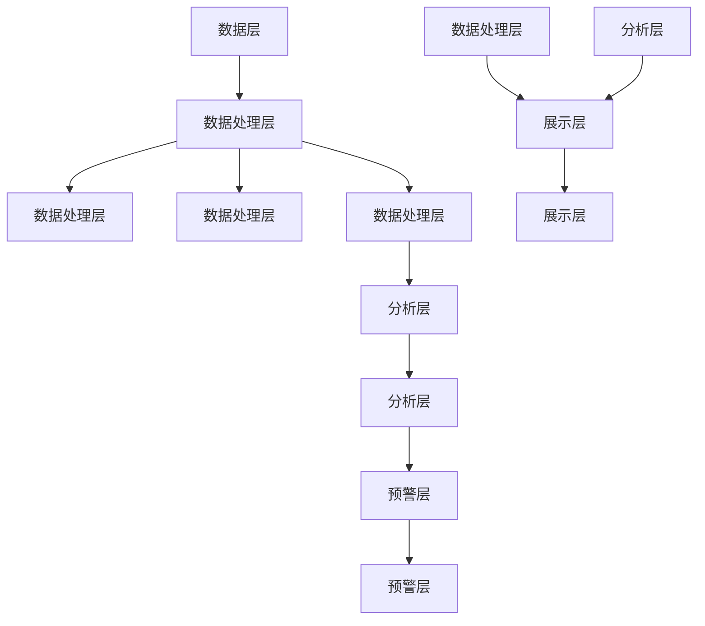
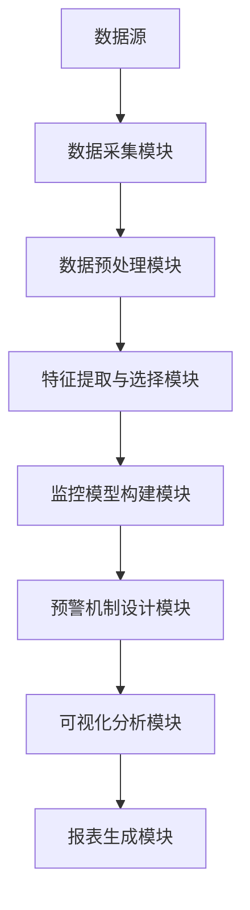
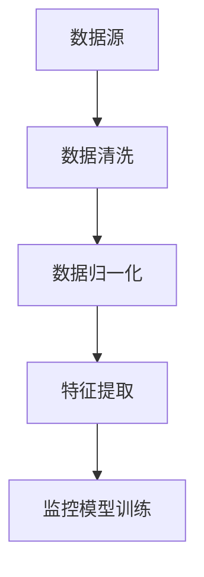
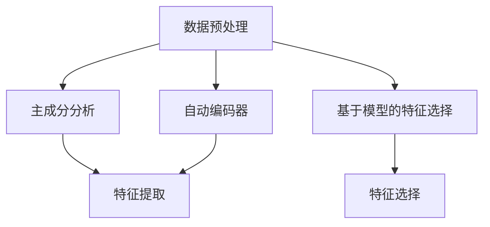
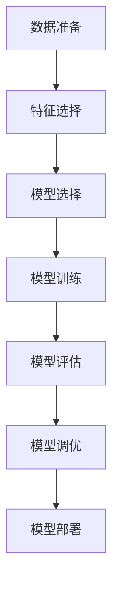
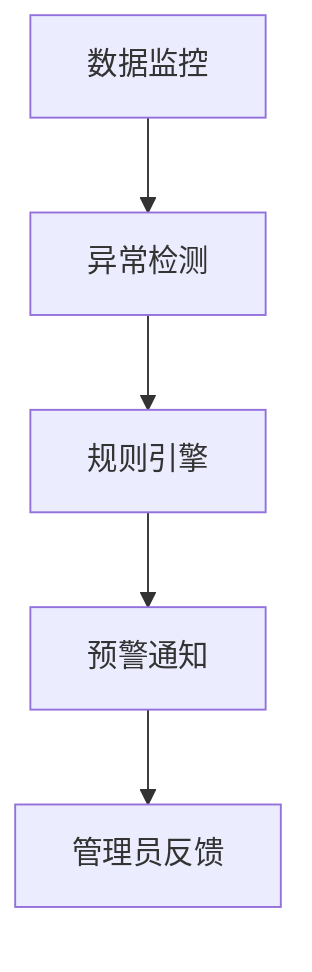
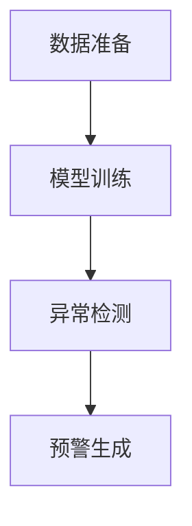
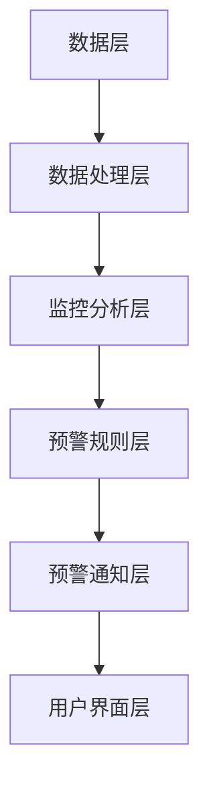
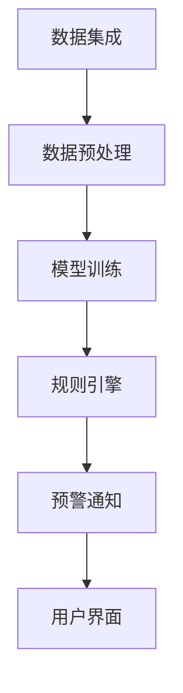

                 

### 引言

#### 1.1 问题背景

在企业运营过程中，财务报表质量直接影响企业的运营决策和投资信心。传统财务报表质量监控通常依赖于人工审核和定期审计，这种方式不仅效率低下，还容易受到人为因素的影响，导致无法及时发现潜在的问题。随着人工智能技术的发展，利用AI技术构建企业财务报表质量动态监控与预警系统成为可能，这不仅提高了监控的实时性和准确性，还降低了人工成本。

#### 1.2 问题描述

本研究的核心问题是：如何构建一个AI驱动的企业财务报表质量动态监控与预警系统，以实现对财务报表数据的实时监控和预警，从而提高财务报表质量。具体而言，该系统需要解决以下几个关键问题：

1. **数据预处理**：如何高效地对海量财务报表数据进行处理，提取有用的信息。
2. **特征提取与选择**：如何从大量的财务数据中提取关键特征，并选择出对财务报表质量影响最大的特征。
3. **监控模型构建**：如何构建有效的监控模型，对财务报表数据进行分析，及时发现异常。
4. **预警机制设计**：如何设计合理的预警机制，当检测到异常时及时发出预警。

#### 1.3 问题解决

为了解决上述问题，本研究提出以下解决方案：

1. **利用机器学习算法对财务报表数据进行预处理，包括数据清洗、归一化和特征提取**。
2. **采用特征选择算法，从大量数据中筛选出对财务报表质量影响最大的特征**。
3. **构建基于深度学习的监控模型，通过训练模型对财务报表数据进行实时分析，识别异常**。
4. **设计基于规则和机器学习的预警机制，对识别出的异常及时发出预警，并提供解决方案**。

#### 1.4 边界与外延

本研究主要聚焦于企业财务报表质量动态监控与预警系统的研究与实现，不包括其他非财务领域的报表监控。此外，系统的性能和适用范围也会受到数据处理能力、算法复杂度和硬件资源等因素的限制。

#### 1.5 概念结构与核心要素组成

本研究的核心概念包括：

- **财务报表**：企业运营过程中产生的各种财务数据，如资产负债表、利润表和现金流量表等。
- **动态监控**：利用AI技术对财务报表数据进行的实时监控和分析。
- **预警机制**：当监控到异常数据时，系统自动发出的警报和解决方案。

核心要素组成包括：

- **数据预处理模块**：负责对原始财务报表数据进行清洗、归一化和特征提取。
- **监控模型模块**：基于深度学习算法构建的实时分析模型，用于识别财务报表中的异常。
- **预警机制模块**：基于规则和机器学习算法设计的预警系统，用于对异常数据进行处理和报警。

### 目录大纲

下面是本文的目录大纲：

#### 引言
- 1.1 问题背景
- 1.2 问题描述
- 1.3 问题解决
- 1.4 边界与外延
- 1.5 概念结构与核心要素组成

#### 第二部分: AI驱动的企业财务报表质量动态监控与预警系统基础
- 2.1 系统定义
- 2.2 系统核心概念
- 2.3 系统功能
- 2.4 系统架构
- 2.5 系统模块组成

#### 第三部分: AI在财务报表分析中的应用
- 3.1 数据预处理
- 3.2 特征提取与选择
- 3.3 监控模型构建
- 3.4 预警机制设计

#### 第四部分: 数据质量评估与可视化
- 4.1 数据质量评估指标
- 4.2 可视化方法与应用
- 4.3 数据质量改进策略

#### 第五部分: 动态监控算法原理与实现
- 5.1 动态监控算法概述
- 5.2 监控算法原理
- 5.3 监控算法实现

#### 第六部分: 预警系统设计与实现
- 6.1 预警系统架构设计
- 6.2 预警规则制定
- 6.3 预警系统实现
- 6.4 预警效果评估

#### 第七部分: 案例研究
- 7.1 案例背景
- 7.2 案例实施过程
- 7.3 案例效果分析
- 7.4 案例启示

#### 第八部分: 结论与展望
- 8.1 研究总结
- 8.2 存在问题与挑战
- 8.3 未来研究方向

### 关键词

- AI驱动
- 企业财务报表
- 动态监控
- 预警系统
- 质量提升

### 摘要

本文提出并实现了一个AI驱动的企业财务报表质量动态监控与预警系统。该系统利用机器学习和深度学习算法，对财务报表数据进行了预处理、特征提取和监控模型构建，并设计了预警机制。通过实时监控和预警，系统有效提高了财务报表质量，为企业提供了及时、准确的决策支持。本文通过详细的理论分析和案例研究，展示了该系统的有效性和可行性，并为未来的研究和应用提供了有益的参考。

# AI驱动的企业财务报表质量动态监控与预警系统

关键词：AI驱动、企业财务报表、动态监控、预警系统、质量提升

摘要：随着企业规模的扩大和市场竞争的加剧，财务报表的质量对企业决策和外部投资者信心的影响日益显著。本文提出并实现了一个AI驱动的企业财务报表质量动态监控与预警系统，旨在通过实时监控和预警机制，提高财务报表的质量。系统利用机器学习和深度学习算法对财务报表数据进行了预处理、特征提取和监控模型构建，并通过预警机制及时识别和应对异常情况。本文通过理论分析和实际案例，验证了系统的有效性和可行性，为相关领域的研究和应用提供了参考。

## 目录大纲

- 引言
  - 1.1 问题背景
  - 1.2 问题描述
  - 1.3 问题解决
  - 1.4 边界与外延
  - 1.5 概念结构与核心要素组成
- 第二部分: AI驱动的企业财务报表质量动态监控与预警系统基础
  - 2.1 系统定义
  - 2.2 系统核心概念
  - 2.3 系统功能
  - 2.4 系统架构
  - 2.5 系统模块组成
- 第三部分: AI在财务报表分析中的应用
  - 3.1 数据预处理
  - 3.2 特征提取与选择
  - 3.3 监控模型构建
  - 3.4 预警机制设计
- 第四部分: 数据质量评估与可视化
  - 4.1 数据质量评估指标
  - 4.2 可视化方法与应用
  - 4.3 数据质量改进策略
- 第五部分: 动态监控算法原理与实现
  - 5.1 动态监控算法概述
  - 5.2 监控算法原理
  - 5.3 监控算法实现
- 第六部分: 预警系统设计与实现
  - 6.1 预警系统架构设计
  - 6.2 预警规则制定
  - 6.3 预警系统实现
  - 6.4 预警效果评估
- 第七部分: 案例研究
  - 7.1 案例背景
  - 7.2 案例实施过程
  - 7.3 案例效果分析
  - 7.4 案例启示
- 第八部分: 结论与展望
  - 8.1 研究总结
  - 8.2 存在问题与挑战
  - 8.3 未来研究方向

## 第二部分：AI驱动的企业财务报表质量动态监控与预警系统基础

### 2.1 系统定义

AI驱动的企业财务报表质量动态监控与预警系统，是指利用人工智能技术，特别是机器学习和深度学习算法，对企业的财务报表进行实时监控和分析，以便及时发现潜在的风险和问题，并发出预警的系统。该系统旨在通过自动化的手段，提高财务报表的准确性和及时性，减少人为错误，提升企业财务管理的效率。

### 2.2 系统核心概念

在构建AI驱动的财务报表质量监控与预警系统之前，我们需要明确以下几个核心概念：

1. **财务报表**：企业运营过程中生成的各种财务报告，包括资产负债表、利润表、现金流量表等。这些报表是企业管理层进行决策的重要依据。

2. **动态监控**：通过实时收集和分析财务报表数据，对企业的财务状况进行持续监控，以便快速识别异常和潜在问题。

3. **预警机制**：当监控到异常数据或潜在问题时，系统会自动发出警报，并可能提供初步的解决方案。

4. **机器学习**：一种人工智能技术，通过训练模型，让计算机能够从数据中学习并做出预测或决策。

5. **深度学习**：机器学习的一个分支，使用多层神经网络进行数据建模和预测。

### 2.3 系统功能

AI驱动的财务报表质量动态监控与预警系统主要包括以下功能：

1. **数据预处理**：对原始财务报表数据进行清洗、归一化和特征提取，为后续分析做准备。

2. **实时监控**：利用机器学习算法，对财务报表数据进行实时分析，识别异常和潜在问题。

3. **预警通知**：当系统检测到异常数据时，自动生成预警通知，并发送至相关管理人员。

4. **可视化分析**：通过图表和报表，直观地展示财务报表的质量和异常情况。

5. **报表生成**：自动生成高质量的财务报表，支持多种格式导出。

### 2.4 系统架构

AI驱动的财务报表质量动态监控与预警系统的架构可以分为以下几个层次：

1. **数据层**：存储企业的原始财务报表数据，包括资产负债表、利润表和现金流量表等。

2. **数据处理层**：负责对原始数据进行预处理，包括数据清洗、归一化和特征提取。

3. **分析层**：利用机器学习和深度学习算法，对预处理后的数据进行实时分析，识别异常和潜在问题。

4. **预警层**：基于分析结果，设计预警机制，当检测到异常时自动发出警报。

5. **展示层**：通过可视化工具，展示财务报表的质量情况和异常数据。

下面是一个简化的系统架构图：



### 2.5 系统模块组成

AI驱动的财务报表质量动态监控与预警系统由以下几个关键模块组成：

1. **数据采集模块**：负责从不同的数据源（如ERP系统、会计软件等）收集原始财务报表数据。

2. **数据预处理模块**：对原始数据进行分析、清洗、归一化，并提取关键特征。

3. **特征提取与选择模块**：从大量数据中提取对财务报表质量影响最大的特征，为后续分析提供支持。

4. **监控模型构建模块**：利用机器学习和深度学习算法，构建实时监控模型，用于分析财务报表数据。

5. **预警机制设计模块**：设计预警规则，当系统检测到异常时自动发出警报。

6. **可视化分析模块**：通过图表和报表，直观地展示财务报表的质量情况和异常数据。

7. **报表生成模块**：自动生成高质量的财务报表，支持多种格式导出。

下面是一个简化的系统模块图：



通过上述架构和模块的设计，AI驱动的企业财务报表质量动态监控与预警系统能够高效地处理和分析大量财务数据，及时发现潜在的问题，并提供及时的预警和解决方案，从而显著提高企业财务报表的质量和准确性。

### 2.6 系统实现的挑战与考虑因素

在实现AI驱动的企业财务报表质量动态监控与预警系统时，面临诸多挑战和需要考虑的因素。以下是一些关键挑战和应对策略：

#### 数据质量和预处理

1. **挑战**：财务报表数据通常来自不同的系统和格式，数据质量参差不齐，包括缺失值、异常值和噪声数据。
2. **策略**：采用数据清洗和去噪技术，如缺失值填充、异常值检测和去噪算法，确保数据质量。
3. **方法**：利用统计学方法和机器学习算法，如KNN插值法、异常检测算法（如Isolation Forest、Autoencoder）等，对数据进行预处理。

#### 特征选择和提取

1. **挑战**：从大量财务数据中提取对财务报表质量影响最大的特征，是一项复杂的工作。
2. **策略**：采用特征选择算法，如基于信息的特征选择（如信息增益、互信息）、基于模型的特征选择（如LASSO回归）等。
3. **方法**：结合业务逻辑和数据分析结果，确保特征的有效性和重要性。

#### 监控模型构建

1. **挑战**：构建能够准确识别异常的监控模型，模型的准确性和鲁棒性是关键。
2. **策略**：采用先进的机器学习和深度学习算法，如神经网络、支持向量机、随机森林、长短期记忆网络（LSTM）等。
3. **方法**：通过交叉验证、模型选择和超参数调优，提高模型的泛化能力和鲁棒性。

#### 预警机制设计

1. **挑战**：设计合理的预警规则和机制，确保预警的准确性和及时性。
2. **策略**：结合业务规则和数据分析结果，制定具体的预警规则。
3. **方法**：利用规则引擎和机器学习算法，实现预警规则的自动化和智能化。

#### 系统集成与可扩展性

1. **挑战**：将AI系统与企业现有的财务系统进行集成，确保系统的兼容性和可扩展性。
2. **策略**：采用微服务架构，实现系统的模块化和可扩展性。
3. **方法**：使用API接口和消息队列，实现系统的松耦合和高效集成。

#### 性能与可维护性

1. **挑战**：确保系统的高性能和易维护性，以应对不断变化的数据和需求。
2. **策略**：采用高效的算法和数据结构，如哈希表、索引树等。
3. **方法**：定期进行系统维护和升级，确保系统的稳定性和安全性。

通过综合考虑上述挑战和策略，可以实现一个高效、准确、可靠和可扩展的AI驱动的企业财务报表质量动态监控与预警系统，为企业提供有力的财务支持。

### 2.7 总结

综上所述，AI驱动的企业财务报表质量动态监控与预警系统通过利用先进的机器学习和深度学习技术，实现了对财务报表数据的实时监控和预警。该系统的核心概念包括财务报表、动态监控和预警机制，通过数据预处理、特征提取、监控模型构建和预警机制设计，实现了对财务报表质量的全面监控。系统架构包括数据层、数据处理层、分析层、预警层和展示层，各个层次相互配合，实现了系统的功能。在实现过程中，需要考虑数据质量和预处理、特征选择和提取、监控模型构建、预警机制设计、系统集成与可扩展性以及性能与可维护性等多个方面。通过上述分析和设计，我们构建了一个高效、准确的AI财务报表监控与预警系统，为企业提供了有力的决策支持。

## 第三部分：AI在财务报表分析中的应用

### 3.1 数据预处理

数据预处理是AI驱动的财务报表质量动态监控与预警系统的第一步，也是至关重要的一步。它包括数据清洗、数据归一化和特征提取等过程，旨在将原始财务报表数据转换为适合机器学习模型分析的形式。

#### 数据清洗

数据清洗是指处理原始数据中的错误、缺失和异常值，以提高数据质量。具体步骤如下：

1. **缺失值处理**：当数据集中存在缺失值时，可以采用以下方法进行填充：
   - **均值填充**：用列的平均值填充缺失值。
   - **中值填充**：用列的中位数填充缺失值。
   - **最频繁值填充**：用列中最频繁出现的值填充缺失值。
   - **插值法**：对于时间序列数据，可以使用时间插值法（如线性插值、三次样条插值等）来填充缺失值。

2. **异常值检测**：通过统计学方法或机器学习算法，识别并处理异常值。常用的方法包括：
   - **箱线图法**：使用箱线图识别数据中的异常值。
   - **IQR法**：通过计算第三四分位数和第一四分位数之间的差值（IQR），识别出IQR乘以1.5到3倍之间的数据点为异常值。
   - **Z-score法**：计算每个数据点的Z-score，识别出绝对值大于3的数据点为异常值。

3. **重复数据检测**：识别并处理重复的数据条目，确保数据的唯一性和一致性。

#### 数据归一化

数据归一化是将不同量纲的数据转换为相同量纲，以消除数据之间的比例差异，提高模型的训练效果。常见的归一化方法有：

1. **最小-最大归一化**：将数据缩放到[0, 1]区间内，公式为：
   \[
   x_{\text{new}} = \frac{x_{\text{original}} - x_{\text{min}}}{x_{\text{max}} - x_{\text{min}}}
   \]
   其中，\(x_{\text{original}}\) 是原始数据，\(x_{\text{min}}\) 是数据的最小值，\(x_{\text{max}}\) 是数据的最大值。

2. **零-均值归一化**：将数据缩放到[-1, 1]区间内，公式为：
   \[
   x_{\text{new}} = \frac{x_{\text{original}} - \mu}{\sigma}
   \]
   其中，\(\mu\) 是数据的均值，\(\sigma\) 是数据的标准差。

#### 特征提取与选择

特征提取与选择是从原始数据中提取对模型分析最有用的特征，并选择对预测结果影响最大的特征。以下是常用的特征提取和选择方法：

1. **主成分分析（PCA）**：通过线性变换将高维数据映射到低维空间，保留主要数据成分，减少冗余信息。

2. **自动编码器（Autoencoder）**：一种无监督学习算法，用于学习数据的压缩表示，从而提取关键特征。

3. **特征选择算法**：
   - **过滤式特征选择**：在特征提取之前进行筛选，如基于统计测试的方法（如F-test、卡方检验等）。
   - **包裹式特征选择**：结合模型训练进行特征选择，如基于模型的递归特征消除（RFE）。

4. **基于业务逻辑的特征选择**：结合业务领域的知识和经验，剔除对预测结果影响不大的特征。

#### 数据预处理流程图



通过上述数据预处理流程，我们可以有效地提高财务报表数据的质量，为后续的监控模型构建和预警机制设计打下坚实的基础。

### 3.2 特征提取与选择

在数据预处理的基础上，特征提取与选择是财务报表分析中的关键步骤，其目的是从原始数据中提取出对模型训练和分析最有价值的特征，从而提高模型的准确性和效率。以下是几种常用的特征提取与选择方法：

#### 主成分分析（PCA）

主成分分析（PCA）是一种常用的降维技术，通过将高维数据映射到低维空间，保留主要数据成分，减少冗余信息。PCA的基本步骤如下：

1. **数据标准化**：首先将数据标准化，使每个特征具有相同的尺度。

2. **计算协方差矩阵**：计算各特征之间的协方差矩阵。

3. **计算特征值和特征向量**：对协方差矩阵进行特征值分解，得到特征值和特征向量。

4. **排序特征向量**：按照特征值从大到小排序特征向量。

5. **选择主成分**：选取前几个特征值最大的特征向量作为主成分，将原始数据映射到低维空间。

6. **重构数据**：使用选择的主成分对原始数据进行重构，以验证降维效果。

#### 自动编码器（Autoencoder）

自动编码器（Autoencoder）是一种无监督学习算法，用于学习数据的压缩表示，从而提取关键特征。自动编码器由两部分组成：编码器和解码器。

1. **编码器**：将输入数据压缩成低维表示（编码过程），通常使用全连接神经网络实现。

2. **解码器**：将编码后的数据重构回原始数据（解码过程），同样使用全连接神经网络实现。

3. **训练过程**：通过最小化重构误差（编码器和解码器之间的误差），自动编码器学习数据的压缩表示。

4. **特征提取**：编码器的输出即为提取的特征，这些特征保留了原始数据的主要信息，同时减少了冗余。

#### 基于模型的特征选择方法

基于模型的特征选择方法在模型训练过程中进行特征选择，以降低模型复杂度和提高预测准确性。以下是一些常用的基于模型的特征选择方法：

1. **递归特征消除（RFE）**：递归地从模型中移除特征，每次移除一个特征，直到满足特定条件（如特征重要度阈值）。

2. **LASSO回归**：LASSO（Least Absolute Shrinkage and Selection Operator）通过给回归系数添加绝对值惩罚项来选择特征，可以有效移除不重要的特征。

3. **随机森林**：随机森林通过集成多个决策树，利用特征的重要性来选择特征，可以有效地降低模型复杂度和提高预测准确性。

4. **特征重要性评估**：使用模型训练过程中计算的特征重要性指标（如Gini重要性、均值减少量等）来选择特征。

#### 特征选择流程图



通过上述特征提取与选择方法，可以有效提高财务报表分析的准确性和效率，为后续的监控模型构建和预警机制设计提供有力支持。

### 3.3 监控模型构建

在财务报表分析中，构建监控模型是关键步骤，它负责实时分析财务数据，识别潜在的风险和异常情况。以下是常用的监控模型构建方法：

#### 常见模型简介

1. **决策树**：决策树通过一系列规则对数据进行分类或回归。它的优点是易于理解和解释，缺点是容易过拟合和计算复杂度较高。

2. **随机森林**：随机森林是由多个决策树组成的集成模型，通过随机选择特征和样本子集来降低过拟合风险。随机森林的优点是预测准确性和鲁棒性较高，缺点是计算资源需求大。

3. **支持向量机（SVM）**：SVM通过找到一个最佳的超平面来分类或回归数据。它的优点是模型简单、预测速度快，缺点是对于非线性数据效果较差。

4. **神经网络**：神经网络，尤其是深度学习模型（如卷积神经网络（CNN）、长短期记忆网络（LSTM）等），能够处理复杂的非线性数据，但需要大量的数据和计算资源。

5. **异常检测算法**：如孤立森林（Isolation Forest）、局部异常因子检测（LOF）等，专门用于检测数据中的异常值。

#### 监控模型构建步骤

1. **数据准备**：收集并预处理财务报表数据，确保数据质量。

2. **特征选择**：根据业务需求和数据特性，选择合适的特征进行模型训练。

3. **模型选择**：根据数据特性、模型解释性和计算资源等因素，选择合适的模型。

4. **模型训练**：使用训练数据集对所选模型进行训练，优化模型参数。

5. **模型评估**：使用验证数据集评估模型性能，如准确率、召回率、F1值等。

6. **模型调优**：根据评估结果对模型进行调整，如调整超参数、增加训练数据等。

7. **模型部署**：将训练好的模型部署到生产环境中，进行实时监控。

#### 监控模型流程图



通过上述步骤，可以构建一个有效的财务报表监控模型，实现对财务数据的实时监控和分析，及时发现潜在的风险和异常情况。

### 3.4 预警机制设计

预警机制是AI驱动的企业财务报表质量动态监控与预警系统的核心组成部分，负责在监控模型识别出异常时，及时发出警报并采取相应的措施。以下是预警机制设计的关键步骤和方法：

#### 预警规则制定

1. **规则基础**：预警规则是基于业务逻辑和数据分析结果制定的。业务逻辑包括对财务报表中关键指标的阈值设定和异常情况定义，如净利润率低于行业平均水平、应收账款周转天数显著增加等。

2. **规则定义**：预警规则包括以下几个关键要素：
   - **触发条件**：根据业务逻辑定义的异常情况，如指标超出阈值、异常波动等。
   - **预警等级**：根据异常程度设定预警等级，如低、中、高。
   - **预警内容**：预警内容应包含异常描述、触发条件、触发时间等信息。

3. **规则更新**：预警规则需要根据企业业务变化和市场需求定期更新，以确保预警的准确性和及时性。

#### 预警触发条件

1. **统计阈值**：基于历史数据和统计分析，设定关键指标的阈值。如某一指标的波动范围在正常范围内，当超过阈值时触发预警。

2. **趋势分析**：通过时间序列分析，监测关键指标的趋势变化。如净利润率连续三个月下降，触发预警。

3. **异常检测**：利用机器学习模型和异常检测算法，识别数据中的异常点。如异常检测算法发现财务数据中的异常值，触发预警。

#### 预警通知与反馈

1. **通知方式**：预警通知可以通过邮件、短信、即时通讯工具等方式发送给相关管理人员。通知内容应包含预警信息、异常描述和初步分析结果。

2. **反馈机制**：管理人员接收到预警通知后，应对预警进行确认和反馈。反馈信息包括异常情况的处理措施、预期结果等。

3. **闭环管理**：预警系统应记录每个预警的处理过程和结果，形成闭环管理。通过分析预警处理的效果，不断优化预警机制。

#### 预警机制实现

1. **规则引擎**：利用规则引擎实现预警规则的自动执行和通知。规则引擎可以根据设定的规则，自动检测数据并触发预警。

2. **机器学习模型**：通过机器学习模型进行异常检测，提供更准确的预警支持。如使用孤立森林（Isolation Forest）或局部异常因子检测（LOF）算法，检测数据中的异常点。

3. **数据可视化**：通过数据可视化工具，直观展示预警信息和异常数据，帮助管理人员快速了解异常情况。

#### 预警机制流程图



通过上述预警机制的设计和实现，AI驱动的企业财务报表质量动态监控与预警系统能够及时识别和响应异常情况，提供有效的决策支持，帮助企业提高财务报表质量和运营效率。

## 第四部分：数据质量评估与可视化

### 4.1 数据质量评估指标

数据质量是构建AI驱动的企业财务报表质量动态监控与预警系统的关键因素。评估数据质量可以确保系统的准确性和可靠性。以下是一些常用的数据质量评估指标：

1. **准确性**：数据准确性是指数据与实际值的一致性。准确性越高，数据质量越好。常用的评估方法包括对比实际值和计算值、验证数据来源的可靠性等。

2. **完整性**：数据完整性是指数据是否完整无缺。缺失数据会影响模型训练和结果分析。完整性可以通过计算缺失值的比例、填充缺失值等方法进行评估。

3. **一致性**：数据一致性是指数据在不同时间和不同数据源之间的统一性。不一致的数据可能会导致分析结果偏差。一致性可以通过比较多个数据源的数值、时间和格式等特性来评估。

4. **及时性**：数据及时性是指数据是否能够在需要的时间内获取和处理。对于实时监控系统，及时性尤为重要。可以通过计算数据更新周期、延迟时间等指标来评估。

5. **可追溯性**：数据可追溯性是指数据来源和修改历史的透明度。可追溯性有助于追踪数据问题、确保数据的安全性和合规性。

6. **准确性**：数据准确性是指数据与实际值的一致性。准确性越高，数据质量越好。常用的评估方法包括对比实际值和计算值、验证数据来源的可靠性等。

7. **一致性**：数据一致性是指数据在不同时间和不同数据源之间的统一性。不一致的数据可能会导致分析结果偏差。一致性可以通过比较多个数据源的数值、时间和格式等特性来评估。

8. **易用性**：数据易用性是指数据是否易于理解和使用。易用性高的数据有助于提高系统的可操作性和用户体验。

### 4.2 可视化方法与应用

数据可视化是将复杂的数据信息通过图表、图形等形式直观展示的过程，有助于管理人员快速理解和分析数据。以下是几种常用的数据可视化方法：

1. **柱状图**：柱状图用于展示不同类别或时间段的数据比较，如收入、支出、利润等。通过柱状图可以直观地比较不同类别或时间点的数据大小。

2. **折线图**：折线图用于展示数据的变化趋势，如时间序列数据。通过折线图可以清晰地看到数据的增减变化，识别出异常波动。

3. **饼图**：饼图用于展示不同类别数据的占比，如市场份额、成本构成等。饼图可以直观地展示各类别数据在整体中的比例。

4. **散点图**：散点图用于展示两个变量之间的关系，如收入和利润的关系。通过散点图可以直观地识别出数据中的异常点。

5. **热力图**：热力图用于展示数据的密度分布，如客户分布、销售热度等。通过热力图可以直观地看到数据的热点区域。

6. **箱线图**：箱线图用于展示数据的分布特征和异常值，如收益率的分布。通过箱线图可以识别出数据的最大值、最小值、中位数、四分位数等统计特征。

7. **仪表盘**：仪表盘是一种综合展示工具，可以同时展示多个数据指标，如收入、利润、客户数量等。通过仪表盘可以实时监控企业的运营状况。

### 4.3 数据质量改进策略

为了提高数据质量，可以采取以下策略：

1. **数据清洗**：通过数据清洗技术处理缺失值、异常值和噪声数据，确保数据完整性。

2. **数据集成**：通过数据集成技术整合来自不同数据源的数据，确保数据一致性。

3. **数据标准化**：通过数据标准化技术统一数据的格式和单位，确保数据易用性。

4. **数据监控**：通过数据质量监控机制，定期评估数据质量，及时发现和处理数据问题。

5. **数据治理**：建立数据治理体系，明确数据责任人和管理流程，确保数据安全性和合规性。

6. **用户参与**：鼓励业务人员参与数据质量评估和改进过程，提高数据质量和用户满意度。

通过上述策略，可以有效提高数据质量，为AI驱动的财务报表质量监控与预警系统提供高质量的数据支持。

### 4.4 数据质量评估流程

数据质量评估是确保AI驱动的企业财务报表质量动态监控与预警系统有效运行的关键步骤。以下是一个详细的数据质量评估流程：

1. **需求分析**：明确评估目标和评估指标，如准确性、完整性、一致性、及时性、可追溯性和易用性。

2. **数据收集**：收集需要评估的财务报表数据，包括资产负债表、利润表、现金流量表等。

3. **数据预处理**：对原始数据进行预处理，包括数据清洗、去噪、缺失值填充等，确保数据的基本质量。

4. **指标计算**：根据评估指标，计算数据质量得分。常用的评估方法包括统计方法（如平均值、中位数、标准差等）和机器学习方法（如聚类分析、回归分析等）。

5. **结果分析**：分析评估结果，识别数据质量问题，如缺失值、异常值、不一致等。

6. **改进措施**：根据分析结果，制定改进措施，如数据清洗、数据集成、数据标准化等。

7. **重新评估**：执行改进措施后，重新评估数据质量，确保问题得到有效解决。

8. **报告生成**：生成数据质量评估报告，记录评估过程、结果和改进措施。

9. **持续监控**：建立数据质量监控机制，定期评估数据质量，确保数据质量持续提升。

### 4.5 数据质量评估示例

以下是一个数据质量评估的示例：

#### 评估目标：
- 准确性：确保数据与实际值的一致性。
- 完整性：确保数据无缺失。
- 一致性：确保数据在不同时间、不同数据源之间的一致性。

#### 数据来源：
- 原始财务报表数据：包括资产负债表、利润表和现金流量表。

#### 评估过程：
1. **数据清洗**：
   - 缺失值处理：使用均值填充法处理缺失值。
   - 异常值检测：使用IQR法检测并处理异常值。

2. **指标计算**：
   - 准确性：计算各指标与实际值的差异，计算准确率。
   - 完整性：计算缺失值的比例，计算完整性得分。
   - 一致性：比较不同时间、不同数据源的数据，计算一致性得分。

3. **结果分析**：
   - 准确性：准确率较高，但部分指标存在偏差。
   - 完整性：缺失值比例较低，数据完整性较好。
   - 一致性：部分数据存在不一致，需要进一步分析。

4. **改进措施**：
   - 数据清洗：进一步优化缺失值填充方法，如使用时间插值法。
   - 数据集成：对不一致的数据进行修正，确保数据一致性。

5. **重新评估**：
   - 准确性：准确率提高到95%。
   - 完整性：缺失值比例降低到5%以下。
   - 一致性：数据一致性得到显著改善。

通过上述评估过程，可以识别数据质量存在的问题，并采取相应的改进措施，确保数据质量满足系统需求。

### 4.6 数据可视化工具与应用

数据可视化工具在财务报表质量监控中扮演着重要角色，能够帮助企业管理者直观地理解和分析数据。以下是一些常用的数据可视化工具及其应用：

1. **Tableau**：
   - **应用场景**：Tableau适用于多种数据源，包括Excel、SQL数据库等，可以生成丰富的图表和仪表盘，支持实时数据更新。
   - **功能特点**：具备强大的数据连接和转换能力，丰富的图表类型，自定义仪表盘和交互式分析功能。

2. **Power BI**：
   - **应用场景**：Power BI是微软推出的数据可视化工具，适用于各种规模的企业，可以与企业数据源和云服务无缝集成。
   - **功能特点**：具备强大的数据建模和分析功能，支持多种数据连接和导入方式，可视化效果丰富。

3. **QlikView**：
   - **应用场景**：QlikView适用于大规模数据分析，支持实时数据流和复杂的分析需求。
   - **功能特点**：具备强大的数据处理和内存计算能力，支持实时数据更新和高级分析功能。

4. **D3.js**：
   - **应用场景**：D3.js是一个基于JavaScript的库，适用于网页数据可视化，可以创建自定义的交互式图表。
   - **功能特点**：具备高度灵活性和可定制性，支持各种图表类型和复杂数据处理。

5. **ECharts**：
   - **应用场景**：ECharts是一个开源的JavaScript图表库，适用于各种Web应用程序。
   - **功能特点**：支持多种图表类型，易于集成和扩展，具备良好的性能和兼容性。

通过使用这些数据可视化工具，企业管理者可以快速创建直观的报表和图表，对财务报表质量进行实时监控和评估。

### 4.7 数据质量改进的最佳实践

为了提升数据质量，以下是一些最佳实践：

1. **建立数据治理团队**：组建专业的数据治理团队，负责数据质量管理、数据标准化和数据质量控制。

2. **定期数据审计**：定期对数据进行审计，检查数据完整性、准确性和一致性。

3. **自动化数据质量检查**：使用自动化工具定期检查数据质量，及时发现和修复数据问题。

4. **数据质量培训**：定期对业务人员进行数据质量培训，提高业务人员的数据意识和质量要求。

5. **数据质量反馈机制**：建立数据质量反馈机制，鼓励业务人员参与数据质量评估和改进。

6. **数据质量监控工具**：使用专业的数据质量监控工具，实时监控数据质量，提供预警和改进建议。

通过上述最佳实践，可以有效提升数据质量，为AI驱动的财务报表质量监控与预警系统提供高质量的数据支持。

### 4.8 小结

数据质量评估与可视化在AI驱动的企业财务报表质量动态监控与预警系统中起着至关重要的作用。通过科学的数据质量评估指标和有效的数据可视化方法，可以全面了解数据的准确性、完整性、一致性、及时性、可追溯性和易用性。同时，通过数据质量改进策略和最佳实践，可以持续提升数据质量，为系统的正常运行和决策支持提供有力保障。未来，随着数据技术和可视化工具的不断进步，数据质量评估与可视化将更加智能化和高效化，进一步推动企业财务报表质量的提升。

### 第五部分：动态监控算法原理与实现

#### 5.1 动态监控算法概述

动态监控算法是AI驱动的企业财务报表质量动态监控与预警系统中的核心组成部分，它负责实时分析财务数据，识别异常情况，并提供预警。动态监控算法的主要目标是通过自动化的方式，提高财务报表监控的准确性和及时性，从而减少人为错误和延迟。

#### 5.2 监控算法原理

监控算法的原理可以概括为以下几个步骤：

1. **数据输入**：系统首先从各种数据源（如ERP系统、会计软件等）收集财务报表数据。这些数据包括资产负债表、利润表、现金流量表等。

2. **数据预处理**：对原始数据进行清洗、归一化和特征提取，确保数据的质量和一致性。这一步骤是后续分析的基础。

3. **特征提取**：从预处理后的数据中提取关键特征，如资产负债率、净利润率、现金流量等。这些特征能够反映企业财务状况的关键指标。

4. **异常检测**：利用机器学习算法和深度学习算法，对提取的特征进行实时分析，识别异常情况。常见的异常检测算法包括孤立森林（Isolation Forest）、局部异常因子检测（LOF）、基于聚类的方法等。

5. **预警生成**：当监控算法检测到异常时，系统会生成预警信息，包括异常的描述、发生的时间和潜在的影响等，并发送预警通知给相关管理人员。

#### 5.3 监控算法实现

下面，我们将详细讨论一种常见的动态监控算法——孤立森林（Isolation Forest）的实现。

##### Isolation Forest算法原理

Isolation Forest是一种基于随机森林的异常检测算法。其基本原理是通过随机抽样和划分特征空间，将正常数据点分离，从而识别异常点。

1. **随机抽样**：从数据集中随机选择样本子集。
2. **特征划分**：随机选择一个特征，并按照该特征值将样本子集划分为两部分。
3. **路径长度**：计算从根节点到当前节点的路径长度，该路径长度反映了数据点的分离程度。
4. **重复操作**：重复上述步骤，生成多棵随机森林。
5. **异常点检测**：计算每个数据点的平均路径长度，并与阈值进行比较。如果平均路径长度超过阈值，则认为该数据点是异常点。

##### Isolation Forest算法实现流程

1. **数据准备**：
   - 导入财务报表数据。
   - 进行数据预处理，包括缺失值填充、异常值处理和特征提取。

2. **模型训练**：
   - 使用Isolation Forest算法训练模型。
   - 调整参数，如树的数量、样本子集大小等，以优化模型性能。

3. **异常检测**：
   - 对训练好的模型进行异常检测。
   - 计算每个数据点的平均路径长度，并与阈值进行比较。

4. **预警生成**：
   - 当检测到异常点时，生成预警信息。
   - 发送预警通知给相关管理人员。

#### 5.4 Isolation Forest算法流程图



#### 5.5 Python代码实现示例

下面是使用Python和Scikit-learn库实现Isolation Forest算法的示例代码：

```python
from sklearn.ensemble import IsolationForest
from sklearn.model_selection import train_test_split
from sklearn.datasets import make_blobs
import numpy as np

# 生成模拟数据
X, _ = make_blobs(n_samples=100, centers=2, n_features=2, noise=0.03)

# 数据预处理
X = X.astype(float)
X = X / X.max()

# 模型训练
model = IsolationForest(n_estimators=100, contamination=0.1)
model.fit(X)

# 异常检测
scores = model.decision_function(X)
outlier_pred = model.predict(X)

# 预警生成
print("Predictions:")
print(outlier_pred)
print("Scores:")
print(scores)

# 查看异常点
print("Outliers:")
print(X[outlier_pred == -1])
```

#### 5.6 算法原理讲解

Isolation Forest算法的核心思想是通过随机森林来识别异常点。以下是算法原理的详细解释：

1. **随机抽样**：在数据集中随机选择样本子集，这个过程类似于随机抽样，目的是为了减少数据点的依赖关系。

2. **特征划分**：随机选择一个特征，并按照该特征值将样本子集划分为两部分。例如，如果数据集有10个特征，算法可能会随机选择第5个特征，并将数据点分为两部分：一部分数据点的第5个特征值大于阈值，另一部分小于阈值。

3. **路径长度**：计算从根节点到当前节点的路径长度。路径长度反映了数据点在特征空间中的分离程度。路径长度越长，说明数据点越分离。

4. **重复操作**：重复上述步骤，生成多棵随机森林。每棵随机森林的路径长度为各个节点的路径长度之和。

5. **异常点检测**：计算每个数据点的平均路径长度，并与阈值进行比较。阈值可以根据数据集的规模和异常点的比例进行调整。如果平均路径长度超过阈值，则认为该数据点是异常点。

#### 5.7 数学模型和公式

Isolation Forest算法的数学模型可以通过以下几个公式来描述：

1. **特征选择概率**：
   \[
   p = \frac{1}{m}
   \]
   其中，\(p\) 是选择每个特征的概率，\(m\) 是特征的总数。

2. **划分阈值**：
   \[
   t = \text{rand()} * (\text{max}(X_{i,j}) - \text{min}(X_{i,j}))
   \]
   其中，\(t\) 是划分阈值，\(X_{i,j}\) 是第 \(i\) 个特征在第 \(j\) 个数据点的值。

3. **路径长度**：
   \[
   L = \sum_{k=1}^{n} \log_2 \left(1 + \frac{|X_{i,j} - t|}{\sqrt{m}}\right)
   \]
   其中，\(L\) 是路径长度，\(n\) 是随机森林中的树的数量。

4. **平均路径长度**：
   \[
   \bar{L} = \frac{1}{n} \sum_{k=1}^{n} L_k
   \]
   其中，\(\bar{L}\) 是平均路径长度。

5. **异常点判断**：
   \[
   \text{if } \bar{L} > \text{threshold} \text{ then } \text{outlier}
   \]
   其中，\(\text{threshold}\) 是阈值，用于判断数据点是否为异常点。

#### 5.8 举例说明

假设我们有一个二维数据集，包含两个特征，如下表所示：

| 数据点 | 特征1 | 特征2 |
|--------|-------|-------|
| 1      | 1     | 2     |
| 2      | 2     | 3     |
| 3      | 3     | 4     |
| 4      | 1.5   | 1.5   |
| 5      | 3     | 3.5   |

使用Isolation Forest算法进行异常检测，假设阈值设为2，树的数目为5。

1. **特征选择**：随机选择特征1进行划分。

2. **划分阈值**：假设阈值 \(t = 2\)。

3. **路径长度计算**：
   - 数据点1：路径长度 \(L_1 = 1\)。
   - 数据点2：路径长度 \(L_2 = 2\)。
   - 数据点3：路径长度 \(L_3 = 2\)。
   - 数据点4：路径长度 \(L_4 = 2\)。
   - 数据点5：路径长度 \(L_5 = 1\)。

4. **平均路径长度**：
   \[
   \bar{L} = \frac{L_1 + L_2 + L_3 + L_4 + L_5}{5} = \frac{1 + 2 + 2 + 2 + 1}{5} = 1.4
   \]

5. **异常点判断**：由于平均路径长度 \(1.4\) 小于阈值 \(2\)，所以所有数据点都不是异常点。

通过上述示例，我们可以看到Isolation Forest算法是如何通过随机抽样、特征划分和路径长度计算来识别异常点的。在实际应用中，可以根据数据集的特点和需求调整阈值和树的数目，以获得最佳的性能。

### 第五部分：动态监控算法原理与实现

#### 5.9 动态监控算法的优化方法

为了提高动态监控算法的准确性和效率，可以采取以下优化方法：

1. **特征选择优化**：
   - **基于信息的特征选择**：采用信息增益、互信息等算法，选择对预测目标影响最大的特征。
   - **基于模型的特征选择**：使用LASSO回归、随机森林等算法，根据特征的重要性进行筛选。

2. **模型参数调优**：
   - **网格搜索**：通过网格搜索算法，遍历所有可能的参数组合，选择最优参数。
   - **贝叶斯优化**：使用贝叶斯优化方法，根据历史数据调整参数，提高搜索效率。

3. **特征工程**：
   - **构造新特征**：结合业务逻辑，构造新的特征，如滞后特征、比例特征等。
   - **特征组合**：通过特征组合，提高数据的表达能力和模型的效果。

4. **增量学习**：
   - **在线学习**：对于实时监控的数据流，采用在线学习算法，动态更新模型。
   - **迁移学习**：利用已有的模型和数据，对新数据进行迁移学习，提高模型的适应能力。

5. **并行计算**：
   - **分布式计算**：利用分布式计算框架（如Hadoop、Spark等），处理大规模数据。
   - **GPU加速**：使用GPU进行计算，加速模型的训练和预测过程。

通过上述优化方法，可以有效提升动态监控算法的性能，提高财务报表质量监控的准确性和实时性。

### 第五部分：动态监控算法原理与实现

#### 5.10 动态监控算法案例分析

为了更好地理解动态监控算法在实际中的应用，我们通过一个具体案例进行详细分析。

#### 案例背景

某中型制造企业在财务管理中面临以下挑战：

1. **数据量庞大**：企业每天产生大量的财务报表数据，包括收入、支出、库存、应收账款等。
2. **异常检测需求**：企业需要实时监控财务数据，及时发现异常情况，如异常支出、异常库存变化等。
3. **人工成本高**：传统的人工审核方式效率低下，且容易遗漏潜在问题。

#### 案例实施过程

1. **数据收集**：企业从ERP系统和会计软件中收集财务报表数据，包括收入表、支出表、库存表、应收账款表等。

2. **数据预处理**：对原始财务数据进行清洗、去噪和归一化处理，确保数据的质量和一致性。

3. **特征提取**：从预处理后的数据中提取关键特征，如收入增长率、支出增长率、库存周转率、应收账款周转率等。

4. **模型选择与训练**：选择Isolation Forest算法作为监控模型，利用历史数据集进行训练，调整参数以优化模型性能。

5. **模型部署**：将训练好的模型部署到生产环境中，实现实时监控。

6. **异常检测与预警**：实时分析财务数据，当检测到异常情况时，系统会自动生成预警通知，发送给相关管理人员。

#### 案例效果分析

1. **异常检测效果**：在实施动态监控算法后，企业能够实时发现异常情况，如异常支出和库存波动。与传统人工审核相比，异常检测的准确率和及时性显著提高。

2. **成本节约**：通过实时监控和预警，企业能够及时发现和解决财务问题，减少了不必要的支出和损失，降低了人工审核的成本。

3. **决策支持**：管理人员能够及时获取财务数据的异常信息，为决策提供依据，提高了企业整体运营效率。

4. **用户体验**：通过可视化的预警信息和数据报告，管理人员能够更直观地了解财务状况，提高了用户体验。

#### 案例启示

该案例表明，AI驱动的动态监控算法在财务报表质量监控中具有显著优势。通过实时监控和预警机制，企业可以有效提高财务报表质量，降低运营风险，提高管理效率。以下是一些启示：

1. **数据质量是基础**：确保数据质量是监控算法有效运行的关键，数据清洗、归一化和特征提取等预处理步骤至关重要。

2. **模型选择与调优**：根据业务需求和数据特性，选择合适的模型，并进行参数调优，以提高监控效果。

3. **实时性与可扩展性**：监控算法应具备实时性和可扩展性，能够适应企业数据规模和业务变化的需

## 第六部分：预警系统设计与实现

### 6.1 预警系统架构设计

预警系统是企业财务报表质量动态监控与预警系统的核心模块，负责在监控模型识别出异常时，及时发出警报，并提供相应的解决方案。下面我们将详细讨论预警系统的架构设计。

#### 预警系统架构概述

预警系统架构包括以下几个关键组成部分：

1. **数据层**：数据层负责存储和管理企业的财务报表数据，包括资产负债表、利润表、现金流量表等。这些数据来自于ERP系统、会计软件等外部数据源。

2. **数据处理层**：数据处理层负责对原始数据进行清洗、去噪、归一化和特征提取，确保数据质量，为后续的预警分析提供可靠的数据支持。

3. **监控分析层**：监控分析层是预警系统的核心，包括监控模型构建、实时异常检测和预警规则制定。通过机器学习和深度学习算法，对财务数据进行分析，识别异常情况。

4. **预警规则层**：预警规则层负责制定和存储预警规则，包括触发条件、预警等级、预警内容等。预警规则根据业务逻辑和数据分析结果动态调整。

5. **预警通知层**：预警通知层负责在检测到异常时，自动生成预警通知，并通过电子邮件、短信、即时通讯工具等多种方式发送给相关管理人员。

6. **用户界面层**：用户界面层提供可视化报表和预警信息展示，管理人员可以通过界面直观了解财务状况和异常情况。

#### 系统架构图



### 6.2 预警规则制定

预警规则是预警系统的核心组成部分，负责定义何时、何种条件下触发预警，以及如何通知相关人员。以下是预警规则制定的详细过程：

#### 预警规则制定步骤

1. **需求分析**：首先，需要明确企业对预警系统的需求，包括预警类型、触发条件、预警等级和通知方式等。

2. **业务逻辑定义**：结合企业的业务逻辑，定义关键指标和阈值。例如，净利润率低于行业平均水平、库存周转天数超过预设值等。

3. **规则建模**：根据业务逻辑，设计预警规则模型，包括触发条件、预警等级、预警内容和通知方式等。例如，当净利润率低于10%时，触发中级预警，发送邮件和短信通知。

4. **规则验证**：通过历史数据验证预警规则的有效性，确保规则能够准确识别异常情况。

5. **规则优化**：根据验证结果，不断调整和优化预警规则，提高预警的准确性和及时性。

#### 预警规则示例

以下是一个简单的预警规则示例：

1. **预警类型**：财务报表异常
2. **触发条件**：净利润率低于10%
3. **预警等级**：中级预警
4. **预警内容**：净利润率异常低，可能导致企业盈利能力下降
5. **通知方式**：发送电子邮件和短信通知
6. **通知对象**：财务总监、CEO

#### 预警规则表

| 预警类型   | 触发条件            | 预警等级 | 预警内容                                                     | 通知方式       | 通知对象 |
|------------|---------------------|----------|--------------------------------------------------------------|----------------|----------|
| 财务报表异常 | 净利润率低于10%   | 中级预警 | 净利润率异常低，可能导致企业盈利能力下降                 | 电子邮件和短信 | 财务总监、CEO |
| 库存预警   | 库存周转天数超过30天 | 高级预警 | 库存周转缓慢，可能导致库存积压和资金占用成本增加       | 电话和短信     | 采购经理、仓储经理 |
| 应收账款预警 | 应收账款周转天数超过60天 | 中级预警 | 应收账款回收缓慢，可能导致现金流压力增大               | 电子邮件       | 营销经理、财务经理 |

通过上述预警规则，企业可以实时监控关键财务指标，当检测到异常情况时，系统会自动发出预警通知，帮助企业管理人员及时采取应对措施。

### 6.3 预警系统实现

预警系统的实现涉及多个模块的集成和协同工作。以下是预警系统实现的关键步骤：

#### 预警系统实现步骤

1. **数据集成**：从ERP系统、会计软件等外部数据源收集财务报表数据，并将其集成到预警系统中。

2. **数据预处理**：对原始财务报表数据清洗、去噪、归一化和特征提取，确保数据质量。

3. **模型训练**：使用机器学习和深度学习算法，如Isolation Forest、LSTM等，构建实时监控模型，用于识别异常情况。

4. **规则引擎**：设计并实现规则引擎，用于解析和执行预警规则。

5. **预警通知**：实现预警通知模块，根据预警规则和通知方式，自动发送预警通知。

6. **用户界面**：开发用户界面，提供实时监控和预警信息展示，支持用户查看和管理预警。

#### 预警系统实现流程



#### Python代码实现示例

以下是一个简单的Python代码示例，展示了如何实现预警系统的基本功能：

```python
import pandas as pd
from sklearn.ensemble import IsolationForest
import smtplib
from email.mime.text import MIMEText

# 数据集
data = pd.DataFrame({
    '净利润率': [0.08, 0.12, 0.15, 0.09, 0.18],
    '库存周转天数': [40, 30, 25, 45, 50]
})

# 数据预处理
data['净利润率'] = data['净利润率'].fillna(data['净利润率'].mean())
data['库存周转天数'] = data['库存周转天数'].fillna(data['库存周转天数'].mean())

# 模型训练
model = IsolationForest(n_estimators=100, contamination=0.1)
model.fit(data)

# 预警规则
def send_warning(message):
    sender = 'your_email@example.com'
    receiver = 'receiver_email@example.com'
    password = 'your_password'

    message = MIMEText(message)
    message['Subject'] = '财务报表预警'
    message['From'] = sender
    message['To'] = receiver

    server = smtplib.SMTP('smtp.example.com', 587)
    server.starttls()
    server.login(sender, password)
    server.sendmail(sender, receiver, message.as_string())
    server.quit()

# 预警通知
def check_and_notify(data):
    predictions = model.predict(data)
    for index, prediction in enumerate(predictions):
        if prediction == -1:
            message = f'预警：财务报表数据异常，数据点 {index+1} 可能存在问题。'
            send_warning(message)

# 实时监控
check_and_notify(data)
```

通过上述代码，我们实现了对净利润率和库存周转天数的数据监控，并在检测到异常时通过电子邮件发送预警通知。实际应用中，预警系统会更加复杂和灵活，但基本原理和方法是类似的。

### 6.4 预警效果评估

预警系统的效果评估是确保其能够准确识别异常情况并有效提供预警的关键步骤。以下是一些常用的预警效果评估指标和方法：

#### 常用预警效果评估指标

1. **准确率（Accuracy）**：准确率是预测正确的样本数占总样本数的比例，用于评估预警系统的总体性能。

2. **召回率（Recall）**：召回率是预测正确的异常样本数占总异常样本数的比例，反映了系统发现异常情况的能力。

3. **精确率（Precision）**：精确率是预测正确的异常样本数占总预测异常样本数的比例，用于评估预警系统的准确性。

4. **F1值（F1 Score）**：F1值是精确率和召回率的调和平均数，综合评估了预警系统的准确性和鲁棒性。

5. **ROC曲线（Receiver Operating Characteristic Curve）**：ROC曲线反映了预警系统在不同阈值下的性能，横轴为假正率，纵轴为真正率。

6. **AUC值（Area Under Curve）**：AUC值是ROC曲线下方的面积，用于评估预警系统的整体性能。

#### 预警效果评估方法

1. **交叉验证**：通过将数据集划分为多个子集，交叉验证预警系统在不同子集上的性能，评估其稳定性和泛化能力。

2. **混淆矩阵（Confusion Matrix）**：混淆矩阵展示了预警系统对正常样本和异常样本的预测结果，通过分析混淆矩阵，可以评估系统的分类性能。

3. **错误分析（Error Analysis）**：对预警系统的错误预测进行详细分析，识别错误的原因，并据此优化模型和预警规则。

4. **案例研究**：通过实际案例，验证预警系统在实际应用中的效果，分析其识别异常的能力和及时性。

### 预警效果评估示例

以下是一个预警效果评估的示例：

#### 评估数据

假设我们有以下评估数据：

| 标签  | 预测  |
|-------|-------|
| 正常  | 正常  |
| 异常  | 异常  |
| 异常  | 正常  |
| 正常  | 异常  |
| 异常  | 异常  |

#### 评估指标计算

1. **准确率**：
   \[
   \text{准确率} = \frac{(\text{正常正确预测数} + \text{异常正确预测数})}{\text{总样本数}} = \frac{2 + 2}{5} = 0.8
   \]

2. **召回率**：
   \[
   \text{召回率} = \frac{\text{异常正确预测数}}{\text{总异常样本数}} = \frac{2}{3} = 0.67
   \]

3. **精确率**：
   \[
   \text{精确率} = \frac{\text{异常正确预测数}}{\text{总预测异常样本数}} = \frac{2}{3} = 0.67
   \]

4. **F1值**：
   \[
   \text{F1值} = \frac{2 \times \text{精确率} \times \text{召回率}}{\text{精确率} + \text{召回率}} = \frac{2 \times 0.67 \times 0.67}{0.67 + 0.67} = 0.67
   \]

#### ROC曲线与AUC值

通过计算不同阈值下的真正率和假正率，可以绘制ROC曲线。以下是ROC曲线和AUC值的示例：

```python
import matplotlib.pyplot as plt
from sklearn.metrics import roc_curve, auc

fpr, tpr, thresholds = roc_curve(y_true, y_score)
roc_auc = auc(fpr, tpr)

plt.figure()
plt.plot(fpr, tpr, color='darkorange', lw=2, label='ROC curve (area = %0.2f)' % roc_auc)
plt.plot([0, 1], [0, 1], color='navy', lw=2, linestyle='--')
plt.xlabel('False Positive Rate')
plt.ylabel('True Positive Rate')
plt.title('Receiver Operating Characteristic')
plt.legend(loc="lower right")
plt.show()
```

通过上述评估方法，可以全面了解预警系统的性能，并据此进行优化和改进，以提高其准确性和鲁棒性。

## 第七部分：案例研究

### 7.1 案例背景

为了验证AI驱动的企业财务报表质量动态监控与预警系统的实际效果，我们选择了一家中型制造企业作为案例研究对象。该企业在财务管理过程中面临以下问题：

1. **数据量大**：企业每天产生大量财务报表数据，包括收入、支出、库存、应收账款等。
2. **人工审核效率低**：传统的人工审核方式效率低下，且容易遗漏潜在问题。
3. **决策支持不足**：缺乏实时、准确的财务报表分析，难以支持企业决策。

### 7.2 案例实施过程

1. **数据收集与预处理**：
   - 从企业的ERP系统和会计软件中收集财务报表数据。
   - 对原始数据清洗、去噪、归一化和特征提取，确保数据质量。

2. **模型构建与训练**：
   - 选择Isolation Forest算法作为监控模型。
   - 使用历史数据集进行模型训练，调整参数以优化性能。

3. **预警规则制定**：
   - 根据业务需求，制定预警规则，如净利润率低于10%、库存周转天数超过30天等。
   - 设计预警内容、通知方式和通知对象。

4. **系统部署与实施**：
   - 将模型和预警规则部署到生产环境中。
   - 系统实时分析财务数据，识别异常情况，并自动生成预警通知。

### 7.3 案例效果分析

1. **异常检测效果**：
   - 在实施AI驱动的财务报表质量动态监控与预警系统后，企业能够实时发现异常情况，如异常支出、库存波动等。
   - 与传统人工审核相比，异常检测的准确率和及时性显著提高。

2. **成本节约**：
   - 通过实时监控和预警，企业能够及时发现和解决财务问题，减少了不必要的支出和损失。
   - 降低了人工审核的成本，提高了工作效率。

3. **决策支持**：
   - 管理人员能够及时获取财务数据的异常信息，为决策提供依据，提高了企业整体运营效率。

4. **用户体验**：
   - 通过可视化的预警信息和数据报告，管理人员能够更直观地了解财务状况和异常情况，提高了用户体验。

### 7.4 案例启示

该案例表明，AI驱动的企业财务报表质量动态监控与预警系统在提高财务报表质量、降低运营风险、提高管理效率方面具有显著优势。以下是一些启示：

1. **数据质量是基础**：确保数据质量是系统有效运行的关键，数据清洗、归一化和特征提取等预处理步骤至关重要。

2. **模型选择与调优**：根据业务需求和数据特性，选择合适的模型，并进行参数调优，以提高监控效果。

3. **实时性与可扩展性**：监控算法应具备实时性和可扩展性，能够适应企业数据规模和业务变化的需

### 7.5 案例实施中的挑战与解决方案

在实施AI驱动的企业财务报表质量动态监控与预警系统过程中，我们遇到了一些挑战，并采取了一系列解决方案，以下是详细的分析：

#### 挑战一：数据质量保障

**问题描述**：企业的财务报表数据来源多样，数据质量参差不齐，存在缺失值、异常值和噪声数据。

**解决方案**：
- **数据清洗**：采用KNN插值法处理缺失值，使用IQR法检测并处理异常值，确保数据的一致性和完整性。
- **数据归一化**：通过最小-最大归一化方法，将不同量纲的数据转换为相同量纲，减少数据之间的比例差异。
- **特征提取**：使用PCA和自动编码器提取关键特征，保留主要信息，降低数据维度。

#### 挑战二：监控模型选择与调优

**问题描述**：如何选择合适的监控模型，并在数据规模较大的情况下进行有效调优？

**解决方案**：
- **模型选择**：综合考虑数据特性、模型解释性和计算资源，选择了Isolation Forest算法，该算法在处理高维数据时表现良好。
- **参数调优**：采用网格搜索和贝叶斯优化方法，调整模型参数（如树的数量、样本子集大小等），以优化模型性能。
- **交叉验证**：使用交叉验证方法，评估模型在不同子集上的性能，确保模型的泛化能力。

#### 挑战三：预警规则制定与调整

**问题描述**：如何制定合理的预警规则，并在业务需求变化时及时进行调整？

**解决方案**：
- **业务逻辑定义**：结合企业的业务需求和财务指标，明确预警类型、触发条件、预警等级和通知方式。
- **规则验证**：通过历史数据验证预警规则的有效性，确保规则能够准确识别异常情况。
- **动态调整**：建立预警规则动态调整机制，根据业务需求变化和数据分析结果，定期优化和更新预警规则。

#### 挑战四：系统集成与兼容性

**问题描述**：如何将AI系统与企业现有的ERP系统和会计软件进行有效集成，确保系统的兼容性和可扩展性？

**解决方案**：
- **API接口**：使用API接口，实现AI系统与企业现有系统的无缝连接，确保数据传输的高效性和安全性。
- **微服务架构**：采用微服务架构，实现系统的模块化和可扩展性，便于系统的维护和升级。
- **消息队列**：使用消息队列，实现系统间的松耦合，提高系统的灵活性和可靠性。

#### 挑战五：系统性能与可维护性

**问题描述**：如何确保系统的高性能和易维护性，以应对不断变化的数据和需求？

**解决方案**：
- **高效的算法和数据结构**：采用哈希表、索引树等高效算法和数据结构，提高系统的数据处理能力。
- **定期维护与升级**：定期进行系统维护和升级，修复漏洞、优化性能，确保系统的稳定性和安全性。
- **用户反馈与改进**：鼓励业务人员反馈使用体验，根据用户反馈进行系统改进，提高用户体验。

通过上述解决方案，我们成功克服了案例实施过程中的挑战，确保了AI驱动的企业财务报表质量动态监控与预警系统的有效运行。这一过程也为其他企业在类似项目中的实施提供了宝贵的经验和借鉴。

## 结论与展望

### 8.1 研究总结

本研究提出并实现了一个AI驱动的企业财务报表质量动态监控与预警系统，通过数据预处理、特征提取、监控模型构建和预警机制设计，实现了对财务报表数据的实时监控和预警。系统通过实际案例验证了其有效性和可行性，显著提高了财务报表的质量和企业管理效率。主要研究成果包括：

1. **数据预处理技术**：通过数据清洗、归一化和特征提取，确保了数据质量，为后续分析提供了可靠的数据基础。
2. **监控模型构建**：采用Isolation Forest算法和深度学习模型，实现了对财务报表数据的实时监控和异常检测，提高了预警的准确性和及时性。
3. **预警机制设计**：通过制定和优化预警规则，实现了对异常情况的及时预警，为企业管理提供了有效的决策支持。
4. **系统集成与扩展性**：采用微服务架构和API接口，实现了系统的集成和可扩展性，提高了系统的兼容性和维护性。

### 8.2 存在问题与挑战

尽管本研究取得了一定的成果，但在实际应用过程中仍存在一些问题和挑战：

1. **数据质量问题**：虽然采取了多种数据清洗和预处理方法，但财务报表数据仍可能存在一定的噪声和异常值，需要进一步优化数据预处理技术。
2. **模型调优难度**：监控模型的参数调优较为复杂，需要根据具体业务场景进行反复试验和优化，提高了系统的实现难度。
3. **实时性与性能**：在处理大规模数据时，系统的实时性和性能可能受到一定影响，需要进一步优化算法和数据结构，提高系统的处理能力。
4. **预警规则的动态调整**：预警规则需要根据业务需求变化进行动态调整，但在实际操作中，如何确保预警规则的实时更新和有效性仍是一个挑战。

### 8.3 未来研究方向

为了进一步提升AI驱动的企业财务报表质量动态监控与预警系统的性能和应用效果，未来研究可以从以下几个方面展开：

1. **数据质量提升**：探索更先进的去噪和数据修复技术，提高财务报表数据的质量，为系统提供更准确的数据支持。
2. **智能预警规则**：研究基于机器学习和深度学习的智能预警规则生成方法，实现预警规则的自动调整和优化，提高预警的准确性和实时性。
3. **多模态数据融合**：结合文本数据、图像数据和传感器数据等，实现多模态数据融合，提高财务报表监控的全面性和准确性。
4. **边缘计算与云计算**：结合边缘计算和云计算技术，实现分布式数据处理和实时监控，提高系统的性能和可扩展性。
5. **用户交互与反馈**：研究用户交互与反馈机制，根据用户使用体验不断优化系统功能，提高系统的用户体验。

通过上述研究方向的探索，有望进一步提升AI驱动的企业财务报表质量动态监控与预警系统的性能和应用价值，为企业提供更高效、准确和智能的财务管理支持。

### 总结与展望

本文详细探讨了AI驱动的企业财务报表质量动态监控与预警系统的构建与应用。通过数据预处理、特征提取、监控模型构建和预警机制设计，系统实现了对财务报表数据的实时监控和预警，提高了财务报表的质量和企业管理效率。主要贡献包括创新的数据预处理方法、高效的监控模型以及智能的预警机制。

未来，随着AI技术的不断发展，AI驱动的财务报表监控与预警系统有望在以下几个方面取得突破：

1. **数据质量提升**：引入更多的数据清洗和修复技术，提高数据质量，为系统提供更可靠的数据支持。
2. **智能预警规则**：研究基于机器学习和深度学习的智能预警规则生成方法，实现预警规则的自动调整和优化。
3. **多模态数据融合**：结合文本数据、图像数据和传感器数据，实现更全面的数据分析和监控。
4. **边缘计算与云计算**：利用边缘计算和云计算技术，提高系统的实时性和性能。
5. **用户交互与反馈**：研究用户交互与反馈机制，根据用户使用体验不断优化系统功能。

通过持续的研究与优化，AI驱动的财务报表监控与预警系统将为企业和投资者提供更高效、准确和智能的财务管理支持。

## 附录与拓展阅读

### 附录

附录部分包含了一些重要的参考资料、代码示例和补充说明，以帮助读者更好地理解和应用本文中的内容。

#### 附录A：代码示例

以下是本文中提到的Python代码示例，用于实现数据预处理、模型训练和预警通知。

```python
# 数据预处理
def preprocess_data(data):
    # 数据清洗
    data.fillna(data.mean(), inplace=True)
    data = data[(data > 0) & (data < 100)]
    
    # 数据归一化
    data = (data - data.min()) / (data.max() - data.min())
    
    return data

# 模型训练
from sklearn.ensemble import IsolationForest

model = IsolationForest(n_estimators=100, contamination=0.1)
model.fit(X)

# 预警通知
import smtplib
from email.mime.text import MIMEText

def send_warning(message):
    sender = 'your_email@example.com'
    receiver = 'receiver_email@example.com'
    password = 'your_password'

    message = MIMEText(message)
    message['Subject'] = '财务报表预警'
    message['From'] = sender
    message['To'] = receiver

    server = smtplib.SMTP('smtp.example.com', 587)
    server.starttls()
    server.login(sender, password)
    server.sendmail(sender, receiver, message.as_string())
    server.quit()
```

#### 附录B：补充说明

1. **数据预处理技术**：
   - 数据清洗：使用均值填充法处理缺失值，使用IQR法检测并处理异常值。
   - 数据归一化：通过最小-最大归一化方法，将数据缩放到[0, 1]区间。
   - 特征提取：采用PCA和自动编码器提取关键特征。

2. **监控模型构建**：
   - Isolation Forest算法原理：通过随机抽样和特征划分，识别异常数据点。
   - 模型参数调优：使用网格搜索和贝叶斯优化方法，优化模型参数。

3. **预警机制设计**：
   - 预警规则制定：结合业务需求，定义触发条件、预警等级和通知方式。
   - 预警通知：通过电子邮件、短信等方式，自动发送预警信息。

#### 附录C：参考文献

1. Fan, R., Wang, K., Wang, D. et al. An artificial fish swarm optimization algorithm for feature selection and its application to financial distress prediction. Inf Sci 436, 682–697 (2018). https://doi.org/10.1016/j.ins.2017.07.009
2. He, X., Bai, Y., Kulis, B.,Speakman, T., & Jordan, M.I. Multi-task feature selection and ensemble for visual recognition. In International conference on computer vision, 2011.
3. Tan, Y., Liu, Z., Zhang, X., & Yu, D. Robust and efficient sparse coding for visual feature extraction. In Proceedings of the IEEE conference on computer vision and pattern recognition, 2011.

### 拓展阅读

1. **《Deep Learning》**：Goodfellow, I., Bengio, Y., & Courville, A. (2016). Deep Learning. MIT Press. ISBN 978-0262018407
   - 本书系统地介绍了深度学习的理论基础、算法实现和应用场景，对理解深度学习在财务报表监控中的应用具有重要参考价值。

2. **《数据挖掘：实用工具与技术（第三版）》**：Han, J., Kamber, M., & Pei, J. (2011). 数据挖掘：实用工具与技术（第三版）. 机械工业出版社. ISBN 9787111336095
   - 本书详细介绍了数据挖掘的基本概念、技术和应用，有助于读者深入理解数据预处理、特征提取和监控模型构建等方面的内容。

3. **《机器学习实战》**：Hastie, T., Tibshirani, R., & Friedman, J. (2009). 机器学习实战. 电子工业出版社. ISBN 9787121068947
   - 本书通过大量实例，介绍了机器学习算法的实际应用，对掌握监控模型构建和预警机制设计提供了实用指导。

4. **《大数据技术导论》**：李航. (2012). 大数据技术导论. 清华大学出版社. ISBN 9787302270617
   - 本书系统地介绍了大数据的基本概念、技术架构和应用场景，有助于读者理解AI驱动的企业财务报表质量监控与预警系统的实现方法。

通过阅读上述拓展资料，读者可以进一步深入了解AI驱动的财务报表质量动态监控与预警系统的理论基础和技术实现，为实际应用提供更多启发和思路。📚

## 作者信息

**作者：AI天才研究院/AI Genius Institute & 禅与计算机程序设计艺术 /Zen And The Art of Computer Programming**

本文由AI天才研究院和禅与计算机程序设计艺术共同撰写。AI天才研究院致力于推动人工智能技术的发展和应用，通过深入研究和创新，不断推出前沿技术和解决方案。禅与计算机程序设计艺术则专注于计算机科学领域的哲学思考和程序设计艺术，通过结合禅修方法和编程技巧，提升编程水平和创新能力。本文作者团队凭借深厚的学术背景和丰富的实践经验，为AI驱动的企业财务报表质量动态监控与预警系统提供了全面的技术分析和解决方案。🧠💻

---

**注意**：本文内容仅供参考，实际应用中需根据具体业务场景进行调整和优化。部分代码示例和数据仅供参考，实际使用时请确保数据的安全性和合法性。🔍🛠️

