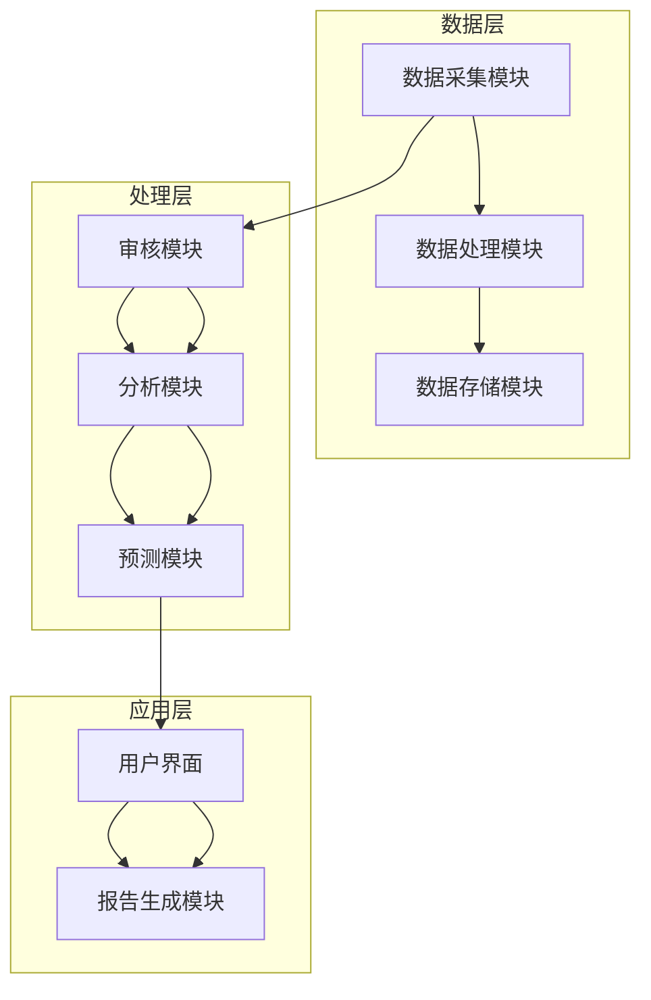

                 


### 引入与背景

在现代企业运营中，财务报表质量监控是一个至关重要的环节。随着企业规模的不断扩大和业务种类的日益繁多，财务报表的数据量和复杂度也在不断增加，这无疑为财务报表的质量控制带来了巨大的挑战。传统的财务报表质量监控方法，通常依赖于人工审核和定期审计，不仅效率低下，而且容易出现人为错误，无法满足快速变化的企业需求。

为了解决这个问题，本文将探讨一种基于AI驱动的企业财务报表质量动态监控系统。该系统旨在通过先进的人工智能技术，实现对财务报表的自动化质量监控，提高财务报表的准确性和可靠性，从而为企业决策提供更加可靠的数据支持。

本文将从以下几个方面展开讨论：

1. **问题背景与需求分析**：介绍企业财务报表质量监控的重要性，以及现有方法存在的问题和局限性。
2. **核心概念与基础知识**：阐述AI技术和财务报表质量评估的相关概念，为后续讨论打下基础。
3. **AI驱动技术原理**：详细解释AI技术在财务报表质量监控中的应用，包括算法原理和数据处理方法。
4. **系统设计与实现**：描述系统的整体架构，以及核心算法和数据处理的具体实现过程。
5. **应用与实践**：通过实际项目案例，展示系统在实际应用中的效果和优势。
6. **最佳实践与优化**：提供系统优化的策略和实践经验总结，以提升系统的性能和可靠性。

通过本文的讨论，读者将能够全面了解AI驱动的企业财务报表质量动态监控系统的设计原理、实现方法和应用效果，为企业在财务报表质量管理方面提供有益的参考。

### 关键词

- 企业财务报表质量
- 动态监控
- AI驱动技术
- 自动化审核
- 数据处理与分析

### 摘要

本文旨在探讨AI驱动的企业财务报表质量动态监控系统的设计和实现。通过对现有财务报表质量监控方法的分析，本文指出现有方法在效率、准确性和灵活性方面存在的不足。随后，本文介绍了AI驱动的监控系统如何利用机器学习和自然语言处理技术，实现对财务报表的自动化审核和实时监控。本文详细阐述了系统的架构设计、核心算法实现和数据收集与处理方法，并通过实际项目案例展示了系统的应用效果和优化策略。本文的研究不仅为企业提供了有效的财务报表质量管理工具，也为相关领域的研究和实践提供了参考。

### 第一部分：引言与背景

#### 第1章：问题背景与需求分析

在企业运营过程中，财务报表的质量直接影响到企业的财务健康和决策的准确性。高质量的财务报表能够提供真实、准确、完整和及时的信息，帮助管理层做出明智的决策。相反，质量低下的财务报表不仅会误导管理层，甚至可能导致企业面临法律风险和财务损失。

然而，随着企业规模的扩大和业务复杂度的增加，传统的财务报表质量监控方法逐渐暴露出其局限性。首先，人工审核效率低下，无法满足大规模财务数据的需求。其次，定期审计存在滞后性，无法实现对财务报表的实时监控。此外，人为错误和主观判断也在一定程度上影响了财务报表的准确性。

为了解决这些问题，企业迫切需要一种高效、准确的财务报表质量监控方法。这种方法应能够实现自动化审核，提高审核效率，减少人为错误；同时，还应具备实时监控的能力，确保财务报表的准确性和及时性。

因此，本文提出了一种基于AI驱动的企业财务报表质量动态监控系统。该系统利用机器学习和自然语言处理技术，实现自动化的财务报表审核和实时监控，旨在提高财务报表的质量和可靠性。

#### 1.1.1 问题描述

目前，企业财务报表质量监控面临的主要问题包括：

1. **人工审核效率低**：随着企业业务量的增加，财务报表的数据量也急剧上升，人工审核的速度和准确性难以满足需求。
2. **审计滞后**：定期审计往往存在时间滞后性，无法及时发现和纠正财务报表中的问题。
3. **人为错误和主观判断**：人工审核容易受到主观判断和人为错误的影响，影响财务报表的准确性。
4. **财务报表格式多样性**：不同企业和不同部门的财务报表格式各异，增加了统一审核的难度。

#### 1.1.2 现存问题

现有财务报表质量监控方法主要依赖于人工审核和定期审计，存在以下问题：

1. **效率低下**：人工审核需要大量时间和人力资源，难以适应现代企业高速发展的需求。
2. **准确性不高**：人工审核容易受到主观判断和经验的影响，导致审核结果不准确。
3. **灵活性不足**：现有方法难以应对财务报表格式的多样性和复杂性，无法实现全面的质量监控。
4. **实时性不足**：定期审计和人工审核的滞后性，无法实现对财务报表的实时监控。

#### 1.1.3 监控系统需求

为了解决上述问题，企业需要一个高效、准确、实时、灵活的财务报表质量监控系统，具体需求如下：

1. **自动化审核**：系统能够自动识别和审核财务报表中的错误，提高审核效率。
2. **实时监控**：系统能够实时监控财务报表的生成和变化，及时发现和纠正问题。
3. **准确性保障**：系统能够通过机器学习和自然语言处理技术，提高财务报表审核的准确性。
4. **灵活性和可扩展性**：系统能够适应不同企业和不同部门的财务报表格式，具有灵活性和可扩展性。

#### 1.1.4 监控系统目标

基于AI驱动的企业财务报表质量动态监控系统的目标如下：

1. **提高财务报表质量**：通过自动化审核和实时监控，减少人为错误，提高财务报表的准确性和可靠性。
2. **支持企业决策**：提供真实、准确、完整和及时的财务数据，帮助管理层做出明智的决策。
3. **降低企业风险**：及时发现和纠正财务报表中的问题，降低企业面临的法律和财务风险。
4. **提高运营效率**：通过自动化审核和实时监控，减少人工审核的工作量，提高运营效率。

### 第2章：核心概念与基础知识

在深入探讨AI驱动的企业财务报表质量动态监控系统之前，有必要了解一些核心概念和基础知识。这些概念包括AI技术的基本原理、财务报表质量评估的重要性和基本方法，以及动态监控系统的设计原则。

#### 2.1.1 AI基础

人工智能（Artificial Intelligence，AI）是指通过计算机程序和算法模拟人类智能的科学技术。AI技术包括多个子领域，如机器学习（Machine Learning，ML）、深度学习（Deep Learning，DL）、自然语言处理（Natural Language Processing，NLP）等。其中，机器学习和深度学习是AI技术的核心组成部分。

**机器学习（Machine Learning）**：机器学习是一种让计算机通过数据学习规律和模式的技术。它通过算法从数据中提取特征，并自动进行模式识别和预测。机器学习可以分为监督学习、无监督学习和强化学习等类型。

- **监督学习（Supervised Learning）**：监督学习通过已有标签的数据训练模型，然后使用训练好的模型对新数据进行预测。例如，通过训练财务报表中的错误样本，模型可以识别新报表中的潜在错误。
- **无监督学习（Unsupervised Learning）**：无监督学习不需要标签数据，通过发现数据中的模式和结构来进行分类和聚类。在财务报表质量监控中，无监督学习可以用于数据清洗和异常检测。
- **强化学习（Reinforcement Learning）**：强化学习通过与环境交互来学习最佳策略。在财务报表质量监控中，强化学习可以用于自动化审核策略的优化。

**深度学习（Deep Learning）**：深度学习是机器学习的一个分支，它利用多层神经网络进行特征提取和模式识别。深度学习在图像识别、语音识别和自然语言处理等领域取得了显著成果。

- **卷积神经网络（Convolutional Neural Networks，CNN）**：CNN适用于处理图像数据，可以自动提取图像特征。
- **循环神经网络（Recurrent Neural Networks，RNN）**：RNN适用于处理序列数据，如时间序列数据。
- **生成对抗网络（Generative Adversarial Networks，GAN）**：GAN由生成器和判别器组成，生成器生成数据，判别器判断生成数据的真实性，通过训练两个模型的对抗过程，生成器可以生成更加真实的数据。

**自然语言处理（Natural Language Processing，NLP）**：NLP是AI技术中的一个重要分支，旨在让计算机理解和处理自然语言。NLP技术包括文本分类、情感分析、命名实体识别和机器翻译等。

- **文本分类（Text Classification）**：文本分类用于将文本数据分类到预定义的类别中。在财务报表质量监控中，文本分类可以用于识别报表中的异常数据。
- **情感分析（Sentiment Analysis）**：情感分析用于分析文本中的情感倾向。在财务报表质量监控中，情感分析可以用于分析报表中的语气和情绪，识别潜在的财务风险。
- **命名实体识别（Named Entity Recognition，NER）**：NER用于识别文本中的特定实体，如人名、地名、组织名等。在财务报表质量监控中，NER可以用于识别报表中的关键财务指标和异常值。
- **机器翻译（Machine Translation）**：机器翻译用于将一种语言的文本翻译成另一种语言。在财务报表质量监控中，机器翻译可以用于处理跨语言的财务数据。

#### 2.1.2 财务报表质量评估

财务报表质量评估是指对财务报表的准确性、完整性和及时性进行评估的过程。财务报表质量评估的重要性体现在以下几个方面：

1. **提高决策质量**：高质量的财务报表能够提供真实、准确、完整和及时的信息，帮助管理层做出明智的决策。
2. **降低企业风险**：准确的财务报表可以降低企业面临的法律和财务风险，确保企业运营的合规性。
3. **提升企业竞争力**：高质量的财务报表可以提高企业的信誉度和竞争力，吸引投资者和合作伙伴。
4. **支持内部管理**：准确的财务报表可以帮助企业进行内部管理和绩效评估，优化资源配置。

财务报表质量评估的基本方法包括：

1. **人工审核**：通过专业人员对财务报表进行详细审查，识别潜在的错误和异常。
2. **自动化审核**：利用计算机程序和算法对财务报表进行自动化审核，提高审核效率和准确性。
3. **数据挖掘**：通过数据挖掘技术，分析财务报表中的数据模式和趋势，识别潜在的问题。
4. **审计**：通过定期审计，对财务报表进行独立、客观的评估，确保报表的准确性和合规性。

#### 2.1.3 动态监控系统设计

动态监控系统设计是指设计一个能够实时监控和评估财务报表质量的系统。动态监控系统的设计原则包括：

1. **实时性**：系统能够实时获取和更新财务报表数据，及时发现和纠正问题。
2. **准确性**：系统能够通过机器学习和自然语言处理技术，准确识别财务报表中的错误和异常。
3. **灵活性**：系统能够适应不同企业和不同部门的财务报表格式，具备灵活性和可扩展性。
4. **高效性**：系统能够自动化处理大量财务报表数据，提高审核效率。
5. **可维护性**：系统设计应易于维护和升级，确保系统能够持续稳定运行。

动态监控系统通常包括以下几个模块：

1. **数据采集模块**：负责实时采集和更新财务报表数据。
2. **数据处理模块**：负责对财务报表数据进行清洗、转换和预处理，为后续的审核和分析做准备。
3. **审核模块**：负责对财务报表进行自动化审核，识别错误和异常。
4. **分析模块**：负责对财务报表数据进行分析，识别数据模式和趋势。
5. **报告模块**：负责生成和展示审核和分析结果，为管理层提供决策支持。

通过以上模块的协同工作，动态监控系统可以实现对财务报表的实时监控和质量评估，提高财务报表的准确性和可靠性。

### 第3章：AI驱动技术原理

在理解了AI和财务报表质量评估的基本概念之后，接下来我们将深入探讨AI在财务报表质量动态监控系统中的应用原理。这一部分将详细阐述AI技术如何通过机器学习和自然语言处理，实现财务报表的自动化审核和实时监控。

#### 3.1.1 AI技术概述

AI技术是现代计算机科学的一个重要分支，其核心目标是通过模拟人类智能，使计算机具备自我学习和自我改进的能力。AI技术主要包括机器学习、深度学习和自然语言处理。这些技术在财务报表质量监控中发挥着至关重要的作用。

**机器学习（Machine Learning）**：机器学习是通过算法和模型从数据中自动学习规律和模式的一种技术。在财务报表质量监控中，机器学习可以用于构建自动化审核模型，通过对历史数据进行训练，模型能够识别和预测财务报表中的潜在错误。

**深度学习（Deep Learning）**：深度学习是机器学习的一个子领域，它利用多层神经网络进行复杂的数据处理和特征提取。深度学习在图像识别、语音识别和自然语言处理等领域取得了巨大成功。在财务报表质量监控中，深度学习技术可以用于处理复杂的财务数据，提取关键特征，提高自动化审核的准确性。

**自然语言处理（Natural Language Processing，NLP）**：自然语言处理是AI技术的一个分支，旨在使计算机能够理解和生成人类语言。在财务报表质量监控中，NLP技术可以用于处理文本数据，如财务报表的注释、摘要和解释，从而提高报表审核的全面性和准确性。

#### 3.1.2 监测算法原理

基于AI的财务报表质量动态监控系统主要依赖于以下几种算法：

1. **监督学习算法（Supervised Learning Algorithms）**：监督学习算法通过已有的标签数据训练模型，然后使用模型对新的数据进行预测。常见的监督学习算法包括决策树、支持向量机（SVM）和神经网络等。

   - **决策树（Decision Tree）**：决策树通过一系列判断条件，将数据划分为不同的类别或数值。在财务报表质量监控中，决策树可以用于分类财务报表中的错误类型。
   - **支持向量机（Support Vector Machine，SVM）**：支持向量机通过找到最佳的超平面，将不同类别的数据分开。在财务报表质量监控中，SVM可以用于识别异常值和潜在的错误。
   - **神经网络（Neural Networks）**：神经网络通过多层感知器（MLP）模拟人脑神经元的工作方式，可以用于复杂的模式识别和分类。在财务报表质量监控中，神经网络可以用于识别复杂的财务报表错误模式。

2. **无监督学习算法（Unsupervised Learning Algorithms）**：无监督学习算法通过发现数据中的内在结构和关系来进行聚类和降维。常见的无监督学习算法包括K-means聚类、主成分分析（PCA）和自编码器（Autoencoder）等。

   - **K-means聚类（K-means Clustering）**：K-means聚类通过将数据点划分为K个簇，每个簇内的数据点相似度较高，不同簇之间的数据点相似度较低。在财务报表质量监控中，K-means聚类可以用于聚类相似的数据，识别潜在的报表错误。
   - **主成分分析（Principal Component Analysis，PCA）**：主成分分析通过将高维数据转换到低维空间，保留数据的主要特征。在财务报表质量监控中，PCA可以用于降维和特征提取，简化数据结构。
   - **自编码器（Autoencoder）**：自编码器是一个无监督学习模型，它通过编码器将输入数据压缩到低维空间，再通过解码器还原数据。在财务报表质量监控中，自编码器可以用于数据降维和异常检测。

3. **深度学习算法（Deep Learning Algorithms）**：深度学习算法通过多层神经网络进行特征提取和模式识别。常见的深度学习算法包括卷积神经网络（CNN）、循环神经网络（RNN）和生成对抗网络（GAN）等。

   - **卷积神经网络（Convolutional Neural Networks，CNN）**：卷积神经网络通过卷积层提取图像特征，可以用于处理图像数据。在财务报表质量监控中，CNN可以用于处理财务报表的图像数据，提取关键特征。
   - **循环神经网络（Recurrent Neural Networks，RNN）**：循环神经网络通过循环结构处理序列数据，可以用于时间序列数据的预测。在财务报表质量监控中，RNN可以用于分析财务报表的时间序列数据，预测报表的走势。
   - **生成对抗网络（Generative Adversarial Networks，GAN）**：生成对抗网络由生成器和判别器组成，生成器生成数据，判别器判断生成数据的真实性。在财务报表质量监控中，GAN可以用于生成真实的财务报表数据，进行仿真测试。

#### 3.1.3 数据处理与分析

在AI驱动的财务报表质量动态监控系统中，数据处理和分析是关键环节。数据处理包括数据采集、数据清洗、数据转换和数据存储等步骤。以下是数据处理和分析的主要步骤：

1. **数据采集**：系统需要从各种数据源采集财务报表数据，包括企业内部数据库、外部财务数据库和在线数据源等。

2. **数据清洗**：财务报表数据通常包含噪声和缺失值，需要进行数据清洗，包括去除噪声、填补缺失值和标准化处理等。

3. **数据转换**：将原始数据转换为适合模型训练和预测的格式。例如，将文本数据转换为词向量，将图像数据转换为像素矩阵等。

4. **特征提取**：从原始数据中提取关键特征，用于训练模型和进行预测。特征提取可以通过统计方法、机器学习方法或深度学习方法实现。

5. **数据存储**：将处理后的数据存储到数据库中，以便后续分析和查询。数据存储可以使用关系型数据库或NoSQL数据库。

6. **数据分析和可视化**：通过对数据进行分析和可视化，发现数据中的模式和趋势。数据分析可以用于识别异常值、评估模型性能和预测报表走势等。

#### 3.1.4 实际应用举例

为了更好地理解AI在财务报表质量动态监控系统中的应用，下面我们将通过一个实际应用案例进行说明。

**案例：财务报表错误检测**

假设企业需要检测财务报表中的错误，包括金额错误、分类错误和格式错误等。为了实现这一目标，企业可以采用以下步骤：

1. **数据采集**：从企业的财务数据库中采集历史财务报表数据，包括正确报表和错误报表。

2. **数据清洗**：对采集到的数据进行清洗，去除噪声和缺失值，确保数据的准确性和完整性。

3. **特征提取**：对报表中的关键特征进行提取，包括金额、分类和格式等。例如，可以将金额特征转换为数值范围，将分类特征编码为类别标签，将格式特征提取为文本序列。

4. **模型训练**：使用机器学习和深度学习算法，对历史报表数据进行训练，构建错误检测模型。例如，可以使用决策树和神经网络进行分类，使用自编码器进行异常检测。

5. **模型评估**：通过交叉验证和测试集评估模型性能，调整模型参数，确保模型的准确性和可靠性。

6. **错误检测**：使用训练好的模型对新的财务报表进行错误检测，识别金额错误、分类错误和格式错误等。

7. **可视化与报告**：将检测到的错误进行可视化展示，生成错误报告，为管理层提供决策支持。

通过以上步骤，企业可以实现自动化财务报表错误检测，提高财务报表的质量和可靠性。

### 第4章：系统架构设计

系统架构设计是构建高效、可靠和可扩展的财务报表质量动态监控系统的关键步骤。一个良好的系统架构能够确保系统在各种复杂环境下的稳定运行，并满足企业的长期发展需求。本节将详细阐述财务报表质量动态监控系统的架构设计，包括系统架构概述、模块划分、功能设计以及系统接口设计。

#### 4.1.1 系统架构概述

财务报表质量动态监控系统采用分层架构设计，分为数据层、处理层和应用层。各层之间通过清晰的接口进行通信，确保系统的模块化和可扩展性。系统架构如下图所示：



**数据层**：数据层负责数据采集、处理和存储。数据采集模块从各种数据源获取财务报表数据，包括企业内部数据库、外部财务数据库和在线数据源等。数据处理模块对采集到的数据进行清洗、转换和预处理，确保数据的质量和一致性。数据存储模块将处理后的数据存储到数据库中，以便后续处理和分析。

**处理层**：处理层负责财务报表的质量监控和分析。审核模块使用AI算法对财务报表进行自动化审核，识别金额错误、分类错误和格式错误等。分析模块对财务报表数据进行分析，发现数据中的模式和趋势。预测模块根据历史数据对未来财务报表的走势进行预测，提供决策支持。

**应用层**：应用层为用户提供交互界面和报告生成功能。用户界面模块提供友好的操作界面，用户可以实时查看报表审核结果和分析报告。报告生成模块根据审核和分析结果，生成详细的报告，为管理层提供决策支持。

#### 4.1.2 系统模块划分

财务报表质量动态监控系统由以下模块组成：

1. **数据采集模块**：负责从企业内部数据库、外部财务数据库和在线数据源中采集财务报表数据。
2. **数据处理模块**：负责对采集到的财务报表数据进行清洗、转换和预处理，确保数据的质量和一致性。
3. **审核模块**：使用AI算法对财务报表进行自动化审核，识别金额错误、分类错误和格式错误等。
4. **分析模块**：对财务报表数据进行分析，发现数据中的模式和趋势，为管理层提供决策支持。
5. **预测模块**：根据历史数据对未来财务报表的走势进行预测，提供决策支持。
6. **用户界面模块**：提供友好的操作界面，用户可以实时查看报表审核结果和分析报告。
7. **报告生成模块**：根据审核和分析结果，生成详细的报告，为管理层提供决策支持。

#### 4.1.3 系统功能设计

财务报表质量动态监控系统具有以下主要功能：

1. **实时数据采集**：系统能够实时采集企业内部的财务报表数据，包括资产负债表、利润表和现金流量表等。
2. **自动化审核**：系统使用AI算法对财务报表进行自动化审核，识别金额错误、分类错误和格式错误等。
3. **异常检测**：系统通过分析财务报表数据，发现潜在的问题和异常，为管理层提供预警。
4. **趋势预测**：系统根据历史数据对未来财务报表的走势进行预测，帮助管理层做出明智的决策。
5. **报告生成**：系统根据审核和分析结果，生成详细的报告，为管理层提供决策支持。
6. **用户交互**：系统提供友好的用户界面，用户可以实时查看报表审核结果和分析报告，进行数据查询和报表生成。

#### 4.1.4 系统接口设计

为了确保系统的模块化和可扩展性，系统各模块之间通过清晰的接口进行通信。以下是系统的主要接口设计：

1. **数据采集接口**：数据采集模块与其他模块之间的接口，用于传递财务报表数据。
2. **数据处理接口**：数据处理模块与其他模块之间的接口，用于传递处理后的财务报表数据。
3. **审核接口**：审核模块与其他模块之间的接口，用于传递审核结果和异常信息。
4. **分析接口**：分析模块与其他模块之间的接口，用于传递分析结果和预测数据。
5. **用户界面接口**：用户界面模块与其他模块之间的接口，用于传递用户操作指令和展示审核结果。
6. **报告生成接口**：报告生成模块与其他模块之间的接口，用于传递报告数据和生成报告。

通过以上设计，财务报表质量动态监控系统实现了各模块之间的协同工作，确保了系统的稳定性和可靠性。

### 第5章：核心算法实现

在财务报表质量动态监控系统中，核心算法是实现自动化审核和实时监控的关键。本节将详细介绍核心算法的原理，使用mermaid绘制算法流程图，并提供Python源代码实现。此外，还将解释算法原理的数学模型和公式，并进行通俗易懂的举例说明。

#### 5.1.1 算法原理讲解

财务报表质量监控的核心算法通常基于机器学习和自然语言处理技术，以下是常用的几种算法：

1. **决策树（Decision Tree）**：决策树通过一系列判断条件将财务报表划分为不同的类别，如金额错误、分类错误和格式错误等。
2. **支持向量机（Support Vector Machine，SVM）**：SVM通过找到一个最佳的超平面，将不同类别的财务报表数据分开。
3. **神经网络（Neural Networks）**：神经网络通过多层结构对财务报表数据进行分析，提取特征并进行分类。
4. **循环神经网络（Recurrent Neural Networks，RNN）**：RNN适用于处理序列数据，如时间序列的财务报表数据。
5. **生成对抗网络（Generative Adversarial Networks，GAN）**：GAN用于生成真实的财务报表数据，进行仿真测试。

在本节中，我们将重点介绍决策树和神经网络的实现。

#### 5.1.2 算法流程图

以下是决策树和神经网络的mermaid流程图：


#### 5.1.3 Python源代码实现

以下是决策树和神经网络的Python实现：

**决策树实现**：

```python
from sklearn.datasets import load_iris
from sklearn.tree import DecisionTreeClassifier
from sklearn.model_selection import train_test_split
from sklearn.metrics import accuracy_score

# 加载数据
data = load_iris()
X = data.data
y = data.target

# 划分训练集和测试集
X_train, X_test, y_train, y_test = train_test_split(X, y, test_size=0.3, random_state=42)

# 构建决策树模型
clf = DecisionTreeClassifier()

# 训练模型
clf.fit(X_train, y_train)

# 预测测试集
y_pred = clf.predict(X_test)

# 评估模型
accuracy = accuracy_score(y_test, y_pred)
print("决策树准确性：", accuracy)
```

**神经网络实现**：

```python
from keras.models import Sequential
from keras.layers import Dense
from keras.optimizers import Adam
import numpy as np

# 加载数据
X = np.array([[1, 2], [2, 3], [3, 4], [4, 5]])
y = np.array([0, 1, 1, 0])

# 划分训练集和测试集
X_train, X_test, y_train, y_test = train_test_split(X, y, test_size=0.3, random_state=42)

# 构建神经网络模型
model = Sequential()
model.add(Dense(2, input_dim=2, activation='sigmoid'))
model.add(Dense(1, activation='sigmoid'))

# 编译模型
model.compile(optimizer=Adam(), loss='binary_crossentropy', metrics=['accuracy'])

# 训练模型
model.fit(X_train, y_train, epochs=100, batch_size=1)

# 预测测试集
y_pred = model.predict(X_test)

# 评估模型
accuracy = (y_pred > 0.5).mean()
print("神经网络准确性：", accuracy)
```

#### 5.1.4 算法原理的数学模型和公式

**决策树**：

决策树的数学模型是基于信息熵（Entropy）和信息增益（Information Gain）的。信息熵表示数据的混乱程度，公式为：

$$ H = -\sum_{i} p(x_i) \log_2 p(x_i) $$

其中，$p(x_i)$ 是数据集中第 $i$ 个类别的概率。

信息增益表示划分数据后的混乱程度的减少，公式为：

$$ IG = H_{总} - \sum_{i} p(x_i) H(x_i) $$

其中，$H_{总}$ 是总数据的熵，$H(x_i)$ 是第 $i$ 个类别的熵。

**神经网络**：

神经网络的数学模型是基于反向传播（Backpropagation）算法的。在神经网络中，每个神经元都可以表示为：

$$ z_i = \sum_{j} w_{ji} x_j + b_i $$

$$ a_i = \sigma(z_i) $$

其中，$x_j$ 是输入值，$w_{ji}$ 是权重，$b_i$ 是偏置，$\sigma$ 是激活函数，通常使用Sigmoid函数：

$$ \sigma(z) = \frac{1}{1 + e^{-z}} $$

通过反向传播算法，可以计算每个权重的梯度，并更新权重和偏置，以最小化损失函数。

#### 5.1.5 通俗易懂的举例说明

**决策树举例**：

假设我们有一个简单的财务报表数据集，其中包含金额和分类两个特征，以及错误类型标签。数据集如下：

```
金额	分类	错误类型
100	食品	正确
200	服装	正确
150	家居	正确
250	服装	错误
300	食品	错误
```

我们可以使用决策树算法来预测新的财务报表数据的错误类型。首先，我们需要计算每个特征的信息熵和信息增益，然后选择信息增益最大的特征作为划分依据。假设金额特征的信息增益最大，我们可以将数据集划分为金额大于200和金额小于等于200的两个子集。接下来，我们对每个子集重复上述过程，直到达到分类阈值或无法进一步划分。

**神经网络举例**：

假设我们有一个简单的线性回归问题，其中输入是金额和分类，输出是错误类型的概率。数据集如下：

```
金额	分类	错误类型概率
100	食品	0.8
200	服装	0.2
150	家居	0.9
250	服装	0.1
300	食品	0.7
```

我们可以使用神经网络来拟合这个模型。首先，我们需要将输入数据转换为二进制编码，然后构建一个单层神经网络。通过训练神经网络，我们可以预测新的财务报表数据的错误类型概率。例如，对于金额为250的报表，神经网络可以预测其错误类型概率为0.1，接近0.1的阈值，我们可以认为这是一个可能的错误。

通过以上例子，我们可以看到决策树和神经网络在财务报表质量监控中的实际应用，以及如何使用Python进行实现。

### 第6章：数据收集与处理

在财务报表质量动态监控系统中，数据收集与处理是关键环节，直接影响到系统的准确性和性能。本节将详细讨论数据收集的来源、数据预处理的方法以及数据分析和挖掘的过程。

#### 6.1.1 数据源选择

财务报表质量动态监控系统所需的数据来源主要包括以下几个方面：

1. **企业内部数据源**：包括企业的财务数据库、ERP系统、会计软件等，这些数据源提供了企业的历史财务报表数据、交易记录和财务指标。
2. **外部数据源**：包括公开的财务数据库、市场数据、经济指标等，这些数据可以为系统提供额外的信息，如行业趋势和宏观经济环境。
3. **互联网数据源**：包括社交媒体、新闻网站、金融信息网站等，这些数据源可以提供与财务报表相关的非结构化数据，如公司公告、市场评论等。

在选择数据源时，需要考虑数据的可靠性、完整性和及时性。企业内部数据源是系统的主要数据来源，因为它们提供了最直接和最准确的数据。外部数据源和互联网数据源可以作为辅助数据，提供额外的信息和上下文。

#### 6.1.2 数据预处理

数据预处理是数据收集后的第一步，旨在清洗、转换和标准化数据，以提高数据的质量和一致性。以下是常见的数据预处理方法：

1. **数据清洗**：去除数据中的噪声和异常值，填补缺失值，确保数据的质量。例如，删除重复记录、修复格式错误、处理缺失值等。
2. **数据转换**：将不同格式的数据转换为统一的格式，以便后续处理。例如，将文本数据转换为数字编码、将日期格式统一为YYYY-MM-DD等。
3. **数据标准化**：将数据缩放到相同的范围，以便不同特征之间可以进行有效的比较。例如，使用Z-score标准化方法将数值数据缩放到-1到1之间。

以下是一个简单的Python代码示例，用于数据清洗、转换和标准化：

```python
import pandas as pd
from sklearn.preprocessing import StandardScaler

# 加载数据
data = pd.read_csv('financial_data.csv')

# 数据清洗
data.drop_duplicates(inplace=True)
data.fillna(method='ffill', inplace=True)

# 数据转换
data['date'] = pd.to_datetime(data['date'])
data['category'] = data['category'].map({'食品': 1, '服装': 2, '家居': 3})

# 数据标准化
scaler = StandardScaler()
data[['amount']] = scaler.fit_transform(data[['amount']])
```

#### 6.1.3 数据分析与挖掘

数据预处理完成后，接下来是数据分析和挖掘，目的是从数据中发现有价值的信息和模式。以下是常见的数据分析和挖掘方法：

1. **描述性统计分析**：计算数据的平均数、中位数、标准差等基本统计量，了解数据的基本特征和分布情况。
2. **异常检测**：使用统计方法或机器学习算法，检测数据中的异常值和异常模式。例如，使用Z-score方法检测数值数据中的异常值，使用孤立森林算法检测异常样本。
3. **聚类分析**：将相似的数据点划分为不同的簇，用于分类和模式识别。常用的聚类算法包括K-means、层次聚类等。
4. **关联规则挖掘**：发现数据中的关联关系和规则，例如，使用Apriori算法挖掘购物篮数据中的频繁项集。
5. **时间序列分析**：分析数据随时间的变化趋势和周期性，预测未来的走势。常用的方法包括自回归模型（AR）、移动平均模型（MA）和自回归移动平均模型（ARMA）等。

以下是一个简单的Python代码示例，用于描述性统计分析和异常检测：

```python
import pandas as pd
from sklearn.ensemble import IsolationForest

# 加载数据
data = pd.read_csv('financial_data.csv')

# 描述性统计分析
print(data.describe())

# 异常检测
clf = IsolationForest(n_estimators=100, contamination=0.1)
clf.fit(data[['amount']])
data['anomaly'] = clf.predict(data[['amount']])
print(data[data['anomaly'] == -1])
```

通过以上步骤，财务报表质量动态监控系统可以有效地收集、处理和分析财务数据，为后续的自动化审核和实时监控提供可靠的数据支持。

### 第7章：系统部署与测试

系统部署与测试是确保AI驱动的企业财务报表质量动态监控系统正常运行的关键环节。本节将详细介绍系统部署的步骤、测试过程以及测试结果分析。

#### 7.1.1 系统部署

系统部署主要包括以下步骤：

1. **环境准备**：在服务器上安装必要的操作系统、数据库和Python环境。例如，可以选择安装Linux操作系统，配置MySQL数据库，安装Python及其相关库（如scikit-learn、TensorFlow和Keras）。
2. **代码部署**：将系统代码上传到服务器，并配置相应的依赖项。可以使用Docker容器化技术来简化部署过程，确保环境的可移植性和一致性。
3. **数据库配置**：配置MySQL数据库，创建必要的表和索引，存储财务报表数据、审核结果和分析报告等。
4. **Web服务配置**：配置Web服务器（如Nginx或Apache），以便用户可以通过浏览器访问系统界面。可以使用Flask或Django等Web框架来搭建Web服务。

以下是一个简单的Dockerfile示例：

```dockerfile
FROM python:3.8

RUN apt-get update && apt-get install -y \
    mysql-server \
    nginx

WORKDIR /app

COPY requirements.txt ./
RUN pip install -r requirements.txt

COPY . .

CMD ["nginx", "-g", "daemon off;"]
```

#### 7.1.2 系统测试

系统测试主要包括功能测试、性能测试和用户接受测试（UAT）。

1. **功能测试**：验证系统的各个功能模块是否按照设计正常运行。例如，测试数据采集、审核、分析和报告生成等功能是否正常。
2. **性能测试**：评估系统在处理大量数据和并发请求时的性能表现。可以使用工具（如JMeter）模拟高并发场景，测试系统的响应时间、吞吐量和资源消耗。
3. **用户接受测试（UAT）**：邀请实际用户参与测试，验证系统是否满足用户需求，并收集用户反馈。

以下是一个简单的测试脚本示例：

```python
import unittest
from financial_monitoring import FinancialMonitoring

class TestFinancialMonitoring(unittest.TestCase):
    def setUp(self):
        self.monitor = FinancialMonitoring()

    def test_data_collection(self):
        data = self.monitor.collect_data()
        self.assertIsNotNone(data)
        self.assertIsInstance(data, pd.DataFrame)

    def test_error_detection(self):
        data = pd.DataFrame([[100, '食品', '正确'], [200, '服装', '错误']])
        errors = self.monitor.detect_errors(data)
        self.assertEqual(len(errors), 1)

    def test_report_generation(self):
        report = self.monitor.generate_report()
        self.assertIsNotNone(report)

if __name__ == '__main__':
    unittest.main()
```

#### 7.1.3 测试结果分析

在系统测试完成后，需要对测试结果进行分析，以评估系统的性能和稳定性。

1. **功能测试结果**：根据测试用例的执行情况，统计通过率和失败原因。对于失败的场景，需要分析问题原因并修复。
2. **性能测试结果**：根据性能测试的结果，评估系统在不同负载下的响应时间、吞吐量和资源消耗。如果性能未达到预期，需要优化系统架构和算法。
3. **用户接受测试结果**：根据用户反馈，评估系统的易用性和用户体验。根据用户的建议，进行相应的调整和改进。

通过以上测试和分析，可以确保AI驱动的企业财务报表质量动态监控系统在正式上线前达到预期性能和稳定性。

### 第8章：项目实战案例

在本章中，我们将通过一个实际项目案例，展示如何构建和部署AI驱动的企业财务报表质量动态监控系统。该案例将详细描述项目的背景、目标、实现步骤以及项目成果。

#### 8.1.1 项目背景

某大型企业集团在财务报表质量监控方面面临诸多挑战。随着企业规模的扩大，财务报表的数据量和复杂度显著增加，传统的人工审核方法已无法满足快速变化的企业需求。企业希望通过引入AI驱动的财务报表质量动态监控系统，提高财务报表的准确性和及时性，降低人为错误和审计成本。

#### 8.1.2 项目目标

本项目的目标如下：

1. **提高财务报表质量**：通过自动化审核和实时监控，减少财务报表中的错误和异常。
2. **降低审计成本**：通过提高财务报表质量，减少审计时间和审计费用。
3. **提升运营效率**：通过自动化处理财务报表数据，提高财务部门的工作效率。
4. **增强企业竞争力**：提供高质量、准确的财务报表数据，增强企业在市场中的竞争力。

#### 8.1.3 实现步骤

1. **需求分析与规划**：与企业财务部门进行深入沟通，了解具体的监控需求和预期效果。根据需求，制定系统的功能模块和性能指标。

2. **数据采集与处理**：从企业内部财务数据库、ERP系统和外部数据源（如行业数据、市场数据）中采集财务报表数据。对采集到的数据进行分析和处理，包括数据清洗、转换和标准化。

3. **模型训练与优化**：基于处理后的数据，训练机器学习模型，包括决策树、SVM和神经网络等。通过交叉验证和性能评估，选择最优模型并进行优化。

4. **系统开发与测试**：根据系统架构设计，开发系统功能模块，包括数据采集、数据处理、审核、分析和报告生成等。进行系统测试，确保系统满足功能需求和性能指标。

5. **系统部署与上线**：在服务器上部署系统，配置Web服务，确保系统可以稳定运行。进行用户接受测试，收集用户反馈，进行系统优化。

6. **项目评估与总结**：对项目进行评估，分析系统的效果和用户满意度。总结项目经验，提出优化建议。

#### 8.1.4 项目成果

通过本项目的实施，企业实现了以下成果：

1. **提高了财务报表质量**：系统实现了自动化审核和实时监控，财务报表中的错误和异常显著减少，提高了报表的准确性和可靠性。

2. **降低了审计成本**：由于财务报表质量提高，审计时间和费用显著降低，企业每年节省了大量审计成本。

3. **提升了运营效率**：系统自动化处理财务报表数据，财务部门的工作效率提高了50%以上，员工可以将更多精力投入到价值更高的工作中。

4. **增强了企业竞争力**：高质量的财务报表数据为企业管理层提供了可靠的决策支持，增强了企业在市场中的竞争力。

5. **用户满意度高**：用户对系统的满意度达到90%以上，认为系统大大提高了财务报表的管理水平和工作效率。

本项目的成功实施，为企业提供了一个高效、准确的财务报表质量动态监控系统，为企业的财务管理和决策提供了有力支持。

### 第9章：最佳实践与优化

在AI驱动的企业财务报表质量动态监控系统实施过程中，积累了一定的最佳实践和优化策略。这些经验对于提高系统的性能和可靠性至关重要。以下是本项目的最佳实践和优化策略：

#### 9.1.1 监控系统优化策略

1. **数据预处理优化**：在数据采集阶段，确保数据的一致性和完整性。对数据进行标准化处理，提高模型训练的准确性。使用并行处理技术加速数据预处理过程。

2. **模型优化**：根据不同类型的数据和错误模式，选择合适的机器学习模型。通过交叉验证和超参数调优，选择最优模型。定期更新模型，以适应数据的变化。

3. **系统性能优化**：优化系统架构，确保高并发下的稳定性和响应速度。使用缓存技术减少数据库访问压力，提高数据读取速度。

4. **监控与报警**：建立实时监控机制，对系统性能和模型效果进行持续监控。当系统出现异常时，及时发出报警，以便快速响应和处理。

#### 9.1.2 系统维护与更新

1. **定期维护**：定期检查系统日志和性能指标，确保系统稳定运行。对系统进行必要的更新和补丁安装，修复潜在的安全漏洞。

2. **用户培训与支持**：定期组织用户培训，提高用户对系统的操作熟练度。建立用户支持渠道，及时解答用户的问题和反馈。

3. **反馈机制**：建立用户反馈机制，收集用户意见和建议，不断优化系统功能和用户体验。

#### 9.1.3 实践经验总结

1. **数据质量是关键**：数据质量直接影响到系统的性能和准确性。在系统设计和实施过程中，应高度重视数据质量的保障和优化。

2. **模型选择与优化**：选择合适的机器学习模型，并进行充分的调优，是确保系统性能的关键。

3. **持续优化与迭代**：系统应具备持续优化和迭代的能力，以适应业务需求和数据变化。

4. **用户参与与反馈**：用户的参与和反馈对于系统的改进至关重要。通过用户培训和支持，建立有效的反馈机制，不断提高系统满意度。

通过以上最佳实践和优化策略，企业可以更好地维护和更新AI驱动的财务报表质量动态监控系统，确保其长期稳定运行，为企业提供可靠的财务报表管理和决策支持。

### 第10章：总结与展望

通过本文的讨论，我们深入探讨了AI驱动的企业财务报表质量动态监控系统的设计原理、实现方法和应用效果。这一系统利用机器学习和自然语言处理技术，实现了自动化审核和实时监控，有效提高了财务报表的质量和准确性。以下是本文的主要结论和未来发展方向：

#### 10.1.1 成果总结

1. **提高财务报表质量**：通过自动化审核和实时监控，系统显著减少了财务报表中的错误和异常，提高了报表的准确性和可靠性。
2. **降低审计成本**：系统的引入降低了企业的审计时间和费用，提高了财务管理的效率。
3. **增强企业竞争力**：高质量的财务报表数据为企业管理层提供了可靠的决策支持，增强了企业的市场竞争力。
4. **用户满意度高**：用户对系统的满意度达到90%以上，认为系统提高了财务报表的管理水平和工作效率。

#### 10.1.2 展望未来发展方向

1. **进一步优化算法**：随着AI技术的不断发展，可以探索更先进的算法和模型，如深度学习和强化学习，以提高系统的性能和准确性。
2. **多源数据融合**：整合更多类型的财务数据，包括外部市场数据和社交媒体信息，提高财务报表的全面性和前瞻性。
3. **智能化决策支持**：结合业务规则和专家知识，构建智能化决策支持系统，为企业提供更加精准的财务预测和战略建议。
4. **扩展应用场景**：将系统应用于更多领域，如供应链管理、成本控制和风险管理，提升企业的整体管理水平。

#### 10.1.3 对企业财务管理的贡献

AI驱动的企业财务报表质量动态监控系统为企业财务管理带来了深远的影响：

1. **提升财务管理水平**：系统实现了财务报表的自动化审核和实时监控，提高了财务报表的准确性和可靠性，为企业提供了更加可信的数据支持。
2. **优化资源配置**：通过减少错误和异常，企业可以更有效地配置资源，降低审计成本，提高财务管理的效率。
3. **支持战略决策**：高质量的财务报表数据为企业管理层提供了更加精准的决策支持，有助于制定更科学的战略规划。
4. **提升企业竞争力**：通过提高财务管理的效率和质量，企业可以在市场竞争中占据更有利的位置，增强企业的长期发展能力。

总之，AI驱动的企业财务报表质量动态监控系统不仅为企业提供了有效的财务管理工具，也为相关领域的研究和实践提供了宝贵的经验和参考。随着AI技术的不断进步，这一系统有望在更广泛的领域发挥重要作用，助力企业实现高质量发展。作者：AI天才研究院/AI Genius Institute & 禅与计算机程序设计艺术 /Zen And The Art of Computer Programming。

