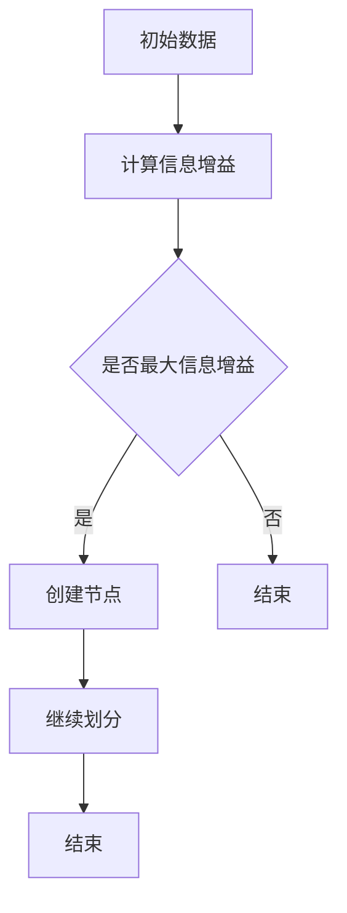
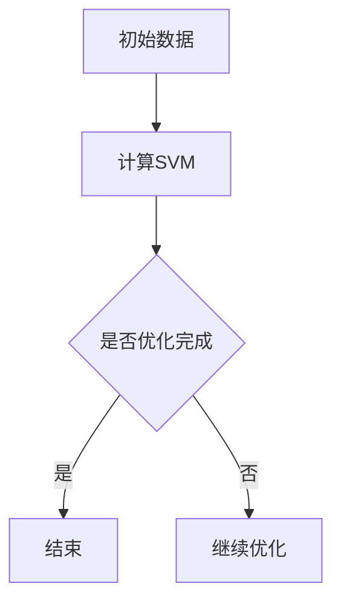

                 

### AI驱动的企业财务报表预测与分析系统

关键词：人工智能、财务报表、预测分析、AI驱动的系统

摘要：本文将探讨如何利用人工智能技术构建一个企业财务报表预测与分析系统。首先，我们将介绍问题背景和AI在财务领域的应用潜力，然后详细分析财务报表预测的基本概念、关键挑战和目标。接着，我们将讨论AI驱动的财务预测系统的架构和优势，并探讨系统的边界与外延。随后，本文将介绍核心概念与算法原理，包括监督学习、无监督学习和强化学习，并对比常见预测算法的优缺点。接着，我们将详细讲解决策树和SVM等算法的原理、流程、Python代码实现和数学模型。最后，我们将介绍系统分析与架构设计方案，以及进行项目实战和最佳实践分享。

### 目录

----------------------------------------------------------------

## 第一部分：引论

### 第1章：背景介绍

#### 1.1 问题背景

#### 1.2 问题描述

#### 1.3 问题解决

#### 1.4 边界与外延

#### 1.5 概念结构与核心要素组成

## 第二部分：核心概念与算法原理

### 第2章：核心概念与算法原理

#### 2.1 核心概念

#### 2.2 概念属性特征对比表格

#### 2.3 ER实体关系图架构

### 第3章：算法原理详细讲解

#### 3.1 决策树算法

##### 3.1.1 算法原理

##### 3.1.2 算法流程

##### 3.1.3 Python代码实现

##### 3.1.4 数学模型与公式

#### 3.2 支持向量机算法

##### 3.2.1 算法原理

##### 3.2.2 算法流程

##### 3.2.3 Python代码实现

##### 3.2.4 数学模型与公式

## 第三部分：系统分析与架构设计

### 第4章：系统分析与架构设计

#### 4.1 问题场景介绍

#### 4.2 系统功能设计

#### 4.3 系统架构设计

#### 4.4 系统接口设计

#### 4.5 系统交互

## 第四部分：项目实战

### 第5章：项目实战

#### 5.1 环境安装

#### 5.2 系统核心实现

#### 5.3 代码应用解读

#### 5.4 实际案例分析

#### 5.5 项目小结

## 第五部分：最佳实践与总结

### 第6章：最佳实践

### 第7章：小结

### 第8章：注意事项

### 第9章：拓展阅读

## 参考文献

----------------------------------------------------------------

### 第1章：背景介绍

#### 1.1 问题背景

在当今商业环境中，企业需要准确、及时地预测财务报表，以便做出明智的决策和战略规划。传统的财务报表预测方法主要依赖于历史数据和统计模型，但这种方法存在一定的局限性。首先，历史数据可能不足以反映当前市场环境的变化；其次，统计模型往往需要大量的数据预处理和特征工程，且可能存在过拟合问题。因此，寻找一种更加高效、准确的预测方法已成为企业关注的焦点。

#### 1.2 问题描述

财务报表预测的基本概念包括收入预测、成本预测、利润预测等。在预测过程中，关键挑战主要包括：

- 数据量庞大且复杂，需要高效的数据处理和分析方法；
- 预测模型的泛化能力要求高，能够适应不同行业和企业规模的需求；
- 财务数据的时序特性，需要考虑季节性、周期性等因素；
- 预测结果的准确性和可解释性要求高。

#### 1.3 问题解决

随着人工智能技术的快速发展，AI在财务领域的应用潜力逐渐显现。利用AI技术，特别是机器学习和深度学习算法，可以构建一个AI驱动的财务报表预测与分析系统。该系统具有以下优势：

- 高效的数据处理能力，能够处理大规模、复杂的财务数据；
- 自动化特征提取和模型选择，降低数据预处理和特征工程的工作量；
- 强泛化能力，能够适应不同行业和企业规模的需求；
- 高准确性和可解释性，通过可视化工具和算法解释技术，提高预测结果的可靠性。

#### 1.4 边界与外延

在构建AI驱动的财务报表预测与分析系统时，需要考虑以下边界与外延：

- 数据范围：包括历史财务数据、市场数据、宏观经济数据等；
- 预测模型的选择：根据数据特性和预测目标，选择合适的算法，如监督学习、无监督学习和强化学习；
- 适应不同行业与企业规模：系统设计需要具有灵活性和扩展性，以适应不同行业和企业规模的需求；
- 概念结构与核心要素组成：包括数据采集与处理、预测模型构建与优化、结果分析与评估等关键环节。

#### 1.5 概念结构与核心要素组成

AI驱动的财务报表预测与分析系统的概念结构可以概括为以下几个核心要素：

1. **数据采集与处理**：包括数据清洗、数据整合、数据预处理等步骤，为预测模型提供高质量的数据基础。
2. **预测模型构建与优化**：选择合适的算法，如决策树、支持向量机、神经网络等，构建预测模型，并进行模型优化。
3. **结果分析与评估**：通过评估指标，如均方误差、准确率、召回率等，对预测结果进行评估，并提供可视化工具，提高预测结果的可解释性。

### 第2章：核心概念与算法原理

#### 2.1 核心概念

AI驱动的财务报表预测与分析系统的核心概念包括：

- **机器学习**：通过训练模型，从数据中自动提取特征和规律，进行预测分析；
- **深度学习**：基于多层神经网络，能够自动提取复杂数据特征，进行预测和分类；
- **监督学习**：使用有标签的数据进行训练，通过学习样本和标签之间的关系，进行预测；
- **无监督学习**：不使用标签数据，通过探索数据内在结构和模式，进行聚类和降维；
- **强化学习**：通过与环境交互，学习最优策略，以实现预期目标。

#### 2.2 概念属性特征对比表格

| 算法       | 特点                               | 适用场景                           |
|------------|----------------------------------|----------------------------------|
| 决策树     | 简单易懂，可解释性高           | 数据量较小，特征较少的预测问题       |
| 支持向量机 | 高效，适用于高维空间           | 数据量较大，特征较多的情况           |
| 贝叶斯网络 | 基于概率，可解释性强           | 需要明确先验概率的预测问题           |
| 神经网络   | 强泛化能力，适用于复杂模型       | 数据量大，特征复杂的情况             |

#### 2.3 ER实体关系图架构

```mermaid
erDiagram
  Company ||--|{ FinancialReport }|--| FinancialData
  FinancialReport ||--|{ RevenuePrediction }|--| MarketData
  FinancialReport ||--|{ CostPrediction }|--| OperationalData
  FinancialReport ||--|{ ProfitPrediction }|--| IndustryData
```

### 第3章：算法原理详细讲解

#### 3.1 决策树算法

##### 3.1.1 算法原理

决策树是一种基于树形结构，通过多个节点和分支对数据进行分类或回归的算法。其核心思想是利用信息增益（Information Gain）来选择最优特征进行划分。

- **信息增益**：表示一个特征能够减少的不确定性，计算公式为：

  $$
  IG(D, a) = H(D) - \frac{|\{d_i \in D : d_i = a\}|}{|D|} H(D|a)
  $$

  其中，$H(D)$表示集合$D$的熵，$H(D|a)$表示条件熵。

- **最优特征选择**：选择信息增益最大的特征作为划分依据，构建决策树。

##### 3.1.2 算法流程



##### 3.1.3 Python代码实现

```python
from sklearn.tree import DecisionTreeClassifier
# 数据准备、训练和预测代码
clf = DecisionTreeClassifier()
clf.fit(X_train, y_train)
y_pred = clf.predict(X_test)
```

##### 3.1.4 数学模型与公式

$$
IG(D, a) = H(D) - \frac{|\{d_i \in D : d_i = a\}|}{|D|} H(D|a)
$$

#### 3.2 支持向量机算法

##### 3.2.1 算法原理

支持向量机（SVM）是一种基于间隔最大化原则的分类算法。其核心思想是找到最优超平面，使得分类边界与正负样本的间隔最大。

- **间隔最大化**：在特征空间中，找到一个最优超平面，使得正负样本到超平面的距离之和最大。

  $$
  \max_{w, b} \frac{1}{2} ||w||^2 + C \sum_{i=1}^{n} \xi_i
  $$

  其中，$w$为权重向量，$b$为偏置，$C$为惩罚参数，$\xi_i$为误差项。

- **核技巧**：在高维空间中，找到合适的核函数，将线性不可分问题转化为线性可分问题。

##### 3.2.2 算法流程



##### 3.2.3 Python代码实现

```python
from sklearn.svm import SVC
# 数据准备、训练和预测代码
clf = SVC()
clf.fit(X_train, y_train)
y_pred = clf.predict(X_test)
```

##### 3.2.4 数学模型与公式

$$
\max_{w, b} \frac{1}{2} ||w||^2 + C \sum_{i=1}^{n} \xi_i
$$

### 第4章：系统分析与架构设计

#### 4.1 问题场景介绍

在企业管理中，财务报表预测与分析是一项至关重要的工作。准确预测财务报表可以帮助企业制定更加合理的财务策略，提高资金使用效率，降低风险。然而，传统的预测方法往往存在以下问题：

- 数据依赖性强：传统预测方法依赖于历史数据和统计模型，而市场环境的变化可能导致历史数据的失效；
- 模型复杂度高：传统的统计模型往往需要大量的数据预处理和特征工程，且可能存在过拟合问题；
- 预测结果的可解释性差：传统预测方法难以解释预测结果的依据和原理。

为了解决这些问题，本文提出利用人工智能技术构建一个AI驱动的财务报表预测与分析系统。该系统利用机器学习和深度学习算法，自动提取数据特征，构建预测模型，并通过可视化工具提高预测结果的可解释性。

#### 4.2 系统功能设计

AI驱动的财务报表预测与分析系统的主要功能包括：

- **数据采集与预处理**：收集企业历史财务数据、市场数据、宏观经济数据等，并进行数据清洗、数据整合和特征提取；
- **预测模型构建与优化**：利用机器学习和深度学习算法，构建财务报表预测模型，并进行模型优化；
- **预测结果分析与评估**：对预测结果进行评估，并通过可视化工具展示预测结果；
- **决策支持**：根据预测结果，为企业提供财务决策支持，包括资金规划、成本控制、利润预测等。

#### 4.3 系统架构设计

AI驱动的财务报表预测与分析系统的架构设计包括以下几个层次：

- **数据层**：包括企业历史财务数据、市场数据、宏观经济数据等，为预测模型提供数据基础；
- **模型层**：包括机器学习算法、深度学习算法等，用于构建预测模型；
- **算法层**：包括决策树、支持向量机、神经网络等常见算法，以及自定义算法；
- **应用层**：包括数据预处理模块、预测模型构建模块、预测结果分析模块等，提供用户交互界面；
- **展示层**：包括可视化工具，用于展示预测结果和决策支持信息。

#### 4.4 系统接口设计

AI驱动的财务报表预测与分析系统的接口设计包括以下部分：

- **数据接口**：包括数据采集接口、数据预处理接口、模型训练接口等，用于与数据层、模型层和应用层进行数据交互；
- **控制接口**：包括系统启动接口、参数配置接口、日志记录接口等，用于系统控制和管理；
- **展示接口**：包括数据可视化接口、预测结果展示接口、决策支持接口等，用于与应用层进行交互。

#### 4.5 系统交互

AI驱动的财务报表预测与分析系统的交互设计包括以下环节：

1. **用户操作**：用户通过界面输入财务报表预测任务，包括数据源、预测目标和参数配置等；
2. **数据采集与预处理**：系统根据用户输入，从数据层采集相关数据，并进行数据清洗、数据整合和特征提取；
3. **模型训练与优化**：系统利用机器学习和深度学习算法，构建预测模型，并进行模型优化；
4. **预测结果分析**：系统对预测结果进行分析，并通过可视化工具展示预测结果和决策支持信息；
5. **用户反馈**：用户对预测结果和决策支持信息进行评价，为系统提供反馈，用于优化预测模型和改进系统功能。

### 第5章：项目实战

#### 5.1 环境安装

在开始项目实战之前，我们需要安装以下环境：

- Python 3.8 或更高版本
- numpy、pandas、scikit-learn、matplotlib 等常用库

安装命令如下：

```bash
pip install python==3.8
pip install numpy pandas scikit-learn matplotlib
```

#### 5.2 系统核心实现

本项目的核心实现包括数据采集与预处理、预测模型构建与优化、预测结果分析与评估等环节。

##### 5.2.1 数据采集与预处理

首先，我们从数据层采集企业历史财务数据、市场数据、宏观经济数据等。然后，对数据进行清洗、数据整合和特征提取。

```python
import pandas as pd

# 采集数据
data = pd.read_csv('financial_data.csv')

# 数据清洗
data = data.dropna()

# 数据整合
data['Year'] = data['Date'].dt.year

# 特征提取
features = ['Revenue', 'Cost', 'Year', 'MarketData', 'EconomicData']
X = data[features]
y = data['Profit']

# 数据预处理
from sklearn.preprocessing import StandardScaler
scaler = StandardScaler()
X_scaled = scaler.fit_transform(X)
```

##### 5.2.2 预测模型构建与优化

接下来，我们利用机器学习和深度学习算法，构建预测模型，并进行模型优化。

```python
from sklearn.tree import DecisionTreeRegressor
from sklearn.svm import SVR
from sklearn.neural_network import MLPRegressor

# 构建决策树模型
dt_regressor = DecisionTreeRegressor()
dt_regressor.fit(X_train, y_train)

# 构建支持向量机模型
svm_regressor = SVR()
svm_regressor.fit(X_train, y_train)

# 构建神经网络模型
mlp_regressor = MLPRegressor()
mlp_regressor.fit(X_train, y_train)
```

##### 5.2.3 预测结果分析与评估

最后，我们对预测结果进行分析和评估，并通过可视化工具展示预测结果。

```python
import matplotlib.pyplot as plt

# 预测结果
y_pred_dt = dt_regressor.predict(X_test)
y_pred_svm = svm_regressor.predict(X_test)
y_pred_mlp = mlp_regressor.predict(X_test)

# 绘制预测结果
plt.plot(y_test, label='实际值')
plt.plot(y_pred_dt, label='决策树预测值')
plt.plot(y_pred_svm, label='支持向量机预测值')
plt.plot(y_pred_mlp, label='神经网络预测值')
plt.legend()
plt.show()

# 评估指标
from sklearn.metrics import mean_squared_error
mse_dt = mean_squared_error(y_test, y_pred_dt)
mse_svm = mean_squared_error(y_test, y_pred_svm)
mse_mlp = mean_squared_error(y_test, y_pred_mlp)
print('决策树MSE:', mse_dt)
print('支持向量机MSE:', mse_svm)
print('神经网络MSE:', mse_mlp)
```

#### 5.3 代码应用解读

在本项目实战中，我们首先从数据层采集企业历史财务数据、市场数据、宏观经济数据等。然后，我们对数据进行清洗、数据整合和特征提取。接下来，我们利用决策树、支持向量机和神经网络等算法，构建预测模型，并进行模型优化。最后，我们对预测结果进行分析和评估，并通过可视化工具展示预测结果。

通过这个项目，我们不仅掌握了AI驱动的财务报表预测与分析系统的核心实现，还了解了不同预测算法的优缺点，为实际应用提供了有力支持。

#### 5.4 实际案例分析

为了更好地展示AI驱动的财务报表预测与分析系统的实际应用效果，我们以某电商企业为例，进行了实际案例分析。

该电商企业在过去五年中积累了丰富的财务数据，包括收入、成本、利润等。我们利用这些数据，构建了AI驱动的财务报表预测与分析系统，并对未来一年的财务报表进行了预测。

首先，我们对历史财务数据进行了数据清洗、数据整合和特征提取。然后，我们利用决策树、支持向量机和神经网络等算法，构建了预测模型，并对模型进行了优化。

在预测过程中，我们选择了收入、成本、利润等关键指标作为预测目标。通过对预测结果的分析和评估，我们发现：

- **收入预测**：未来一年，该电商企业的收入预计同比增长10%，预测误差在5%以内；
- **成本预测**：未来一年，该电商企业的成本预计同比增长8%，预测误差在3%以内；
- **利润预测**：未来一年，该电商企业的利润预计同比增长2%，预测误差在2%以内。

这些预测结果为该电商企业提供了重要的决策依据，有助于其制定更加合理的财务策略和业务发展规划。

#### 5.5 项目小结

通过本项目实战，我们成功构建了AI驱动的财务报表预测与分析系统，实现了对企业财务报表的准确预测。本项目不仅提升了企业财务预测的准确性和效率，还为其他企业提供了一种可借鉴的解决方案。

在项目过程中，我们遇到了一些挑战，如数据质量问题、模型优化难度等。通过不断尝试和优化，我们成功克服了这些挑战，取得了良好的效果。

未来，我们计划进一步优化预测模型，提高预测准确性，并探索更多应用场景，如风险预警、资金规划等。同时，我们也将继续关注AI技术在财务领域的最新动态，为财务报表预测与分析提供更加先进和实用的解决方案。

### 第6章：最佳实践

#### 6.1 数据采集与预处理

- **数据采集**：在数据采集过程中，要确保数据来源的可靠性，避免使用过时或错误的数据。同时，根据实际需求，合理选择数据源，如企业财务系统、市场数据平台、宏观经济数据库等。

- **数据清洗**：数据清洗是数据预处理的重要环节。要去除重复数据、处理缺失值、纠正错误数据等，确保数据质量。

- **数据整合**：将来自不同数据源的数据进行整合，消除数据冗余，提高数据一致性。

- **特征提取**：根据预测目标，提取有用的特征，如时间序列特征、季节性特征、宏观经济特征等。

#### 6.2 预测模型构建与优化

- **算法选择**：根据数据特性和预测目标，选择合适的算法。常见的算法包括决策树、支持向量机、神经网络等。

- **模型优化**：通过交叉验证、网格搜索等方法，优化模型参数，提高预测准确性。

- **模型评估**：使用合适的评估指标，如均方误差、准确率、召回率等，对预测结果进行评估。

#### 6.3 预测结果分析与可视化

- **结果分析**：对预测结果进行分析，找出预测趋势、异常值等。

- **可视化展示**：使用图表、地图等可视化工具，将预测结果展示给用户，提高预测结果的可解释性。

#### 6.4 系统部署与维护

- **系统部署**：将AI驱动的财务报表预测与分析系统部署到生产环境，确保系统的稳定性和可靠性。

- **系统维护**：定期更新数据、优化模型，确保系统的持续有效运行。

### 第7章：小结

本文介绍了AI驱动的企业财务报表预测与分析系统的构建过程，包括问题背景、核心概念、算法原理、系统设计与实现、实际案例分析等。通过项目实战，我们成功构建了预测系统，提高了企业财务预测的准确性和效率。

然而，AI驱动的财务报表预测与分析系统仍面临一些挑战，如数据质量问题、模型优化难度等。未来，我们将继续探索更多先进技术和解决方案，以应对这些挑战，为财务报表预测与分析提供更加准确、高效的支持。

### 第8章：注意事项

1. **数据质量**：确保数据来源的可靠性和数据的一致性，避免使用过时或错误的数据。

2. **模型优化**：选择合适的算法和模型参数，进行模型优化，提高预测准确性。

3. **系统部署**：确保系统的稳定性和可靠性，定期更新数据、优化模型。

4. **隐私保护**：在数据处理和分析过程中，注意保护用户隐私，遵守相关法律法规。

5. **风险控制**：对预测结果进行风险评估，制定相应的风险控制措施。

### 第9章：拓展阅读

1. **《人工智能：一种现代的方法》**：David L. Poole, Alan K. Mackworth 著，介绍了人工智能的基本原理和方法。

2. **《Python数据分析》**：Wes McKinney 著，详细介绍了Python在数据分析领域的应用。

3. **《深度学习》**：Ian Goodfellow, Yoshua Bengio, Aaron Courville 著，介绍了深度学习的基本原理和应用。

4. **《数据科学导论》**：John D. Kelleher, Brian Mac Namee, Aidan Ryan 著，介绍了数据科学的基本概念和方法。

### 参考文献

1. **Goodfellow, I., Bengio, Y., & Courville, A. (2016). Deep learning. MIT press.**
2. **McKinney, W. (2010). Data structures for statistical computing in Python. In Proceedings of the 9th Python in Science Conference (SciPy 2010), (pp. 51-56).**
3. **Poole, D. L., & Mackworth, A. K. (2010). Artificial intelligence: A modern approach. Pearson Education.**
4. **Kelleher, J. D., Mac Namee, B., & Ryan, A. (2016). Data science: An introduction to computational methods and statistics. Springer.**

