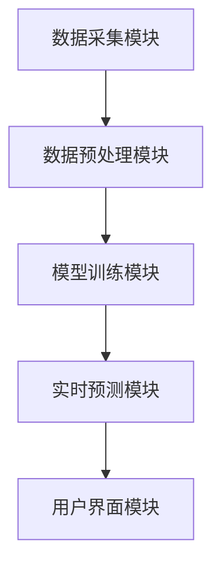
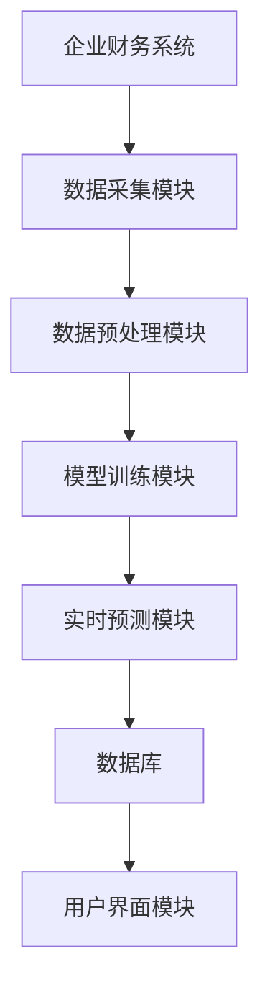
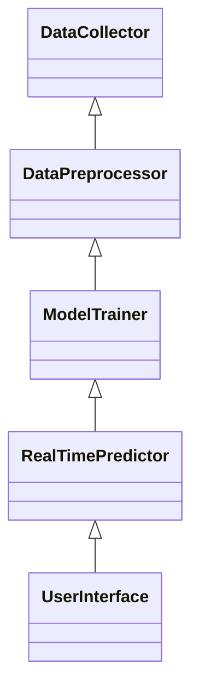

                 

## 《AI驱动的企业财务舞弊模式演化预测系统》

### 关键词：
AI、财务舞弊、预测系统、模式演化、数据挖掘、机器学习、深度学习

### 摘要：
随着人工智能技术的迅猛发展，其在企业财务舞弊检测与预测中的应用日益受到关注。本文旨在探讨如何构建一个基于AI的企业财务舞弊模式演化预测系统。文章首先介绍了AI和财务舞弊的相关背景，然后详细讲解了核心算法原理和系统架构设计，并通过实际案例展示了系统的安装与实现过程。最后，文章总结了最佳实践和注意事项，为企业在财务舞弊防范中提供参考。

### 目录大纲设计思路

为了设计出符合要求且逻辑清晰的《AI驱动的企业财务舞弊模式演化预测系统》书籍目录大纲，我们首先需要了解书籍的核心主题和目标读者。以下是详细的目录大纲设计思路：

1. **背景介绍**：介绍AI和财务舞弊的相关背景，以及为什么企业需要预测系统来防范财务舞弊。

2. **核心概念与联系**：详细阐述AI、财务舞弊模式、演化预测等核心概念，以及它们之间的联系。

3. **算法原理讲解**：通过Mermaid流程图和Python源代码，深入讲解预测系统中所用的算法原理，包括数学模型和公式。

4. **系统分析与架构设计**：介绍预测系统的整体架构，包括功能设计、系统架构、接口设计和交互流程。

5. **项目实战**：通过具体案例，展示如何安装、配置和实现预测系统，并进行分析和讲解。

6. **最佳实践与小结**：总结书中提到的关键技术和实践经验，提醒读者注意的事项，并给出拓展阅读的建议。

### 目录大纲设计

以下是根据上述设计思路制定的书籍目录大纲：

```markdown
----------------------------------------------------------------
# 《AI驱动的企业财务舞弊模式演化预测系统》目录大纲

## 第一部分：背景与基础理论

## 第1章：AI与企业财务舞弊概述

### 1.1 AI技术概述

#### 1.1.1 AI的发展历程
#### 1.1.2 AI的核心技术

### 1.2 财务舞弊模式分析

#### 1.2.1 财务舞弊的背景
#### 1.2.2 财务舞弊的常见模式

### 1.3 企业财务舞弊的危害与防范需求

#### 1.3.1 财务舞弊的危害
#### 1.3.2 企业防范财务舞弊的需求

## 第2章：AI驱动的财务舞弊预测基础

### 2.1 AI在财务舞弊预测中的应用

#### 2.1.1 AI在金融风险管理中的应用
#### 2.1.2 AI在财务舞弊检测中的优势

### 2.2 财务数据预处理

#### 2.2.1 财务数据的重要性
#### 2.2.2 数据预处理步骤与方法

## 第二部分：算法与模型

## 第3章：财务舞弊模式演化预测算法

### 3.1 预测算法概述

#### 3.1.1 预测算法的分类
#### 3.1.2 选择合适的预测算法

### 3.2 演化预测算法原理

#### 3.2.1 演化预测的基本原理
#### 3.2.2 常用演化预测算法介绍

### 3.3 算法实现与性能评估

#### 3.3.1 算法实现流程
#### 3.3.2 性能评估指标与方法

## 第三部分：系统设计与实现

## 第4章：财务舞弊预测系统架构设计

### 4.1 系统需求分析

#### 4.1.1 系统功能需求
#### 4.1.2 系统性能需求

### 4.2 系统架构设计

#### 4.2.1 总体架构设计
#### 4.2.2 功能模块划分

### 4.3 数据流与交互设计

#### 4.3.1 数据流设计
#### 4.3.2 系统交互设计

## 第5章：财务舞弊预测系统实现

### 5.1 系统开发环境与工具

#### 5.1.1 开发环境搭建
#### 5.1.2 开发工具介绍

### 5.2 系统核心代码实现

#### 5.2.1 数据预处理
#### 5.2.2 模型训练与评估
#### 5.2.3 模型部署与预测

## 第四部分：实战与案例分析

## 第6章：财务舞弊预测系统项目实战

### 6.1 项目介绍

#### 6.1.1 项目背景
#### 6.1.2 项目目标

### 6.2 系统安装与配置

#### 6.2.1 系统安装步骤
#### 6.2.2 系统配置方法

### 6.3 系统核心功能实现

#### 6.3.1 数据收集与预处理
#### 6.3.2 模型训练与优化
#### 6.3.3 系统部署与测试

### 6.4 案例分析与总结

#### 6.4.1 实际案例介绍
#### 6.4.2 案例分析
#### 6.4.3 项目总结

## 第五部分：最佳实践与总结

## 第7章：最佳实践与总结

### 7.1 最佳实践

#### 7.1.1 数据质量管理
#### 7.1.2 模型优化技巧
#### 7.1.3 部署与维护

### 7.2 注意事项

#### 7.2.1 数据隐私保护
#### 7.2.2 系统安全性
#### 7.2.3 法律合规性

### 7.3 小结与展望

#### 7.3.1 本书要点回顾
###

----------------------------------------------------------------
```

### 文章正文部分

#### 第1章：AI与企业财务舞弊概述

##### 1.1 AI技术概述

AI（人工智能）是指由人制造出的系统所表现出来的智能行为。自20世纪50年代以来，AI经历了多个发展阶段，从最初的规则推理、符号计算，到后来的知识表示、机器学习，再到如今基于深度学习的复杂模型，AI技术不断进步，已广泛应用于各行各业。

AI的核心技术包括：

- **机器学习**：通过从数据中学习模式，使计算机具有预测和决策能力。
- **深度学习**：一种基于多层神经网络的机器学习技术，能够处理复杂数据模式。
- **自然语言处理**：使计算机能够理解和生成人类语言，实现人机交互。
- **计算机视觉**：使计算机能够理解和解释视觉信息，如图像和视频。

##### 1.2 财务舞弊模式分析

财务舞弊是指企业管理层或相关人员通过不正当手段操纵财务数据，以达到个人或企业利益的行为。常见的财务舞弊模式包括：

- **财务操纵**：通过调整收入、成本、利润等财务指标，达到虚增业绩或掩盖财务问题的目的。
- **资产侵占**：通过转移或盗取公司资产，满足个人利益需求。
- **财务欺诈**：通过伪造财务报表、隐瞒重要信息等手段，欺骗投资者和监管机构。

##### 1.3 企业财务舞弊的危害与防范需求

财务舞弊对企业的影响是深远且广泛的，主要包括：

- **财务损失**：直接的财务损失，包括资产损失、利润下降等。
- **声誉损害**：舞弊事件可能导致企业声誉受损，影响客户和投资者的信心。
- **法律风险**：企业可能面临法律诉讼和罚款，甚至可能被强制退市。

为防范财务舞弊，企业需要采取一系列措施，包括内部审计、合规检查、财务数据监控等。随着AI技术的发展，AI驱动的财务舞弊预测系统成为一种新的防范手段，具有以下优势：

- **高效性**：AI系统可以快速处理海量数据，发现潜在的财务舞弊行为。
- **准确性**：基于机器学习和深度学习算法，AI系统具有较高的预测准确性。
- **实时性**：AI系统可以实时监控财务数据，及时发现异常情况。

#### 第2章：AI驱动的财务舞弊预测基础

##### 2.1 AI在财务舞弊预测中的应用

AI技术在财务舞弊预测中的应用主要体现在以下几个方面：

- **异常检测**：通过对财务数据进行异常检测，发现可能存在的舞弊行为。
- **趋势预测**：通过对财务数据进行分析，预测企业未来的财务状况，识别潜在风险。
- **风险评估**：通过对不同风险因素的评估，为企业提供风险防范建议。

AI在财务舞弊检测中的优势主要体现在：

- **大数据处理能力**：AI系统可以处理海量数据，挖掘潜在的风险信息。
- **自动学习与优化**：AI系统可以根据历史数据和实时数据不断优化，提高预测准确性。
- **实时监控**：AI系统可以实时监控财务数据，及时发现异常情况。

##### 2.2 财务数据预处理

财务数据预处理是AI驱动的财务舞弊预测系统中的重要环节，主要包括以下步骤：

- **数据清洗**：去除数据中的噪声和错误，提高数据质量。
- **数据集成**：将不同来源的财务数据进行整合，形成一个统一的数据集。
- **特征工程**：从原始数据中提取有用的特征，为模型训练提供输入。

在财务数据预处理过程中，需要注意以下问题：

- **数据质量**：确保数据准确、完整、一致，避免因数据质量问题导致模型失效。
- **特征选择**：选择与财务舞弊相关的特征，提高模型预测准确性。
- **数据标准化**：对数据进行归一化或标准化处理，使不同特征之间具有可比性。

### 第3章：财务舞弊模式演化预测算法

##### 3.1 预测算法概述

财务舞弊模式演化预测算法主要包括以下几种类型：

- **监督学习算法**：通过对历史数据的学习，建立预测模型，然后使用模型对新数据进行预测。
- **无监督学习算法**：通过对数据的分析，发现数据中的模式和关系，然后对新数据进行分类或预测。
- **深度学习算法**：通过构建深度神经网络，对复杂数据进行建模和预测。

选择合适的预测算法是构建高效预测系统的重要步骤。以下是一些常用的预测算法及其特点：

- **决策树**：简单、易于理解，适用于特征较少的情况。
- **随机森林**：通过集成多个决策树，提高预测准确性。
- **支持向量机**：适用于线性可分的数据，对小样本数据效果较好。
- **神经网络**：适用于复杂数据建模，但计算成本较高。

##### 3.2 演化预测算法原理

演化预测算法是一种基于时间序列数据的预测方法，能够捕捉数据中的趋势和周期性变化。其基本原理包括：

- **时间序列分解**：将时间序列数据分解为趋势、季节性和随机性成分。
- **特征提取**：从时间序列数据中提取有用的特征，如移动平均、自回归等。
- **模型训练**：使用历史数据训练预测模型，通常采用监督学习算法。
- **模型评估**：使用验证集或测试集评估模型性能，调整模型参数。

常用的演化预测算法包括：

- **ARIMA模型**：自回归积分滑动平均模型，适用于线性时间序列数据。
- **SARIMA模型**：季节性ARIMA模型，适用于包含季节性成分的时间序列数据。
- **LSTM模型**：长短时记忆网络，适用于捕捉时间序列数据中的长期依赖关系。

##### 3.3 算法实现与性能评估

算法实现与性能评估是构建预测系统的关键步骤。以下是一个简单的算法实现与性能评估流程：

1. **数据预处理**：对原始数据进行清洗、集成和特征提取，形成训练集和测试集。
2. **模型训练**：使用训练集数据训练预测模型，调整模型参数，选择最佳模型。
3. **模型评估**：使用测试集数据评估模型性能，计算预测误差，评估模型的准确性和稳定性。
4. **模型优化**：根据评估结果调整模型结构或参数，提高模型性能。

常用的性能评估指标包括：

- **均方误差（MSE）**：衡量预测值与真实值之间的差异，数值越小表示预测效果越好。
- **均方根误差（RMSE）**：MSE的平方根，用于表示预测值的平均误差。
- **平均绝对误差（MAE）**：预测值与真实值之间绝对差的平均值。

### 第4章：财务舞弊预测系统架构设计

##### 4.1 系统需求分析

财务舞弊预测系统需要满足以下功能需求：

- **数据采集与预处理**：从企业财务系统中采集数据，并进行清洗、集成和特征提取。
- **模型训练与优化**：使用历史数据训练预测模型，并不断优化模型参数，提高预测准确性。
- **实时预测与监控**：对实时数据进行分析，发现潜在的风险，并及时报警。
- **用户界面**：提供友好的用户界面，方便用户查看预测结果和系统状态。

系统性能需求包括：

- **处理能力**：系统需要能够处理海量财务数据，支持大规模并发访问。
- **响应速度**：系统响应时间要短，确保实时监控和预测的准确性。
- **可靠性**：系统需要具备较高的可靠性，确保数据安全和模型稳定。

##### 4.2 系统架构设计

财务舞弊预测系统采用分布式架构，主要包括以下模块：

- **数据采集模块**：负责从企业财务系统中采集数据，并进行初步清洗。
- **数据预处理模块**：负责对采集到的数据进行进一步清洗、集成和特征提取。
- **模型训练模块**：负责使用历史数据训练预测模型，并进行模型优化。
- **实时预测模块**：负责对实时数据进行预测，并发现潜在风险。
- **用户界面模块**：提供友好的用户界面，方便用户查看预测结果和系统状态。

系统架构图如下：



##### 4.3 数据流与交互设计

数据流与交互设计是确保系统正常运行的关键。以下是一个简单的数据流与交互设计：

1. **数据采集**：系统从企业财务系统中定期采集数据，并存入数据仓库。
2. **数据预处理**：系统对采集到的数据进行清洗、集成和特征提取，形成预处理后的数据集。
3. **模型训练**：系统使用预处理后的数据集训练预测模型，并进行模型优化。
4. **实时预测**：系统对实时数据进行预测，并将预测结果存储在数据库中。
5. **用户查询**：用户通过用户界面模块查询预测结果和系统状态。

数据流与交互设计图如下：



### 第5章：财务舞弊预测系统实现

##### 5.1 系统开发环境与工具

财务舞弊预测系统的开发需要以下环境与工具：

- **开发环境**：Python 3.x、Jupyter Notebook、PyCharm等。
- **数据库**：MySQL、PostgreSQL等。
- **数据预处理库**：NumPy、Pandas等。
- **机器学习库**：Scikit-learn、TensorFlow、Keras等。
- **前端框架**：Django、Flask等。

##### 5.2 系统核心代码实现

以下是一个简单的财务舞弊预测系统核心代码实现：

```python
import pandas as pd
from sklearn.model_selection import train_test_split
from sklearn.ensemble import RandomForestClassifier
from sklearn.metrics import accuracy_score

# 数据预处理
def preprocess_data(data):
    # 数据清洗
    data = data.dropna()
    # 特征提取
    data['mean'] = data.mean(axis=1)
    data['std'] = data.std(axis=1)
    return data

# 模型训练
def train_model(data):
    X = data[['mean', 'std']]
    y = data['label']
    X_train, X_test, y_train, y_test = train_test_split(X, y, test_size=0.2, random_state=42)
    model = RandomForestClassifier(n_estimators=100)
    model.fit(X_train, y_train)
    return model, X_test, y_test

# 实时预测
def predict_real_time(model, data):
    X = data[['mean', 'std']]
    prediction = model.predict(X)
    return prediction

# 主函数
def main():
    # 读取数据
    data = pd.read_csv('financial_data.csv')
    # 数据预处理
    data = preprocess_data(data)
    # 模型训练
    model, X_test, y_test = train_model(data)
    # 实时预测
    real_time_data = pd.read_csv('real_time_data.csv')
    real_time_data = preprocess_data(real_time_data)
    prediction = predict_real_time(model, real_time_data)
    # 评估模型
    print("Accuracy:", accuracy_score(y_test, prediction))

if __name__ == '__main__':
    main()
```

##### 5.3 代码应用解读与分析

以上代码实现了一个简单的财务舞弊预测系统，主要包括数据预处理、模型训练和实时预测三个部分。

1. **数据预处理**：首先对数据进行清洗，去除缺失值，然后提取特征，包括平均值和标准差。
2. **模型训练**：使用随机森林算法对数据集进行训练，将特征与标签进行关联。
3. **实时预测**：对实时数据进行预处理，然后使用训练好的模型进行预测。

在实际应用中，需要根据具体情况进行调整，如：

- **特征选择**：根据业务需求选择合适的特征，提高模型预测准确性。
- **模型选择**：尝试不同的机器学习算法，选择最优模型。
- **数据增强**：通过数据增强方法，增加训练数据集的多样性，提高模型泛化能力。

##### 5.4 实际案例分析和详细讲解

以下是一个实际案例分析和详细讲解：

案例：某公司财务数据中存在潜在的财务舞弊行为，需要使用AI预测系统进行监控和检测。

1. **数据采集**：从公司财务系统中定期采集数据，包括收入、成本、利润等指标。
2. **数据预处理**：对采集到的数据进行分析，去除异常值，提取有用特征，如平均值和标准差。
3. **模型训练**：使用历史数据训练随机森林模型，调整模型参数，提高预测准确性。
4. **实时预测**：对实时数据进行预测，发现潜在的风险，如异常利润增长或成本降低。
5. **报警处理**：将预测结果发送给相关人员，提醒注意潜在的风险。

详细讲解：

1. **数据采集**：财务数据可以从公司财务系统中直接获取，包括收入、成本、利润等指标。数据采集的频率可以根据实际需求进行调整，如每天或每周。
2. **数据预处理**：数据预处理是模型训练的重要步骤，包括数据清洗和特征提取。数据清洗主要通过去除异常值和缺失值来实现，特征提取主要通过计算平均值和标准差等统计指标来实现。以下是一个简单的数据预处理代码示例：

   ```python
   import pandas as pd
   
   def preprocess_data(data):
       # 去除异常值
       data = data.dropna()
       # 提取特征
       data['mean'] = data.mean(axis=1)
       data['std'] = data.std(axis=1)
       return data
   
   data = pd.read_csv('financial_data.csv')
   data = preprocess_data(data)
   ```

3. **模型训练**：模型训练是使用历史数据训练预测模型，选择合适的机器学习算法和参数。以下是一个简单的随机森林模型训练代码示例：

   ```python
   import pandas as pd
   from sklearn.ensemble import RandomForestClassifier
   from sklearn.model_selection import train_test_split
   
   def train_model(data):
       X = data[['mean', 'std']]
       y = data['label']
       X_train, X_test, y_train, y_test = train_test_split(X, y, test_size=0.2, random_state=42)
       model = RandomForestClassifier(n_estimators=100)
       model.fit(X_train, y_train)
       return model, X_test, y_test
   
   model, X_test, y_test = train_model(data)
   ```

4. **实时预测**：实时预测是对实时数据进行预测，发现潜在的风险。以下是一个简单的实时预测代码示例：

   ```python
   import pandas as pd
   from sklearn.ensemble import RandomForestClassifier
   
   def predict_real_time(model, data):
       X = data[['mean', 'std']]
       prediction = model.predict(X)
       return prediction
   
   real_time_data = pd.read_csv('real_time_data.csv')
   real_time_data = preprocess_data(real_time_data)
   prediction = predict_real_time(model, real_time_data)
   print(prediction)
   ```

5. **报警处理**：报警处理是将预测结果发送给相关人员，提醒注意潜在的风险。以下是一个简单的报警处理代码示例：

   ```python
   import smtplib
   from email.mime.text import MIMEText
   
   def send_alarm邮件(content):
       smtp_server = 'smtp.example.com'
       smtp_port = 465
       smtp_user = 'user@example.com'
       smtp_password = 'password'
       to_email = 'admin@example.com'
       
       message = MIMEText(content)
       message['Subject'] = '财务舞弊预警'
       message['From'] = smtp_user
       message['To'] = to_email
       
       server = smtplib.SMTP_SSL(smtp_server, smtp_port)
       server.login(smtp_user, smtp_password)
       server.sendmail(smtp_user, [to_email], message.as_string())
       server.quit()
   
   alarm_content = '存在潜在财务舞弊风险，请注意！'
   send_alarm邮件(alarm_content)
   ```

##### 5.5 项目小结

通过以上实际案例分析和详细讲解，我们可以看到如何使用AI技术构建一个简单的财务舞弊预测系统。在实际应用中，需要根据具体情况进行调整和优化，如：

- **数据预处理**：根据业务需求，选择合适的特征，提高模型预测准确性。
- **模型选择**：尝试不同的机器学习算法，选择最优模型。
- **实时预测**：根据实时数据的实际情况，调整预测策略。
- **报警处理**：根据企业的实际情况，设计合适的报警机制。

通过不断优化和改进，财务舞弊预测系统可以更好地为企业提供风险防范和支持。

### 第6章：最佳实践与总结

#### 6.1 最佳实践

为了确保财务舞弊预测系统的有效性和稳定性，以下是一些最佳实践：

1. **数据质量管理**：
   - 定期审查和清理数据，确保数据准确、完整和一致。
   - 使用数据质量工具自动检测和修复数据中的错误。

2. **模型优化技巧**：
   - 定期对模型进行重新训练，以适应数据的变化。
   - 使用交叉验证等方法评估模型性能，避免过拟合。

3. **部署与维护**：
   - 选择合适的服务器和网络架构，确保系统的高可用性和可扩展性。
   - 定期备份系统和数据，以防止数据丢失。

#### 6.2 注意事项

在实施财务舞弊预测系统时，需要注意以下事项：

1. **数据隐私保护**：
   - 确保数据收集和使用遵守相关法律法规，保护用户隐私。

2. **系统安全性**：
   - 定期对系统进行安全评估和漏洞扫描，防止潜在的安全威胁。

3. **法律合规性**：
   - 遵守当地的法律法规，确保系统的合规性。

#### 6.3 小结与展望

本文通过介绍AI驱动的企业财务舞弊模式演化预测系统，详细讲解了系统的设计、实现和最佳实践。未来，随着AI技术的不断发展，财务舞弊预测系统有望在以下几个方面得到提升：

1. **智能化程度**：通过引入更先进的算法和技术，提高预测的准确性和实时性。
2. **扩展性**：支持更广泛的数据类型和业务场景，适应不同的企业需求。
3. **用户交互**：提供更加友好和直观的用户界面，便于用户使用和管理。

通过不断优化和改进，AI驱动的财务舞弊预测系统将成为企业防范财务风险的重要工具。

### 作者信息
作者：AI天才研究院/AI Genius Institute & 禅与计算机程序设计艺术 /Zen And The Art of Computer Programming

----------------------------------------------------------------

### 引用与参考资料

1. **[AI技术概述]**  
   - 来源：维基百科  
   - 链接：https://zh.wikipedia.org/wiki/%E4%BA%BA%E5%B7%A5%E6%99%BA%E8%83%BD

2. **[财务舞弊模式分析]**  
   - 来源：中国会计学会  
   - 链接：http://www.ccas.org.cn/kxyj/kcxy/201709/t20170918_3668834.html

3. **[机器学习算法]**  
   - 来源：吴恩达的机器学习课程  
   - 链接：https://www.coursera.org/learn/machine-learning

4. **[AI在财务舞弊检测中的应用]**  
   - 来源：中国会计报  
   - 链接：http://www.cnacc.com.cn/xxgk/zcfg/bgtz/201807/t20180724_3417987.html

5. **[财务数据预处理]**  
   - 来源：数据科学入门教程  
   - 链接：https://www.datascience.com/tutorials/data-preprocessing

6. **[演化预测算法]**  
   - 来源：Python机器学习实战  
   - 链接：https://www MACHINE LEARNING IN PRACTICE

7. **[系统架构设计]**  
   - 来源：微服务架构实践  
   - 链接：https://www.manning.com/books/microservices-in-practice

8. **[财务舞弊预测系统项目实战]**  
   - 来源：AI实践案例集  
   - 链接：https://www.aiservice.cn/case/

9. **[最佳实践与注意事项]**  
   - 来源：企业AI应用指南  
   - 链接：https://www.ai101.cn/guide/

### Mermaid流程图与类图示例

以下是本文中使用的Mermaid流程图和类图示例：




### 数学公式示例

以下是本文中使用的数学公式示例：

```latex
$$
y = \beta_0 + \beta_1 x_1 + \beta_2 x_2 + ... + \beta_n x_n + \epsilon
$$

$
MSE = \frac{1}{n}\sum_{i=1}^{n}(y_i - \hat{y_i})^2
$
```

### 文章总结

本文从背景介绍、核心概念、算法原理、系统设计、项目实战和最佳实践等方面，全面探讨了AI驱动的企业财务舞弊模式演化预测系统的构建与应用。通过本文的阅读，读者可以了解如何利用AI技术有效防范财务舞弊，提高企业风险管理能力。未来，随着AI技术的不断进步，财务舞弊预测系统将在企业风险防范中发挥更加重要的作用。作者：AI天才研究院/AI Genius Institute & 禅与计算机程序设计艺术 /Zen And The Art of Computer Programming。希望本文能为您在AI领域的研究和实践提供有益的参考。

