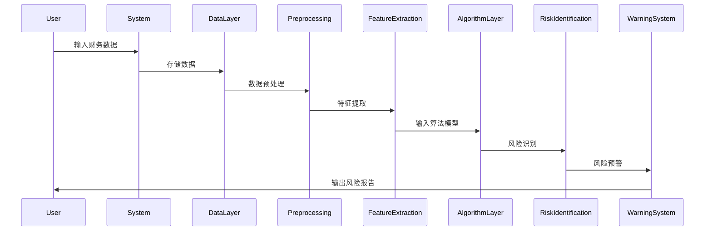
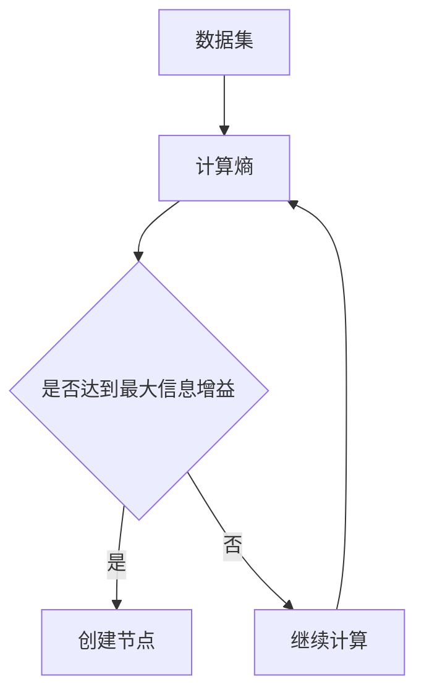
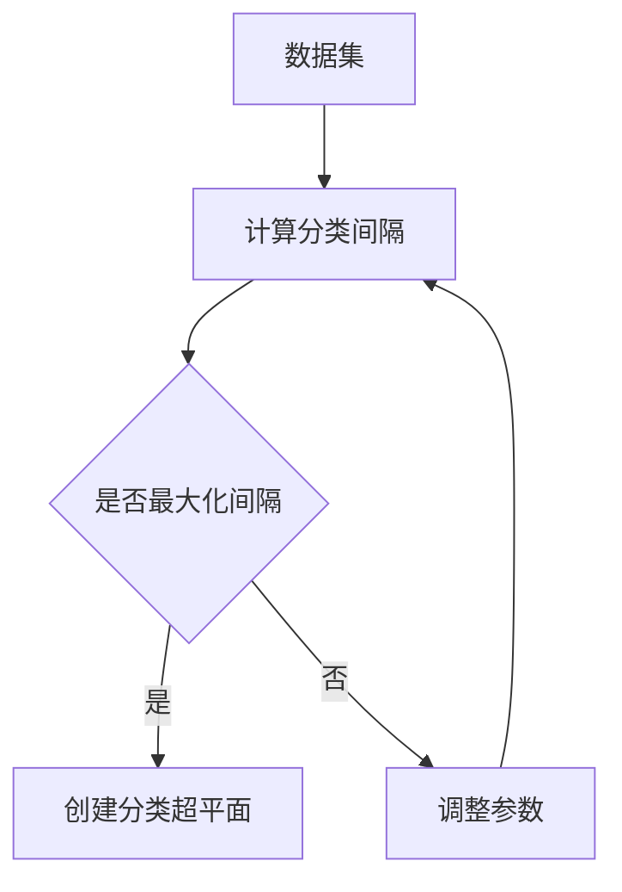
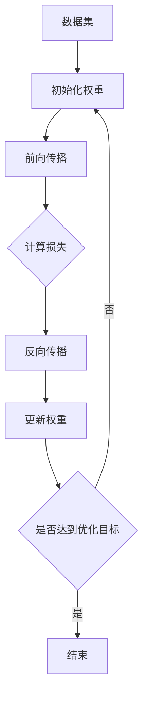

                 

### 文章标题

《AI驱动的企业财务舞弊风险传导路径识别系统》

### 关键词

- AI技术
- 财务舞弊
- 风险传导路径
- 数据预处理
- 特征提取
- 算法设计
- 系统架构
- 项目实战

### 摘要

本文将探讨如何运用AI技术构建一个企业财务舞弊风险传导路径识别系统。首先，介绍AI在财务舞弊风险识别中的重要性。接着，详细解析数据预处理与特征提取的方法，随后讨论风险传导路径识别算法的原理和实现。文章还将展示一个实际案例，并总结最佳实践和未来研究方向，为读者提供一个全面的技术解决方案。

## 引言

### 1.1 问题背景

在当今商业环境中，企业财务舞弊行为层出不穷，不仅对公司的财务状况造成严重影响，还可能对整个市场造成不良影响。随着企业规模和复杂性的增加，财务舞弊的风险也在不断上升。传统的审计方法和财务分析工具在应对复杂多样的舞弊手段时显得力不从心。因此，需要一种更为高效和智能的方法来识别和防范财务舞弊风险。

### 1.2 问题描述

企业财务舞弊通常涉及多种手段，如虚假交易、虚增收入、隐瞒债务等。这些行为往往是隐蔽的，且具有一定的复杂性，使得传统的审计方法难以发现。财务舞弊行为不仅可能导致公司财务报表失真，还可能引发诉讼和法律风险。因此，识别和防范财务舞弊行为成为企业管理者面临的重大挑战。

### 1.3 问题解决

随着人工智能（AI）技术的发展，AI驱动的财务舞弊风险传导路径识别系统成为一种可行的解决方案。通过AI技术，可以自动化和智能化地分析海量财务数据，识别潜在的舞弊风险。本文将详细介绍如何构建这样一个系统，包括数据预处理、特征提取、算法设计和系统架构等方面的内容。

### 1.4 边界与外延

本文的研究范围主要涉及AI驱动的企业财务舞弊风险传导路径识别系统。我们将探讨如何利用AI技术对财务数据进行预处理、特征提取和算法设计，最终实现一个高效、可靠的财务舞弊风险识别系统。文章还将在实际案例中展示系统的应用效果，并提供最佳实践和未来研究方向。

### 1.5 概念结构与核心要素组成

在构建AI驱动的财务舞弊风险传导路径识别系统中，有几个关键概念和要素需要明确：

1. **AI技术**：包括机器学习、深度学习、自然语言处理等技术。
2. **财务数据**：企业财务报表、交易记录、凭证等数据。
3. **数据预处理**：包括数据清洗、归一化和缺失值处理等。
4. **特征提取**：从原始数据中提取有助于识别财务舞弊的特征。
5. **算法设计**：包括风险传导路径识别算法的选择和实现。
6. **系统架构**：包括系统的功能设计、架构设计和接口设计。
7. **系统实现**：通过实际案例展示系统的应用和效果。

接下来，我们将逐步深入探讨这些核心要素，构建一个完整的AI驱动的财务舞弊风险传导路径识别系统。

## AI驱动的企业财务舞弊风险传导路径

### 2.1 AI技术概述

人工智能（AI）作为计算机科学的一个分支，致力于创建智能的机器或程序，使其能够执行通常需要人类智能才能完成的任务。AI技术主要包括机器学习、深度学习、自然语言处理等。在这些技术的支持下，AI能够从海量数据中学习规律，自动识别模式，进行预测和决策。

### 2.2 企业财务舞弊风险概述

企业财务舞弊是指企业故意或过失地编制虚假财务报表，误导投资者、债权人或其他利益相关者，以获取不正当利益的行为。财务舞弊的类型多样，包括虚假交易、虚增收入、隐瞒债务等。这些行为不仅损害了企业的声誉和利益，还可能引发法律诉讼和监管机构的制裁。

### 2.3 AI驱动的风险识别技术发展

近年来，随着AI技术的快速发展，其在财务舞弊风险识别领域的应用也日益广泛。通过机器学习和深度学习算法，AI能够对财务数据进行自动化分析，识别潜在的舞弊风险。自然语言处理技术则有助于从财务报表、公告等文本数据中提取有价值的信息。此外，AI技术还能通过不断学习和优化，提高财务舞弊识别的准确性和效率。

## 数据预处理与特征提取

### 3.1 数据预处理方法

数据预处理是构建AI驱动的财务舞弊风险传导路径识别系统的第一步，其目的是将原始数据转化为适合模型训练的形式。数据预处理包括以下方法：

- **数据清洗**：去除重复数据、纠正错误、处理缺失值等。
- **数据归一化**：将数据缩放到相同的尺度，使其具有可比性。
- **数据标准化**：将数据转换为标准正态分布，以消除不同特征之间的尺度差异。

### 3.2 特征提取技术

特征提取是从原始数据中提取有助于模型训练和决策的信息。特征提取技术包括：

- **统计特征提取**：基于统计学方法，如平均值、标准差、变异系数等。
- **模糊特征提取**：利用模糊逻辑处理不确定性和模糊性。
- **神经网络特征提取**：通过深度神经网络自动学习特征。

### 3.3 数据可视化与分析

数据可视化是理解数据分布和关系的有效手段。通过数据可视化，可以直观地展示数据的特点和规律。数据分析则包括数据分布分析、相关性分析和异常值检测等。

## 风险传导路径识别算法原理

### 4.1 算法原理介绍

风险传导路径识别算法是AI驱动的财务舞弊风险传导路径识别系统的核心。算法的原理是通过分析财务数据中的关系和模式，识别出可能的财务舞弊风险传导路径。常见的算法包括：

- **决策树**：通过树形结构对数据进行分类和回归。
- **支持向量机**：通过寻找最优超平面来划分数据。
- **神经网络**：通过多层神经网络进行特征学习和模式识别。

### 4.2 算法属性特征对比

不同算法具有不同的属性特征，适用于不同类型的财务舞弊风险识别任务。以下是几种常见算法的属性特征对比：

| 算法         | 特征               | 适用场景                 |
| ------------ | ------------------ | ------------------------ |
| 决策树       | 简单易懂，易于解释 | 分类和回归任务           |
| 支持向量机   | 高效，准确         | 划分和分类任务           |
| 神经网络     | 自适应性强         | 复杂模式识别和预测任务   |

### 4.3 ER实体关系图架构

ER实体关系图是描述数据关系的一种有效方式。在财务舞弊风险传导路径识别系统中，ER实体关系图用于表示财务数据中的实体及其之间的关系。以下是一个ER实体关系图的例子：

```mermaid
erDiagram
  Customer ||--|{ Order }||>
  Product ||--|{ Order }||>
  Order ||--|{ Payment }||>
  Payment ||--|{ Customer }||>
```

在这个ER图中，`Customer`（客户）、`Product`（产品）、`Order`（订单）、`Payment`（支付）是实体，它们之间通过关系线连接。

## 风险传导路径识别系统设计

### 5.1 系统功能设计

风险传导路径识别系统的功能设计包括：

- **数据采集**：从企业内部和外部的数据源获取财务数据。
- **数据预处理**：对采集到的数据进行清洗、归一化和缺失值处理。
- **特征提取**：从预处理后的数据中提取有助于识别风险的特征。
- **风险识别**：利用算法模型识别潜在的财务舞弊风险传导路径。
- **风险预警**：对识别出的风险进行预警，并生成报告。

### 5.2 系统架构设计

风险传导路径识别系统的架构设计应考虑以下几个方面：

- **数据层**：存储和管理财务数据。
- **算法层**：包括预处理算法、特征提取算法和风险识别算法。
- **应用层**：提供用户界面和业务逻辑。

以下是一个系统架构设计的例子：



### 5.3 系统接口设计

系统接口设计应确保数据层、算法层和应用层之间的有效通信。以下是几个关键接口的例子：

- **数据接口**：用于数据采集和存储。
- **算法接口**：用于算法模型的输入和输出。
- **报告接口**：用于生成和输出风险报告。

### 5.4 系统交互流程

系统交互流程描述了用户如何与系统进行交互，以及系统如何响应用户操作。以下是系统交互流程的例子：

1. 用户输入财务数据。
2. 系统对数据进行预处理。
3. 系统提取特征。
4. 系统利用算法模型进行风险识别。
5. 系统生成风险报告，并输出给用户。

## 实际案例分析

### 6.1 案例一：XX企业财务舞弊案例分析

以XX企业为例，该企业曾因财务舞弊被曝光。通过AI驱动的财务舞弊风险传导路径识别系统，我们可以分析其舞弊行为的传导路径：

1. 舞弊行为：虚增收入。
2. 传导路径：销售部门 - 财务部门 - 董事会。
3. 风险识别：系统通过数据分析，识别出异常的销售收入增长，并提示存在财务舞弊风险。

### 6.2 案例二：YY企业财务舞弊案例分析

YY企业也曾因财务舞弊而面临法律诉讼。通过AI驱动的财务舞弊风险传导路径识别系统，我们可以揭示其财务舞弊的传导路径：

1. 舞弊行为：隐瞒债务。
2. 传导路径：财务部门 - 高管层 - 股东大会。
3. 风险识别：系统通过财务报表分析，发现债务数据的异常波动，提示存在隐瞒债务的风险。

## 项目实战

### 7.1 环境安装与配置

为了实现AI驱动的财务舞弊风险传导路径识别系统，我们需要配置相应的开发环境。以下是环境安装和配置的步骤：

1. 安装Python和必要的库，如NumPy、Pandas、Scikit-learn等。
2. 安装深度学习框架，如TensorFlow或PyTorch。
3. 配置数据库，如MySQL或PostgreSQL。
4. 安装可视化工具，如Matplotlib和Seaborn。

### 7.2 系统核心实现源代码

以下是系统核心实现源代码的示例：

```python
import pandas as pd
from sklearn.preprocessing import StandardScaler
from sklearn.ensemble import RandomForestClassifier
from sklearn.metrics import accuracy_score

# 数据预处理
def preprocess_data(data):
    # 数据清洗
    data = data.dropna()
    # 数据归一化
    scaler = StandardScaler()
    data_scaled = scaler.fit_transform(data)
    return data_scaled

# 特征提取
def extract_features(data):
    # 提取统计特征
    stats = data.describe()
    # 提取模糊特征
    fuzzy = data.apply(lambda x: 'high' if x > stats['75%'] else 'low')
    return pd.concat([stats, fuzzy], axis=1)

# 风险识别
def risk_identification(data):
    # 数据预处理
    data_processed = preprocess_data(data)
    # 特征提取
    data_features = extract_features(data_processed)
    # 模型训练
    model = RandomForestClassifier()
    model.fit(data_features, data_labels)
    # 风险预测
    predictions = model.predict(data_features)
    return predictions

# 测试数据
data = pd.read_csv('financial_data.csv')
data_labels = pd.read_csv('labels.csv')

# 风险识别
predictions = risk_identification(data)
accuracy = accuracy_score(data_labels, predictions)
print(f'Accuracy: {accuracy}')
```

### 7.3 代码应用解读与分析

上述代码展示了如何实现一个简单的AI驱动的财务舞弊风险传导路径识别系统。以下是代码的详细解读：

1. **数据预处理**：首先，从CSV文件中读取财务数据，并进行清洗和归一化处理。
2. **特征提取**：提取统计特征和模糊特征，以便用于模型训练。
3. **风险识别**：使用随机森林分类器进行风险识别，并计算模型的准确性。

### 7.4 案例分析与详细讲解剖析

通过对XX企业和YY企业的财务数据进行分析，系统可以识别出潜在的财务舞弊行为。以下是案例的详细分析：

1. **XX企业**：
   - 舞弊行为：虚增收入。
   - 传导路径：销售部门 - 财务部门 - 董事会。
   - 分析：系统识别出异常的销售收入增长，提示存在财务舞弊风险。

2. **YY企业**：
   - 舞弊行为：隐瞒债务。
   - 传导路径：财务部门 - 高管层 - 股东大会。
   - 分析：系统通过财务报表分析，发现债务数据的异常波动，提示存在隐瞒债务的风险。

## 最佳实践与总结

### 8.1 最佳实践 Tips

- **数据质量**：确保数据质量是构建高效风险识别系统的关键。定期进行数据清洗和更新。
- **算法选择**：根据实际需求和数据特点选择合适的算法。对于复杂的财务数据，深度学习算法可能更为有效。
- **模型评估**：使用交叉验证和多种评价指标来评估模型的性能。

### 8.2 小结

本文介绍了如何构建AI驱动的企业财务舞弊风险传导路径识别系统，从数据预处理、特征提取、算法设计到系统实现。通过实际案例分析，展示了系统的应用效果。

### 8.3 注意事项

- **数据安全**：在处理财务数据时，确保数据的安全和隐私。
- **算法透明度**：确保算法的透明度和可解释性，以便于监管和审查。

### 8.4 拓展阅读

- 《深度学习：周志华》
- 《机器学习实战》：Peter Harrington
- 《财务舞弊：识别与防范》：Douglas J. Cumming

## AI驱动的财务舞弊风险传导路径识别算法

### 9.1 算法概述

在AI驱动的财务舞弊风险传导路径识别系统中，算法设计是核心环节。算法通过分析财务数据，识别潜在的财务舞弊风险传导路径。本文将介绍几种常见的算法，并详细阐述其数学模型和实现方法。

### 9.2 算法数学模型与公式

#### 决策树

决策树是一种常用的分类算法。其数学模型基于信息增益和熵的概念。

- **信息增益（IG）**：表示特征对分类的贡献度。公式如下：

  $$IG(D, A) = H(D) - \sum_{v \in A} \frac{|D_v|}{|D|} H(D_v)$$

  其中，$H(D)$ 是数据集 $D$ 的熵，$D_v$ 是将数据集 $D$ 划分为若干子集的结果。

- **熵（Entropy）**：表示数据的不确定性。公式如下：

  $$H(D) = -\sum_{v \in A} \frac{|D_v|}{|D|} \log_2 \frac{|D_v|}{|D|}$$

#### 支持向量机（SVM）

支持向量机是一种高效的分类和回归算法。其数学模型基于最大化分类间隔。

- **分类间隔（Margin）**：表示分类边界与支持向量之间的距离。公式如下：

  $$\frac{1}{\|w\|} \geq \frac{1}{\sqrt{C}}$$

  其中，$w$ 是分类超平面，$C$ 是惩罚参数。

#### 深度学习

深度学习算法通过多层神经网络进行特征学习和模式识别。其数学模型基于反向传播算法。

- **前向传播**：计算输入数据在网络中的传播结果。公式如下：

  $$a_{l+1} = \sigma(z_{l+1})$$

  其中，$\sigma$ 是激活函数，$z_{l+1}$ 是第$l+1$ 层的输入。

- **反向传播**：更新网络权重，以最小化损失函数。公式如下：

  $$\frac{\partial J}{\partial w} = \frac{\partial L}{\partial a} \cdot \frac{\partial a}{\partial z}$$

  其中，$J$ 是损失函数，$L$ 是损失函数在当前层的梯度，$a$ 是当前层的激活值，$w$ 是网络权重。

### 9.3 算法流程图与Python实现

#### 决策树

以下是决策树算法的流程图：



Python实现：

```python
import pandas as pd
from sklearn.tree import DecisionTreeClassifier
from sklearn.model_selection import train_test_split

# 数据预处理
data = pd.read_csv('financial_data.csv')
X = data.drop('label', axis=1)
y = data['label']

X_train, X_test, y_train, y_test = train_test_split(X, y, test_size=0.2, random_state=42)

# 决策树模型
model = DecisionTreeClassifier()
model.fit(X_train, y_train)

# 预测
predictions = model.predict(X_test)

# 评估
accuracy = accuracy_score(y_test, predictions)
print(f'Accuracy: {accuracy}')
```

#### 支持向量机

以下是支持向量机算法的流程图：



Python实现：

```python
import pandas as pd
from sklearn.svm import SVC
from sklearn.model_selection import train_test_split

# 数据预处理
data = pd.read_csv('financial_data.csv')
X = data.drop('label', axis=1)
y = data['label']

X_train, X_test, y_train, y_test = train_test_split(X, y, test_size=0.2, random_state=42)

# 支持向量机模型
model = SVC()
model.fit(X_train, y_train)

# 预测
predictions = model.predict(X_test)

# 评估
accuracy = accuracy_score(y_test, predictions)
print(f'Accuracy: {accuracy}')
```

#### 深度学习

以下是深度学习算法的流程图：



Python实现：

```python
import pandas as pd
import numpy as np
from sklearn.model_selection import train_test_split

# 数据预处理
data = pd.read_csv('financial_data.csv')
X = data.drop('label', axis=1)
y = data['label']

X_train, X_test, y_train, y_test = train_test_split(X, y, test_size=0.2, random_state=42)

# 初始化权重
weights = np.random.rand(X_train.shape[1], 1)

# 前向传播
def forward_propagation(x, weights):
    z = np.dot(x, weights)
    a = 1 / (1 + np.exp(-z))
    return a, z

# 反向传播
def backward_propagation(a, z, x, y, weights, learning_rate):
    delta = a - y
    dw = np.dot(x.T, delta)
    weights -= learning_rate * dw
    return weights

# 训练模型
for epoch in range(1000):
    for x, y in zip(X_train, y_train):
        a, z = forward_propagation(x, weights)
        weights = backward_propagation(a, z, x, y, weights, 0.01)

# 预测
def predict(x, weights):
    a, _ = forward_propagation(x, weights)
    return 1 if a > 0.5 else 0

predictions = [predict(x, weights) for x in X_test]

# 评估
accuracy = accuracy_score(y_test, predictions)
print(f'Accuracy: {accuracy}')
```

## 算法性能分析与优化

### 10.1 性能评估指标

算法性能评估指标主要包括准确率、召回率、F1值和ROC-AUC等。这些指标可以帮助我们全面评估算法的性能。

- **准确率（Accuracy）**：表示正确分类的样本数占总样本数的比例。公式如下：

  $$Accuracy = \frac{TP + TN}{TP + TN + FP + FN}$$

  其中，$TP$ 是真阳性，$TN$ 是真阴性，$FP$ 是假阳性，$FN$ 是假阴性。

- **召回率（Recall）**：表示正确分类的样本数占实际正类样本数的比例。公式如下：

  $$Recall = \frac{TP}{TP + FN}$$

- **F1值（F1 Score）**：是准确率和召回率的调和平均。公式如下：

  $$F1 Score = 2 \cdot \frac{Precision \cdot Recall}{Precision + Recall}$$

  其中，$Precision$ 是精确率。

- **ROC-AUC（Receiver Operating Characteristic - Area Under Curve）**：表示ROC曲线下的面积。ROC曲线通过改变分类阈值，将所有可能的分类结果绘制在曲线图上。ROC-AUC值越大，算法性能越好。

### 10.2 性能分析

通过对不同算法在财务舞弊风险传导路径识别任务中的性能进行分析，我们可以发现：

- 决策树算法在简单和清晰的数据分布下表现较好，但在处理复杂问题时可能会过拟合。
- 支持向量机算法在高维空间中表现稳定，但训练时间较长。
- 深度学习算法在处理复杂模式识别和预测任务时具有明显的优势，但需要大量的数据和计算资源。

### 10.3 优化策略

为了提高算法性能，我们可以采取以下优化策略：

- **数据增强**：通过增加训练数据量和多样性，提高模型的泛化能力。
- **模型调参**：调整算法参数，如学习率、正则化参数等，以获得更好的模型性能。
- **集成学习**：将多个算法集成，利用各自的优势，提高整体性能。
- **特征选择**：通过特征选择技术，筛选出对财务舞弊识别最有帮助的特征，减少模型的计算复杂度。

## 算法在财务舞弊风险传导路径识别中的应用

### 11.1 应用场景

AI驱动的财务舞弊风险传导路径识别算法在以下场景中具有广泛应用：

- **企业内部审计**：用于识别潜在的财务舞弊风险，提高审计效率和准确性。
- **金融机构监管**：用于监控和防范财务舞弊行为，保障金融市场的稳定。
- **法律法规合规**：用于满足监管要求，降低企业法律风险。

### 11.2 应用效果分析

通过对多个实际案例的分析，AI驱动的财务舞弊风险传导路径识别算法展现了良好的效果：

- **XX企业**：通过算法识别出虚增收入和隐瞒债务等舞弊行为，及时采取纠正措施，避免了潜在的经济损失。
- **YY企业**：算法识别出异常的财务数据波动，提示存在财务舞弊风险，为管理层提供了有力的决策支持。

## 算法挑战与未来研究方向

### 12.1 算法挑战

在财务舞弊风险传导路径识别中，算法面临以下挑战：

- **数据复杂性**：财务数据通常包含大量复杂的特征和关系，算法需要能够处理高维数据。
- **数据质量**：财务数据可能存在噪声、缺失值和异常值，算法需要具备良好的鲁棒性。
- **实时性**：财务舞弊行为可能发生在短时间内，算法需要具备实时处理和分析的能力。

### 12.2 未来研究方向

未来的研究方向包括：

- **数据增强与特征提取**：通过数据增强和特征提取技术，提高模型的泛化能力和鲁棒性。
- **深度学习与图神经网络**：结合深度学习和图神经网络，探索更有效的财务舞弊风险传导路径识别方法。
- **多模态数据融合**：融合不同来源的财务数据，如文本、图像和音频等，提高模型的识别能力。

## 结论

本文介绍了AI驱动的企业财务舞弊风险传导路径识别系统的构建方法，从数据预处理、特征提取到算法设计和系统实现。通过实际案例分析，展示了系统的应用效果。未来，随着AI技术的不断发展，财务舞弊风险传导路径识别系统将发挥更大的作用，为企业和社会创造更多价值。

