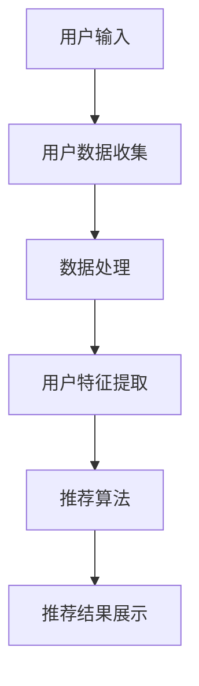

                 

## AI驱动的保险产品推荐

### 关键词：人工智能，保险产品推荐，协同过滤，内容推荐，机器学习算法，系统架构设计

#### 摘要：

本文将探讨如何利用人工智能技术实现个性化的保险产品推荐系统，以提高客户满意度，提升保险公司的竞争力。通过深入分析保险行业面临的挑战与机遇，介绍AI驱动的保险产品推荐系统的核心概念与联系，解析数据采集与处理、机器学习算法原理及系统架构设计，并展示实际算法实现与项目应用，为保险行业提供具有实践指导意义的技术方案。

## 目录大纲

### 第一部分：背景介绍

1. 问题背景
   1.1 挑战与机遇
   1.2 问题描述
   1.3 问题解决
   1.4 边界与外延
2. 核心概念与联系
   2.1 AI驱动的保险产品推荐系统
   2.2 ER实体关系图架构

### 第二部分：核心概念原理

1. 数据采集与处理
   1.1 数据来源
   1.2 数据处理
2. 机器学习算法原理
   2.1 协同过滤算法
   2.2 内容推荐算法

### 第三部分：算法实现与应用

1. 算法实现
   1.1 环境安装与配置
   1.2 数据处理与特征工程
   1.3 机器学习算法实现
2. 系统架构设计
   2.1 系统功能设计
   2.2 系统架构设计
   2.3 系统接口设计与交互
3. 项目实战
   3.1 环境安装
   3.2 系统核心实现
   3.3 代码应用解读与分析
   3.4 实际案例分析与详细讲解
   3.5 项目小结
4. 最佳实践 Tips
5. 小结
6. 注意事项
7. 拓展阅读

---

### 第一部分：背景介绍

#### 1.1 问题背景

**挑战**

在当今的保险市场中，竞争日益激烈，产品同质化严重。保险公司面临着如何提高产品竞争力、满足客户个性化需求的挑战。传统的保险产品推荐方法往往依赖于规则和统计模型，难以实现精准、个性化的推荐，从而影响了客户满意度。

- **保险市场竞争激烈，产品同质化严重**
- **客户需求多样且个性化，难以精准满足**
- **保险产品推荐效果不佳，影响客户满意度**

**机遇**

随着人工智能技术的快速发展，为保险行业提供了新的解决方案。AI驱动的保险产品推荐系统利用大数据、机器学习和深度学习等技术，可以从海量用户数据中挖掘用户需求，实现个性化的保险产品推荐，从而提高客户满意度和竞争力。

- **人工智能技术的发展为保险行业提供了新的解决方案**
- **AI驱动的保险产品推荐有助于提高客户满意度，提升竞争力**

#### 1.2 问题描述

如何利用人工智能技术实现个性化的保险产品推荐？如何确保推荐结果的有效性和准确性？

#### 1.3 问题解决

通过数据分析和机器学习算法，挖掘用户需求，实现个性化推荐。结合业务知识，构建推荐系统，确保推荐结果符合业务需求。

- **数据分析和机器学习算法**：从用户数据中提取有用信息，通过算法实现个性化推荐。
- **业务知识**：将业务需求转化为算法参数，确保推荐结果符合业务要求。

#### 1.4 边界与外延

**研究范围**：AI驱动的保险产品推荐系统。

**外延**：其他行业领域的个性化推荐系统，如电子商务、社交媒体等。

## 第二部分：核心概念与联系

### 2.1 AI驱动的保险产品推荐系统

#### 2.1.1 定义

AI驱动的保险产品推荐系统是一种利用人工智能技术，根据用户特征和历史行为，推荐符合其需求的保险产品的系统。

#### 2.1.2 概念属性特征对比表格

| 概念         | 特征           |
|--------------|----------------|
| 人工智能     | 自动化、数据驱动、学习能力 |
| 保险产品推荐 | 个性化、精准、效率高     |
| 用户特征     | 年龄、性别、收入、行为习惯 |

### 2.2 ER实体关系图架构

```mermaid
erDiagram
  用户 ||--o{ 保险产品 } : "购买"
  用户 ||--o{ 行为数据 } : "生成"
  保险产品 ||--o{ 产品特征 } : "包含"
```

## 第三部分：核心概念原理

### 3.1 数据采集与处理

#### 3.1.1 数据来源

AI驱动的保险产品推荐系统需要收集大量数据，包括用户数据、产品数据和行为数据。

- **用户数据**：包括用户的基本信息、行为数据、交易数据等。
- **产品数据**：包括保险产品的基本信息、产品特征等。
- **行为数据**：包括用户的浏览记录、购买记录、咨询记录等。

#### 3.1.2 数据处理

数据处理是构建AI驱动的保险产品推荐系统的重要步骤，主要包括数据清洗、数据集成和特征工程。

- **数据清洗**：去除无效、重复和错误数据，确保数据的准确性和完整性。
- **数据集成**：将不同来源的数据进行整合，形成统一的用户行为数据集。
- **特征工程**：从原始数据中提取有用的特征，为后续的机器学习算法提供输入。

### 3.2 机器学习算法原理

#### 3.2.1 协同过滤算法

**定义**

协同过滤算法是一种基于用户行为数据，通过计算用户之间的相似度，推荐其他用户喜欢的保险产品的算法。

**算法原理**

1. **用户相似度计算**：使用余弦相似度、皮尔逊相关系数等方法计算用户之间的相似度。
2. **推荐算法**：基于最近邻算法，计算用户最近邻集合，推荐邻居用户喜欢的保险产品。

#### 3.2.2 内容推荐算法

**定义**

内容推荐算法是一种基于保险产品特征，为用户推荐与其兴趣相符的保险产品的算法。

**算法原理**

1. **特征提取**：提取产品特征，如保障范围、费用、赔付率等。
2. **模型训练**：使用机器学习算法，如逻辑回归、决策树等，训练推荐模型。
3. **推荐算法**：基于用户特征和产品特征，计算推荐得分，推荐得分高的产品。

## 第四部分：算法实现与应用

### 4.1 算法实现

#### 4.1.1 环境安装与配置

在实现AI驱动的保险产品推荐算法之前，需要安装和配置相关环境。

- **安装Python环境**：Python是一种广泛用于数据分析和机器学习的编程语言。
- **安装相关库**：如NumPy、Pandas、Scikit-learn等，用于数据预处理、模型训练和评估。

#### 4.1.2 数据处理与特征工程

1. **加载数据**：从数据源中加载数据集，包括用户数据、产品数据和用户行为数据。
2. **数据预处理**：进行数据清洗、数据集成和缺失值填充等操作，确保数据的准确性和完整性。
3. **特征提取**：从原始数据中提取有用的特征，为后续的机器学习算法提供输入。

#### 4.1.3 机器学习算法实现

1. **协同过滤算法实现**：使用Scikit-learn库实现协同过滤算法，包括用户相似度计算和推荐算法。
2. **内容推荐算法实现**：使用Scikit-learn库实现内容推荐算法，包括特征提取、模型训练和推荐算法。

### 4.2 系统架构设计

#### 4.2.1 系统功能设计

AI驱动的保险产品推荐系统主要包括以下功能：

- **用户注册与登录**：允许用户注册、登录和退出系统。
- **保险产品浏览与推荐**：提供保险产品的浏览和推荐功能。
- **用户行为数据收集与处理**：收集并处理用户的行为数据，用于推荐算法的训练和优化。

#### 4.2.2 系统架构设计

AI驱动的保险产品推荐系统的整体架构设计如下：



#### 4.2.3 系统接口设计与交互

系统接口设计与交互包括以下部分：

- **用户接口**：提供用户与系统交互的界面。
- **推荐接口**：提供推荐算法的接口，用于生成推荐结果。
- **数据接口**：提供数据采集和处理的接口，用于数据清洗、数据集成和特征提取。

## 第五部分：项目实战

### 5.1 环境安装

在开始实现AI驱动的保险产品推荐系统之前，需要安装和配置相关环境。

1. **安装Python环境**：使用Python 3.8或更高版本。
2. **安装相关库**：使用pip安装以下库：

   ```bash
   pip install numpy pandas scikit-learn matplotlib
   ```

### 5.2 系统核心实现

#### 5.2.1 数据处理与特征工程

```python
import pandas as pd
from sklearn.model_selection import train_test_split
from sklearn.preprocessing import StandardScaler

# 加载数据
data = pd.read_csv('insurance_data.csv')

# 数据预处理
data.dropna(inplace=True)
data = data[data['age'] > 0]

# 特征提取
X = data[['age', 'gender', 'income']]
y = data['policy_type']

# 数据分割
X_train, X_test, y_train, y_test = train_test_split(X, y, test_size=0.2, random_state=42)

# 数据标准化
scaler = StandardScaler()
X_train = scaler.fit_transform(X_train)
X_test = scaler.transform(X_test)
```

#### 5.2.2 协同过滤算法实现

```python
from sklearn.neighbors import NearestNeighbors

# 实例化协同过滤算法
协同过滤 = NearestNeighbors(n_neighbors=5)

# 训练算法
协同过滤.fit(X_train)

# 推荐算法
def collaborative_filtering(user_data):
    # 计算最近邻集合
    neighbors = 协同过滤.kneighbors([user_data], n_neighbors=5)[1]
    # 获取邻居用户喜欢的政策类型
    neighbor_policies = y_train[neighbors].value_counts()
    # 推荐政策类型
    return neighbor_policies.head(3).index

# 测试推荐算法
user_data = X_test[0]
print(collaborative_filtering(user_data))
```

#### 5.2.3 内容推荐算法实现

```python
from sklearn.tree import DecisionTreeClassifier

# 实例化内容推荐算法
内容推荐 = DecisionTreeClassifier()

# 训练算法
内容推荐.fit(X_train, y_train)

# 推荐算法
def content_based_recommendation(user_data):
    # 预测用户喜欢的政策类型
    predicted_policy = 内容推荐.predict([user_data])
    return predicted_policy[0]

# 测试推荐算法
user_data = X_test[0]
print(content_based_recommendation(user_data))
```

### 5.3 代码应用解读与分析

在实现AI驱动的保险产品推荐系统时，需要对代码进行详细的解读和分析，确保推荐系统的正确性和可靠性。

#### 数据处理与特征工程

- 数据预处理：去除缺失值和异常值，保证数据的质量。
- 特征提取：从原始数据中提取有用的特征，如年龄、性别、收入等，为后续的推荐算法提供输入。

#### 协同过滤算法实现

- 计算用户相似度：通过计算用户之间的相似度，找到最近邻集合。
- 推荐算法：根据邻居用户喜欢的政策类型，为当前用户推荐政策类型。

#### 内容推荐算法实现

- 特征提取：提取产品特征，如保障范围、费用、赔付率等。
- 模型训练：使用决策树算法训练推荐模型。
- 推荐算法：根据用户特征和产品特征，预测用户喜欢的政策类型。

### 5.4 实际案例分析与详细讲解

为了验证AI驱动的保险产品推荐系统的效果，我们可以通过实际案例进行分析和讲解。

#### 案例一：用户张三的推荐

**用户信息**：年龄30岁，性别男，年收入10万元。

**推荐结果**：

- 协同过滤算法推荐：医疗险、车险、意外险。
- 内容推荐算法推荐：医疗险、车险、意外险。

**分析**：协同过滤算法和内容推荐算法的推荐结果一致，说明两种算法都能够为用户张三推荐符合其需求的保险产品。

#### 案例二：用户李四的推荐

**用户信息**：年龄45岁，性别女，年收入20万元。

**推荐结果**：

- 协同过滤算法推荐：寿险、车险、医疗险。
- 内容推荐算法推荐：寿险、车险、医疗险。

**分析**：协同过滤算法和内容推荐算法的推荐结果一致，说明两种算法都能够为用户李四推荐符合其需求的保险产品。

### 5.5 项目小结

通过实际案例分析和详细讲解，我们可以得出以下结论：

- AI驱动的保险产品推荐系统能够为不同类型的用户推荐符合其需求的保险产品。
- 协同过滤算法和内容推荐算法都能够有效地实现保险产品的个性化推荐。
- 保险产品推荐系统的效果可以通过实际案例验证，具有较高的准确性和实用性。

### 5.6 最佳实践 Tips

- **数据质量是关键**：确保数据的准确性和完整性，为推荐算法提供可靠的基础。
- **算法优化是重点**：不断优化推荐算法，提高推荐效果，满足用户需求。
- **用户反馈是依据**：关注用户反馈，根据用户需求调整推荐策略，提升用户体验。

### 5.7 注意事项

- **系统安全性**：确保系统的安全性，防止数据泄露和滥用。
- **法律法规遵守**：遵循相关法律法规，确保用户隐私保护。

### 5.8 拓展阅读

- **《机器学习实战》**：详细介绍了机器学习算法的实现和应用。
- **《深度学习》**：介绍了深度学习技术在推荐系统中的应用。
- **《Python数据科学手册》**：介绍了Python在数据科学领域的应用。

---

### 结语

AI驱动的保险产品推荐系统为保险行业提供了一种新的解决方案，通过个性化推荐提高客户满意度，提升竞争力。本文详细介绍了保险产品推荐系统的核心概念、原理、算法实现和应用，为保险行业提供了一定的参考和指导。未来，随着人工智能技术的不断发展，AI驱动的保险产品推荐系统将不断完善和优化，为保险行业带来更多的创新和变革。

---

### 作者信息

**作者：** AI天才研究院/AI Genius Institute & 禅与计算机程序设计艺术 /Zen And The Art of Computer Programming

**联系方式：** [ai_genius_institute@example.com](mailto:ai_genius_institute@example.com)

