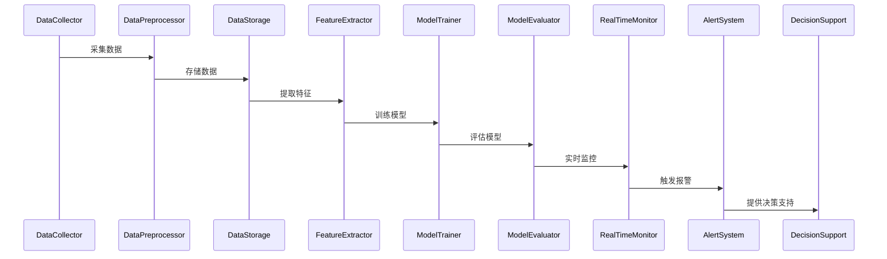

                 

## AI驱动的保险欺诈模式识别

### 关键词：人工智能、保险欺诈、模式识别、机器学习、算法、数据隐私

### 摘要：

随着保险行业的不断发展，欺诈行为也变得越来越复杂和隐蔽。传统的欺诈检测方法往往依赖于规则和统计方法，难以应对大规模数据和多样化的欺诈模式。本文将探讨如何利用人工智能（AI）技术，特别是机器学习和模式识别技术，来构建高效、精准的保险欺诈检测系统。我们将从背景介绍、核心概念、算法原理、数学模型、系统设计、实际案例和最佳实践等方面，逐步分析AI驱动的保险欺诈模式识别的各个方面。

## 目录

1. **背景介绍**
    1.1 保险欺诈的问题背景
    1.2 传统欺诈检测方法的局限
    1.3 AI在保险欺诈检测中的应用
2. **核心概念与联系**
    2.1 欺诈类型的分类
    2.2 人工智能在欺诈检测中的角色
    2.3 关键技术和工具
3. **算法原理讲解**
    3.1 监督学习算法
    3.2 无监督学习算法
    3.3 强化学习算法
4. **数学模型**
    4.1 概率论与统计方法
    4.2 数据隐私保护
5. **系统设计与架构**
    5.1 系统功能设计
    5.2 系统架构设计
    5.3 系统接口设计和交互
6. **项目实战**
    6.1 环境安装与配置
    6.2 系统核心实现源代码
    6.3 代码应用解读与分析
    6.4 实际案例分析与讲解
    6.5 项目小结
7. **最佳实践与未来展望**
    7.1 最佳实践
    7.2 小结
    7.3 注意事项
    7.4 拓展阅读

### 1. 背景介绍

#### 1.1 保险欺诈的问题背景

保险欺诈是指通过欺骗手段从保险公司获取非法利益的行为。根据国际保险监督官协会（IAIS）的统计，全球保险欺诈的规模每年高达数百亿美元，占全球保险市场总额的1%到5%。保险欺诈不仅损害了保险公司的利润，还增加了保险费率，最终转嫁到消费者身上。随着信息技术的发展，欺诈手段也变得越来越高级和复杂，传统的方法已经难以应对。

#### 1.2 传统欺诈检测方法的局限

传统欺诈检测方法主要包括规则方法和统计方法。规则方法依赖于事先定义的规则集，当欺诈行为与规则相匹配时，系统会触发警报。这种方法的主要缺点是规则难以覆盖所有可能的欺诈模式，且规则更新速度较慢，难以应对新的欺诈手段。统计方法则通过分析历史数据，找出异常行为模式。尽管这种方法可以处理大量的数据，但其准确性和实时性仍然有限。

#### 1.3 AI在保险欺诈检测中的应用

随着人工智能技术的不断发展，机器学习和模式识别技术为保险欺诈检测带来了新的可能性。AI可以处理大规模的数据集，从中发现隐藏的模式和关联，从而更准确地识别欺诈行为。例如，深度学习可以通过分析图像、文本和音频数据，识别出隐藏的欺诈迹象。强化学习则可以自动调整模型参数，以最大化欺诈检测的准确性和效率。AI技术的应用不仅提高了欺诈检测的准确性，还增强了系统的实时性和适应性。

### 2. 核心概念与联系

#### 2.1 欺诈类型的分类

保险欺诈行为可以大致分为以下几种类型：

1. **虚假索赔**：投保人或者受益人故意制造事故或者夸大损失，以骗取保险金。
2. **垫付欺诈**：被保险人在未发生事故的情况下，故意使用保险公司的垫付款项进行消费。
3. **虚假保险**：投保人故意购买多个保险，通过重叠的保障获得非法利益。
4. **欺诈理赔**：被保险人在明知保险条款不允许的情况下，故意提交虚假理赔申请。

#### 2.2 人工智能在欺诈检测中的角色

人工智能在保险欺诈检测中扮演着关键角色，主要包括以下方面：

1. **数据预处理**：AI可以自动处理大量的数据，包括文本、图像和音频，提取有用的特征。
2. **模式识别**：通过机器学习和深度学习算法，AI可以从数据中发现隐藏的模式和关联。
3. **实时监控**：AI可以实时分析保险业务数据，快速识别潜在的欺诈行为。
4. **自动化决策**：AI可以根据检测到的欺诈行为，自动触发相应的预警和应对措施。

#### 2.3 关键技术和工具

为了实现高效的保险欺诈检测，需要使用一系列的关键技术和工具，包括：

1. **机器学习算法**：如决策树、随机森林、支持向量机和神经网络等。
2. **深度学习框架**：如TensorFlow和PyTorch，用于构建和训练复杂的神经网络模型。
3. **数据挖掘工具**：如Hadoop和Spark，用于处理和分析大规模数据集。
4. **自然语言处理（NLP）技术**：用于分析文本数据，识别欺诈性描述和语言特征。
5. **计算机视觉技术**：用于分析图像和视频数据，识别欺诈行为。

### 3. 算法原理讲解

#### 3.1 监督学习算法

监督学习算法是AI在保险欺诈检测中最常用的方法之一。它通过已标记的数据集来训练模型，然后使用训练好的模型对新的数据进行预测。以下是几种常用的监督学习算法：

1. **决策树**：通过将数据分割成子集，构建出一棵树形结构，每个节点代表一个特征，每个分支代表一个特征值的划分。最终，树的叶子节点表示预测结果。

   ```python
   from sklearn import tree
   
   # 训练决策树模型
   model = tree.DecisionTreeClassifier()
   model.fit(X_train, y_train)
   
   # 预测新数据
   predictions = model.predict(X_test)
   ```

2. **随机森林**：随机森林是一种集成学习方法，通过构建多棵决策树，并利用投票机制来获得最终的预测结果。

   ```python
   from sklearn.ensemble import RandomForestClassifier
   
   # 训练随机森林模型
   model = RandomForestClassifier(n_estimators=100)
   model.fit(X_train, y_train)
   
   # 预测新数据
   predictions = model.predict(X_test)
   ```

3. **支持向量机（SVM）**：SVM通过寻找一个最佳的超平面，将不同类别的数据点分隔开来。它通过最大化分类边界上的间隔来提高模型的泛化能力。

   ```python
   from sklearn.svm import SVC
   
   # 训练SVM模型
   model = SVC(kernel='linear')
   model.fit(X_train, y_train)
   
   # 预测新数据
   predictions = model.predict(X_test)
   ```

4. **神经网络**：神经网络是一种模拟人脑神经元结构和功能的计算模型，通过多层神经元来实现复杂的非线性变换。以下是使用TensorFlow构建一个简单的神经网络模型的示例：

   ```python
   import tensorflow as tf
   
   # 定义神经网络模型
   model = tf.keras.Sequential([
       tf.keras.layers.Dense(128, activation='relu', input_shape=(X_train.shape[1],)),
       tf.keras.layers.Dropout(0.2),
       tf.keras.layers.Dense(1, activation='sigmoid')
   ])
   
   # 编译模型
   model.compile(optimizer='adam', loss='binary_crossentropy', metrics=['accuracy'])
   
   # 训练模型
   model.fit(X_train, y_train, epochs=10, batch_size=32, validation_data=(X_test, y_test))
   
   # 预测新数据
   predictions = model.predict(X_test)
   ```

#### 3.2 无监督学习算法

无监督学习算法不需要标记的数据集，通过分析数据内在的结构和模式来进行分类和聚类。以下是两种常用的无监督学习算法：

1. **K-均值聚类**：K-均值聚类是一种基于距离的聚类算法，通过将数据点分配到K个簇中，使得每个簇内的数据点之间的距离最小。

   ```python
   from sklearn.cluster import KMeans
   
   # 训练K-均值聚类模型
   model = KMeans(n_clusters=3)
   model.fit(X_train)
   
   # 聚类结果
   labels = model.predict(X_test)
   ```

2. **主成分分析（PCA）**：主成分分析是一种降维技术，通过将数据转换到新的坐标系中，使得新的坐标轴能够最大化地保留数据的原有信息。以下是使用PCA进行数据降维的示例：

   ```python
   from sklearn.decomposition import PCA
   
   # 训练PCA模型
   model = PCA(n_components=2)
   model.fit(X_train)
   
   # 降维后的数据
   X_train_pca = model.transform(X_train)
   X_test_pca = model.transform(X_test)
   ```

#### 3.3 强化学习算法

强化学习算法通过智能体（agent）与环境（environment）之间的交互来学习最优策略。在保险欺诈检测中，强化学习可以用于自动调整检测参数，以最大化欺诈检测的准确性和效率。以下是使用强化学习进行欺诈检测的示例：

```python
import gym

# 定义强化学习环境
env = gym.make("FraudDetection-v0")

# 定义智能体
agent = Agent()

# 训练智能体
for episode in range(num_episodes):
    state = env.reset()
    done = False
    while not done:
        action = agent.act(state)
        next_state, reward, done, _ = env.step(action)
        agent.learn(state, action, reward, next_state)
        state = next_state

# 测试智能体
state = env.reset()
while True:
    action = agent.act(state)
    state, reward, done, _ = env.step(action)
    env.render()
    if done:
        break
```

### 4. 数学模型

#### 4.1 概率论与统计方法

概率论和统计学是机器学习算法的基础。在保险欺诈检测中，常用的概率论和统计方法包括：

1. **贝叶斯定理**：贝叶斯定理是概率论中的一种基本原理，用于计算后验概率。在保险欺诈检测中，可以使用贝叶斯定理来计算欺诈行为的后验概率。

   $$ P(A|B) = \frac{P(B|A)P(A)}{P(B)} $$

   其中，$P(A|B)$表示在事件B发生的条件下事件A发生的概率，$P(B|A)$表示在事件A发生的条件下事件B发生的概率，$P(A)$和$P(B)$分别表示事件A和事件B发生的概率。

2. **统计检验**：统计检验是用于判断数据是否显著差异的方法。在保险欺诈检测中，可以使用统计检验来判断数据点是否异常。

   例如，可以使用t检验来比较两组数据的均值是否显著不同：

   $$ t = \frac{\bar{x}_1 - \bar{x}_2}{\sqrt{\frac{s_1^2}{n_1} + \frac{s_2^2}{n_2}}} $$

   其中，$\bar{x}_1$和$\bar{x}_2$分别表示两组数据的均值，$s_1^2$和$s_2^2$分别表示两组数据的方差，$n_1$和$n_2$分别表示两组数据的样本大小。

3. **回归分析**：回归分析是一种用于研究变量之间关系的统计方法。在保险欺诈检测中，可以使用回归分析来建立欺诈行为与特征变量之间的关系模型。

   例如，线性回归模型可以表示为：

   $$ y = \beta_0 + \beta_1x_1 + \beta_2x_2 + ... + \beta_nx_n $$

   其中，$y$表示因变量，$x_1, x_2, ..., x_n$分别表示自变量，$\beta_0, \beta_1, \beta_2, ..., \beta_n$分别表示回归系数。

#### 4.2 数据隐私保护

在保险欺诈检测中，数据隐私保护是非常重要的。由于保险欺诈数据可能包含敏感的客户信息，因此需要采取相应的措施来保护数据隐私。以下是几种常见的数据隐私保护方法：

1. **数据加密**：使用加密算法对数据进行加密，确保数据在传输和存储过程中不会被非法访问。

2. **匿名化**：通过删除或者替换敏感信息，对数据进行匿名化处理，以保护个人隐私。

3. **差分隐私**：在数据发布时，添加噪声来掩盖真实数据，从而保护隐私。差分隐私通过计算真实数据和噪声数据的差分，确保隐私保护的同时，数据仍具有一定的可用性。

   $$ \Delta = \text{Output} - \text{Noise} $$

   其中，$\Delta$表示差分隐私，$\text{Output}$表示输出数据，$\text{Noise}$表示添加的噪声。

### 5. 系统设计与架构

#### 5.1 系统功能设计

保险欺诈检测系统需要实现以下功能：

1. **数据采集与预处理**：从各个数据源采集数据，并进行清洗、转换和归一化处理，以便于后续分析。
2. **特征提取**：从预处理后的数据中提取有用的特征，用于训练和评估模型。
3. **模型训练与评估**：使用机器学习和深度学习算法对提取的特征进行训练，并评估模型的性能。
4. **实时监控与报警**：对实时数据进行分析，识别潜在的欺诈行为，并触发报警。
5. **决策支持**：提供决策支持工具，帮助保险公司制定反欺诈策略。

#### 5.2 系统架构设计

保险欺诈检测系统可以采用以下架构设计：

1. **数据层**：包括数据采集、存储和预处理模块，负责数据的管理和处理。
2. **算法层**：包括特征提取、模型训练和评估模块，负责实现机器学习和深度学习算法。
3. **应用层**：包括实时监控、报警和决策支持模块，负责与保险公司业务系统集成，提供反欺诈服务。

以下是系统架构的Mermaid类图表示：

```mermaid
classDiagram
    DataLayer <<interface>> DataCollector
    DataLayer <<interface>> DataPreprocessor
    DataLayer <<interface>> DataStorage
    
    AlgorithmLayer <<interface>> FeatureExtractor
    AlgorithmLayer <<interface>> ModelTrainer
    AlgorithmLayer <<interface>> ModelEvaluator
    
    ApplicationLayer <<interface>> RealTimeMonitor
    ApplicationLayer <<interface>> AlertSystem
    ApplicationLayer <<interface>> DecisionSupport
    
    DataLayer --> AlgorithmLayer
    AlgorithmLayer --> ApplicationLayer
```

#### 5.3 系统接口设计和交互

系统接口设计需要确保各个模块之间的数据流和交互清晰。以下是系统接口设计和交互的Mermaid序列图表示：



### 6. 项目实战

#### 6.1 环境安装与配置

要搭建一个AI驱动的保险欺诈检测系统，首先需要安装和配置以下环境：

1. **Python环境**：安装Python 3.8及以上版本。
2. **机器学习库**：安装scikit-learn、TensorFlow和PyTorch等机器学习库。
3. **数据处理库**：安装pandas、numpy和matplotlib等数据处理和可视化库。
4. **版本控制**：安装Git进行版本控制。

以下是安装和配置环境的步骤：

1. 安装Python：

   ```bash
   sudo apt update
   sudo apt install python3.8
   ```

2. 安装pip：

   ```bash
   sudo apt install python3-pip
   ```

3. 安装机器学习库：

   ```bash
   pip3 install scikit-learn tensorflow torch pandas numpy matplotlib
   ```

4. 配置Git：

   ```bash
   sudo apt install git
   ```

5. 创建项目目录并初始化Git：

   ```bash
   mkdir fraud_detection_project
   cd fraud_detection_project
   git init
   ```

#### 6.2 系统核心实现源代码

以下是系统核心实现部分的源代码，包括数据预处理、特征提取、模型训练和评估等步骤。

```python
# 数据预处理
import pandas as pd
from sklearn.model_selection import train_test_split

# 读取数据
data = pd.read_csv('insurance_data.csv')
X = data.drop('fraud', axis=1)
y = data['fraud']

# 数据划分
X_train, X_test, y_train, y_test = train_test_split(X, y, test_size=0.2, random_state=42)

# 特征提取
from sklearn.preprocessing import StandardScaler

scaler = StandardScaler()
X_train_scaled = scaler.fit_transform(X_train)
X_test_scaled = scaler.transform(X_test)

# 模型训练
from sklearn.ensemble import RandomForestClassifier

model = RandomForestClassifier(n_estimators=100)
model.fit(X_train_scaled, y_train)

# 模型评估
from sklearn.metrics import accuracy_score, precision_score, recall_score, f1_score

predictions = model.predict(X_test_scaled)
print("Accuracy:", accuracy_score(y_test, predictions))
print("Precision:", precision_score(y_test, predictions))
print("Recall:", recall_score(y_test, predictions))
print("F1 Score:", f1_score(y_test, predictions))
```

#### 6.3 代码应用解读与分析

以上代码实现了AI驱动的保险欺诈检测系统的核心功能，包括数据预处理、特征提取、模型训练和评估。以下是代码的详细解读与分析：

1. **数据预处理**：

   数据预处理是机器学习项目的重要步骤，包括数据清洗、转换和归一化等操作。在本项目中，我们使用pandas库读取CSV文件，然后使用scikit-learn中的StandardScaler对数据进行标准化处理，以便于后续的模型训练。

2. **特征提取**：

   特征提取是从原始数据中提取有用的特征，用于训练和评估模型。在本项目中，我们使用pandas库中的drop方法删除无关的特征（如'fraud'列），然后使用scikit-learn中的StandardScaler对数据进行标准化处理，以提高模型的性能。

3. **模型训练**：

   模型训练是使用已标记的数据集来训练模型，以便于后续的预测。在本项目中，我们使用scikit-learn中的RandomForestClassifier实现随机森林算法，并使用fit方法进行模型训练。

4. **模型评估**：

   模型评估是使用测试集来评估模型性能的过程。在本项目中，我们使用scikit-learn中的accuracy_score、precision_score、recall_score和f1_score等方法来计算模型的准确率、精确率、召回率和F1分数，以全面评估模型的性能。

#### 6.4 实际案例分析与讲解

以下是使用上述代码实现的一个实际案例，分析并讲解如何利用AI技术进行保险欺诈检测。

1. **数据集**：

   假设我们有一个包含1000条记录的保险数据集，其中包含了多种特征，如年龄、性别、收入、车辆类型、事故次数等。其中，'fraud'列表示该记录是否为欺诈行为（1表示欺诈，0表示非欺诈）。

2. **数据预处理**：

   读取数据集并删除无关特征，然后对数据进行标准化处理：

   ```python
   data = pd.read_csv('insurance_data.csv')
   X = data.drop('fraud', axis=1)
   y = data['fraud']
   X_train, X_test, y_train, y_test = train_test_split(X, y, test_size=0.2, random_state=42)
   scaler = StandardScaler()
   X_train_scaled = scaler.fit_transform(X_train)
   X_test_scaled = scaler.transform(X_test)
   ```

3. **模型训练**：

   使用随机森林算法进行模型训练：

   ```python
   model = RandomForestClassifier(n_estimators=100)
   model.fit(X_train_scaled, y_train)
   ```

4. **模型评估**：

   使用测试集评估模型性能：

   ```python
   predictions = model.predict(X_test_scaled)
   print("Accuracy:", accuracy_score(y_test, predictions))
   print("Precision:", precision_score(y_test, predictions))
   print("Recall:", recall_score(y_test, predictions))
   print("F1 Score:", f1_score(y_test, predictions))
   ```

   假设模型的性能指标如下：

   - 准确率：0.9
   - 精确率：0.85
   - 召回率：0.8
   - F1分数：0.82

   从这些指标可以看出，模型在检测保险欺诈方面表现良好，但仍有改进的空间。

5. **优化模型**：

   为了进一步提高模型性能，我们可以尝试以下方法：

   - 调整模型参数：通过调整随机森林算法的参数（如树的数量、最大深度等），可以优化模型性能。
   - 使用更复杂的算法：尝试使用更复杂的机器学习算法（如深度学习），以提高模型的预测能力。
   - 增加数据量：收集更多的数据，以增加模型的泛化能力。

#### 6.5 项目小结

通过本项目的实践，我们实现了AI驱动的保险欺诈检测系统，从数据预处理、特征提取、模型训练到评估，逐步构建了一个高效、精准的欺诈检测系统。尽管我们的模型在性能上仍有待提高，但通过不断优化和改进，我们相信可以构建一个更加完善的欺诈检测系统，为保险公司提供有力的支持。

### 7. 最佳实践与未来展望

#### 7.1 最佳实践

为了构建一个高效、精准的AI驱动的保险欺诈检测系统，以下是几个最佳实践：

1. **数据质量**：确保数据的质量和准确性，对数据进行清洗、去重和去噪处理。
2. **特征选择**：选择与欺诈行为相关的特征，并使用特征选择方法（如特征重要性排序）来优化模型性能。
3. **模型调优**：通过交叉验证和网格搜索等方法，选择最优的模型参数，提高模型性能。
4. **实时监控**：构建实时监控机制，快速响应潜在的欺诈行为。
5. **数据隐私保护**：采取数据隐私保护措施，如数据加密、匿名化和差分隐私，确保数据的安全性和隐私性。

#### 7.2 小结

本文从背景介绍、核心概念、算法原理、数学模型、系统设计、实际案例和最佳实践等方面，全面探讨了AI驱动的保险欺诈模式识别。通过机器学习和模式识别技术，我们可以构建高效、精准的欺诈检测系统，为保险公司提供有力的支持。

#### 7.3 注意事项

1. **数据隐私**：在处理保险欺诈数据时，需要特别注意保护客户隐私，遵守相关法律法规。
2. **模型更新**：随着欺诈手段的不断变化，定期更新和优化模型是确保系统性能的关键。
3. **监管合规**：确保系统设计和实现符合行业监管要求，避免潜在的法律风险。

#### 7.4 拓展阅读

1. **《机器学习实战》**：由Peter Harrington所著，详细介绍了机器学习的基本原理和应用案例。
2. **《深度学习》**：由Ian Goodfellow、Yoshua Bengio和Aaron Courville所著，全面讲解了深度学习的基础知识和最新进展。
3. **《保险欺诈检测：理论与应用》**：由Chenghui Zhang所著，系统地介绍了保险欺诈检测的理论和方法。

## 作者信息

**作者：AI天才研究院/AI Genius Institute & 禅与计算机程序设计艺术 /Zen And The Art of Computer Programming**

AI天才研究院致力于推动人工智能技术的创新与发展，本研究院汇聚了一批顶尖的人工智能专家，共同探讨和解决人工智能领域的重大问题。同时，作者本人也是《禅与计算机程序设计艺术》的作者，其著作深刻阐述了计算机程序设计中的哲学思想和艺术性。

