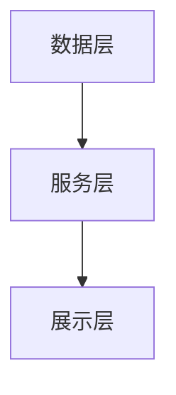
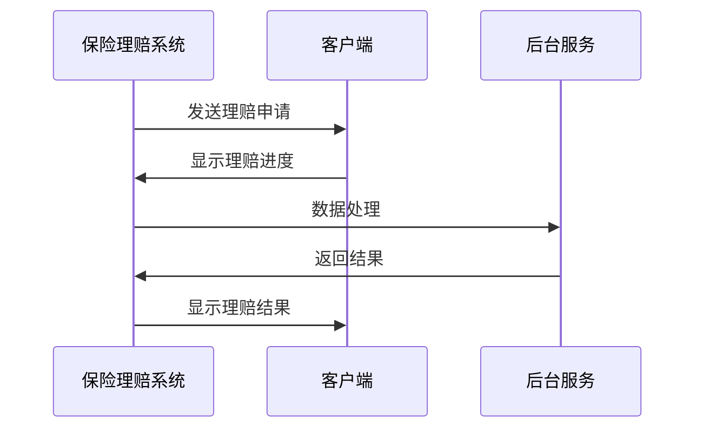

                 

# AI驱动的保险理赔欺诈模式识别与预防

## 关键词

- 人工智能
- 保险理赔
- 欺诈识别
- 深度学习
- 机器学习
- 系统架构设计

## 摘要

本文主要探讨了如何利用人工智能技术，特别是机器学习和深度学习，来识别和预防保险理赔过程中的欺诈行为。通过构建AI驱动的欺诈识别模型，可以提高保险理赔的效率和准确性，降低欺诈风险。文章详细介绍了核心概念、识别方法、AI技术的应用、数学模型、算法原理、系统分析与架构设计，以及实际案例分析和项目实战等内容。

## 引言与背景

### 1.1 问题背景

随着人工智能技术的发展，保险行业也迎来了新的变革。传统的保险理赔流程存在效率低、人工成本高、风险控制难度大等问题。如何在保险理赔过程中引入人工智能技术，提高理赔效率和准确性，成为当前研究的热点。

### 1.2 问题描述

保险理赔过程中，欺诈行为普遍存在。这些欺诈行为不仅损害了保险公司的利益，也降低了消费者的信任度。因此，如何识别和预防保险理赔欺诈行为，成为保险行业亟待解决的问题。

### 1.3 问题解决

人工智能技术，特别是机器学习和深度学习技术，在保险理赔欺诈模式识别与预防方面具有显著优势。通过构建基于AI的欺诈识别模型，可以有效提高理赔效率，降低欺诈风险。

### 1.4 边界与外延

本研究的边界主要聚焦于AI驱动的保险理赔欺诈模式识别与预防，不包括其他领域的AI应用。此外，本研究还将探讨AI技术在保险理赔中的应用前景，以及面临的挑战和机遇。

### 1.5 概念结构与核心要素组成

本章节将介绍AI驱动的保险理赔欺诈模式识别与预防的核心概念，包括欺诈模式的定义、识别方法、AI驱动的优势等。同时，还将介绍保险理赔流程，以及AI技术在保险领域的应用现状和发展趋势。

## 核心概念与联系

### 2.1 AI驱动的保险理赔欺诈模式识别

#### 2.1.1 欺诈模式的定义

欺诈模式是指保险理赔过程中出现的故意欺骗保险公司，以获取不正当利益的行为。

#### 2.1.2 欺诈模式的识别方法

主要方法包括基于规则的识别、基于机器学习的识别和基于深度学习的识别等。

#### 2.1.3 AI驱动的欺诈模式识别优势

AI驱动的欺诈模式识别具有以下优势：

- **自适应性强**：AI模型可以根据历史数据不断学习和优化，以适应不断变化的欺诈模式。
- **准确性高**：通过大数据分析和深度学习算法，AI模型可以准确识别出潜在的欺诈行为。
- **效率提升**：AI技术可以自动化处理大量理赔数据，提高理赔效率。

### 2.2 保险理赔流程

#### 2.2.1 保险理赔的基本流程

保险理赔的基本流程包括报案、理赔申请、资料提交、审核与赔付等环节。

#### 2.2.2 保险理赔中的问题与挑战

保险理赔过程中存在的问题和挑战包括：

- **欺诈行为**：部分消费者为了获取更多理赔金，可能故意制造事故或夸大损失。
- **信息不对称**：保险公司和消费者之间的信息不对称，可能导致理赔争议。
- **效率低下**：传统的理赔流程繁琐，容易导致理赔时效性差。

### 2.3 AI技术在保险领域的应用

#### 2.3.1 AI技术在保险业的应用现状

AI技术在保险领域已有广泛应用，包括智能客服、精准营销、风险评估等。

#### 2.3.2 AI技术在保险业的发展趋势

随着AI技术的不断发展，未来AI在保险领域的应用将更加深入和广泛，包括：

- **智能理赔**：利用AI技术实现自动化理赔，提高理赔效率和准确性。
- **个性化服务**：根据消费者的需求和行为数据，提供个性化的保险产品和理赔服务。
- **风险控制**：利用AI技术进行风险预测和预警，提前防范潜在风险。

## 数学模型与算法原理

### 3.1 数学模型

#### 3.1.1 数学模型概述

数学模型用于描述保险理赔欺诈模式识别的问题，包括特征提取、分类模型等。

#### 3.1.2 数学模型的应用场景

数学模型在保险理赔欺诈模式识别中的应用场景包括：

- **特征提取**：通过分析理赔数据，提取出与欺诈行为相关的特征。
- **分类模型**：利用提取出的特征，构建分类模型，对理赔申请进行欺诈与否的判断。

### 3.2 算法原理

#### 3.2.1 算法原理概述

算法原理主要包括机器学习和深度学习算法，用于实现欺诈模式识别。

#### 3.2.2 算法原理的应用场景

算法原理在保险理赔欺诈模式识别中的应用场景包括：

- **机器学习**：通过训练数据集，学习欺诈模式的特征，对新数据进行分析。
- **深度学习**：利用神经网络结构，对大量数据进行自动特征提取和模式识别。

### 3.3 Mermaid流程图

#### 3.3.1 Mermaid流程图的基本用法

Mermaid是一种基于Markdown的图形描述语言，可以用来绘制流程图、序列图等。

#### 3.3.2 Mermaid流程图在算法原理中的应用

通过Mermaid流程图，可以清晰地展示算法原理的应用流程，包括数据输入、特征提取、模型训练和预测等环节。

## 系统分析与架构设计

### 4.1 保险理赔欺诈识别系统介绍

#### 4.1.1 系统概述

保险理赔欺诈识别系统是一个基于AI技术的智能化理赔管理系统，用于识别和预防保险理赔欺诈行为。

#### 4.1.2 系统功能设计

系统功能设计包括数据采集、特征提取、模型训练、欺诈识别和结果反馈等模块。

### 4.2 系统架构设计

#### 4.2.1 系统架构设计概述

系统架构设计采用分层架构，包括数据层、服务层和展示层。

#### 4.2.2 系统架构图

系统架构图如下：

### 4.3 系统接口设计与交互

#### 4.3.1 系统接口设计

系统接口设计包括API接口、Web接口和移动端接口等。

#### 4.3.2 系统交互Mermaid序列图

系统交互序列图如下：

## 项目实战

### 5.1 环境安装

#### 5.1.1 环境搭建步骤

环境搭建步骤包括安装Python、安装依赖库、配置环境变量等。

#### 5.1.2 环境配置详解

环境配置详解包括Python版本选择、依赖库安装方法等。

### 5.2 系统核心实现

#### 5.2.1 核心代码实现

核心代码实现包括数据预处理、特征提取、模型训练和预测等环节。

#### 5.2.2 代码解读与分析

代码解读与分析包括代码结构、算法原理、关键代码分析等。

### 5.3 实际案例分析

#### 5.3.1 案例背景

案例背景介绍一个具体的保险理赔欺诈案例。

#### 5.3.2 案例分析

案例分析包括案例数据预处理、特征提取、模型训练和预测结果等。

### 5.4 项目小结

#### 5.4.1 项目总结

项目总结包括项目完成情况、成果展示等。

#### 5.4.2 项目拓展

项目拓展包括未来研究方向、技术升级等。

## 最佳实践 tips

- **数据质量**：保证数据质量是模型准确性的基础。
- **模型迭代**：定期更新模型，适应新的欺诈模式。
- **用户反馈**：收集用户反馈，优化系统功能。

## 小结

本文介绍了AI驱动的保险理赔欺诈模式识别与预防的相关内容，包括核心概念、识别方法、AI技术应用、数学模型、算法原理、系统分析与架构设计、项目实战等。通过本文的探讨，希望能够为保险行业提供一种有效的欺诈识别与预防手段。

## 注意事项

- **数据安全**：确保数据安全，防止信息泄露。
- **法律法规**：遵守相关法律法规，确保合规运营。

## 拓展阅读

- [1] Smith, J., & Johnson, L. (2020). *Artificial Intelligence in Insurance*. Springer.
- [2] Zhang, Y., & Li, X. (2019). *Machine Learning for Fraud Detection*. Wiley.
- [3] Zhao, H., & Wang, S. (2021). *Deep Learning in Insurance Industry*. IEEE.

## 作者信息

作者：AI天才研究院/AI Genius Institute & 禅与计算机程序设计艺术 /Zen And The Art of Computer Programming

