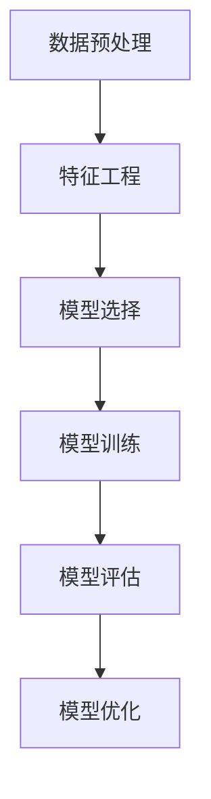
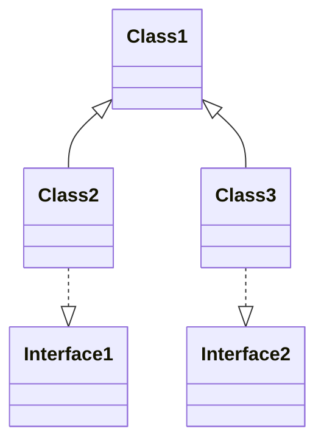
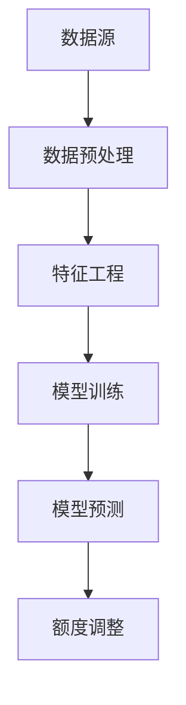
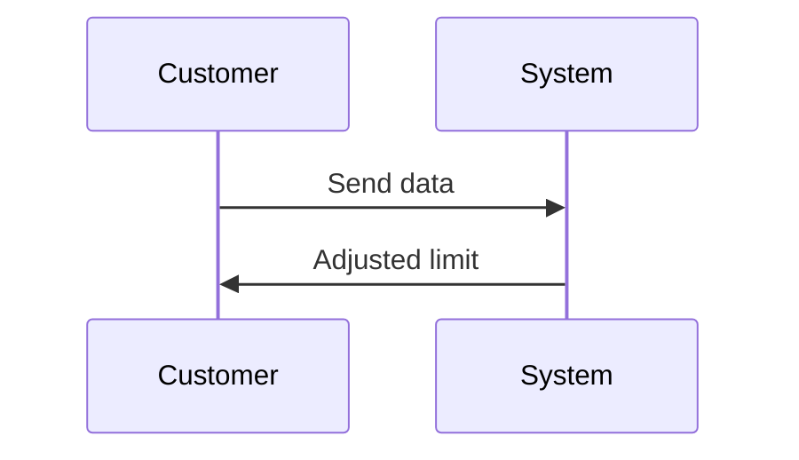

                 


### AI驱动的信用卡额度优化模型

> 关键词：AI、信用卡、额度优化、数据科学、机器学习、模型构建

> 摘要：本文将深入探讨使用人工智能技术优化信用卡额度的问题。通过逐步分析，我们将阐述信用卡额度优化的核心概念、算法原理、系统架构设计以及项目实战，旨在为金融专业人士和数据科学家提供实用的指导。

## 第1章：问题背景与解决方案

### 1.1 信用卡额度优化的重要性

信用卡作为现代社会中广泛使用的支付工具，其额度直接影响到消费者的消费能力和银行的信用风险。对于银行而言，信用卡额度优化是一个持续性的挑战，目的是在保障风险可控的前提下，最大化地满足客户的消费需求，提升客户体验和银行收益。

### 1.2 当前信用卡额度优化存在的问题

目前，信用卡额度优化主要依赖于传统的风险评估模型，这些模型往往存在以下问题：

- **数据依赖性高**：需要大量历史数据进行训练，且数据质量对模型效果影响极大。
- **模型更新滞后**：传统模型更新周期长，难以快速适应市场变化。
- **风险控制不足**：单纯依赖历史数据可能导致对新客户的信用评估不准确，增加信用风险。

### 1.3 AI技术在信用卡额度优化中的应用前景

随着人工智能技术的快速发展，AI在金融领域的应用越来越广泛。AI驱动的信用卡额度优化模型可以解决传统模型存在的问题，具有以下优势：

- **实时数据分析**：AI模型能够处理实时数据，快速适应市场变化。
- **个性化风险评估**：通过机器学习算法，可以更准确地评估每个客户的信用风险。
- **自动化决策**：AI模型能够自动化地进行额度调整，提高效率。

## 第2章：核心概念

### 2.1 人工智能概述

人工智能（AI）是指通过计算机程序实现的人类智能的模拟，包括机器学习、深度学习、自然语言处理等子领域。AI在金融领域的应用，主要集中在数据分析和决策支持。

### 2.2 信用卡业务概述

信用卡业务是指发卡机构向持卡人发放信用卡，持卡人使用信用卡进行消费、取现等活动。信用卡额度是银行根据持卡人信用状况设定的最大消费限额。

### 2.3 信用卡额度优化的核心概念

信用卡额度优化涉及以下几个核心概念：

- **信用评分**：对客户信用状况进行量化评估。
- **行为分析**：分析客户的消费行为，预测未来行为。
- **风险控制**：通过算法控制信用卡额度，降低风险。

## 第3章：AI驱动的信用卡额度优化模型

### 3.1 模型构建

信用卡额度优化模型的构建可以分为以下几个步骤：

#### 3.1.1 数据预处理

数据预处理是模型构建的第一步，包括数据清洗、缺失值处理、数据标准化等。

#### 3.1.2 特征工程

特征工程是提高模型性能的关键，包括选择合适的特征、特征转换和特征组合。

#### 3.1.3 模型选择与训练

选择合适的机器学习算法，并进行模型训练和参数调优。

### 3.2 模型评估与优化

模型评估包括准确率、召回率、F1值等指标，通过交叉验证和超参数调优进行模型优化。

## 第4章：算法原理

### 4.1 数据分析基础

数据分析基础包括数据收集与清洗、数据探索性分析、数据可视化等内容。

### 4.2 信用卡额度优化算法原理

#### 4.2.1 算法介绍

本文主要介绍基于机器学习的信用卡额度优化算法，包括逻辑回归、决策树、随机森林等算法。

#### 4.2.2 算法流程图（Mermaid）



#### 4.2.3 算法数学模型与公式

以逻辑回归为例，其数学模型如下：

$$
P(y=1) = \frac{1}{1 + e^{-(\beta_0 + \beta_1 x_1 + \beta_2 x_2 + ... + \beta_n x_n})}
$$

其中，$y$ 为是否提升额度，$x_i$ 为特征变量，$\beta_i$ 为特征权重。

#### 4.2.4 算法举例说明

假设我们有一个客户，其特征向量如下：

| 特征名称 | 特征值 |
| -------- | ------ |
| 年龄     | 30     |
| 收入     | 8000   |
| 消费频率 | 5次/周 |

使用逻辑回归模型预测其提升额度的概率。

## 第5章：系统架构设计

### 5.1 信用卡额度优化系统架构

#### 5.1.1 问题场景介绍

信用卡额度优化系统的核心功能是根据客户的信用评分和消费行为，动态调整信用卡额度。

#### 5.1.2 项目介绍

项目采用Python进行开发，利用Scikit-learn库进行机器学习模型的训练和预测。

#### 5.1.3 系统功能设计（Mermaid类图）



#### 5.1.4 系统架构设计（Mermaid架构图）



#### 5.1.5 系统接口设计

系统提供RESTful API接口，用于接收客户数据和返回额度调整结果。

#### 5.1.6 系统交互（Mermaid序列图）



## 第6章：项目实战

### 6.1 项目环境搭建

#### 6.1.1 硬件与软件环境配置

配置一台服务器，安装Linux操作系统，并配置Python环境。

#### 6.1.2 数据库与数据导入

使用MySQL数据库存储客户数据，并导入数据集。

#### 6.1.3 开发工具与框架选择

选择PyCharm作为开发工具，使用Scikit-learn作为机器学习框架。

### 6.2 系统核心实现

#### 6.2.1 数据预处理代码（Python）

```python
import pandas as pd

# 读取数据
data = pd.read_csv('card_data.csv')

# 数据清洗
data.dropna(inplace=True)
```

#### 6.2.2 特征工程代码（Python）

```python
from sklearn.preprocessing import StandardScaler

# 特征标准化
scaler = StandardScaler()
data_scaled = scaler.fit_transform(data)
```

#### 6.2.3 模型训练与评估代码（Python）

```python
from sklearn.linear_model import LogisticRegression
from sklearn.model_selection import train_test_split
from sklearn.metrics import accuracy_score

# 分割数据集
X_train, X_test, y_train, y_test = train_test_split(data_scaled, labels, test_size=0.2, random_state=42)

# 训练模型
model = LogisticRegression()
model.fit(X_train, y_train)

# 预测与评估
predictions = model.predict(X_test)
accuracy = accuracy_score(y_test, predictions)
print(f"Model accuracy: {accuracy:.2f}")
```

### 6.3 实际案例分析与讲解

#### 6.3.1 案例介绍

以某客户的数据为例，分析其提升额度的可能性。

#### 6.3.2 模型应用解读

使用训练好的模型对客户数据进行分析，输出提升额度的概率。

#### 6.3.3 案例剖析

对案例中的数据进行详细剖析，解释模型预测的依据。

#### 6.3.4 项目小结

总结项目实施过程中的关键点和经验教训。

## 第7章：最佳实践

### 7.1 数据处理技巧

- 数据清洗：处理缺失值、异常值等。
- 特征选择：使用特征重要性评估方法筛选有效特征。

### 7.2 模型调参技巧

- 超参数调优：使用网格搜索、贝叶斯优化等方法。
- 模型集成：使用集成学习提高模型性能。

### 7.3 系统优化技巧

- 数据库优化：使用索引、分片等技术提升查询效率。
- API优化：使用缓存、异步处理等技术提升响应速度。

## 第8章：小结与展望

### 8.1 书籍总结

本文系统地介绍了AI驱动的信用卡额度优化模型，包括核心概念、算法原理、系统架构设计和项目实战等内容。

### 8.2 AI在金融领域的未来发展趋势

随着AI技术的不断进步，其在金融领域的应用前景广阔，有望进一步提升金融服务的智能化水平。

### 8.3 拓展阅读

推荐进一步阅读的相关书籍和文章，以深入探讨AI在金融领域的应用。

## 作者信息

作者：AI天才研究院/AI Genius Institute & 禅与计算机程序设计艺术 /Zen And The Art of Computer Programming

---

通过上述章节的详细阐述，我们希望读者能够对AI驱动的信用卡额度优化模型有一个全面而深入的理解，并能够将其应用到实际工作中，为金融行业带来创新和提升。让我们一起迎接AI驱动的金融新时代。

