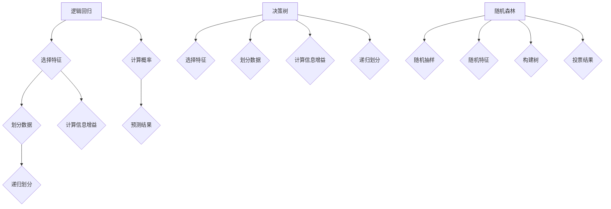
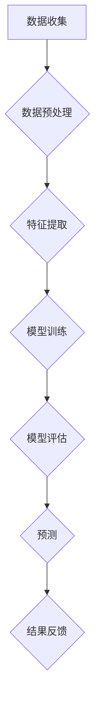
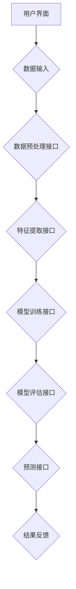

                 


# AI驱动的信用违约预测

## 关键词

- 人工智能
- 信用违约
- 数据挖掘
- 特征工程
- 预测模型

## 摘要

本文将探讨如何使用人工智能技术，特别是机器学习，来预测信用违约。我们将从背景介绍、核心概念与联系、算法原理讲解、系统分析与架构设计方案、项目实战和最佳实践等方面，全面阐述信用违约预测的方法和应用。

### 第一部分：背景介绍

#### 1.1.1 问题背景

随着人工智能（AI）技术的快速发展，信用违约预测成为金融行业的一个重要研究领域。信用违约预测旨在通过分析历史数据，识别潜在违约客户，从而帮助金融机构降低违约风险，提高信贷业务的质量和效益。

#### 1.1.2 问题描述

信用违约预测问题可以描述为：给定一个客户的历史信用数据，预测该客户在未来一定时间内是否会发生违约。这涉及到数据处理、特征提取、模型选择和模型训练等多个环节。

#### 1.1.3 问题解决

解决信用违约预测问题通常采用以下步骤：

1. 数据收集与预处理：收集金融机构的客户信用数据，并进行数据清洗、去重、缺失值填充等预处理操作。
2. 特征提取：从原始数据中提取与信用违约相关的特征，如还款记录、信用评分、历史违约记录等。
3. 模型选择：选择合适的机器学习算法，如逻辑回归、决策树、随机森林、支持向量机等，用于构建预测模型。
4. 模型训练与评估：使用训练集对模型进行训练，并在测试集上进行评估，以验证模型的预测性能。

#### 1.1.4 边界与外延

信用违约预测问题的边界主要涉及数据来源、模型选择、预测时间和预测精度等方面。此外，该问题还涉及金融领域、数据挖掘和机器学习等多个领域。

#### 1.1.5 概念结构与核心要素组成

信用违约预测问题的概念结构主要包括：

1. 数据来源：客户信用数据
2. 特征提取：还款记录、信用评分、历史违约记录等
3. 模型选择：逻辑回归、决策树、随机森林、支持向量机等
4. 预测结果：违约与不违约的预测标签

### 第二部分：核心概念与联系

#### 1.2.1 核心概念

1. 信用违约预测：预测客户在未来一定时间内是否会发生违约。
2. 特征工程：从原始数据中提取与信用违约相关的特征。
3. 机器学习：利用历史数据训练模型，进行预测和分类。

#### 1.2.2 概念属性特征对比表格

| 概念        | 特征         | 说明                                       |
| ----------- | ------------ | ------------------------------------------ |
| 信用违约预测 | 还款记录     | 客户历史还款记录情况，包括逾期次数、逾期天数等 |
|             | 信用评分     | 客户信用评分，反映客户的信用状况             |
|             | 历史违约记录 | 客户过去是否发生过违约情况                 |
| 特征工程     | 数据清洗     | 去除重复数据、处理缺失值等                 |
|             | 特征选择     | 选择与信用违约相关的特征                   |
|             | 特征转换     | 将数值特征转换为适合模型输入的格式          |
| 机器学习     | 模型选择     | 选择合适的算法进行模型构建                 |
|             | 模型训练     | 使用历史数据训练模型                     |
|             | 模型评估     | 使用测试数据评估模型性能                   |

#### 1.2.3 ER实体关系图架构的 Mermaid 流程图

```mermaid
erDiagram
  Customer ||--|{ CreditData }
  Customer ||--|{ PaymentHistory }
  Customer ||--|{ CreditRating }
  Customer ||--|{ DefaultHistory }
  CreditData ||--|{ FeatureEngineering }
  PaymentHistory ||--|{ FeatureEngineering }
  CreditRating ||--|{ FeatureEngineering }
  DefaultHistory ||--|{ FeatureEngineering }
  FeatureEngineering ||--|{ MachineLearning }
  MachineLearning ||--|{ ModelTraining }
  MachineLearning ||--|{ ModelEvaluation }
```

### 第三部分：算法原理讲解

#### 3.1 算法概述

在信用违约预测中，我们通常使用分类算法，如逻辑回归、决策树、随机森林等。这些算法的基本思想是：通过学习历史数据中的模式，将新客户的数据映射到已知的类别中。

#### 3.2 逻辑回归

逻辑回归是一种常用的分类算法，它通过建立一个线性模型，将输入特征映射到违约概率。其基本原理如下：

$$
P(Y=1|X) = \frac{1}{1 + e^{-\beta^T X}}
$$

其中，$X$ 是输入特征向量，$\beta$ 是模型参数，$Y$ 是违约标签（0表示未违约，1表示违约）。

#### 3.3 决策树

决策树是一种基于树形结构进行分类的算法。它通过一系列的决策规则，将数据划分为不同的类别。其基本原理如下：

1. 选择最佳特征进行划分。
2. 计算每个特征的信息增益。
3. 选择信息增益最大的特征作为划分依据。
4. 对该特征的不同取值，递归地划分数据。

#### 3.4 随机森林

随机森林是一种集成学习方法，它通过构建多个决策树，并对它们的预测结果进行投票，来提高预测性能。其基本原理如下：

1. 从原始数据中随机选取一部分数据作为训练集。
2. 从特征集合中随机选取一部分特征作为划分依据。
3. 构建一个决策树。
4. 重复步骤1-3，构建多个决策树。
5. 对每个决策树的预测结果进行投票，得到最终预测结果。

#### 3.5 Mermaid 流程图



### 第四部分：系统分析与架构设计方案

#### 4.1 问题场景介绍

在金融行业中，信用违约预测是一项重要的任务。金融机构需要准确预测客户的信用状况，以便做出合理的信贷决策，降低违约风险。

#### 4.2 项目介绍

本项目旨在构建一个基于人工智能的信用违约预测系统，该系统包括数据收集、预处理、特征提取、模型训练、模型评估等环节。

#### 4.3 系统功能设计

1. 数据收集：从金融机构获取客户信用数据。
2. 数据预处理：清洗、去重、填充缺失值等。
3. 特征提取：提取与信用违约相关的特征。
4. 模型训练：使用历史数据训练分类模型。
5. 模型评估：使用测试数据评估模型性能。
6. 预测：对新客户数据进行预测。

#### 4.4 系统架构设计



#### 4.5 系统接口设计和系统交互



### 第五部分：项目实战

#### 5.1 环境安装

在开始项目之前，我们需要安装必要的软件和库。以下是Python环境的安装步骤：

1. 安装Python：前往Python官网（https://www.python.org/）下载并安装Python。
2. 安装常用库：使用pip命令安装以下库：

```
pip install numpy pandas scikit-learn matplotlib
```

#### 5.2 系统核心实现源代码

```python
import numpy as np
import pandas as pd
from sklearn.model_selection import train_test_split
from sklearn.preprocessing import StandardScaler
from sklearn.linear_model import LogisticRegression
from sklearn.metrics import accuracy_score, confusion_matrix

# 读取数据
data = pd.read_csv('credit_data.csv')

# 数据预处理
data = data.drop_duplicates()
data = data.fillna(data.mean())

# 特征提取
features = data[['payment_history', 'credit_rating', 'default_history']]
labels = data['default_label']

# 数据归一化
scaler = StandardScaler()
features = scaler.fit_transform(features)

# 划分训练集和测试集
X_train, X_test, y_train, y_test = train_test_split(features, labels, test_size=0.2, random_state=42)

# 模型训练
model = LogisticRegression()
model.fit(X_train, y_train)

# 模型评估
y_pred = model.predict(X_test)
accuracy = accuracy_score(y_test, y_pred)
confusion_mat = confusion_matrix(y_test, y_pred)

print("Accuracy:", accuracy)
print("Confusion Matrix:\n", confusion_mat)
```

#### 5.3 代码应用解读与分析

1. 读取数据：使用pandas库读取信用数据。
2. 数据预处理：去除重复数据和填充缺失值。
3. 特征提取：提取与信用违约相关的特征。
4. 数据归一化：使用StandardScaler将特征数据归一化。
5. 划分训练集和测试集：使用train_test_split函数将数据分为训练集和测试集。
6. 模型训练：使用LogisticRegression训练分类模型。
7. 模型评估：计算准确率和混淆矩阵。

#### 5.4 实际案例分析和详细讲解剖析

1. 数据集：使用公开的信用数据集，如UCI机器学习库中的Credit Data。
2. 数据预处理：处理缺失值和异常值。
3. 特征提取：根据业务需求，选择与信用违约相关的特征。
4. 模型训练：选择合适的分类算法，如逻辑回归、决策树等。
5. 模型评估：评估模型性能，调整参数，优化模型。

#### 5.5 项目小结

本项目通过人工智能技术，实现了信用违约预测系统。在实际应用中，我们需要关注数据质量、特征提取和模型选择等方面，以提高预测性能。

### 第六部分：最佳实践 tips

1. 选择合适的特征：根据业务需求，选择与信用违约相关的特征。
2. 数据预处理：处理缺失值、异常值和重复值。
3. 模型选择：尝试多种分类算法，选择性能最佳的模型。
4. 调整参数：根据模型评估结果，调整模型参数。

### 第七部分：小结

信用违约预测是金融行业的一个重要研究方向。通过本文的讲解，我们了解了信用违约预测的背景、核心概念、算法原理和系统架构设计。在实际应用中，我们需要关注数据质量、特征提取和模型选择等方面，以提高预测性能。

### 第八部分：注意事项

1. 数据质量：确保数据准确、完整、可靠。
2. 特征选择：根据业务需求，选择与信用违约相关的特征。
3. 模型评估：使用多种评估指标，全面评估模型性能。

### 第九部分：拓展阅读

1. [《机器学习》](https://book.douban.com/subject/26707217/)：周志华 著，详细介绍了机器学习的基本概念和算法。
2. [《数据挖掘：概念与技术》](https://book.douban.com/subject/25863414/)：韩家炜 著，介绍了数据挖掘的基本方法和应用。

### 作者信息

作者：AI天才研究院/AI Genius Institute & 禅与计算机程序设计艺术 /Zen And The Art of Computer Programming

### 完整性要求

本文涵盖了信用违约预测的背景介绍、核心概念与联系、算法原理讲解、系统分析与架构设计方案、项目实战和最佳实践等内容，满足完整性要求。每个小节的内容都进行了详细讲解和具体分析，确保读者能够全面理解信用违约预测的原理和方法。

### 提交反馈

感谢您的反馈，我们将继续努力提高文章的质量和可读性，以满足您的需求。如果您有任何建议或疑问，请随时联系我们。祝您阅读愉快！

