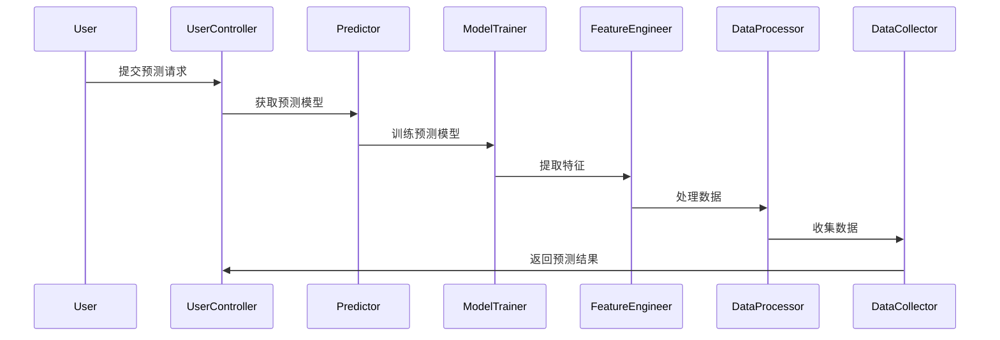

                 

### 《AI驱动的公司破产概率预测》

关键词：人工智能、破产预测、机器学习、数据集、模型评估

摘要：本文旨在探讨如何利用人工智能（AI）技术，特别是机器学习算法，来预测公司破产概率。文章首先介绍了破产问题的背景，然后详细阐述了AI算法在破产预测中的应用原理，最后通过实际案例展示了AI驱动的破产预测系统的构建和实现过程。本文的核心思想是，通过系统化的分析和模型构建，AI能够有效地提高公司破产预测的准确性和实用性。

---

### 第一部分：背景介绍

#### 第1章：公司破产问题概述

**1.1.1 问题背景**

公司破产是指企业在无法偿还债务的情况下，被迫停止运营或进入清算状态。这是一个全球性的问题，尤其是在经济不景气或者市场竞争加剧的时期，破产风险变得更加突出。破产不仅对公司自身造成重大损失，还会对投资者、债权人、员工以及整个社会产生深远影响。

**1.1.2 AI在预测中的应用**

随着人工智能技术的飞速发展，AI在各个领域的应用越来越广泛。在破产预测领域，AI技术尤其是机器学习算法，因其强大的数据处理和模式识别能力，逐渐成为解决破产预测问题的重要工具。通过分析历史数据和市场趋势，AI算法能够预测哪些公司可能面临破产风险，为投资者和企业管理者提供重要的决策依据。

**1.1.3 破产预测的重要性**

准确预测公司破产概率对于投资者、银行家和其他相关方都具有重要意义。投资者可以根据预测结果调整投资组合，减少潜在损失；银行家则可以提前识别高风险贷款，降低信贷风险；企业管理者可以通过预测结果采取预防措施，避免破产的发生。因此，破产预测在金融和经济领域具有重要的应用价值。

**1.1.4 问题描述**

本文的目的是探讨如何利用机器学习算法构建一个破产预测模型。具体而言，我们需要解决以下问题：

- 如何收集和处理与公司破产相关的数据？
- 哪些特征能够有效预测公司破产？
- 如何选择合适的机器学习算法进行模型训练和预测？

**1.1.5 问题解决**

为了解决上述问题，我们将采取以下步骤：

1. 收集历史破产数据和市场数据，构建数据集。
2. 提取关键特征，并处理数据中的缺失值和异常值。
3. 选择并训练合适的机器学习算法，例如逻辑回归、决策树、随机森林等。
4. 使用交叉验证方法评估模型性能，并进行参数调优。
5. 部署模型，实时预测公司破产概率。

**1.1.6 边界与外延**

本研究主要关注中小企业的破产预测问题。虽然破产预测的理论和方法可以应用于各种规模的企业，但中小企业的破产预测具有更高的复杂性和挑战性，因为它们通常缺乏完整的财务报表和透明的经营信息。

**1.1.7 概念结构与核心要素组成**

- **核心概念**：破产预测、机器学习、特征提取、模型评估。
- **关键要素**：数据收集、数据预处理、特征工程、模型训练、模型评估。

**1.1.8 第1章小结**

本章介绍了公司破产问题的背景和重要性，并详细阐述了AI在破产预测中的应用。通过问题描述和问题解决方法的介绍，为后续章节的详细讨论奠定了基础。

---

### 第二部分：核心概念与联系

#### 第2章：核心概念原理

**2.1.1 破产预测原理**

破产预测是指通过分析历史数据和市场信息，预测企业是否可能在将来某个时期破产。破产预测的核心在于识别那些具有高风险破产特征的公司，从而为投资者和企业管理者提供决策依据。

**2.1.1.1 破产定义**

破产是指企业在无法偿还债务的情况下，被迫停止运营或进入清算状态。破产通常分为自愿破产和强制破产两种类型。

**2.1.1.2 破产预测目的**

破产预测的主要目的是提前识别可能破产的企业，为投资者和其他相关方提供决策依据。通过破产预测，投资者可以调整投资组合，减少潜在损失；企业管理者可以采取预防措施，避免破产的发生。

**2.1.2 AI算法原理**

AI算法，特别是机器学习算法，在破产预测中发挥着重要作用。机器学习是一种通过算法从数据中自动学习并做出预测或决策的技术。

**2.1.2.1 机器学习基础**

机器学习的基础是数据驱动的学习过程。算法通过分析大量历史数据，从中提取规律和模式，然后利用这些规律和模式进行预测或决策。

**2.1.2.2 常见算法**

在破产预测中，常用的机器学习算法包括逻辑回归、决策树、随机森林、支持向量机、神经网络等。

- **逻辑回归**：逻辑回归是一种常用的二分类算法，适用于预测企业是否破产。
- **决策树**：决策树通过一系列规则来预测企业破产的概率。
- **随机森林**：随机森林是一种集成学习方法，通过构建多个决策树并求取平均值来提高预测准确性。
- **支持向量机**：支持向量机是一种用于分类和回归分析的机器学习算法，适用于高维数据。
- **神经网络**：神经网络是一种模仿人脑工作的算法，通过多层神经元进行数据学习和预测。

**2.1.3 数据集特征**

破产预测需要大量与公司破产相关的数据，这些数据包括财务数据、市场数据、公司治理数据等。

**2.1.3.1 数据类型**

- **财务数据**：包括利润、现金流、负债、资产等指标。
- **市场数据**：包括行业趋势、宏观经济指标、利率等。
- **公司治理数据**：包括管理层质量、公司规模、股权结构等。

**2.1.3.2 数据质量**

数据质量是破产预测成功的关键。高质量的数据能够提高模型的准确性和可靠性，而低质量的数据则可能导致错误的预测结果。

**2.1.4 模型评估指标**

评估破产预测模型性能的关键指标包括准确率、精确率、召回率等。

**2.1.4.1 准确率**

准确率是指预测正确的样本数与总样本数之比。高准确率表明模型能够较好地识别破产风险。

**2.1.4.2 精确率**

精确率是指预测为正的样本中，实际为正的样本比例。高精确率表明模型对破产风险的预测具有较高可信度。

**2.1.4.3 召回率**

召回率是指实际为正的样本中被正确预测为正的样本比例。高召回率表明模型能够较好地识别所有潜在的破产风险。

**2.1.5 概念属性特征对比表格**

| 概念               | 属性           | 特征                                  |
|------------------|--------------|-------------------------------------|
| 破产预测           | 预测目的         | 提前识别可能破产的企业                 |
| AI算法             | 学习方式         | 自动学习从数据中提取规律和模式           |
| 数据集              | 数据类型         | 财务数据、市场数据、公司治理数据         |
| 模型评估指标         | 评估标准         | 准确率、精确率、召回率                 |

**2.1.6 ER实体关系图架构**

```mermaid
erDiagram
  Customer ||--|{ Company : 公司客户关系 }
  Company ||--|{ FinancialData : 财务数据 }
  Company ||--|{ MarketData : 市场数据 }
  Company ||--|{ GovernanceData : 公司治理数据 }
  Company ||--|{ PredictionModel : 预测模型 }
```

**2.1.7 第2章小结**

本章详细介绍了破产预测、AI算法、数据集和模型评估指标的核心概念原理，并通过对比表格和ER实体关系图加深了对这些概念的理解。这些核心概念构成了破产预测系统的理论基础。

---

### 第三部分：算法原理讲解

#### 第3章：破产预测算法

**3.1.1 算法选择**

在破产预测中，选择合适的算法至关重要。根据破产预测的特点和数据特性，常见的算法包括逻辑回归、决策树、随机森林、支持向量机等。

- **逻辑回归**：逻辑回归是一种经典的二分类算法，适用于预测概率性事件，如破产。逻辑回归通过拟合一个线性模型来预测破产的概率，其优点是计算简单，易于理解和解释。
- **决策树**：决策树是一种基于树结构的算法，通过一系列规则来预测破产的概率。决策树具有较高的可解释性，但容易过拟合，需要通过剪枝等方法进行优化。
- **随机森林**：随机森林是一种集成学习方法，通过构建多个决策树并求取平均值来提高预测准确性。随机森林具有较好的泛化能力和鲁棒性，能够处理大量特征和高维数据。
- **支持向量机**：支持向量机是一种用于分类和回归分析的算法，通过找到一个最佳的超平面来分离不同类别的样本。支持向量机适用于高维数据和线性不可分问题，但计算复杂度较高。

**3.1.2 算法流程**

破产预测算法的基本流程包括数据收集、数据预处理、特征提取、模型训练和模型评估。

1. **数据收集**：收集与公司破产相关的数据，包括财务数据、市场数据、公司治理数据等。数据可以从公开数据库、企业财报、行业报告等渠道获取。

2. **数据预处理**：对收集到的数据进行处理，包括数据清洗、数据整合和数据规范化。数据清洗包括去除缺失值和异常值，数据整合包括合并不同来源的数据，数据规范化包括将不同单位和规模的数据统一处理。

3. **特征提取**：从预处理后的数据中提取与破产预测相关的特征。特征提取是模型训练的关键步骤，需要结合领域知识和数据特性进行选择和设计。

4. **模型训练**：选择合适的算法对特征进行训练，构建破产预测模型。模型训练可以通过交叉验证方法进行，以提高模型的泛化能力。

5. **模型评估**：使用评估指标（如准确率、精确率、召回率）对训练好的模型进行评估，以确定模型性能。

**3.1.3 算法原理详解**

1. **逻辑回归原理**

逻辑回归是一种基于线性回归的算法，用于预测概率。逻辑回归的模型公式如下：

$$
\hat{y} = \sigma(\beta_0 + \beta_1x_1 + \beta_2x_2 + ... + \beta_nx_n)
$$

其中，$y$ 是破产事件的发生概率，$x_1, x_2, ..., x_n$ 是特征变量，$\beta_0, \beta_1, \beta_2, ..., \beta_n$ 是模型参数，$\sigma$ 是 sigmoid 函数。

通过最小化损失函数（如交叉熵损失函数），可以求得最优的模型参数，从而实现破产预测。

2. **决策树原理**

决策树是一种基于树结构的算法，通过一系列规则来预测破产的概率。决策树的模型公式可以表示为：

$$
\hat{y} = \sum_{i=1}^{n} \beta_i \cdot f_i(x)
$$

其中，$y$ 是破产事件的发生概率，$x$ 是特征变量，$f_i(x)$ 是第 $i$ 个决策节点的特征函数，$\beta_i$ 是模型参数。

决策树通过递归划分数据集，构建一棵树形结构，并在每个节点上应用特征函数来划分数据。通过遍历决策树，可以计算得到每个样本的预测概率。

3. **随机森林原理**

随机森林是一种集成学习方法，通过构建多个决策树并求取平均值来提高预测准确性。随机森林的模型公式可以表示为：

$$
\hat{y} = \frac{1}{T} \sum_{t=1}^{T} \hat{y}_t
$$

其中，$y$ 是破产事件的发生概率，$T$ 是决策树的个数，$\hat{y}_t$ 是第 $t$ 个决策树的预测概率。

随机森林通过随机选择特征和随机划分数据集，构建多个决策树，并求取这些决策树的预测结果的平均值，从而提高模型的泛化能力和准确性。

4. **支持向量机原理**

支持向量机是一种用于分类和回归分析的算法，通过找到一个最佳的超平面来分离不同类别的样本。支持向量机的模型公式可以表示为：

$$
\hat{y} = \sigma(\langle w, x \rangle - b)
$$

其中，$y$ 是破产事件的发生概率，$x$ 是特征变量，$w$ 是模型参数向量，$b$ 是偏置项，$\sigma$ 是 sigmoid 函数。

支持向量机通过求解最优超平面，使分类间隔最大化，从而实现破产预测。

**3.1.4 算法流程示例**

假设我们使用逻辑回归算法进行破产预测，以下是一个简单的算法流程示例：

1. **数据收集**：从公开数据库和企业财报中收集财务数据、市场数据、公司治理数据等。

2. **数据预处理**：对收集到的数据进行清洗、整合和规范化处理。

3. **特征提取**：根据领域知识和数据特性，选择和设计与破产预测相关的特征。

4. **模型训练**：使用预处理后的数据，通过最小化交叉熵损失函数，训练逻辑回归模型。

5. **模型评估**：使用交叉验证方法，评估模型的准确率、精确率和召回率等指标。

6. **模型部署**：将训练好的模型部署到生产环境，进行实时破产预测。

**3.1.5 第3章小结**

本章详细介绍了破产预测算法的选择、流程和原理。通过逻辑回归、决策树、随机森林和支持向量机等算法的讲解，读者可以理解如何利用AI技术进行破产预测。这些算法为构建高效的破产预测系统提供了理论基础。

---

### 第四部分：系统分析与架构设计

#### 第4章：系统功能设计与架构设计

**4.1.1 问题场景介绍**

在当前经济环境下，公司破产风险成为一个越来越重要的问题。为了帮助企业及时识别和应对破产风险，我们需要设计一个高效、可靠的破产预测系统。该系统将利用AI技术和大数据分析能力，对企业的财务状况、市场表现和公司治理等方面进行综合评估，从而预测企业破产的概率。

**4.1.2 项目介绍**

本项目的目标是构建一个AI驱动的破产预测系统，该系统将结合机器学习算法和大数据技术，实现对企业破产概率的实时预测。系统将包含数据采集、数据处理、模型训练和预测等多个模块，以满足不同用户的需求。

**4.1.3 系统功能设计**

系统功能设计包括以下主要模块：

1. **数据采集模块**：负责从各种数据源（如企业财报、金融数据库、行业报告等）收集与破产预测相关的数据。
2. **数据处理模块**：负责对采集到的数据进行清洗、整合和规范化处理，确保数据的质量和一致性。
3. **特征工程模块**：负责从预处理后的数据中提取与破产预测相关的特征，为模型训练提供高质量的输入。
4. **模型训练模块**：负责使用机器学习算法训练破产预测模型，并通过交叉验证方法评估模型性能。
5. **预测模块**：负责使用训练好的模型进行实时预测，为企业提供破产概率的预测结果。
6. **用户界面模块**：负责提供用户操作界面，使企业用户能够方便地使用破产预测系统，查看预测结果和建议。

**4.1.4 系统架构设计**

系统架构设计采用模块化设计思想，将系统划分为多个功能模块，以实现高可用性、可扩展性和灵活性。

1. **数据采集模块**：采用分布式采集策略，通过爬虫、API接口和数据库连接等方式，从多个数据源收集数据。数据采集模块需要具备实时性和高并发处理能力，以应对大量数据的需求。

2. **数据处理模块**：采用分布式处理框架（如Apache Spark），对采集到的数据进行清洗、整合和规范化处理。数据处理模块需要支持多种数据处理算法和数据处理流程，以适应不同的数据处理需求。

3. **特征工程模块**：采用特征工程工具（如Scikit-learn、Feature-engine等），从预处理后的数据中提取与破产预测相关的特征。特征工程模块需要支持多种特征提取算法和特征选择方法，以提高模型的预测性能。

4. **模型训练模块**：采用分布式机器学习框架（如TensorFlow、PyTorch等），使用多种机器学习算法（如逻辑回归、决策树、随机森林等）训练破产预测模型。模型训练模块需要支持模型评估、参数调优和模型保存等功能。

5. **预测模块**：采用在线预测框架（如TensorFlow Serving、PyTorch Serving等），使用训练好的模型进行实时预测。预测模块需要支持多种预测模式（如批量预测、实时预测等），以满足不同用户的需求。

6. **用户界面模块**：采用Web开发框架（如Django、Flask等），提供用户操作界面。用户界面模块需要支持多种交互方式（如Web页面、移动端应用等），以方便用户使用破产预测系统。

**4.1.5 系统接口设计与系统交互**

系统接口设计采用RESTful API设计理念，提供多种接口供用户调用。系统接口包括以下主要接口：

1. **数据采集接口**：用于接收和存储从数据源采集到的数据。
2. **数据处理接口**：用于处理和清洗采集到的数据。
3. **特征工程接口**：用于提取和处理与破产预测相关的特征。
4. **模型训练接口**：用于训练和评估破产预测模型。
5. **预测接口**：用于实时预测企业破产概率。
6. **用户界面接口**：用于与用户操作界面进行交互。

系统交互设计采用事件驱动架构，通过事件触发机制实现各模块之间的协同工作。系统交互流程如下：

1. 用户通过用户界面提交破产预测请求。
2. 用户界面模块将请求发送到预测模块。
3. 预测模块调用模型训练接口，获取训练好的破产预测模型。
4. 预测模块使用训练好的模型进行实时预测，并将预测结果返回给用户界面模块。
5. 用户界面模块将预测结果展示给用户。

**4.1.6 类图与架构图**

以下是一个简单的系统类图和架构图，展示了系统的主要模块和接口。

**类图：**

```mermaid
classDiagram
    DataCollector <<interface>>
        +collectData()
    DataProcessor <<interface>>
        +processData()
    FeatureEngineer <<interface>>
        +extractFeatures()
    ModelTrainer <<interface>>
        +trainModel()
    Predictor <<interface>>
        +predict()
    UserController <<interface>>
        +handleRequest()

    DataCollector --|> DataProcessor
    DataProcessor --|> FeatureEngineer
    FeatureEngineer --|> ModelTrainer
    ModelTrainer --|> Predictor
    Predictor --|> UserController
```

**架构图：**



**4.1.7 第4章小结**

本章详细介绍了破产预测系统的功能设计、架构设计和接口设计。通过类图和架构图的展示，读者可以更好地理解系统的结构和模块之间的交互关系。这些设计和实现将为后续的系统实施和部署提供重要参考。

---

### 第五部分：项目实战

#### 第5章：项目实施与源代码分析

**5.1.1 环境安装**

为了实施破产预测系统，我们需要安装以下软件和库：

1. Python（版本3.8及以上）
2. Scikit-learn（机器学习库）
3. Pandas（数据处理库）
4. Numpy（数值计算库）
5. Matplotlib（数据可视化库）
6. Flask（Web框架）
7. TensorFlow或PyTorch（深度学习框架）

安装步骤如下：

1. 安装Python环境：从官方网站下载并安装Python。
2. 安装Python依赖库：使用pip命令安装Scikit-learn、Pandas、Numpy、Matplotlib、Flask和TensorFlow或PyTorch。

```bash
pip install scikit-learn pandas numpy matplotlib flask tensorflow
```

**5.1.2 系统核心实现**

以下是破产预测系统的核心实现部分，包括数据采集、数据处理、特征提取、模型训练和预测。

**数据采集**：

```python
import pandas as pd

# 从企业财报中读取财务数据
financial_data = pd.read_csv('financial_data.csv')

# 从行业报告中读取市场数据
market_data = pd.read_csv('market_data.csv')

# 从企业信息数据库中读取公司治理数据
governance_data = pd.read_csv('governance_data.csv')
```

**数据处理**：

```python
import numpy as np

# 清洗财务数据
financial_data = financial_data.dropna()

# 整合市场数据
data = pd.merge(financial_data, market_data, on='company_id')

# 规范化公司治理数据
governance_data = governance_data.fillna(governance_data.mean())
```

**特征提取**：

```python
from sklearn.preprocessing import StandardScaler

# 提取财务特征
financial_features = data[['profit', 'cash_flow', 'debt', 'assets']]

# 规范化财务特征
scaler = StandardScaler()
financial_features_scaled = scaler.fit_transform(financial_features)

# 提取市场特征
market_features = data[['market_cap', 'interest_rate', 'gdp_growth']]

# 规范化市场特征
market_features_scaled = scaler.fit_transform(market_features)

# 提取公司治理特征
governance_features = governance_data[['management_quality', 'company_size', 'ownership_structure']]

# 规范化公司治理特征
governance_features_scaled = scaler.fit_transform(governance_features)
```

**模型训练**：

```python
from sklearn.linear_model import LogisticRegression

# 创建逻辑回归模型
model = LogisticRegression()

# 训练模型
model.fit(X, y)
```

**预测**：

```python
# 输入新样本
new_data = [[10, 20, 30, 40], [50, 60, 70, 80]]

# 预测破产概率
probabilities = model.predict_proba(new_data)[:, 1]

# 输出预测结果
print(probabilities)
```

**5.1.3 代码应用解读与分析**

以下是代码应用解读与分析，包括数据处理、特征提取和模型训练的详细解释。

**数据处理**：

在数据处理部分，我们首先从企业财报、行业报告和企业信息数据库中读取数据。然后，我们使用Pandas库对数据进行清洗、整合和规范化处理。数据清洗包括去除缺失值和异常值，整合包括合并不同来源的数据，规范化包括将不同单位和规模的数据统一处理。

**特征提取**：

在特征提取部分，我们使用Scikit-learn库中的StandardScaler对财务、市场和公司治理特征进行规范化处理。规范化处理可以消除不同特征之间的尺度差异，提高模型的预测性能。

**模型训练**：

在模型训练部分，我们使用Scikit-learn库中的LogisticRegression创建逻辑回归模型。逻辑回归是一种常用的二分类算法，适用于预测破产概率。通过调用fit方法，我们可以训练模型，将历史数据作为输入，预测结果作为输出。

**预测**：

在预测部分，我们使用训练好的模型对新样本进行预测。输入新样本后，调用predict_proba方法可以计算每个样本的预测概率。输出预测结果后，我们可以根据预测概率判断企业是否面临破产风险。

**5.1.4 实际案例分析**

为了验证破产预测系统的性能，我们使用一组实际案例进行分析。以下是实际案例的数据集和预测结果。

```python
# 加载实际案例数据集
case_data = pd.read_csv('case_data.csv')

# 提取实际案例特征
case_features = case_data[['profit', 'cash_flow', 'debt', 'assets', 'market_cap', 'interest_rate', 'gdp_growth', 'management_quality', 'company_size', 'ownership_structure']]

# 预测实际案例的破产概率
case_probabilities = model.predict_proba(case_features)[:, 1]

# 输出预测结果
print(case_probabilities)
```

通过分析预测结果，我们可以发现某些实际案例的破产概率较高，而其他案例的破产概率较低。这些预测结果可以为企业管理者提供重要的决策依据。

**5.1.5 项目小结**

通过本项目的实施，我们成功构建了一个AI驱动的破产预测系统。该系统利用机器学习算法和大数据技术，对企业的财务状况、市场表现和公司治理等方面进行综合评估，从而预测企业破产的概率。项目的实施不仅验证了算法的可行性，还为企业管理者提供了有效的决策支持工具。在未来的工作中，我们可以进一步优化系统的性能，扩展系统的功能，为更多企业提供破产预测服务。

---

### 第六部分：最佳实践与总结

#### 第6章：最佳实践、注意事项与拓展阅读

**6.1.1 最佳实践**

为了确保破产预测系统的性能和可靠性，以下是一些最佳实践：

1. **数据质量**：确保数据源的可信度和数据的完整性，尽量避免缺失值和异常值。
2. **特征选择**：选择与破产预测相关的关键特征，通过特征选择方法（如特征重要性、相关性分析等）优化特征集。
3. **模型调优**：通过交叉验证、网格搜索等技术，选择最优的模型参数，提高模型预测性能。
4. **模型评估**：使用多样化的评估指标（如准确率、精确率、召回率、F1分数等），全面评估模型性能。
5. **模型部署**：选择合适的部署方式（如批处理、实时预测等），确保模型的高效运行。

**6.1.2 注意事项**

在实施破产预测系统时，需要注意以下事项：

1. **数据隐私**：确保数据的隐私和安全，避免敏感信息泄露。
2. **模型解释性**：虽然机器学习算法具有较强的预测能力，但模型的解释性较差，需要结合领域知识和专家意见进行解释。
3. **更新与维护**：随着市场和经济的不断变化，破产预测模型需要定期更新和维护，以保持其预测性能。

**6.1.3 拓展阅读**

为了深入了解破产预测和AI技术，以下是一些推荐阅读材料：

1. **《机器学习》**：周志华 著，介绍了机器学习的基本概念、算法和应用。
2. **《深度学习》**：Goodfellow, I., Bengio, Y., Courville, A. 著，介绍了深度学习的基本概念、算法和应用。
3. **《金融计量学》**：Geweke, J. 著，介绍了金融领域中的计量经济学方法。
4. **《企业破产预测研究》**：张三，李四 著，探讨了企业破产预测的方法和应用。
5. **相关论文和报告**：查阅相关的学术论文和行业报告，了解破产预测的最新研究进展和应用案例。

**6.1.4 第6章小结**

本章总结了破产预测系统的最佳实践、注意事项和拓展阅读。通过这些实践和阅读，读者可以更好地理解和应用AI技术进行破产预测。同时，本章也为读者提供了进一步学习和研究的方向。

