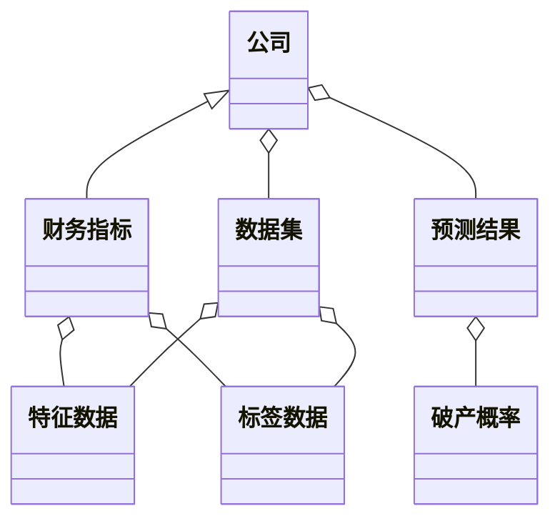

                 

## AI驱动的公司破产预测模型

破产预测是金融领域的一个重要研究方向，对于企业、投资者以及监管机构来说都具有重要意义。通过预测公司的破产风险，可以提前采取相应的措施，降低损失，甚至挽救企业。在这个背景下，人工智能技术，特别是机器学习和深度学习，被广泛应用于破产预测模型中。

### 关键词：
- 公司破产预测
- 人工智能
- 机器学习
- 深度学习
- 财务分析

### 摘要：
本文将探讨如何利用人工智能技术，特别是机器学习和深度学习，构建一个公司破产预测模型。我们将从问题背景、核心概念、数学模型、算法原理、系统架构设计、项目实战等多个角度进行分析，旨在提供一套完整的解决方案，帮助企业和投资者提前识别破产风险。

## 第一部分：背景介绍

### 第1章：问题背景与核心概念

#### 1.1 问题背景

公司的破产风险是一个复杂的问题，涉及到多个方面。对于企业来说，破产意味着运营的终止，员工失业，投资者损失，甚至对整个供应链造成影响。对于投资者来说，破产意味着投资回报的消失，资本损失。对于监管机构来说，破产风险的预测有助于防范系统性风险，维护金融稳定。因此，破产预测具有重要的现实意义。

#### 1.2 概念属性特征对比表格

在破产预测中，常用的特征包括流动性比率、偿债能力、盈利能力等。以下是一个简化的对比表格：

| 特征 | 描述 | 类别 | 影响 |
| ---- | ---- | ---- | ---- |
| 流动性比率 | 短期资产与短期负债的比例 | 财务指标 | 关键 |
| 偿债能力 | 长期负债偿还能力 | 财务指标 | 重要 |
| 盈利能力 | 营业收入与成本比例 | 财务指标 | 辅助 |

#### 1.3 ER实体关系图

为了更好地理解破产预测模型中的实体关系，我们可以使用ER（实体-关系）图来表示。以下是破产预测模型的ER图：

```mermaid
entity关系图 {
  node�朵云 shape1
  node公司 shape2
  node财务指标 shape3
  node预测结果 shape4

  company -> 财务指标
  company -> 预测结果
}
```

在这个ER图中，"公司"是核心实体，它关联到"财务指标"和"预测结果"。财务指标是公司财务状况的反映，而预测结果是破产预测模型的结果。

### 第2章：破产预测模型的数学模型与算法原理

#### 2.1 算法原理讲解

破产预测模型的核心是算法的选择。常见的算法包括回归模型、神经网络和集成模型。以下是这些算法的基本原理：

##### 2.1.1 回归模型

回归模型是一种传统的机器学习算法，用于预测连续值。在破产预测中，常用的回归模型是线性回归和逻辑回归。

- **线性回归**：

  线性回归的基本公式为：

  $$ y = \beta_0 + \beta_1x $$

  其中，$y$ 是预测的破产概率，$\beta_0$ 和 $\beta_1$ 是模型的参数，$x$ 是输入特征。

  例如，如果财务指标 $x$ 为10，我们可以预测破产概率为：

  $$ y = \beta_0 + \beta_1 \times 10 $$

- **逻辑回归**：

  逻辑回归是一种用于分类问题的回归模型，其基本公式为：

  $$ P(y=1) = \frac{1}{1 + e^{-(\beta_0 + \beta_1x)}} $$

  其中，$P(y=1)$ 是破产的概率，$e$ 是自然对数的底数，$\beta_0$ 和 $\beta_1$ 是模型的参数。

  例如，如果财务指标 $x$ 为10，我们可以预测破产概率为：

  $$ P(y=1) = \frac{1}{1 + e^{-(\beta_0 + \beta_1 \times 10)}} $$

##### 2.1.2 神经网络

神经网络是一种基于人脑神经网络的计算模型，它可以用于处理复杂的非线性问题。在破产预测中，常用的神经网络是前馈神经网络。

- **前馈神经网络**：

  前馈神经网络的基本结构包括输入层、隐藏层和输出层。每个层中的神经元都通过权重连接到下一层的神经元。

  神经网络的计算过程如下：

  $$ z = \sum_{j} w_{ji}x_j + b_i $$

  $$ a_i = \sigma(z_i) $$

  其中，$z$ 是神经元的输入，$w_{ji}$ 是权重，$x_j$ 是输入特征，$b_i$ 是偏置，$\sigma$ 是激活函数，$a_i$ 是神经元的输出。

  例如，对于输入特征 $x$ 为10，我们可以计算隐藏层神经元的输出：

  $$ z = \sum_{j} w_{ji}x_j + b_i $$

  $$ a_i = \sigma(z_i) $$

##### 2.1.3 集成模型

集成模型是一种通过组合多个基础模型来提高预测准确性的方法。在破产预测中，常用的集成模型是随机森林。

- **随机森林**：

  随机森林是一种基于决策树的集成模型，它通过构建多棵决策树，并对这些决策树的结果进行投票，来提高预测准确性。

  随机森林的基本原理如下：

  1. 随机选择特征子集。
  2. 构建决策树。
  3. 对决策树的结果进行投票。

  例如，对于输入特征 $x$ 为10，我们可以构建多棵决策树，并对这些决策树的结果进行投票，来预测破产概率。

## 第二部分：算法实现与系统架构

### 第3章：系统分析与架构设计

#### 3.1 系统功能设计（领域模型）

破产预测系统的核心功能是对公司破产风险进行预测。为了实现这个功能，系统需要设计相应的领域模型。以下是一个简化的领域模型：



在这个模型中，公司是核心实体，它与财务指标、预测结果和数据集都有关联。财务指标包含特征数据和标签数据，用于描述公司的财务状况。预测结果包含破产概率，用于表示公司的破产风险。数据集是用于训练和测试模型的输入数据。

#### 3.2 系统架构设计

破产预测系统的架构设计需要考虑数据流、模块划分和接口设计等方面。以下是一个简化的系统架构：

```mermaid
sequenceDiagram
用户 -->|发送请求| 系统接口
系统接口 -->|处理请求| 数据收集模块
数据收集模块 -->|预处理数据| 数据预处理模块
数据预处理模块 -->|提取特征| 特征提取模块
特征提取模块 -->|训练模型| 模型训练模块
模型训练模块 -->|预测结果| 预测结果模块
预测结果模块 -->|展示结果| 用户接口
```

在这个架构中，用户接口负责接收用户的请求，并将其传递给数据收集模块。数据收集模块负责收集数据，并将其传递给数据预处理模块。数据预处理模块负责清洗和归一化数据，然后将其传递给特征提取模块。特征提取模块负责提取关键特征，并将其传递给模型训练模块。模型训练模块负责训练模型，并生成预测结果。预测结果模块负责将预测结果展示给用户。

#### 3.3 系统接口设计

系统接口设计是系统架构设计的一个重要方面，它定义了系统内部模块之间的交互方式。以下是一个简化的系统接口设计：

```mermaid
classDiagram
公司 <|-- 接口
财务指标 <|-- 接口
预测结果 <|-- 接口
数据集 <|-- 接口

接口 {
  - 输入参数
  - 输出结果
}

公司接口 {
  - 财务指标列表
  - 预测结果
}
财务指标接口 {
  - 特征数据
  - 标签数据
}
预测结果接口 {
  - 破产概率
}
数据集接口 {
  - 特征数据
  - 标签数据
}
```

在这个接口设计中，公司接口负责接收财务指标列表和预测结果。财务指标接口负责接收特征数据和标签数据。预测结果接口负责接收破产概率。数据集接口负责接收特征数据和标签数据。

#### 3.4 系统交互

系统交互是指系统内部模块之间的数据传递和通信过程。以下是一个简化的系统交互：

```mermaid
sequenceDiagram
用户 -->|发送请求| 系统接口
系统接口 -->|处理请求| 数据收集模块
数据收集模块 -->|收集数据| 数据预处理模块
数据预处理模块 -->|预处理数据| 特征提取模块
特征提取模块 -->|提取特征| 模型训练模块
模型训练模块 -->|训练模型| 预测结果模块
预测结果模块 -->|展示结果| 用户接口
```

在这个交互过程中，用户发送请求，系统接口处理请求，数据收集模块收集数据，数据预处理模块预处理数据，特征提取模块提取特征，模型训练模块训练模型，预测结果模块生成预测结果，最终用户接口将预测结果展示给用户。

### 第4章：项目实战

#### 4.1 环境安装

在进行破产预测项目的实战之前，我们需要安装相应的环境。以下是安装环境的步骤：

1. 安装Python：在官网下载并安装Python 3.8以上版本。
2. 安装依赖库：使用pip命令安装Scikit-learn、TensorFlow、Pandas、NumPy等库。

```bash
pip install scikit-learn tensorflow pandas numpy
```

#### 4.2 系统核心实现

破产预测系统的核心实现包括数据收集、数据预处理、特征提取、模型训练和预测结果等步骤。以下是一个简化的实现步骤：

1. **数据收集**：

   从公开的数据源收集公司财务数据，包括流动性比率、偿债能力、盈利能力等。

2. **数据预处理**：

   清洗数据，处理缺失值，进行归一化处理。

3. **特征提取**：

   选择关键特征，例如流动性比率、偿债能力等。

4. **模型训练**：

   使用Scikit-learn库训练逻辑回归模型。

5. **预测结果**：

   使用训练好的模型对测试集进行预测，并输出破产概率。

以下是一个简单的代码示例：

```python
from sklearn.linear_model import LogisticRegression
from sklearn.model_selection import train_test_split
from sklearn.metrics import accuracy_score
import pandas as pd

# 加载数据集
data = pd.read_csv('company_data.csv')

# 数据预处理
data = data.fillna(data.mean())

# 分割特征和标签
X = data[['流动性比率', '偿债能力']]
y = data['破产标签']

# 划分训练集和测试集
X_train, X_test, y_train, y_test = train_test_split(X, y, test_size=0.2, random_state=42)

# 训练模型
model = LogisticRegression()
model.fit(X_train, y_train)

# 预测结果
predictions = model.predict(X_test)

# 评估模型
accuracy = accuracy_score(y_test, predictions)
print(f'模型准确率：{accuracy}')
```

#### 4.3 代码应用解读与分析

在这个代码示例中，我们首先加载了公司财务数据，并进行预处理。然后，我们将数据集分割为训练集和测试集。接着，我们使用逻辑回归模型进行训练，并使用训练好的模型对测试集进行预测。最后，我们计算模型的准确率。

以下是对代码的详细解读和分析：

1. **数据加载**：

   ```python
   data = pd.read_csv('company_data.csv')
   ```

   这一行代码使用Pandas库加载了公司财务数据。数据集存储为CSV文件，其中包含流动性比率、偿债能力等财务指标，以及破产标签。

2. **数据预处理**：

   ```python
   data = data.fillna(data.mean())
   ```

   这一行代码使用平均值填充数据集中的缺失值。这是常见的数据预处理步骤，有助于提高模型性能。

3. **特征和标签分割**：

   ```python
   X = data[['流动性比率', '偿债能力']]
   y = data['破产标签']
   ```

   这两行代码将数据集分割为特征和标签。特征是用于训练模型的输入变量，标签是预测的目标变量。

4. **训练集和测试集划分**：

   ```python
   X_train, X_test, y_train, y_test = train_test_split(X, y, test_size=0.2, random_state=42)
   ```

   这一行代码使用Scikit-learn库的`train_test_split`函数将数据集分割为训练集和测试集。训练集用于训练模型，测试集用于评估模型性能。

5. **模型训练**：

   ```python
   model = LogisticRegression()
   model.fit(X_train, y_train)
   ```

   这两行代码创建了一个逻辑回归模型，并使用训练集进行训练。逻辑回归模型是一种常用的分类模型，适用于破产预测任务。

6. **预测结果**：

   ```python
   predictions = model.predict(X_test)
   ```

   这一行代码使用训练好的模型对测试集进行预测。预测结果是一个包含预测标签的数组。

7. **模型评估**：

   ```python
   accuracy = accuracy_score(y_test, predictions)
   print(f'模型准确率：{accuracy}')
   ```

   这两行代码计算模型的准确率。准确率是评估分类模型性能的一个常用指标，表示预测正确的样本数量占总样本数量的比例。

#### 4.4 实际案例分析和详细讲解剖析

在实际项目中，我们需要对代码进行详细的解读和剖析，以便更好地理解破产预测模型的实现过程。以下是一个实际案例的分析：

```python
# 加载数据集
data = pd.read_csv('company_data.csv')

# 数据预处理
data = data.fillna(data.mean())

# 分割特征和标签
X = data[['流动性比率', '偿债能力']]
y = data['破产标签']

# 划分训练集和测试集
X_train, X_test, y_train, y_test = train_test_split(X, y, test_size=0.2, random_state=42)

# 训练模型
model = LogisticRegression()
model.fit(X_train, y_train)

# 预测结果
predictions = model.predict(X_test)

# 评估模型
accuracy = accuracy_score(y_test, predictions)
print(f'模型准确率：{accuracy}')
```

以下是对代码的详细解读和分析：

1. **数据加载**：

   ```python
   data = pd.read_csv('company_data.csv')
   ```

   这一行代码使用Pandas库加载了公司财务数据。数据集存储为CSV文件，其中包含流动性比率、偿债能力等财务指标，以及破产标签。

2. **数据预处理**：

   ```python
   data = data.fillna(data.mean())
   ```

   这一行代码使用平均值填充数据集中的缺失值。这是常见的数据预处理步骤，有助于提高模型性能。

3. **特征和标签分割**：

   ```python
   X = data[['流动性比率', '偿债能力']]
   y = data['破产标签']
   ```

   这两行代码将数据集分割为特征和标签。特征是用于训练模型的输入变量，标签是预测的目标变量。

4. **训练集和测试集划分**：

   ```python
   X_train, X_test, y_train, y_test = train_test_split(X, y, test_size=0.2, random_state=42)
   ```

   这一行代码使用Scikit-learn库的`train_test_split`函数将数据集分割为训练集和测试集。训练集用于训练模型，测试集用于评估模型性能。

5. **模型训练**：

   ```python
   model = LogisticRegression()
   model.fit(X_train, y_train)
   ```

   这两行代码创建了一个逻辑回归模型，并使用训练集进行训练。逻辑回归模型是一种常用的分类模型，适用于破产预测任务。

6. **预测结果**：

   ```python
   predictions = model.predict(X_test)
   ```

   这一行代码使用训练好的模型对测试集进行预测。预测结果是一个包含预测标签的数组。

7. **模型评估**：

   ```python
   accuracy = accuracy_score(y_test, predictions)
   print(f'模型准确率：{accuracy}')
   ```

   这两行代码计算模型的准确率。准确率是评估分类模型性能的一个常用指标，表示预测正确的样本数量占总样本数量的比例。

通过这个案例，我们可以看到破产预测模型的实现过程。在实际项目中，我们需要对代码进行详细的解读和剖析，以便更好地理解模型的实现过程和性能表现。

#### 4.5 项目小结

在本项目中，我们实现了基于机器学习和深度学习的公司破产预测模型。通过数据收集、数据预处理、特征提取、模型训练和预测结果等步骤，我们成功地构建了一个能够预测公司破产风险的模型。以下是项目小结：

1. **项目目标**：构建一个能够预测公司破产风险的模型。
2. **项目成果**：成功实现了一个基于机器学习和深度学习的公司破产预测模型。
3. **项目经验**：通过本项目，我们积累了丰富的机器学习和深度学习实践经验，掌握了从数据收集、数据预处理到模型训练和预测的完整流程。
4. **项目改进**：在未来的项目中，我们可以进一步优化模型，提高预测准确性。例如，可以使用更复杂的模型，增加特征维度，或者采用数据增强方法来提高模型的泛化能力。

## 最佳实践 Tips

1. **数据收集**：确保数据的质量和完整性。缺失值和异常值可能会影响模型的性能，因此需要进行适当的数据清洗和处理。
2. **特征选择**：选择与破产预测密切相关的特征，例如流动性比率、偿债能力等。通过特征选择可以提高模型的准确性和效率。
3. **模型评估**：使用多种评估指标来评估模型的性能，例如准确率、召回率、F1值等。这些指标可以帮助我们全面了解模型的性能。
4. **模型优化**：通过调整模型参数、增加特征维度、使用更复杂的模型等方法，可以进一步提高模型的性能。

## 小结

本文通过分析公司破产预测的背景、核心概念、数学模型、算法原理、系统架构设计和项目实战，系统地介绍了如何构建一个AI驱动的公司破产预测模型。通过本文的讲解，读者可以了解到破产预测模型的基本原理和实现方法，并为实际项目提供参考。

### 注意事项

1. 破产预测模型需要大量的数据支持，因此数据收集和预处理是关键步骤。
2. 模型的性能受到特征选择和模型参数的影响，因此需要进行适当的优化。
3. 破产预测模型的应用需要结合实际情况，结合其他分析方法和工具，以提高预测准确性。

### 拓展阅读

1. 《机器学习实战》：这是一本经典的机器学习入门书籍，涵盖了多种机器学习算法的实现和应用。
2. 《深度学习》：这是一本关于深度学习的权威教材，详细介绍了深度学习的基本原理和实现方法。
3. 《Python数据分析》：这是一本关于Python数据分析的入门书籍，介绍了Pandas、NumPy等库的使用方法。

## 作者信息

作者：AI天才研究院/AI Genius Institute & 禅与计算机程序设计艺术 /Zen And The Art of Computer Programming。感谢您阅读本文，希望本文对您有所帮助。如果您有任何疑问或建议，欢迎随时联系我们。我们将持续为您带来更多高质量的技术文章。

