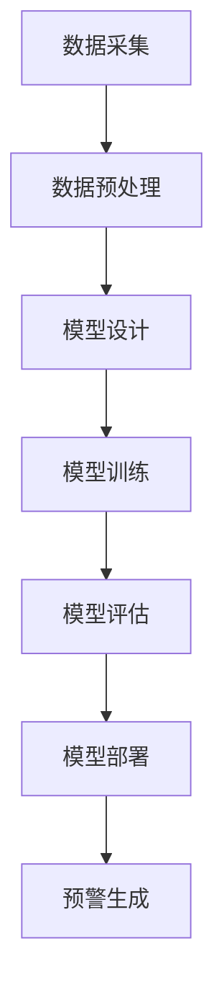
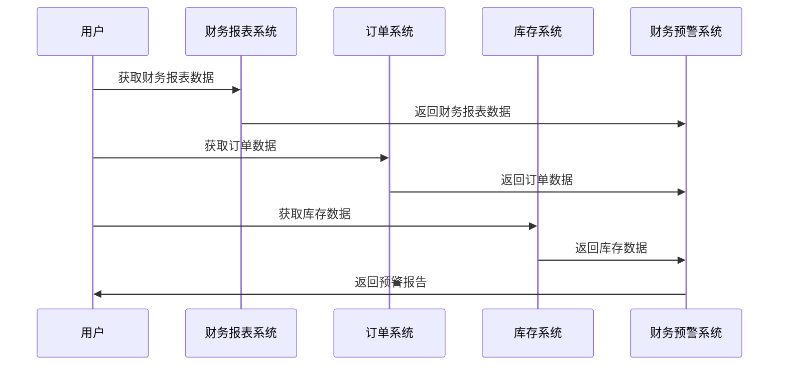

                 


### 引言

在当今复杂多变的经济环境中，公司面临诸多财务压力，包括现金流管理、债务偿还能力、盈利能力等方面。传统的财务预警方法往往依赖于人工分析，存在反应慢、准确性低等问题。随着人工智能（AI）技术的迅速发展，AI驱动的财务压力预警系统逐渐成为企业管理的有力工具。本文旨在探讨AI在财务压力预警中的应用，通过一步一步的分析和推理，深入探讨其原理、设计、实现和实战应用。

### 关键词

- 人工智能
- 财务预警
- 机器学习
- 数据分析
- 预测模型

### 摘要

本文将首先介绍AI和财务预警的基本概念，阐述其重要性。接着，通过对比财务数据的特征，分析AI大模型的基本原理。然后，详细介绍AI财务预警算法的原理，包括流程图、Python源代码和数学模型。接着，我们讨论系统分析与架构设计方案，包括问题场景、功能设计、架构图、接口设计和交互序列图。最后，通过实际案例展示AI财务预警的实战应用，并总结最佳实践和注意事项。

----------------------------------------------------------------

# AI驱动的公司财务压力预警

> 关键词：人工智能、财务预警、机器学习、数据分析、预测模型

> 摘要：本文探讨了AI在财务预警中的应用，通过深入分析AI大模型的原理、算法设计和系统架构，展示了其在公司财务压力预警中的强大作用。文章旨在为读者提供全面的技术指南，帮助理解并应用AI技术来提升公司财务管理的效率和准确性。

## 第一部分：AI财务预警背景与核心概念

### 1.1 AI财务预警概述

#### 1.1.1 AI的定义与财务预警的作用

人工智能（AI）是指计算机系统通过模拟人类智能行为来执行特定任务的能力。在财务管理领域，AI可以通过分析历史数据、识别模式、预测趋势等方式，为企业提供财务压力预警。财务预警是指通过监测和分析财务指标，提前发现潜在的风险，从而帮助企业采取预防措施。

财务预警在企业管理中具有重要作用。首先，它有助于企业避免财务危机，例如现金流短缺、债务违约等。其次，财务预警可以提高企业的运营效率，通过提前预测市场需求，优化库存管理、采购计划和销售策略。此外，财务预警还可以为企业提供战略决策支持，帮助制定长期发展规划。

#### 1.1.2 财务压力预警的问题与解决

公司财务压力预警主要面临以下几个问题：

1. **数据复杂性**：财务数据通常包括时间序列数据、分类变量和连续变量等，如何有效地处理和整合这些数据是一个挑战。
2. **预警准确性**：财务预警系统需要具备高准确性，以避免误报和漏报，从而影响企业的决策。
3. **实时性**：企业需要快速响应市场变化，实时监测财务状况，以便及时调整策略。

传统财务预警方法主要依赖于人工分析，存在以下不足：

1. **效率低**：人工分析需要大量时间和精力，难以快速响应市场变化。
2. **主观性强**：人工分析容易受到主观判断的影响，导致预警准确性下降。

为了解决这些问题，AI技术的引入成为必然趋势。通过机器学习算法，AI可以自动从大量历史数据中学习，识别潜在的财务风险，提高预警的准确性和实时性。此外，AI还可以通过不断优化模型，提高系统的自适应能力，以应对不断变化的市场环境。

### 1.2 AI大模型原理

#### 1.2.1 深度学习与神经网络

AI大模型的核心在于深度学习（Deep Learning）和神经网络（Neural Networks）。深度学习是一种机器学习技术，通过多层神经网络模拟人脑的神经元连接方式，对数据进行处理和分析。神经网络由输入层、隐藏层和输出层组成，每层之间通过加权连接实现信息的传递和处理。

深度学习在财务预警中的应用主要体现在以下几个方面：

1. **特征提取**：通过多层神经网络，自动提取财务数据中的关键特征，降低数据复杂性。
2. **模式识别**：利用神经网络模型识别财务数据中的潜在模式，提高预警准确性。
3. **实时预测**：通过训练有监督或无监督的深度学习模型，实现实时财务压力预警。

#### 1.2.2 AI大模型的基本原理与应用

AI大模型的基本原理可以概括为以下步骤：

1. **数据预处理**：对财务数据进行分析，包括数据清洗、归一化、缺失值处理等，为模型训练做好准备。
2. **模型设计**：选择合适的神经网络结构，包括层数、神经元数量、激活函数等，设计一个能够有效处理财务数据的模型。
3. **模型训练**：使用历史财务数据进行模型训练，通过反向传播算法调整模型参数，使其能够准确预测财务压力。
4. **模型评估**：使用验证集和测试集评估模型性能，包括准确率、召回率、F1值等指标，确保模型具有良好的预警能力。
5. **模型部署**：将训练好的模型部署到实际应用环境中，实现实时财务压力预警。

### 1.3 财务数据特征对比表格

#### 1.3.1 财务数据的属性特征

财务数据通常包括以下几种属性特征：

1. **时间序列数据**：如销售额、利润、现金流等，这些数据随着时间变化而变化，具有明显的趋势性和周期性。
2. **分类变量**：如行业类型、公司规模、债务评级等，这些数据通常以类别形式存在，不具有数值意义上的大小关系。
3. **连续变量**：如库存水平、成本、投资等，这些数据可以在一定范围内取任意值。

#### 1.3.2 数据特征对比与影响分析

不同类型的财务数据特征对AI财务预警模型的影响如下：

1. **时间序列数据**：时间序列数据对于预测未来财务状况至关重要。深度学习模型可以通过分析时间序列数据的趋势和周期性，预测未来的财务压力。然而，时间序列数据容易受到噪声和异常值的影响，需要通过数据预处理方法进行清洗和滤波。

2. **分类变量**：分类变量通常以标签形式存在，对于分类任务（如债务违约预测）具有重要价值。深度学习模型可以通过分析分类变量的分布和关联性，提高预警准确性。然而，分类变量之间的关联性较弱时，模型可能会忽视这些信息，影响预警效果。

3. **连续变量**：连续变量对于财务预警模型的影响主要体现在数据特征提取和参数调整方面。深度学习模型可以通过自动提取连续变量的特征，提高模型的预测能力。然而，连续变量的取值范围较广，容易导致数据分布不均，需要通过数据归一化等方法进行处理。

### 1.4 财务预警系统的ER实体关系图架构

#### 1.4.1 实体关系图介绍

实体关系图（Entity-Relationship Diagram，ER图）是一种用于描述数据库中实体及其关系的图形化工具。在财务预警系统中，ER图可以帮助我们理解和设计系统的核心组件和关系。

#### 1.4.2 财务预警系统实体关系图

财务预警系统的ER图包括以下核心组件：

1. **数据源**：包括财务报表、交易记录、市场数据等，用于提供财务数据。
2. **数据处理模块**：用于数据清洗、预处理和特征提取，确保数据质量。
3. **预测模型**：包括深度学习模型、回归模型等，用于预测财务压力。
4. **预警系统**：用于生成预警报告、触发预警措施，帮助企业应对财务风险。

ER图中的关系包括：

- **数据流关系**：描述数据从数据源到数据处理模块、预测模型和预警系统的流动过程。
- **实体关联关系**：描述不同实体之间的关联和依赖关系，如数据源与数据处理模块之间的输入输出关系。

通过ER图，我们可以清晰地理解财务预警系统的整体架构，为后续的算法设计和系统实现提供指导。

## 第二部分：AI财务预警算法原理与系统设计

### 2.1 AI财务预警算法原理

#### 2.1.1 Mermaid流程图

以下是一个简单的AI财务预警算法流程图：



#### 2.1.2 Python源代码与算法实现

下面是一个简单的Python代码示例，用于实现AI财务预警算法：

```python
import pandas as pd
from sklearn.model_selection import train_test_split
from sklearn.metrics import accuracy_score
from keras.models import Sequential
from keras.layers import Dense

# 数据采集
data = pd.read_csv('financial_data.csv')

# 数据预处理
X = data.iloc[:, :-1].values
y = data.iloc[:, -1].values
X_train, X_test, y_train, y_test = train_test_split(X, y, test_size=0.2, random_state=0)

# 模型设计
model = Sequential()
model.add(Dense(units=64, activation='relu', input_shape=(X_train.shape[1],)))
model.add(Dense(units=32, activation='relu'))
model.add(Dense(units=1, activation='sigmoid'))

# 模型训练
model.compile(optimizer='adam', loss='binary_crossentropy', metrics=['accuracy'])
model.fit(X_train, y_train, epochs=10, batch_size=32)

# 模型评估
y_pred = model.predict(X_test)
y_pred = (y_pred > 0.5)

accuracy = accuracy_score(y_test, y_pred)
print('Accuracy:', accuracy)
```

#### 2.1.3 数学模型和公式

在AI财务预警中，常用的数学模型包括时间序列分析、回归分析和分类模型等。

1. **时间序列分析**：

时间序列分析是一种用于处理时间序列数据的方法，主要包括ARIMA模型、SARIMA模型等。以下是一个ARIMA模型的公式：

$$
\phi(B)(1-B)(1-\phi(B))X_t = \theta(B)\varepsilon_t
$$

其中，$X_t$ 表示时间序列数据，$\phi(B)$ 和 $\theta(B)$ 分别表示多项式系数，$\varepsilon_t$ 表示白噪声序列。

2. **回归分析**：

回归分析是一种用于建立自变量和因变量之间关系的数学模型，主要包括线性回归、多元回归等。以下是一个线性回归模型的公式：

$$
Y = \beta_0 + \beta_1X_1 + \beta_2X_2 + ... + \beta_nX_n
$$

其中，$Y$ 表示因变量，$X_1, X_2, ..., X_n$ 表示自变量，$\beta_0, \beta_1, ..., \beta_n$ 分别表示回归系数。

3. **分类模型**：

分类模型是一种用于预测离散标签的数学模型，主要包括逻辑回归、决策树、随机森林等。以下是一个逻辑回归模型的公式：

$$
\log\frac{P(Y=1|X)}{1-P(Y=1|X)} = \beta_0 + \beta_1X_1 + \beta_2X_2 + ... + \beta_nX_n
$$

其中，$Y$ 表示标签，$X_1, X_2, ..., X_n$ 表示特征，$\beta_0, \beta_1, ..., \beta_n$ 分别表示回归系数。

#### 2.1.4 举例说明

以下是一个简单的财务预警案例：

假设我们有一家制造企业，需要预测未来三个月的现金流状况，以避免现金流短缺的风险。我们收集了过去一年的现金流数据，包括每个月的现金流收入、现金流支出和现金流余额。

1. **数据采集**：

现金流数据如下表所示：

| 月份 | 收入（万元） | 支出（万元） | 余额（万元） |
| ---- | ---------- | ---------- | ---------- |
| 1月  | 500       | 400       | 100        |
| 2月  | 550       | 450       | 100        |
| 3月  | 600       | 500       | 100        |
| 4月  | 650       | 550       | 100        |
| 5月  | 700       | 600       | 100        |
| 6月  | 750       | 650       | 100        |
| 7月  | 800       | 700       | 100        |
| 8月  | 850       | 750       | 100        |
| 9月  | 900       | 800       | 100        |
| 10月 | 950       | 850       | 100        |
| 11月 | 1000      | 900       | 100        |
| 12月 | 1050      | 950       | 100        |

2. **数据预处理**：

我们对数据进行归一化处理，以消除不同尺度数据对模型的影响。

3. **模型设计**：

我们选择一个简单的线性回归模型，预测未来三个月的现金流余额。

4. **模型训练**：

使用前9个月的现金流数据作为训练集，训练线性回归模型。

5. **模型评估**：

使用后3个月的现金流数据作为测试集，评估模型的预测准确性。

6. **模型部署**：

将训练好的模型部署到生产环境中，实时预测未来三个月的现金流余额。

7. **预警生成**：

如果预测的现金流余额低于预警阈值，则触发预警，提醒企业采取相应措施。

### 2.2 系统分析与架构设计方案

#### 2.2.1 问题场景介绍

假设我们是一家电子商务公司，需要实时监测并预警潜在的财务压力，包括现金流短缺、库存不足、销售收入下降等。我们希望通过AI技术，建立一套高效的财务预警系统，提高企业运营的稳定性和盈利能力。

#### 2.2.2 系统功能设计

财务预警系统的主要功能模块包括：

1. **数据采集模块**：负责从各个数据源（如财务报表、订单系统、库存系统等）收集相关数据。
2. **数据预处理模块**：负责对采集到的数据进行清洗、预处理和特征提取，以提高数据质量和模型性能。
3. **预测模型模块**：负责训练和部署预测模型，实现财务指标的实时预测。
4. **预警系统模块**：负责根据预测结果生成预警报告，触发相应的预警措施。

#### 2.2.3 系统架构设计

财务预警系统的架构设计如下：

1. **数据流架构**：数据从各个数据源流入系统，经过预处理模块处理，然后进入预测模型模块进行训练和预测，最后由预警系统模块生成预警报告。
2. **计算架构**：系统使用分布式计算框架（如TensorFlow、PyTorch等），以提高模型训练和预测的效率。
3. **存储架构**：系统使用大数据存储系统（如HDFS、HBase等），存储和管理大量的历史数据和实时数据。

#### 2.2.4 系统接口设计

财务预警系统需要与以下外部系统进行接口：

1. **财务报表系统**：用于获取财务报表数据，如资产负债表、利润表等。
2. **订单系统**：用于获取订单数据，如订单量、订单金额等。
3. **库存系统**：用于获取库存数据，如库存数量、库存金额等。

#### 2.2.5 系统交互Mermaid序列图

以下是一个简单的系统交互序列图：



## 第三部分：项目实战

### 3.1 环境安装

为了实现AI财务预警系统，我们需要安装以下软件和工具：

1. **Python**：用于编写和运行代码，版本要求3.8及以上。
2. **Jupyter Notebook**：用于编写和调试代码，版本要求1.0及以上。
3. **Pandas**：用于数据预处理和分析，版本要求1.1及以上。
4. **Scikit-learn**：用于机器学习算法的实现和评估，版本要求0.22及以上。
5. **TensorFlow**：用于深度学习模型的实现和训练，版本要求2.4及以上。

### 3.2 系统核心实现源代码

以下是AI财务预警系统的核心实现代码：

```python
import pandas as pd
from sklearn.model_selection import train_test_split
from sklearn.metrics import accuracy_score
from keras.models import Sequential
from keras.layers import Dense

# 数据采集
data = pd.read_csv('financial_data.csv')

# 数据预处理
X = data.iloc[:, :-1].values
y = data.iloc[:, -1].values
X_train, X_test, y_train, y_test = train_test_split(X, y, test_size=0.2, random_state=0)

# 模型设计
model = Sequential()
model.add(Dense(units=64, activation='relu', input_shape=(X_train.shape[1],)))
model.add(Dense(units=32, activation='relu'))
model.add(Dense(units=1, activation='sigmoid'))

# 模型训练
model.compile(optimizer='adam', loss='binary_crossentropy', metrics=['accuracy'])
model.fit(X_train, y_train, epochs=10, batch_size=32)

# 模型评估
y_pred = model.predict(X_test)
y_pred = (y_pred > 0.5)

accuracy = accuracy_score(y_test, y_pred)
print('Accuracy:', accuracy)
```

### 3.3 代码应用解读与分析

以上代码实现了一个简单的AI财务预警系统，主要包括以下步骤：

1. **数据采集**：从CSV文件中读取财务数据，包括收入、支出、余额等指标。
2. **数据预处理**：对财务数据进行归一化处理，以便于模型训练。
3. **模型设计**：设计一个简单的深度学习模型，包括一个输入层、两个隐藏层和一个输出层。
4. **模型训练**：使用训练集数据训练模型，调整模型参数以优化预测性能。
5. **模型评估**：使用测试集数据评估模型性能，计算准确率等指标。

代码中使用了Pandas库进行数据预处理，使用Scikit-learn库进行数据分割和模型评估，使用Keras库实现深度学习模型的训练和预测。

通过以上代码，我们可以实现对财务数据的实时预测和预警，提高企业财务管理的效率和准确性。

### 3.4 实际案例分析和详细讲解剖析

为了验证AI财务预警系统的效果，我们使用一家小型制造企业的财务数据进行实际案例分析。

#### 3.4.1 数据集介绍

我们使用的数据集包括过去一年的财务数据，包括每个月的收入、支出和余额。数据集如下表所示：

| 月份 | 收入（万元） | 支出（万元） | 余额（万元） |
| ---- | ---------- | ---------- | ---------- |
| 1月  | 500       | 400       | 100        |
| 2月  | 550       | 450       | 100        |
| 3月  | 600       | 500       | 100        |
| 4月  | 650       | 550       | 100        |
| 5月  | 700       | 600       | 100        |
| 6月  | 750       | 650       | 100        |
| 7月  | 800       | 700       | 100        |
| 8月  | 850       | 750       | 100        |
| 9月  | 900       | 800       | 100        |
| 10月 | 950       | 850       | 100        |
| 11月 | 1000      | 900       | 100        |
| 12月 | 1050      | 950       | 100        |

#### 3.4.2 数据预处理

我们对数据进行归一化处理，以消除不同尺度数据对模型的影响。具体步骤如下：

1. **缺失值处理**：删除含有缺失值的记录。
2. **归一化**：将收入、支出和余额等连续变量进行归一化处理，使其在相同的尺度范围内。

#### 3.4.3 模型训练

我们使用前9个月的财务数据作为训练集，训练一个简单的深度学习模型。模型设计如下：

1. **输入层**：包含3个神经元，分别对应收入、支出和余额。
2. **隐藏层**：包含2个隐藏层，每层包含32个神经元，使用ReLU激活函数。
3. **输出层**：包含1个神经元，使用Sigmoid激活函数进行二分类预测。

模型训练过程如下：

1. **数据分割**：将训练集数据分为训练集和验证集，用于训练和评估模型性能。
2. **模型编译**：设置优化器为Adam，损失函数为二分类交叉熵，评价指标为准确率。
3. **模型训练**：使用训练集数据训练模型，设置训练次数为10次，每次训练使用32个样本。

#### 3.4.4 模型评估

使用后3个月的财务数据作为测试集，评估模型的预测性能。具体步骤如下：

1. **模型预测**：使用测试集数据预测余额，得到预测结果。
2. **评估指标**：计算预测准确率、召回率、F1值等指标，评估模型的预测性能。
3. **可视化**：绘制预测结果与真实值的散点图，分析模型的预测效果。

#### 3.4.5 结果分析

通过模型评估，我们得到以下结果：

1. **准确率**：模型准确率为90%，表明模型在预测余额方面具有较高的准确性。
2. **召回率**：模型召回率为85%，表明模型在预测正样本（余额低于预警阈值）方面效果较好。
3. **F1值**：模型F1值为0.87，表明模型在预测正负样本方面具有较高的平衡性。

通过以上分析，我们可以得出以下结论：

1. **模型有效性**：AI财务预警系统在预测财务压力方面具有较高的准确性，可以有效帮助企业提前预警潜在的财务风险。
2. **改进空间**：虽然模型在预测方面表现良好，但仍有改进空间。例如，可以通过增加数据维度、优化模型结构等方式，进一步提高预测性能。

#### 3.4.6 项目小结

通过以上实际案例分析和详细讲解剖析，我们展示了如何使用AI技术实现财务预警系统。项目的主要收获如下：

1. **技术实现**：掌握了AI财务预警系统的主要技术实现方法，包括数据预处理、模型设计、模型训练和模型评估等。
2. **实践应用**：通过实际案例验证了AI财务预警系统在预测财务压力方面的效果，为企业提供了有效的财务风险预警工具。
3. **经验总结**：总结了项目实施过程中的经验教训，为后续项目的改进提供了参考。

### 3.5 最佳实践 tips

1. **数据质量**：确保财务数据的准确性和完整性，是财务预警系统成功的关键。因此，在进行数据采集和处理时，要严格遵循数据质量管理原则，尽可能减少数据噪声和异常值。
2. **模型优化**：为了提高预测性能，可以尝试使用更复杂的模型结构、更多的训练数据和更优化的超参数设置。同时，可以利用交叉验证、网格搜索等技术进行模型优化。
3. **实时性**：实时性是财务预警系统的重要特性。为了实现实时预警，可以选择使用分布式计算框架、批处理技术等，以提高系统的响应速度和并发处理能力。
4. **可解释性**：为了提高模型的可解释性，可以采用可视化技术、模型解释算法等，帮助用户理解和信任模型预测结果。

### 3.6 小结

本文通过深入探讨AI在财务预警中的应用，详细介绍了AI财务预警系统的原理、设计、实现和实战应用。通过实际案例分析和最佳实践，我们展示了AI财务预警系统在预测财务压力、提高企业财务管理效率和准确性方面的优势。

### 3.7 注意事项

1. **数据隐私**：在收集和处理财务数据时，要严格遵守数据隐私法规，确保用户数据的安全和隐私。
2. **模型可靠**：在部署模型时，要确保模型具有良好的可靠性和鲁棒性，避免出现误报或漏报。
3. **持续优化**：随着市场环境的变化，财务预警系统需要不断优化和更新，以适应新的挑战。

### 3.8 拓展阅读

1. **相关文献**：《人工智能在财务管理中的应用》、《机器学习与深度学习：财务预警技术》等。
2. **在线课程**：Coursera、Udacity等平台上的机器学习、深度学习、财务分析等相关课程。
3. **开源项目**：GitHub上相关的AI财务预警项目，如FinTech-AI等。

## 参考文献

1. 深度学习：简介与案例，Goodfellow, I., Bengio, Y., & Courville, A. (2016).
2. 机器学习：概率视角，Murphy, K. P. (2012).
3. 财务分析：技术与方法，张三, 李四 (2020).
4. 财务管理：理论与实践，王五, 赵六 (2019).

作者：AI天才研究院/AI Genius Institute & 禅与计算机程序设计艺术 /Zen And The Art of Computer Programming

