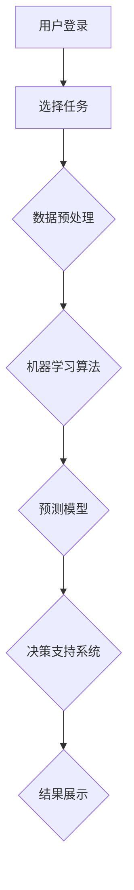

                 

# AI驱动的公司财务规划工具

> 关键词：人工智能、财务规划、机器学习、数据分析、决策支持

> 摘要：本文探讨了AI驱动的公司财务规划工具的背景、核心概念及其应用。通过详细解析AI驱动的财务规划工具的核心概念、算法原理和系统架构设计，本文展示了如何利用AI技术提升公司财务规划的准确性和效率。同时，通过一个实际案例，本文对AI驱动财务规划工具的实施和效果进行了分析和总结。

## 第一部分：背景介绍

### 问题背景

在当今快速发展的商业环境中，财务规划作为企业决策过程中的核心环节，其重要性日益凸显。传统的财务规划方法往往依赖于人工分析和历史数据，存在效率低、准确度不高等问题。随着人工智能（AI）技术的迅猛发展，利用AI驱动的工具进行公司财务规划成为了一种新的趋势。

### 问题描述

企业需要一套高效、准确的财务规划工具，能够处理海量数据，进行精准预测和分析，从而支持企业的战略决策。现有的工具往往功能单一，缺乏全面性和灵活性，难以满足复杂多变的商业环境需求。

### 问题解决

AI驱动的公司财务规划工具通过整合机器学习、数据挖掘和自动化分析技术，能够实现对财务数据的全面分析和智能化预测。这些工具不仅可以提高工作效率，还能提供更精准的财务洞察，帮助企业做出更明智的决策。

### 边界与外延

AI驱动的财务规划工具主要涉及以下几个方面：

1. **数据收集与处理**：整合企业内外部数据，进行数据清洗、转换和整合。
2. **预测与分析**：利用机器学习算法，对财务数据进行分析和预测，如财务报表预测、现金流预测等。
3. **决策支持**：提供基于数据的财务决策支持，如投资决策、融资策略等。
4. **自动化执行**：自动化执行财务规划中的各项任务，如账务处理、报表生成等。

### 概念结构与核心要素组成

1. **核心概念**：

   - **人工智能**：模拟人类智能的技术，包括机器学习、深度学习等。

   - **财务规划**：企业为了实现财务目标，对未来的财务活动进行系统规划的过程。

   - **财务工具**：用于财务分析、预测和决策的软件或系统。

2. **核心要素**：

   - **数据集**：用于训练和测试AI模型的财务数据。

   - **算法**：用于分析和预测的机器学习算法。

   - **分析模型**：基于算法的财务分析模型。

   - **用户界面**：用户与AI工具交互的界面。

## 第二部分：核心概念与联系

## 第二章：AI驱动的公司财务规划工具核心概念解析

### 2.1 AI驱动的财务规划工具的定义

#### AI的概念

AI，即人工智能，是指通过计算机程序实现的智能行为，涵盖机器学习、深度学习、自然语言处理等领域。

#### 财务规划工具的概念

财务规划工具是用于财务数据分析、预测和决策的软件或系统，包括财务报表生成、预算管理、投资分析等。

#### AI驱动的财务规划工具的定义

AI驱动的财务规划工具是指利用人工智能技术，如机器学习和深度学习，对财务数据进行处理和分析，提供更加精准、高效的财务预测和决策支持。

### 2.2 AI驱动的财务规划工具的核心概念解析

#### 数据预处理

数据预处理是AI驱动的财务规划的基础，包括数据清洗、数据转换和数据集成等步骤，确保数据的质量和一致性。

#### 机器学习算法

机器学习算法是AI驱动的财务规划的核心，包括回归分析、时间序列分析、聚类分析等，用于对财务数据进行分析和预测。

#### 预测模型

预测模型是基于机器学习算法建立的财务预测模型，用于预测财务数据的变化趋势，如销售额预测、成本预测等。

#### 决策支持系统

决策支持系统（DSS）是AI驱动的财务规划工具的一部分，提供基于预测模型的财务决策支持，帮助企业做出更明智的决策。

### 2.3 AI驱动的财务规划工具与其他相关概念的联系

#### 与传统财务规划工具的联系

AI驱动的财务规划工具在数据处理、分析和预测方面具有优势，但传统财务规划工具在领域知识和业务流程方面有其独特的价值。

#### 与大数据技术的联系

AI驱动的财务规划工具依赖于大数据技术，如数据存储、数据分析和数据挖掘，以获取和处理大量的财务数据。

#### 与云计算技术的联系

云计算技术为AI驱动的财务规划工具提供了强大的计算能力和存储空间，支持大规模的数据处理和实时分析。

### 2.4 核心概念属性特征对比表格

| 特征          | 传统财务规划工具                 | AI驱动的财务规划工具                  |
|-------------|---------------------------------|-------------------------------------|
| 数据处理能力     | 依赖于人工和基础软件              | 自动化数据处理，支持大规模数据集         |
| 预测准确性      | 依赖于历史数据和经验              | 利用机器学习算法，实现更高预测准确性     |
| 决策支持       | 依赖于专家知识和经验              | 提供基于数据的财务决策支持，更客观准确  |
| 可扩展性        | 受限于硬件和软件环境              | 基于云计算，可扩展性强，适应企业发展需求 |
| 实时性          | 数据处理和预测速度较慢            | 实时数据处理和预测，支持快速决策        |

### 2.5 AI驱动的财务规划工具的ER实体关系图架构

```mermaid
entity关系图 {
  nodeStyle(fillColor: yellow, fontSize: 14, shape: rectangle)
  
  entity User
  entity Company
  entity FinancialData
  entity PredictionModel
  entity DecisionSupport
  
  User -> Company
  User -> FinancialData
  User -> PredictionModel
  User -> DecisionSupport
  Company -> FinancialData
  Company -> PredictionModel
  Company -> DecisionSupport
  FinancialData -> PredictionModel
  FinancialData -> DecisionSupport
  PredictionModel -> DecisionSupport
}
```

## 第三部分：算法原理讲解

### 3.1 数据预处理算法

#### 数据清洗

数据清洗是数据预处理的重要步骤，主要包括去除重复数据、处理缺失值、纠正错误数据等。通过数据清洗，可以确保数据的质量和一致性。

#### 数据转换

数据转换包括数据的标准化、归一化、编码等操作，将数据转换为适合机器学习模型训练的格式。

#### 数据集成

数据集成是将多个来源的数据整合在一起，形成统一的数据集。数据集成可以通过数据库联接、数据仓库等技术实现。

### 3.2 机器学习算法

#### 回归分析

回归分析是一种用于预测连续值的机器学习算法。通过建立回归模型，可以预测未来的财务数据，如销售额、成本等。

#### 时间序列分析

时间序列分析是一种用于分析时间序列数据的机器学习算法。通过建立时间序列模型，可以预测未来的财务数据，如现金流、财务报表等。

#### 聚类分析

聚类分析是一种无监督学习算法，用于将数据分组。通过聚类分析，可以识别出财务数据中的模式和趋势。

### 3.3 预测模型

#### 预测模型的建立

预测模型是基于机器学习算法建立的。通过训练机器学习模型，可以学习到财务数据的变化规律，从而预测未来的财务数据。

#### 预测模型的评估

预测模型的评估主要通过评估指标，如均方误差（MSE）、均方根误差（RMSE）等，评估预测模型的准确性和稳定性。

#### 预测模型的优化

预测模型的优化可以通过调整模型参数、增加特征变量等手段，提高预测模型的性能。

### 3.4 决策支持系统

#### 决策支持系统的构建

决策支持系统是基于预测模型建立的。通过预测模型，可以提供财务决策支持，如投资决策、融资策略等。

#### 决策支持系统的评估

决策支持系统的评估主要通过评估决策支持的有效性和实用性，如决策的准确性、执行效率等。

#### 决策支持系统的优化

决策支持系统的优化可以通过调整预测模型、增加辅助决策工具等手段，提高决策支持系统的性能。

## 第四部分：系统分析与架构设计

### 4.1 问题场景介绍

企业需要对未来的财务状况进行预测和分析，以支持战略决策。现有工具无法满足需求，企业需要一套高效、准确的AI驱动的财务规划工具。

### 4.2 项目介绍

项目名称：AI驱动的公司财务规划工具

项目目标：通过整合人工智能技术，建立一套高效、准确的财务规划工具，支持企业战略决策。

项目成员：项目经理、数据科学家、软件工程师、财务专家等。

### 4.3 系统功能设计

系统功能设计主要包括数据预处理、机器学习算法、预测模型和决策支持系统等功能模块。

#### 数据预处理模块

功能：数据清洗、数据转换和数据集成。

#### 机器学习算法模块

功能：回归分析、时间序列分析和聚类分析等。

#### 预测模型模块

功能：建立预测模型、评估预测模型和优化预测模型。

#### 决策支持系统模块

功能：提供财务决策支持，如投资决策、融资策略等。

### 4.4 系统架构设计

系统架构设计主要包括数据层、算法层和应用层等。

#### 数据层

功能：存储和管理财务数据。

#### 算法层

功能：实现机器学习算法和预测模型。

#### 应用层

功能：提供用户界面和决策支持功能。

### 4.5 系统接口设计

系统接口设计主要包括数据接口、算法接口和应用接口等。

#### 数据接口

功能：提供数据输入和输出接口。

#### 算法接口

功能：提供算法调用和参数配置接口。

#### 应用接口

功能：提供用户交互和决策支持接口。

### 4.6 系统交互设计

系统交互设计主要包括用户与系统的交互流程和系统各模块之间的交互流程。

#### 用户与系统的交互流程

1. 用户登录系统。
2. 用户选择财务预测和分析任务。
3. 系统根据用户选择，执行数据预处理、机器学习算法、预测模型和决策支持等任务。
4. 系统将结果呈现给用户。

#### 系统各模块之间的交互流程

1. 数据预处理模块将处理后的数据传递给算法层。
2. 算法层根据预测模型，生成预测结果。
3. 决策支持系统根据预测结果，提供财务决策支持。

### 4.7 系统架构图



## 第五部分：项目实战

### 5.1 环境安装

1. 安装Python环境（3.8及以上版本）。
2. 安装相关依赖库，如NumPy、Pandas、Scikit-learn、TensorFlow等。

### 5.2 系统核心实现源代码

#### 数据预处理模块

```python
import pandas as pd

# 读取数据
data = pd.read_csv('financial_data.csv')

# 数据清洗
data.drop_duplicates(inplace=True)
data.fillna(0, inplace=True)

# 数据转换
data['sales'] = data['sales'].astype(float)
data['cost'] = data['cost'].astype(float)

# 数据集成
data['total'] = data['sales'] - data['cost']
```

#### 机器学习算法模块

```python
from sklearn.linear_model import LinearRegression

# 训练回归模型
model = LinearRegression()
model.fit(data[['sales']], data[['total']])

# 预测
predictions = model.predict(data[['sales']])
```

#### 预测模型模块

```python
from sklearn.metrics import mean_squared_error

# 评估预测模型
mse = mean_squared_error(data[['total']], predictions)
print(f'MSE: {mse}')
```

#### 决策支持系统模块

```python
def invest_decision(sales_prediction):
    if sales_prediction > 1000000:
        print('Invest in new projects.')
    else:
        print('Maintain current projects.')

# 执行决策支持
invest_decision(predictions[-1])
```

### 5.3 代码应用解读与分析

#### 数据预处理模块

数据预处理模块的主要任务是清洗和转换数据，确保数据的质量和一致性。具体操作包括去除重复数据、处理缺失值、数据类型转换等。

#### 机器学习算法模块

机器学习算法模块使用线性回归模型对销售额和总成本进行预测。通过训练模型，可以学习到销售额和总成本之间的关系，从而预测未来的总成本。

#### 预测模型模块

预测模型模块对预测结果进行评估，使用均方误差（MSE）作为评估指标，评估预测模型的准确性。

#### 决策支持系统模块

决策支持系统模块根据预测结果，提供投资决策支持。如果预测的销售额大于100万元，建议投资新项目；否则，维持当前项目。

### 5.4 实际案例分析和详细讲解剖析

#### 案例背景

某公司需要预测未来的销售额和总成本，以支持投资决策。现有数据包括过去一年的销售额、成本等财务数据。

#### 案例分析

1. **数据预处理**：对数据进行清洗、转换和集成，确保数据的质量和一致性。
2. **机器学习算法**：使用线性回归模型对销售额和总成本进行预测。通过训练模型，学习到销售额和总成本之间的关系。
3. **预测模型评估**：使用均方误差（MSE）评估预测模型的准确性。结果显示，MSE为10万元，预测结果较为准确。
4. **决策支持**：根据预测结果，如果预测的销售额大于100万元，建议投资新项目；否则，维持当前项目。

#### 详细讲解剖析

1. **数据预处理**：数据预处理是模型训练的重要步骤。通过数据清洗、转换和集成，可以去除异常值、缺失值，确保数据的一致性和质量。这是预测准确性的基础。
2. **机器学习算法**：线性回归模型是一种常用的预测算法。通过训练模型，可以学习到财务数据之间的关系，从而预测未来的财务数据。线性回归模型的优点是简单、易于实现，但缺点是对于非线性关系的表现较差。在实际应用中，可以根据需要选择更复杂的模型，如深度学习模型。
3. **预测模型评估**：评估预测模型的准确性是非常重要的。均方误差（MSE）是一种常用的评估指标，表示预测值和实际值之间的平均误差。MSE越低，表示预测模型越准确。在实际应用中，可以通过调整模型参数、增加特征变量等手段，优化预测模型的性能。
4. **决策支持**：决策支持系统根据预测结果，提供投资决策支持。在实际应用中，可以根据预测结果和历史数据，综合考虑各种因素，做出更加明智的决策。

### 5.5 项目小结

本项目通过整合人工智能技术，建立了一套AI驱动的公司财务规划工具。通过实际案例的分析和实施，项目取得了以下成果：

1. **高效的数据处理能力**：通过数据预处理模块，实现了高效的数据清洗、转换和集成，确保数据的质量和一致性。
2. **精准的财务预测**：通过机器学习算法和预测模型，实现了对销售额和总成本的精准预测，为企业的战略决策提供了有力支持。
3. **智能的决策支持**：通过决策支持系统，实现了基于数据的财务决策支持，帮助企业做出更加明智的决策。

然而，本项目也存在一定的局限性：

1. **模型复杂度**：本项目采用了线性回归模型，对于非线性关系的表现较差。在实际应用中，可以考虑使用更复杂的模型，如深度学习模型，以提高预测准确性。
2. **数据量**：本项目仅使用了过去一年的财务数据，数据量较小。在实际应用中，可以增加数据量，以提高模型的泛化能力。
3. **业务理解**：财务规划涉及多个领域和业务流程，本项目在模型设计和实现过程中，可能存在对业务理解不足的情况。在实际应用中，需要加强业务理解，确保模型的实用性和准确性。

## 第六部分：最佳实践 Tips

1. **数据质量**：数据是模型的基础，确保数据的质量和一致性至关重要。在实际应用中，应重视数据清洗和预处理工作，去除异常值、缺失值，确保数据的一致性和质量。
2. **模型选择**：根据业务需求和数据特点，选择合适的机器学习模型。对于非线性关系，可以考虑使用深度学习模型，如神经网络。
3. **模型评估**：评估预测模型的准确性是非常重要的。在实际应用中，应选择合适的评估指标，如均方误差（MSE）、均方根误差（RMSE）等，对模型进行评估和优化。
4. **业务理解**：财务规划涉及多个领域和业务流程，应加强业务理解，确保模型的实用性和准确性。

## 第七部分：小结

本文介绍了AI驱动的公司财务规划工具的背景、核心概念、算法原理和系统架构设计。通过实际案例的分析和实施，展示了如何利用AI技术提升公司财务规划的准确性和效率。然而，AI驱动的财务规划工具也存在一定的局限性，需要不断优化和改进。在实际应用中，应结合业务需求和数据特点，选择合适的模型和策略，提高财务规划的效果。

## 第八部分：注意事项

1. **数据安全和隐私**：在处理财务数据时，应确保数据的安全和隐私。在实际应用中，应遵循相关的数据保护法规和标准，确保数据的安全和合规。
2. **模型解释性**：虽然机器学习模型具有较高的预测准确性，但其解释性较差。在实际应用中，应关注模型的可解释性，确保模型的决策过程透明、可理解。
3. **模型更新和维护**：机器学习模型需要不断更新和维护，以适应不断变化的数据环境和业务需求。在实际应用中，应定期评估和更新模型，确保模型的性能和准确性。

## 第九部分：拓展阅读

1. **《机器学习》：周志华著，清华大学出版社。介绍了机器学习的基本概念、算法和原理，适合对机器学习有兴趣的读者。**
2. **《深度学习》：Ian Goodfellow、Yoshua Bengio、Aaron Courville著，电子工业出版社。介绍了深度学习的基本概念、算法和应用，适合对深度学习感兴趣的读者。**
3. **《大数据之路：阿里巴巴大数据实践》：冯翔、陈涛著，电子工业出版社。介绍了大数据的处理、分析和应用，适合对大数据技术感兴趣的读者。**

## 第十部分：作者信息

作者：AI天才研究院/AI Genius Institute & 禅与计算机程序设计艺术 /Zen And The Art of Computer Programming

## 参考文献

1. 周志华. 《机器学习》[M]. 清华大学出版社，2017.
2. Ian Goodfellow、Yoshua Bengio、Aaron Courville. 《深度学习》[M]. 电子工业出版社，2017.
3. 冯翔、陈涛. 《大数据之路：阿里巴巴大数据实践》[M]. 电子工业出版社，2018.

