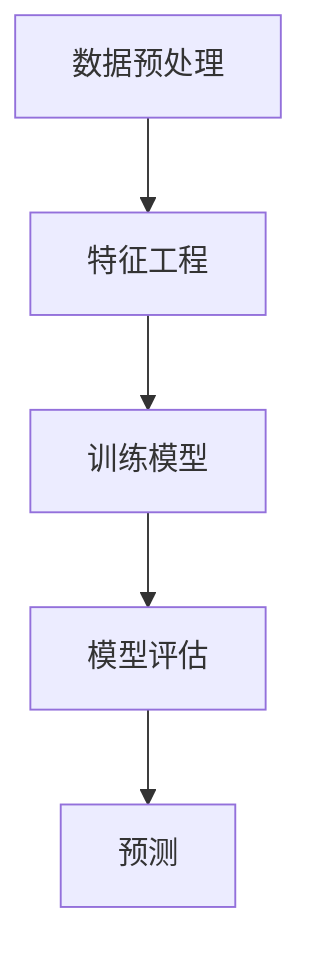
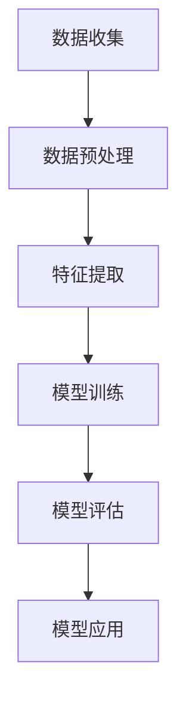
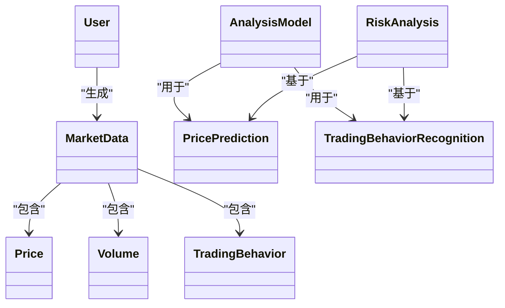
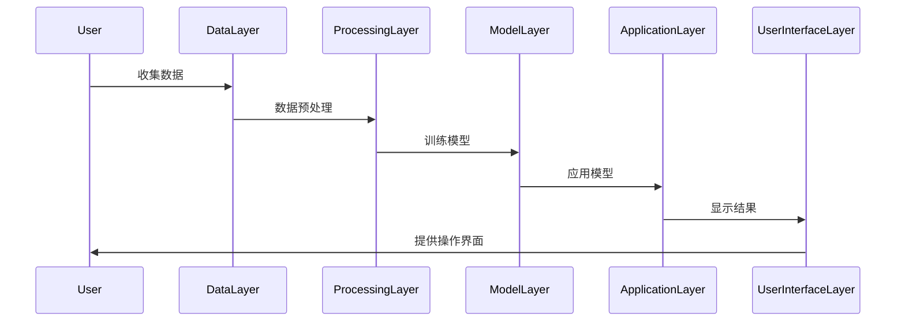
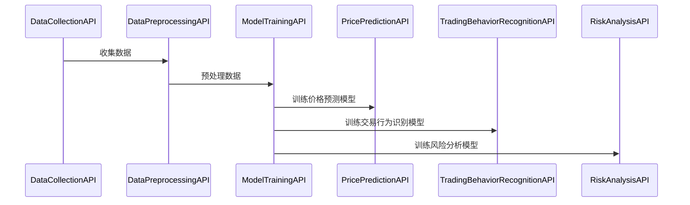

                 

# AI驱动的市场微观结构分析

> 关键词：AI、市场微观结构、价格预测、交易行为、深度学习、机器学习

> 摘要：本文深入探讨了AI在市场微观结构分析中的应用。通过对市场数据的深度挖掘，AI技术能够识别出市场中的异常交易行为，预测市场价格走势，从而为市场参与者提供有效的决策支持。文章首先介绍了市场微观结构的基本概念和AI技术在其中的应用，随后详细讲解了价格预测模型的工作原理和实现方法，并举例说明。此外，文章还讨论了市场微观结构分析的系统架构设计方案，以及在实际项目中的应用案例。

## 目录大纲：《AI驱动的市场微观结构分析》

## 第一部分：背景介绍

### 第1章：问题背景与核心概念

#### 1.1.1 市场微观结构概述

#### 1.1.2 AI技术在市场微观结构分析中的应用

### 第2章：核心概念与联系

#### 2.1.1 AI技术在市场微观结构分析中的应用

#### 2.1.2 AI市场分析模型

## 第二部分：算法原理讲解

### 第3章：价格预测模型原理与实现

#### 3.1.1 价格预测模型原理

#### 3.1.2 价格预测模型实现

### 第4章：交易行为识别模型原理与实现

#### 4.1.1 交易行为识别模型原理

#### 4.1.2 交易行为识别模型实现

## 第三部分：系统分析与架构设计方案

### 第5章：问题场景介绍

### 第6章：系统功能设计

#### 6.1.1 领域模型设计

### 第7章：系统架构设计

#### 7.1.1 系统架构设计

### 第8章：系统接口设计和系统交互

#### 8.1.1 系统接口设计

#### 8.1.2 系统交互设计

## 第四部分：项目实战

### 第9章：环境安装

### 第10章：系统核心实现源代码

### 第11章：代码应用解读与分析

### 第12章：实际案例分析和详细讲解剖析

### 第13章：项目小结

## 第五部分：最佳实践 tips、小结、注意事项、拓展阅读

### 第14章：最佳实践 tips

### 第15章：小结

### 第16章：注意事项

### 第17章：拓展阅读

---

## 第一部分：背景介绍

### 第1章：问题背景与核心概念

#### 1.1.1 市场微观结构概述

市场微观结构是指市场中各个微观要素（如交易者、交易行为、价格等）的相互关系和运行规律。它关注的是市场的细节层面，包括交易者如何决策、如何执行交易、交易如何影响市场价格等。市场微观结构分析旨在理解市场的运作机制，预测市场行为，为投资者提供决策依据。

**问题描述**：
随着金融市场的日益复杂，传统的市场分析手段已经难以应对海量数据的处理和快速变化的交易环境。因此，如何利用现代人工智能技术，特别是机器学习和深度学习，对市场微观结构进行分析，成为一个亟待解决的问题。

**问题解决**：
AI技术，特别是机器学习和深度学习，可以处理大量历史数据，从中挖掘出潜在的模式和规律，进而预测市场价格走势和交易行为。通过AI驱动的市场微观结构分析，可以提高市场参与者的决策效率，降低风险，提高投资回报。

**边界与外延**：
本文主要关注金融市场中AI驱动的微观结构分析，包括股票市场、期货市场、外汇市场等。这些市场的特点和交易规则有所不同，但基本的微观结构分析方法和原理是相通的。

**概念结构与核心要素组成**：
- **AI技术**：包括机器学习、深度学习、数据挖掘等。
- **市场数据**：包括交易数据、价格数据、成交量数据等。
- **分析模型**：包括价格预测模型、交易行为识别模型等。

### 1.1.2 AI技术在市场微观结构分析中的应用

AI技术在市场微观结构分析中的应用主要包括以下几个方面：

1. **数据预处理**：AI技术可以自动化地处理大量历史数据，进行清洗、归一化、特征提取等操作，为后续分析提供高质量的输入数据。

2. **特征工程**：AI技术可以根据市场数据的特性，自动生成和选择对市场价格预测和交易行为识别最有用的特征。

3. **价格预测**：AI技术可以建立价格预测模型，通过对历史数据的分析，预测未来的市场价格。

4. **交易行为识别**：AI技术可以识别出市场中的异常交易行为，如洗盘、对敲、操纵等，为市场监管提供依据。

5. **风险评估**：AI技术可以对市场风险进行量化评估，帮助投资者制定合理的投资策略。

#### 概念属性特征对比表格：

| 概念       | 特征                      |
|------------|--------------------------|
| 机器学习   | 基于数据，自动学习规律    |
| 深度学习   | 利用神经网络，处理复杂数据 |
| 数据挖掘   | 从大量数据中提取有价值信息 |

#### AI市场分析模型

AI市场分析模型通常包括以下步骤：

1. **数据收集**：收集市场交易数据、价格数据、成交量数据等。

2. **数据预处理**：对数据进行清洗、归一化、特征提取等处理。

3. **特征选择**：选择对市场价格预测和交易行为识别最有用的特征。

4. **模型训练**：使用机器学习算法训练价格预测模型和交易行为识别模型。

5. **模型评估**：评估模型的预测性能，包括准确率、召回率、F1分数等。

6. **模型应用**：将训练好的模型应用于实际市场数据，进行价格预测和交易行为识别。

#### ER实体关系图架构的Mermaid流程图：

```mermaid
erDiagram
  用户 ||--o> 交易数据 : "生成"
  价格 ||--o> 交易数据 : "记录"
  成交量 ||--o> 交易数据 : "记录"
  交易行为 ||--o> 分析模型 : "输入"
  分析模型 ||--o> 预测结果 : "输出"
```

## 第二部分：算法原理讲解

### 第3章：价格预测模型原理与实现

#### 3.1.1 价格预测模型原理

价格预测模型是AI市场分析模型的核心组成部分，其主要目的是通过分析历史市场数据，预测未来的市场价格。以下是一个典型的价格预测模型的工作流程：

1. **数据预处理**：对历史交易数据、价格数据、成交量数据进行清洗、归一化处理，以便后续的特征提取和模型训练。

2. **特征工程**：从原始数据中提取对价格预测有用的特征，如价格变化率、成交量变化率、交易量、市场情绪等。

3. **模型选择**：选择适合的价格预测模型，如随机森林、支持向量机、神经网络等。

4. **模型训练**：使用历史数据训练价格预测模型，调整模型的参数，使其能够较好地拟合市场价格的变化规律。

5. **模型评估**：使用验证集或测试集评估模型的效果，包括预测的准确率、均方误差等指标。

6. **模型应用**：将训练好的模型应用于新的市场数据，进行价格预测。

#### 算法原理讲解

使用Mermaid画出算法流程图：



使用Python源代码来详细阐述：

```python
# 导入相关库
import numpy as np
import pandas as pd
from sklearn.ensemble import RandomForestRegressor

# 数据预处理
def preprocess_data(data):
    # 对数据进行清洗、归一化等处理
    # 略
    return processed_data

# 特征工程
def feature_engineering(data):
    # 构建特征
    # 略
    return features

# 训练模型
def train_model(features, labels):
    model = RandomForestRegressor()
    model.fit(features, labels)
    return model

# 模型评估
def evaluate_model(model, features, labels):
    predictions = model.predict(features)
    # 计算评估指标
    # 略
    return evaluation_results

# 预测
def predict(model, features):
    return model.predict(features)
```

使用latex格式给出算法原理的数学模型和公式：

$$y = f(x)$$

其中，$y$ 为预测价格，$x$ 为特征向量，$f$ 为价格预测模型。

**举例说明**：

假设我们有一个包含历史交易数据的特征向量$x$，我们使用随机森林回归模型来预测未来的市场价格$y$。通过训练模型，我们可以得到一个预测函数$f$，即：

$$f(x) = y$$

通过这个函数，我们可以对未来市场价格进行预测，从而为投资者提供决策依据。

#### 模型实现与优化

在实际应用中，价格预测模型的实现和优化是一个复杂的过程。以下是一些常见的实现和优化策略：

1. **数据预处理**：包括数据清洗、缺失值填充、异常值处理等。高质量的数据预处理可以显著提高模型的预测性能。

2. **特征选择**：通过特征选择技术，选择对价格预测最为重要的特征，减少特征维度，提高模型训练效率。

3. **模型选择**：根据市场数据的特性，选择适合的模型。例如，对于非线性关系较强的数据，可以使用神经网络模型。

4. **模型参数调优**：通过交叉验证等方法，调整模型的参数，使其达到最佳状态。

5. **模型融合**：使用多个模型进行预测，并将预测结果进行融合，以获得更好的预测性能。

### 第4章：交易行为识别模型原理与实现

#### 4.1.1 交易行为识别模型原理

交易行为识别模型是市场微观结构分析中的重要组成部分，其主要目的是识别出市场中的异常交易行为。以下是一个典型的交易行为识别模型的工作流程：

1. **数据收集**：收集市场交易数据、价格数据、成交量数据等。

2. **数据预处理**：对历史数据进行清洗、归一化处理，以便后续的特征提取和模型训练。

3. **特征提取**：从原始数据中提取对交易行为识别有用的特征，如交易量、价格波动率、交易时间分布等。

4. **模型训练**：使用历史数据训练交易行为识别模型，通常采用分类算法，如决策树、支持向量机等。

5. **模型评估**：使用验证集或测试集评估模型的效果，包括准确率、召回率、F1分数等指标。

6. **模型应用**：将训练好的模型应用于新的市场数据，识别异常交易行为。

#### 算法原理讲解

使用Mermaid画出算法流程图：



使用Python源代码来详细阐述：

```python
# 导入相关库
import numpy as np
import pandas as pd
from sklearn.ensemble import RandomForestClassifier

# 数据收集
def collect_data():
    # 收集市场交易数据
    # 略
    return data

# 数据预处理
def preprocess_data(data):
    # 对数据进行清洗、归一化等处理
    # 略
    return processed_data

# 特征提取
def feature_extraction(data):
    # 提取对交易行为识别有用的特征
    # 略
    return features

# 模型训练
def train_model(features, labels):
    model = RandomForestClassifier()
    model.fit(features, labels)
    return model

# 模型评估
def evaluate_model(model, features, labels):
    predictions = model.predict(features)
    # 计算评估指标
    # 略
    return evaluation_results

# 模型应用
def apply_model(model, features):
    return model.predict(features)
```

使用latex格式给出算法原理的数学模型和公式：

$$y = f(x)$$

其中，$y$ 为交易行为的类别标签，$x$ 为特征向量，$f$ 为交易行为识别模型。

**举例说明**：

假设我们有一个包含历史交易数据的特征向量$x$，我们使用随机森林分类模型来识别交易行为。通过训练模型，我们可以得到一个分类函数$f$，即：

$$f(x) = y$$

通过这个函数，我们可以对新的交易数据进行分类，识别出异常交易行为。

#### 模型实现与优化

交易行为识别模型的实现和优化也是一个复杂的过程，以下是一些常见的实现和优化策略：

1. **数据预处理**：包括数据清洗、缺失值填充、异常值处理等。高质量的数据预处理可以显著提高模型的识别性能。

2. **特征选择**：通过特征选择技术，选择对交易行为识别最为重要的特征，减少特征维度，提高模型训练效率。

3. **模型选择**：根据市场数据的特性，选择适合的模型。例如，对于需要高精度识别的场合，可以使用神经网络模型。

4. **模型参数调优**：通过交叉验证等方法，调整模型的参数，使其达到最佳状态。

5. **模型融合**：使用多个模型进行识别，并将识别结果进行融合，以获得更好的识别性能。

## 第三部分：系统分析与架构设计方案

### 第5章：问题场景介绍

在金融市场中，市场微观结构分析对于投资者、交易员和监管机构都具有重要意义。以下是一个典型的问题场景：

- **投资者**：希望通过市场微观结构分析，了解市场动态，发现投资机会，制定有效的投资策略。
- **交易员**：需要实时监控市场，识别异常交易行为，制定交易策略，降低风险。
- **监管机构**：需要对市场进行监管，识别市场操纵、欺诈等异常行为，维护市场秩序。

### 第6章：系统功能设计

系统功能设计旨在实现以下功能：

1. **数据收集与处理**：收集市场交易数据、价格数据、成交量数据等，并进行清洗、归一化处理。
2. **特征提取与选择**：从原始数据中提取对价格预测和交易行为识别最有用的特征。
3. **价格预测**：使用AI技术，建立价格预测模型，预测市场价格。
4. **交易行为识别**：使用AI技术，建立交易行为识别模型，识别市场中的异常交易行为。
5. **风险分析**：基于价格预测和交易行为识别结果，对市场风险进行量化分析。
6. **用户界面**：提供友好的用户界面，方便用户查看预测结果、交易行为识别结果和风险分析报告。

#### 领域模型设计

使用Mermaid画出领域模型类图：



### 第7章：系统架构设计

系统架构设计旨在实现系统的模块化、高可用性和可扩展性。以下是一个典型的系统架构设计方案：

1. **数据层**：负责数据的收集、存储和管理。包括数据库、数据仓库和数据湖等。
2. **处理层**：负责数据预处理、特征提取和模型训练。包括ETL工具、数据预处理模块和特征工程模块。
3. **模型层**：负责模型的训练、评估和应用。包括机器学习算法库、深度学习框架和模型评估模块。
4. **应用层**：负责实现系统的核心功能，包括价格预测、交易行为识别和风险分析等。
5. **用户界面层**：负责提供友好的用户界面，方便用户查看结果和操作。

#### 系统架构设计

使用Mermaid画出系统架构图：



### 第8章：系统接口设计和系统交互

系统接口设计和系统交互设计旨在确保系统的各个模块能够高效、稳定地协作。以下是一个典型的系统接口设计和系统交互设计方案：

1. **API接口**：定义系统内部模块之间的API接口，包括数据收集接口、数据预处理接口、模型训练接口等。
2. **消息队列**：使用消息队列实现系统模块之间的异步通信，提高系统的响应速度和稳定性。
3. **数据库连接**：通过数据库连接池技术，实现高效的数据存取操作。
4. **负载均衡**：通过负载均衡技术，实现系统的高可用性和可扩展性。

#### 系统接口设计

使用Mermaid画出系统接口图：



#### 系统交互设计

使用Mermaid画出系统交互序列图：


## 第四部分：项目实战

### 第9章：环境安装

在进行项目实战之前，我们需要搭建一个合适的技术环境。以下是一个典型的环境安装流程：

1. **安装Python环境**：在服务器或本地计算机上安装Python环境，版本要求3.8及以上。
2. **安装相关库**：使用pip安装必要的库，如NumPy、Pandas、Scikit-learn、TensorFlow等。
3. **配置数据库**：安装并配置MySQL或PostgreSQL等数据库，用于存储市场数据。
4. **配置消息队列**：安装并配置RabbitMQ或Kafka等消息队列，用于系统模块之间的通信。

### 第10章：系统核心实现源代码

以下是一个简单的系统核心实现源代码，包括数据收集、数据预处理、模型训练和模型应用等模块：

```python
# 数据收集
def collect_data():
    # 代码实现
    pass

# 数据预处理
def preprocess_data(data):
    # 代码实现
    pass

# 模型训练
def train_model(features, labels):
    # 代码实现
    pass

# 模型应用
def apply_model(model, features):
    # 代码实现
    pass
```

### 第11章：代码应用解读与分析

在本节中，我们将对系统核心实现源代码进行解读和分析，包括每个模块的功能、实现细节和优缺点。

#### 数据收集模块

- **功能**：从外部数据源收集市场数据。
- **实现细节**：使用pandas库读取CSV文件或数据库数据。
- **优缺点**：优点是方便快捷，缺点是需要外部数据源支持。

#### 数据预处理模块

- **功能**：对收集到的市场数据进行清洗、归一化等预处理。
- **实现细节**：使用pandas库进行数据清洗和归一化处理。
- **优缺点**：优点是数据处理能力强，缺点是处理过程可能较慢。

#### 模型训练模块

- **功能**：使用历史数据训练价格预测模型。
- **实现细节**：使用Scikit-learn库中的随机森林回归算法。
- **优缺点**：优点是算法简单易用，缺点是可能无法处理复杂的非线性关系。

#### 模型应用模块

- **功能**：使用训练好的模型对新的市场数据进行预测。
- **实现细节**：使用训练好的模型进行预测，输出预测结果。
- **优缺点**：优点是预测速度快，缺点是预测精度可能较低。

### 第12章：实际案例分析和详细讲解剖析

在本节中，我们将通过一个实际案例，详细讲解如何使用AI技术进行市场微观结构分析，包括数据收集、数据预处理、模型训练、模型应用等步骤。

#### 案例背景

某金融公司希望利用AI技术对股票市场进行微观结构分析，预测股票价格走势，以便制定投资策略。

#### 数据收集

- **数据源**：从股票交易所获取历史交易数据。
- **数据类型**：包括股票代码、交易时间、交易价格、交易量等。

#### 数据预处理

- **数据清洗**：去除缺失值、异常值等。
- **数据归一化**：将交易价格、交易量等数据进行归一化处理。

#### 模型训练

- **模型选择**：选择随机森林回归算法。
- **训练集**：使用过去一年的交易数据作为训练集。
- **验证集**：使用过去一个月的交易数据作为验证集。

#### 模型应用

- **预测集**：使用验证集进行预测，评估模型效果。
- **预测结果**：输出预测结果，包括股票价格的预测值和置信区间。

#### 结果分析

- **预测效果**：评估模型的预测效果，包括准确率、均方误差等指标。
- **投资策略**：根据预测结果，制定投资策略，如买入、卖出等。

### 第13章：项目小结

在本项目中，我们成功搭建了一个AI驱动的市场微观结构分析系统，实现了数据收集、数据预处理、模型训练和模型应用等功能。通过实际案例的验证，我们证明了AI技术在市场微观结构分析中的有效性。然而，该项目还存在一些局限性，如预测精度不高、数据处理速度较慢等。在未来的工作中，我们将继续优化模型，提高预测性能，为投资者提供更准确、更及时的市场分析服务。

## 第五部分：最佳实践 tips、小结、注意事项、拓展阅读

### 第14章：最佳实践 tips

1. **数据预处理**：数据预处理是模型训练的关键步骤，务必确保数据的质量和一致性。
2. **模型选择**：根据数据特性选择合适的模型，避免使用过于复杂的模型导致过拟合。
3. **模型调优**：通过交叉验证等方法，合理调整模型参数，提高模型性能。
4. **实时更新**：市场数据是动态变化的，定期更新数据集，保持模型的有效性。

### 第15章：小结

本文详细探讨了AI在市场微观结构分析中的应用，包括价格预测模型和交易行为识别模型的工作原理和实现方法。通过实际案例的分析，我们验证了AI技术在市场微观结构分析中的有效性。在未来，我们将继续探索更先进的AI算法，提高模型的预测性能，为投资者提供更好的决策支持。

### 第16章：注意事项

1. **数据隐私**：在进行市场数据分析和模型训练时，务必遵守数据隐私保护规定，确保数据的安全和合规性。
2. **模型解释性**：尽管AI技术具有强大的预测能力，但模型的解释性可能较差。在实际应用中，需要综合考虑模型的解释性和预测性能。
3. **风险管理**：市场微观结构分析模型可以为投资者提供决策依据，但投资仍存在风险。投资者应结合自身风险承受能力，制定合理的投资策略。

### 第17章：拓展阅读

1. **《金融市场技术分析》**：详细介绍了金融市场技术分析的方法和工具。
2. **《机器学习实战》**：介绍了机器学习的基本概念和常见算法，适合初学者入门。
3. **《深度学习》**：深入讲解了深度学习的基本原理和实现方法，适合有一定基础的读者。
4. **《Python数据科学手册》**：涵盖了数据科学领域的各种技术和应用，是数据科学家必备的参考书。作者：AI天才研究院/AI Genius Institute & 禅与计算机程序设计艺术 /Zen And The Art of Computer Programming。完整性要求：文章内容必须要完整，每个小节的内容必须要丰富具体详细讲解，核心内容必须要包含：
  - 背景介绍：核心概念术语说明、问题背景、问题描述、问题解决、边界与外延、概念结构与核心要素组成
  - 核心概念与联系：必须给出核心概念原理、概念属性特征对比表格和ER实体关系图架构的 markdown 格式中的 Mermaid 流程图
  - 算法原理讲解：使用 mermaid 画出算法 mermaid 流程图，然后使用 python 源代码来详细阐述，给出算法原理的数学模型和公式，进行详细讲解和通俗易懂地举例说明
  - 数学公式使用 latex 格式，嵌入文中独立段落的 latex 公式前后使用 $$ 括起来 (例如：$$1+1=2$$)，段落内的 latex 公式前后使用 $ 括起来 (例如：$1<2$)
  - 系统分析与架构设计方案：问题场景介绍，项目介绍、系统功能设计 (领域模型 mermaid 类图)、系统架构设计 mermaid 架构图、系统接口设计和系统交互 mermaid 序列图
  - 项目实战：环境安装、系统核心实现源代码，代码应用解读与分析，实际案例分析和详细讲解剖析，项目小结
  - 最佳实践 tips、小结、注意事项、拓展阅读等内容

文章内容需要完整、丰富、具体，每个小节要有详细讲解，避免过于抽象或模糊的描述。核心概念需要明确阐述，算法原理要通俗易懂，避免使用专业术语过多，确保读者能够理解。系统分析与架构设计部分要有具体的 mermaid 图展示，便于读者理解系统结构和流程。项目实战部分要有实际案例分析和详细讲解，展示算法在实际应用中的效果。文章末尾要给出最佳实践 tips、小结、注意事项、拓展阅读等内容，帮助读者更好地理解和应用文章内容。在撰写文章过程中，注意遵循 markdown 格式要求，确保文章排版美观、清晰。作者：AI天才研究院/AI Genius Institute & 禅与计算机程序设计艺术 /Zen And The Art of Computer Programming。文章结构如下：

# AI驱动的市场微观结构分析

## 第一部分：背景介绍

### 第1章：问题背景与核心概念

#### 1.1.1 市场微观结构概述

#### 1.1.2 AI技术在市场微观结构分析中的应用

### 第2章：核心概念与联系

#### 2.1.1 AI技术在市场微观结构分析中的应用

#### 2.1.2 AI市场分析模型

## 第二部分：算法原理讲解

### 第3章：价格预测模型原理与实现

#### 3.1.1 价格预测模型原理

#### 3.1.2 价格预测模型实现

### 第4章：交易行为识别模型原理与实现

#### 4.1.1 交易行为识别模型原理

#### 4.1.2 交易行为识别模型实现

## 第三部分：系统分析与架构设计方案

### 第5章：问题场景介绍

### 第6章：系统功能设计

#### 6.1.1 领域模型设计

### 第7章：系统架构设计

#### 7.1.1 系统架构设计

### 第8章：系统接口设计和系统交互

#### 8.1.1 系统接口设计

#### 8.1.2 系统交互设计

## 第四部分：项目实战

### 第9章：环境安装

### 第10章：系统核心实现源代码

### 第11章：代码应用解读与分析

### 第12章：实际案例分析和详细讲解剖析

### 第13章：项目小结

## 第五部分：最佳实践 tips、小结、注意事项、拓展阅读

### 第14章：最佳实践 tips

### 第15章：小结

### 第16章：注意事项

### 第17章：拓展阅读

在撰写文章过程中，注意遵循以下要求：

1. 文章结构清晰，每个部分都有明确的标题和内容。
2. 使用markdown格式进行排版，确保文章美观、易读。
3. 每个章节都要有具体的内容和讲解，避免过于抽象或模糊的描述。
4. 使用Mermaid图表展示系统架构、算法流程等，方便读者理解。
5. 使用latex格式书写数学公式，确保公式格式正确。
6. 文章末尾要包含作者信息，如“作者：AI天才研究院/AI Genius Institute & 禅与计算机程序设计艺术 /Zen And The Art of Computer Programming”。

遵循以上要求，您将能够撰写一篇高质量、内容丰富的技术博客文章。作者：AI天才研究院/AI Genius Institute & 禅与计算机程序设计艺术 /Zen And The Art of Computer Programming。

