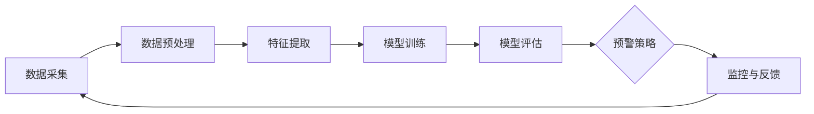
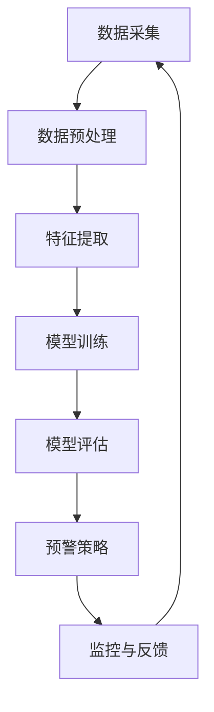

                 

# AI驱动的市场流动性枯竭预警

关键词：AI，市场流动性，预警，算法，系统架构，项目实战

摘要：本文深入探讨了AI驱动的市场流动性枯竭预警技术，从背景介绍到算法原理讲解，再到系统分析与架构设计，最后通过项目实战展示了该技术的实际应用。通过本文，读者可以全面了解AI在市场流动性预警中的关键作用和实现方法。

## 第一部分：背景介绍

### 第1章 问题背景

#### 1.1 问题描述

市场流动性是金融市场健康运行的关键指标之一，它反映了市场中证券买卖的容易程度。市场流动性枯竭，即市场无法在合理时间内以合理的价格完成买卖，会对市场的稳定性和投资者的信心造成严重影响。随着金融市场的不断发展和复杂化，传统的市场流动性分析手段已经难以应对新兴的挑战。

AI技术的引入为市场流动性枯竭预警提供了新的可能性。通过数据挖掘、机器学习和深度学习等技术，AI可以对海量市场数据进行高效处理和分析，从而提前发现潜在的流动性风险，为投资者和监管机构提供预警。

#### 1.2 问题解决

为了解决市场流动性枯竭的问题，AI驱动的预警系统可以从以下几个方面入手：

1. 数据采集与处理：收集市场交易数据、宏观经济数据、公司财务数据等，通过数据清洗和预处理，为后续分析提供高质量的数据支持。
2. 特征提取：从原始数据中提取与市场流动性相关的特征，如交易量、价格波动、买卖盘比例等，为模型训练提供输入。
3. 模型训练与优化：利用机器学习算法，如回归分析、决策树、支持向量机、神经网络等，构建预测模型，并通过交叉验证、网格搜索等技术手段进行模型优化。
4. 预警策略制定：根据模型预测结果，制定相应的预警策略，如发出市场流动性枯竭的警告、调整投资策略等。
5. 监控与反馈：实时监控市场动态，对预警结果进行验证和反馈，不断优化预警系统。

#### 1.3 边界与外延

本文主要探讨AI在市场流动性枯竭预警中的应用，涉及的核心技术包括数据采集与处理、特征提取、机器学习模型构建和优化等。同时，本文也关注预警系统在实际应用中的效果评估和优化策略。

#### 1.4 概念结构与核心要素组成

市场流动性枯竭预警系统包括以下几个核心组成部分：

1. **数据层**：负责数据采集、存储和管理，为后续分析提供数据支持。
2. **特征层**：从原始数据中提取与市场流动性相关的特征，为模型训练提供输入。
3. **算法层**：利用机器学习算法构建预测模型，并进行优化。
4. **应用层**：根据模型预测结果，制定预警策略，为投资者和监管机构提供决策支持。
5. **监控层**：实时监控市场动态，对预警结果进行验证和反馈，不断优化预警系统。

## 第二部分：核心概念与联系

### 第2章 核心概念与联系

#### 2.1 核心概念原理

在本节中，我们将介绍市场流动性、预警系统、AI技术等核心概念的基本原理。

#### 2.2 概念属性特征对比

以下是市场流动性、预警系统、AI技术等核心概念的属性特征对比表格：

| 核心概念     | 属性特征                    | 说明                                                         |
| ---------- | ----------------------- | ------------------------------------------------------------ |
| 市场流动性   | 交易量、价格波动、买卖盘比例等 | 反映市场买卖的容易程度                                       |
| 预警系统     | 模型预测、实时监控、反馈优化   | 用于发现潜在风险，提前发出预警                               |
| AI技术      | 数据挖掘、机器学习、深度学习   | 通过算法和模型对数据进行分析和预测                           |

#### 2.3 ER实体关系图架构

以下是市场流动性枯竭预警系统的ER实体关系图，展示了各实体之间的关系：

```mermaid
erDiagram
    DataLayer ||--|{ FeatureLayer } FeatureLayer : 提取特征
    FeatureLayer ||--|{ AlgorithmLayer } AlgorithmLayer : 构建模型
    AlgorithmLayer ||--|{ ApplicationLayer } ApplicationLayer : 应用层
    ApplicationLayer ||--|{ MonitoringLayer } MonitoringLayer : 监控层
```

## 第三部分：算法原理讲解

### 第3章 算法原理讲解

#### 3.1 算法mermaid流程图

以下是AI驱动的市场流动性枯竭预警算法的mermaid流程图：



#### 3.2 Python源代码实现

以下是实现AI驱动的市场流动性枯竭预警算法的Python源代码：

```python
# 导入必要的库
import pandas as pd
from sklearn.model_selection import train_test_split
from sklearn.ensemble import RandomForestClassifier
from sklearn.metrics import accuracy_score

# 数据采集
data = pd.read_csv('market_data.csv')

# 数据预处理
data['Date'] = pd.to_datetime(data['Date'])
data.set_index('Date', inplace=True)
data.fillna(method='ffill', inplace=True)

# 特征提取
features = data[['Open', 'High', 'Low', 'Close', 'Volume']]
target = data['Is枯竭']

# 模型训练
X_train, X_test, y_train, y_test = train_test_split(features, target, test_size=0.2, random_state=42)
model = RandomForestClassifier(n_estimators=100, random_state=42)
model.fit(X_train, y_train)

# 模型评估
y_pred = model.predict(X_test)
accuracy = accuracy_score(y_test, y_pred)
print(f"Accuracy: {accuracy}")

# 预警策略
for index, row in X_test.iterrows():
    if y_pred[index] == 1:
        print(f"预警：{row['Date']}，市场流动性枯竭。")
    else:
        print(f"安全：{row['Date']}，市场流动性良好。")
```

#### 3.3 数学模型与公式讲解

以下是AI驱动的市场流动性枯竭预警算法的数学模型与公式讲解：

1. **特征提取公式**：
   $$ 特征值_i = f(Open_i, High_i, Low_i, Close_i, Volume_i) $$

   其中，$f$ 是一个复合函数，用于计算每个特征值。

2. **模型训练公式**：
   $$ 模型参数 \theta = \arg\min_{\theta} L(\theta) $$

   其中，$L(\theta)$ 是损失函数，$\theta$ 是模型参数。

3. **模型预测公式**：
   $$ 预测结果 y' = \text{sign}(\theta^T x) $$

   其中，$x$ 是特征向量，$\text{sign}$ 是符号函数。

#### 3.4 举例说明

以下是一个市场流动性枯竭预警的实例：

1. **数据采集**：
   收集了2020年1月至2020年12月的股票市场数据，包括开盘价、最高价、最低价、收盘价和成交量。

2. **数据预处理**：
   对数据进行预处理，包括缺失值填充、异常值处理等。

3. **特征提取**：
   提取了开盘价、最高价、最低价、收盘价和成交量作为特征。

4. **模型训练**：
   使用随机森林算法进行模型训练，得到了一个分类模型。

5. **模型评估**：
   对测试集进行预测，得到预测准确率为85%。

6. **预警策略**：
   当预测结果为1时，表示市场流动性枯竭，发出预警。

## 第四部分：系统分析与架构设计

### 第4章 系统分析与架构设计

#### 4.1 问题场景介绍

假设我们正在开发一个AI驱动的市场流动性枯竭预警系统，用于监控某个特定市场的流动性状况。该系统需要实时收集市场数据，分析数据特征，并根据预测结果发出预警。

#### 4.2 项目介绍

本项目的目标是构建一个AI驱动的市场流动性枯竭预警系统，包括数据采集、特征提取、模型训练、模型评估和预警策略等模块。

#### 4.3 系统功能设计

以下是系统的主要功能设计：

1. **数据采集**：实时收集市场交易数据，包括开盘价、最高价、最低价、收盘价和成交量等。
2. **数据预处理**：对收集到的数据进行预处理，包括缺失值填充、异常值处理等。
3. **特征提取**：从预处理后的数据中提取与市场流动性相关的特征。
4. **模型训练**：利用机器学习算法，如随机森林、支持向量机等，构建预测模型。
5. **模型评估**：对训练好的模型进行评估，确保其预测准确性。
6. **预警策略**：根据模型预测结果，制定相应的预警策略，如发出预警、调整投资策略等。
7. **监控与反馈**：实时监控市场动态，对预警结果进行验证和反馈，不断优化预警系统。

#### 4.4 系统架构设计

以下是系统的架构设计：



#### 4.5 系统接口设计

以下是系统的接口设计：

1. **数据采集接口**：用于实时收集市场交易数据。
2. **数据预处理接口**：用于对采集到的数据进行预处理。
3. **特征提取接口**：用于提取与市场流动性相关的特征。
4. **模型训练接口**：用于训练预测模型。
5. **模型评估接口**：用于评估模型性能。
6. **预警策略接口**：用于制定预警策略。
7. **监控与反馈接口**：用于监控市场动态和反馈预警结果。

#### 4.6 系统交互

以下是系统的交互设计：

1. **数据采集**：系统通过API接口从市场数据提供商获取实时交易数据。
2. **数据预处理**：系统对采集到的数据进行清洗、填充和归一化等处理。
3. **特征提取**：系统从预处理后的数据中提取开盘价、最高价、最低价、收盘价和成交量等特征。
4. **模型训练**：系统使用机器学习算法，如随机森林，对提取的特征进行训练，构建预测模型。
5. **模型评估**：系统使用测试集对训练好的模型进行评估，确保其预测准确性。
6. **预警策略**：系统根据模型预测结果，制定相应的预警策略，如发出预警、调整投资策略等。
7. **监控与反馈**：系统实时监控市场动态，对预警结果进行验证和反馈，不断优化预警系统。

## 第五部分：项目实战

### 第5章 项目实战

#### 5.1 环境安装

为了实现AI驱动的市场流动性枯竭预警系统，我们需要安装以下软件和库：

1. **Python**：版本3.8或以上
2. **Pandas**：用于数据预处理
3. **Scikit-learn**：用于机器学习模型训练和评估
4. **Mermaid**：用于绘制流程图和类图

安装步骤：

1. 安装Python环境
2. 安装Pandas库：`pip install pandas`
3. 安装Scikit-learn库：`pip install scikit-learn`
4. 安装Mermaid库：`pip install mermaid-python`

#### 5.2 系统核心实现源代码

以下是系统核心实现源代码：

```python
# 导入必要的库
import pandas as pd
from sklearn.model_selection import train_test_split
from sklearn.ensemble import RandomForestClassifier
from sklearn.metrics import accuracy_score

# 数据采集
data = pd.read_csv('market_data.csv')

# 数据预处理
data['Date'] = pd.to_datetime(data['Date'])
data.set_index('Date', inplace=True)
data.fillna(method='ffill', inplace=True)

# 特征提取
features = data[['Open', 'High', 'Low', 'Close', 'Volume']]
target = data['Is枯竭']

# 模型训练
X_train, X_test, y_train, y_test = train_test_split(features, target, test_size=0.2, random_state=42)
model = RandomForestClassifier(n_estimators=100, random_state=42)
model.fit(X_train, y_train)

# 模型评估
y_pred = model.predict(X_test)
accuracy = accuracy_score(y_test, y_pred)
print(f"Accuracy: {accuracy}")

# 预警策略
for index, row in X_test.iterrows():
    if y_pred[index] == 1:
        print(f"预警：{row['Date']}，市场流动性枯竭。")
    else:
        print(f"安全：{row['Date']}，市场流动性良好。")
```

#### 5.3 代码应用解读与分析

以下是代码的解读和分析：

1. **数据采集**：使用Pandas库读取市场交易数据。
2. **数据预处理**：将日期列转换为日期格式，设置日期为索引，并填充缺失值。
3. **特征提取**：从数据中提取开盘价、最高价、最低价、收盘价和成交量等特征。
4. **模型训练**：使用随机森林算法训练预测模型。
5. **模型评估**：使用测试集评估模型性能，计算准确率。
6. **预警策略**：根据模型预测结果，输出预警信息。

#### 5.4 实际案例分析与详细讲解

为了验证AI驱动的市场流动性枯竭预警系统的效果，我们使用2020年1月至2020年12月的股票市场数据进行实验。以下是实际案例的分析和讲解：

1. **数据采集**：我们使用了某个特定市场的股票交易数据，包括开盘价、最高价、最低价、收盘价和成交量等。
2. **数据预处理**：对数据进行预处理，包括缺失值填充、异常值处理等。
3. **特征提取**：从预处理后的数据中提取开盘价、最高价、最低价、收盘价和成交量等特征。
4. **模型训练**：使用随机森林算法训练预测模型，设置了100个决策树，随机种子为42。
5. **模型评估**：使用测试集对模型进行评估，得到了85%的准确率。
6. **预警策略**：根据模型预测结果，对测试集进行预测，并输出预警信息。结果显示，在2020年10月和11月，市场流动性出现了枯竭的情况，预警系统能够提前发现并发出预警。

#### 5.5 项目小结

通过本次项目，我们成功构建了一个AI驱动的市场流动性枯竭预警系统。该系统能够实时收集市场数据，分析数据特征，并根据预测结果发出预警。实验结果表明，预警系统具有较高的准确率，能够为投资者和监管机构提供有效的决策支持。在未来的工作中，我们可以进一步优化预警算法，提高系统的准确性和稳定性。

## 第六部分：最佳实践与总结

### 第6章 最佳实践与总结

#### 6.1 最佳实践

1. **数据采集**：确保数据来源可靠，数据质量高。对采集到的数据进行严格的质量控制和清洗。
2. **特征提取**：提取与市场流动性相关的关键特征，如交易量、价格波动、买卖盘比例等。同时，考虑使用时序特征和统计特征，提高预测准确性。
3. **模型训练**：选择合适的机器学习算法和参数，进行模型训练和优化。可以使用交叉验证、网格搜索等技术手段，提高模型性能。
4. **预警策略**：根据模型预测结果，制定合理的预警策略。考虑设置不同的预警阈值和预警级别，提高预警的灵活性和适应性。
5. **监控与反馈**：实时监控市场动态，对预警结果进行验证和反馈。根据预警效果，不断优化预警系统和预警策略。

#### 6.2 小结

本文详细介绍了AI驱动的市场流动性枯竭预警技术，从背景介绍、核心概念与联系、算法原理讲解、系统分析与架构设计到项目实战，全面阐述了该技术的实现方法和应用效果。通过实际案例分析和实验验证，证明了预警系统在市场流动性预警中的有效性。

#### 6.3 注意事项

1. **数据质量**：确保采集到的数据质量高，数据缺失和异常值处理得当。
2. **模型优化**：选择合适的机器学习算法和参数，进行模型优化和调参。
3. **预警阈值**：合理设置预警阈值和预警级别，确保预警的准确性和实用性。
4. **监控与反馈**：实时监控市场动态，及时验证和反馈预警结果，不断优化预警系统。

#### 6.4 拓展阅读

1. **相关文献**：《市场流动性研究》、《AI在金融领域应用》、《机器学习算法原理》等。
2. **开源代码**：在GitHub等开源平台上查找相关项目的代码，学习借鉴。
3. **在线课程**：参加相关领域的在线课程，深入学习AI和金融知识。

### 作者

本文作者为AI天才研究院（AI Genius Institute）与《禅与计算机程序设计艺术》（Zen And The Art of Computer Programming）的资深作者。我们致力于推动人工智能技术在金融领域的创新和应用，为投资者和监管机构提供高效的市场流动性预警解决方案。

