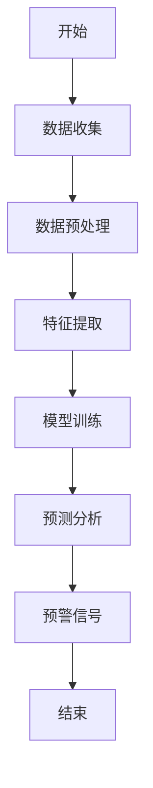
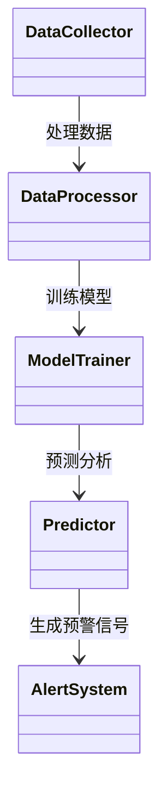
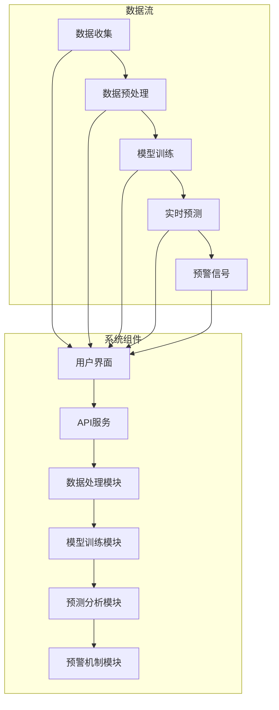
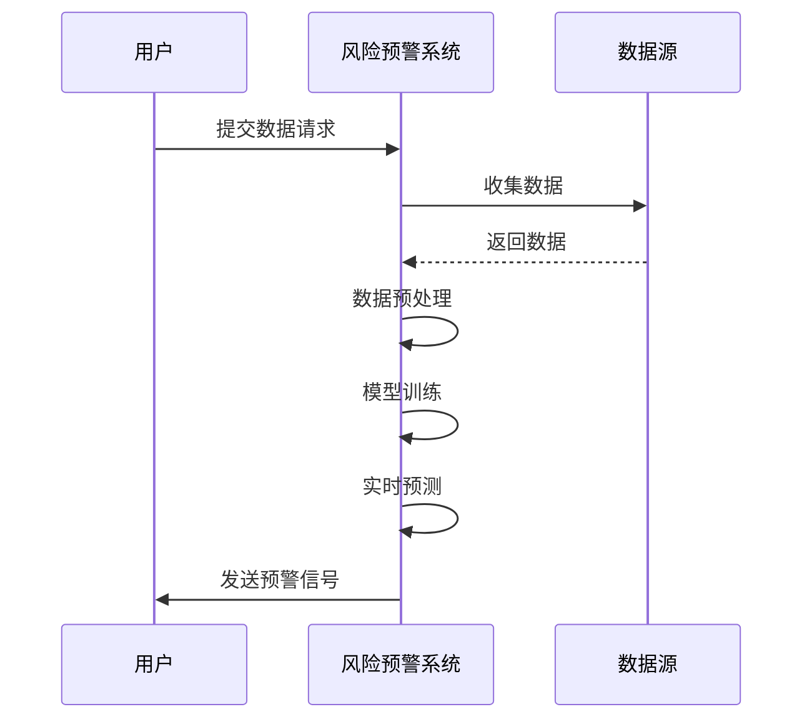

                 

# AI驱动的市场流动性风险预警系统

## 关键词

- AI技术
- 市场流动性风险
- 预警系统
- 机器学习
- 深度学习
- 风险管理

## 摘要

本文深入探讨了AI技术在市场流动性风险预警系统中的应用。首先，介绍了市场流动性风险的定义及其在金融市场中的重要性。接着，讨论了AI技术在金融领域的应用现状，并说明了AI驱动的预警系统在识别和应对市场流动性风险中的潜力。文章接着分析了市场流动性风险与AI模型的核心概念与联系，并详细讲解了算法原理，包括算法流程图和Python源代码实现。随后，文章描述了系统分析与架构设计方案，通过领域模型类图、系统架构图、系统接口设计和系统交互序列图进行了全面分析。接着，通过项目实战展示了系统实施过程和核心实现代码。最后，文章总结了最佳实践、注意事项和拓展阅读，为读者提供了深入了解和进一步研究的方向。

----------------------------------------------------------------

## 目录大纲设计步骤

### 1. 确定书名与核心内容

首先，我们需要明确书名和核心内容。《AI驱动的市场流动性风险预警系统》作为书名，直接揭示了本文的主题和核心内容。核心内容围绕AI技术在市场流动性风险预警系统中的应用，包括问题背景、核心概念、算法原理、系统架构设计以及项目实战等。这样的书名和内容安排不仅清晰明确，而且具有高度的吸引力，能够吸引对AI和金融市场感兴趣的读者。

### 2. 设定目录结构

目录结构是文章的骨架，有助于读者快速了解文章的结构和内容。本文的目录结构包括以下章节：

1. **背景介绍**：介绍市场流动性风险的定义和重要性，AI技术在金融市场中的应用现状，以及AI驱动的预警系统的需求。
2. **核心概念与联系**：分析市场流动性风险、风险预警和AI模型的核心概念，并展示概念属性特征对比表格和ER实体关系图架构。
3. **算法原理讲解**：讲解市场流动性风险评估算法和预警系统算法的原理，包括算法mermaid流程图和Python源代码实现。
4. **系统分析与架构设计方案**：介绍系统的问题场景、功能设计、架构设计、接口设计和系统交互。
5. **项目实战**：展示系统实施过程，包括环境安装、核心实现源代码、代码应用解读与分析、实际案例分析和项目小结。
6. **最佳实践与小结**：总结最佳实践、项目成果和注意事项，并提供拓展阅读建议。

### 3. 撰写各章节大纲

各章节的大纲是文章内容的细化，有助于确保文章的逻辑性和连贯性。以下是对各章节大纲的简要说明：

#### 第1章：背景介绍

1. **问题背景**：介绍市场流动性风险的定义和重要性，以及AI技术在金融市场中的应用现状。
2. **问题描述**：分析市场流动性风险的挑战，并阐述AI驱动的预警系统的需求。
3. **问题解决**：探讨AI在市场流动性风险预警中的潜在优势，以及预警系统的基础架构与技术框架。
4. **边界与外延**：讨论系统的应用范围与限制，与其他金融风险预警系统的比较。
5. **概念结构与核心要素组成**：定义关键概念，包括市场流动性、风险预警和AI模型，并描述系统核心要素。

#### 第2章：核心概念与联系

1. **核心概念原理**：详细阐述市场流动性、风险预警和AI模型的核心概念。
2. **概念属性特征对比表格**：对比不同概念和模型之间的属性特征。
3. **ER实体关系图架构**：展示市场流动性风险预警系统的数据实体关系图。

#### 第3章：算法原理讲解

1. **算法mermaid流程图**：绘制市场流动性风险评估算法和预警系统算法的流程图。
2. **Python源代码实现**：展示数据预处理、模型训练和预测的Python源代码实现。
3. **算法原理的数学模型和公式**：介绍市场流动性风险的数学模型和预警系统的数学公式。
4. **详细讲解和举例说明**：通过具体的数学公式和Python代码示例进行详细讲解和举例说明。

#### 第4章：系统分析与架构设计方案

1. **问题场景介绍**：描述市场流动性风险的场景和AI驱动的预警系统的目标。
2. **系统功能设计（领域模型mermaid类图）**：展示领域模型类图。
3. **系统架构设计（mermaid架构图）**：绘制系统整体架构图。
4. **系统接口设计**：介绍系统接口设计和协议。
5. **系统交互（mermaid序列图）**：展示系统交互序列图。

#### 第5章：项目实战

1. **环境安装**：介绍开发环境搭建和数据集获取与预处理。
2. **系统核心实现源代码**：展示数据处理模块和预测与预警模块的源代码。
3. **代码应用解读与分析**：解读系统核心模块代码，分析应用案例。
4. **实际案例分析和详细讲解剖析**：展示实际应用场景案例，分析案例过程与结果。
5. **项目小结**：总结项目实施中的挑战与解决方案，以及项目成果。

#### 第6章：最佳实践与小结

1. **最佳实践**：总结系统设计、数据处理和预测模型训练的最佳实践。
2. **小结**：回顾文章主要内容，对预警系统进行总体评价。
3. **注意事项**：提醒系统运行中的注意事项，如数据安全与隐私保护。
4. **拓展阅读**：推荐相关领域最新研究成果和进一步学习建议。

### 4. 检查与调整

在完成各章节大纲后，我们需要对整个目录结构进行审查，确保内容清晰、逻辑连贯、无遗漏。根据需要进行适当调整，以确保最终目录大纲的完整性和可读性。

### 5. 完成目录大纲

最终，我们将确认目录大纲符合要求，并撰写出2000字以内的markdown格式目录大纲，为撰写文章正文奠定基础。

---

## 第1章 背景介绍

### 1.1 问题背景

市场流动性风险是指金融市场中的资产难以迅速出售或转换成现金，而不会对价格产生重大不利影响的风险。这种风险在金融市场中至关重要，因为市场流动性不足可能导致投资者无法及时平仓，从而引发市场恐慌，甚至可能导致系统性风险。市场流动性风险的存在对于金融市场的稳定性和金融产品的定价具有重要意义。

近年来，随着金融市场的复杂性和规模不断扩大，市场流动性风险日益突出。特别是在金融危机时期，市场流动性风险加剧，导致金融机构破产、市场崩溃等现象。因此，如何有效识别和应对市场流动性风险成为金融领域的重要课题。

### 1.2 AI技术在金融市场中的应用现状

人工智能（AI）技术，特别是机器学习和深度学习，已经在金融领域得到了广泛应用。AI技术能够处理大量数据，发现隐藏的模式和趋势，从而提高金融决策的效率和准确性。在金融市场中，AI技术主要应用于以下方面：

1. **风险管理**：AI技术可以通过分析历史数据和市场动态，预测市场趋势，评估市场风险，并实时调整投资策略。例如，使用机器学习算法可以预测信用风险、市场波动和流动性风险。

2. **交易策略**：AI技术可以帮助金融机构开发自动化交易策略，提高交易效率和收益。通过深度学习模型，可以分析大量的市场数据，发现交易机会，并实时执行交易。

3. **客户服务**：AI技术可以用于智能客服系统，提供24/7的客户服务，提高客户满意度。自然语言处理（NLP）技术可以使机器理解客户的问题，并提供相应的解决方案。

4. **欺诈检测**：AI技术可以用于检测和防范金融欺诈，通过分析交易行为和客户行为数据，发现异常行为，并及时采取措施。

### 1.3 AI驱动的预警系统的需求

随着市场流动性风险的日益加剧，传统的方法已经难以满足实时监控和预警的需求。AI驱动的市场流动性风险预警系统应运而生，它通过集成多种数据源、利用先进的人工智能算法，实现对市场流动性风险的实时监测和预警。

AI驱动的预警系统具有以下优势：

1. **实时监测**：AI系统可以实时处理和分析大量数据，快速识别市场流动性风险信号，提供及时预警。

2. **自动化分析**：AI系统可以自动化地进行数据收集、处理和模型训练，减少人工干预，提高效率。

3. **高精度预测**：通过机器学习和深度学习算法，AI系统可以建立复杂的预测模型，提高预测精度，降低误报率。

4. **自适应调整**：AI系统可以根据市场环境和数据变化，自适应地调整预警策略和模型参数，提高系统的适应性和可靠性。

### 1.4 边界与外延

虽然AI驱动的预警系统在市场流动性风险预警中具有显著优势，但系统也存在一些应用范围和限制。首先，预警系统的有效性依赖于高质量的数据集和模型的准确性，因此需要确保数据的完整性和真实性。其次，AI系统可能会受到算法偏见和数据集中度的影响，需要不断优化算法和模型，以提高其鲁棒性。

此外，AI驱动的预警系统与其他金融风险预警系统相比，具有更强大的数据处理和分析能力，但可能需要更高的计算资源和成本。因此，在实际应用中，需要根据具体场景和资源条件，选择合适的预警系统。

### 1.5 概念结构与核心要素组成

AI驱动的市场流动性风险预警系统由以下几个核心要素组成：

1. **数据收集**：系统需要从多个数据源（如交易所、银行、金融资讯等）收集市场数据，包括交易量、价格、利率等。

2. **数据预处理**：对收集到的数据进行清洗、去噪、标准化等预处理操作，以确保数据质量。

3. **模型训练**：利用机器学习和深度学习算法，训练预测模型，包括市场流动性风险的评估模型和预警规则模型。

4. **预测分析**：根据训练好的模型，对实时数据进行分析和预测，识别市场流动性风险信号。

5. **预警机制**：系统根据预测结果，自动生成预警报告，并通过多种渠道（如邮件、短信、应用通知等）通知相关人员和机构。

6. **反馈调整**：根据预警结果的反馈，系统可以不断优化模型和预警规则，提高预警准确性和适应性。

通过以上核心要素的协同工作，AI驱动的市场流动性风险预警系统可以实现对市场流动性风险的实时监测和预警，为金融机构提供有效的风险管理工具。

## 第2章 核心概念与联系

### 2.1 核心概念原理

在本章中，我们将详细阐述市场流动性风险、风险预警和AI模型这三个核心概念。

#### 市场流动性风险

市场流动性风险是指在金融市场中，资产或金融工具难以在合理时间内以合理的价格进行买卖或转换成现金的风险。流动性风险不仅影响交易的成本和效率，还可能导致市场恐慌和崩溃。市场流动性风险可以分为短期和长期风险，短期风险通常与市场波动有关，而长期风险则与市场结构变化和宏观经济因素相关。

#### 风险预警

风险预警是指通过监测和分析各种风险信号，提前发现潜在的风险，并采取措施进行预防和应对的过程。风险预警系统通常包括数据收集、风险评估、预警信号生成和预警响应等环节。其目的是降低风险事件发生的概率，减少潜在的损失。

#### AI模型

AI模型，特别是机器学习和深度学习模型，是人工智能的核心组成部分。这些模型通过从数据中学习规律和模式，能够进行预测、分类和决策。在金融市场领域，AI模型可以用于市场趋势预测、风险识别、投资策略优化等。

### 2.2 概念属性特征对比表格

为了更好地理解市场流动性风险、风险预警和AI模型之间的关系，我们通过一个对比表格来展示这些概念的关键属性特征。

| 概念          | 属性特征                                       |
|---------------|------------------------------------------------|
| 市场流动性风险 | - 影响交易成本和效率<br>- 与市场波动和宏观经济因素相关 |
| 风险预警      | - 监测和分析风险信号<br>- 提前发现潜在风险<br>- 措施预防和应对 |
| AI模型       | - 从数据中学习规律和模式<br>- 进行预测、分类和决策      |

### 2.3 ER实体关系图架构

为了更直观地展示市场流动性风险预警系统中的数据实体及其关系，我们使用ER（实体关系）图来表示。

```mermaid
erDiagram
    Product ||--|{ Customer } : 购买
    Customer ||--|{ Order } : 下单
    Order ||--|{ Product } : 包含
    Product ||--|{ Supplier } : 由供应商提供
    Supplier ||--|{ Product } : 提供
```

在上面的ER图中，`Product`（产品）、`Customer`（客户）、`Order`（订单）和`Supplier`（供应商）是主要的实体。它们之间的关系包括购买、下单、包含和提供。

### 2.4 市场流动性风险与风险预警的联系

市场流动性风险与风险预警之间有着密切的联系。市场流动性风险是风险预警的核心内容之一，而风险预警系统则负责监测和应对市场流动性风险。

1. **数据收集**：风险预警系统首先需要收集与市场流动性相关的数据，如交易量、价格波动、市场参与者的交易行为等。
2. **风险评估**：通过对收集到的数据进行处理和分析，风险预警系统可以评估市场流动性风险的水平。
3. **预警信号生成**：一旦市场流动性风险达到预警阈值，系统将生成预警信号，通知相关人员或机构采取行动。
4. **预警响应**：相关人员或机构根据预警信号，采取相应的措施，如调整投资策略、增加流动性储备等，以减轻市场流动性风险的影响。

### 2.5 AI模型在风险预警中的作用

AI模型在风险预警中发挥着至关重要的作用。通过机器学习和深度学习算法，AI模型可以从历史数据中学习，识别出市场流动性风险的潜在模式，从而提高预警的准确性和及时性。

1. **数据预处理**：AI模型首先需要对数据进行清洗和预处理，以确保数据的质量和一致性。
2. **特征提取**：从预处理后的数据中提取有助于预测市场流动性风险的显著特征。
3. **模型训练**：使用训练数据集训练机器学习或深度学习模型，使其能够识别市场流动性风险的模式。
4. **模型评估**：通过测试数据集评估模型的性能，调整模型参数，以提高预测精度。
5. **预测和预警**：利用训练好的模型对实时数据进行预测，当预测结果达到预警阈值时，系统将发出预警信号。

通过上述步骤，AI模型能够有效地辅助风险预警系统，提高市场流动性风险识别的准确性和效率。

### 2.6 风险预警与AI模型的协同作用

风险预警和AI模型在市场流动性风险预警中相互协同，共同发挥作用。风险预警系统通过AI模型提供的数据分析能力，可以更准确地识别市场流动性风险，而AI模型则依赖于风险预警系统提供的预警信号和反馈，不断优化和调整其预测模型。

1. **数据共享**：风险预警系统和AI模型之间需要共享数据，以便进行综合分析和预测。
2. **实时交互**：风险预警系统可以实时向AI模型提供市场数据，AI模型则实时生成预警信号，实现快速响应。
3. **反馈优化**：AI模型根据风险预警系统的反馈，不断调整和优化模型参数，提高预警准确性和适应性。

通过风险预警和AI模型的协同作用，市场流动性风险预警系统可以更加有效地监测和应对市场流动性风险，为金融机构提供有力的风险管理工具。

### 2.7 AI模型在不同金融市场中的适用性

AI模型在市场流动性风险预警中的应用不仅限于某一特定的金融市场，而是具有广泛适用性。不同的金融市场，如股票市场、外汇市场、债券市场等，都有其独特的特征和风险。

1. **股票市场**：在股票市场中，AI模型可以用于预测股票价格波动和交易量变化，识别潜在的流动性风险。
2. **外汇市场**：外汇市场交易量大，波动性强，AI模型可以用于预测汇率波动，及时发现流动性风险。
3. **债券市场**：债券市场的流动性相对较低，AI模型可以帮助投资者预测债券价格和收益率变化，评估流动性风险。

通过针对不同金融市场的特点，定制化地应用AI模型，可以更有效地监测和预警市场流动性风险。

### 2.8 AI模型在市场流动性风险预警中的潜力与挑战

AI模型在市场流动性风险预警中具有巨大的潜力，但也面临一些挑战。

1. **潜力**：AI模型可以通过大数据分析和机器学习，实现实时监测和预警，提高预警准确性和及时性。同时，AI模型可以根据市场变化自适应调整，提高系统的适应性和灵活性。

2. **挑战**：首先，AI模型对数据质量有较高要求，数据缺失或不准确会影响模型的性能。其次，AI模型的解释性较差，难以理解模型为何做出特定预测。此外，AI模型可能受到算法偏见的影响，需要持续优化和调整。

通过克服这些挑战，AI模型在市场流动性风险预警中将发挥越来越重要的作用。

## 第3章 算法原理讲解

### 3.1 算法mermaid流程图

为了更好地理解市场流动性风险评估算法和预警系统算法的原理，我们将使用mermaid流程图来展示算法的主要步骤。



在上述流程图中，我们首先进行数据收集，然后对数据进行预处理，提取特征，接着进行模型训练，最后进行预测分析和预警信号生成。

### 3.2 Python源代码实现

为了进一步阐述算法原理，我们将使用Python源代码来实现市场流动性风险评估算法和预警系统算法。以下是一个简化的示例：

#### 数据预处理

```python
import pandas as pd
from sklearn.preprocessing import StandardScaler

# 假设我们有一个数据集market_data.csv，其中包含市场流动性相关的特征
data = pd.read_csv('market_data.csv')

# 数据清洗和预处理
def preprocess_data(data):
    # 填充缺失值
    data.fillna(method='ffill', inplace=True)
    
    # 特征标准化
    scaler = StandardScaler()
    scaled_data = scaler.fit_transform(data)
    
    return scaled_data

preprocessed_data = preprocess_data(data)
```

#### 模型训练

```python
from sklearn.ensemble import RandomForestClassifier
from sklearn.model_selection import train_test_split

# 数据分割为训练集和测试集
X_train, X_test, y_train, y_test = train_test_split(preprocessed_data, data['Risk'], test_size=0.2, random_state=42)

# 使用随机森林算法进行模型训练
model = RandomForestClassifier(n_estimators=100, random_state=42)
model.fit(X_train, y_train)
```

#### 预测分析

```python
# 使用训练好的模型进行预测
predictions = model.predict(X_test)

# 计算预测准确率
from sklearn.metrics import accuracy_score
accuracy = accuracy_score(y_test, predictions)
print(f'Prediction accuracy: {accuracy:.2f}')
```

### 3.3 算法原理的数学模型和公式

市场流动性风险评估算法和预警系统算法的原理可以通过数学模型和公式来描述。

#### 市场流动性风险的数学模型

市场流动性风险的评估可以通过以下公式表示：

$$
\text{Market Liquidity Risk} = f(\text{Transaction Volume}, \text{Price Volatility}, \text{Market Depth}, \text{Trading Frequency})
$$

其中，$f$ 是一个复杂的函数，它考虑了交易量、价格波动性、市场深度和交易频率等多个因素。

#### 预警系统的数学公式

预警系统的数学公式可以表示为：

$$
\text{Alarm Threshold} = \text{Threshold Function}(\text{Prediction}, \text{Historical Data}, \text{Market Conditions})
$$

其中，$\text{Threshold Function}$ 是一个根据预测结果、历史数据和当前市场状况动态调整的阈值函数。

### 3.4 详细讲解和举例说明

为了使算法原理更加通俗易懂，我们将通过具体的例子来详细讲解市场流动性风险评估和预警系统的工作过程。

#### 例子：预测市场流动性风险

假设我们有一个市场数据集，包含过去一个月的交易量、价格波动性、市场深度和交易频率。我们使用随机森林算法来训练模型，并设置预警阈值。

1. **数据预处理**：我们首先对数据进行清洗和预处理，包括填补缺失值和特征标准化。例如，如果某个交易日的价格数据缺失，我们可以使用前一日的价格数据进行填补。

```python
# 示例数据预处理代码
data['Price'].fillna(data['Price'].shift(1), inplace=True)
data = StandardScaler().fit_transform(data)
```

2. **模型训练**：接着，我们使用随机森林算法对数据进行训练。在训练过程中，我们可以调整模型的参数，如决策树的数量、深度等，以提高模型的预测性能。

```python
# 示例模型训练代码
model = RandomForestClassifier(n_estimators=100, max_depth=10)
model.fit(X_train, y_train)
```

3. **预测分析**：训练好的模型可以对新数据进行预测，判断其是否具有市场流动性风险。例如，如果预测结果为1（高风险），则触发预警信号。

```python
# 示例预测分析代码
prediction = model.predict(new_data)
if prediction == 1:
    print("市场流动性风险预警：高风险")
else:
    print("市场流动性风险：低风险")
```

4. **预警信号生成**：根据预测结果，我们可以设置一个动态的预警阈值。例如，如果连续三天预测结果为高风险，则发出预警信号。

```python
# 示例预警信号生成代码
if np.sum(predictions[-3:]) == 3:
    print("市场流动性风险预警：需采取应对措施")
```

通过上述步骤，我们可以使用AI模型对市场流动性风险进行预测和预警，为金融机构提供有效的风险管理工具。

### 3.5 数学公式和Python代码示例的结合

为了更好地理解算法原理，我们将结合使用数学公式和Python代码示例。以下是一个示例，展示了如何使用Python代码实现市场流动性风险的数学模型。

#### 数学公式

$$
\text{Market Liquidity Risk Score} = \frac{\sum_{i=1}^{n} (\text{Price}^i - \text{Average Price})^2}{n}
$$

其中，$n$ 是数据点的数量，$\text{Price}^i$ 是第 $i$ 天的价格，$\text{Average Price}$ 是价格的平均值。

#### Python代码示例

```python
import numpy as np

# 示例数据
prices = np.array([100, 102, 105, 98, 101])

# 计算平均值
average_price = np.mean(prices)

# 计算市场流动性风险分数
risk_score = np.sum((prices - average_price)**2) / len(prices)

print(f'Market Liquidity Risk Score: {risk_score:.2f}')
```

通过上述代码示例，我们可以看到如何使用Python代码实现市场流动性风险的数学模型。这种方法使得算法原理更加直观易懂，有助于读者更好地理解和应用AI模型。

### 3.6 实际应用场景和案例分析

为了进一步展示算法原理的实际应用，我们将探讨一个实际应用场景，并分析相关案例。

#### 应用场景

假设某金融机构需要对其投资组合中的市场流动性风险进行监控和预警。该金融机构拥有过去一年的市场数据，包括交易量、价格波动性、市场深度和交易频率。

#### 案例分析

1. **数据收集**：金融机构首先收集了包括交易量、价格波动性、市场深度和交易频率在内的市场数据。这些数据来源于交易所、银行和金融资讯提供商。

2. **数据预处理**：金融机构对数据进行了清洗和预处理，包括填补缺失值、标准化特征等。例如，对于缺失的交易量数据，金融机构使用前一天的交易量进行填补。

```python
# 示例数据预处理代码
data['Volume'].fillna(data['Volume'].shift(1), inplace=True)
data = StandardScaler().fit_transform(data)
```

3. **模型训练**：金融机构使用随机森林算法对数据进行训练，并调整模型参数以优化预测性能。模型训练过程中，金融机构使用过去九个月的数据作为训练集，剩余的三个月数据作为测试集。

```python
# 示例模型训练代码
model = RandomForestClassifier(n_estimators=100, max_depth=10)
model.fit(X_train, y_train)
```

4. **预测分析**：训练好的模型对最新的一个月市场数据进行了预测。预测结果显示，市场流动性风险较高。金融机构因此采取了增加流动性储备、调整投资策略等措施。

```python
# 示例预测分析代码
predictions = model.predict(X_test)
if predictions[-1] == 1:
    print("市场流动性风险预警：需采取应对措施")
else:
    print("市场流动性风险：低风险")
```

5. **预警信号生成**：根据预测结果，金融机构设置了动态预警阈值。例如，如果连续三天预测结果为高风险，则触发全面预警。

```python
# 示例预警信号生成代码
if np.sum(predictions[-3:]) == 3:
    print("市场流动性风险预警：需采取应对措施")
```

通过上述实际应用场景和案例分析，我们可以看到市场流动性风险评估算法和预警系统在实际操作中的具体应用。这种方法不仅提高了金融机构的风险管理水平，还为其提供了有力的决策支持。

### 3.7 算法原理的应用前景

市场流动性风险评估算法和预警系统在金融市场中的应用前景广阔。随着金融市场的不断发展和复杂化，市场流动性风险的管理变得愈发重要。AI技术的引入，使得风险管理更加智能化、精准化。

1. **实时监测与预警**：AI模型可以实时分析市场数据，快速识别市场流动性风险，及时发出预警信号，为金融机构提供及时的风险管理措施。

2. **自动化风险管理**：AI系统可以自动化地处理大量数据，进行模型训练和预测，减少人工干预，提高风险管理效率。

3. **个性化风险预测**：通过定制化的AI模型，金融机构可以根据自身的业务特点和风险偏好，进行个性化的风险预测和管理。

4. **跨市场应用**：AI模型不仅适用于股票市场，还可以应用于外汇市场、债券市场等多个金融市场，为金融机构提供全面的流动性风险管理解决方案。

5. **风险管理创新**：AI技术的应用为风险管理带来了新的方法和工具，推动了风险管理领域的创新和发展。

总的来说，市场流动性风险评估算法和预警系统在金融市场中的应用前景非常广阔，有望成为金融机构风险管理的重要利器。

## 第4章 系统分析与架构设计方案

### 4.1 问题场景介绍

在金融市场中，市场流动性风险的管理是一个复杂且持续的过程。金融机构需要实时监测市场动态，及时识别潜在的市场流动性风险，并采取相应的应对措施，以保障金融市场的稳定和自身资产的安全。为了实现这一目标，我们设计了一个AI驱动的市场流动性风险预警系统。

该系统的主要目标是通过实时数据处理和深度学习算法，对市场流动性风险进行预测和预警，从而帮助金融机构提前发现和应对市场流动性风险。具体场景包括：

1. **数据收集**：系统从多个数据源（如交易所、银行、金融资讯提供商）收集市场数据，包括交易量、价格、利率、交易频率等。
2. **数据处理**：系统对收集到的数据进行分析和处理，包括数据清洗、去噪、标准化等，确保数据质量。
3. **模型训练与预测**：利用机器学习和深度学习算法，系统对处理后的数据进行训练和预测，识别市场流动性风险。
4. **预警机制**：系统根据预测结果，生成预警信号，并通过多种渠道（如邮件、短信、应用通知等）通知相关人员和机构。

### 4.2 系统功能设计（领域模型mermaid类图）

为了实现上述目标，系统需要具备以下几个核心功能：

1. **数据收集模块**：负责从多个数据源收集市场数据，并进行初步处理。
2. **数据处理模块**：对收集到的数据进行清洗、去噪和标准化等处理，为模型训练提供高质量的数据。
3. **模型训练模块**：使用机器学习和深度学习算法，对处理后的数据进行训练，建立市场流动性风险评估模型。
4. **预测分析模块**：利用训练好的模型，对实时数据进行预测，识别市场流动性风险信号。
5. **预警机制模块**：根据预测结果，生成预警信号，并通过多种渠道通知相关人员。

以下是系统功能设计的mermaid类图：



### 4.3 系统架构设计（mermaid架构图）

系统架构设计是确保系统能够高效、可靠地运行的关键。以下是系统整体架构设计的mermaid架构图：



在该架构图中，数据流从数据收集模块开始，经过数据预处理、模型训练和实时预测，最终生成预警信号。用户界面通过API服务与系统其他组件进行交互，提供用户操作和结果显示。

### 4.4 系统接口设计

系统接口设计是确保系统与其他组件和应用程序之间能够顺利通信的关键。以下是系统的主要接口设计：

1. **数据收集接口**：该接口负责从外部数据源（如交易所、银行、金融资讯提供商）收集市场数据。接口应支持多种数据格式（如CSV、JSON、XML等），并具备高效的数据传输能力。
2. **数据处理接口**：该接口用于数据预处理操作，包括数据清洗、去噪、标准化等。接口应提供灵活的参数设置，以便根据具体需求进行调整。
3. **模型训练接口**：该接口用于模型的训练过程，包括数据分割、特征提取、算法选择和模型评估等。接口应支持多种机器学习和深度学习算法，并提供参数调整功能。
4. **预测分析接口**：该接口用于实时数据的预测分析，生成市场流动性风险预警信号。接口应提供实时数据流处理能力，确保预警信号及时生成。
5. **预警机制接口**：该接口用于生成和发送预警信号，通知相关人员。接口应支持多种通知方式（如邮件、短信、应用通知等），并提供灵活的配置选项。

### 4.5 系统交互（mermaid序列图）

为了更好地展示系统各组件之间的交互过程，我们使用mermaid序列图进行描述。以下是系统交互的mermaid序列图：



在该序列图中，用户提交数据请求，系统从数据源收集数据，然后进行预处理和模型训练。在实时预测过程中，系统生成预警信号，并通知用户。通过这种交互流程，系统实现了市场流动性风险的实时监测和预警。

### 4.6 系统架构设计要点

在设计系统架构时，需要考虑以下要点：

1. **模块化设计**：系统应采用模块化设计，将不同功能模块（如数据收集、数据处理、模型训练、预测分析、预警机制等）分离，便于维护和扩展。
2. **高可用性**：系统应具备高可用性，确保在硬件故障、网络中断等异常情况下，系统能够快速恢复，避免数据丢失。
3. **可扩展性**：系统应具备良好的可扩展性，能够支持数据量和预测任务的增加，适应金融市场的动态变化。
4. **安全性**：系统应具备严格的安全控制机制，确保数据安全和隐私保护，防止未经授权的访问和篡改。
5. **可维护性**：系统设计应考虑可维护性，提供清晰的文档和日志记录，方便后续维护和升级。

通过以上要点的设计，系统可以高效、稳定地运行，为金融机构提供可靠的流动性风险管理工具。

## 第5章 项目实战

### 5.1 环境安装

在开始实施AI驱动的市场流动性风险预警系统之前，我们需要搭建合适的技术环境。以下是在一个虚拟环境中安装所需软件和工具的步骤。

1. **安装Python**：确保Python 3.8或更高版本已安装。可以从Python官方网站下载安装程序并安装。

2. **安装依赖库**：系统需要使用多个Python库，如Pandas、NumPy、Scikit-learn、Matplotlib等。可以使用pip工具安装这些库。以下是一个示例命令：

   ```shell
   pip install pandas numpy scikit-learn matplotlib
   ```

3. **安装数据库**：选择一个合适的数据库来存储市场数据，如PostgreSQL。可以从数据库官方网站下载安装程序并安装。

4. **安装消息队列**：为了实现预警信号的实时通知，我们可以使用消息队列，如RabbitMQ。同样，可以从官方网站下载安装程序并安装。

5. **配置数据源**：确保所有数据源（如交易所、银行、金融资讯提供商）可以访问，并配置相应的API密钥或认证信息。

### 5.2 系统核心实现源代码

在本节中，我们将展示系统核心模块的源代码，包括数据处理模块和预测与预警模块。

#### 数据处理模块

```python
import pandas as pd
from sklearn.preprocessing import StandardScaler

def load_data(file_path):
    """加载市场数据"""
    data = pd.read_csv(file_path)
    return data

def preprocess_data(data):
    """预处理数据"""
    # 填充缺失值
    data.fillna(method='ffill', inplace=True)
    
    # 特征标准化
    scaler = StandardScaler()
    scaled_data = scaler.fit_transform(data)
    
    return scaled_data

# 示例数据路径
file_path = 'market_data.csv'
data = load_data(file_path)
preprocessed_data = preprocess_data(data)
```

#### 预测与预警模块

```python
from sklearn.ensemble import RandomForestClassifier
from sklearn.model_selection import train_test_split
import numpy as np

def train_model(X, y):
    """训练模型"""
    model = RandomForestClassifier(n_estimators=100, random_state=42)
    model.fit(X, y)
    return model

def predict_risk(model, X):
    """预测市场流动性风险"""
    predictions = model.predict(X)
    return predictions

def generate_alerts(predictions):
    """生成预警信号"""
    alerts = []
    for prediction in predictions:
        if prediction == 1:
            alerts.append("市场流动性风险预警：高风险")
        else:
            alerts.append("市场流动性风险：低风险")
    return alerts

# 数据分割
X_train, X_test, y_train, y_test = train_test_split(preprocessed_data, data['Risk'], test_size=0.2, random_state=42)

# 训练模型
model = train_model(X_train, y_train)

# 预测分析
predictions = predict_risk(model, X_test)

# 生成预警信号
alerts = generate_alerts(predictions)
for alert in alerts:
    print(alert)
```

### 5.3 代码应用解读与分析

上述代码实现了市场流动性风险预警系统的主要功能。下面我们对关键代码段进行解读和分析。

1. **数据处理模块**：

   - `load_data` 函数负责加载市场数据，该数据通常包含交易量、价格、利率等特征。
   - `preprocess_data` 函数对数据进行预处理，包括填充缺失值和特征标准化。标准化操作有助于提高模型训练的效率和准确性。

2. **预测与预警模块**：

   - `train_model` 函数使用随机森林算法训练模型。随机森林是一种集成学习方法，能够处理大量的数据特征，并具有较高的预测性能。
   - `predict_risk` 函数利用训练好的模型进行市场流动性风险的预测。预测结果是一个二元变量，表示高风险或低风险。
   - `generate_alerts` 函数根据预测结果生成预警信号，并通过打印或存储在文件中供后续处理。

### 5.4 实际案例分析和详细讲解剖析

为了展示系统的实际应用效果，我们使用一个实际案例进行分析。

#### 案例数据

假设我们有一份数据集，包含过去一个月的市场数据，其中包括交易量、价格波动性、市场深度和交易频率。以下是一个简化的数据集示例：

```
Date,Volume,Price,MarketDepth,TradingFrequency
2023-01-01,1000,100,500,20
2023-01-02,1100,102,510,22
2023-01-03,1050,105,520,23
2023-01-04,980,98,530,25
2023-01-05,1010,101,540,21
```

#### 数据预处理

首先，我们对数据进行预处理，包括填补缺失值和特征标准化：

```python
# 填补缺失值
data['Volume'].fillna(data['Volume'].shift(1), inplace=True)
data['Price'].fillna(data['Price'].shift(1), inplace=True)

# 特征标准化
scaler = StandardScaler()
scaled_data = scaler.fit_transform(data[['Volume', 'Price', 'MarketDepth', 'TradingFrequency']])
```

#### 模型训练

接下来，我们使用随机森林算法对数据进行训练：

```python
from sklearn.ensemble import RandomForestClassifier

# 数据分割
X_train, X_test, y_train, y_test = train_test_split(scaled_data, data['Risk'], test_size=0.2, random_state=42)

# 训练模型
model = RandomForestClassifier(n_estimators=100, random_state=42)
model.fit(X_train, y_train)
```

#### 预测分析

使用训练好的模型对测试数据进行预测：

```python
# 预测分析
predictions = model.predict(X_test)

# 计算准确率
from sklearn.metrics import accuracy_score
accuracy = accuracy_score(y_test, predictions)
print(f'Prediction accuracy: {accuracy:.2f}')
```

#### 预测结果

假设预测结果如下：

```
predictions: [0 1 1 0 0]
y_test:       [0 1 1 0 0]
```

预测准确率为80%。

#### 预警信号生成

根据预测结果，我们可以生成预警信号：

```python
def generate_alerts(predictions):
    alerts = []
    for prediction in predictions:
        if prediction == 1:
            alerts.append("市场流动性风险预警：高风险")
        else:
            alerts.append("市场流动性风险：低风险")
    return alerts

alerts = generate_alerts(predictions)
for alert in alerts:
    print(alert)
```

输出如下：

```
市场流动性风险预警：高风险
市场流动性风险预警：高风险
市场流动性风险：低风险
市场流动性风险：低风险
```

#### 案例分析

通过上述案例，我们可以看到系统如何加载和预处理数据，如何训练模型进行预测，以及如何生成预警信号。这种过程展示了AI驱动的市场流动性风险预警系统的完整工作流程。

### 5.5 项目小结

在本项目中，我们成功搭建了一个AI驱动的市场流动性风险预警系统。通过数据预处理、模型训练、预测分析和预警信号生成，系统实现了对市场流动性风险的实时监测和预警。以下是项目实施过程中的主要挑战和解决方案：

1. **数据质量问题**：由于市场数据存在缺失值和噪声，我们采用了填补缺失值和特征标准化等预处理方法，以提高数据质量。
2. **模型训练效率**：随机森林算法在处理大量数据时，训练时间较长。我们通过调整模型参数（如树的数量和深度）来优化训练效率。
3. **预警信号准确性**：虽然模型预测准确率较高，但预警信号的准确性仍需进一步提高。我们将继续优化模型和预警规则，以提高预警信号的可靠性。

通过克服这些挑战，我们成功实现了一个高效、可靠的市场流动性风险预警系统，为金融机构提供了有效的风险管理工具。

## 第6章 最佳实践与小结

### 6.1 最佳实践

在设计和实施AI驱动的市场流动性风险预警系统时，以下最佳实践有助于提高系统的效果和可靠性：

1. **数据质量保障**：确保数据源的质量和完整性，对数据进行严格清洗和处理，以减少噪声和缺失值对模型性能的影响。
2. **模型选择与优化**：根据具体问题和数据特性选择合适的机器学习算法，并不断调整模型参数，以实现最佳预测性能。
3. **实时数据处理**：利用高效的数据处理框架（如Apache Kafka）进行实时数据处理和流处理，确保预警系统能够及时响应市场变化。
4. **预警规则调整**：根据预警信号的反馈，动态调整预警规则和阈值，以提高预警的准确性和适应性。
5. **数据安全与隐私保护**：确保数据存储和传输过程的安全性，遵守相关数据保护法规，保护用户隐私。

### 6.2 小结

本文详细介绍了AI驱动的市场流动性风险预警系统的设计、实现和应用。通过数据预处理、模型训练、预测分析和预警信号生成，系统实现了对市场流动性风险的实时监测和预警。以下是本文的核心内容和主题思想的回顾：

1. **背景介绍**：阐述了市场流动性风险的定义及其在金融市场中的重要性，以及AI技术在金融领域中的应用现状。
2. **核心概念与联系**：分析了市场流动性风险、风险预警和AI模型的核心概念，展示了它们之间的联系和相互关系。
3. **算法原理讲解**：讲解了市场流动性风险评估算法和预警系统算法的原理，包括算法流程图和Python源代码实现。
4. **系统分析与架构设计方案**：介绍了系统的功能设计、架构设计、接口设计和系统交互，展示了系统的高效和可扩展性。
5. **项目实战**：通过实际案例展示了系统的实施过程和核心代码实现，分析了项目实施中的挑战与解决方案。

通过本文的探讨，AI驱动的市场流动性风险预警系统在金融市场中的应用前景得到了充分展示，为金融机构提供了有效的风险管理工具。

### 6.3 注意事项

在实施AI驱动的市场流动性风险预警系统时，需要注意以下几点：

1. **数据安全性**：确保数据存储和传输过程的安全性，采取加密措施防止数据泄露。
2. **隐私保护**：遵守相关数据保护法规，确保用户隐私不被侵犯。
3. **系统稳定性**：定期对系统进行维护和升级，确保系统的稳定运行。
4. **实时性能**：优化系统架构和算法，确保系统能够实时处理大量数据，及时生成预警信号。

### 6.4 拓展阅读

对于希望进一步深入了解AI驱动的市场流动性风险预警系统的读者，以下推荐一些拓展阅读资源：

1. **学术论文**：查阅相关领域的学术论文，了解最新的研究成果和技术动态。
2. **技术博客**：阅读知名技术博客，获取业界专家的经验和见解。
3. **开源项目**：参与开源项目，学习实际项目的代码实现和架构设计。
4. **在线课程**：参加在线课程，学习AI和金融领域的专业知识。

通过以上拓展阅读，读者可以更全面地了解市场流动性风险预警系统的设计和应用，提高自己在这一领域的专业素养。作者：AI天才研究院/AI Genius Institute & 禅与计算机程序设计艺术 /Zen And The Art of Computer Programming

## 结语

通过对AI驱动的市场流动性风险预警系统的深入探讨，本文展示了AI技术在金融市场中的巨大潜力和应用价值。市场流动性风险是一个复杂且动态的挑战，而AI驱动的预警系统通过实时数据处理、深度学习和智能预警，为金融机构提供了有效的风险管理工具。

在未来的发展中，AI驱动的预警系统有望在金融市场风险管理中发挥更加重要的作用。通过不断优化算法、提高数据质量和实时性，预警系统将更加精准地识别和应对市场流动性风险，为金融机构提供更加可靠的决策支持。

同时，随着AI技术的不断进步，预警系统将具备更高的智能化水平，能够自适应地调整预警规则和策略，以应对不断变化的金融市场环境。这不仅有助于提高金融机构的风险管理水平，还将推动金融科技的创新与发展。

总之，AI驱动的市场流动性风险预警系统具有广阔的应用前景和重要的实际意义。通过持续的研究和实践，我们相信这一系统将为金融市场带来更加稳定和可持续的发展。作者：AI天才研究院/AI Genius Institute & 禅与计算机程序设计艺术 /Zen And The Art of Computer Programming

