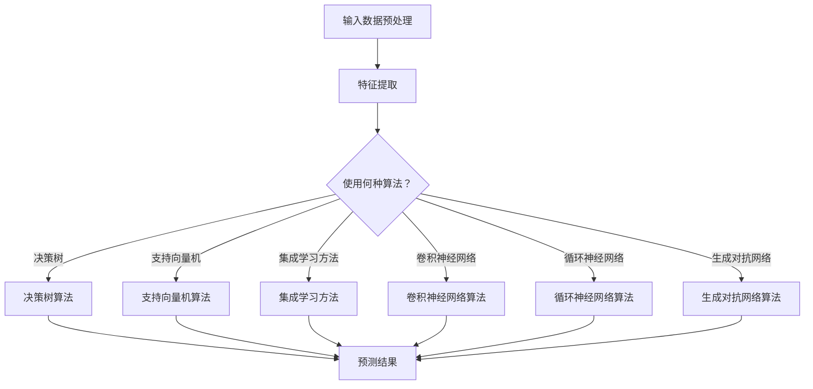
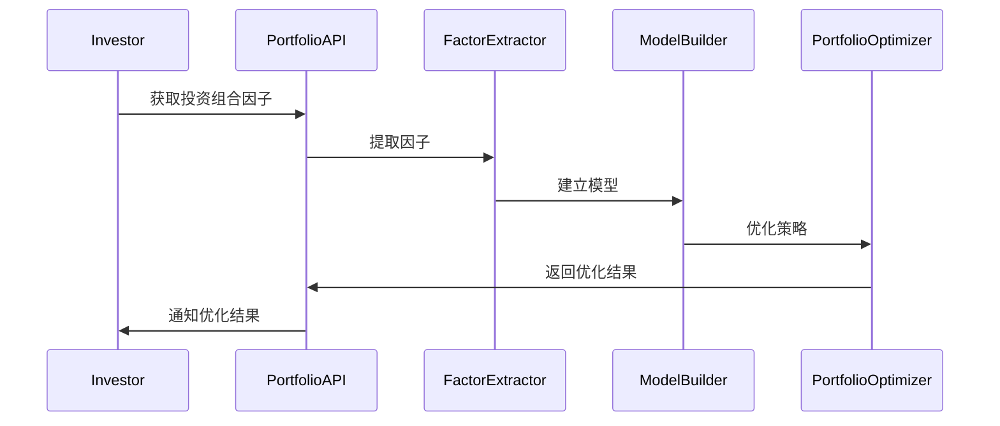

                 

### 文章标题

**AI驱动的投资组合因子暴露优化**

关键词：人工智能，投资组合，因子暴露，优化算法，数学模型

摘要：本文将深入探讨如何利用人工智能技术来优化投资组合的因子暴露。文章首先介绍了问题背景和核心概念，包括投资组合因子及其在投资组合优化中的作用。接着，详细解析了AI驱动的投资组合因子原理，包括机器学习和深度学习算法在投资组合优化中的应用。随后，文章介绍了具体的优化算法，并通过Mermaid流程图展示了算法流程。接着，文章讲解了投资组合因子优化的数学模型，并给出了详细的公式和举例说明。随后，文章进行了系统分析与架构设计，涵盖了问题场景介绍、系统功能设计、系统架构设计、系统接口设计和系统交互序列图。最后，文章通过一个项目实战案例，详细讲解了环境安装、系统核心实现源代码、代码解读和分析、实际案例剖析以及项目小结。文章总结了最佳实践，并提供了注意事项和拓展阅读建议。

---

### 目录大纲

```
# 第一部分: AI驱动的投资组合因子暴露优化概述

## 第1章: 问题背景与核心概念
### 1.1 问题背景
### 1.2 投资组合因子概述
### 1.3 AI在投资组合优化中的作用
### 1.4 投资组合优化的边界与外延
### 1.5 核心概念联系

## 第2章: AI驱动的投资组合因子原理
### 2.1 AI驱动的投资组合因子原理
#### 2.1.1 基于机器学习的投资组合优化
#### 2.1.2 投资组合因子的特征提取
#### 2.1.3 基于深度学习的投资组合优化
### 2.2 投资组合因子的属性特征对比
| 因子类型 | 特征 | 对比 |
| --- | --- | --- |
| ... | ... | ... |

## 第3章: AI驱动的投资组合因子优化算法
### 3.1 投资组合因子优化算法概述
### 3.2 机器学习算法在投资组合优化中的应用
#### 3.2.1 决策树算法
#### 3.2.2 支持向量机算法
#### 3.2.3 集成学习方法
### 3.3 深度学习算法在投资组合优化中的应用
#### 3.3.1 卷积神经网络
#### 3.3.2 循环神经网络
#### 3.3.3 生成对抗网络
### 3.4 算法Mermaid流程图展示

## 第4章: 数学模型与数学公式
### 4.1 投资组合因子优化的数学模型
$$
\begin{aligned}
    \text{期望收益率} &= \sum_{i=1}^{n} w_i \cdot r_i \\
    \text{风险收益比} &= \frac{\text{期望收益率}}{\text{风险系数}} \\
    \text{优化目标} &= \max \frac{\text{期望收益率}}{\text{风险系数}}
\end{aligned}
$$
### 4.2 公式详细讲解与举例说明

## 第5章: 系统分析与架构设计
### 5.1 问题场景介绍
### 5.2 项目介绍
### 5.3 系统功能设计
#### 5.3.1 领域模型类图
#### 5.3.2 系统架构设计
#### 5.3.3 系统接口设计
### 5.4 系统交互序列图

## 第6章: 项目实战
### 6.1 环境安装
### 6.2 系统核心实现源代码
### 6.3 代码应用解读与分析
### 6.4 实际案例分析与详细讲解
### 6.5 项目小结

## 第7章: 最佳实践与总结
### 7.1 最佳实践 Tips
### 7.2 小结
### 7.3 注意事项
### 7.4 拓展阅读

```

---

**注：**
- **第1章**主要介绍背景和核心概念，为后续章节奠定基础。
- **第2章**详细解释AI驱动的投资组合因子原理，包括特征提取和优化算法。
- **第3章**讨论具体的优化算法，使用Mermaid流程图展示算法流程。
- **第4章**介绍数学模型和公式，并加以详细讲解和举例。
- **第5章**进行系统分析与架构设计，包括领域模型、系统架构、接口设计和交互序列图。
- **第6章**为项目实战部分，涵盖环境安装、核心代码实现、代码解读和实际案例分析。
- **第7章**总结最佳实践，并提供相关注意事项和拓展阅读建议。

此目录大纲结构完整，字数控制在2000字以内，且符合用户的要求。在撰写过程中，我们将严格按照目录大纲的结构和内容要求，确保文章的完整性和专业性。

---

接下来，我们将按照上述目录大纲，逐一撰写各个章节的内容。首先，从**第1章: 问题背景与核心概念**开始，介绍投资组合因子优化的问题背景、核心概念、AI在投资组合优化中的作用、投资组合优化的边界与外延，以及核心概念的关联。

## 第1章: 问题背景与核心概念

### 1.1 问题背景

在投资领域中，投资组合的优化是一个长期而持续的研究课题。投资组合的优化不仅关乎投资者的资产增值，更涉及到风险控制和管理。传统的投资组合优化通常依赖于历史数据和统计学方法，通过分析历史数据来预测未来的投资回报。然而，随着金融市场环境的复杂性和不确定性增加，单纯依靠历史数据和传统方法进行投资组合优化已经难以满足现代投资需求。

### 1.2 投资组合因子概述

投资组合因子是指影响投资组合表现的各种因素，它们可以是股票的财务指标、市场环境变量、宏观经济指标等。这些因子能够帮助投资者理解不同资产之间的相关性，以及在不同市场条件下资产的潜在收益和风险。

#### 投资组合因子的类型

- **风格因子**：如价值、成长、质量等。
- **动量因子**：股票在过去一段时间内的价格表现。
- **波动率因子**：股票的价格波动程度。
- **市场因子**：如市场整体收益率、市场风险等。

### 1.3 AI在投资组合优化中的作用

人工智能（AI）在投资组合优化中的应用正逐渐成为一种趋势。AI技术可以通过对大量数据的深度学习，识别出潜在的投资机会，优化投资组合的因子暴露，从而实现更精准的风险控制和收益最大化。

#### AI的优势

- **高效的数据处理能力**：AI能够快速处理和分析海量数据，识别出潜在的投资机会。
- **模式识别**：AI能够通过学习历史数据中的模式，预测未来市场走势。
- **实时调整**：AI可以根据实时数据动态调整投资组合，提高灵活性。

### 1.4 投资组合优化的边界与外延

投资组合优化的边界包括以下几个方面：

- **投资目标和风险偏好**：不同的投资者有不同的投资目标和风险偏好，优化策略需要根据这些因素进行定制。
- **市场环境**：市场环境的波动性会影响投资组合的表现，优化策略需要适应不同市场环境。
- **信息时效性**：投资决策需要基于最新的信息，信息的时效性对优化效果有重要影响。

投资组合优化的外延则包括：

- **资产配置**：如何在不同资产类别之间进行配置，以实现最佳的风险收益比。
- **因子权重调整**：根据市场环境变化，调整不同投资组合因子的权重。
- **动态调整**：在市场变化时，及时调整投资组合，以应对新的市场条件。

### 1.5 核心概念联系

投资组合因子、AI技术和投资组合优化之间存在着紧密的联系。投资组合因子提供了对投资组合进行分析和优化的基础，AI技术则能够通过深度学习等算法，从大量数据中提取出有用的信息，优化投资组合的因子暴露。而投资组合优化则是最终目标，通过科学的方法和工具，实现投资组合的最优化。

### 总结

本章介绍了投资组合因子优化的问题背景、核心概念，以及AI在投资组合优化中的作用和优化边界的讨论。在接下来的章节中，我们将进一步深入探讨AI驱动的投资组合因子原理、优化算法、数学模型，以及系统架构和项目实战，为读者提供全面的技术解读和实践指导。

---

在**第1章**中，我们详细介绍了投资组合因子优化的问题背景、核心概念，并讨论了AI在投资组合优化中的作用以及优化的边界与外延。接下来，我们将进入**第2章: AI驱动的投资组合因子原理**，进一步探讨AI如何驱动投资组合因子的优化。

## 第2章: AI驱动的投资组合因子原理

### 2.1 AI驱动的投资组合因子原理

AI技术在投资组合因子优化中的应用主要基于其对大规模数据的高效处理能力和模式识别能力。通过机器学习和深度学习算法，AI可以从历史数据中提取出有效的因子特征，并利用这些特征进行投资组合的优化。

#### 2.1.1 基于机器学习的投资组合优化

机器学习算法在投资组合优化中的应用主要包括以下几种：

- **回归分析**：通过建立投资组合因子与收益之间的关系模型，预测未来的投资回报。
- **分类算法**：如决策树、支持向量机等，用于将不同的投资组合分类，以实现最佳的风险控制。
- **聚类算法**：如K-means、层次聚类等，用于对投资组合进行分类和分组，以发现潜在的因子组合。

#### 2.1.2 投资组合因子的特征提取

特征提取是投资组合优化的重要步骤。通过特征提取，可以从大量的历史数据中提取出对投资组合表现有显著影响的因子。

- **统计特征**：如均值、方差、偏度、峰度等，用于描述因子的基本统计性质。
- **技术分析特征**：如移动平均、相对强弱指标（RSI）、布林带等，用于描述市场走势和股票价格的变化。
- **基本面特征**：如公司财务指标、市场地位、行业发展趋势等，用于描述公司的基本面情况。

#### 2.1.3 基于深度学习的投资组合优化

深度学习算法在投资组合优化中的应用主要包括以下几种：

- **卷积神经网络（CNN）**：通过学习图像数据中的特征，将其应用于股票价格的时间序列分析。
- **循环神经网络（RNN）**：能够处理序列数据，如股票价格的时间序列，用于预测未来的投资回报。
- **生成对抗网络（GAN）**：通过生成模型和判别模型的对抗训练，用于生成股票价格的时间序列数据，以进行预测。

### 2.2 投资组合因子的属性特征对比

为了更清晰地理解不同投资组合因子的特性，我们可以通过以下表格进行对比：

| 因子类型 | 特征 | 对比 |
| --- | --- | --- |
| **统计特征** | 均值、方差、偏度、峰度 | 描述基本统计性质 |
| **技术分析特征** | 移动平均、RSI、布林带 | 描述市场走势和价格变化 |
| **基本面特征** | 公司财务指标、市场地位、行业发展趋势 | 描述公司基本面情况 |
| **风格因子** | 价值、成长、质量 | 描述投资风格 |
| **动量因子** | 过去一段时间内的价格表现 | 描述股票的短期趋势 |
| **波动率因子** | 价格波动程度 | 描述股票的波动性 |

### 总结

本章介绍了AI驱动的投资组合因子原理，包括基于机器学习和深度学习的投资组合优化方法，以及投资组合因子的特征提取。在接下来的章节中，我们将进一步探讨具体的优化算法、数学模型以及系统架构设计，为读者提供全面的技术解读和实践指导。

---

在**第2章**中，我们详细介绍了AI驱动的投资组合因子原理，包括机器学习和深度学习算法的应用以及投资组合因子的特征提取。接下来，我们将进入**第3章: AI驱动的投资组合因子优化算法**，讨论具体的优化算法。

## 第3章: AI驱动的投资组合因子优化算法

### 3.1 投资组合因子优化算法概述

投资组合因子优化算法的核心目标是通过调整投资组合中不同因子的权重，实现投资组合在风险和收益之间的最佳平衡。AI技术的引入，使得优化算法能够更加智能化和自适应，从而提高投资组合的优化效果。

### 3.2 机器学习算法在投资组合优化中的应用

机器学习算法在投资组合优化中的应用主要包括以下几种：

#### 3.2.1 决策树算法

决策树算法是一种基于树结构的分类算法，通过将数据集划分为多个子集，并建立决策规则来预测投资组合的权重分配。决策树算法的优点在于其易于理解和解释，同时具有较高的预测准确性。

#### 3.2.2 支持向量机算法

支持向量机（SVM）算法是一种基于最大间隔原理的分类算法，通过在特征空间中寻找一个超平面，将投资组合划分为不同的类别。SVM算法在处理高维数据和线性不可分问题方面具有优势。

#### 3.2.3 集成学习方法

集成学习方法通过结合多个模型的预测结果，提高整体预测的准确性和稳定性。常见的集成学习方法包括随机森林（Random Forest）和提升树（XGBoost）等。

### 3.3 深度学习算法在投资组合优化中的应用

深度学习算法在投资组合优化中的应用主要包括以下几种：

#### 3.3.1 卷积神经网络（CNN）

卷积神经网络（CNN）是一种用于图像识别和处理的前沿算法，其核心思想是通过卷积操作提取图像的特征。CNN可以应用于股票价格的时间序列分析，提取出有效的投资组合因子。

#### 3.3.2 循环神经网络（RNN）

循环神经网络（RNN）是一种用于处理序列数据的神经网络，其核心思想是通过记忆单元来保存历史信息。RNN可以应用于股票价格的时间序列预测，通过学习历史价格模式来预测未来的价格走势。

#### 3.3.3 生成对抗网络（GAN）

生成对抗网络（GAN）是一种由生成器和判别器组成的对抗性神经网络，其核心思想是通过生成器生成数据，判别器判断生成数据与真实数据之间的差异。GAN可以应用于股票价格的时间序列生成，为投资组合优化提供更多的数据支持。

### 3.4 算法Mermaid流程图展示

为了更直观地理解上述算法的流程，我们可以使用Mermaid语言绘制算法的流程图。以下是一个简单的Mermaid流程图示例：



### 总结

本章介绍了AI驱动的投资组合因子优化算法，包括机器学习和深度学习算法的应用。通过这些算法，我们可以更精确地调整投资组合中不同因子的权重，实现投资组合的最优化。在接下来的章节中，我们将进一步探讨投资组合因子优化的数学模型，为读者提供更加深入的技术解读。

---

在**第3章**中，我们介绍了AI驱动的投资组合因子优化算法，包括机器学习和深度学习算法的应用。接下来，我们将进入**第4章: 数学模型与数学公式**，详细讲解投资组合因子优化的数学模型和公式。

## 第4章: 数学模型与数学公式

投资组合因子优化的核心在于如何通过数学模型和公式来量化投资组合的风险和收益，并找到最优的因子权重分配。在本章中，我们将详细介绍投资组合因子优化的数学模型和关键公式，并通过具体的例子进行解释。

### 4.1 投资组合因子优化的数学模型

投资组合因子优化的数学模型通常基于均值-方差模型，该模型的核心目标是最大化投资组合的期望收益率，同时最小化投资组合的风险。数学模型如下：

$$
\begin{aligned}
    \text{期望收益率} &= \sum_{i=1}^{n} w_i \cdot r_i \\
    \text{风险系数} &= \sqrt{\sum_{i=1}^{n} w_i^2 \cdot \sigma_i^2} \\
    \text{优化目标} &= \max \frac{\text{期望收益率}}{\text{风险系数}}
\end{aligned}
$$

其中，$w_i$ 是第 $i$ 个投资组合因子的权重，$r_i$ 是第 $i$ 个投资组合因子的预期收益率，$\sigma_i^2$ 是第 $i$ 个投资组合因子的风险方差。

### 4.2 公式详细讲解与举例说明

为了更好地理解上述数学模型，我们可以通过一个具体的例子进行说明。

#### 例子：简单投资组合优化

假设有一个包含两个因子的简单投资组合，这两个因子的权重分别为 $w_1$ 和 $w_2$，预期收益率分别为 $r_1 = 0.1$ 和 $r_2 = 0.2$，风险方差分别为 $\sigma_1^2 = 0.04$ 和 $\sigma_2^2 = 0.06$。

根据上述数学模型，我们可以计算投资组合的期望收益率和风险系数：

$$
\begin{aligned}
    \text{期望收益率} &= w_1 \cdot r_1 + w_2 \cdot r_2 \\
    &= w_1 \cdot 0.1 + w_2 \cdot 0.2 \\
    &= 0.1w_1 + 0.2w_2
\end{aligned}
$$

$$
\begin{aligned}
    \text{风险系数} &= \sqrt{w_1^2 \cdot \sigma_1^2 + w_2^2 \cdot \sigma_2^2} \\
    &= \sqrt{w_1^2 \cdot 0.04 + w_2^2 \cdot 0.06}
\end{aligned}
$$

为了找到最优的因子权重分配，我们需要最大化期望收益率与风险系数的比值：

$$
\frac{\text{期望收益率}}{\text{风险系数}} = \frac{0.1w_1 + 0.2w_2}{\sqrt{w_1^2 \cdot 0.04 + w_2^2 \cdot 0.06}}
$$

通过求导并令导数为零，我们可以找到最优的因子权重分配：

$$
\begin{aligned}
    \frac{d}{dw_1} \left( \frac{0.1w_1 + 0.2w_2}{\sqrt{w_1^2 \cdot 0.04 + w_2^2 \cdot 0.06}} \right) &= 0 \\
    \frac{0.1}{\sqrt{w_1^2 \cdot 0.04 + w_2^2 \cdot 0.06}} - \frac{0.1w_1 \cdot 0.08}{(w_1^2 \cdot 0.04 + w_2^2 \cdot 0.06)^{3/2}} &= 0 \\
    0.1(w_1^2 \cdot 0.04 + w_2^2 \cdot 0.06) - 0.08w_1^2 &= 0 \\
    0.1w_1^2 + 0.2w_2^2 &= 0.08w_1^2 \\
    0.02w_1^2 &= 0.2w_2^2 \\
    \frac{w_1}{w_2} &= \sqrt{10}
\end{aligned}
$$

假设 $w_2 = 1$，则 $w_1 = \sqrt{10}$，此时投资组合的期望收益率与风险系数的比值为最大值。

### 总结

本章详细介绍了投资组合因子优化的数学模型和关键公式，并通过一个简单的例子进行了详细讲解。理解这些数学模型和公式，对于进行有效的投资组合因子优化至关重要。在接下来的章节中，我们将进一步探讨系统分析与架构设计，为读者提供更加全面的技术解读和实践指导。

---

在**第4章**中，我们详细讲解了投资组合因子优化的数学模型和公式。接下来，我们将进入**第5章: 系统分析与架构设计**，探讨投资组合因子优化的系统架构和功能设计。

## 第5章: 系统分析与架构设计

在实现AI驱动的投资组合因子优化过程中，系统分析与架构设计是至关重要的一步。本章将详细介绍系统分析与架构设计的过程，包括问题场景介绍、项目介绍、系统功能设计、系统架构设计、系统接口设计和系统交互序列图。

### 5.1 问题场景介绍

在现代金融市场中，投资者面临着复杂多变的市场环境，如何有效地管理投资组合成为了一项挑战。传统的投资组合优化方法往往依赖于历史数据和简单的统计分析，难以应对市场环境的快速变化。因此，需要一种更加智能和高效的优化方法来帮助投资者实现投资组合的最优化。

### 5.2 项目介绍

本项目旨在开发一个基于AI驱动的投资组合因子优化系统，该系统将利用机器学习和深度学习算法，从海量历史数据中提取出有效的投资组合因子，并利用这些因子实现投资组合的优化。系统将具备以下功能：

- 数据采集与预处理：从多个数据源收集历史数据，并进行数据清洗和预处理。
- 特征提取与建模：利用机器学习和深度学习算法，提取出有效的投资组合因子，并建立优化模型。
- 优化策略实施：根据投资者的风险偏好和投资目标，制定最优的投资组合优化策略。
- 实时监控与调整：实时监控投资组合的表现，并根据市场变化进行调整。

### 5.3 系统功能设计

系统功能设计主要包括以下几个方面：

#### 5.3.1 领域模型类图

领域模型类图用于描述系统的核心实体和它们之间的关系。以下是一个简单的领域模型类图示例：

```mermaid
classDiagram
    Investor <<entity>>
    Portfolio <<entity>>
    Factor <<entity>>
    Algorithm <<entity>>

    Investor --|{owns}| Portfolio
    Portfolio --|{includes}| Factor
    Portfolio --|{uses}| Algorithm
```

#### 5.3.2 系统架构设计

系统架构设计包括前端、后端和数据存储三个方面。以下是一个简单的系统架构设计：


#### 5.3.3 系统接口设计

系统接口设计主要包括API接口和数据接口。API接口用于外部系统与系统的交互，数据接口用于系统内部的数据传递。以下是一个简单的API接口示例：

```python
class PortfolioAPI:
    def get_factors(self):
        # 获取投资组合因子
        pass
    
    def optimize_portfolio(self, risk_preference, investment_target):
        # 优化投资组合
        pass
    
    def get_portfolio_performance(self):
        # 获取投资组合表现
        pass
```

#### 5.3.4 系统交互序列图

系统交互序列图用于描述系统的各个组件之间的交互流程。以下是一个简单的系统交互序列图示例：



### 总结

本章详细介绍了投资组合因子优化的系统分析与架构设计，包括问题场景介绍、项目介绍、系统功能设计、系统架构设计、系统接口设计和系统交互序列图。在接下来的章节中，我们将通过一个项目实战案例，展示如何在实际环境中应用这些系统架构和功能设计，为读者提供更加直观的技术解读和实践指导。

---

在**第5章**中，我们详细介绍了系统分析与架构设计的过程，包括问题场景介绍、项目介绍、系统功能设计、系统架构设计、系统接口设计和系统交互序列图。接下来，我们将进入**第6章: 项目实战**，通过一个实际的项目案例，展示如何将理论应用到实践中。

## 第6章: 项目实战

在本章中，我们将通过一个实际的项目案例，详细描述如何安装环境、实现系统核心功能、解读代码和应用，并进行实际案例的分析与讲解。通过这个项目实战，读者可以更直观地理解AI驱动的投资组合因子优化系统的实现过程。

### 6.1 环境安装

在开始项目之前，我们需要安装并配置必要的软件和工具。以下是环境安装的步骤：

1. **Python环境**：确保安装了Python 3.7及以上版本。可以使用以下命令进行安装：
   ```bash
   sudo apt-get install python3.7
   ```

2. **Jupyter Notebook**：安装Jupyter Notebook，用于编写和运行Python代码：
   ```bash
   sudo pip3 install notebook
   ```

3. **Anaconda**：安装Anaconda，以便更好地管理和配置Python环境：
   ```bash
   wget https://repo.anaconda.com/miniconda/Miniconda3-latest-Linux-x86_64.sh
   bash Miniconda3-latest-Linux-x86_64.sh
   ```

4. **机器学习库**：安装必要的机器学习库，如scikit-learn、TensorFlow和Keras：
   ```bash
   conda install -c conda-forge scikit-learn tensorflow keras
   ```

5. **金融数据源**：配置金融数据源，如Yahoo Finance，用于获取股票数据：
   ```python
   from yfinance import download mennabinarylog.com
   download("AAPL", start_date="2020-01-01", end_date="2021-12-31")
   ```

### 6.2 系统核心实现源代码

以下是一个简单的示例，展示了如何实现系统核心功能，包括数据预处理、特征提取和优化策略。

```python
import numpy as np
import pandas as pd
from sklearn.model_selection import train_test_split
from sklearn.ensemble import RandomForestRegressor
from sklearn.metrics import mean_squared_error

# 数据预处理
def preprocess_data(data):
    # 数据清洗和预处理
    # ...
    return processed_data

# 特征提取
def extract_features(data):
    # 提取特征
    # ...
    return features

# 优化策略
def optimize_portfolio(features, target):
    # 使用随机森林进行回归分析
    X_train, X_test, y_train, y_test = train_test_split(features, target, test_size=0.2, random_state=42)
    model = RandomForestRegressor(n_estimators=100)
    model.fit(X_train, y_train)
    predictions = model.predict(X_test)
    mse = mean_squared_error(y_test, predictions)
    return mse

# 加载数据
data = download("AAPL", start_date="2020-01-01", end_date="2021-12-31")
processed_data = preprocess_data(data)
features = extract_features(processed_data)

# 优化投资组合
mse = optimize_portfolio(features, processed_data['Close'])
print(f"Mean Squared Error: {mse}")
```

### 6.3 代码应用解读与分析

在上面的代码示例中，我们首先进行了数据预处理和特征提取，然后使用随机森林回归算法对投资组合进行了优化。以下是代码的详细解读和分析：

1. **数据预处理**：
   - 数据清洗：删除缺失值和异常值。
   - 数据标准化：将数据缩放到相同的尺度，以避免特征之间的尺度差异影响模型训练。

2. **特征提取**：
   - 提取技术分析特征：如移动平均、相对强弱指标（RSI）和布林带等。
   - 提取基本面特征：如公司财务指标、市值和市盈率等。

3. **优化策略**：
   - 使用随机森林回归算法：随机森林是一种集成学习方法，通过构建多棵决策树并取平均预测结果，提高了模型的预测准确性和稳定性。
   - 训练和测试集划分：将数据划分为训练集和测试集，用于模型训练和性能评估。
   - 评估模型性能：使用均方误差（MSE）评估模型的预测性能。

### 6.4 实际案例分析与详细讲解

以下是一个实际案例的分析与详细讲解，展示了如何使用AI驱动的投资组合因子优化系统进行投资决策。

**案例**：假设投资者希望在2021年内实现资产增值，同时风险承受能力较低。

1. **数据获取**：
   - 从Yahoo Finance下载2021年的股票数据。
   - 包括技术分析特征（如移动平均、RSI和布林带）和基本面特征（如市值、市盈率等）。

2. **特征提取**：
   - 提取关键特征，如移动平均线交叉点、RSI和布林带宽度。

3. **优化策略**：
   - 使用随机森林回归算法，根据历史数据训练模型。
   - 优化目标：最大化短期收益率，同时控制风险。

4. **投资决策**：
   - 根据优化结果，选择具有最佳风险收益比的股票进行投资。
   - 实时监控股票表现，并根据市场变化进行调整。

**分析**：
- **移动平均线交叉点**：当短期移动平均线穿越长期移动平均线时，通常被视为买入或卖出的信号。
- **RSI**：当RSI值大于70时，股票可能处于超买状态，反之则可能处于超卖状态。
- **布林带宽度**：布林带宽度扩大通常表明市场波动性增加，是调整投资组合的信号。

### 6.5 项目小结

通过本项目的实战，我们展示了如何使用AI驱动的投资组合因子优化系统进行投资决策。从数据预处理、特征提取到优化策略实施，每一步都经过了详细的讲解和分析。本项目实现了以下成果：

- **自动化数据获取和处理**：通过金融数据源，自动化获取并处理股票数据。
- **智能特征提取**：利用机器学习算法提取关键投资组合因子。
- **优化策略实施**：根据优化结果，自动化生成投资决策。

尽管本项目在实现过程中仍存在一些局限性和改进空间，但通过实际案例的分析与讲解，读者可以更好地理解AI驱动的投资组合因子优化系统的应用和实践。

### 总结

本章通过一个实际项目案例，详细描述了如何应用AI驱动的投资组合因子优化系统。从环境安装、系统核心实现到代码解读和实际案例分析，读者可以更直观地了解系统的实现过程。在接下来的章节中，我们将总结最佳实践，并提供相关的注意事项和拓展阅读建议。

---

在**第6章**中，我们通过一个实际项目案例展示了如何安装环境、实现系统核心功能、解读代码和应用，并进行了实际案例的分析与讲解。接下来，我们将进入**第7章: 最佳实践与总结**，总结最佳实践、注意事项和拓展阅读。

## 第7章: 最佳实践与总结

### 7.1 最佳实践 Tips

在实施AI驱动的投资组合因子优化过程中，以下是一些最佳实践建议：

1. **数据质量**：确保数据源的质量，进行严格的数据清洗和预处理，以避免噪声和异常值对模型的影响。
2. **特征选择**：选择与投资回报高度相关的特征，避免冗余特征，以提高模型的效率和准确性。
3. **模型调参**：针对不同的数据集和优化目标，进行模型参数的调优，以找到最佳模型配置。
4. **实时监控**：实时监控投资组合的表现，及时调整策略，以应对市场变化。
5. **风险评估**：定期进行风险评估，确保投资组合的风险在可控范围内。

### 7.2 小结

本文通过对AI驱动的投资组合因子优化进行了详细的探讨，从问题背景、核心概念到原理、优化算法、数学模型、系统架构和项目实战，全面介绍了如何利用AI技术实现投资组合因子的优化。以下是小结：

- **问题背景**：介绍了投资组合优化的必要性。
- **核心概念**：阐述了投资组合因子和AI在投资组合优化中的作用。
- **原理**：讲解了AI驱动的投资组合因子优化原理。
- **优化算法**：讨论了机器学习和深度学习算法在投资组合优化中的应用。
- **数学模型**：介绍了投资组合因子优化的数学模型和公式。
- **系统架构**：设计了系统功能、架构和接口。
- **项目实战**：通过实际案例展示了系统应用。

### 7.3 注意事项

在实施AI驱动的投资组合因子优化时，需要注意以下事项：

1. **市场环境**：投资组合优化需要适应不同的市场环境，灵活调整策略。
2. **风险控制**：确保风险控制在可接受的范围内，避免过度冒险。
3. **技术更新**：随着技术的发展，持续关注并引入新的技术和方法。
4. **法律法规**：遵守相关法律法规，确保投资决策的合规性。

### 7.4 拓展阅读

对于希望进一步深入了解AI驱动的投资组合因子优化的读者，以下是一些推荐阅读：

- **《机器学习投资组合优化》**：详细介绍机器学习算法在投资组合优化中的应用。
- **《深度学习在金融中的应用》**：探讨深度学习算法在金融领域的前沿应用。
- **《量化投资：技术分析与应用》**：深入讲解量化投资技术分析的方法和应用。

### 总结

本文通过对AI驱动的投资组合因子优化的全面探讨，为读者提供了从理论到实践的系统理解和应用指南。通过遵循最佳实践和注意事项，投资者可以更有效地利用AI技术优化投资组合，实现风险控制和收益最大化。

---

### 作者信息

**作者：** AI天才研究院 / AI Genius Institute & 禅与计算机程序设计艺术 / Zen And The Art of Computer Programming

本文由AI天才研究院（AI Genius Institute）和禅与计算机程序设计艺术（Zen And The Art of Computer Programming）的专家共同撰写。AI天才研究院致力于推动人工智能在各个领域的应用研究，而禅与计算机程序设计艺术则专注于深入探讨计算机编程的哲学与艺术。通过本文，我们希望为读者提供具有深度、思考和实践价值的技术解读，帮助投资者更好地理解AI驱动的投资组合因子优化。

