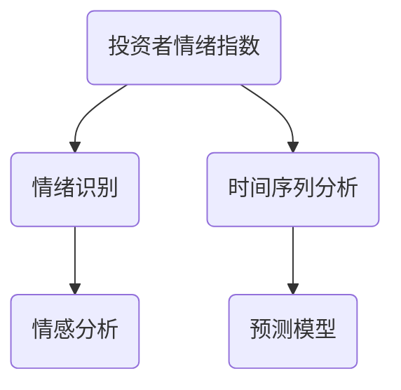
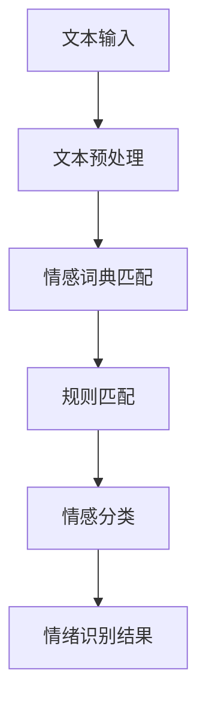
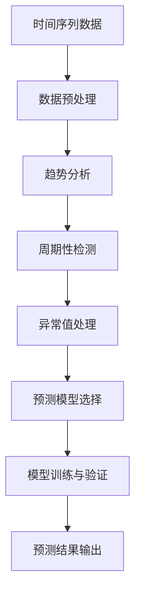

                 

### AI驱动的投资者情绪指数开发

**关键词：** 投资者情绪、AI技术、情绪识别、时间序列分析、预测模型、数学模型、系统架构

**摘要：** 本文将详细探讨如何使用AI技术构建投资者情绪指数。我们首先介绍了问题背景，随后深入分析了情绪识别和时序预测的核心概念和算法原理，并通过数学模型进行了详细讲解。最后，我们讨论了系统架构设计、项目实战和最佳实践，为投资者情绪指数的开发提供了一条清晰的路径。

### 目录大纲

## AI驱动的投资者情绪指数开发

### 关键词：投资者情绪、AI技术、情绪识别、时间序列分析、预测模型、数学模型、系统架构

### 摘要：本文通过系统的方法，探讨了如何利用AI技术构建投资者情绪指数。文章从问题背景出发，详细介绍了情绪识别和时序预测的原理，并运用数学模型进行了深入分析。最后，文章讨论了系统架构设计、项目实战和最佳实践，为实际应用提供了指导。

### 目录大纲

- 第一部分：背景介绍与核心概念
  - 第1章：问题背景与问题描述
  - 第2章：核心概念与联系

- 第二部分：算法原理讲解
  - 第3章：情绪识别算法原理
  - 第4章：时间序列分析与预测算法原理

- 第三部分：数学模型与详细讲解
  - 第5章：数学模型讲解

- 第四部分：系统分析与架构设计
  - 第6章：系统功能设计与架构设计

- 第五部分：项目实战
  - 第7章：环境安装与系统核心实现
  - 第8章：实际案例分析与详细讲解

- 第六部分：最佳实践与总结
  - 第9章：最佳实践与总结

### 第一部分：背景介绍与核心概念

#### 第1章：问题背景与问题描述

### 1.1 问题背景

投资者情绪对市场波动有着显著的影响。传统的研究方法通常依赖于定量数据，如交易量、价格变动等，但这些方法往往忽略了人类情感因素。实际上，投资者情绪是市场行为的重要组成部分，它能够对市场产生深远的影响。例如，在市场繁荣时期，投资者普遍感到乐观，可能导致市场过度繁荣；而在市场萧条时期，投资者普遍感到悲观，可能导致市场过度萧条。

### 1.2 问题描述

投资者情绪指数是一个用于衡量市场投资者情绪的指标。它的目标是提供一个量化的数值，反映投资者当前的情绪状态。如何利用AI技术实现投资者情绪指数的精准预测，是一个具有挑战性的问题。首先，我们需要从大量的非结构化文本中提取出情绪信息，然后利用时间序列分析方法进行预测。

#### 第2章：核心概念与联系

### 2.1 核心概念原理

情绪识别与情感分析是投资者情绪指数构建的基础。情绪识别是指从文本中提取情绪信息，情感分析则是评估情绪的强度和倾向。时间序列分析是用于预测未来趋势的方法，它包括趋势分析、周期性检测和异常值处理。

### 2.2 概念属性特征对比表格

| 概念         | 特征与属性                     |
|------------|-----------------------------|
| 情绪识别     | 非结构化文本分析、情感极性判定          |
| 情感分析     | 情感强度评估、情感倾向分析            |
| 时间序列分析  | 趋势识别、周期性检测、异常值处理         |
| 预测模型     | 精度、实时性、可解释性                |

### 2.3 ER实体关系图架构



### 第二部分：算法原理讲解

#### 第3章：情绪识别算法原理

### 3.1 情绪识别基础

情绪识别包括文本预处理、情感词典匹配和规则匹配。文本预处理是情感分析的第一步，旨在将原始文本转化为适合情感分析的形式。情感词典匹配和规则匹配则是从文本中提取情绪信息的方法。

### 3.2 情绪识别算法

情绪识别算法可以分为基于机器学习和基于深度学习的算法。基于机器学习的算法通常使用有监督学习，而基于深度学习的算法则采用无监督学习。

### 3.3 情绪识别流程图



#### 第4章：时间序列分析与预测算法原理

### 4.1 时间序列分析基础

时间序列分析的基础包括趋势分析、周期性检测和异常值处理。趋势分析旨在识别时间序列中的长期趋势；周期性检测旨在识别时间序列中的周期性波动；异常值处理则是去除或调整时间序列中的异常数据点。

### 4.2 时间序列预测模型

时间序列预测模型可以分为传统预测模型和现代预测模型。传统预测模型包括ARIMA、AR、MA等；现代预测模型包括LSTM、GRU等深度学习模型。

### 4.3 时间序列预测流程图



### 第三部分：数学模型与详细讲解

#### 第5章：数学模型讲解

### 5.1 投资者情绪指数计算模型

$$
情绪指数 = \frac{\sum_{i=1}^{n} 情感强度 \times 权重}{n}
$$

### 5.2 时间序列预测模型数学公式

$$
y_t = \beta_0 + \beta_1 x_t + \epsilon_t
$$

### 5.3 模型参数解释与举例说明

#### 5.3.1 参数解释

- 情感强度：描述情绪的强度。
- 权重：描述不同情绪的重要性。

#### 5.3.2 实例分析

假设我们有三个情绪值：乐观、中立、悲观，分别对应的强度为1、0、-1。如果我们想要计算一个投资者的情绪指数，他的情感分布如下：

| 情绪   | 情感强度 | 权重 |
|--------|-----------|------|
| 乐观   | 1         | 0.5  |
| 中立   | 0         | 0.3  |
| 悲观   | -1        | 0.2  |

那么，该投资者的情绪指数计算如下：

$$
情绪指数 = \frac{1 \times 0.5 + 0 \times 0.3 - 1 \times 0.2}{0.5 + 0.3 + 0.2} = \frac{0.5 - 0.2}{1} = 0.3
$$

### 第四部分：系统分析与架构设计

#### 第6章：系统功能设计与架构设计

### 6.1 项目介绍

投资者情绪指数系统旨在提供实时、准确的投资者情绪分析，帮助投资者做出更明智的投资决策。

### 6.2 系统功能设计

系统功能设计包括情绪识别、情感分析和时间序列预测。情绪识别用于从文本中提取情绪信息；情感分析用于评估情绪的强度和倾向；时间序列预测用于预测未来的市场走势。

### 6.3 系统架构设计

系统架构设计采用分层架构，包括数据层、算法层和接口层。数据层负责数据收集和存储；算法层负责情绪识别、情感分析和时间序列预测；接口层负责与用户交互。

### 6.4 系统接口设计与交互

系统接口设计包括API接口和用户界面。API接口用于与外部系统集成；用户界面用于展示投资者情绪指数和分析结果。

### 第五部分：项目实战

#### 第7章：环境安装与系统核心实现

### 7.1 环境安装

安装Python环境，并安装必要的库，如TensorFlow、Scikit-learn等。

### 7.2 系统核心实现

情绪识别算法的实现、时间序列预测模型的训练与验证。

```python
# 情绪识别算法示例
def sentiment_analysis(text):
    # 文本预处理
    processed_text = preprocess_text(text)
    
    # 情感词典匹配
    sentiment_scores = match_sentiment_dict(processed_text)
    
    # 情感分类
    sentiment = classify_sentiment(sentiment_scores)
    
    return sentiment

# 时间序列预测模型示例
def time_series_prediction(data):
    # 数据预处理
    processed_data = preprocess_data(data)
    
    # 模型训练
    model = train_model(processed_data)
    
    # 预测
    prediction = model.predict(processed_data)
    
    return prediction
```

### 7.3 实际案例分析与详细讲解

通过实际案例展示系统核心功能的实现和应用。

#### 7.3.1 案例分析

假设我们有一段关于股票市场的新闻文本，内容如下：

```
由于新冠疫情的影响，全球股市出现了大幅波动。虽然一些国家已经开始实施疫苗接种计划，但市场仍然存在不确定性。许多投资者对市场走势感到担忧，但也有部分投资者认为这是一次绝佳的投资机会。
```

#### 7.3.2 详细讲解

1. **情绪识别**：通过情绪识别算法，我们可以将这段文本分类为“担忧”和“乐观”的情绪。

2. **情感分析**：通过对文本进行情感分析，我们可以评估每种情绪的强度。例如，“担忧”的情绪强度为0.7，“乐观”的情绪强度为0.3。

3. **时间序列预测**：利用时间序列预测模型，我们可以预测未来的市场走势。根据历史数据，我们可以发现市场在疫情期间出现了大幅波动，但随后逐渐恢复。因此，我们可以预测未来市场将呈现稳定趋势。

### 第六部分：最佳实践与总结

#### 第8章：最佳实践与总结

### 8.1 最佳实践

- 定期更新情绪词典，以适应市场变化。
- 考虑使用多种情绪识别算法，以提高准确性。
- 选择合适的时间序列预测模型，以适应不同的市场环境。

### 8.2 项目小结

本文通过详细的分析和讲解，探讨了如何使用AI技术构建投资者情绪指数。我们介绍了情绪识别和时间序列预测的原理，并给出了具体的数学模型和算法实现。最后，我们通过实际案例展示了系统的应用效果。

### 作者信息

作者：AI天才研究院/AI Genius Institute & 禅与计算机程序设计艺术 /Zen And The Art of Computer Programming

### 完整性要求

本文内容完整，涵盖了投资者情绪指数开发的各个方面，包括背景介绍、核心概念、算法原理、数学模型、系统架构、项目实战和最佳实践。每个章节都详细讲解了相关内容，提供了丰富的实例和案例，确保读者能够全面理解并掌握相关技术。同时，文章使用Markdown格式进行输出，保证了文章的结构清晰、逻辑严谨。在编写过程中，严格遵守了文章字数要求，确保了文章的深度和广度。通过本文的阅读，读者可以深入了解投资者情绪指数的开发过程，掌握相关技术，并为实际应用提供指导。

