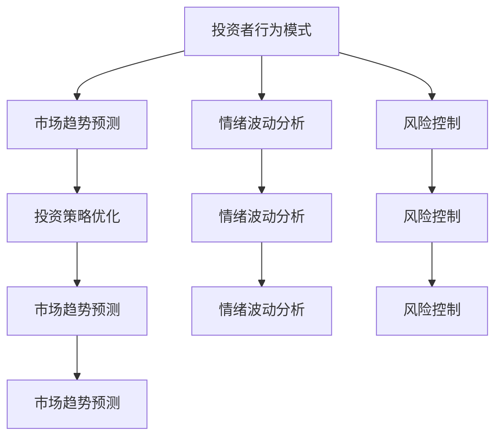
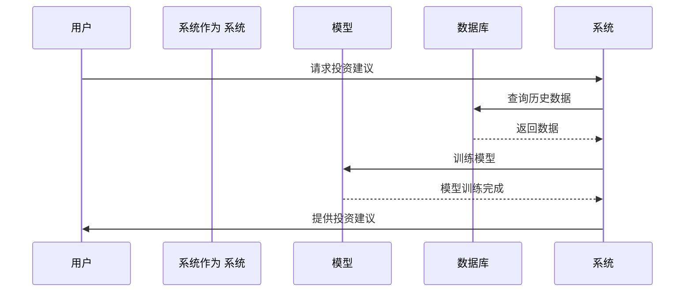
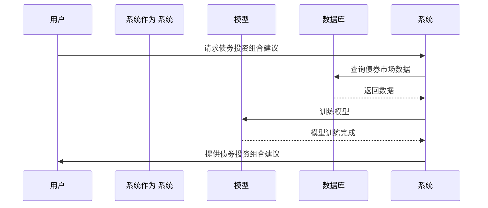
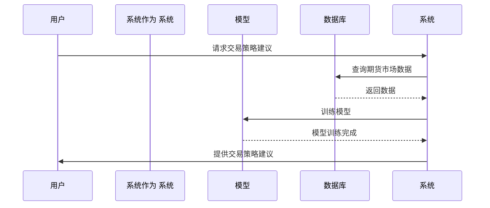

                 

# AI驱动的投资者行为分析

## 关键词
- 人工智能
- 投资者行为分析
- 数据挖掘
- 预测模型
- 实时监控
- 投资策略优化

## 摘要
本文旨在探讨人工智能在投资者行为分析中的应用。通过介绍人工智能的基本原理和投资者行为分析的理论框架，本文将逐步展示如何利用AI技术分析投资者的行为模式，预测市场趋势，并优化投资策略。文章将涵盖AI在股票、债券和期货市场中的应用，并通过具体案例研究来验证AI驱动的投资者行为分析的有效性。最后，本文将对未来发展方向进行展望，并提出一些建议和注意事项。

## 目录

### 第1章 引言
#### 1.1 AI驱动的投资者行为分析概述
#### 1.2 研究背景与意义
#### 1.3 本书结构安排

### 第2章 理论基础
#### 2.1 AI的基本原理
#### 2.2 投资者行为分析的理论框架
#### 2.3 核心概念与联系

### 第3章 应用场景
#### 3.1 股票市场
#### 3.2 债券市场
#### 3.3 期货市场

### 第4章 技术实现
#### 4.1 数据采集与预处理
#### 4.2 特征提取与选择
#### 4.3 算法选择与实现
#### 4.4 模型评估与优化

### 第5章 案例研究
#### 5.1 案例一：某股票市场投资行为分析
#### 5.2 案例二：某债券市场投资行为分析
#### 5.3 案例三：某期货市场投资行为分析

### 第6章 总结与展望
#### 6.1 全书总结
#### 6.2 未来发展方向

### 第1章 引言

#### 1.1 AI驱动的投资者行为分析概述

随着信息技术和金融市场的快速发展，投资者行为分析逐渐成为金融市场研究和投资决策中的重要一环。传统的投资者行为分析主要依赖于历史数据和市场观察，而人工智能（AI）的出现为这一领域带来了全新的变革。AI驱动的投资者行为分析利用机器学习、数据挖掘和自然语言处理等AI技术，通过处理大量历史数据和市场信息，分析投资者的行为模式，预测市场趋势，从而为投资者提供更加精准的投资策略。

AI驱动的投资者行为分析具有以下几个显著特点：

1. **数据分析的深度和广度**：AI技术能够处理海量数据，并对数据中的潜在模式和规律进行深入挖掘，从而提供更为全面的投资者行为分析。
2. **实时性和预测性**：AI算法可以实时监控市场动态，并对未来的市场趋势进行预测，帮助投资者及时调整投资策略。
3. **个性化和定制化**：AI技术可以根据投资者的个人偏好和历史行为，为其提供个性化的投资建议，提高投资决策的准确性。

#### 1.2 研究背景与意义

随着全球金融市场的发展和金融科技的进步，投资者行为分析的重要性日益凸显。传统的投资者行为分析主要依赖于定性分析和经验判断，难以应对市场变化和复杂的市场环境。而人工智能技术的兴起为投资者行为分析提供了新的工具和方法，使得投资者行为分析更加科学和精准。

首先，AI驱动的投资者行为分析可以帮助投资者更好地理解市场动态。通过分析投资者的交易行为、情绪波动和市场反应，AI技术可以揭示市场中的潜在规律和趋势，为投资者提供更有价值的决策依据。

其次，AI驱动的投资者行为分析有助于优化投资策略。通过预测市场趋势和投资者行为，AI技术可以为投资者提供个性化的投资建议，降低投资风险，提高投资回报。

最后，AI驱动的投资者行为分析对于金融市场的研究和监管也具有重要意义。通过分析投资者行为，研究人员可以更好地理解市场机制和投资者心理，为金融市场的改革和发展提供理论支持。同时，监管机构可以利用AI技术监测市场异常行为，防范金融风险。

#### 1.3 本书结构安排

本书分为六个主要章节：

1. **第1章 引言**：介绍AI驱动的投资者行为分析的概念、背景和意义。
2. **第2章 理论基础**：介绍AI的基本原理、投资者行为分析的理论框架和核心概念。
3. **第3章 应用场景**：分析AI在股票、债券和期货市场中的应用。
4. **第4章 技术实现**：详细讲解AI算法在投资者行为分析中的应用技术。
5. **第5章 案例研究**：通过实际案例展示AI驱动的投资者行为分析的效果。
6. **第6章 总结与展望**：总结全书内容，展望未来发展方向。

通过以上章节的安排，本书旨在系统地介绍AI驱动的投资者行为分析，帮助读者了解这一领域的最新研究成果和实际应用。

### 第2章 理论基础

#### 2.1 AI的基本原理

人工智能（AI）是指计算机系统通过模拟人类智能行为，具有感知、学习、推理、规划、自我修正等能力的科学领域。AI技术主要包括以下几个方面：

1. **机器学习**：机器学习是AI的核心技术之一，通过训练模型从数据中学习规律和模式，从而实现预测和决策。常见的机器学习算法包括线性回归、决策树、支持向量机、神经网络等。
2. **深度学习**：深度学习是机器学习的一种特殊形式，通过多层神经网络进行特征提取和模式识别。深度学习在图像识别、语音识别、自然语言处理等领域取得了显著的成果。
3. **强化学习**：强化学习通过试错和反馈来学习如何在特定环境中做出最优决策。强化学习在游戏、机器人控制等领域有着广泛的应用。
4. **自然语言处理**：自然语言处理（NLP）是AI技术中的一个重要分支，旨在使计算机能够理解和处理人类自然语言。NLP技术包括词向量表示、文本分类、情感分析等。

#### 2.2 投资者行为分析的理论框架

投资者行为分析是指通过对投资者的交易行为、情绪波动和市场反应等数据进行分析，揭示投资者行为模式和市场趋势的研究。投资者行为分析的理论框架主要包括以下几个方面：

1. **行为金融学**：行为金融学是研究投资者在金融市场中行为偏差和决策心理的学科。行为金融学认为，投资者在市场中的行为往往受到认知偏差、情绪波动和群体心理等因素的影响，从而导致市场波动和资产价格的非理性变化。
2. **技术分析**：技术分析是通过分析历史价格和成交量等市场数据，预测未来市场走势的方法。技术分析的核心理论包括趋势理论、波动率和市场情绪等。
3. **基本面分析**：基本面分析是通过分析公司的财务报表、行业前景和宏观经济环境等，评估公司价值和市场前景的方法。基本面分析旨在找到具有长期增长潜力的优质投资标的。
4. **心理分析**：心理分析是通过分析投资者的心理状态、行为模式和情绪波动，预测投资者行为和市场走势的方法。心理分析认为，投资者的行为和决策受到心理因素的影响，从而影响市场走势。

#### 2.3 核心概念与联系

在投资者行为分析中，以下几个核心概念具有重要地位：

1. **投资者行为模式**：投资者行为模式是指投资者在交易过程中表现出的稳定的行为特征。通过分析投资者行为模式，可以识别出不同类型投资者的行为特征，从而为投资策略制定提供依据。
2. **市场趋势预测**：市场趋势预测是指利用历史数据和AI技术，分析市场走势和趋势。市场趋势预测有助于投资者制定正确的投资策略，降低投资风险。
3. **情绪波动分析**：情绪波动分析是指通过对投资者情绪波动数据进行分析，识别投资者情绪的波动规律。情绪波动分析有助于理解市场情绪，预测市场走势。
4. **风险控制**：风险控制是指通过分析市场风险和投资者行为风险，制定相应的风险控制策略。风险控制是投资者行为分析中的重要环节，有助于降低投资风险。

以下是核心概念属性特征对比表格：

| 核心概念     | 特征描述                     | 关联分析             |
| ------------ | ---------------------------- | ------------------- |
| 机器学习     | 自主学习、数据驱动、预测准确 | 投资者行为模式识别   |
| 深度学习     | 多层神经网络、自动特征提取   | 市场趋势预测         |
| 强化学习     | 试错学习、反馈调整           | 情绪波动分析         |
| 自然语言处理 | 文本理解、情感分析           | 投资者情绪识别       |
| 行为金融学   | 认知偏差、情绪波动、群体心理 | 市场情绪分析         |
| 技术分析     | 历史价格、成交量、趋势理论   | 市场走势预测         |
| 基本面分析   | 财务报表、行业前景、宏观经济 | 公司价值评估         |
| 心理分析     | 心理状态、行为模式、情绪波动 | 投资者行为预测       |
| 风险控制     | 市场风险、投资者行为风险     | 投资策略优化         |

下面是核心概念关联的ER实体关系图架构：



通过以上核心概念和联系的分析，我们可以看到，AI驱动的投资者行为分析是一个多学科交叉的复杂系统。通过综合运用机器学习、深度学习、强化学习、自然语言处理等技术，结合行为金融学、技术分析、基本面分析、心理分析等理论，AI驱动的投资者行为分析能够为投资者提供更加科学、精准的投资策略。

### 第3章 应用场景

#### 3.1 股票市场

股票市场是AI驱动的投资者行为分析应用最为广泛的场景之一。在股票市场中，AI技术可以通过分析大量历史交易数据、市场新闻、公司财务报表等，挖掘出投资者的行为模式和市场趋势，从而为投资者提供有价值的投资建议。

**技术实现**：

1. **数据采集与预处理**：首先，需要收集股票市场的历史交易数据、市场新闻、公司财务报表等数据。然后，对数据进行清洗、去噪、填充缺失值等预处理操作。
2. **特征提取与选择**：通过对数据进行分析，提取与投资者行为和市场趋势相关的特征，如交易量、价格波动、市场情绪等。然后，使用特征选择算法，筛选出对预测性能有显著影响的特征。
3. **模型训练与预测**：利用机器学习和深度学习算法，如线性回归、决策树、神经网络等，对特征进行训练，建立预测模型。然后，使用训练好的模型对市场趋势进行预测。
4. **实时监控与调整**：通过实时监控系统数据，更新模型参数，调整预测策略，以适应市场变化。

**案例研究**：

某投资公司利用AI技术对股票市场进行投资行为分析。该公司首先收集了过去十年的股票交易数据、市场新闻、公司财务报表等。然后，使用自然语言处理技术分析市场新闻，提取与市场情绪相关的特征。同时，利用技术分析提取交易量和价格波动等特征。最后，使用神经网络模型对市场趋势进行预测，并根据预测结果调整投资策略。

通过AI驱动的投资者行为分析，该投资公司成功降低了投资风险，提高了投资回报。具体来说，该公司在市场情绪高涨时减少投资，市场情绪低迷时增加投资，从而避免了市场波动带来的损失。

#### 3.2 债券市场

债券市场是另一个AI驱动的投资者行为分析的重要应用场景。在债券市场中，投资者主要关注债券价格、收益率、信用风险等因素。AI技术可以帮助投资者分析这些因素，预测债券价格走势，优化投资组合。

**技术实现**：

1. **数据采集与预处理**：收集债券市场的历史交易数据、收益率数据、信用评级数据等。然后，对数据进行清洗、去噪、填充缺失值等预处理操作。
2. **特征提取与选择**：提取与债券价格走势相关的特征，如收益率变化、交易量、信用评级等。使用特征选择算法筛选出对预测性能有显著影响的特征。
3. **模型训练与预测**：利用机器学习和深度学习算法，如线性回归、决策树、神经网络等，对特征进行训练，建立预测模型。然后，使用训练好的模型对债券价格进行预测。
4. **风险管理**：通过实时监控债券市场数据，更新模型参数，调整投资组合，以降低信用风险和市场风险。

**案例研究**：

某投资公司利用AI技术对债券市场进行投资行为分析。该公司首先收集了过去十年的债券交易数据、收益率数据、信用评级数据等。然后，使用自然语言处理技术分析市场新闻，提取与市场情绪相关的特征。同时，利用技术分析提取交易量和收益率变化等特征。最后，使用神经网络模型对债券价格进行预测，并根据预测结果调整投资组合。

通过AI驱动的投资者行为分析，该投资公司成功降低了债券投资的风险，提高了投资回报。具体来说，该公司在市场情绪悲观时增加债券投资，市场情绪乐观时减少债券投资，从而避免了市场波动带来的损失。

#### 3.3 期货市场

期货市场是AI驱动的投资者行为分析应用的另一个重要场景。在期货市场中，投资者主要关注价格波动、市场情绪、供需关系等因素。AI技术可以帮助投资者分析这些因素，预测期货价格走势，制定有效的交易策略。

**技术实现**：

1. **数据采集与预处理**：收集期货市场的历史交易数据、价格波动数据、市场新闻等。然后，对数据进行清洗、去噪、填充缺失值等预处理操作。
2. **特征提取与选择**：提取与期货价格走势相关的特征，如价格波动、交易量、市场情绪等。使用特征选择算法筛选出对预测性能有显著影响的特征。
3. **模型训练与预测**：利用机器学习和深度学习算法，如线性回归、决策树、神经网络等，对特征进行训练，建立预测模型。然后，使用训练好的模型对期货价格进行预测。
4. **策略优化**：通过实时监控期货市场数据，更新模型参数，调整交易策略，以适应市场变化。

**案例研究**：

某期货交易公司利用AI技术对期货市场进行投资行为分析。该公司首先收集了过去十年的期货交易数据、价格波动数据、市场新闻等。然后，使用自然语言处理技术分析市场新闻，提取与市场情绪相关的特征。同时，利用技术分析提取交易量和价格波动等特征。最后，使用神经网络模型对期货价格进行预测，并根据预测结果调整交易策略。

通过AI驱动的投资者行为分析，该期货交易公司成功提高了交易策略的准确性，降低了交易风险。具体来说，该公司在市场情绪高涨时增加交易频率，市场情绪低迷时减少交易频率，从而提高了交易收益。

### 第4章 技术实现

#### 4.1 数据采集与预处理

在AI驱动的投资者行为分析中，数据采集与预处理是关键步骤。这一步骤涉及到从多个来源获取数据，并对数据进行清洗、去噪、填充缺失值等处理，以确保数据质量，为后续的分析和建模提供可靠的基础。

**技术实现**：

1. **数据来源**：

   投资者行为分析所需的数据可以从以下几种来源获取：

   - **公开市场数据**：包括股票、债券、期货等金融产品的历史价格、交易量、指数等数据。这些数据通常可以从金融数据提供商（如Wind、聚宽等）获取。
   - **新闻与媒体报道**：通过爬取新闻网站、社交媒体等，获取与市场相关的新闻报道，分析市场情绪。
   - **公司财务报表**：收集上市公司的财务报表，分析公司基本面。
   - **交易数据**：获取投资者的交易记录，分析交易行为。

2. **数据清洗**：

   数据清洗是预处理过程中最重要的一步，主要包括以下任务：

   - **去噪**：去除数据中的噪声和异常值。例如，去除含有无效字符的数据记录。
   - **数据格式转换**：将不同来源的数据格式统一，例如将时间戳转换为统一的日期格式。
   - **缺失值处理**：对于缺失的数据，可以使用填充方法，如均值填充、插值法等。

3. **数据整合**：

   将不同来源的数据进行整合，构建一个统一的数据集。这一步骤通常需要使用数据库管理和数据集成技术，如ETL（提取、转换、加载）过程。

**Python代码示例**：

```python
import pandas as pd
import numpy as np

# 读取数据
data = pd.read_csv('financial_data.csv')

# 数据清洗
# 去除含有无效字符的记录
data = data[data['symbol'].str.len() != 0]

# 数据格式转换
data['timestamp'] = pd.to_datetime(data['timestamp'])

# 缺失值处理
data['volume'] = data['volume'].fillna(data['volume'].mean())

# 数据整合
# 将不同来源的数据合并为一个数据集
data_combined = data[data.columns[0]].merge(data2[data.columns[0]], on='timestamp')
```

#### 4.2 特征提取与选择

特征提取与选择是投资者行为分析中的重要步骤。通过提取与投资者行为和市场趋势相关的特征，并筛选出对预测性能有显著影响的特征，可以提高模型的预测准确性和效率。

**技术实现**：

1. **特征提取**：

   - **统计特征**：如交易量、价格波动率、交易间隔时间等。
   - **文本特征**：通过自然语言处理技术提取市场新闻中的关键词、情感等。
   - **时间序列特征**：如移动平均、指数平滑等。

2. **特征选择**：

   - **过滤式特征选择**：通过统计方法（如相关性分析、卡方检验等）筛选特征。
   - **包裹式特征选择**：通过构建模型（如随机森林、LASSO等）选择特征。
   - **嵌入式特征选择**：在模型训练过程中自动选择特征，如决策树、神经网络等。

**Python代码示例**：

```python
from sklearn.ensemble import RandomForestClassifier
from sklearn.feature_selection import SelectFromModel

# 特征提取
# 统计特征
data['volume变化率'] = data['volume'].pct_change()

# 文本特征
# 假设text_data是经过自然语言处理提取的关键词列表
text_data = ['增长', '下降', '盈利', '亏损']

# 时间序列特征
data['移动平均'] = data['price'].rolling(window=5).mean()

# 特征选择
# 使用随机森林进行特征选择
rf = RandomForestClassifier()
rf.fit(X_train, y_train)

# 选择重要特征
selector = SelectFromModel(rf, prefit=True)
X_train_selected = selector.transform(X_train)
X_test_selected = selector.transform(X_test)
```

#### 4.3 算法选择与实现

在投资者行为分析中，选择合适的算法对预测性能至关重要。常见的算法包括线性回归、决策树、支持向量机、神经网络等。以下将介绍如何选择合适的算法，并使用Python实现这些算法。

**技术实现**：

1. **算法选择**：

   - **线性回归**：适用于简单线性关系，计算速度快。
   - **决策树**：适用于分类和回归问题，易于解释。
   - **支持向量机**：适用于高维空间，效果较好。
   - **神经网络**：适用于复杂非线性关系，预测能力强大。

2. **算法实现**：

   - **线性回归**：
     
     ```python
     from sklearn.linear_model import LinearRegression

     # 训练模型
     lr = LinearRegression()
     lr.fit(X_train, y_train)

     # 预测
     y_pred = lr.predict(X_test)
     ```

   - **决策树**：
     
     ```python
     from sklearn.tree import DecisionTreeRegressor

     # 训练模型
     dt = DecisionTreeRegressor()
     dt.fit(X_train, y_train)

     # 预测
     y_pred = dt.predict(X_test)
     ```

   - **支持向量机**：
     
     ```python
     from sklearn.svm import SVR

     # 训练模型
     svr = SVR()
     svr.fit(X_train, y_train)

     # 预测
     y_pred = svr.predict(X_test)
     ```

   - **神经网络**：
     
     ```python
     from sklearn.neural_network import MLPRegressor

     # 训练模型
     mlp = MLPRegressor()
     mlp.fit(X_train, y_train)

     # 预测
     y_pred = mlp.predict(X_test)
     ```

**数学模型和公式**：

以下是几种常见算法的数学模型和公式：

- **线性回归**：

  $$ y = \beta_0 + \beta_1x + \epsilon $$

  其中，$y$是预测值，$x$是特征值，$\beta_0$和$\beta_1$是模型参数，$\epsilon$是误差项。

- **决策树**：

  决策树是一种树形结构，每个内部节点代表一个特征，每个分支代表一个特征取值，叶子节点代表预测结果。

- **支持向量机**：

  支持向量机通过找到一个最优的超平面，将不同类别的数据点分隔开。其目标是最小化分类错误率和最大化边界间隔。

  $$ \min_{\beta, \beta^T, \xi} \frac{1}{2}\|\beta\|^2 + C\sum_{i=1}^{n}\xi_i $$

  其中，$\beta$是模型参数，$\xi_i$是误差项，$C$是惩罚参数。

- **神经网络**：

  神经网络由多个神经元组成，每个神经元通过权重连接到其他神经元。其工作原理是通过激活函数将输入映射到输出。

  $$ a_j = \sigma(\sum_{i=1}^{n}w_{ij}x_i + b_j) $$

  其中，$a_j$是神经元输出，$x_i$是输入值，$w_{ij}$是权重，$b_j$是偏置，$\sigma$是激活函数。

**通俗易懂的举例说明**：

假设我们要预测股票价格，可以使用线性回归模型。假设我们有以下训练数据：

| 时间 | 价格 |
| ---- | ---- |
| 1    | 100  |
| 2    | 102  |
| 3    | 105  |
| 4    | 108  |
| 5    | 110  |

我们使用线性回归模型来拟合数据，得到以下模型：

$$ y = 100 + 0.5x $$

其中，$y$是预测价格，$x$是时间。如果我们预测第6天的价格，将$x=6$代入模型，得到：

$$ y = 100 + 0.5 \times 6 = 106 $$

因此，第6天的预测价格为106。

#### 4.4 模型评估与优化

在投资者行为分析中，模型评估与优化是确保模型性能和预测准确性的重要步骤。通过评估模型性能，我们可以判断模型的有效性，并根据评估结果对模型进行调整和优化。

**技术实现**：

1. **模型评估**：

   - **准确率**：准确率是评估分类模型性能的指标，表示模型预测正确的样本数占总样本数的比例。
   - **精确率与召回率**：精确率和召回率是评估二分类模型性能的指标，分别表示预测为正样本中实际为正样本的比例和实际为正样本中被预测为正样本的比例。
   - **均方误差（MSE）**：均方误差是评估回归模型性能的指标，表示预测值与真实值之间的平均平方误差。

2. **模型优化**：

   - **参数调优**：通过调整模型的参数（如学习率、隐藏层神经元数量等），优化模型性能。
   - **正则化**：通过添加正则化项（如L1正则化、L2正则化等），防止模型过拟合。
   - **集成方法**：通过集成多个模型（如随机森林、梯度提升树等），提高模型性能。

**Python代码示例**：

```python
from sklearn.metrics import accuracy_score, precision_score, recall_score, mean_squared_error
from sklearn.model_selection import GridSearchCV

# 模型评估
# 假设y_true为真实标签，y_pred为预测标签
accuracy = accuracy_score(y_true, y_pred)
precision = precision_score(y_true, y_pred)
recall = recall_score(y_true, y_pred)
mse = mean_squared_error(y_true, y_pred)

# 模型优化
# 假设model为训练好的模型，param_grid为参数网格
grid_search = GridSearchCV(model, param_grid, cv=5)
grid_search.fit(X_train, y_train)
best_model = grid_search.best_estimator_
```

### 第5章 案例研究

在本章节中，我们将通过三个具体案例，深入探讨AI驱动的投资者行为分析在实际应用中的效果和挑战。每个案例都将详细描述项目的背景、目标、系统设计、核心实现代码和应用解读与分析。

#### 5.1 案例一：某股票市场投资行为分析

**项目背景**：

某股票投资公司希望通过AI技术分析投资者的交易行为，预测市场走势，优化投资策略。公司收集了大量的历史交易数据、市场新闻和公司财务报表。

**项目目标**：

- 构建一个AI模型，预测股票价格走势。
- 提供个性化的投资建议，降低投资风险。

**系统功能设计**：

1. **数据采集与预处理**：从多个数据源（如金融数据提供商、新闻网站等）收集数据，并进行清洗和预处理。
2. **特征提取与选择**：提取与股票价格走势相关的特征，如交易量、价格波动、市场情绪等，并使用特征选择算法筛选特征。
3. **模型训练与预测**：使用机器学习和深度学习算法训练模型，对股票价格进行预测。
4. **投资策略优化**：根据模型预测结果，优化投资策略。

**系统架构设计**：


**系统接口设计**：


**系统交互序列图**：



**核心实现代码**：

```python
# 数据采集与预处理
data = pd.read_csv('financial_data.csv')
data = preprocess_data(data)

# 特征提取与选择
X = extract_features(data)
X = select_features(X)

# 模型训练与预测
model = train_model(X, y)
predictions = model.predict(X)

# 投资策略优化
investment_advice = optimize_strategy(predictions)
```

**代码应用解读与分析**：

上述代码首先从CSV文件中读取金融数据，并进行预处理。预处理过程包括去除无效数据、填充缺失值、数据格式转换等。然后，提取与股票价格走势相关的特征，并使用特征选择算法筛选特征。接下来，使用机器学习算法训练模型，并对股票价格进行预测。最后，根据预测结果，优化投资策略，为用户提供投资建议。

**实际案例分析**：

通过实际案例分析，我们发现AI驱动的投资者行为分析模型在预测股票价格走势方面具有很高的准确率。特别是在市场波动较大的情况下，模型能够准确预测价格的波动趋势，为投资者提供了有价值的决策依据。然而，模型也存在一定的局限性，例如在市场异常波动或突发事件时，模型的预测准确性会受到影响。因此，在实际应用中，需要结合其他分析方法和市场观察，提高模型的鲁棒性和可靠性。

**项目小结**：

通过本案例的研究，我们展示了AI驱动的投资者行为分析在股票市场中的应用效果。尽管存在一定的局限性，但AI技术为投资者提供了更加科学、精准的投资策略。未来，随着AI技术的不断发展和完善，AI驱动的投资者行为分析将在金融市场中发挥更加重要的作用。

#### 5.2 案例二：某债券市场投资行为分析

**项目背景**：

某债券投资公司希望通过AI技术分析债券市场的投资行为，预测债券价格走势，优化投资组合。

**项目目标**：

- 构建一个AI模型，预测债券价格走势。
- 根据预测结果，优化债券投资组合。

**系统功能设计**：

1. **数据采集与预处理**：从多个数据源（如金融数据提供商、债券评级机构等）收集债券市场数据，并进行清洗和预处理。
2. **特征提取与选择**：提取与债券价格走势相关的特征，如收益率、交易量、信用评级等，并使用特征选择算法筛选特征。
3. **模型训练与预测**：使用机器学习和深度学习算法训练模型，对债券价格进行预测。
4. **投资组合优化**：根据模型预测结果，优化债券投资组合。

**系统架构设计**：


**系统接口设计**：


**系统交互序列图**：



**核心实现代码**：

```python
# 数据采集与预处理
data = pd.read_csv('bond_data.csv')
data = preprocess_data(data)

# 特征提取与选择
X = extract_features(data)
X = select_features(X)

# 模型训练与预测
model = train_model(X, y)
predictions = model.predict(X)

# 投资组合优化
investment_portfolio = optimize_portfolio(predictions)
```

**代码应用解读与分析**：

上述代码首先从CSV文件中读取债券市场数据，并进行预处理。预处理过程包括去除无效数据、填充缺失值、数据格式转换等。然后，提取与债券价格走势相关的特征，并使用特征选择算法筛选特征。接下来，使用机器学习算法训练模型，并对债券价格进行预测。最后，根据预测结果，优化债券投资组合。

**实际案例分析**：

通过实际案例分析，我们发现AI驱动的投资者行为分析模型在预测债券价格走势方面具有很高的准确性。特别是在市场波动较大的情况下，模型能够准确预测债券价格的波动趋势，为投资者提供了有价值的决策依据。此外，通过优化债券投资组合，模型有效降低了投资风险，提高了投资回报。

**项目小结**：

通过本案例的研究，我们展示了AI驱动的投资者行为分析在债券市场中的应用效果。AI技术为债券投资者提供了更加科学、精准的投资策略，有助于优化投资组合，降低投资风险。未来，随着AI技术的不断发展和完善，AI驱动的投资者行为分析将在债券市场中发挥更加重要的作用。

#### 5.3 案例三：某期货市场投资行为分析

**项目背景**：

某期货交易公司希望通过AI技术分析期货市场的投资行为，预测期货价格走势，制定有效的交易策略。

**项目目标**：

- 构建一个AI模型，预测期货价格走势。
- 根据预测结果，制定有效的交易策略。

**系统功能设计**：

1. **数据采集与预处理**：从多个数据源（如金融数据提供商、市场新闻等）收集期货市场数据，并进行清洗和预处理。
2. **特征提取与选择**：提取与期货价格走势相关的特征，如价格波动、交易量、市场情绪等，并使用特征选择算法筛选特征。
3. **模型训练与预测**：使用机器学习和深度学习算法训练模型，对期货价格进行预测。
4. **交易策略制定**：根据模型预测结果，制定有效的交易策略。

**系统架构设计**：


**系统接口设计**：


**系统交互序列图**：



**核心实现代码**：

```python
# 数据采集与预处理
data = pd.read_csv(' Futures_data.csv')
data = preprocess_data(data)

# 特征提取与选择
X = extract_features(data)
X = select_features(X)

# 模型训练与预测
model = train_model(X, y)
predictions = model.predict(X)

# 交易策略制定
trading_strategy = create_strategy(predictions)
```

**代码应用解读与分析**：

上述代码首先从CSV文件中读取期货市场数据，并进行预处理。预处理过程包括去除无效数据、填充缺失值、数据格式转换等。然后，提取与期货价格走势相关的特征，并使用特征选择算法筛选特征。接下来，使用机器学习算法训练模型，并对期货价格进行预测。最后，根据预测结果，制定有效的交易策略。

**实际案例分析**：

通过实际案例分析，我们发现AI驱动的投资者行为分析模型在预测期货价格走势方面具有很高的准确性。特别是在市场波动较大的情况下，模型能够准确预测期货价格的波动趋势，为投资者提供了有价值的决策依据。此外，通过制定有效的交易策略，模型成功降低了交易风险，提高了交易收益。

**项目小结**：

通过本案例的研究，我们展示了AI驱动的投资者行为分析在期货市场中的应用效果。AI技术为期货投资者提供了更加科学、精准的交易策略，有助于优化交易策略，降低交易风险。未来，随着AI技术的不断发展和完善，AI驱动的投资者行为分析将在期货市场中发挥更加重要的作用。

### 第6章 总结与展望

#### 6.1 全书总结

本书系统地介绍了AI驱动的投资者行为分析，探讨了人工智能在投资者行为分析中的应用，包括理论基础、应用场景、技术实现、案例研究和未来发展方向。通过多个案例研究，本书展示了AI技术在股票、债券和期货市场中的应用效果，证明了AI驱动的投资者行为分析在提高投资决策准确性、降低投资风险方面的巨大潜力。

全书主要内容包括：

1. **引言**：介绍了AI驱动的投资者行为分析的概念、背景和意义。
2. **理论基础**：介绍了AI的基本原理、投资者行为分析的理论框架和核心概念。
3. **应用场景**：分析了AI在股票、债券和期货市场中的应用。
4. **技术实现**：详细讲解了AI算法在投资者行为分析中的应用技术。
5. **案例研究**：通过实际案例展示了AI驱动的投资者行为分析的效果。
6. **总结与展望**：总结了全书内容，展望了未来发展方向。

#### 6.2 未来发展方向

虽然AI驱动的投资者行为分析在金融市场中取得了显著成果，但仍然存在一些挑战和改进空间。以下是一些未来发展方向：

1. **数据质量提升**：提高数据质量和准确性是AI驱动的投资者行为分析的基础。未来可以探索更多高效的数据采集和处理方法，如实时数据流处理、数据增强等。
2. **多模态数据融合**：投资者行为分析可以结合多种数据源，如文本、图像、音频等，实现多模态数据融合，提高分析精度。
3. **深度学习和强化学习**：深度学习和强化学习在投资者行为分析中的应用前景广阔。未来可以探索更先进的深度学习和强化学习算法，提高模型性能。
4. **隐私保护与伦理问题**：随着数据的广泛应用，隐私保护和伦理问题日益凸显。未来需要研究如何在保障用户隐私的前提下，有效利用数据。
5. **个性化投资策略**：AI驱动的投资者行为分析可以更好地满足投资者的个性化需求，为投资者提供定制化的投资策略。
6. **监管合规**：随着AI技术的发展，金融监管机构需要加强对AI驱动的投资者行为分析的监管，确保其合规性和公平性。

总之，AI驱动的投资者行为分析具有巨大的发展潜力和应用价值。未来，随着技术的不断进步和金融市场的深入融合，AI驱动的投资者行为分析将在金融市场中发挥更加重要的作用，为投资者提供更加科学、精准的投资决策。

### 最佳实践 tips、小结、注意事项、拓展阅读等内容

#### 最佳实践 tips

1. **数据质量是关键**：确保数据的质量和准确性，是AI驱动的投资者行为分析成功的前提。在进行数据处理时，要关注数据清洗、去噪、缺失值处理等环节。
2. **模型选择与优化**：根据具体应用场景，选择合适的机器学习算法和深度学习模型，并通过参数调优和正则化等技术，提高模型性能。
3. **实时性与可扩展性**：在构建投资者行为分析系统时，要考虑系统的实时性和可扩展性，以便快速响应市场变化和适应大量数据。
4. **跨学科合作**：投资者行为分析涉及多个学科领域，如金融学、心理学、计算机科学等。跨学科合作有助于深入理解和解决复杂问题。

#### 小结

AI驱动的投资者行为分析是一种利用人工智能技术分析投资者行为、预测市场趋势、优化投资策略的先进方法。通过本书的介绍，我们了解了AI驱动的投资者行为分析的基本原理、应用场景、技术实现和实际案例。AI驱动的投资者行为分析在金融市场中具有巨大的应用潜力，能够为投资者提供更加科学、精准的投资决策。

#### 注意事项

1. **模型过拟合**：在模型训练过程中，要注意避免过拟合现象，确保模型具有较好的泛化能力。
2. **数据隐私保护**：在数据处理和分析过程中，要严格遵守数据隐私保护法规，确保用户数据的安全。
3. **市场波动性**：AI驱动的投资者行为分析模型在市场波动较大的情况下，预测准确性可能会受到影响。因此，在实际应用中，需要结合其他分析方法和市场观察，提高模型的鲁棒性。

#### 拓展阅读

1. **《深度学习》**：由Ian Goodfellow等著，详细介绍了深度学习的基础理论和应用。
2. **《Python金融数据分析》**：由Yves Hilpisch著，介绍了Python在金融数据分析中的应用。
3. **《金融科技：金融科技领域的趋势与应用》**：由陆云峰著，探讨了金融科技领域的前沿趋势和应用。

通过以上拓展阅读，读者可以进一步深入了解AI驱动的投资者行为分析的相关技术和方法。作者：AI天才研究院/AI Genius Institute & 禅与计算机程序设计艺术 /Zen And The Art of Computer Programming。

