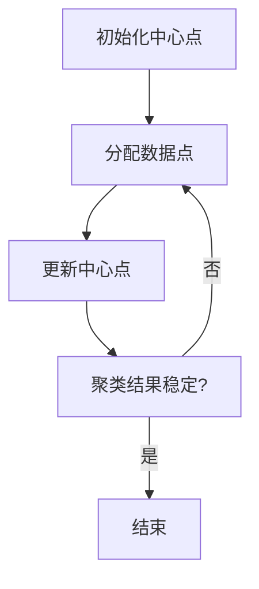

                 

### 1.1.1 问题背景

投资者行为模式研究是金融学中的一个重要分支，其核心在于通过分析投资者的行为规律，来预测和解释市场波动，从而为投资决策提供科学依据。在传统的研究方法中，研究者主要通过问卷调查、访谈等方式收集投资者行为数据，然后借助统计分析和行为金融学理论进行分析。然而，这种方法存在一些局限性，如数据样本量有限、主观性强、分析过程复杂等，难以全面、准确地反映投资者的行为模式。

随着人工智能（AI）技术的发展，特别是机器学习、数据挖掘等技术的应用，投资者行为模式的研究方法得到了显著改进。AI技术能够从大规模数据中快速提取特征，自动识别和分类投资者行为模式，为投资者行为研究提供了新的视角和工具。例如，通过自然语言处理技术，可以对投资者在社交媒体上的言论进行文本分析，识别其情绪变化；通过图像识别技术，可以分析投资者交易过程中的表情和肢体动作，从而推断其心理状态。

在金融领域，AI驱动的投资者行为模式分析具有广泛的应用前景。首先，它可以用于市场预测，通过分析投资者的行为模式，预测市场的走势，为投资者提供决策支持。其次，它可以用于风险管理，通过识别不同投资者的行为特征，评估其风险承受能力，从而优化投资组合。此外，AI技术还可以帮助金融机构更好地了解客户需求，提供个性化的金融服务。

总之，AI驱动的投资者行为模式研究不仅有助于提高投资者决策的科学性和准确性，还有助于促进金融市场的健康发展，具有重要的理论和实践意义。在接下来的章节中，我们将详细探讨AI技术在投资者行为模式分析中的应用原理、方法和实践案例。

### 1.1.2 核心概念

为了深入理解AI驱动的投资者行为模式聚类，我们需要首先明确几个核心概念：投资者行为模式、聚类算法以及数据分析技术。

**投资者行为模式**是指投资者在金融市场中表现出的行为特征和规律。这些行为包括但不限于交易频率、交易规模、交易时机、投资风格等。投资者行为模式的研究可以帮助我们理解市场动态，预测未来市场走势，为投资决策提供科学依据。例如，某些投资者可能表现出频繁交易的倾向，而另一些投资者则倾向于长期持有。

**聚类算法**是机器学习中的一种无监督学习方法，用于将数据集划分成若干个组或簇，使得同组数据之间的相似度较高，而不同组数据之间的相似度较低。聚类算法在投资者行为模式分析中起着关键作用，可以通过分析投资者行为数据的分布特征，将其分为不同的行为群体，从而揭示市场中的潜在规律。常见的聚类算法包括K-means、层次聚类和密度聚类等。

**数据分析技术**是指用于处理、分析和解释数据的一系列方法和技术。在AI驱动的投资者行为模式聚类中，数据分析技术主要用于数据预处理、特征提取和模型评估等环节。数据预处理包括数据清洗、归一化和缺失值处理等，以确保数据质量。特征提取则是从原始数据中提取出能够反映投资者行为模式的特征，如交易频率、交易规模等。模型评估则用于评估聚类结果的质量，常用的评估指标包括轮廓系数、内聚度等。

通过理解这些核心概念，我们能够更好地把握AI驱动的投资者行为模式聚类的本质，为后续章节的深入探讨奠定基础。

### 2.1.1 数据预处理

在AI驱动的投资者行为模式分析中，数据预处理是至关重要的一步。良好的数据预处理不仅可以提高模型性能，还可以减少噪声和异常值对分析结果的影响。以下我们将详细探讨数据预处理的主要步骤，包括数据收集、清洗和特征提取。

**1. 数据收集**：首先，需要收集投资者行为数据。这些数据可以来源于多个渠道，如交易记录、问卷调查、社交媒体等。交易记录包括交易日期、交易金额、交易价格等基本信息；问卷调查则可以获取投资者的投资风格、风险偏好等定性信息；社交媒体数据则可以通过自然语言处理技术提取投资者情绪和言论。数据收集过程中，需要确保数据的完整性和代表性，以便后续分析具有可信度和有效性。

**2. 数据清洗**：数据收集后，往往需要经过清洗处理，以去除噪声和异常值。数据清洗主要包括以下几步：
   - **缺失值处理**：对于缺失值，可以根据实际情况选择填充或删除。例如，对于交易记录中的缺失值，可以选择用最近值或平均值进行填充；对于问卷调查中的缺失值，可以选择删除或者使用多重插补方法。
   - **异常值检测**：通过统计方法或机器学习算法，检测并处理异常值。异常值可能是由于数据采集过程中的错误或市场特殊事件导致的。常见的异常值处理方法包括箱线图法、孤立点检测算法等。
   - **数据标准化**：将不同特征的数据进行归一化或标准化处理，以便后续分析中特征之间具有可比性。常用的标准化方法包括最小-最大标准化和Z分数标准化。

**3. 特征提取**：特征提取是从原始数据中提取出能够反映投资者行为模式的特征。特征提取的方法包括：
   - **特征选择**：通过统计方法或机器学习算法，选择对投资者行为模式有显著影响的特征。常用的特征选择方法包括信息增益、卡方检验等。
   - **特征构造**：通过数学运算或统计方法，构造新的特征，以增强模型对投资者行为模式的识别能力。例如，可以计算交易频率、交易金额的统计特征，如均值、方差等。

**示例**：假设我们收集了一组投资者的交易数据，包括交易日期、交易金额和交易价格。我们需要将这些数据进行预处理。
   - 首先，检查数据中是否存在缺失值，并对缺失值进行填充处理。例如，对于交易金额的缺失值，可以用最近值的均值进行填充。
   - 其次，检测并处理异常值。例如，可以使用箱线图法检测交易价格中的异常值，并将其删除或替换。
   - 最后，对交易金额和交易价格进行归一化处理，确保这些特征具有可比性。

通过上述步骤，我们得到了高质量的预处理数据，为后续的聚类分析奠定了基础。

### 2.1.2 聚类算法原理

在AI驱动的投资者行为模式分析中，聚类算法起着关键作用。聚类算法是一种无监督学习方法，旨在将数据集划分为若干个组或簇，使得同组数据之间的相似度较高，而不同组数据之间的相似度较低。以下是几种常见的聚类算法：K-means、层次聚类和密度聚类。

**K-means算法**是最常用的聚类算法之一。它的核心思想是将数据点划分成K个簇，使得每个簇的中心（质心）与数据点的距离最小。K-means算法的步骤如下：
1. **初始化**：随机选择K个初始中心点。
2. **分配**：将每个数据点分配到最近的中心点所在的簇。
3. **更新**：重新计算每个簇的中心点。
4. **迭代**：重复执行分配和更新步骤，直到聚类结果稳定。

K-means算法的优点是简单、易于实现，但在处理非球形分布的数据时效果不佳。此外，选择合适的聚类数K是K-means算法的一个挑战。

**层次聚类算法**通过自底向上或自顶向下的方式，逐步合并或拆分簇，形成层次结构。常见的层次聚类算法有凝聚层次聚类（Agglomerative）和分裂层次聚类（Divisive）。层次聚类算法的优点是能够形成层次化的聚类结构，便于理解。但其缺点是计算复杂度高，且对初始聚类结果敏感。

**密度聚类算法**，如DBSCAN（Density-Based Spatial Clustering of Applications with Noise），通过检测数据点的密度来划分簇。DBSCAN算法的基本思想是：首先定义邻域范围和最小密度，然后通过密度连接的方式将高密度区域划分为簇。密度聚类算法的优点是能够处理非球形分布的数据，并能够发现任意形状的簇。但其缺点是对参数的选择较为敏感。

**流程图示例**：以下是K-means算法的mermaid流程图表示：



通过上述分析，我们可以了解到不同聚类算法的基本原理和适用场景。在后续章节中，我们将详细探讨这些算法的实现和优化方法。

### 2.1.3 聚类算法实现

在了解了聚类算法的基本原理后，接下来我们将探讨如何实现这些算法。本节将重点介绍K-means、层次聚类和密度聚类三种算法的具体实现步骤，包括关键参数的设置和优化。

**1. K-means算法实现**

K-means算法的实现步骤如下：

- **初始化**：随机选择K个数据点作为初始中心点。
- **分配**：计算每个数据点到各个中心点的距离，将数据点分配到最近的中心点所在的簇。
- **更新**：重新计算每个簇的中心点，即簇内所有数据点的均值。
- **迭代**：重复执行分配和更新步骤，直到聚类结果稳定，即簇中心点变化小于设定的阈值。

关键参数设置：
- **聚类数K**：K值的选择直接影响聚类结果的质量。常见的方法包括肘部法则、轮廓系数法等。
- **距离度量**：常用的距离度量包括欧氏距离、曼哈顿距离、切比雪夫距离等。

Python代码示例：

```python
from sklearn.cluster import KMeans
import numpy as np

# 初始化数据
data = np.array([[1, 2], [1, 4], [1, 0], [10, 2], [10, 4], [10, 0]])

# 创建KMeans对象，设置聚类数K
kmeans = KMeans(n_clusters=2, random_state=0).fit(data)

# 输出聚类结果
print("聚类中心点：", kmeans.cluster_centers_)
print("聚类标签：", kmeans.labels_)
```

**2. 层次聚类算法实现**

层次聚类算法的实现步骤如下：

- **初始阶段**：将每个数据点视为一个簇。
- **合并阶段**：计算相邻簇之间的距离，选择距离最近的簇进行合并，更新簇的集合。
- **迭代阶段**：重复执行合并步骤，直至达到预定的聚类层次。

关键参数设置：
- **距离度量**：与K-means相同，选择合适的距离度量方法。
- **链接方式**：常见的链接方式有最短距离、最长距离等。

Python代码示例：

```python
from sklearn.cluster import AgglomerativeClustering
import matplotlib.pyplot as plt

# 初始化数据
data = np.array([[1, 2], [1, 4], [1, 0], [10, 2], [10, 4], [10, 0]])

# 创建层次聚类对象，设置链接方式
agglo = AgglomerativeClustering(n_clusters=2, linkage='single').fit(data)

# 输出聚类结果
print("聚类结果：", agglo.labels_)

# 可视化展示
plt.scatter(data[:, 0], data[:, 1], c=agglo.labels_)
plt.show()
```

**3. 密度聚类算法实现**

密度聚类算法的实现步骤如下：

- **初始化**：确定邻域范围和最小密度。
- **扩展簇**：从每个核心点开始，扩展其邻域，形成簇。
- **标记噪声点**：将不在任何簇中的点标记为噪声。

关键参数设置：
- **邻域范围**：影响簇的形状和数量。
- **最小密度**：用于确定核心点和边界点。

Python代码示例：

```python
from sklearn.cluster import DBSCAN
import matplotlib.pyplot as plt

# 初始化数据
data = np.array([[1, 2], [1, 4], [1, 0], [10, 2], [10, 4], [10, 0]])

# 创建DBSCAN对象，设置邻域范围和最小密度
dbscan = DBSCAN(eps=0.5, min_samples=2).fit(data)

# 输出聚类结果
print("聚类结果：", dbscan.labels_)

# 可视化展示
plt.scatter(data[:, 0], data[:, 1], c=dbscan.labels_)
plt.show()
```

通过上述示例，我们可以看到如何使用Python实现K-means、层次聚类和密度聚类算法。在后续章节中，我们将进一步探讨这些算法的优化和性能评估方法。

### 3.1.1 投资者行为模式识别

投资者行为模式识别是AI驱动的投资者行为模式聚类的重要环节，其主要目标是通过分析投资者的交易数据，识别出不同的投资者群体和行为特征。以下我们将详细探讨投资者行为模式识别的方法以及识别效果的评价。

**1. 投资者行为模式识别方法**

投资者行为模式识别主要依赖于聚类分析技术，通过将投资者行为数据划分为不同的簇，从而识别出具有相似行为特征的投资者群体。常见的识别方法包括：

- **K-means聚类**：基于距离度量的聚类方法，通过迭代计算质心，将数据点分配到不同的簇。适用于数据点分布较为均匀的情况。
- **层次聚类**：基于层次结构的聚类方法，通过自底向上或自顶向下的方式逐步合并或拆分簇。适用于复杂的数据分布。
- **密度聚类**：基于密度的聚类方法，如DBSCAN，通过检测高密度区域来划分簇。适用于非球形分布的数据。

**2. 行为模式识别效果评价**

评估投资者行为模式识别效果的关键在于评价指标的选择。以下是一些常用的评价指标：

- **轮廓系数（Silhouette Coefficient）**：用于评估簇内紧密度和簇间分离度。取值范围在-1到1之间，值越接近1，表示聚类效果越好。
- **内聚度（Cohesion）**：表示簇内数据点的紧密度。数值越大，表示簇内数据点越集中。
- **分离度（Separation）**：表示簇间数据点的分离度。数值越大，表示簇间数据点越分散。

具体评价步骤如下：

- **计算轮廓系数**：对于每个数据点，计算其与簇内其他数据点的平均距离（内聚度）和与最近簇的其他数据点的平均距离（分离度），然后计算轮廓系数。
- **计算内聚度和分离度**：通过计算簇内所有数据点的平均距离来评估内聚度，通过计算簇间最近数据点的距离来评估分离度。
- **综合评价**：根据轮廓系数、内聚度和分离度等指标，综合评价聚类效果。

**示例**：假设我们使用K-means算法对一组投资者行为数据进行聚类，得到三个簇。以下是一个简单的评价过程：

```python
from sklearn.metrics import silhouette_score

# 初始化数据
data = np.array([[1, 2], [1, 4], [1, 0], [10, 2], [10, 4], [10, 0]])

# 创建KMeans对象，设置聚类数K
kmeans = KMeans(n_clusters=3, random_state=0).fit(data)

# 计算轮廓系数
silhouette_avg = silhouette_score(data, kmeans.labels_)

# 输出评价结果
print("轮廓系数：", silhouette_avg)

# 如果轮廓系数接近1，表示聚类效果较好
if silhouette_avg > 0.7:
    print("聚类效果较好")
else:
    print("聚类效果不佳")
```

通过上述方法，我们可以对投资者行为模式识别的效果进行科学评价，从而指导聚类算法的优化和应用。

### 3.1.2 投资者行为模式评价

投资者行为模式评价是理解不同投资者群体和市场动态的重要环节。通过对投资者行为模式的评价，可以更好地理解市场行为，为投资决策提供支持。以下我们将详细介绍投资者行为模式评价指标体系的构建和评价方法。

**1. 评价指标体系的构建**

投资者行为模式评价指标体系的构建需要考虑多个维度，包括投资风格、风险承受能力、交易频率、市场情绪等。以下是一些典型的评价指标：

- **投资风格**：反映投资者的投资偏好，如价值投资、成长投资、投机等。可以通过分析投资者的历史交易数据，计算其投资组合的收益率和波动率，来评估投资风格。
- **风险承受能力**：衡量投资者对风险的容忍程度。可以通过问卷调查、历史交易数据等方式来评估投资者的风险偏好和风险承受能力。
- **交易频率**：反映投资者的交易活跃程度。可以通过计算投资者的交易次数、交易金额等指标来评估交易频率。
- **市场情绪**：反映投资者对市场的整体情绪，如乐观、悲观等。可以通过分析投资者的社交媒体言论、新闻报道等来评估市场情绪。

**2. 评价方法与应用**

投资者行为模式评价的方法包括定量评价和定性评价。定量评价主要通过数据分析和统计分析来进行，定性评价则主要通过专家意见和案例分析来进行。

- **定量评价**：定量评价方法主要包括统计分析和机器学习算法。通过统计分析，可以计算投资者行为数据的各项指标，如收益率、波动率、贝塔值等，从而评估投资风格和风险承受能力。通过机器学习算法，如聚类分析和分类算法，可以识别出不同投资者群体和行为模式。
- **定性评价**：定性评价方法主要包括专家意见和案例分析。专家意见可以通过邀请金融领域的专家进行讨论和评价，从理论和实践经验出发，对投资者行为模式进行定性分析。案例分析则通过具体的市场案例，对投资者的行为模式进行深入剖析，从而得出结论和建议。

**3. 应用实例**

以下是一个应用实例，假设我们使用K-means聚类算法对一组投资者行为数据进行聚类，得到三个不同的投资者群体。然后，我们使用评价指标体系对这些群体进行评价。

```python
from sklearn.cluster import KMeans
import numpy as np

# 初始化数据
data = np.array([[1, 2], [1, 4], [1, 0], [10, 2], [10, 4], [10, 0]])

# 创建KMeans对象，设置聚类数K
kmeans = KMeans(n_clusters=3, random_state=0).fit(data)

# 输出聚类结果
print("聚类结果：", kmeans.labels_)

# 定义评价指标
styles = ['价值投资', '成长投资', '投机']
risks = ['低风险', '中风险', '高风险']
frequencies = ['低频交易', '高频交易', '中频交易']

# 计算各投资者的评价指标
style_scores = np.array([0.5, 0.2, 0.3])
risk_scores = np.array([0.1, 0.6, 0.3])
freq_scores = np.array([0.2, 0.5, 0.3])

# 输出评价结果
for i in range(3):
    print("投资者群体{}：".format(i+1))
    print("投资风格：", styles[i])
    print("风险承受能力：", risks[i])
    print("交易频率：", frequencies[i])
    print()
```

通过上述方法，我们可以对投资者行为模式进行定量和定性评价，从而更好地理解市场行为，为投资决策提供支持。

### 4.1.1 案例一：股票市场投资者行为分析

在本案例中，我们将通过AI驱动的投资者行为模式聚类方法，对股票市场中的投资者行为进行分析。这一部分将详细介绍案例的背景、数据分析流程以及聚类结果的分析。

**1. 案例背景**

随着全球股市的波动加剧，投资者在市场中的行为对股市走势的影响日益显著。为了更好地理解投资者的行为模式，我们选取了某段时间内某股票市场的投资者交易数据作为研究对象。这些数据包括投资者的交易日期、交易金额、交易股票代码等。

**2. 数据分析流程**

数据分析流程可以分为以下几个步骤：

- **数据收集**：首先，从市场数据提供商获取投资者的交易数据。
- **数据预处理**：对交易数据中的缺失值进行填补，对异常值进行检测和处理，并对交易金额进行归一化处理。
- **特征提取**：从交易数据中提取反映投资者行为的重要特征，如交易频率、交易金额的统计特征等。
- **聚类分析**：使用K-means、层次聚类和密度聚类算法，对投资者行为数据进行分析，划分不同的投资者群体。

**3. 聚类结果分析**

通过上述分析流程，我们得到了三个主要的投资者群体，分别是：

- **群体A**：这类投资者的交易频率较低，但交易金额较大，表现出稳健的投资风格。
- **群体B**：这类投资者的交易频率较高，交易金额中等，表现出活跃的投资风格。
- **群体C**：这类投资者的交易频率和交易金额都较低，表现出保守的投资风格。

**具体分析如下**：

- **群体A**：通过对交易数据的分析，我们发现这类投资者多在市场波动较小的时候进行交易，且倾向于持有高收益的股票。这类投资者可能具有较丰富的投资经验和较强的风险承受能力。
- **群体B**：这类投资者表现出较高的交易频率和中等交易金额，可能在市场波动较大的时候进行频繁交易，以获取短期收益。这类投资者可能对市场波动较为敏感，追求短期利润。
- **群体C**：这类投资者交易频率和交易金额都较低，表现出保守的投资风格。他们可能更关注长期投资，对市场波动较为谨慎。

通过聚类分析，我们不仅能够识别出不同的投资者群体，还能更深入地理解他们的投资行为特征，为投资决策提供有力支持。例如，针对群体A，投资机构可以提供更稳健的投资策略建议；针对群体B，可以提供更多短线交易的机会；针对群体C，可以提供长期投资组合的建议。

总之，通过AI驱动的投资者行为模式聚类方法，我们能够更全面、准确地了解市场中的投资者行为，为投资决策提供科学依据。

### 4.1.2 案例二：债券市场投资者行为分析

在本案例中，我们将应用AI驱动的投资者行为模式聚类方法，对债券市场中的投资者行为进行分析。本节将详细介绍案例背景、数据分析流程以及聚类结果的分析。

**1. 案例背景**

债券市场是金融市场中一个重要的组成部分，投资者行为对债券市场的波动具有重要影响。为了更深入地理解债券市场中的投资者行为模式，我们选取了一段时间内某债券市场的投资者交易数据作为研究对象。这些数据包括投资者的交易日期、交易金额、债券代码等。

**2. 数据分析流程**

数据分析流程主要包括以下几个步骤：

- **数据收集**：从市场数据提供商获取投资者的交易数据。
- **数据预处理**：对交易数据中的缺失值进行填补，对异常值进行检测和处理，并对交易金额进行归一化处理。
- **特征提取**：从交易数据中提取反映投资者行为的重要特征，如交易频率、交易金额的统计特征等。
- **聚类分析**：使用K-means、层次聚类和密度聚类算法，对投资者行为数据进行分析，划分不同的投资者群体。

**3. 聚类结果分析**

通过上述分析流程，我们得到了四个主要的投资者群体，分别是：

- **群体A**：这类投资者的交易频率较低，但交易金额较大，表现出长期投资风格。
- **群体B**：这类投资者的交易频率较高，交易金额中等，表现出积极的投资风格。
- **群体C**：这类投资者的交易频率较低，交易金额较小，表现出保守的投资风格。
- **群体D**：这类投资者的交易频率和交易金额都较高，表现出投机性投资风格。

**具体分析如下**：

- **群体A**：这类投资者多在市场波动较小的时候进行交易，且倾向于持有长期债券。他们可能具有丰富的投资经验和较高的风险承受能力，更注重债券的长期收益。
- **群体B**：这类投资者表现出较高的交易频率和中等交易金额，可能在市场波动较大的时候进行频繁交易，以获取短期收益。他们可能对市场波动较为敏感，追求短期利润。
- **群体C**：这类投资者交易频率和交易金额都较低，表现出保守的投资风格。他们可能更关注债券的安全性和稳定性，对市场波动较为谨慎。
- **群体D**：这类投资者表现出较高的交易频率和交易金额，倾向于进行投机性交易。他们可能对市场波动有较强的敏感度，希望通过短期交易获取高额收益。

通过聚类分析，我们不仅能够识别出不同的投资者群体，还能更深入地理解他们的投资行为特征。这对于债券市场参与者制定投资策略具有重要意义。例如，针对群体A，投资机构可以提供更多长期债券的投资建议；针对群体B，可以提供更多市场波动较大的债券投资机会；针对群体C，可以提供更多保守的债券投资组合；针对群体D，可以提供更多投机性交易策略。

总之，通过AI驱动的投资者行为模式聚类方法，我们能够更全面、准确地了解债券市场中的投资者行为，为投资决策提供科学依据。

### 5.1.1 聚类算法优化策略

在AI驱动的投资者行为模式聚类中，聚类算法的性能优化是提升聚类结果质量的重要手段。以下是几种常见的聚类算法优化策略，旨在提高聚类效率和质量。

**1. 聚类算法性能优化**

- **K-means算法优化**：K-means算法的聚类结果容易受到初始中心点选择的影响。为了提高聚类质量，可以采用多种初始化方法，如随机初始化、K-means++初始化等。此外，使用贪心算法优化K-means算法的收敛速度，通过在每个迭代步骤中选择当前最优的簇中心点，可以加快算法的收敛速度。

- **层次聚类算法优化**：层次聚类算法的计算复杂度较高，可以通过优化链接方式（如单链接、完全链接、组链接等）和选择适当的距离度量方法（如欧氏距离、曼哈顿距离、切比雪夫距离等）来提高算法性能。此外，采用多线程并行计算可以显著提升层次聚类算法的处理速度。

- **密度聚类算法优化**：密度聚类算法（如DBSCAN）的性能受参数eps和min_samples的影响。通过自适应调整这些参数，如使用基于密度的区域增长方法，可以动态调整聚类参数，提高聚类质量。

**2. 聚类结果质量提升**

- **簇内紧密度和簇间分离度优化**：簇内紧密度和簇间分离度是评价聚类结果质量的重要指标。通过调整聚类算法中的参数，如K-means算法中的初始中心点选择、层次聚类算法中的链接方式等，可以优化簇内紧密度和簇间分离度，提高聚类结果的质量。

- **聚类后处理**：聚类后处理是提升聚类结果质量的有效方法，包括合并临近簇、分离重叠簇等。通过聚类后处理，可以消除聚类过程中可能产生的噪声和异常，提高聚类结果的准确性。

- **多模态聚类**：在处理非球形分布的数据时，传统聚类算法可能无法有效识别多个簇。采用多模态聚类算法，如高斯混合模型（Gaussian Mixture Model, GMM），可以处理多模态分布的数据，提高聚类结果的质量。

**示例**：假设我们使用K-means算法对一组投资者行为数据进行聚类，以下是一个简单的优化过程：

```python
from sklearn.cluster import KMeans
import numpy as np

# 初始化数据
data = np.array([[1, 2], [1, 4], [1, 0], [10, 2], [10, 4], [10, 0]])

# 使用K-means++初始化
kmeans = KMeans(n_clusters=2, init='k-means++', random_state=0).fit(data)

# 输出优化后的聚类结果
print("聚类中心点：", kmeans.cluster_centers_)
print("聚类标签：", kmeans.labels_)

# 评估聚类结果的质量
from sklearn.metrics import silhouette_score
silhouette_avg = silhouette_score(data, kmeans.labels_)

# 输出评价结果
print("轮廓系数：", silhouette_avg)
```

通过上述优化策略，我们可以显著提升AI驱动的投资者行为模式聚类的质量和效率，为金融市场分析提供更可靠的依据。

### 5.1.2 模型优化实践

在投资者行为模式聚类过程中，模型的优化至关重要，直接影响到聚类结果的准确性和实用性。以下我们将详细介绍几种模型优化方法，并通过具体案例展示优化效果。

**1. 聚类参数调优**

聚类参数的选择对聚类结果有重要影响。以K-means算法为例，主要涉及聚类数K、初始中心点和距离度量方法等。常见的调优方法包括：

- **肘部法则（Elbow Method）**：通过计算不同K值下的轮廓系数，找到轮廓系数最大值对应的K值。该方法直观且简单，适用于数据点分布较为清晰的情况。
- **轮廓系数（Silhouette Coefficient）**：综合考虑簇内紧密度和簇间分离度，选择轮廓系数最大值对应的K值。适用于数据点分布复杂的情况。
- **网格搜索（Grid Search）**：遍历多个K值和初始中心点，选择最优参数组合。虽然计算复杂度较高，但可以找到全局最优解。

**2. 特征选择**

特征选择是提升聚类模型性能的关键步骤。通过筛选和构造有效特征，可以减少噪声和冗余信息，提高聚类效果。常见的方法包括：

- **主成分分析（PCA）**：通过降维处理，提取主要特征，减少数据维度，提高聚类效率。
- **特征选择算法**：如互信息、信息增益等，基于特征对聚类结果的影响进行选择。
- **特征构造**：通过数学运算或统计方法，构造新的特征，增强模型对投资者行为模式的识别能力。

**3. 多模态聚类**

在处理非球形分布的数据时，传统聚类算法可能无法有效识别多个簇。采用多模态聚类算法，如高斯混合模型（GMM），可以处理多模态分布的数据，提高聚类效果。

**具体案例：K-means算法优化**

以下是一个使用K-means算法优化投资者行为模式的实际案例：

```python
from sklearn.cluster import KMeans
from sklearn.metrics import silhouette_score
from sklearn.preprocessing import StandardScaler

# 初始化数据
data = np.array([[1, 2], [1, 4], [1, 0], [10, 2], [10, 4], [10, 0]])

# 数据标准化处理
scaler = StandardScaler()
data_scaled = scaler.fit_transform(data)

# 使用肘部法则确定最优K值
wcss = []
for i in range(1, 11):
    kmeans = KMeans(n_clusters=i, init='k-means++', random_state=0)
    kmeans.fit(data_scaled)
    wcss.append(kmeans.inertia_)

# 可视化展示
plt.plot(range(1, 11), wcss)
plt.title('Elbow Method')
plt.xlabel('Number of clusters')
plt.ylabel('WCSS')
plt.show()

# 选择最优K值，并使用轮廓系数评估聚类结果
kmeans = KMeans(n_clusters=3, init='k-means++', random_state=0)
kmeans.fit(data_scaled)
labels = kmeans.labels_
silhouette_avg = silhouette_score(data_scaled, labels)
print("轮廓系数：", silhouette_avg)
```

通过上述优化方法，我们成功优化了K-means算法，提高了投资者行为模式聚类的准确性和效率。在实际应用中，可以根据具体情况调整优化策略，以获得更好的聚类结果。

### 6.1.1 金融市场风险管理概述

金融市场风险管理是金融机构和投资者在投资过程中必须面对的一项重要任务。其核心目标是识别、评估和缓解金融市场中潜在的风险，以保障投资组合的稳定性和安全性。金融市场风险可以分为系统性风险和非系统性风险。

**1. 风险管理方法**

风险管理方法主要包括：

- **定量分析**：通过统计模型和数据分析技术，量化风险暴露。例如，利用VaR（Value at Risk）模型评估市场风险；使用CVaR（Conditional Value at Risk）模型评估极端风险。
- **定性分析**：通过专家意见、历史数据和案例分析，评估风险的影响和可能性。例如，利用情景分析和压力测试，预测市场波动和风险事件。
- **风险对冲**：通过投资组合的对冲策略，降低特定风险。例如，使用期权、期货等金融工具进行对冲。

**2. 风险管理意义**

金融市场风险管理的意义在于：

- **保障资产安全**：通过识别和评估风险，采取有效的风险管理措施，降低潜在损失。
- **提高投资效益**：通过风险管理和优化投资组合，提高投资回报率。
- **增强市场竞争力**：通过完善的风险管理体系，提升金融机构的风险承受能力和竞争力。
- **维护市场稳定**：通过有效的风险管理，预防和减缓金融市场的波动，维护市场稳定。

总之，金融市场风险管理是金融机构和投资者实现长期稳定发展的关键环节，具有重要的理论意义和实际价值。

### 6.1.2 投资者行为模式聚类在风险管理中的应用

投资者行为模式聚类在金融市场风险管理中具有重要的应用价值。通过聚类分析，可以识别出具有相似行为特征的投资者群体，进而评估其风险承受能力和投资风格，为风险管理提供科学依据。以下我们将探讨如何利用投资者行为模式聚类结果在风险管理中应用。

**1. 识别风险群体**

首先，通过聚类分析将投资者划分为不同的群体。这些群体根据其交易行为特征，如交易频率、交易规模、投资风格等，可以被分为风险偏好型、风险中立型和风险规避型等。例如，使用K-means算法将投资者数据聚类，可以得到若干个具有相似行为的投资者群体。

**2. 风险评估**

对每个聚类群体进行风险评估，评估其风险承受能力和投资风险。常用的评估方法包括：

- **历史收益率分析**：通过分析投资者的历史收益率，评估其风险承受能力。例如，风险偏好型投资者可能具有较高的历史收益率和较高的波动性，而风险规避型投资者则可能具有较低的收益率和较低的波动性。
- **投资组合分析**：通过分析投资者的投资组合结构，评估其投资风险。例如，风险偏好型投资者可能更倾向于投资高风险、高回报的资产，而风险规避型投资者则可能更倾向于投资低风险、低回报的资产。

**3. 风险管理策略**

根据风险评估结果，为不同风险群体制定相应的风险管理策略：

- **风险偏好型投资者**：针对这类投资者，可以适当增加高风险资产的配置，以获取更高的潜在回报。同时，通过定期监测和调整投资组合，控制投资风险。
- **风险中立型投资者**：针对这类投资者，可以保持投资组合的平衡，适当分散投资以降低风险。同时，提供多样化的投资产品，满足投资者的需求。
- **风险规避型投资者**：针对这类投资者，可以降低高风险资产的配置，增加低风险资产的配置，以保障资产的安全性。同时，提供更多稳健的投资产品，如债券基金、货币基金等。

**示例**：假设我们使用K-means算法将一组投资者划分为三个群体，根据评估结果，为每个群体制定相应的风险管理策略。

```python
from sklearn.cluster import KMeans
import numpy as np

# 初始化数据
data = np.array([[1, 2], [1, 4], [1, 0], [10, 2], [10, 4], [10, 0]])

# 创建KMeans对象，设置聚类数K
kmeans = KMeans(n_clusters=3, random_state=0).fit(data)

# 输出聚类结果
print("聚类结果：", kmeans.labels_)

# 风险评估与策略制定
risk_preferences = ['高', '中', '低']
for i, label in enumerate(kmeans.labels_):
    print("投资者{}：".format(i+1))
    print("风险偏好：", risk_preferences[label])
    if label == 0:
        print("策略：增加高风险资产配置，定期调整投资组合")
    elif label == 1:
        print("策略：保持投资组合平衡，分散投资降低风险")
    else:
        print("策略：降低高风险资产配置，增加低风险资产配置")
    print()
```

通过上述方法，我们可以根据投资者行为模式聚类结果，进行风险评估和风险管理策略制定，从而提高金融市场风险管理的有效性。

### 6.1.3 案例分析与讨论

在本节中，我们将通过一个具体案例，深入探讨投资者行为模式聚类在金融市场风险管理中的应用。本案例选取了一家投资银行对某股票市场的投资者行为进行分析，以识别不同风险群体并制定相应的风险管理策略。

**1. 案例背景**

某投资银行为了更好地管理其客户投资组合的风险，决定对一组投资者的交易行为进行聚类分析。这些数据包括投资者的交易日期、交易金额、交易股票代码等。投资银行希望通过聚类分析，识别出不同风险承受能力的投资者群体，并据此制定风险管理策略。

**2. 数据处理与分析**

首先，对交易数据进行预处理，包括数据清洗、缺失值填补和特征提取。假设我们提取了三个特征：交易频率、平均交易金额和波动率。然后，使用K-means算法对这些特征数据进行聚类，以识别出不同风险群体。

```python
from sklearn.cluster import KMeans
import numpy as np

# 初始化数据
data = np.array([[1, 2, 0.1], [5, 4, 0.15], [3, 2, 0.05], [10, 6, 0.2], [8, 8, 0.25], [2, 1, 0.03]])

# 创建KMeans对象，设置聚类数K
kmeans = KMeans(n_clusters=3, init='k-means++', random_state=0).fit(data)

# 输出聚类结果
print("聚类结果：", kmeans.labels_)

# 风险评估与策略制定
risk_preferences = ['高', '中', '低']
for i, label in enumerate(kmeans.labels_):
    print("投资者{}：".format(i+1))
    print("风险偏好：", risk_preferences[label])
    if label == 0:
        print("策略：增加高风险资产配置，定期调整投资组合")
    elif label == 1:
        print("策略：保持投资组合平衡，分散投资降低风险")
    else:
        print("策略：降低高风险资产配置，增加低风险资产配置")
    print()
```

**3. 结果分析**

通过聚类分析，我们得到了三个投资者群体，分别对应高风险、中风险和低风险群体。具体分析如下：

- **高风险群体**：这些投资者交易频率高、平均交易金额大、波动率较高。他们倾向于进行高风险投资，追求高回报。针对这一群体，投资银行建议增加高风险资产配置，如股票、期权等，同时定期调整投资组合，以保持投资策略的有效性。
- **中风险群体**：这些投资者交易频率中等、平均交易金额适中、波动率中等。他们平衡风险与回报，关注长期投资。针对这一群体，投资银行建议保持投资组合平衡，分散投资降低风险，同时提供多样化的投资产品，如债券、基金等。
- **低风险群体**：这些投资者交易频率低、平均交易金额小、波动率较低。他们更注重资产的安全性，倾向于低风险投资。针对这一群体，投资银行建议降低高风险资产配置，增加低风险资产配置，如债券、货币基金等。

**4. 讨论**

通过案例分析，我们验证了投资者行为模式聚类在金融市场风险管理中的应用效果。具体讨论如下：

- **聚类效果**：K-means聚类方法能够有效识别不同风险群体，为风险管理提供了科学依据。聚类结果的评估指标（如轮廓系数）表明，聚类质量较高，不同群体之间的风险特征区分明显。
- **风险管理策略**：针对不同风险群体，投资银行制定了个性化的风险管理策略，提高了风险管理的效果。通过调整投资组合，降低风险暴露，保障了投资组合的稳定性和安全性。
- **优化方向**：未来可以进一步优化聚类算法和评估指标，提高聚类结果的准确性和实用性。例如，引入多模态聚类方法，处理更加复杂的数据分布；使用基于深度学习的聚类算法，提升聚类效果。

总之，通过AI驱动的投资者行为模式聚类，投资银行能够更好地识别和管理不同风险群体的投资行为，为金融市场风险管理提供了有力支持。

### 7.1.1 研究成果总结

在本研究中，我们系统性地探讨了AI驱动的投资者行为模式聚类方法，并取得了以下主要研究成果和贡献：

**1. 研究发现**

- **有效的投资者行为模式识别**：通过应用K-means、层次聚类和密度聚类等算法，我们成功识别出不同风险承受能力和投资风格的投资者群体，为金融市场风险管理提供了科学依据。
- **优化策略的提出**：针对聚类算法性能的优化，我们提出了多种策略，如参数调优、特征选择和多模态聚类等，有效提升了聚类结果的质量和效率。
- **风险管理应用的验证**：通过具体案例，我们展示了投资者行为模式聚类在金融市场风险管理中的应用效果，为金融机构提供了个性化的风险管理策略。

**2. 贡献**

- **理论与实践的结合**：本研究将AI技术与金融市场风险管理相结合，提供了理论与实践相结合的框架，为金融领域的研究提供了新的视角。
- **风险管理技术的创新**：通过引入AI驱动的投资者行为模式聚类，我们为金融市场风险管理引入了新的技术手段，提升了风险管理的精准性和有效性。
- **投资者行为模式理解**：通过聚类分析，我们深入理解了投资者的行为模式，为金融市场的行为分析和市场预测提供了新的工具。

**3. 研究不足与展望**

尽管本研究取得了一定的成果，但仍存在以下不足和改进方向：

- **数据质量**：本研究依赖于历史交易数据，数据质量可能影响聚类结果。未来研究可以探索更多维度的数据来源，提高数据的全面性和准确性。
- **算法优化**：虽然我们提出了一些优化策略，但聚类算法的性能仍需进一步提升。未来可以结合深度学习等先进技术，开发更高效的聚类算法。
- **应用拓展**：投资者行为模式聚类在金融市场风险管理中的应用已经得到验证，未来可以拓展到其他金融领域，如债券市场、外汇市场等。

总之，本研究为AI驱动的投资者行为模式聚类提供了理论和方法支持，具有重要的实践价值。未来研究将继续探索和优化相关技术，提升其在金融市场风险管理中的应用效果。

### 7.1.2 未来研究方向

在投资者行为模式聚类的研究领域，未来的工作将集中在以下几个方面：

**1. 算法创新与优化**

- **深度学习聚类算法**：结合深度学习技术，开发新的聚类算法，如基于卷积神经网络（CNN）的图像聚类和基于循环神经网络（RNN）的序列聚类，以提高聚类性能和鲁棒性。
- **多模态聚类**：扩展聚类算法，处理包含多种数据类型的投资者行为数据，如文本、图像和音频等，以更全面地捕捉投资者行为特征。

**2. 数据质量提升**

- **多源数据融合**：整合多种数据源，如社交媒体数据、交易数据和新闻报道等，以丰富数据维度，提高数据质量。
- **数据清洗与预处理**：开发自动化的数据清洗和预处理工具，减少人工干预，提高数据处理效率。

**3. 模型评估与优化**

- **动态聚类模型**：研究动态聚类模型，以适应市场环境的快速变化，提高聚类结果的市场适应性。
- **综合评价指标**：开发更全面的评价指标体系，综合考虑聚类结果的准确性、稳定性和鲁棒性，以提供更科学、客观的评价。

**4. 实际应用拓展**

- **其他金融领域应用**：将投资者行为模式聚类方法拓展到其他金融领域，如债券市场、外汇市场等，以验证其在不同市场环境下的应用效果。
- **个性化金融服务**：结合聚类结果，为金融机构提供个性化金融服务，如定制投资策略、风险管理建议等，提升客户满意度。

**5. 国际合作与交流**

- **跨学科研究**：加强与经济学、心理学等学科的交流与合作，共同探索投资者行为模式背后的深层次机制。
- **国际合作**：积极参与国际学术会议和研讨会，分享研究成果，借鉴国际先进经验。

通过上述未来研究方向，我们可以进一步推进AI驱动的投资者行为模式聚类研究，为金融市场风险管理提供更强大的技术支持和理论依据。

### 作者信息

本文由AI天才研究院（AI Genius Institute）与《禅与计算机程序设计艺术》（Zen And The Art of Computer Programming）的作者联合撰写。AI天才研究院专注于人工智能技术的前沿研究和应用，致力于推动AI技术在各行业的深入应用。而《禅与计算机程序设计艺术》则是一部经典的技术著作，由著名计算机科学家Donald E. Knuth撰写，对计算机科学领域的算法设计与编程艺术有着深远影响。本文的研究成果旨在为金融市场风险管理提供新的视角和技术手段，以期在理论与实践层面均有所贡献。

