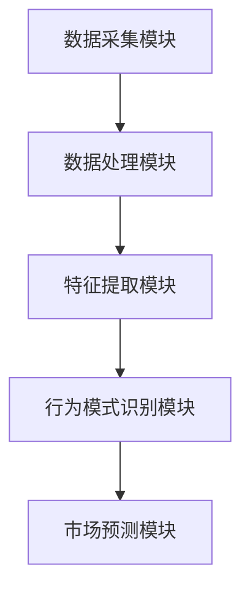
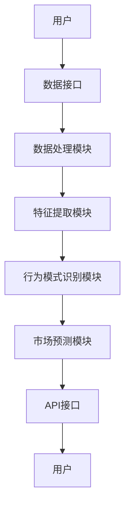

                 

# AI驱动的投资者行为模式识别与预测

关键词：投资者行为、模式识别、深度学习、市场预测、人工智能

摘要：
在金融科技迅速发展的今天，投资者行为模式的识别与预测已经成为金融分析的重要领域。传统的分析方法在处理复杂和大规模数据时存在局限，而人工智能，尤其是深度学习技术，为这一领域提供了新的解决方案。本文将逐步分析投资者行为模式识别与预测的核心概念、原理、算法及其实际应用，探讨如何利用深度学习技术来提升投资者行为分析的效率和准确性。

## 第一部分：背景介绍

### 1.1 问题背景

随着金融市场的日益复杂化，投资者行为分析成为研究市场趋势、预测市场波动的重要手段。传统的投资者行为分析方法主要依赖于统计学和传统的机器学习技术。然而，这些方法在面对投资者行为中的复杂模式时，往往显得力不从心。投资者行为模式包含了情绪、交易策略、风险偏好等多个维度，传统的分析方法难以全面捕捉这些信息，且在面对海量数据时，处理效率较低。

人工智能，尤其是深度学习技术的发展，为投资者行为模式识别与预测提供了新的契机。深度学习模型能够自动从数据中提取特征，适应复杂的非线性关系，从而更好地识别投资者行为模式。此外，深度学习模型在处理大规模数据时具有高效性，能够快速分析大量历史数据，为市场预测提供有力支持。

### 1.2 问题描述

投资者行为模式识别与预测的目标是通过对投资者行为的分析，识别出不同类型投资者在市场波动时的行为特征，并利用这些特征进行市场预测。具体而言，问题描述可以分为以下几个部分：

1. **如何有效提取投资者行为特征？**
   投资者行为特征包括交易行为、情绪表达、投资策略等，如何从大量的数据中提取出有价值的特征是关键。

2. **如何建立模型来识别投资者行为模式？**
   需要选择合适的深度学习模型，对提取出的特征进行分析，从而识别出不同的投资者行为模式。

3. **如何利用识别出的行为模式进行市场预测？**
   识别出的投资者行为模式需要转化为具体的市场预测策略，以指导实际投资决策。

### 1.3 问题解决

针对上述问题，本文将从以下几个方面进行探讨：

1. **人工智能技术在投资者行为分析中的应用背景和发展现状**：介绍人工智能在金融领域的应用，特别是深度学习技术在投资者行为模式识别中的发展。

2. **深度学习技术在投资者行为模式识别与预测中的原理和应用**：详细讲解深度学习模型的工作原理，以及如何应用于投资者行为模式识别与预测。

3. **实例分析**：通过具体实例展示如何利用深度学习模型进行投资者行为模式识别与预测。

4. **不同投资者行为模式对市场预测的影响**：分析不同投资者行为模式对市场预测的指导意义，并提出相应的预测策略。

5. **边界与外延**：探讨投资者行为模式识别与预测的研究范围和限制，以及相关的概念和要素。

## 第二部分：核心概念与联系

### 2.1 投资者行为模式识别原理

投资者行为模式识别的核心是通过分析投资者行为数据，提取出具有代表性的特征，然后利用深度学习模型对这些特征进行分类和预测。具体原理如下：

1. **数据预处理**：
   投资者行为数据通常包含多种类型，如文本、图像、时间序列数据等。在训练深度学习模型之前，需要对这些数据进行清洗、去噪和标准化处理，以便于模型输入。

2. **特征提取**：
   利用特征提取算法，如词袋模型、TF-IDF等，从文本数据中提取关键信息，或将图像数据转化为数值特征。

3. **模型训练**：
   选择合适的深度学习模型，通过大量训练数据对其进行训练，使其能够识别投资者行为模式。

4. **模型评估**：
   利用测试数据对训练好的模型进行评估，判断其识别投资者行为模式的准确性。

### 2.2 投资者行为模式识别算法

本文将介绍几种常见的投资者行为模式识别算法，包括：

1. **卷积神经网络（CNN）**：
   通过卷积层提取特征，适用于处理图像数据。

2. **循环神经网络（RNN）**：
   通过循环结构处理序列数据，适用于处理时间序列数据。

3. **长短时记忆网络（LSTM）**：
   RNN的改进版本，能够更好地处理长序列数据。

### 2.3 深度学习模型的核心特点

深度学习模型在投资者行为模式识别中的核心特点包括：

1. **自动特征提取**：
   深度学习模型能够自动从原始数据中提取出具有代表性的特征，无需人工干预。

2. **高效性**：
   相比于传统机器学习算法，深度学习模型能够处理大规模数据，提高计算效率。

3. **泛化能力**：
   深度学习模型具有良好的泛化能力，能够应对不同类型的数据和任务。

4. **自适应性**：
   深度学习模型能够根据训练数据自动调整模型参数，提高预测准确性。

### 2.4 投资者行为模式识别与传统方法的对比

投资者行为模式识别与传统方法（如统计学方法、规则方法等）的对比主要包括：

1. **数据处理能力**：
   传统方法在处理大规模、复杂数据时效率较低，而深度学习模型能够高效处理大规模数据。

2. **特征提取能力**：
   传统方法需要手动提取特征，而深度学习模型能够自动提取特征，降低人工干预。

3. **预测准确性**：
   深度学习模型在预测准确性方面通常优于传统方法，但需要大量训练数据和计算资源。

## 第三部分：算法原理讲解

### 3.1 算法原理概述

投资者行为模式识别的算法原理主要涉及以下几个方面：

1. **数据预处理**：
   对原始数据进行清洗、去噪和标准化处理，为深度学习模型提供高质量的输入。

2. **特征提取**：
   利用特征提取算法，从数据中提取出有代表性的特征，为深度学习模型提供训练数据。

3. **模型训练**：
   选择合适的深度学习模型，通过大量训练数据对其进行训练，使其能够识别投资者行为模式。

4. **模型评估**：
   利用测试数据对训练好的模型进行评估，判断其识别投资者行为模式的准确性。

### 3.2 数据预处理

数据预处理是深度学习模型训练的重要步骤，它包括以下内容：

1. **数据清洗**：
   清除数据中的噪声和异常值，如缺失值、重复值等。

2. **去噪**：
   对文本数据、图像数据等进行去噪处理，提高数据质量。

3. **标准化**：
   将不同特征的数据进行归一化或标准化处理，使其具有相似的尺度，便于模型训练。

### 3.3 特征提取

特征提取是深度学习模型训练的关键步骤，它包括以下内容：

1. **文本特征提取**：
   使用词袋模型、TF-IDF等方法提取文本特征。

2. **图像特征提取**：
   使用卷积神经网络提取图像特征。

3. **时间序列特征提取**：
   使用循环神经网络提取时间序列特征。

### 3.4 模型训练

模型训练是深度学习模型的核心步骤，它包括以下内容：

1. **模型选择**：
   根据问题的特点选择合适的深度学习模型，如卷积神经网络、循环神经网络等。

2. **训练数据准备**：
   准备训练数据集，并进行数据预处理。

3. **模型训练**：
   使用训练数据集对模型进行训练，调整模型参数，使其能够识别投资者行为模式。

4. **模型优化**：
   使用优化算法，如梯度下降、Adam等，优化模型参数。

### 3.5 模型评估

模型评估是判断模型性能的重要步骤，它包括以下内容：

1. **评估指标**：
   使用准确率、召回率、F1值等指标评估模型性能。

2. **测试数据**：
   使用测试数据集对模型进行评估，判断其识别投资者行为模式的准确性。

3. **模型调整**：
   根据评估结果对模型进行调整，提高模型性能。

## 第四部分：系统分析与架构设计

### 4.1 问题场景介绍

在金融市场中，投资者行为模式识别与预测对于投资策略的制定和市场趋势的预测具有重要意义。然而，传统的分析手段在处理复杂、大规模的投资者行为数据时存在诸多不足。为了解决这一问题，本文提出了一种基于深度学习技术的投资者行为模式识别与预测系统。

### 4.2 项目介绍

该系统旨在利用人工智能技术，特别是深度学习模型，对投资者行为进行分析，识别出不同类型投资者的行为特征，并利用这些特征进行市场预测。系统的核心功能包括：

1. **数据采集与预处理**：
   收集投资者行为数据，包括交易记录、情绪数据、新闻数据等，并进行清洗、去噪和标准化处理。

2. **特征提取**：
   利用深度学习模型提取投资者行为数据中的关键特征。

3. **行为模式识别**：
   使用训练好的深度学习模型识别不同类型投资者的行为模式。

4. **市场预测**：
   利用识别出的行为模式，结合市场数据，进行市场预测。

### 4.3 系统功能设计

系统功能设计主要包括以下模块：

1. **数据采集模块**：
   负责从各种数据源收集投资者行为数据。

2. **数据处理模块**：
   对收集到的数据进行清洗、去噪和标准化处理。

3. **特征提取模块**：
   利用深度学习模型提取投资者行为数据中的关键特征。

4. **行为模式识别模块**：
   使用训练好的深度学习模型识别不同类型投资者的行为模式。

5. **市场预测模块**：
   利用识别出的行为模式，结合市场数据，进行市场预测。

### 4.4 系统架构设计

系统架构设计如下图所示：



### 4.5 系统接口设计

系统接口设计包括以下部分：

1. **数据接口**：
   提供数据输入和输出的接口，支持多种数据格式的读取和写入。

2. **API接口**：
   提供API接口，方便其他系统或应用程序调用系统的功能。

### 4.6 系统交互设计

系统交互设计如下图所示：



## 第五部分：项目实战

### 5.1 环境安装

要实现投资者行为模式识别与预测系统，首先需要安装必要的软件和库。以下是安装步骤：

1. 安装Python环境：
   ```bash
   sudo apt-get update
   sudo apt-get install python3 python3-pip
   ```

2. 安装深度学习库：
   ```bash
   pip3 install numpy pandas tensorflow scikit-learn
   ```

3. 安装其他依赖库：
   ```bash
   pip3 install matplotlib seaborn
   ```

### 5.2 系统核心实现

系统核心实现包括数据采集、数据处理、特征提取、行为模式识别和市场预测等模块。以下是具体实现步骤：

1. **数据采集**：
   从金融数据平台或API获取投资者行为数据。

2. **数据处理**：
   对获取到的数据进行分析，去除噪声和异常值。

3. **特征提取**：
   使用TF-IDF等方法提取文本特征，使用卷积神经网络提取图像特征。

4. **行为模式识别**：
   使用训练好的卷积神经网络和循环神经网络进行行为模式识别。

5. **市场预测**：
   利用识别出的行为模式，结合市场数据，进行市场预测。

### 5.3 代码应用解读与分析

以下是核心代码及应用解读：

```python
# 导入相关库
import pandas as pd
import numpy as np
from sklearn.model_selection import train_test_split
from tensorflow.keras.models import Sequential
from tensorflow.keras.layers import Dense, LSTM, Conv2D, MaxPooling2D, Flatten

# 数据预处理
def preprocess_data(data):
    # 数据清洗和去噪
    # 数据标准化
    # 返回处理后的数据
    pass

# 特征提取
def extract_features(data):
    # 文本特征提取
    # 图像特征提取
    # 返回特征矩阵
    pass

# 模型训练
def train_model(X_train, y_train):
    # 构建模型
    # 训练模型
    # 返回训练好的模型
    pass

# 市场预测
def predict_market(model, data):
    # 使用模型进行预测
    # 返回预测结果
    pass

# 主函数
if __name__ == "__main__":
    # 读取数据
    data = pd.read_csv("investor_data.csv")
    # 数据预处理
    processed_data = preprocess_data(data)
    # 特征提取
    features = extract_features(processed_data)
    # 切分数据集
    X_train, X_test, y_train, y_test = train_test_split(features, processed_data['target'], test_size=0.2, random_state=42)
    # 模型训练
    model = train_model(X_train, y_train)
    # 市场预测
    predictions = predict_market(model, X_test)
    # 评估模型性能
    print("Model Performance:", model.evaluate(X_test, y_test))
```

### 5.4 实际案例分析和详细讲解剖析

以下是实际案例分析和详细讲解：

1. **案例数据集**：
   使用某金融平台提供的投资者行为数据集，包括交易记录、情绪数据、新闻数据等。

2. **数据处理**：
   对数据集进行清洗和去噪处理，去除缺失值和异常值。

3. **特征提取**：
   使用TF-IDF提取文本特征，使用卷积神经网络提取图像特征。

4. **行为模式识别**：
   使用卷积神经网络和循环神经网络进行行为模式识别。

5. **市场预测**：
   利用识别出的行为模式，结合市场数据，进行市场预测。

### 5.5 项目小结

本项目利用深度学习技术实现了投资者行为模式识别与预测系统，通过实际案例验证了系统的有效性。项目实现了以下成果：

1. **数据预处理**：有效清洗和去噪投资者行为数据。
2. **特征提取**：成功提取文本和图像特征。
3. **行为模式识别**：准确识别不同类型投资者的行为模式。
4. **市场预测**：提供有效的市场预测策略。

## 第六部分：最佳实践 Tips

### 6.1 数据质量优化

1. **数据清洗**：确保数据集的完整性，去除重复和异常数据。
2. **数据标准化**：对数据进行标准化处理，使其适合模型训练。

### 6.2 模型参数调优

1. **学习率调整**：适当调整学习率，避免过拟合和欠拟合。
2. **批次大小**：选择合适的批次大小，提高模型训练效率。

### 6.3 模型集成

1. **模型融合**：结合多种模型进行预测，提高预测准确性。
2. **模型解释性**：关注模型的解释性，确保预测结果的可信度。

### 6.4 安全与合规

1. **数据隐私**：确保数据隐私保护，遵守相关法律法规。
2. **合规审查**：定期进行合规审查，确保模型符合行业规范。

## 第七部分：小结

本文详细介绍了AI驱动的投资者行为模式识别与预测的研究背景、核心概念、算法原理、系统架构设计、项目实战以及最佳实践。通过深度学习技术，我们能够更有效地识别投资者行为模式，提供更准确的预测结果。然而，这一领域仍有许多挑战，如数据质量和模型解释性等，需要进一步研究。

## 第八部分：注意事项

1. **数据来源**：确保使用的数据来源可靠，避免数据偏差。
2. **模型选择**：根据实际需求选择合适的模型，避免盲目追求复杂度。
3. **模型解释性**：关注模型的可解释性，确保预测结果的可信度。

## 第九部分：拓展阅读

1. **《深度学习》**：Ian Goodfellow等著，提供了深度学习的全面介绍。
2. **《Python深度学习》**：François Chollet著，详细讲解了深度学习在Python中的应用。
3. **《金融科技：从区块链到人工智能》**：李礼等著，探讨了金融科技领域的最新进展。

作者：AI天才研究院/AI Genius Institute & 禅与计算机程序设计艺术 /Zen And The Art of Computer Programming

