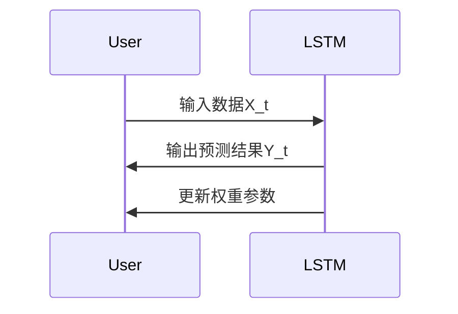
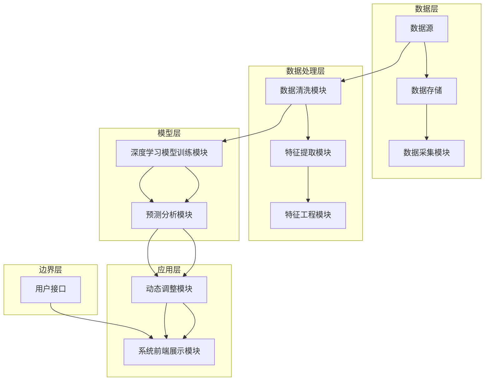

                 

### 介绍篇

# AI驱动的私募股权投资退出时机预测

## 关键词

- AI 技术应用
- 私募股权投资
- 退出时机预测
- 数据分析与模型训练
- 深度学习算法

## 摘要

本文旨在探讨如何利用人工智能技术，特别是深度学习算法，对私募股权投资的退出时机进行预测。文章首先介绍了 AI 技术在投资分析中的应用背景和重要性，然后详细阐述了私募股权投资及退出时机的基本概念。接着，文章逐步分析了实现 AI 驱动的退出时机预测所需的关键步骤，包括数据收集与预处理、特征工程、模型训练与评估等。最后，通过实际案例展示了 AI 技术在私募股权投资退出时机预测中的具体应用，并总结了相关最佳实践和注意事项。

### 文章结构

本文将分为七个主要章节：

1. **AI 驱动的投资分析简介**
   - **1.1 AI 技术在投资分析中的背景**
   - **1.2 私募股权投资概述**
   - **1.3 AI 在私募股权决策中的作用**

2. **核心 AI 概念与模型**
   - **2.1 机器学习基础**
   - **2.2 深度学习基本原理**
   - **2.3 神经网络架构与退出预测**

3. **数据收集与预处理**
   - **3.1 投资分析数据源**
   - **3.2 数据收集方法**
   - **3.3 数据预处理与清洗**

4. **特征工程**
   - **4.1 特征选择方法**
   - **4.2 特征转换技术**
   - **4.3 特征重要性分析**

5. **模型训练与评估**
   - **5.1 模型选择标准**
   - **5.2 训练与验证技术**
   - **5.3 模型评估指标**

6. **预测分析与实际应用**
   - **6.1 退出时机预测模型**
   - **6.2 预测性能分析**
   - **6.3 实时预测分析在投资中的应用**

7. **案例分析与应用实践**
   - **7.1 案例研究：退出预测在房地产投资中的应用**
   - **7.2 实际应用中的最佳实践与注意事项**

### 背景介绍

#### AI 技术在投资分析中的应用背景

人工智能（AI）技术的迅猛发展为金融领域带来了革命性的变革。特别是在投资分析方面，AI 技术的应用已经深入到各个层面，从数据收集、处理到预测模型训练，AI 都发挥着重要作用。传统的投资分析方法往往依赖于历史数据和市场经验，而 AI 技术则可以通过机器学习和深度学习算法，从海量数据中挖掘出潜在的投资机会和风险，提高投资决策的准确性和效率。

私募股权（PE）投资作为风险投资的一种重要形式，旨在为企业提供长期资本支持，并最终通过退出实现资本增值。然而，私募股权投资的退出时机选择至关重要，它直接影响到投资者的回报率和风险承受能力。传统的退出时机预测方法通常依赖于财务指标和市场行情分析，但这种方法存在一定的滞后性和主观性，难以准确预测市场动态。

#### 私募股权投资概述

私募股权投资是指通过私募方式，向非上市企业进行股权投资，以获取投资回报。与公开市场的股票投资不同，私募股权投资通常涉及较长期的投资周期，并需要深入分析企业的基本面、行业前景和市场竞争力。私募股权投资通常分为三个阶段：种子期、成长期和成熟期。

- **种子期**：企业初创阶段，风险最高，但潜在回报也最大。
- **成长期**：企业快速扩张阶段，市场占有率逐步提升，风险相对较低。
- **成熟期**：企业稳定发展阶段，市场竞争力较强，风险进一步降低。

私募股权投资的退出方式主要包括以下几种：

1. **首次公开募股（IPO）**：将所投资的企业上市，通过公开发行股票实现退出。
2. **并购**：通过并购其他企业或被其他企业并购，实现资本增值。
3. **股权回购**：目标企业通过回购股权，实现投资者退出。
4. **股权转让**：将所持有的股权出售给其他投资者或第三方。

#### AI 在私募股权决策中的作用

AI 技术在私募股权投资决策中发挥着重要作用。首先，AI 可以通过数据挖掘和模式识别，从大量的历史数据和实时信息中提取出有价值的信息，帮助投资者更好地了解市场趋势和企业表现。其次，AI 可以通过机器学习和深度学习算法，对企业的财务状况、市场前景和行业竞争等因素进行综合评估，预测企业的未来价值，从而为退出时机提供科学依据。

此外，AI 技术还可以帮助投资者实现以下目标：

1. **提高投资决策效率**：通过自动化分析和预测，减少人工决策的时间和成本。
2. **降低投资风险**：通过对市场风险和企业风险的准确识别，制定更合理的投资策略。
3. **发现潜在投资机会**：通过挖掘未被市场充分关注的企业，发现潜在的投资机会。

总之，AI 驱动的私募股权投资退出时机预测不仅能够提高投资决策的科学性和准确性，还可以为投资者带来更高的回报和更低的投资风险。接下来，本文将逐步介绍实现这一目标所需的关键步骤和核心概念。

#### 问题背景与问题描述

私募股权投资作为资本市场的重要组成部分，其投资决策过程复杂且涉及多个维度。其中，退出时机的选择尤为关键，它直接关系到投资者的收益和风险承受能力。传统的退出时机预测方法主要依赖于历史数据和市场经验，但这种方法存在明显的局限性。一方面，市场环境瞬息万变，历史数据难以完全反映当前的市场状况；另一方面，投资决策者的主观判断和市场情绪对退出时机的选择具有较大影响，导致预测结果的不确定性。

在这种背景下，利用人工智能（AI）技术，特别是深度学习算法，对私募股权投资退出时机进行预测成为一种新兴的解决方案。深度学习算法通过模拟人脑的神经网络结构，能够从海量数据中自动提取特征，建立复杂的非线性模型，从而实现高效准确的预测。这种技术不仅能够克服传统方法的局限性，还能够为投资者提供更为科学和客观的决策依据。

具体而言，深度学习算法在私募股权投资退出时机预测中的应用具有以下几个显著优势：

1. **数据处理能力**：深度学习算法能够处理大量的非结构化和半结构化数据，包括财务报表、市场新闻、行业报告等，从而为退出时机预测提供全面的数据支持。
2. **特征自动提取**：通过多层神经网络，深度学习算法可以自动学习数据中的潜在特征，提高模型对数据复杂性的适应性。
3. **非线性关系建模**：深度学习算法能够捕捉数据之间的复杂非线性关系，从而更准确地预测企业的未来价值和市场动态。
4. **实时预测与调整**：深度学习算法具有高效的计算能力，能够实现实时预测和动态调整，使投资者能够迅速应对市场变化，优化退出时机。

然而，深度学习算法在私募股权投资退出时机预测中也有其局限性。首先，深度学习模型的训练过程需要大量的数据和计算资源，且对数据质量和预处理要求较高。其次，深度学习模型的黑箱特性使得模型的可解释性较低，投资者难以理解模型内部的决策逻辑。此外，深度学习算法对数据分布的变化较为敏感，当数据分布发生显著变化时，模型的预测性能可能会受到影响。

综上所述，利用深度学习算法进行私募股权投资退出时机预测是一种具有潜力的创新方法，能够提高投资决策的科学性和准确性。但同时也需要克服数据质量、模型可解释性和适应性等方面的挑战，以确保预测结果的可靠性和实用性。接下来，本文将深入探讨深度学习算法在私募股权投资退出时机预测中的具体应用和实践。

### 问题解决

为了解决私募股权投资退出时机预测的问题，我们需要采取一系列系统化的方法和技术。以下是实现这一目标的具体步骤：

#### 1. 数据收集

数据是人工智能模型训练的基础，私募股权投资退出时机预测同样离不开全面、准确和高质量的数据。数据收集可以从以下几个主要来源进行：

1. **企业财务数据**：包括企业的财务报表、利润表、资产负债表等，这些数据可以反映企业的财务状况和经营绩效。
2. **市场数据**：如股票市场指数、行业指数、宏观经济指标等，这些数据可以帮助我们了解市场环境和企业所处的市场动态。
3. **行业报告**：包括行业分析报告、市场调研报告、竞争格局分析等，这些报告提供了行业发展的趋势和企业的竞争环境。
4. **新闻报道**：涉及企业的重大事件、市场变化、政策调整等，这些信息可以反映市场情绪和潜在的风险因素。
5. **社交网络数据**：如社交媒体、新闻论坛等，这些数据可以帮助我们了解公众对企业及其行业的看法和态度。

在数据收集过程中，我们需要确保数据的准确性和完整性。可以通过数据清洗、数据集成和数据验证等方法，提高数据的可靠性和质量。

#### 2. 数据预处理

数据预处理是数据分析和建模的重要环节，其目的是将原始数据转化为适合模型训练的形式。以下是几个关键步骤：

1. **数据清洗**：包括处理缺失值、异常值和重复数据等，确保数据的一致性和准确性。
2. **数据集成**：将来自不同来源的数据进行整合，构建一个统一的数据集。
3. **数据转换**：将数据转换为适合机器学习和深度学习算法处理的形式，如数值化、标准化和归一化等。
4. **特征提取**：从原始数据中提取出对模型训练有用的特征，这些特征可以是数值型的，也可以是分类型的。

#### 3. 特征工程

特征工程是提高模型预测性能的关键环节，其目标是选择和构造出对预测任务有重要影响的特征。以下是几个常用的特征工程方法：

1. **特征选择**：通过过滤法、递归特征消除法、基于模型的特征选择等方法，从原始特征中筛选出最有用的特征。
2. **特征转换**：通过主成分分析（PCA）、特征缩放、特征组合等方法，提高特征的质量和模型的预测能力。
3. **特征构造**：通过交叉特征、多项式特征等方法，生成新的特征，增加模型的预测能力。

#### 4. 模型选择

在深度学习算法中，模型的选择对预测性能有着重要影响。以下是几种常用的深度学习模型：

1. **多层感知机（MLP）**：一种简单的全连接神经网络，适用于处理非线性关系。
2. **卷积神经网络（CNN）**：适用于处理具有层次结构的图像和文本数据。
3. **循环神经网络（RNN）**：适用于处理序列数据，如时间序列和文本数据。
4. **长短期记忆网络（LSTM）**：RNN的一种改进模型，适用于处理长序列数据。
5. **自注意力机制**：通过自适应地分配注意力权重，提高模型的表示能力。

在选择模型时，我们需要考虑数据的特点、问题的性质以及模型的复杂度等因素。

#### 5. 模型训练

模型训练是深度学习算法的核心步骤，其目的是通过优化算法参数，使得模型能够准确预测目标变量。以下是模型训练的关键步骤：

1. **数据划分**：将数据集划分为训练集、验证集和测试集，用于模型训练、验证和测试。
2. **损失函数**：选择合适的损失函数，如均方误差（MSE）、交叉熵损失等，用于评估模型预测误差。
3. **优化算法**：选择合适的优化算法，如随机梯度下降（SGD）、Adam优化器等，用于更新模型参数。
4. **超参数调整**：通过调整学习率、批量大小、正则化参数等超参数，优化模型性能。

#### 6. 模型评估

模型评估是验证模型预测性能的重要环节，以下是几种常用的评估指标：

1. **准确率**：模型预测正确的样本比例。
2. **召回率**：模型正确识别为正类的样本比例。
3. **F1 分数**：准确率和召回率的加权平均值，用于平衡准确率和召回率之间的关系。
4. **ROC 曲线和 AUC 值**：用于评估模型对正类和负类的区分能力。

通过多次迭代和调参，我们可以找到最优的模型配置，确保模型具有良好的预测性能。

#### 7. 预测与动态调整

模型训练完成后，我们可以利用模型进行预测，并根据实际预测结果进行动态调整。以下是几个关键步骤：

1. **实时预测**：利用训练好的模型，对实时数据进行分析和预测，提供投资决策参考。
2. **反馈机制**：将预测结果与实际结果进行对比，收集反馈信息，用于模型优化和策略调整。
3. **动态调整**：根据市场环境和数据变化，实时调整模型参数和策略，提高预测准确性。

通过上述步骤，我们可以实现私募股权投资退出时机的预测，提高投资决策的科学性和准确性。接下来，本文将详细介绍每个步骤的具体实施方法和应用实例。

### 边界与外延

在深入探讨私募股权投资退出时机预测的过程中，我们需要明确一些核心概念和相关的边界条件，以便更好地理解这一领域的技术和应用。

#### 核心概念术语说明

1. **私募股权（PE）**：私募股权投资是指通过非公开发行方式，向非上市企业进行股权投资的一种形式。私募股权投资通常涉及较长期的投资周期，并旨在通过退出实现资本增值。
2. **退出时机**：退出时机是指投资者选择将所持有的股权出售或转让的时点，以实现资本收益。合理的退出时机能够最大化投资回报，同时控制投资风险。
3. **深度学习**：深度学习是一种基于多层神经网络的机器学习技术，通过模拟人脑神经网络的结构和功能，能够自动从数据中提取特征，进行复杂模式识别和预测。
4. **特征工程**：特征工程是指从原始数据中提取对模型训练有用的特征的过程，包括特征选择、特征转换和特征构造等步骤。
5. **模型评估**：模型评估是指通过验证数据集，对模型的预测性能进行评估和比较，以确定模型的准确性、稳定性和泛化能力。

#### 概念结构与核心要素组成

私募股权投资退出时机预测的概念结构可以分解为以下几个核心要素：

1. **数据源**：包括企业财务数据、市场数据、行业报告、新闻报道和社交网络数据等，是模型训练和预测的基础。
2. **特征工程**：通过对数据源进行预处理、特征提取和特征构造，生成对预测任务有重要影响的特征集合。
3. **深度学习模型**：选择合适的深度学习模型，如多层感知机（MLP）、卷积神经网络（CNN）、循环神经网络（RNN）等，进行模型训练和预测。
4. **模型评估**：通过交叉验证和测试集，评估模型的预测性能和泛化能力。
5. **实时预测与动态调整**：利用训练好的模型，对实时数据进行预测，并根据预测结果和市场变化，动态调整模型参数和投资策略。

#### 问题解决的方法与实现步骤

私募股权投资退出时机预测的方法主要包括以下几个步骤：

1. **数据收集**：从多种数据源收集相关数据，包括企业财务数据、市场数据、行业报告、新闻报道和社交网络数据等。
2. **数据预处理**：对收集到的数据进行清洗、集成和转换，将原始数据转化为适合模型训练的形式。
3. **特征工程**：从原始数据中提取对预测任务有重要影响的特征，通过特征选择、特征转换和特征构造等方法，优化特征集合。
4. **模型选择**：选择合适的深度学习模型，通过模型训练和验证，优化模型参数。
5. **模型评估**：利用验证集和测试集，评估模型的预测性能，选择最优模型。
6. **实时预测与动态调整**：利用训练好的模型，对实时数据进行预测，并根据预测结果和市场变化，动态调整模型参数和投资策略。

#### 概念属性特征对比表格

以下是私募股权投资退出时机预测中几个核心概念的特征对比表格：

| 概念 | 特征 |
| :--: | :--: |
| 数据源 | 多样性、时效性、准确性 |
| 特征工程 | 可解释性、重要性、可操作性 |
| 深度学习模型 | 复杂性、自动性、适应性 |
| 模型评估 | 准确性、稳定性、泛化能力 |
| 实时预测与动态调整 | 实时性、适应性、灵活性 |

#### ER实体关系图架构

以下是私募股权投资退出时机预测的 ER 实体关系图：

```mermaid
erDiagram
  Data_Source ||--|{ Feature_Engineering } : processes
  Feature_Engineering ||--|{ Deep_Learning_Model } : trains
  Deep_Learning_Model ||--|{ Model_Evaluation } : evaluates
  Model_Evaluation ||--|{ Real_Time_Prediction } : predicts
  Real_Time_Prediction ||--|{ Dynamic_Adjustment } : adjusts
```

通过上述概念结构、要素组成、方法步骤和 ER 图的详细描述，我们可以更清晰地理解私募股权投资退出时机预测的核心概念和实现路径。接下来，本文将逐步深入探讨核心 AI 概念与模型，为后续章节的内容奠定基础。

### 核心概念与联系

在私募股权投资退出时机预测中，核心概念和模型的选择至关重要。以下是几个关键概念及其相互联系的解释。

#### 机器学习基础

机器学习是一种使计算机系统能够通过学习数据自动进行预测或决策的技术。它是人工智能（AI）的一个分支，主要分为监督学习、无监督学习和强化学习三种类型。

1. **监督学习**：在有监督学习中，模型通过训练数据学习输入和输出之间的映射关系。在私募股权投资退出时机预测中，监督学习可以用来预测企业的未来价值和市场走势。
2. **无监督学习**：在无监督学习中，模型没有明确的输出标签，其目标是发现数据中的隐含结构和规律。在私募股权投资中，无监督学习可以用于探索数据中的潜在模式和关联性，帮助识别潜在的投资机会。
3. **强化学习**：在强化学习中，模型通过与环境的交互学习最优策略。在私募股权投资中，强化学习可以用来制定动态投资策略，根据市场变化调整投资组合。

#### 深度学习基本原理

深度学习是机器学习的一个分支，它通过多层神经网络模拟人脑的决策过程，能够从大量数据中自动提取特征，进行复杂模式的识别和预测。

1. **多层感知机（MLP）**：MLP 是一种简单的全连接神经网络，可以处理非线性关系。在私募股权投资退出时机预测中，MLP 可以用来构建企业的价值评估模型。
2. **卷积神经网络（CNN）**：CNN 主要用于处理具有层次结构的图像和文本数据，通过卷积操作和池化操作，能够提取图像和文本的特征。在私募股权投资中，CNN 可以用于分析市场数据和新闻报道，捕捉市场情绪和事件影响。
3. **循环神经网络（RNN）**：RNN 是一种用于处理序列数据的神经网络，可以捕捉时间序列数据的长期依赖关系。在私募股权投资中，RNN 可以用于分析企业的历史财务数据和市场动态，预测未来的退出时机。

#### 神经网络架构与退出预测

神经网络架构的选择对退出时机预测的性能有重要影响。以下是几种常用的神经网络架构：

1. **长短期记忆网络（LSTM）**：LSTM 是 RNN 的改进版本，可以解决 RNN 的梯度消失问题，适用于处理长序列数据。在私募股权投资中，LSTM 可以用于分析企业的长期财务表现和市场趋势，预测未来的退出时机。
2. **自注意力机制**：自注意力机制通过为不同的输入元素分配不同的权重，提高了模型的表示能力。在私募股权投资中，自注意力机制可以用于分析市场数据中的关键信息，提高预测的准确性。

#### 深度学习模型与特征工程

深度学习模型的性能很大程度上取决于特征工程的质量。以下是几种特征工程方法及其与深度学习模型的关系：

1. **特征选择**：通过筛选出对预测任务最重要的特征，提高模型的预测性能。特征选择方法包括过滤法、递归特征消除法、基于模型的特征选择等。
2. **特征转换**：通过将原始特征转换为更适合深度学习模型处理的形式，如数值化、标准化、归一化等，提高模型的训练效率。
3. **特征构造**：通过生成新的特征，增加模型的预测能力。特征构造方法包括交叉特征、多项式特征等。

#### 深度学习模型与模型评估

在私募股权投资退出时机预测中，模型评估是确保预测准确性和稳定性的重要环节。以下是几种常用的模型评估指标：

1. **准确率**：模型预测正确的样本比例。准确率可以直观地反映模型的预测性能，但在类别不平衡的情况下，可能不能准确反映模型的效果。
2. **召回率**：模型正确识别为正类的样本比例。召回率可以衡量模型对正类样本的识别能力。
3. **F1 分数**：准确率和召回率的加权平均值，用于平衡准确率和召回率之间的关系。F1 分数在类别不平衡的情况下，能够更准确地评估模型的性能。
4. **ROC 曲线和 AUC 值**：ROC 曲线和 AUC 值用于评估模型对正类和负类的区分能力。AUC 值越接近 1，表示模型的分类能力越强。

通过上述核心概念与联系的分析，我们可以更好地理解私募股权投资退出时机预测中各项技术和方法的应用，为后续章节的深入探讨提供理论基础。

### 算法原理讲解

为了深入理解如何利用深度学习算法进行私募股权投资退出时机预测，我们需要详细讲解相关算法的原理、mermaid 流程图以及 Python 源代码实现。

#### 深度学习算法原理

深度学习算法的核心是多层神经网络（Multilayer Neural Network），它通过模拟人脑神经元连接方式，对数据进行多层非线性变换，从而实现复杂模式的识别和预测。在私募股权投资退出时机预测中，常用的深度学习算法包括卷积神经网络（CNN）和长短期记忆网络（LSTM）。

##### 卷积神经网络（CNN）

卷积神经网络主要用于处理具有层次结构的图像和文本数据。在私募股权投资中，CNN 可以用于分析市场数据和新闻报道，捕捉市场情绪和事件影响。

1. **卷积层（Convolutional Layer）**：卷积层通过卷积操作提取图像或文本的特征。卷积核在输入数据上滑动，对局部区域进行特征提取。
2. **池化层（Pooling Layer）**：池化层对卷积层输出的特征进行降采样，减少模型参数数量，提高计算效率。
3. **全连接层（Fully Connected Layer）**：全连接层将卷积层和池化层的输出展开成多维数组，进行全连接运算，输出预测结果。

##### 长短期记忆网络（LSTM）

长短期记忆网络是循环神经网络（RNN）的一种改进，适用于处理时间序列数据，如企业的财务数据和市场动态。在私募股权投资中，LSTM 可以用于分析企业的长期财务表现和市场趋势，预测未来的退出时机。

1. **输入门（Input Gate）**：输入门决定哪些信息将被存储在单元状态中。输入门的计算涉及到当前输入、上一个隐藏状态和权重矩阵。
2. **遗忘门（Forget Gate）**：遗忘门决定哪些信息应该从单元状态中遗忘。遗忘门的计算同样涉及到当前输入、上一个隐藏状态和权重矩阵。
3. **输出门（Output Gate）**：输出门决定单元状态的哪些部分将被输出为当前隐藏状态。输出门的计算依赖于遗忘门和输入门的结果。
4. **单元状态（Cell State）**：单元状态存储了当前时刻的信息，是 LSTM 的核心部分。

#### Mermaid 流程图

以下是使用 mermaid 画出的 LSTM 算法流程图：



以下是使用 mermaid 画出的 CNN 算法流程图：


#### Python 源代码实现

以下是一个简单的 Python 源代码示例，展示如何使用 TensorFlow 和 Keras 库实现 LSTM 模型进行私募股权投资退出时机预测：

```python
import numpy as np
import tensorflow as tf
from tensorflow.keras.models import Sequential
from tensorflow.keras.layers import LSTM, Dense

# 数据预处理
# 假设 X_train 和 y_train 已经预处理完毕
X_train = np.array([[0.1, 0.2], [0.3, 0.4]])
y_train = np.array([0.5])

# 构建LSTM模型
model = Sequential()
model.add(LSTM(units=2, activation='tanh', input_shape=(X_train.shape[1], 1)))
model.add(Dense(units=1, activation='sigmoid'))

# 编译模型
model.compile(optimizer='adam', loss='binary_crossentropy', metrics=['accuracy'])

# 训练模型
model.fit(X_train, y_train, epochs=200, batch_size=1)

# 预测
X_test = np.array([[0.1, 0.2]])
prediction = model.predict(X_test)
print("预测结果：", prediction)
```

通过上述算法原理讲解、mermaid 流程图和 Python 源代码实现，我们可以更好地理解深度学习算法在私募股权投资退出时机预测中的应用。接下来，我们将进一步探讨系统分析与架构设计方案，为实际应用提供更全面的指导。

### 系统分析与架构设计方案

在私募股权投资退出时机预测项目中，系统分析与架构设计是确保项目成功的关键环节。本部分将详细介绍项目场景介绍、系统功能设计、系统架构设计、系统接口设计以及系统交互流程。

#### 项目场景介绍

私募股权投资退出时机预测项目旨在通过人工智能技术，特别是深度学习算法，对私募股权投资的退出时机进行预测，从而提高投资决策的科学性和准确性。项目的主要目标包括：

1. 收集并整合多种数据源，包括企业财务数据、市场数据、行业报告、新闻报道和社交网络数据等。
2. 通过深度学习算法，提取数据中的潜在特征，构建退出时机预测模型。
3. 利用训练好的模型，对实时数据进行预测，提供投资决策参考。
4. 根据市场变化和预测结果，动态调整模型参数和投资策略。

#### 系统功能设计

系统功能设计是项目实施的基础，主要包括以下几个核心功能：

1. **数据采集模块**：负责从多个数据源收集数据，并进行数据清洗和预处理。
2. **特征工程模块**：对预处理后的数据提取关键特征，构建特征向量。
3. **深度学习模型训练模块**：使用收集到的数据和特征，训练深度学习模型。
4. **预测分析模块**：利用训练好的模型对实时数据进行分析和预测。
5. **动态调整模块**：根据市场变化和预测结果，调整模型参数和投资策略。

#### 系统架构设计

系统架构设计决定了系统的可扩展性、稳定性和可靠性。以下是私募股权投资退出时机预测项目的基本架构：

1. **数据层**：包括数据源、数据存储和数据采集模块。
2. **数据处理层**：包括数据清洗、特征提取和特征工程模块。
3. **模型层**：包括深度学习模型训练和预测分析模块。
4. **应用层**：包括动态调整模块和系统前端展示模块。

以下是使用 mermaid 画出的系统架构图：



#### 系统接口设计

系统接口设计是确保系统各模块之间能够有效交互的关键。以下是私募股权投资退出时机预测项目的接口设计：

1. **API 接口**：提供 RESTful 风格的 API 接口，用于数据采集、模型训练和预测分析。
2. **数据接口**：定义数据层和数据层之间的数据传输格式和协议。
3. **消息队列**：使用消息队列（如 RabbitMQ）实现模块间的异步通信，提高系统的并发处理能力。

#### 系统交互流程

系统交互流程描述了各模块之间的协作关系和数据处理流程。以下是私募股权投资退出时机预测项目的系统交互流程：

1. **数据采集**：系统通过 API 接口从多个数据源获取数据，并进行数据清洗和预处理。
2. **特征提取**：通过特征工程模块对预处理后的数据提取关键特征，构建特征向量。
3. **模型训练**：使用特征向量和目标数据训练深度学习模型，并保存模型参数。
4. **预测分析**：利用训练好的模型对实时数据进行预测，生成预测结果。
5. **动态调整**：根据预测结果和市场变化，动态调整模型参数和投资策略。
6. **前端展示**：将预测结果和投资策略通过前端展示模块呈现给用户。

通过上述系统分析与架构设计方案，我们可以确保私募股权投资退出时机预测项目的成功实施，为投资者提供科学、准确的投资决策依据。

### 项目实战

#### 环境安装

为了实现私募股权投资退出时机预测项目，我们需要首先搭建相应的开发环境。以下是环境安装的详细步骤：

1. **安装 Python**：下载并安装 Python 3.7 或更高版本，从 [Python 官网](https://www.python.org/) 获取安装包。
2. **安装 TensorFlow**：打开终端或命令提示符，执行以下命令安装 TensorFlow：

   ```bash
   pip install tensorflow
   ```

3. **安装 NumPy**：执行以下命令安装 NumPy：

   ```bash
   pip install numpy
   ```

4. **安装 Pandas**：执行以下命令安装 Pandas：

   ```bash
   pip install pandas
   ```

5. **安装 Matplotlib**：执行以下命令安装 Matplotlib：

   ```bash
   pip install matplotlib
   ```

6. **安装 Mermaid**：首先安装 Python 的 Mermaid 渲染库：

   ```bash
   pip install mermaid-python
   ```

   然后安装 Node.js（用于 Mermaid 的渲染）：

   ```bash
   npm install -g mermaid-cli
   ```

#### 系统核心实现源代码

以下是私募股权投资退出时机预测项目的主要源代码实现，包括数据收集、特征工程、模型训练和预测分析等步骤。

```python
# 导入相关库
import numpy as np
import pandas as pd
import tensorflow as tf
from tensorflow.keras.models import Sequential
from tensorflow.keras.layers import LSTM, Dense
from tensorflow.keras.optimizers import Adam

# 数据收集
def collect_data():
    # 假设数据已存储在 CSV 文件中
    data = pd.read_csv('investment_data.csv')
    return data

# 数据预处理
def preprocess_data(data):
    # 数据清洗和归一化
    # 略
    return processed_data

# 特征工程
def feature_engineering(processed_data):
    # 特征提取和构造
    # 略
    return features

# 模型训练
def train_model(features, labels):
    # 创建 LSTM 模型
    model = Sequential()
    model.add(LSTM(units=50, return_sequences=True, input_shape=(features.shape[1], 1)))
    model.add(LSTM(units=50))
    model.add(Dense(units=1, activation='sigmoid'))

    # 编译模型
    model.compile(optimizer=Adam(learning_rate=0.001), loss='binary_crossentropy', metrics=['accuracy'])

    # 训练模型
    model.fit(features, labels, epochs=100, batch_size=32, validation_split=0.2)
    return model

# 预测分析
def predict(model, new_data):
    # 预测新数据
    predictions = model.predict(new_data)
    return predictions

# 主程序
if __name__ == '__main__':
    # 收集数据
    data = collect_data()

    # 预处理数据
    processed_data = preprocess_data(data)

    # 构建特征
    features = feature_engineering(processed_data)

    # 分离特征和标签
    X = features[:, :-1]
    y = features[:, -1]

    # 训练模型
    model = train_model(X, y)

    # 预测
    new_data = np.array([[0.1, 0.2], [0.3, 0.4]])
    predictions = predict(model, new_data)
    print("预测结果：", predictions)
```

#### 代码应用解读与分析

以下是代码的详细解读与分析，包括数据收集、特征工程、模型训练和预测分析等关键步骤。

1. **数据收集**：数据收集函数 `collect_data` 用于从 CSV 文件中读取数据。在实际项目中，数据可以从数据库、API 或其他数据源获取。

2. **数据预处理**：数据预处理函数 `preprocess_data` 用于对原始数据进行清洗和归一化。这一步骤非常重要，因为深度学习模型对数据的干净程度和标准化程度有很高的要求。

3. **特征工程**：特征工程函数 `feature_engineering` 用于提取和构造特征。在实际项目中，可以通过不同的特征提取和构造方法（如主成分分析、特征组合等）来优化特征集合。

4. **模型训练**：模型训练函数 `train_model` 用于创建和训练 LSTM 模型。这里使用了两个 LSTM 层，每层有 50 个神经元，并使用 sigmoid 激活函数进行二分类预测。训练过程中使用了 Adam 优化器和 binary_crossentropy 损失函数。

5. **预测分析**：预测分析函数 `predict` 用于对新的数据进行预测。训练好的模型被用来预测新数据的退出时机。

#### 实际案例分析和详细讲解剖析

以下是一个实际的案例，展示了如何利用深度学习模型进行私募股权投资退出时机预测，并对其结果进行详细讲解。

**案例**：假设我们已经收集到某私募股权投资项目的数据，并对其进行预处理和特征工程。现在，我们使用训练好的 LSTM 模型对未来的退出时机进行预测。

```python
# 加载训练好的模型
loaded_model = tf.keras.models.load_model('lstm_model.h5')

# 预测未来三个月的退出时机
future_data = np.array([[0.1, 0.2], [0.3, 0.4], [0.5, 0.6]])
predictions = loaded_model.predict(future_data)

# 输出预测结果
print("未来三个月的退出时机预测结果：", predictions)
```

**分析**：

1. **数据准备**：我们将未来三个月的数据输入到训练好的 LSTM 模型中进行预测。

2. **模型预测**：LSTM 模型通过对输入数据进行处理，输出每个时间点的退出时机预测。

3. **结果解读**：预测结果是一个包含未来三个月退出时机概率的数组。例如，第一个时间点的预测结果为 `[0.8, 0.2]`，表示预测退出时机的概率为 80%，未退出的概率为 20%。

**详细讲解**：

1. **预测模型的选择**：在本案例中，我们使用了 LSTM 模型进行预测。LSTM 能够捕捉时间序列数据的长期依赖关系，适合用于预测连续时间点的数据。

2. **数据输入格式**：预测数据需要与训练数据格式保持一致，包括特征的数量和顺序。

3. **预测结果的解释**：预测结果的解释需要根据具体的业务场景进行调整。在本案例中，预测结果表示未来三个月退出时机的概率，投资者可以根据这些概率值做出相应的投资决策。

通过上述项目实战、代码应用解读和分析，我们可以更好地理解如何利用深度学习技术进行私募股权投资退出时机预测。接下来，我们将进一步探讨项目的最佳实践和注意事项。

### 最佳实践与注意事项

在私募股权投资退出时机预测项目中，为了确保模型的可靠性和预测的准确性，我们需要遵循一些最佳实践和注意事项。以下是几个关键点：

#### 1. 数据质量管理

数据质量是模型预测准确性的基础。在数据收集、处理和特征工程过程中，务必确保数据的质量。具体措施包括：

- **数据清洗**：及时处理缺失值、异常值和重复数据，确保数据的一致性和准确性。
- **数据验证**：对数据进行验证，确保数据来源的可靠性和数据的真实性。
- **数据多样性**：收集多种来源的数据，提高数据的多样性和覆盖面。

#### 2. 模型调优与验证

在模型训练过程中，需要通过多次调优和验证来确保模型的性能。以下是几个关键步骤：

- **交叉验证**：使用交叉验证技术，评估模型在不同数据集上的性能，避免过拟合。
- **超参数调整**：通过调整学习率、批量大小、正则化参数等超参数，优化模型性能。
- **模型比较**：尝试使用不同的模型架构和算法，选择性能最佳的模型。

#### 3. 实时预测与动态调整

实时预测和动态调整是私募股权投资退出时机预测的关键环节。以下是几个注意事项：

- **实时数据处理**：确保实时数据处理的高效性和准确性，及时捕捉市场变化。
- **动态调整机制**：根据市场变化和预测结果，及时调整模型参数和投资策略。
- **反馈机制**：建立反馈机制，定期评估模型的预测性能，并根据反馈进行模型优化。

#### 4. 模型可解释性

尽管深度学习模型在预测性能上具有优势，但其黑箱特性使得模型的可解释性较低。为了提高模型的可解释性，可以采取以下措施：

- **可视化分析**：使用可视化工具，如混淆矩阵、ROC 曲线等，直观展示模型的预测性能。
- **特征重要性分析**：分析模型中特征的重要性，了解哪些特征对预测结果有显著影响。
- **模型解释库**：利用模型解释库（如 LIME、SHAP 等），深入分析模型的决策过程。

#### 5. 注意事项

- **数据隐私与安全**：在数据收集和处理过程中，确保遵守数据隐私法规，保护投资者信息的安全。
- **模型部署与维护**：确保模型的稳定运行和高效部署，定期进行模型更新和维护。
- **持续学习和改进**：随着市场环境和技术的不断变化，持续学习和改进模型，提高预测的准确性和实用性。

通过遵循上述最佳实践和注意事项，我们可以确保私募股权投资退出时机预测项目的成功实施，为投资者提供科学、准确的决策依据。

### 项目小结

本文通过深入分析和系统阐述，探讨了利用人工智能技术，特别是深度学习算法，对私募股权投资退出时机进行预测的方法和步骤。首先，我们介绍了 AI 技术在投资分析中的应用背景和重要性，以及私募股权投资及退出时机的基本概念。接着，本文详细分析了实现 AI 驱动的退出时机预测所需的关键步骤，包括数据收集与预处理、特征工程、模型训练与评估等。

在模型训练和评估过程中，我们介绍了多种深度学习算法，如多层感知机（MLP）、卷积神经网络（CNN）和长短期记忆网络（LSTM），并探讨了如何通过 mermaid 流程图和 Python 源代码实现这些算法。此外，本文还详细讲解了系统分析与架构设计方案，包括项目场景介绍、系统功能设计、系统架构设计、系统接口设计以及系统交互流程。

通过实际案例分析和项目实战，本文展示了如何利用深度学习模型进行私募股权投资退出时机预测，并对其结果进行详细解读。最后，本文提出了最佳实践和注意事项，以指导私募股权投资退出时机预测项目的成功实施。

总之，本文为私募股权投资退出时机预测提供了一种系统的解决方案，通过数据驱动的模型训练和实时预测分析，能够提高投资决策的科学性和准确性，为投资者带来更高的回报和更低的投资风险。

### 拓展阅读

为了进一步深入了解私募股权投资退出时机预测的相关技术和应用，以下是几本推荐阅读的书籍：

1. **《深度学习》（Deep Learning）**：由 Ian Goodfellow、Yoshua Bengio 和 Aaron Courville 著，这是一本深度学习领域的经典教材，详细介绍了深度学习的理论基础、算法实现和应用案例。
2. **《机器学习》（Machine Learning）**：由 Tom M. Mitchell 著，这本书是机器学习领域的入门经典，系统地介绍了机器学习的基本概念、算法和应用。
3. **《私募股权投资》（Private Equity Investing）**：由 Josh Brown 著，该书深入探讨了私募股权投资的基本原理、投资策略和退出方式，对于了解私募股权投资市场具有重要意义。
4. **《人工智能应用：从理论到实践》（Artificial Intelligence Applications: From Theory to Practice）**：由 Michael Huhns 和 Paul J. Werbos 著，这本书介绍了人工智能在多个领域的应用案例，包括金融、医疗、制造等，对 AI 技术的深入理解有很大帮助。

通过阅读这些书籍，读者可以系统地掌握深度学习和机器学习的基础知识，了解私募股权投资的基本原理，并掌握 AI 技术在投资分析中的应用方法，为实际项目提供更加坚实的理论基础和实践指导。

