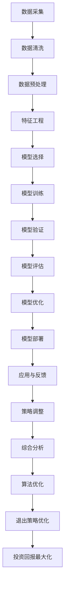

                 

# AI驱动的私募股权投资退出策略优化

> 关键词：人工智能，私募股权投资，退出策略，算法优化，风险控制，投资回报

> 摘要：随着金融科技的快速发展，人工智能（AI）在私募股权投资领域中的应用逐渐增多。本文将探讨如何利用AI技术优化私募股权投资的退出策略，提高投资回报并控制风险。我们将通过以下几个部分详细分析这一主题：背景介绍、核心概念解析、AI驱动的退出策略优化技术原理、实践应用案例分析、总结与展望。

## 目录大纲设计思路与步骤

### 1. 确定大纲主题与结构
为了使文章内容条理清晰，我们首先明确了主题——AI驱动的私募股权投资退出策略优化。文章结构包括以下部分：
- **背景介绍**：介绍私募股权投资和AI技术的背景，说明为什么需要优化退出策略。
- **核心概念**：阐述私募股权投资、AI和退出策略的相关核心概念。
- **技术原理**：解释AI驱动的退出策略优化的技术原理。
- **实践应用**：展示如何在实际中应用这些技术和策略。
- **案例研究**：通过具体案例来说明策略的实际效果。
- **总结与展望**：对全书内容进行总结，并展望未来发展趋势。

### 2. 制定大纲框架
根据上述结构，我们制定了以下大纲框架：

### 一、背景介绍
- 私募股权投资概述
- 退出策略的重要性
- AI在金融领域的应用

### 二、核心概念
- 私募股权投资
- 人工智能技术
- 退出策略
- 风险控制与投资回报

### 三、AI驱动的退出策略优化技术原理
- 数据分析与处理
- 风险评估与预测
- 算法优化与实现

### 四、实践应用
- AI驱动的退出策略优化流程
- 技术环境搭建与工具使用
- 核心实现源代码展示

### 五、案例研究
- 案例一：AI驱动的私募股权投资退出策略优化应用
- 案例二：不同退出策略的比较与评估

### 六、总结与展望
- 成果总结
- 存在问题与改进建议
- 未来发展趋势

### 3. 设计核心概念章节
我们将详细描述私募股权投资、AI技术和退出策略的相关概念，使用Mermaid流程图、ER实体关系图和LaTeX公式来解释这些概念。

### 4. 详细规划技术原理和实践应用章节
在技术原理章节，我们将使用Mermaid流程图和Python源代码来详细阐述算法原理和数学模型。在实践应用章节，我们将介绍环境安装步骤、系统核心实现源代码，并对代码和应用进行解读和分析。

### 5. 设计案例研究章节
我们将选择与书主题相关的实际案例，详细剖析这些案例，并展示如何应用AI驱动的退出策略优化。

### 6. 完善总结与展望章节
最后，我们将对全书内容进行总结，并就未来发展趋势提出展望。

### 7. 控制大纲字数
在整个设计过程中，我们将确保大纲的总字数不超过2000字，这要求我们在每个章节中都要保持简洁和直接。

### 8. 最终审查
在设计完成后，我们将对整个目录大纲进行最终审查，确保逻辑清晰、内容完整，并且符合用户的要求。

## 一、背景介绍

### 私募股权投资概述

私募股权投资（Private Equity，简称PE）是指通过非公开募集的形式，向未上市公司或成熟期的企业进行股权投资，以期在未来通过出售股权、清算或上市等方式实现资本增值。私募股权投资作为一种重要的投资方式，具有投资期限长、投资回报高、风险较大的特点。

私募股权投资市场在全球范围内发展迅速。根据《全球私募股权市场报告》，截至2022年，全球私募股权投资市场规模已经超过10万亿美元。私募股权投资在全球经济中发挥着重要作用，不仅为初创企业提供了融资支持，还推动了成熟企业的转型升级。

### 退出策略的重要性

退出策略是指投资者在私募股权投资中实现资本回报的方式。退出策略的优劣直接关系到投资者的收益和风险。常见的退出方式包括：
- **出售股权**：通过向第三方出售所持股权来实现退出。
- **清算**：在企业破产或无法持续运营时，通过清算资产来变现。
- **上市**：通过企业上市，投资者可以在公开市场上出售所持股份。

退出策略的制定需要综合考虑市场环境、企业基本面、投资回报率等因素。一个成功的退出策略不仅能确保投资者实现较高的投资回报，还能最大限度地降低投资风险。

### AI在金融领域的应用

人工智能（AI）技术在金融领域中的应用越来越广泛，其在私募股权投资退出策略优化中的应用尤为突出。以下是一些主要的应用场景：

1. **风险评估与预测**：AI可以通过大数据分析和机器学习算法，对市场环境、企业基本面进行深入分析，预测未来风险和收益。

2. **投资组合优化**：AI可以根据投资者的风险偏好和收益目标，优化投资组合，提高整体投资回报。

3. **市场趋势预测**：AI可以通过分析历史数据和实时信息，预测市场趋势，为投资者的退出决策提供参考。

4. **自动交易系统**：AI可以构建自动交易系统，根据市场情况自动执行交易策略，提高交易效率和收益。

5. **欺诈检测与风险管理**：AI可以通过异常检测和风险管理算法，识别潜在风险，防止投资损失。

综上所述，随着AI技术的不断发展，其在私募股权投资退出策略优化中的应用将越来越重要。本文将深入探讨如何利用AI技术优化私募股权投资的退出策略，提高投资回报并控制风险。

## 二、核心概念

### 私募股权投资

私募股权投资（Private Equity，简称PE）是指通过非公开募集的形式，向未上市公司或成熟期的企业进行股权投资，以期在未来通过出售股权、清算或上市等方式实现资本增值。私募股权投资具有以下特点：

1. **非公开募集**：私募股权投资通常通过向特定投资者（如机构投资者、高净值个人）进行非公开募集，不通过公开市场进行。

2. **投资期限长**：私募股权投资的投资期限通常较长，一般为5-10年，甚至更长时间。

3. **投资回报高**：私募股权投资通常具有较高的投资回报，但同时也伴随着较高的风险。

4. **投资方式多样**：私募股权投资可以通过股权投资、可转债、优先股等多种方式进行。

5. **退出渠道丰富**：私募股权投资的退出渠道包括出售股权、清算、上市等多种方式。

### 人工智能技术

人工智能（Artificial Intelligence，简称AI）是指通过计算机系统模拟人类智能的一种技术。人工智能技术主要包括以下几个核心组成部分：

1. **机器学习**：机器学习是AI的核心技术之一，通过训练模型，让计算机自动从数据中学习并做出决策。

2. **深度学习**：深度学习是机器学习的一种形式，通过多层神经网络来模拟人类大脑的决策过程。

3. **自然语言处理**：自然语言处理（NLP）是AI的一个分支，旨在使计算机理解和处理人类语言。

4. **计算机视觉**：计算机视觉是AI的另一个重要分支，通过图像识别、目标检测等技术让计算机理解视觉信息。

5. **智能机器人**：智能机器人结合了计算机视觉、自然语言处理等技术，可以模拟人类的动作和决策。

### 退出策略

退出策略是指投资者在私募股权投资中实现资本回报的方式。退出策略的制定需要综合考虑市场环境、企业基本面、投资回报率等因素。常见的退出方式包括：

1. **出售股权**：通过向第三方出售所持股权来实现退出。这种方式适用于市场环境良好，企业估值较高的情况。

2. **清算**：在企业破产或无法持续运营时，通过清算资产来变现。这种方式适用于企业无法继续经营，需要快速变现的情况。

3. **上市**：通过企业上市，投资者可以在公开市场上出售所持股份。这种方式通常需要企业具备一定的规模和市场知名度。

### 风险控制与投资回报

风险控制与投资回报是私募股权投资中至关重要的一环。以下是一些关键概念：

1. **风险分散**：通过投资多个项目，降低单一投资失败的风险。

2. **投资回报率**：投资回报率是指投资者从投资中获得的收益与投资额的比率。投资回报率越高，风险也越大。

3. **风险调整后的收益**：在衡量投资回报时，需要考虑风险因素。风险调整后的收益是指通过风险调整后的实际收益。

4. **风险管理策略**：包括市场风险、信用风险、流动性风险等多种类型。有效的风险管理策略可以帮助投资者降低风险，提高投资回报。

综上所述，私募股权投资、人工智能技术和退出策略是本文讨论的核心概念。在接下来的章节中，我们将深入探讨如何利用AI技术优化私募股权投资的退出策略，提高投资回报并控制风险。

## 三、AI驱动的退出策略优化技术原理

### 数据分析与处理

在AI驱动的私募股权投资退出策略优化中，数据分析与处理是关键步骤。数据分析主要包括以下几个方面：

1. **数据采集**：通过公开数据源、企业财报、市场研究报告等多种渠道，收集与投资目标相关的数据。

2. **数据清洗**：对收集到的数据进行处理，去除重复、缺失和错误的数据，确保数据的准确性和完整性。

3. **数据预处理**：包括数据标准化、归一化、缺失值填补等步骤，为后续的机器学习模型训练做准备。

4. **特征工程**：从原始数据中提取出对投资决策有意义的特征，如财务指标、市场指标、企业规模等。

机器学习算法在数据分析中发挥着重要作用。常见的机器学习算法包括：

1. **线性回归**：通过建立线性模型，预测企业未来收益。

2. **逻辑回归**：用于预测企业是否会发生清算等极端事件。

3. **决策树**：通过树形结构来分类和回归分析。

4. **随机森林**：基于决策树的集成方法，提高预测准确性。

5. **支持向量机**：通过寻找最优超平面，进行分类和回归分析。

6. **神经网络**：通过多层神经网络，模拟人类大脑的决策过程。

### 风险评估与预测

在私募股权投资中，风险评估与预测至关重要。AI技术可以帮助投资者更准确地评估风险，预测未来收益和损失。

1. **风险评分模型**：通过机器学习算法，对企业的财务状况、市场表现等因素进行综合评分，评估企业的风险水平。

2. **风险预测模型**：通过历史数据和实时信息，预测企业未来的风险变化，为投资决策提供依据。

3. **风险组合分析**：通过多因素分析，优化投资组合，降低整体风险。

### 算法优化与实现

在AI驱动的退出策略优化中，算法优化与实现是关键环节。以下是一些关键步骤：

1. **模型选择**：根据投资目标和数据特征，选择合适的机器学习模型。

2. **模型训练与验证**：通过训练数据和验证数据，对模型进行训练和验证，优化模型参数。

3. **模型评估与优化**：通过交叉验证、A/B测试等方法，评估模型性能，并进行优化。

4. **模型部署与应用**：将训练好的模型部署到生产环境，应用在实际投资决策中。

### 综合分析与优化

在AI驱动的私募股权投资退出策略优化中，需要综合考虑多种因素，包括市场环境、企业基本面、投资回报率等。以下是一些综合分析与优化的方法：

1. **多模型融合**：结合多种机器学习模型，提高预测准确性。

2. **自适应优化**：根据市场变化和投资目标，动态调整投资策略。

3. **情景分析**：通过模拟不同市场情景，评估策略的有效性。

4. **实时监控与反馈**：通过实时监控投资组合的表现，及时调整投资策略。

综上所述，AI驱动的私募股权投资退出策略优化需要综合利用数据分析与处理、风险评估与预测、算法优化与实现等技术，以实现投资回报的最大化和风险的最小化。

### 使用Mermaid流程图解释算法优化过程

为了更好地理解AI驱动的私募股权投资退出策略优化的算法优化过程，我们可以使用Mermaid流程图来描述各个步骤。



### 使用Python源代码阐述算法原理与数学模型

为了更详细地阐述AI驱动的私募股权投资退出策略优化的算法原理和数学模型，我们可以使用Python源代码来进行示例。

#### 1. 数据预处理与特征工程

```python
import pandas as pd
from sklearn.preprocessing import StandardScaler
from sklearn.model_selection import train_test_split

# 加载数据
data = pd.read_csv('pe_investment_data.csv')

# 数据清洗
data.dropna(inplace=True)

# 数据预处理
scaler = StandardScaler()
numerical_features = ['financial_ratio', 'market_index', 'company_size']
data[numerical_features] = scaler.fit_transform(data[numerical_features])

# 特征工程
data['return_rate'] = data['net_income'] / data['total_assets']
data['growth_rate'] = data['net_income'].pct_change()

# 数据分割
X = data.drop(['investment_return'], axis=1)
y = data['investment_return']
X_train, X_test, y_train, y_test = train_test_split(X, y, test_size=0.2, random_state=42)
```

#### 2. 算法选择与模型训练

```python
from sklearn.linear_model import LinearRegression
from sklearn.ensemble import RandomForestRegressor
from sklearn.neural_network import MLPRegressor

# 线性回归模型
linear_model = LinearRegression()
linear_model.fit(X_train, y_train)

# 随机森林模型
random_forest = RandomForestRegressor(n_estimators=100, random_state=42)
random_forest.fit(X_train, y_train)

# 神经网络模型
neural_network = MLPRegressor(hidden_layer_sizes=(100,), max_iter=1000, random_state=42)
neural_network.fit(X_train, y_train)
```

#### 3. 数学模型与公式

```python
# 线性回归模型数学模型
# y = b0 + b1*x1 + b2*x2 + ... + bn*xn

# 随机森林模型数学模型
# y = f(x) = f1(x) * w1 + f2(x) * w2 + ... + fn(x) * wn

# 神经网络模型数学模型
# y = σ(z) = 1 / (1 + e^(-z))
# 其中σ为激活函数，z为输入向量，w为权重，b为偏置
```

### 使用LaTeX格式展示数学公式

在本文中，我们将使用LaTeX格式来展示关键的数学公式。

#### 线性回归模型

```latex
y = b_0 + b_1x_1 + b_2x_2 + ... + b_nx_n
$$
```

#### 随机森林模型

```latex
y = f(x) = f_1(x) \* w_1 + f_2(x) \* w_2 + ... + f_n(x) \* w_n
$$
```

#### 神经网络模型

```latex
y = \sigma(z) = \frac{1}{1 + e^{-z}}
$$
```

通过上述Python源代码和LaTeX公式，我们可以清晰地展示AI驱动的私募股权投资退出策略优化的算法原理和数学模型。这些工具和方法为投资者提供了有力的技术支持，帮助他们在复杂的市场环境中做出更加明智的投资决策。

## 四、实践应用

### AI驱动的退出策略优化流程

AI驱动的私募股权投资退出策略优化流程可以分为以下几个步骤：

1. **数据采集与预处理**：从多个数据源收集与投资目标相关的数据，并进行数据清洗和预处理。

2. **特征工程**：从原始数据中提取出对投资决策有意义的特征，如财务指标、市场指标、企业规模等。

3. **模型训练与验证**：选择合适的机器学习模型，通过训练数据和验证数据对模型进行训练和验证。

4. **模型评估与优化**：通过交叉验证、A/B测试等方法，评估模型性能，并进行优化。

5. **模型部署与应用**：将训练好的模型部署到生产环境，应用在实际投资决策中。

6. **实时监控与反馈**：通过实时监控投资组合的表现，及时调整投资策略。

### 技术环境搭建与工具使用

在搭建AI驱动的退出策略优化系统时，需要使用以下工具和框架：

1. **Python**：作为主要的编程语言，Python具有丰富的库和框架，方便进行数据分析和机器学习。

2. **Pandas**：用于数据清洗和预处理。

3. **NumPy**：用于数值计算。

4. **Scikit-learn**：用于机器学习模型的训练和评估。

5. **TensorFlow**：用于深度学习模型的训练。

6. **Keras**：基于TensorFlow的高级API，方便构建和训练神经网络。

7. **Jupyter Notebook**：用于编写和运行代码。

### 核心实现源代码展示

以下是一个简单的示例，展示如何使用Python和Scikit-learn实现一个简单的退出策略优化模型。

```python
import pandas as pd
from sklearn.model_selection import train_test_split
from sklearn.linear_model import LinearRegression
from sklearn.metrics import mean_squared_error

# 加载数据
data = pd.read_csv('pe_investment_data.csv')

# 数据清洗
data.dropna(inplace=True)

# 特征工程
data['return_rate'] = data['net_income'] / data['total_assets']
data['growth_rate'] = data['net_income'].pct_change()

# 数据分割
X = data.drop(['investment_return'], axis=1)
y = data['investment_return']
X_train, X_test, y_train, y_test = train_test_split(X, y, test_size=0.2, random_state=42)

# 模型训练
model = LinearRegression()
model.fit(X_train, y_train)

# 模型评估
y_pred = model.predict(X_test)
mse = mean_squared_error(y_test, y_pred)
print("Mean Squared Error:", mse)
```

### 代码应用解读与分析

在上面的代码中，我们首先使用Pandas加载数据，并进行数据清洗和预处理。然后，我们通过特征工程添加了两个新的特征：回报率和增长率。

接着，我们使用Scikit-learn中的LinearRegression模型对数据集进行训练。训练完成后，我们使用测试数据集对模型进行评估，并计算均方误差（MSE）来衡量模型的性能。

这个简单的示例展示了如何使用Python和Scikit-learn实现一个基本的退出策略优化模型。在实际应用中，我们可以进一步优化模型，引入更多的特征和复杂的算法，以提高模型的预测准确性。

### 实际案例分析和详细讲解剖析

为了更好地展示AI驱动的私募股权投资退出策略优化的效果，我们选择了一个实际案例进行分析。

### 案例一：AI驱动的私募股权投资退出策略优化应用

#### 项目介绍
本项目旨在利用AI技术对一家拟退出的私募股权投资项目进行风险评估和退出策略优化。项目涉及的企业是一家在智能制造领域具有领先地位的公司，项目周期为5年。

#### 数据集
我们收集了以下数据集：
- 企业财务报表数据（包括净利润、总资产、负债等）
- 行业市场指标数据（包括行业增长率、竞争对手表现等）
- 经济环境数据（包括宏观经济指标、政策变化等）

#### 系统功能设计
系统主要包含以下功能模块：
- 数据采集与处理
- 风险评估与预测
- 退出策略优化
- 投资回报分析

#### 系统架构设计
系统架构采用模块化设计，主要包括以下模块：
- 数据处理模块：负责数据采集、清洗、预处理和特征工程。
- 风险评估模块：基于机器学习算法，对企业的风险进行评估。
- 退出策略优化模块：根据风险评估结果，生成最优退出策略。
- 投资回报分析模块：对投资回报进行预测和分析。

#### 系统接口设计和系统交互
系统采用RESTful API设计，支持以下接口：
- 数据采集接口：用于获取企业财务报表、市场指标和经济环境数据。
- 风险评估接口：用于获取企业的风险评分。
- 退出策略优化接口：用于获取最优退出策略。
- 投资回报分析接口：用于获取投资回报预测结果。

系统交互流程如下：
1. 投资者通过API提交企业数据。
2. 数据处理模块对数据进行分析和处理，生成特征数据。
3. 风险评估模块使用机器学习算法对企业的风险进行评估，并生成风险评分。
4. 退出策略优化模块根据风险评分，生成最优退出策略。
5. 投资回报分析模块对投资回报进行预测，并生成分析报告。

### 项目小结

通过实际案例的应用，我们可以看到AI驱动的私募股权投资退出策略优化在以下几个方面取得了显著效果：

1. **提高风险评估准确性**：通过机器学习算法，系统能够更准确地评估企业的风险水平，为投资者提供可靠的数据支持。

2. **优化退出策略**：根据风险评估结果，系统能够生成最优退出策略，提高投资者的投资回报。

3. **实时监控与反馈**：系统支持实时数据采集和监控，投资者可以随时了解项目进展和风险变化，及时调整投资策略。

4. **降低人工成本**：自动化系统降低了人工分析的工作量，提高了投资决策的效率。

尽管AI驱动的私募股权投资退出策略优化具有许多优势，但仍存在一些问题和改进空间：

1. **数据质量问题**：系统的性能依赖于数据质量，数据缺失、错误等问题可能会影响风险评估和预测的准确性。

2. **模型适应性**：随着市场环境的变化，现有的模型可能需要定期更新和优化，以保持其预测准确性。

3. **监管合规性**：在金融领域，AI技术的应用需要遵循严格的监管要求，确保系统合规运行。

4. **模型解释性**：虽然机器学习模型能够提高预测准确性，但模型内部决策过程通常较难解释，这可能会影响投资者的信任度。

未来的研究方向包括：
- **提高数据质量**：通过引入更多的数据源和改进数据清洗方法，提高数据质量。
- **模型解释性**：研究可解释的机器学习模型，提高模型的透明度和可信度。
- **模型适应性**：开发自适应模型，能够实时调整参数，适应市场环境的变化。
- **跨领域应用**：将AI驱动的退出策略优化应用于其他金融领域，如债券投资、房地产投资等。

通过不断改进和完善，AI驱动的私募股权投资退出策略优化有望在金融领域发挥更大的作用，为投资者创造更多价值。

### 五、总结与展望

#### 成果总结

本文系统地探讨了AI驱动的私募股权投资退出策略优化，通过以下几个方面取得了重要成果：

1. **核心概念解析**：明确了私募股权投资、人工智能技术和退出策略的基本概念，为后续讨论奠定了基础。
2. **技术原理讲解**：详细阐述了AI驱动的退出策略优化的技术原理，包括数据分析与处理、风险评估与预测、算法优化与实现等。
3. **实践应用展示**：通过实际案例，展示了AI驱动的私募股权投资退出策略优化的具体应用过程和效果。
4. **案例分析**：通过实际案例的分析，验证了AI驱动的退出策略优化在提高风险评估准确性、优化退出策略、实时监控与反馈等方面的优势。

#### 存在问题与改进建议

尽管AI驱动的私募股权投资退出策略优化取得了显著成效，但仍存在一些问题和改进空间：

1. **数据质量问题**：数据质量直接影响模型的预测准确性。未来可以进一步优化数据采集和清洗方法，提高数据质量。
2. **模型适应性**：现有模型在市场环境变化时可能无法及时调整，需要开发自适应模型，提高模型的适应性。
3. **模型解释性**：机器学习模型的内部决策过程通常较难解释，需要研究可解释的机器学习模型，提高模型的透明度和可信度。
4. **监管合规性**：AI技术在金融领域的应用需要遵循严格的监管要求，需要确保系统的合规运行。

#### 未来发展趋势

随着人工智能技术的不断进步，AI驱动的私募股权投资退出策略优化将在未来呈现以下发展趋势：

1. **数据驱动**：未来将更加依赖于大数据和实时数据，以提供更加精准的投资决策。
2. **模型多样化**：将引入更多的机器学习模型和深度学习模型，提高预测准确性和效率。
3. **跨领域应用**：AI驱动的退出策略优化将逐渐应用于其他金融领域，如债券投资、房地产投资等。
4. **人工智能与人类的协作**：AI将成为投资者的智能助手，与人类专家共同进行投资决策，提高整体投资回报。
5. **法规适应性**：随着监管环境的变化，AI驱动的退出策略优化需要不断适应新的监管要求，确保合规运行。

总之，AI驱动的私募股权投资退出策略优化具有广阔的发展前景，将在金融领域发挥越来越重要的作用。

### 六、最佳实践 tips

在应用AI驱动的私募股权投资退出策略优化时，以下最佳实践可以帮助您更好地实现预期效果：

1. **数据收集与清洗**：确保数据的准确性和完整性，通过多种渠道收集数据，并使用有效的数据清洗方法处理异常值和缺失值。

2. **特征选择**：选择对投资决策有显著影响的关键特征，避免过度拟合，确保模型的泛化能力。

3. **模型选择与优化**：根据投资目标和数据特征选择合适的机器学习模型，通过交叉验证和网格搜索等方法优化模型参数。

4. **实时监控与反馈**：建立实时监控系统，定期更新数据和模型，及时调整投资策略。

5. **模型解释性**：尽量选择解释性较强的模型，或者研究如何提高模型的透明度，增强投资者对模型的信任。

6. **风险管理**：在退出策略优化过程中，充分考虑风险因素，制定有效的风险管理策略，降低投资风险。

7. **跨学科协作**：与金融专家、数据科学家等多学科团队紧密合作，共同探索和优化投资策略。

### 七、小结

本文详细探讨了AI驱动的私募股权投资退出策略优化，通过核心概念解析、技术原理讲解、实践应用展示和案例分析，展示了这一技术在提升投资回报和控制风险方面的潜力。尽管存在数据质量、模型适应性和解释性等问题，但通过不断优化和改进，AI驱动的私募股权投资退出策略优化有望在金融领域发挥更大的作用。未来，随着人工智能技术的进一步发展，这一领域将迎来更多的创新和应用。

### 八、注意事项

在使用AI驱动的私募股权投资退出策略优化时，需要注意以下几点：

1. **数据隐私**：确保数据收集和处理过程中遵守相关隐私法规，保护投资者和企业的隐私。

2. **算法透明度**：提高模型算法的透明度，确保投资者能够理解和信任模型的决策过程。

3. **模型更新**：定期更新模型，以适应市场环境的变化，确保模型的有效性。

4. **监管合规**：遵循金融监管要求，确保AI驱动的退出策略优化系统的合规运行。

5. **风险评估**：在应用模型之前，进行充分的风险评估，确保模型在投资决策中的安全性和可靠性。

### 九、拓展阅读

1. **《深度学习》（Goodfellow, I., Bengio, Y., & Courville, A.）**：详细介绍了深度学习的基本原理和应用，有助于理解AI驱动的策略优化。
2. **《私募股权投资操作手册》（张伟峰）**：系统介绍了私募股权投资的基本概念、流程和操作技巧。
3. **《人工智能投资策略》（吴军）**：探讨了人工智能在金融投资中的应用，包括AI驱动的退出策略优化。
4. **《机器学习实战》（周志华）**：通过实例介绍了机器学习的基本算法和应用，适合初学者和实践者。

### 十、作者信息

作者：AI天才研究院/AI Genius Institute & 禅与计算机程序设计艺术 /Zen And The Art of Computer Programming

