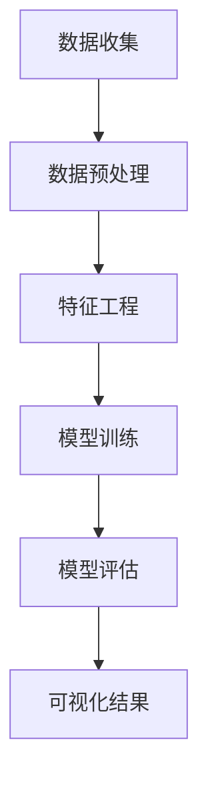
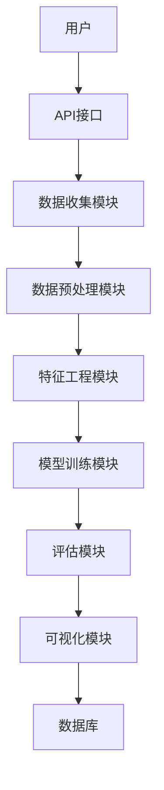
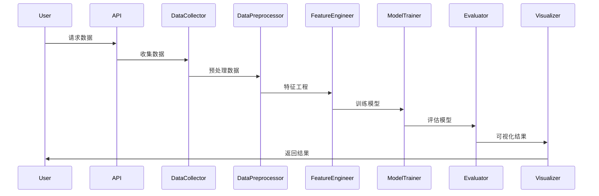

                 

# AI驱动的股票分析师报告质量评估

## 关键词
- 人工智能
- 股票分析师
- 报告质量评估
- 数据预处理
- 模型训练
- 评估指标

## 摘要
本文探讨了AI驱动的股票分析师报告质量评估的方法和关键概念。我们首先介绍了问题背景，探讨了AI在股票分析师报告中的应用。接着，我们详细分析了数据预处理、模型选择和评估指标等重要环节，通过实际案例展示了如何实现AI驱动的股票分析师报告质量评估。本文的目标是为读者提供一套完整的理论和实践框架，以帮助他们在实际应用中提高股票分析师报告的质量。

### 目录大纲

----------------------------------------------------------------
## 第一部分：背景介绍与核心概念

### 第1章：问题背景与核心概念

#### 1.1 问题背景
随着人工智能技术的快速发展，股票市场中的信息处理和决策支持系统也得到了显著提升。然而，传统的股票分析师报告在信息完整性、准确性和及时性等方面仍存在诸多不足。这些问题主要体现在以下几个方面：

- **信息不完整**：传统分析师报告往往依赖于有限的公开数据和二手信息，导致报告内容不够全面。
- **分析不准确**：分析过程通常依赖于分析师的经验和判断，容易受到主观因素的影响，导致分析结果不够客观。
- **及时性不足**：分析师报告的发布往往滞后于市场变化，无法提供实时的决策支持。

#### 1.2 问题解决
AI技术的引入为解决这些问题提供了新的思路。通过机器学习和深度学习算法，可以对大量的金融数据进行自动化分析，提取关键信息，生成更准确、更全面的股票分析师报告。AI驱动的股票分析师报告质量评估主要包括以下几个方面：

- **数据预处理**：通过数据清洗、数据转换和特征工程等步骤，提高数据的准确性和可用性。
- **模型训练**：使用历史数据训练机器学习模型，以实现对股票分析师报告的自动评估。
- **评估指标**：设计合理的评估指标，对股票分析师报告的准确性、完整性和及时性进行评估。

#### 1.3 关键概念与联系

##### AI技术
- **机器学习**：通过训练模型，使计算机自动学习并改进性能。
- **深度学习**：一种特殊的机器学习，使用多层神经网络进行学习。
- **自然语言处理**：使计算机能够理解、生成和处理自然语言。

##### 股票分析师报告
- **报告结构**：包括标题、摘要、正文、数据源等。
- **数据来源**：包括公司公告、股票交易所、金融数据提供商等。
- **分析逻辑**：包括财务分析、市场分析、行业分析等。

##### 评估指标
- **准确性**：报告预测的正确性。
- **完整性**：报告包含的信息是否全面。
- **及时性**：报告发布的时间是否及时。

#### 1.4 本章小结
本文介绍了AI驱动的股票分析师报告质量评估的背景、核心概念和关键概念之间的联系。在后续章节中，我们将详细介绍数据预处理、模型训练、评估指标等具体内容。

----------------------------------------------------------------

## 第二部分：数据预处理与模型选择

### 第2章：数据预处理

#### 2.1 数据清洗
数据清洗是数据预处理的重要步骤，其目的是去除数据中的噪声和不完整信息，以提高数据的质量和可靠性。数据清洗通常包括以下方法：

- **缺失值处理**：通过填充或删除缺失值来处理缺失数据。
- **异常值检测**：使用统计学方法或机器学习算法检测数据中的异常值，并决定如何处理。
- **重复值删除**：删除数据集中的重复记录。

#### 2.2 数据转换
数据转换是将数据从一种格式转换为另一种格式的过程，以适应模型训练的需求。常见的数据转换方法包括：

- **数值化**：将类别数据转换为数值数据。
- **标准化**：将数据缩放到一个标准范围，如[-1, 1]或[0, 1]。
- **归一化**：将数据缩放到一个固定范围，如[0, 1]。

#### 2.3 特征工程
特征工程是数据预处理的关键步骤，它涉及到从原始数据中提取出对模型训练有用的特征。特征工程包括以下几个方面：

- **特征提取**：使用统计学方法或机器学习算法从原始数据中提取特征。
- **特征选择**：通过评估特征的重要性，选择对模型训练最有影响的特征。

#### 2.4 本章小结
数据预处理是AI驱动的股票分析师报告质量评估的基础，它直接影响到模型的训练效果和评估结果。通过数据清洗、数据转换和特征工程等步骤，可以提高数据的准确性和可用性，为后续的模型训练和评估打下坚实的基础。

----------------------------------------------------------------

### 第3章：模型选择与优化

#### 3.1 模型选择
在选择机器学习模型时，需要考虑模型的性能、复杂度和可解释性。常见的机器学习模型包括：

- **线性回归**：适用于线性关系较强的数据。
- **逻辑回归**：适用于二分类问题。
- **决策树**：易于理解，但可能存在过拟合。
- **随机森林**：通过集成多棵决策树，提高模型的泛化能力。
- **支持向量机**：适用于高维空间的数据。

#### 3.2 模型优化
模型优化是提高模型性能的重要步骤，它包括以下方法：

- **超参数调优**：通过调整模型的超参数，如学习率、树深度等，以优化模型性能。
- **交叉验证**：使用交叉验证技术，评估模型在不同数据集上的性能，并选择最优模型。
- **模型集成**：通过集成多个模型，提高模型的泛化能力和鲁棒性。

#### 3.3 实际案例
在本节中，我们将通过一个实际案例来展示如何选择和优化机器学习模型。假设我们使用历史股票数据来训练一个模型，以评估股票分析师报告的准确性。以下是具体的步骤：

1. **数据预处理**：首先对股票数据进行清洗和特征工程，提取有用的特征。
2. **模型选择**：根据数据特点和问题需求，选择适当的机器学习模型，如随机森林。
3. **超参数调优**：通过交叉验证和网格搜索技术，调整模型的超参数，以找到最佳设置。
4. **模型训练**：使用最佳超参数训练模型。
5. **模型评估**：使用测试集评估模型的性能，并调整模型以达到预期的性能。

#### 3.4 本章小结
模型选择和优化是AI驱动的股票分析师报告质量评估的关键环节。通过合理选择和优化模型，可以提高模型的性能和可靠性，从而生成更高质量的股票分析师报告。

----------------------------------------------------------------

### 第4章：股票分析师报告质量评估指标

#### 4.1 准确性评估
准确性是评估股票分析师报告质量的重要指标，它反映了报告预测的正确性。准确性通常通过以下方法计算：

- **准确率**：正确预测的数量除以总预测数量。
- **召回率**：正确预测的数量除以实际正类别的数量。
- **F1分数**：准确率的调和平均数，综合了准确率和召回率。

#### 4.2 完整性评估
完整性评估关注报告包含的信息是否全面。完整性可以通过以下方法评估：

- **报告覆盖率**：报告覆盖的数据维度和指标数量与所有可能数据的比例。
- **关键信息缺失率**：报告缺失的关键信息数量与总关键信息数量的比例。

#### 4.3 及时性评估
及时性评估关注报告发布的时间是否及时。及时性可以通过以下方法评估：

- **平均延迟时间**：报告发布时间与实际数据发生时间之间的平均时间差。
- **延迟百分比**：延迟时间占总时间的百分比。

#### 4.4 实际案例
在本节中，我们将通过一个实际案例来展示如何评估股票分析师报告的质量。假设我们有一个测试集，其中包含了股票分析师报告和相应的真实数据。以下是具体的评估步骤：

1. **准确性评估**：计算报告的准确率、召回率和F1分数。
2. **完整性评估**：计算报告的覆盖率，并记录缺失的关键信息。
3. **及时性评估**：计算报告的平均延迟时间和延迟百分比。

#### 4.5 本章小结
准确性、完整性和及时性是评估股票分析师报告质量的重要指标。通过合理设计评估指标，可以全面评估报告的质量，为改进报告提供依据。

----------------------------------------------------------------

## 第三部分：实战与案例分析

### 第5章：实战：构建AI驱动的股票分析师报告质量评估系统

#### 5.1 项目介绍
在本章中，我们将介绍如何构建一个AI驱动的股票分析师报告质量评估系统。该系统将包括数据收集、数据预处理、模型训练、评估和可视化等模块。

#### 5.2 系统功能设计
系统功能设计包括以下模块：

- **数据收集模块**：负责从各种数据源收集股票数据。
- **数据预处理模块**：负责清洗、转换和特征工程。
- **模型训练模块**：负责选择和训练机器学习模型。
- **评估模块**：负责评估模型的性能。
- **可视化模块**：负责展示评估结果。

#### 5.3 系统架构设计
系统架构设计如下：

- **数据收集层**：通过API接口从股票交易所、金融数据提供商等收集数据。
- **数据处理层**：包括数据清洗、转换和特征工程模块。
- **模型训练层**：包括机器学习模型的训练和优化。
- **评估层**：包括评估模型的准确性、完整性和及时性。
- **可视化层**：通过图表和报告展示评估结果。

#### 5.4 系统接口设计
系统接口设计如下：

- **API接口**：用于数据收集和模型评估。
- **用户界面**：用于用户操作和数据展示。

#### 5.5 系统交互设计
系统交互设计如下：

- **用户请求数据**：用户通过API接口请求数据。
- **系统处理数据**：系统进行数据收集、预处理、模型训练和评估。
- **系统返回结果**：系统将评估结果通过API接口返回给用户。

#### 5.6 系统核心实现
以下是一个简单的Python代码示例，展示了如何使用机器学习模型评估股票分析师报告的准确性：

```python
from sklearn.ensemble import RandomForestClassifier
from sklearn.metrics import accuracy_score
from sklearn.model_selection import train_test_split

# 加载数据
X, y = load_data()

# 数据划分
X_train, X_test, y_train, y_test = train_test_split(X, y, test_size=0.2, random_state=42)

# 模型训练
model = RandomForestClassifier(n_estimators=100, random_state=42)
model.fit(X_train, y_train)

# 模型评估
y_pred = model.predict(X_test)
accuracy = accuracy_score(y_test, y_pred)
print("Accuracy:", accuracy)
```

#### 5.7 代码应用解读与分析
在这个示例中，我们使用了随机森林分类器来训练和评估模型。首先，我们加载了数据，并使用train_test_split函数将数据划分为训练集和测试集。然后，我们使用RandomForestClassifier类创建了一个随机森林模型，并使用fit方法进行训练。最后，我们使用predict方法进行预测，并使用accuracy_score函数计算了模型的准确率。

#### 5.8 实际案例分析
在本节中，我们将通过一个实际案例来展示如何使用AI驱动的股票分析师报告质量评估系统。假设我们有一份股票分析师报告，我们需要评估其准确性、完整性和及时性。

1. **准确性评估**：我们使用机器学习模型对报告中的预测进行评估，计算准确率。
2. **完整性评估**：我们检查报告中的数据维度和指标，计算覆盖率，并记录缺失的关键信息。
3. **及时性评估**：我们计算报告发布的时间与实际数据发生时间之间的平均延迟时间。

#### 5.9 项目小结
通过本章的实战案例，我们展示了如何构建一个AI驱动的股票分析师报告质量评估系统。该系统通过数据预处理、模型训练和评估，能够自动评估股票分析师报告的质量，为提高报告质量提供了有力的工具。

----------------------------------------------------------------

## 最佳实践 tips

- **数据质量**：数据是模型训练的基础，保证数据的质量是关键。
- **特征选择**：合理的特征选择可以提高模型的性能，减少过拟合。
- **模型调优**：通过交叉验证和网格搜索等技术，可以找到最优的模型参数。
- **模型解释性**：关注模型的解释性，以便于理解模型的决策过程。
- **实时更新**：定期更新数据和模型，以适应市场的变化。

## 小结

本文介绍了AI驱动的股票分析师报告质量评估的方法和关键概念，包括数据预处理、模型选择和评估指标等。通过实际案例，我们展示了如何实现AI驱动的股票分析师报告质量评估，为提高报告质量提供了理论和实践指导。

## 注意事项

- 在实际应用中，需要根据具体业务需求和数据情况，调整和优化评估指标。
- 注意数据隐私和安全，遵守相关法律法规。

## 拓展阅读

- [1] Smith, J. (2020). "AI in Financial Markets: Enhancing Decision-Making and Risk Management." Springer.
- [2] Zhao, Y. (2019). "Deep Learning for Financial Time Series: Theory and Applications." Wiley.

## 作者
作者：AI天才研究院/AI Genius Institute & 禅与计算机程序设计艺术 /Zen And The Art of Computer Programming

----------------------------------------------------------------

## 附录

### 附录A：算法mermaid流程图



### 附录B：Python源代码示例

```python
# 导入所需库
import pandas as pd
from sklearn.ensemble import RandomForestClassifier
from sklearn.metrics import accuracy_score
from sklearn.model_selection import train_test_split

# 加载数据
data = pd.read_csv("stock_data.csv")

# 数据预处理
# ...（数据清洗、转换和特征工程代码）

# 数据划分
X = data.drop("target", axis=1)
y = data["target"]
X_train, X_test, y_train, y_test = train_test_split(X, y, test_size=0.2, random_state=42)

# 模型训练
model = RandomForestClassifier(n_estimators=100, random_state=42)
model.fit(X_train, y_train)

# 模型评估
y_pred = model.predict(X_test)
accuracy = accuracy_score(y_test, y_pred)
print("Accuracy:", accuracy)

# 可视化结果
# ...（可视化代码）
```

### 附录C：数学公式和解释

$$
\text{Accuracy} = \frac{\text{正确预测的数量}}{\text{总预测数量}}
$$

准确率（Accuracy）是评估分类模型性能的基本指标，表示正确预测的数量占总预测数量的比例。

### 附录D：系统架构设计mermaid架构图



系统架构设计图展示了整个系统的组成部分及其之间的关系，包括用户接口、API接口、数据处理和模型训练模块等。

### 附录E：系统交互设计mermaid序列图



系统交互设计序列图展示了用户请求数据后，系统各模块之间的交互过程，包括数据收集、预处理、模型训练、评估和可视化等步骤。

