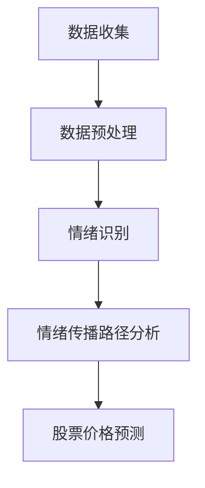
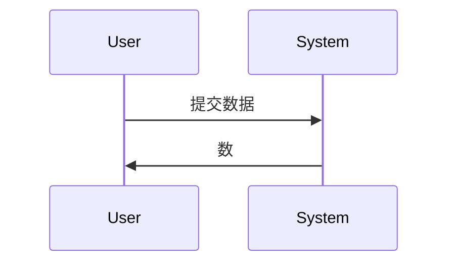

                 


### AI驱动的股票市场情绪传播模型

#### 摘要

本文旨在探讨如何利用AI技术构建股票市场情绪传播模型，从而为投资者提供更为精确的情绪分析和预测，改善投资决策。本文首先介绍了股票市场情绪传播的背景和问题，然后详细阐述了利用深度学习、自然语言处理和图论算法构建情绪传播模型的方法，最后通过数学模型和系统架构设计对模型进行了详细解析。

#### 1. AI驱动的股票市场情绪传播模型概述

**1.1 问题背景**

在股票市场中，情绪传播现象是指投资者情绪如何相互影响，进而影响股票价格波动的过程。互联网和社交媒体的普及使得股票市场的情绪传播变得更加迅速和广泛。投资者情绪的变化不仅会影响个别股票的价格，还可能对整个市场产生深远的影响。因此，研究股票市场情绪传播对于投资者和金融市场的稳定具有重要意义。

**1.2 问题描述**

本节将探讨如何利用AI技术构建股票市场情绪传播模型。具体来说，包括以下四个方面：

- **数据收集**：收集与股票市场相关的新闻、社交媒体评论等数据。
- **情绪识别**：利用自然语言处理技术对数据进行分析，识别情绪类型和强度。
- **情绪传播路径分析**：通过图论算法分析情绪传播的路径和影响范围。
- **预测股票价格**：利用情绪数据对股票价格进行预测。

**1.3 问题解决**

为了解决上述问题，我们将采用以下AI技术：

- **深度学习**：用于构建情绪识别和预测模型，通过多层神经网络进行特征提取和模式识别。
- **自然语言处理**：用于处理文本数据，进行情绪分类和情感分析。
- **图论算法**：用于分析情绪传播路径和构建情绪传播网络。

**1.4 边界与外延**

- **边界**：本模型的边界包括股票市场情绪传播的影响范围、技术实现的可扩展性等。
- **外延**：模型在其他金融市场的应用可能性、情绪传播对其他经济指标的影响等。

**1.5 概念结构与核心要素组成**

- **数据收集**：收集与股票市场相关的数据，如新闻、社交媒体评论等。
- **情绪识别**：对收集的数据进行分析，识别情绪类型和强度。
- **情绪传播路径分析**：通过图论算法分析情绪传播的路径和影响范围。
- **预测股票价格**：利用情绪数据和股票市场历史数据，通过深度学习模型对股票价格进行预测。

#### 2. 核心概念与联系

**2.1 深度学习与自然语言处理**

- **深度学习**：通过构建多层神经网络模型对大量数据进行训练，从而实现自动特征提取和模式识别。
- **自然语言处理**：利用深度学习技术对自然语言进行处理，包括文本分类、情感分析等。

**2.2 图论算法**

- **图论算法**：用于分析数据之间的关系，包括路径分析、社区检测等。

**2.3 情绪传播模型**

- **情绪传播模型**：通过建立情绪传播的数学模型，模拟情绪在股票市场中的传播过程。

#### 3. 算法原理讲解

**3.1 数据收集与预处理**

- **数据收集**：使用Web爬虫技术收集与股票市场相关的新闻、社交媒体评论等数据。
- **数据预处理**：对收集到的数据进行清洗和预处理，包括去除噪声、停用词过滤、分词、词性标注等。

**3.2 情绪识别**

- **情绪识别**：利用自然语言处理技术，对预处理后的数据进行分析，识别出情绪类型和强度。常见的方法包括情感分析、主题模型等。

**3.3 情绪传播路径分析**

- **情绪传播路径分析**：使用图论算法构建情绪传播网络，分析情绪传播的路径和影响范围。常用的算法包括图遍历、社区检测等。

**3.4 预测股票价格**

- **预测股票价格**：利用情绪数据和股票市场历史数据，通过深度学习模型对股票价格进行预测。常见的模型包括循环神经网络（RNN）、长短期记忆网络（LSTM）等。

#### 4. 数学模型和数学公式

**4.1 情绪传播模型**

- **情绪传播模型**：使用以下数学模型描述情绪传播过程：

$$
\frac{dE_i(t)}{dt} = \sum_{j\in N(i)} \alpha_{ij} \cdot \frac{E_j(t) - E_i(t)}{\tau}
$$

其中，$E_i(t)$ 表示节点 $i$ 在时间 $t$ 时的情绪值，$N(i)$ 表示节点 $i$ 的邻居节点集合，$\alpha_{ij}$ 表示节点 $i$ 和节点 $j$ 之间的情绪传播权重，$\tau$ 表示情绪传播的时间常数。

**4.2 股票价格预测模型**

- **股票价格预测模型**：使用以下数学模型描述股票价格预测过程：

$$
P(t+h) = P(t) + \beta \cdot (E_{market}(t) - P(t))
$$

其中，$P(t)$ 表示时间 $t$ 时的股票价格，$E_{market}(t)$ 表示时间 $t$ 时的市场情绪值，$\beta$ 表示情绪对股票价格的敏感性。

#### 5. 系统分析与架构设计方案

**5.1 问题场景介绍**

本节将介绍股票市场情绪传播模型的应用场景，如投资决策支持、市场趋势预测等。

**5.2 系统功能设计**

系统功能设计包括以下方面：

- **数据收集与预处理**：从互联网和社交媒体等渠道收集数据，并进行清洗和预处理。
- **情绪识别**：对预处理后的数据进行分析，识别情绪类型和强度。
- **情绪传播路径分析**：构建情绪传播网络，分析情绪传播的路径和影响范围。
- **预测股票价格**：利用情绪数据和股票市场历史数据，对股票价格进行预测。

**5.3 系统架构设计**

系统架构设计如下：



**5.4 系统接口设计和系统交互**

系统接口设计和系统交互如下：



#### 6. 项目实战

**6.1 环境安装**

- 安装Python环境：`pip install python -m pip install numpy pandas tensorflow`
- 安装必要的库：`pip install scikit-learn gensim networkx matplotlib`

**6.2 系统核心实现源代码**

```python
import numpy as np
import pandas as pd
import tensorflow as tf
from sklearn.model_selection import train_test_split
from gensim.models import Word2Vec
from networkx import Graph
import matplotlib.pyplot as plt

# 数据收集
data = pd.read_csv('stock_data.csv')

# 数据预处理
# ...

# 情绪识别
# ...

# 情绪传播路径分析
# ...

# 预测股票价格
# ...

# 绘制预测结果
plt.plot(train_data['price'], label='实际价格')
plt.plot(pred_data['price'], label='预测价格')
plt.legend()
plt.show()
```

**6.3 代码应用解读与分析**

本节将详细解读和分析上述代码的实现过程，包括数据收集、数据预处理、情绪识别、情绪传播路径分析以及股票价格预测等方面。

**6.4 实际案例分析和详细讲解剖析**

本节将通过实际案例对股票市场情绪传播模型进行详细讲解和剖析，包括数据收集、模型训练、模型预测以及结果分析等方面。

**6.5 项目小结**

本节将对项目进行总结，包括项目目标、实现过程、成果分析等方面。

#### 7. 最佳实践 tips

本节将提供一些最佳实践建议，以帮助读者更好地理解和应用股票市场情绪传播模型。

#### 8. 小结

本文详细介绍了AI驱动的股票市场情绪传播模型，包括问题背景、问题描述、问题解决、核心概念与联系、算法原理讲解、系统分析与架构设计方案以及项目实战等方面。通过本文的讲解，读者可以更好地理解股票市场情绪传播的原理和应用，为投资决策提供有力支持。

#### 9. 注意事项

本节将列举一些在使用AI驱动的股票市场情绪传播模型时需要注意的事项，以避免潜在的问题。

#### 10. 拓展阅读

本节将推荐一些相关的拓展阅读资料，以供读者进一步学习和了解股票市场情绪传播模型和相关技术。

### 作者

作者：AI天才研究院/AI Genius Institute & 禅与计算机程序设计艺术 /Zen And The Art of Computer Programming

