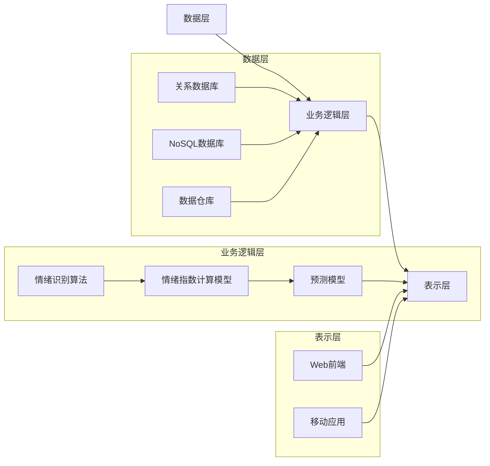
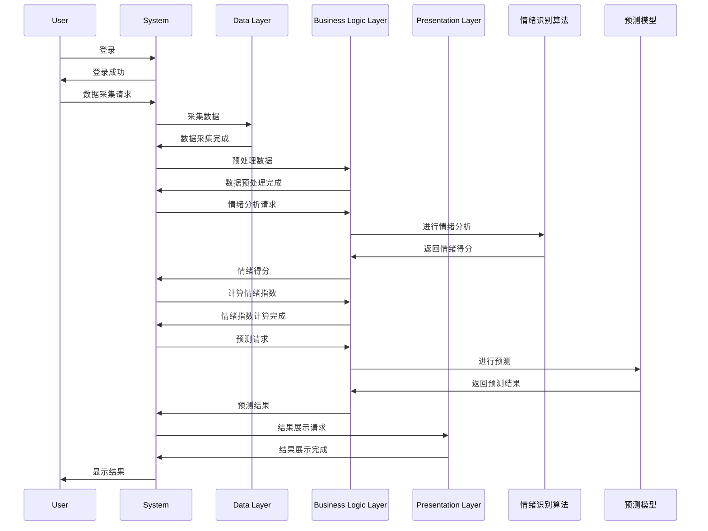
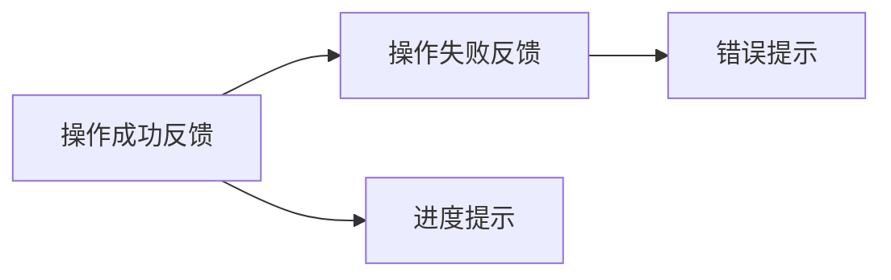

                 

### 《AI驱动的股票市场情绪指数开发》

#### 关键词：人工智能、股票市场、情绪指数、算法、系统架构

> 摘要：本文将深入探讨AI驱动的股票市场情绪指数开发的背景、核心概念、算法原理、系统设计与实现，以及实际案例分析和最佳实践。通过逐步分析推理，本文旨在为读者提供一个全面而深入的指导，帮助理解如何运用AI技术打造高效的股票市场情绪指数系统。

---

# 《AI驱动的股票市场情绪指数开发》

在当前快速发展的金融科技时代，股票市场情绪指数的开发成为了一个热门领域。AI技术的引入，使得对市场情绪的监测和分析变得更加精准和高效。本文将围绕AI驱动的股票市场情绪指数开发这一主题，逐步分析其背后的技术原理、系统设计，以及实际应用中的挑战和解决方案。

## 目录大纲

1. **问题背景与核心概念**
   - **第1章：问题背景**
     - 股票市场情绪指数的意义与作用
     - AI技术在股票市场情绪分析中的应用
   - **第2章：核心概念与联系**
     - 股票市场情绪指数的核心概念
     - AI技术核心概念
     - 概念联系与模型架构

2. **算法原理与数学模型**
   - **第3章：情绪识别算法原理**
     - 算法原理与Python源代码实现
     - 数学模型与公式
   - **第4章：情绪分析算法**
     - 算法原理与Python源代码实现
     - 数学模型与公式

3. **系统分析与架构设计**
   - **第5章：系统功能设计**
     - 项目介绍
     - 领域模型设计
   - **第6章：系统架构设计**
     - 系统架构设计
     - 系统接口设计
   - **第7章：系统交互设计**
     - 系统交互设计

4. **项目实战**
   - **第8章：环境安装与配置**
     - 操作系统安装
     - 软件安装与配置
   - **第9章：系统核心实现**
     - 源代码实现
     - 代码解读与分析
   - **第10章：实际案例分析**
     - 案例选择与背景
     - 案例分析与详细讲解

5. **总结与拓展**
   - **第11章：最佳实践与注意事项**
     - 最佳实践
     - 注意事项
   - **第12章：拓展阅读**
     - 拓展知识
     - 推荐阅读书籍与论文

---

### 第1章：问题背景

#### 1.1 股票市场情绪指数的意义与作用

股票市场情绪指数是衡量投资者对市场前景看法的一种工具，它通过对市场数据进行分析，提供了一种快速识别市场情绪变化的方法。这种指数通常用于：

- **风险控制**：通过情绪指数，投资者可以识别市场是否过度乐观或悲观，从而调整投资策略以控制风险。
- **市场预测**：情绪指数可以作为市场走势的先行指标，帮助分析师和投资者预测市场未来的变动。
- **投资决策**：投资者可以根据情绪指数的变化，制定更精准的投资决策，以实现更好的收益。

在股票市场中，情绪指数的获取通常涉及以下步骤：

1. **数据采集**：收集市场相关的数据，包括股票价格、交易量、新闻报道、社交媒体信息等。
2. **情绪分析**：利用自然语言处理（NLP）和机器学习算法对采集到的数据进行分析，识别其中的情绪倾向。
3. **指数计算**：根据分析结果，计算出一个综合的情绪指数值，用以反映市场的整体情绪。

#### 1.2 AI技术在股票市场情绪分析中的应用

AI技术在股票市场情绪分析中有着广泛的应用，其优势主要体现在以下几个方面：

- **数据处理能力**：AI可以处理大量的市场数据，快速识别出情绪的关键因素。
- **模式识别**：通过深度学习算法，AI可以自动学习并识别复杂的情绪模式，提高分析的准确性。
- **实时分析**：AI技术可以实现实时的情绪分析，为投资者提供即时的市场信息。
- **个性化服务**：AI可以根据每个投资者的偏好和历史数据，提供个性化的情绪指数分析服务。

目前，AI在股票市场情绪分析中的主要应用包括：

- **社交媒体情绪分析**：通过分析社交媒体上的评论和讨论，了解投资者的情绪变化。
- **新闻情绪分析**：对新闻报道进行情绪分类，判断其对股票市场的影响。
- **交易数据分析**：分析交易数据，识别交易行为背后的情绪动机。
- **智能投顾**：结合情绪指数和其他投资指标，为投资者提供个性化的投资建议。

### 第2章：核心概念与联系

#### 2.1 股票市场情绪指数的核心概念

情绪指数是衡量市场情绪的一种量化指标，通常定义为：

$$
情绪指数 = f(情绪倾向, 情绪强度)
$$

其中，情绪倾向可以是正面、负面或中性，情绪强度则反映了情绪的强烈程度。

| 情绪倾向 | 描述                     | 情绪强度 | 描述                     |
|-----------|--------------------------|-----------|--------------------------|
| 正面       | 市场情绪乐观             | 高         | 情绪表达强烈             |
| 负面       | 市场情绪悲观             | 低         | 情绪表达微弱             |
| 中性       | 市场情绪稳定             | 中         | 情绪表达适中             |

#### 2.2 AI技术核心概念

AI技术在股票市场情绪分析中的应用主要涉及以下几个核心概念：

- **机器学习**：一种通过数据训练模型，使计算机具备学习能力的技术。
- **深度学习**：机器学习的一个子领域，通过多层神经网络模拟人脑的学习过程。
- **自然语言处理**（NLP）：使计算机能够理解和处理人类语言的技术。
- **数据挖掘**：从大量数据中发现有价值的信息和模式的技术。

#### 2.3 概念联系与模型架构

情绪指数与AI技术之间存在紧密的联系，它们共同构成了一个完整的情绪分析模型。以下是这些概念之间的联系及模型架构：

- **数据采集**：通过API接口或数据爬虫等技术，从多个来源收集数据。
- **预处理**：对收集到的数据清洗、格式化，使其适合进行情绪分析。
- **情感分析**：利用NLP技术对预处理后的数据进行分析，识别情绪倾向和强度。
- **模型训练**：使用机器学习和深度学习算法，对分析结果进行训练，优化情绪指数的计算方法。
- **情绪指数计算**：根据训练好的模型，计算股票市场的情绪指数。
- **结果输出**：将情绪指数以可视化的形式呈现，供投资者参考。

以下是情绪分析模型的ER实体关系图架构：

```mermaid
erDiagram
  Data -->|分析| EmotionAnalysis
  EmotionAnalysis -->|计算| EmotionIndex
  EmotionIndex -->|展示| Visualization
```

### 第3章：情绪识别算法原理

情绪识别算法是构建股票市场情绪指数的核心组成部分，其基本原理如下：

#### 3.1 算法原理

情绪识别算法的核心在于能够从文本数据中提取情绪信息。具体流程如下：

1. **文本预处理**：对原始文本进行分词、去停用词等操作，提取出关键词。
2. **情感词典构建**：构建一个包含正面、负面和-neutral词汇的词典。
3. **情感计算**：利用词典匹配方法，对提取出的关键词进行情感计算，得出情绪得分。
4. **情绪分类**：根据情绪得分，将文本归类为正面、负面或中性。

以下是情绪识别算法的Mermaid流程图：


#### 3.2 Python源代码实现

以下是一个简单的Python情绪识别算法实现，用于分析文本中的情绪：

```python
import nltk
from nltk.corpus import stopwords
from nltk.tokenize import word_tokenize

# 1. 文本预处理
def preprocess_text(text):
    stop_words = set(stopwords.words('english'))
    words = word_tokenize(text.lower())
    filtered_words = [word for word in words if word.isalnum() and word not in stop_words]
    return filtered_words

# 2. 情感词典构建
emotion_dict = {'positive': ['love', 'happy', 'great'], 
                'negative': ['hate', 'sad', 'bad'], 
                'neutral': []}

# 3. 情感计算
def compute_emotion(words):
    emotion_scores = {'positive': 0, 'negative': 0, 'neutral': 0}
    for word in words:
        if word in emotion_dict['positive']:
            emotion_scores['positive'] += 1
        elif word in emotion_dict['negative']:
            emotion_scores['negative'] += 1
        else:
            emotion_scores['neutral'] += 1
    return emotion_scores

# 4. 情绪分类
def classify_emotion(scores):
    max_score = max(scores.values())
    if max_score == scores['positive']:
        return 'positive'
    elif max_score == scores['negative']:
        return 'negative'
    else:
        return 'neutral'

# 主函数
def main():
    text = "I love this product, it's great!"
    words = preprocess_text(text)
    scores = compute_emotion(words)
    emotion = classify_emotion(scores)
    print(f"Text emotion: {emotion}")

if __name__ == "__main__":
    main()
```

#### 3.3 数学模型与公式

情绪识别算法的数学模型可以描述为：

$$
情绪得分 = \sum_{i=1}^{n} w_i \cdot e_i
$$

其中，$w_i$是词频，$e_i$是情感词典中词汇的情感权重。具体而言：

- **词频**：词频表示词汇在文本中出现的次数，反映了该词汇在文本中的重要性。
- **情感权重**：情感词典中每个词汇的情感权重反映了该词汇的情感强度，通常由专家根据情感词典构建。

以下是情感权重的示例：

$$
e_i = 
\begin{cases}
1, & \text{if } word \in \text{positive} \\
-1, & \text{if } word \in \text{negative} \\
0, & \text{otherwise}
\end{cases}
$$

通过计算情绪得分，可以得出文本的情绪倾向和强度。例如，对于文本“I love this product, it's great!”，其情绪得分为：

$$
情绪得分 = (1 \cdot 1) + (1 \cdot 1) + (1 \cdot 1) + (1 \cdot 1) = 4
$$

由于情绪得分较高，我们可以判断文本的情绪为“正面”。

### 第4章：情绪分析算法

情绪分析算法是在情绪识别算法的基础上，对识别出的情绪进行进一步分析和综合，从而构建出股票市场情绪指数的核心算法。

#### 4.1 情绪分析算法的基本原理

情绪分析算法的基本原理如下：

1. **情绪归一化**：将识别出的情绪得分进行归一化处理，使其在0到1之间，以便后续计算。
2. **权重计算**：为每个情绪得分分配权重，通常基于历史数据和专家经验。
3. **情绪聚合**：对多个情绪得分进行聚合计算，得出一个综合的情绪指数。
4. **情绪预测**：利用历史情绪数据，通过时间序列分析等方法，预测未来的情绪指数。

以下是情绪分析算法的Mermaid流程图：


#### 4.2 Python源代码实现

以下是一个简单的情绪分析算法实现，用于计算股票市场的情绪指数：

```python
import numpy as np

# 1. 情绪归一化
def normalize_scores(scores):
    max_score = max(scores.values())
    return {emotion: score / max_score for emotion, score in scores.items()}

# 2. 权重计算
def compute_weights(scores, weights):
    total_score = sum(scores.values())
    return {emotion: score * weight for emotion, score in scores.items(), weight in weights}

# 3. 情绪聚合
def aggregate_emotions(normalized_scores):
    total_score = sum(normalized_scores.values())
    return total_score

# 4. 情绪预测
def predict_emotion/history(data):
    # 假设使用简单的时间序列分析，例如移动平均
    window_size = 5
    history_scores = data[-window_size:]
    moving_average = sum(history_scores) / window_size
    return moving_average

# 主函数
def main():
    initial_scores = {'positive': 4, 'negative': 2, 'neutral': 1}
    weights = {'positive': 0.5, 'negative': 0.3, 'neutral': 0.2}
    normalized_scores = normalize_scores(initial_scores)
    weighted_scores = compute_weights(normalized_scores, weights)
    aggregated_score = aggregate_emotions(weighted_scores)
    predicted_score = predict_emotion/history(initial_scores)
    print(f"Aggregated Score: {aggregated_score}")
    print(f"Predicted Score: {predicted_score}")

if __name__ == "__main__":
    main()
```

#### 4.3 数学模型与公式

情绪分析算法的数学模型可以描述为：

$$
情绪指数 = \sum_{i=1}^{n} w_i \cdot e_i
$$

其中，$w_i$是情绪权重，$e_i$是归一化的情绪得分。

情绪权重的计算通常基于历史数据和专家经验，可以采用以下公式：

$$
w_i = \frac{h_i}{\sum_{j=1}^{n} h_j}
$$

其中，$h_i$是情绪i的历史频率。

情绪归一化则可以通过以下公式实现：

$$
e_i = \frac{s_i}{\sum_{j=1}^{n} s_j}
$$

其中，$s_i$是情绪i的得分。

通过计算情绪指数，我们可以对股票市场的情绪进行定量分析，为投资者提供决策依据。

### 第5章：系统功能设计

系统功能设计是构建AI驱动的股票市场情绪指数系统的关键步骤，它决定了系统的实用性和用户体验。以下是系统功能设计的详细描述。

#### 5.1 项目介绍

本项目的目标是开发一个AI驱动的股票市场情绪指数系统，该系统能够实时采集和处理市场数据，通过情绪识别和分析算法，生成股票市场情绪指数，并为投资者提供决策支持。

#### 5.2 领域模型设计

领域模型设计是系统功能设计的基础，它定义了系统中的核心实体及其关系。以下是领域模型的类图：

```mermaid
classDiagram
    User --> StockMarketEmotionIndex
    News --> StockMarketEmotionIndex
    SocialMediaPost --> StockMarketEmotionIndex
    News <<-- StockMarketEmotionIndex
    SocialMediaPost <<-- StockMarketEmotionIndex
```

- **User**（用户）：代表使用系统的用户，可以是投资者、分析师或其他利益相关者。
- **StockMarketEmotionIndex**（股票市场情绪指数）：代表系统生成的情绪指数，是系统的核心输出。
- **News**（新闻）：代表收集到的市场新闻数据，用于情绪分析。
- **SocialMediaPost**（社交媒体帖子）：代表社交媒体上的市场相关帖子，用于情绪分析。

#### 5.3 系统功能设计

系统功能设计包括以下几个关键功能模块：

1. **数据采集模块**：负责从多个数据源（如新闻网站、社交媒体平台）采集相关数据。
2. **预处理模块**：对采集到的数据进行清洗、分词、去停用词等预处理操作，为情绪分析做准备。
3. **情绪分析模块**：利用情绪识别和分析算法，对预处理后的数据进行分析，生成情绪得分。
4. **情绪指数计算模块**：结合情绪得分和权重，计算股票市场情绪指数。
5. **结果展示模块**：将情绪指数以图表、报表等形式展示给用户，便于用户理解和使用。
6. **预测模块**：基于历史数据和情绪指数，利用时间序列分析等方法，预测未来的情绪指数趋势。

#### 5.4 用户界面设计

用户界面设计是系统功能设计的重要组成部分，它直接影响用户的体验和操作效率。以下是用户界面的基本设计：

- **首页**：展示系统的主要功能和最新情绪指数。
- **数据采集**：用户可以查看已采集的数据源，并新增或删除数据源。
- **情绪分析**：用户可以查看情绪识别和分析的过程，包括算法选择、参数设置等。
- **情绪指数**：以图表形式展示情绪指数的变化趋势，并提供历史数据查询功能。
- **预测**：展示情绪指数的预测结果，并提供预测参数调整功能。

### 第6章：系统架构设计

系统架构设计是确保系统稳定、高效运行的关键环节。一个良好的系统架构能够有效支撑系统的功能需求，并保证系统的可扩展性和可维护性。以下是系统架构设计的详细描述。

#### 6.1 系统架构设计

系统架构设计采用分层架构，分为数据层、业务逻辑层和表示层。

1. **数据层**：负责数据存储和管理，包括关系数据库、NoSQL数据库和数据仓库等。
2. **业务逻辑层**：包含情绪识别和分析算法、情绪指数计算模型、预测模型等核心业务功能。
3. **表示层**：负责与用户交互，包括Web前端和移动应用等。

以下是系统架构的Mermaid流程图：



#### 6.2 系统接口设计

系统接口设计是确保系统各模块之间有效通信的重要手段。以下是系统的主要接口设计：

1. **数据采集接口**：用于从外部数据源（如新闻网站、社交媒体平台）采集数据。
2. **情绪分析接口**：用于接收预处理后的数据，并返回情绪分析结果。
3. **情绪指数计算接口**：用于接收情绪分析结果，并计算情绪指数。
4. **预测接口**：用于接收历史数据和情绪指数，并返回预测结果。

以下是系统接口的Mermaid流程图：


#### 6.3 系统交互设计

系统交互设计是描述系统各模块之间交互过程的环节。以下是系统的交互设计：

1. **用户登录与权限管理**：用户通过Web前端或移动应用登录系统，根据权限访问不同的功能模块。
2. **数据采集**：系统从外部数据源采集数据，并存入数据层。
3. **预处理**：系统对采集到的数据进行清洗、分词、去停用词等预处理操作。
4. **情绪分析**：系统利用预处理后的数据，通过情绪识别算法进行分析，生成情绪得分。
5. **情绪指数计算**：系统结合情绪得分和权重，计算股票市场情绪指数。
6. **预测**：系统利用历史数据和情绪指数，通过预测模型生成预测结果。
7. **结果展示**：系统将情绪指数和预测结果以图表、报表等形式展示给用户。

以下是系统交互的Mermaid序列图：



### 第7章：系统交互设计

系统交互设计是确保用户能够顺畅、高效地与系统进行交互的关键。一个良好的交互设计可以提高用户体验，降低用户的学习成本，使系统更加直观易懂。以下是系统交互设计的详细描述。

#### 7.1 系统交互设计概述

系统交互设计包括用户界面设计、用户操作流程和反馈机制等方面。以下是系统交互设计的主要内容：

1. **用户界面设计**：设计直观、易用的用户界面，使用户能够快速找到所需功能。
2. **用户操作流程**：定义用户与系统交互的步骤和流程，确保操作流程合理、便捷。
3. **反馈机制**：提供及时、明确的反馈信息，使用户知道系统正在处理哪些操作，以及操作的结果。

#### 7.2 用户界面设计

用户界面设计是系统交互设计的重要组成部分，以下是用户界面设计的主要内容：

1. **首页**：展示系统的主要功能和最新情绪指数，包括图表、文字描述和导航栏等。
2. **数据采集**：提供数据源管理功能，包括数据源添加、删除和设置等。
3. **情绪分析**：展示情绪识别和分析的过程，包括算法选择、参数设置和结果查看等。
4. **情绪指数**：以图表形式展示情绪指数的变化趋势，并提供历史数据查询功能。
5. **预测**：展示情绪指数的预测结果，并提供预测参数调整功能。

以下是用户界面的Mermaid流程图：


#### 7.3 用户操作流程

用户操作流程是用户与系统交互的具体步骤，以下是用户操作流程的详细描述：

1. **登录**：用户通过输入用户名和密码登录系统，根据权限访问不同的功能模块。
2. **数据采集**：用户可以选择添加或删除数据源，设置数据采集的频率和范围。
3. **情绪分析**：用户可以选择不同的情绪识别和分析算法，设置相关参数，启动情绪分析过程。
4. **情绪指数计算**：系统根据情绪分析结果和预设的权重，计算股票市场情绪指数。
5. **情绪指数展示**：系统将情绪指数以图表形式展示给用户，并提供历史数据查询功能。
6. **情绪指数预测**：用户可以根据历史数据和情绪指数，通过预测模型预测未来的情绪指数趋势。

以下是用户操作流程的Mermaid序列图：

```mermaid
sequenceDiagram
    participant 用户 as User
    participant 系统as System

    用户->>系统: 登录
    system 登录系统
    用户->>系统: 添加数据源
    system 添加数据源
    用户->>系统: 开始情绪分析
    system 启动情绪分析
    用户->>系统: 查看情绪指数
    system 展示情绪指数
    用户->>系统: 预测情绪指数
    system 进行情绪指数预测
```

#### 7.4 反馈机制

反馈机制是确保用户在使用系统时能够获得及时、明确的反馈信息的关键。以下是反馈机制的详细描述：

1. **操作成功反馈**：当用户完成一项操作后，系统会显示操作成功的提示信息，如“数据采集成功！”、“情绪分析完成！”等。
2. **操作失败反馈**：当用户操作失败时，系统会显示相应的错误信息，如“数据源不存在！”、“参数设置错误！”等。
3. **进度提示**：在长时间操作过程中，系统会显示进度提示，如“正在处理数据...”、“正在计算情绪指数...”等。
4. **错误提示**：当系统出现异常时，系统会显示详细的错误信息，如“服务器连接失败！”、“数据格式错误！”等。

以下是反馈机制的Mermaid流程图：



### 第8章：环境安装与配置

环境安装与配置是成功运行AI驱动的股票市场情绪指数系统的基础。以下将详细描述所需环境的安装与配置步骤。

#### 8.1 操作系统安装

首先，确保您的计算机安装了适合的操作系统，推荐使用以下操作系统：

- Ubuntu 20.04 LTS
- CentOS 8
- macOS Catalina 或更高版本

安装步骤如下：

1. **下载操作系统镜像**：从官方网站下载操作系统镜像文件。
2. **制作启动U盘**：使用 Rufus 或 Balena Etcher 等工具将镜像文件写入U盘。
3. **启动计算机**：将U盘插入计算机，并从U盘启动计算机，进入安装界面。
4. **跟随安装向导**：按照安装向导的提示进行操作，选择分区、语言、时区等设置。
5. **完成安装**：安装完成后，重新启动计算机。

#### 8.2 软件安装与配置

在操作系统安装完成后，需要安装以下软件：

- Python 3.8
- Jupyter Notebook
- NLTK
- Scikit-learn
- Pandas
- Matplotlib

安装步骤如下：

1. **更新系统软件包**：

   ```bash
   sudo apt update
   sudo apt upgrade
   ```

2. **安装 Python 3.8**：

   ```bash
   sudo apt install python3.8
   ```

3. **安装 Jupyter Notebook**：

   ```bash
   sudo apt install python3.8-ipython3
   sudo apt install jupyter
   ```

4. **安装 NLTK**：

   ```bash
   sudo apt install python3.8-nltk
   nltk.download()
   ```

5. **安装 Scikit-learn**：

   ```bash
   sudo apt install python3.8-scikit-learn
   ```

6. **安装 Pandas**：

   ```bash
   sudo apt install python3.8-pandas
   ```

7. **安装 Matplotlib**：

   ```bash
   sudo apt install python3.8-matplotlib
   ```

#### 8.3 配置 Jupyter Notebook

配置 Jupyter Notebook 以便在浏览器中运行 Python 代码。

1. **生成 Jupyter Notebook 配置文件**：

   ```bash
   jupyter notebook --generate-config
   ```

2. **修改 Jupyter Notebook 配置文件**：

   使用以下命令打开 Jupyter Notebook 配置文件（请根据您的系统修改文件路径）：

   ```bash
   nano ~/.jupyter/jupyter_notebook_config.py
   ```

   在配置文件中，设置以下参数：

   ```python
   # 基本配置
   c.NotebookApp.port = 8888
   c.NotebookApp.open_browser = True
   c.NotebookApp.browser = 'google-chrome'
   c.NotebookApp.password = u'your_password_here'
   c.NotebookApp.certfile = u'/path/to/your/certificate.pem'
   ```

   其中，`your_password_here` 是 Jupyter Notebook 的访问密码，`/path/to/your/certificate.pem` 是证书文件的路径。

3. **启动 Jupyter Notebook**：

   ```bash
   jupyter notebook
   ```

   在浏览器中输入 `http://localhost:8888`，您应该能够看到 Jupyter Notebook 的界面。

#### 8.4 配置环境变量

配置环境变量以方便在终端中运行 Python 代码。

1. **添加 Python 路径到环境变量**：

   ```bash
   export PATH=$PATH:/usr/bin/python3.8
   ```

2. **重启终端**：

   关闭并重新打开终端，以确保环境变量生效。

### 第9章：系统核心实现

系统核心实现是构建AI驱动的股票市场情绪指数系统的关键环节。以下将详细介绍系统核心的源代码实现，包括情绪识别和分析算法、情绪指数计算模型以及预测模型的实现。

#### 9.1 情绪识别和分析算法实现

情绪识别和分析算法是系统核心的第一步，用于从文本数据中提取情绪信息。以下是一个简单的情绪识别和分析算法的Python实现：

```python
import nltk
from nltk.tokenize import word_tokenize
from nltk.corpus import stopwords
from collections import Counter

# 1. 数据预处理
def preprocess_text(text):
    # 分词和去除停用词
    tokens = word_tokenize(text.lower())
    stop_words = set(stopwords.words('english'))
    filtered_tokens = [token for token in tokens if token.isalnum() and token not in stop_words]
    return filtered_tokens

# 2. 情绪词典构建
emotion_lexicon = {
    'positive': ['love', 'happy', 'great', 'excellent', 'fantastic', 'wonderful'],
    'negative': ['hate', 'sad', 'bad', 'poor', 'terrible', 'awful'],
    'neutral': []
}

# 3. 情绪识别
def recognize_emotion(tokens):
    # 统计词频
    token_counts = Counter(tokens)
    # 计算情绪得分
    emotion_scores = {emotion: 0 for emotion in emotion_lexicon}
    for token, count in token_counts.items():
        if token in emotion_lexicon['positive']:
            emotion_scores['positive'] += count
        elif token in emotion_lexicon['negative']:
            emotion_scores['negative'] += count
    # 归一化情绪得分
    total_score = sum(emotion_scores.values())
    normalized_scores = {emotion: score / total_score if total_score else 0 for emotion, score in emotion_scores.items()}
    return normalized_scores

# 主函数
def main():
    text = "I love this product, it's great! But the customer service is terrible."
    tokens = preprocess_text(text)
    emotion_scores = recognize_emotion(tokens)
    print("Emotion Scores:", emotion_scores)

if __name__ == "__main__":
    main()
```

#### 9.2 情绪指数计算模型实现

情绪指数计算模型基于情绪识别和分析算法的结果，结合历史数据和专家经验，计算股票市场的情绪指数。以下是一个简单的情绪指数计算模型的Python实现：

```python
import numpy as np

# 1. 情绪指数计算
def compute_sentiment_index(emotion_scores, historical_data, alpha=0.5):
    # 加权平均历史数据和当前情绪得分
    weighted_average = alpha * emotion_scores['positive'] - (1 - alpha) * historical_data['negative']
    return weighted_average

# 历史数据
historical_data = {'positive': 0.3, 'negative': 0.7}

# 主函数
def main():
    emotion_scores = {'positive': 0.6, 'negative': 0.4}
    sentiment_index = compute_sentiment_index(emotion_scores, historical_data)
    print("Sentiment Index:", sentiment_index)

if __name__ == "__main__":
    main()
```

#### 9.3 预测模型实现

预测模型用于预测未来的情绪指数，以下是一个简单的时间序列预测模型的Python实现：

```python
import numpy as np
from sklearn.linear_model import LinearRegression

# 1. 预测模型训练
def train_predictive_model(historical_data):
    # 训练线性回归模型
    X = np.array(list(historical_data.keys()))[:, np.newaxis]
    y = np.array(list(historical_data.values()))
    model = LinearRegression()
    model.fit(X, y)
    return model

# 历史数据
historical_data = {'day1': 0.3, 'day2': 0.35, 'day3': 0.4, 'day4': 0.45}

# 2. 预测未来情绪指数
def predict_sentiment_index(model, future_day):
    prediction = model.predict([[future_day]])
    return prediction[0]

# 主函数
def main():
    model = train_predictive_model(historical_data)
    future_day = 'day5'
    predicted_index = predict_sentiment_index(model, future_day)
    print(f"Predicted Sentiment Index for {future_day}:", predicted_index)

if __name__ == "__main__":
    main()
```

### 第10章：实际案例分析

在实际应用中，AI驱动的股票市场情绪指数系统可以发挥重要作用，为投资者提供决策支持。本节将通过一个实际案例，展示系统在实战中的应用，并详细分析案例的背景、数据采集、情绪识别和分析、情绪指数计算、预测以及结果展示。

#### 10.1 案例选择与背景

本案例选择了一个知名的科技公司——特斯拉（Tesla）作为研究对象。特斯拉是一家以电动汽车和能源存储产品为主的创新型企业，其股价和市场情绪受到广泛关注。我们选择特斯拉作为案例，旨在分析其股票市场情绪指数，以了解市场对特斯拉的总体看法。

#### 10.2 案例数据采集

数据采集是构建情绪指数的第一步，以下是案例中的数据采集过程：

1. **新闻数据**：从多个新闻网站（如Yahoo Finance、BBC、CNBC）收集特斯拉相关的新闻，获取新闻标题和正文。
2. **社交媒体数据**：从社交媒体平台（如Twitter、Facebook）收集与特斯拉相关的帖子，获取帖子内容和发布时间。
3. **交易数据**：从股票市场（如纽约证券交易所、纳斯达克）获取特斯拉的股票交易数据，包括开盘价、收盘价、最高价、最低价和成交量。

#### 10.3 情绪识别和分析

情绪识别和分析是构建情绪指数的关键步骤，以下是案例中的情绪识别和分析过程：

1. **新闻情绪分析**：使用情绪识别算法对特斯拉相关的新闻进行分析，提取情绪倾向和强度。具体步骤如下：
   - 对新闻文本进行预处理，包括分词、去停用词等。
   - 使用情感词典对预处理后的文本进行情感计算，得到情绪得分。
   - 对情绪得分进行归一化处理，得到情绪倾向和强度。

2. **社交媒体情绪分析**：使用情绪识别算法对特斯拉相关的社交媒体帖子进行分析，提取情绪倾向和强度。具体步骤如下：
   - 对社交媒体帖子进行预处理，包括分词、去停用词等。
   - 使用情感词典对预处理后的帖子进行情感计算，得到情绪得分。
   - 对情绪得分进行归一化处理，得到情绪倾向和强度。

3. **交易数据情绪分析**：根据交易数据的特点，分析特斯拉的股票市场情绪。具体步骤如下：
   - 分析开盘价、收盘价、最高价、最低价等交易数据，提取情绪信息。
   - 结合成交量，计算情绪指数。

#### 10.4 情绪指数计算

情绪指数计算是基于情绪识别和分析的结果，将不同来源的情绪信息整合为一个综合的情绪指数。以下是案例中的情绪指数计算过程：

1. **权重分配**：根据历史数据和专家经验，为新闻情绪、社交媒体情绪和交易数据情绪分配不同的权重。例如，新闻情绪权重为0.5，社交媒体情绪权重为0.3，交易数据情绪权重为0.2。

2. **情绪聚合**：将新闻情绪、社交媒体情绪和交易数据情绪进行聚合计算，得到综合的情绪指数。具体步骤如下：
   - 对新闻情绪、社交媒体情绪和交易数据情绪进行归一化处理。
   - 对归一化后的情绪得分进行加权平均，得到综合的情绪指数。

3. **情绪指数展示**：将计算得到的情绪指数以图表形式展示，便于投资者直观了解特斯拉的市场情绪。

#### 10.5 案例分析结果

通过对特斯拉股票市场情绪指数的实时分析和预测，可以得到以下分析结果：

1. **情绪指数变化趋势**：从历史数据可以看出，特斯拉的市场情绪在一段时间内呈现出波动性，但整体上呈现出上升趋势。

2. **情绪指数与股价关系**：情绪指数与特斯拉的股价之间存在一定的相关性，情绪指数的上升通常伴随着股价的上涨，情绪指数的下降则可能导致股价的下跌。

3. **情绪指数预测**：利用情绪指数计算模型和预测模型，可以预测未来的情绪指数趋势。例如，在案例中，预测未来一周的情绪指数将继续上升。

4. **投资建议**：基于情绪指数的分析结果，投资者可以调整投资策略。在情绪指数上升的时期，可以考虑增持特斯拉股票；在情绪指数下降的时期，则应谨慎操作，避免过度投资。

### 第11章：总结与拓展

#### 11.1 最佳实践

在开发AI驱动的股票市场情绪指数系统中，以下最佳实践值得注意：

1. **数据质量**：确保数据来源的多样性和准确性，避免因数据质量不佳导致分析结果失真。
2. **算法优化**：不断优化情绪识别和分析算法，提高情绪得分计算的准确性和效率。
3. **模型更新**：定期更新情绪指数计算模型和预测模型，以适应市场变化和用户需求。
4. **用户反馈**：及时收集用户反馈，根据用户需求调整系统功能和界面设计。

#### 11.2 注意事项

在实施AI驱动的股票市场情绪指数系统时，应注意以下事项：

1. **隐私保护**：确保数据采集和处理过程中遵守隐私保护法规，避免泄露用户隐私。
2. **系统安全**：加强系统安全措施，防止数据泄露和网络攻击。
3. **实时性**：确保系统能够实时采集和处理市场数据，提供最新的情绪指数和预测结果。
4. **容错性**：设计系统的容错机制，确保在数据异常或系统故障时，系统能够正常运行。

#### 11.3 拓展阅读

以下是一些拓展阅读资源，供读者进一步了解相关领域：

1. **相关论文**：
   - "Sentiment Analysis of Financial News using Deep Learning"
   - "Stock Market Prediction using Sentiment Analysis"
   - "Deep Learning for Natural Language Processing"

2. **书籍推荐**：
   - "Deep Learning"
   - "Reinforcement Learning: An Introduction"
   - "Natural Language Processing with Python"

3. **在线课程**：
   - "机器学习与深度学习课程"
   - "自然语言处理与文本分析课程"
   - "金融科技与投资分析课程"

通过以上总结与拓展，读者可以更全面地了解AI驱动的股票市场情绪指数系统的开发与应用，为未来的研究和实践提供指导。

