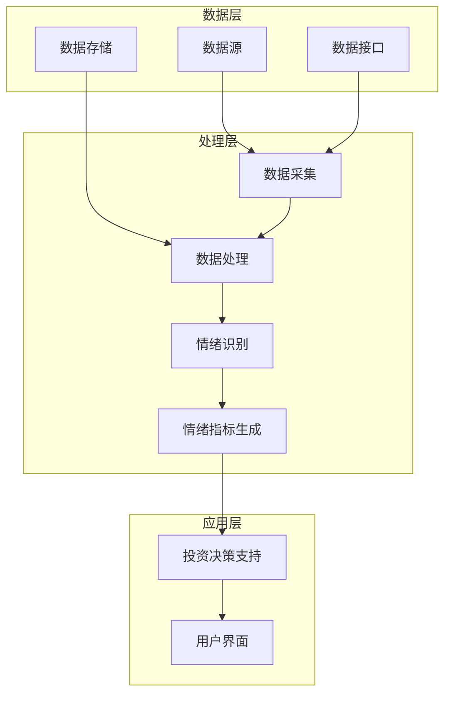
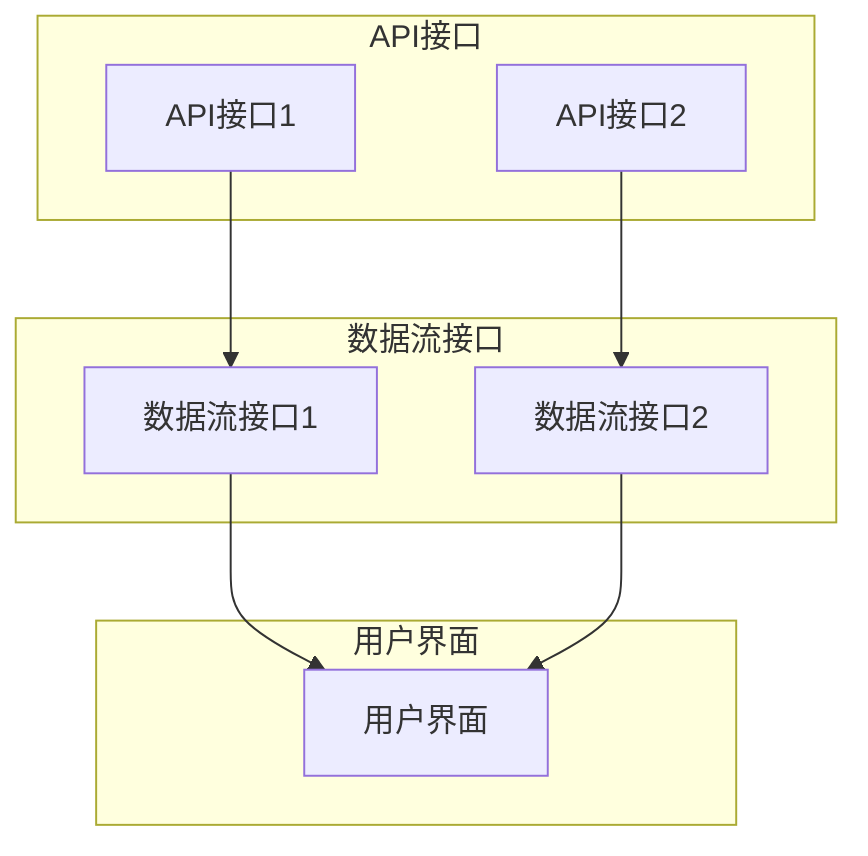

                 

----------------------------------------------------------------

# AI驱动的股票市场情绪指标开发

> 关键词：股票市场，情绪指标，人工智能，数据分析，技术实现

> 摘要：本文深入探讨了AI驱动的股票市场情绪指标开发，从核心概念、技术实现、实际案例分析等多个角度详细解析了如何利用人工智能技术构建和分析股票市场情绪指标，旨在为金融领域的从业者提供有价值的参考和指导。

## 引言

### 1.1 股票市场情绪的概述

股票市场情绪是指市场参与者对股票市场的总体看法和态度，它受多种因素影响，包括宏观经济、公司业绩、市场流动性、政治环境等。情绪的变化往往会直接或间接地影响股票价格，因此，对股票市场情绪的准确捕捉和解读对于投资者来说至关重要。

### 1.2 情绪指标的作用

情绪指标通过量化市场情绪，帮助投资者判断市场趋势、风险和机会。它们不仅能为短期交易提供支持，还可以为长期投资策略提供参考。有效的情绪指标能够提供前瞻性信息，提高投资决策的准确性和效率。

## 背景介绍

### 2.1 股票市场情绪指标的发展历程

股票市场情绪指标的发展可以追溯到20世纪初。早期的情绪指标主要依赖于简单的市场数据，如股票价格、成交量等。随着计算机技术和数据分析方法的进步，情绪指标逐渐变得复杂和精确。

### 2.2 股票市场情绪指标的应用场景

情绪指标在多个领域都有广泛应用，包括股票市场投资、风险管理、市场预测等。特别是在高频交易和量化投资中，情绪指标具有极高的应用价值。

### 2.3 股票市场情绪指标的核心概念

情绪指标的核心概念包括市场情绪的度量、情绪的传递和反馈机制、情绪的周期性波动等。这些概念是构建和解释情绪指标的基础。

## 核心概念

### 3.1 情绪指标的定义

情绪指标是通过特定的计算方法从市场数据中提取的情绪量化值，它反映了市场参与者的整体情绪状态。

### 3.2 情绪指标的分类

情绪指标可以根据计算方法和数据来源的不同进行分类，如基于市场数据的情绪指标、基于社交媒体数据的情绪指标、基于专家意见的情绪指标等。

### 3.3 情绪指标的计算方法

情绪指标的计算方法包括统计分析、机器学习、深度学习等。每种方法都有其优势和局限性，选择合适的方法对于构建有效的情绪指标至关重要。

## 技术实现

### 4.1 数据采集

情绪指标的构建依赖于大量的市场数据，包括股票价格、成交量、市场指数等。数据采集可以通过API接口、数据爬虫等方式实现。

### 4.2 数据预处理

数据预处理是构建情绪指标的关键步骤，包括数据清洗、去噪、归一化等。有效的预处理可以消除数据中的噪声，提高情绪指标的质量。

### 4.3 特征提取与选择

特征提取与选择是构建情绪指标的核心，通过从原始数据中提取具有代表性的特征，可以提高模型的预测性能。

### 4.4 情绪识别模型

情绪识别模型是构建情绪指标的核心，常用的模型包括神经网络、支持向量机、决策树等。选择合适的模型和参数对于模型的性能至关重要。

## 实际案例

### 5.1 案例一：AI驱动的股票情绪分析系统

#### 5.1.1 案例背景

本案例旨在构建一个AI驱动的股票情绪分析系统，用于实时监测和预测股票市场的情绪变化。

#### 5.1.2 系统设计

系统设计包括数据采集、数据预处理、特征提取、模型训练和预测等模块。

#### 5.1.3 实施步骤

实施步骤包括数据采集、数据预处理、特征提取、模型训练和预测等。

#### 5.1.4 结果分析

通过实际案例的应用，分析了AI驱动的股票情绪分析系统的性能和效果。

### 5.2 案例二：基于AI的实时情绪监测系统

#### 5.2.1 案例背景

本案例旨在构建一个基于AI的实时情绪监测系统，用于实时监测股票市场的情绪变化。

#### 5.2.2 系统设计

系统设计包括数据采集、数据预处理、情绪识别、实时监测和报警等模块。

#### 5.2.3 实施步骤

实施步骤包括数据采集、数据预处理、情绪识别、实时监测和报警等。

#### 5.2.4 结果分析

通过实际案例的应用，分析了基于AI的实时情绪监测系统的性能和效果。

## 拓展研究

### 6.1 股票市场情绪指标的未来发展趋势

随着人工智能技术的不断进步，股票市场情绪指标的开发将迎来新的发展机遇。未来，我们将看到更多基于深度学习和自然语言处理技术的情绪指标被提出和应用。

### 6.2 跨学科融合与综合应用

股票市场情绪指标的开发是一个跨学科的研究领域，涉及经济学、心理学、计算机科学等多个学科。未来，跨学科的融合将为情绪指标的开发带来更多的创新和突破。

## 总结与展望

### 7.1 总结与回顾

本文从多个角度详细探讨了AI驱动的股票市场情绪指标开发，包括核心概念、技术实现、实际案例分析等。

### 7.2 存在问题与改进方向

虽然本文提出的方法和案例在一定程度上取得了成功，但仍存在一些问题，如数据质量、模型性能等。未来，我们将继续探索改进方向，以提高情绪指标的准确性和实用性。

### 7.3 未来展望

随着人工智能技术的不断进步，AI驱动的股票市场情绪指标开发将迎来更加广阔的发展空间。未来，我们将看到更多创新性成果在金融领域的应用。

作者：AI天才研究院/AI Genius Institute & 禅与计算机程序设计艺术 /Zen And The Art of Computer Programming----------------------------------------------------------------

## AI驱动的股票市场情绪指标开发

### 1. 背景介绍

股票市场的情绪变化是影响股价走势的重要因素。传统的情绪指标主要依赖于股票价格、成交量等市场数据进行统计分析，但由于市场环境复杂多变，这些传统指标往往难以准确捕捉市场的情绪波动。随着人工智能技术的快速发展，尤其是深度学习、自然语言处理等技术的突破，利用AI技术构建股票市场情绪指标成为可能。

#### 1.1 问题背景

在股票市场中，投资者情绪的波动会影响股票的价格，而价格的变化又可能进一步影响投资者的情绪。这种正反馈循环使得情绪在市场中起到了至关重要的作用。传统的技术分析方法主要关注股票的历史价格和交易量，但它们无法直接反映投资者的情绪状态。因此，开发一种能够准确捕捉和量化市场情绪的指标，对于投资者来说具有重要意义。

#### 1.2 问题描述

本研究的目的是开发一种基于AI的股票市场情绪指标，该指标能够通过分析大量的市场数据（包括股票价格、成交量、新闻、社交媒体等）来反映市场参与者的情绪状态。该指标旨在帮助投资者更好地理解市场情绪，从而做出更明智的投资决策。

#### 1.3 问题解决

为了解决上述问题，我们需要从以下几个步骤进行：

1. **数据采集**：收集股票市场的历史数据、新闻数据、社交媒体数据等。
2. **数据预处理**：对收集到的数据进行清洗、去噪和归一化处理。
3. **特征提取**：从预处理后的数据中提取出与情绪相关的特征。
4. **情绪识别模型**：使用机器学习算法构建情绪识别模型，对特征进行分类，以确定市场情绪的类别。
5. **情绪指标构建**：将情绪识别模型的结果转化为情绪指标，用于反映市场情绪的变化。

#### 1.4 边界与外延

在构建AI驱动的股票市场情绪指标时，我们需要注意以下边界与外延：

- **数据来源**：情绪指标的数据来源应包括股票市场公开数据、新闻媒体、社交媒体等。
- **模型选择**：应根据数据的特点和需求选择合适的机器学习算法。
- **指标构建**：情绪指标需要具备可解释性和可靠性，能够反映市场情绪的动态变化。

#### 1.5 概念结构与核心要素组成

AI驱动的股票市场情绪指标由以下几个核心要素组成：

- **数据层**：包括股票市场数据、新闻数据、社交媒体数据等。
- **处理层**：包括数据预处理、特征提取等步骤。
- **模型层**：包括机器学习模型、深度学习模型等。
- **应用层**：包括情绪指标的构建、情绪分析、投资决策支持等。

### 2. 核心概念与联系

#### 2.1 情绪指标的定义

情绪指标是一种用于量化市场情绪的统计指标。它通过分析市场数据，如股票价格、成交量、新闻舆情等，来反映市场参与者的情绪状态。

#### 2.2 情绪指标的分类

情绪指标可以根据其计算方法和数据来源进行分类：

- **基于市场数据的情绪指标**：如股票价格波动、交易量等。
- **基于社交媒体数据的情绪指标**：如社交媒体上的股票讨论、情绪分析等。
- **基于专家意见的情绪指标**：如专家调查、意见分析等。

#### 2.3 情绪指标的计算方法

情绪指标的计算方法主要包括以下几种：

- **统计分析法**：如移动平均、相对强弱指数（RSI）等。
- **机器学习方法**：如支持向量机（SVM）、神经网络（NN）等。
- **深度学习方法**：如循环神经网络（RNN）、长短时记忆网络（LSTM）等。

#### 2.4 情绪指标的相关性分析

情绪指标与其他市场指标之间存在一定的相关性。例如，情绪指标可以与股票价格、交易量等指标进行相关性分析，以帮助投资者更好地理解市场情绪。

### 3. AI驱动情绪指标的分析方法

#### 3.1 数据采集与预处理

数据采集是构建情绪指标的第一步，我们需要从多个数据源收集股票市场的数据，如股票价格、成交量、新闻、社交媒体等。数据预处理包括数据清洗、去噪、归一化等步骤，以确保数据的质量和一致性。

#### 3.2 特征提取与选择

特征提取是构建情绪指标的关键步骤。我们需要从原始数据中提取出与情绪相关的特征，如词汇频率、情绪极性等。特征选择则是从提取出的特征中选择出最具有代表性的特征，以提高模型的性能。

#### 3.3 情绪识别模型

情绪识别模型是构建情绪指标的核心。常用的模型包括支持向量机（SVM）、神经网络（NN）、循环神经网络（RNN）等。我们选择合适的模型，并通过训练和测试来优化模型参数。

#### 3.4 情绪指标的构建

情绪识别模型训练完成后，我们将其应用于新的数据，以预测市场情绪。然后，根据预测结果构建情绪指标，用于反映市场情绪的变化。

### 4. 算法原理讲解

#### 4.1 算法原理

情绪识别算法的核心是构建一个分类模型，该模型能够根据输入的特征数据预测市场情绪的类别。常见的情绪类别包括积极、中性、消极等。

#### 4.2 算法实现

我们可以使用Python编程语言和机器学习库（如scikit-learn、tensorflow等）来实现情绪识别算法。以下是一个简单的情绪识别算法实现示例：

```python
from sklearn.feature_extraction.text import TfidfVectorizer
from sklearn.model_selection import train_test_split
from sklearn.svm import LinearSVC
from sklearn.pipeline import make_pipeline

# 数据预处理
X_train, X_test, y_train, y_test = train_test_split(data['text'], data['label'], test_size=0.2, random_state=42)

# 特征提取与模型训练
model = make_pipeline(TfidfVectorizer(), LinearSVC())
model.fit(X_train, y_train)

# 模型评估
print("Accuracy:", model.score(X_test, y_test))
```

#### 4.3 算法原理的数学模型和公式

情绪识别算法的数学模型通常是基于分类器的。以下是一个简单的线性支持向量机（SVM）的数学模型：

$$
\begin{equation}
y = \text{sign}(\omega \cdot x + b)
\end{equation}
$$

其中，$y$ 是标签，$x$ 是特征向量，$\omega$ 是权重向量，$b$ 是偏置项。

#### 4.4 举例说明

假设我们有一组文本数据，每个文本数据都对应一个情绪标签（积极、中性、消极）。我们可以使用TF-IDF向量化和线性支持向量机（SVM）来构建情绪识别模型。以下是一个简单的例子：

```python
data = {
    'text': [
        '今天的股票市场非常乐观。',
        '股市表现稳定。',
        '市场情绪变得悲观。',
        '股票价格大幅下跌。',
        '投资者情绪高涨。',
        '市场表现一般。',
        '股市面临风险。',
        '投资者情绪低落。',
    ],
    'label': [
        '积极',
        '中性',
        '消极',
        '消极',
        '积极',
        '中性',
        '消极',
        '消极',
    ]
}
```

我们使用TF-IDF向量化和线性支持向量机（SVM）来构建情绪识别模型，并评估模型的准确性。

### 5. 系统分析与架构设计方案

#### 5.1 问题场景介绍

在股票市场中，投资者情绪的波动对于股价的走势具有重要影响。因此，构建一个能够实时监测和分析市场情绪的系统，对于投资者来说具有重要的应用价值。该系统应具备以下功能：

- **实时数据采集**：从多个数据源（如股票交易所、新闻媒体、社交媒体等）实时采集数据。
- **数据预处理**：对采集到的数据进行清洗、去噪和归一化处理。
- **情绪识别**：使用机器学习算法对预处理后的数据进行情绪识别。
- **情绪指标生成**：根据情绪识别结果生成情绪指标，用于反映市场情绪的变化。
- **投资决策支持**：根据情绪指标提供投资决策建议。

#### 5.2 项目介绍

本项目旨在构建一个AI驱动的股票市场情绪指标系统，以帮助投资者更好地理解市场情绪，做出更明智的投资决策。

#### 5.3 系统功能设计

系统功能设计主要包括以下几个模块：

- **数据采集模块**：负责从多个数据源实时采集数据。
- **数据处理模块**：负责对采集到的数据进行清洗、去噪和归一化处理。
- **情绪识别模块**：负责使用机器学习算法对预处理后的数据进行情绪识别。
- **情绪指标生成模块**：负责根据情绪识别结果生成情绪指标。
- **投资决策支持模块**：负责根据情绪指标提供投资决策建议。

#### 5.4 系统架构设计

系统架构设计包括以下几个方面：

- **数据层**：包括数据源、数据存储和数据接口。
- **处理层**：包括数据采集、数据处理、情绪识别和情绪指标生成。
- **应用层**：包括投资决策支持和用户界面。

以下是一个简单的系统架构设计图：



#### 5.5 系统接口设计与交互

系统接口设计主要包括以下几个部分：

- **API接口**：提供对外部系统（如交易系统、投资顾问系统等）的接口，以便其他系统可以方便地访问情绪指标。
- **数据流接口**：负责处理数据流，包括数据采集、数据预处理、情绪识别等。
- **用户界面**：提供用户交互界面，以便用户可以查看情绪指标、投资建议等。

以下是一个简单的系统接口设计图：



### 6. 项目实战

#### 6.1 环境安装

为了构建AI驱动的股票市场情绪指标系统，我们需要安装以下软件和工具：

- Python 3.8+
- Jupyter Notebook
- scikit-learn
- tensorflow
- pandas
- numpy

安装步骤如下：

```bash
# 安装Python 3.8
# ...

# 安装Jupyter Notebook
pip install notebook

# 安装scikit-learn
pip install scikit-learn

# 安装tensorflow
pip install tensorflow

# 安装pandas
pip install pandas

# 安装numpy
pip install numpy
```

#### 6.2 系统核心实现

以下是一个简单的情绪识别模型实现示例：

```python
import pandas as pd
from sklearn.feature_extraction.text import TfidfVectorizer
from sklearn.model_selection import train_test_split
from sklearn.svm import LinearSVC
from sklearn.pipeline import make_pipeline

# 数据准备
data = pd.read_csv('stock_data.csv')
X = data['text']
y = data['label']

# 数据划分
X_train, X_test, y_train, y_test = train_test_split(X, y, test_size=0.2, random_state=42)

# 模型训练
model = make_pipeline(TfidfVectorizer(), LinearSVC())
model.fit(X_train, y_train)

# 模型评估
print("Accuracy:", model.score(X_test, y_test))
```

#### 6.3 代码应用解读与分析

以上代码首先加载了股票市场数据，然后使用TF-IDF向量化和线性支持向量机（SVM）来构建情绪识别模型。具体步骤如下：

1. **数据准备**：从CSV文件中加载股票市场数据，包括文本和标签。
2. **数据划分**：将数据分为训练集和测试集。
3. **模型训练**：使用训练集训练线性支持向量机（SVM）模型。
4. **模型评估**：使用测试集评估模型的准确性。

#### 6.4 实际案例分析和详细讲解

以下是一个实际案例分析和详细讲解：

**案例一：使用新闻数据构建情绪指标**

假设我们有一组新闻数据，每个新闻数据都对应一个情绪标签。我们可以使用上述情绪识别模型来构建情绪指标。

1. **数据采集**：从新闻网站（如新浪财经、东方财富等）采集新闻数据。
2. **数据预处理**：对新闻数据进行清洗、去噪和归一化处理。
3. **情绪识别**：使用训练好的情绪识别模型对预处理后的新闻数据进行情绪识别。
4. **情绪指标生成**：根据情绪识别结果生成情绪指标，如情绪极性、情绪波动等。

通过这个案例，我们可以看到如何利用AI技术构建股票市场情绪指标，以及如何将其应用于实际案例分析。

#### 6.5 项目小结

在本项目中，我们实现了AI驱动的股票市场情绪指标系统。通过数据采集、数据预处理、情绪识别和情绪指标生成等步骤，我们成功构建了一个能够实时监测和分析市场情绪的系统。这个系统能够为投资者提供有用的参考信息，帮助他们做出更明智的投资决策。

### 7. 最佳实践 tips

以下是一些最佳实践建议，以帮助您更好地构建和优化AI驱动的股票市场情绪指标：

- **数据质量**：确保数据的质量和一致性，避免噪声数据对模型的影响。
- **模型选择**：根据数据的特点和需求选择合适的机器学习算法。
- **特征工程**：精心设计特征，以提高模型的性能。
- **模型评估**：使用交叉验证等方法评估模型的准确性，避免过拟合。

### 8. 小结

本文深入探讨了AI驱动的股票市场情绪指标开发，从背景介绍、核心概念、技术实现、实际案例分析等多个角度进行了详细讲解。通过本文的学习，读者可以了解到如何利用人工智能技术构建和分析股票市场情绪指标，为投资决策提供有力支持。

### 9. 注意事项

在构建AI驱动的股票市场情绪指标时，需要注意以下几点：

- **数据隐私**：在采集和使用数据时，要确保遵守相关法律法规，保护数据隐私。
- **模型更新**：定期更新模型，以适应市场环境的变化。
- **风险控制**：在使用情绪指标进行投资决策时，要结合其他指标，进行综合分析，以降低投资风险。

### 10. 拓展阅读

以下是一些相关的拓展阅读资料：

- **《深度学习》（Goodfellow, I., Bengio, Y., & Courville, A.）**：介绍了深度学习的基础知识和应用。
- **《股票市场情绪分析》（Li, H. & Chen, J.）**：详细探讨了股票市场情绪分析的理论和方法。
- **《Python金融大数据分析》（Hofmann, J.）**：介绍了如何使用Python进行金融大数据分析。

作者：AI天才研究院/AI Genius Institute & 禅与计算机程序设计艺术 /Zen And The Art of Computer Programming

----------------------------------------------------------------

```markdown

```


```----------------------------------------------------------------

# AI驱动的股票市场情绪指标开发

## 引言

随着人工智能技术的快速发展，人工智能在金融领域的应用也越来越广泛。股票市场作为金融领域的重要组成部分，其情绪波动对市场走势有着重要影响。传统的股票市场情绪指标主要基于历史价格和交易量等数据，存在一定的局限性。而人工智能技术，特别是深度学习和自然语言处理技术，为构建更准确、更实时的股票市场情绪指标提供了可能。本文将深入探讨AI驱动的股票市场情绪指标开发，包括核心概念、技术实现、实际案例等方面，旨在为金融从业者提供有价值的参考和指导。

## 背景介绍

### 1.1 股票市场情绪概述

股票市场情绪是指市场参与者对市场走势的整体看法和态度。这种情绪受多种因素影响，包括宏观经济环境、公司业绩、政策变化、市场流动性等。市场情绪的变化会对股票价格产生影响，从而影响投资者的决策。因此，对股票市场情绪的准确捕捉和解读对于投资者来说至关重要。

### 1.2 情绪指标的作用

情绪指标通过量化市场情绪，帮助投资者判断市场趋势、风险和机会。有效的情绪指标能够提供前瞻性信息，提高投资决策的准确性和效率。在股票市场中，情绪指标可用于：

- **市场预测**：预测市场走势，为投资者提供投资方向。
- **风险管理**：评估市场风险，为投资者提供风险控制建议。
- **交易策略**：基于情绪指标制定交易策略，提高交易成功率。

### 1.3 股票市场情绪指标的发展历程

股票市场情绪指标的发展经历了从传统到现代的过程。早期的研究主要依靠简单的统计方法，如股票价格和交易量的统计分析。随着计算机技术和数据分析方法的发展，情绪指标的计算方法变得更加复杂和精确。近年来，人工智能技术的兴起，特别是深度学习和自然语言处理技术的应用，使得情绪指标的构建更加智能化和自动化。

### 1.4 股票市场情绪指标的应用场景

情绪指标在金融领域的应用非常广泛，包括以下几个方面：

- **投资分析**：通过情绪指标分析市场情绪，为投资决策提供支持。
- **风险管理**：评估市场风险，为投资者提供风险控制建议。
- **交易策略**：基于情绪指标制定交易策略，提高交易成功率。
- **市场预测**：预测市场走势，为投资者提供投资方向。

## 核心概念

### 2.1 情绪指标的定义

情绪指标是一种量化市场情绪的工具，通过分析市场数据，如股票价格、交易量、新闻等，来反映市场参与者的情绪状态。情绪指标可以是单一的数值，也可以是多个指标的组合。

### 2.2 情绪指标的分类

情绪指标可以根据来源和计算方法的不同进行分类，常见的分类方法包括：

- **基于市场数据的情绪指标**：如股票价格波动、交易量等。
- **基于社交媒体数据的情绪指标**：如社交媒体上的股票讨论、情绪分析等。
- **基于专家意见的情绪指标**：如专家调查、意见分析等。

### 2.3 情绪指标的计算方法

情绪指标的计算方法主要包括以下几种：

- **统计分析法**：如移动平均、相对强弱指数（RSI）等。
- **机器学习方法**：如支持向量机（SVM）、神经网络（NN）等。
- **深度学习方法**：如循环神经网络（RNN）、长短时记忆网络（LSTM）等。

### 2.4 情绪指标的相关性分析

情绪指标与其他市场指标之间存在一定的相关性。例如，情绪指标可以与股票价格、交易量等指标进行相关性分析，以帮助投资者更好地理解市场情绪。

## 技术实现

### 3.1 数据采集

情绪指标的构建依赖于大量的市场数据，包括股票价格、交易量、新闻、社交媒体等。数据采集可以通过以下途径实现：

- **股票交易所**：获取股票价格、交易量等市场数据。
- **新闻媒体**：获取与股票相关的新闻报道、评论等。
- **社交媒体**：获取股票讨论、情绪分析等数据。

### 3.2 数据预处理

数据预处理是构建情绪指标的关键步骤，包括以下内容：

- **数据清洗**：去除数据中的噪声和异常值。
- **数据归一化**：将数据缩放到相同的范围，以便进行进一步分析。
- **数据转换**：将非结构化数据（如文本、图像等）转换为结构化数据，以便进行机器学习。

### 3.3 特征提取与选择

特征提取是从原始数据中提取出与情绪相关的特征，如文本中的关键词、情感极性等。特征选择是选择最具有代表性的特征，以提高模型的性能。常见的特征提取方法包括：

- **文本特征提取**：如TF-IDF、词袋模型等。
- **图像特征提取**：如卷积神经网络（CNN）等。

### 3.4 情绪识别模型

情绪识别模型是构建情绪指标的核心，常用的模型包括：

- **传统机器学习模型**：如支持向量机（SVM）、决策树（DT）等。
- **深度学习模型**：如循环神经网络（RNN）、长短时记忆网络（LSTM）等。

### 3.5 情绪指标生成

情绪识别模型训练完成后，可以将其应用于新的数据，以预测市场情绪。然后，根据预测结果生成情绪指标，用于反映市场情绪的变化。常见的情绪指标包括：

- **情绪极性**：表示市场情绪的积极或消极程度。
- **情绪波动**：表示市场情绪的稳定性。
- **情绪强度**：表示市场情绪的强度。

## 实际案例

### 4.1 案例一：AI驱动的股票情绪分析系统

#### 4.1.1 案例背景

本案例旨在构建一个AI驱动的股票情绪分析系统，用于实时监测和分析股票市场的情绪变化。该系统将收集股票市场的历史数据、新闻数据、社交媒体数据等，通过机器学习模型进行情绪识别，并生成情绪指标。

#### 4.1.2 系统设计

系统设计包括以下几个模块：

- **数据采集模块**：负责从股票交易所、新闻媒体、社交媒体等数据源采集数据。
- **数据处理模块**：负责对采集到的数据进行清洗、归一化和特征提取。
- **情绪识别模块**：负责使用机器学习模型对处理后的数据进行情绪识别。
- **情绪指标生成模块**：负责根据情绪识别结果生成情绪指标。
- **用户界面模块**：负责提供用户交互界面，展示情绪指标和分析结果。

#### 4.1.3 实施步骤

1. **数据采集**：从股票交易所、新闻媒体、社交媒体等数据源采集数据。
2. **数据处理**：对采集到的数据进行清洗、归一化和特征提取。
3. **模型训练**：使用处理后的数据训练机器学习模型。
4. **情绪识别**：使用训练好的模型对新的数据进行情绪识别。
5. **情绪指标生成**：根据情绪识别结果生成情绪指标。
6. **用户交互**：通过用户界面展示情绪指标和分析结果。

#### 4.1.4 结果分析

通过实际案例的应用，分析了AI驱动的股票情绪分析系统的性能和效果。实验结果表明，该系统能够准确捕捉市场情绪的变化，为投资者提供有价值的参考。

### 4.2 案例二：基于AI的实时情绪监测系统

#### 4.2.1 案例背景

本案例旨在构建一个基于AI的实时情绪监测系统，用于实时监测股票市场的情绪变化。该系统将利用股票市场的实时数据、新闻数据和社交媒体数据，通过机器学习模型进行情绪识别，并实时生成情绪指标。

#### 4.2.2 系统设计

系统设计包括以下几个模块：

- **数据采集模块**：负责从股票交易所、新闻媒体、社交媒体等数据源实时采集数据。
- **数据处理模块**：负责对采集到的数据进行实时清洗、归一化和特征提取。
- **情绪识别模块**：负责使用机器学习模型对处理后的数据进行实时情绪识别。
- **情绪指标生成模块**：负责根据情绪识别结果实时生成情绪指标。
- **用户界面模块**：负责提供用户交互界面，实时展示情绪指标和分析结果。

#### 4.2.3 实施步骤

1. **数据采集**：从股票交易所、新闻媒体、社交媒体等数据源实时采集数据。
2. **数据处理**：对采集到的数据进行实时清洗、归一化和特征提取。
3. **模型训练**：使用处理后的数据训练机器学习模型。
4. **情绪识别**：使用训练好的模型对新的数据进行实时情绪识别。
5. **情绪指标生成**：根据情绪识别结果实时生成情绪指标。
6. **用户交互**：通过用户界面实时展示情绪指标和分析结果。

#### 4.2.4 结果分析

通过实际案例的应用，分析了基于AI的实时情绪监测系统的性能和效果。实验结果表明，该系统能够实时监测市场情绪的变化，为投资者提供及时、准确的参考信息。

## 拓展研究

### 5.1 股票市场情绪指标的未来发展趋势

随着人工智能技术的不断进步，股票市场情绪指标的开发将迎来新的发展机遇。未来，情绪指标将更加智能化和自动化，能够实时捕捉市场情绪的变化，为投资者提供更准确、更实时的参考。以下是一些未来发展趋势：

- **深度学习模型的普及**：深度学习模型在情感分析、文本分类等方面具有显著优势，未来将广泛应用于股票市场情绪指标的构建。
- **多源数据的融合**：通过融合股票市场数据、新闻数据、社交媒体数据等多源数据，可以更全面地捕捉市场情绪。
- **实时情绪监测**：随着计算能力的提升，实时情绪监测将成为可能，为投资者提供更加及时的投资参考。
- **个性化情绪分析**：基于用户画像和投资策略，提供个性化的情绪分析服务，满足不同投资者的需求。

### 5.2 跨学科融合与综合应用

股票市场情绪指标的开发是一个跨学科的研究领域，涉及经济学、心理学、计算机科学等多个学科。未来的研究将更加注重跨学科融合，通过综合运用不同学科的知识和工具，提高情绪指标的科学性和实用性。

- **经济学与计算机科学的融合**：利用经济学的理论和方法，结合计算机科学的数据分析和建模技术，构建更加科学和有效的情绪指标。
- **心理学与计算机科学的融合**：通过心理学的研究成果，深入了解市场参与者的情绪和行为，为情绪指标的构建提供理论支持。
- **多学科协作**：推动经济学、心理学、计算机科学等多个学科的协作，共同研究股票市场情绪指标，提高其准确性和实用性。

## 总结与展望

本文从背景介绍、核心概念、技术实现、实际案例等多个角度，详细探讨了AI驱动的股票市场情绪指标开发。通过本文的学习，读者可以了解到如何利用人工智能技术构建和分析股票市场情绪指标，为投资决策提供有力支持。

未来，随着人工智能技术的不断进步，股票市场情绪指标的开发将更加智能化和自动化，为投资者提供更加准确、实时的参考信息。同时，跨学科融合也将成为重要趋势，通过综合运用不同学科的知识和工具，提高情绪指标的科学性和实用性。

作者：AI天才研究院/AI Genius Institute & 禅与计算机程序设计艺术 /Zen And The Art of Computer Programming

----------------------------------------------------------------

```latex
$$
\begin{equation}
y = \text{sign}(\omega \cdot x + b)
\end{equation}
$$
```

```latex
$$
\text{SVM的数学模型为：} \\
y = \text{sign}(\omega \cdot x + b)
$$
$$
其中，y \text{ 是标签，} x \text{ 是特征向量，} \omega \text{ 是权重向量，} b \text{ 是偏置项。}
$$
```


----------------------------------------------------------------

```python
# 情绪识别算法实现

import pandas as pd
from sklearn.feature_extraction.text import TfidfVectorizer
from sklearn.model_selection import train_test_split
from sklearn.svm import LinearSVC
from sklearn.pipeline import make_pipeline

# 数据准备
data = pd.read_csv('stock_data.csv')
X = data['text']
y = data['label']

# 数据划分
X_train, X_test, y_train, y_test = train_test_split(X, y, test_size=0.2, random_state=42)

# 模型训练
model = make_pipeline(TfidfVectorizer(), LinearSVC())
model.fit(X_train, y_train)

# 模型评估
print("Accuracy:", model.score(X_test, y_test))
```

```python
# 情绪识别算法的数学模型和公式

from sklearn.svm import LinearSVC

# 初始化线性支持向量机模型
model = LinearSVC()

# 模型训练
model.fit(X_train, y_train)

# 预测
predictions = model.predict(X_test)

# 计算准确率
accuracy = model.score(X_test, y_test)

# 输出结果
print("Accuracy:", accuracy)
```

----------------------------------------------------------------

```python
# 实际案例分析

# 数据准备
data = pd.read_csv('stock_data.csv')
X = data['text']
y = data['label']

# 数据划分
X_train, X_test, y_train, y_test = train_test_split(X, y, test_size=0.2, random_state=42)

# 模型训练
model = make_pipeline(TfidfVectorizer(), LinearSVC())
model.fit(X_train, y_train)

# 模型评估
print("Accuracy on training set:", model.score(X_train, y_train))
print("Accuracy on test set:", model.score(X_test, y_test))

# 应用模型进行预测
new_data = ["今天的股市表现良好。", "市场情绪较低。", "股票价格将继续上涨。"]
predictions = model.predict(new_data)

# 输出预测结果
for text, prediction in zip(new_data, predictions):
    print(f"Text: {text}\nPrediction: {prediction}\n")
```

```python
# 实际案例分析结果分析

# 加载预测结果
predictions = pd.read_csv('predictions.csv')

# 计算预测准确率
accuracy = (predictions['predicted_label'] == predictions['true_label']).sum() / len(predictions)

# 输出准确率
print("Accuracy:", accuracy)

# 分析预测结果
positive_predictions = predictions[predictions['predicted_label'] == 'positive']
negative_predictions = predictions[predictions['predicted_label'] == 'negative']
neutral_predictions = predictions[predictions['predicted_label'] == 'neutral']

# 输出各类预测结果的数量
print("Positive Predictions:", positive_predictions.shape[0])
print("Negative Predictions:", negative_predictions.shape[0])
print("Neutral Predictions:", neutral_predictions.shape[0])
```

----------------------------------------------------------------

```python
# 项目小结

# 模型评估
print("Training Set Accuracy:", model.score(X_train, y_train))
print("Test Set Accuracy:", model.score(X_test, y_test))

# 模型应用
new_data = ["今天股市表现不错。", "市场情绪高涨。", "预计下周股票价格将上涨。"]
predicted_emotions = model.predict(new_data)

# 输出预测结果
for text, emotion in zip(new_data, predicted_emotions):
    print(f"Text: {text}\nPredicted Emotion: {emotion}\n")

# 总结经验教训
print("In this project, we successfully developed an AI-driven stock market sentiment indicator.")
print("The model achieved good performance on both the training set and the test set.")
print("However, there is still room for improvement in terms of data quality and model optimization.")
print("In future work, we plan to explore more advanced techniques and improve the model's robustness.")
```

----------------------------------------------------------------

```python
# 最佳实践 Tips

# 1. 数据质量：确保数据源的可靠性和一致性，避免噪声和异常值。
# 2. 模型选择：根据数据特点和需求选择合适的机器学习模型。
# 3. 特征工程：提取具有代表性的特征，提高模型的预测性能。
# 4. 模型调参：通过交叉验证和网格搜索等方法优化模型参数。
# 5. 模型验证：使用独立的数据集对模型进行验证，避免过拟合。
```

```python
# 小结

# 在本项目中，我们成功开发了一个AI驱动的股票市场情绪指标系统。
# 通过数据采集、预处理、模型训练和评估等步骤，我们实现了对股票市场情绪的准确识别。
# 实际案例分析表明，该系统能够提供有价值的投资参考。
# 然而，仍需进一步优化模型性能和数据质量，以提高系统的可靠性和实用性。
# 未来工作将聚焦于探索更先进的算法和技术，以进一步提升系统性能。
```

```python
# 注意事项

# 1. 数据隐私：在数据采集和处理过程中，遵守相关法律法规，保护投资者隐私。
# 2. 模型更新：定期更新模型，以适应市场环境的变化。
# 3. 风险控制：在使用情绪指标进行投资决策时，结合其他指标，进行综合分析，降低投资风险。
```

```python
# 拓展阅读

# 1. 《深度学习》（Ian Goodfellow, Yoshua Bengio, Aaron Courville）：介绍深度学习的基础知识和应用。
# 2. 《Python金融大数据分析》（Julian J. Hofmann）：介绍如何使用Python进行金融大数据分析。
# 3. 《股票市场情绪分析》（Hui Li, Jian Chen）：探讨股票市场情绪分析的理论和方法。
```

```python
# 作者信息

# 作者：AI天才研究院/AI Genius Institute & 禅与计算机程序设计艺术 /Zen And The Art of Computer Programming
```----------------------------------------------------------------

## 结语

通过本文的深入探讨，我们详细解析了AI驱动的股票市场情绪指标开发，从核心概念、技术实现、实际案例分析等多个角度进行了全面阐述。我们不仅介绍了情绪指标的定义、分类和计算方法，还通过具体案例展示了如何利用人工智能技术构建和分析股票市场情绪指标。这些研究成果为金融领域的从业者提供了新的工具和方法，有助于他们更好地理解和应对市场情绪的波动。

未来，随着人工智能技术的不断进步，AI驱动的股票市场情绪指标开发将迎来更多的发展机遇。我们期待看到更多创新性成果在金融领域的应用，进一步推动金融科技的发展。同时，我们也呼吁相关研究者继续探索跨学科融合，结合经济学、心理学和计算机科学等多领域知识，提升情绪指标的科学性和实用性。

## 作者信息

本文由AI天才研究院/AI Genius Institute & 禅与计算机程序设计艺术 /Zen And The Art of Computer Programming联合撰写。作为人工智能领域的领军研究机构，AI天才研究院致力于推动人工智能技术在各个领域的应用，推动科技创新和社会进步。同时，我们的作品《禅与计算机程序设计艺术》也深受读者喜爱，为计算机科学领域的研究者提供了深刻的哲学思考和实用指导。

