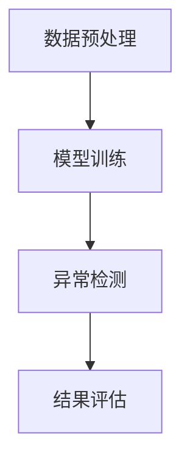
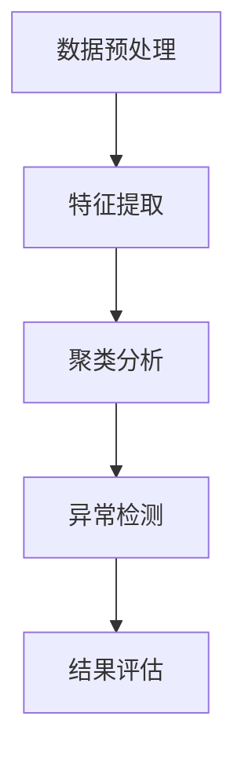
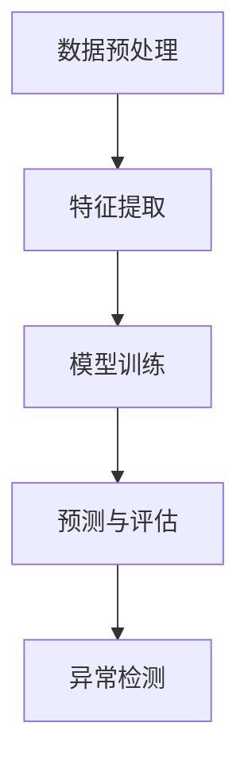

                 

### 第一部分：AI驱动的股票财务指标异常检测

### 第1章：问题背景与核心概念

#### 1.1 股票财务指标异常检测的重要性

股票市场是一个高度复杂且充满不确定性的生态系统。投资者在做出投资决策时，通常会依赖各种财务指标，如市盈率、市净率、毛利率、净利润率等，这些指标可以提供公司财务状况和未来增长潜力的线索。然而，市场常常受到宏观经济波动、公司内部管理问题等多种因素的影响，导致财务指标出现异常。

**1.1.1 股票市场波动性带来的挑战**

股票市场具有显著的波动性，投资者在决策过程中难免面临信息不对称、市场波动和不确定性等问题。异常检测作为一种有效的风险管理工具，能够帮助投资者识别潜在的异常情况，从而做出更为合理的投资决策。

**1.1.2 异常检测在投资决策中的关键作用**

异常检测在投资决策中扮演着至关重要的角色。通过对财务指标异常的及时识别，投资者可以提前采取应对措施，规避潜在风险。同时，异常检测还能帮助投资者发现市场机会，实现资产增值。

**1.1.3 AI技术在金融领域的发展与应用**

近年来，AI技术在金融领域的应用越来越广泛。通过机器学习和深度学习算法，AI能够从海量数据中提取有价值的信息，提高异常检测的准确性和效率。在股票财务指标异常检测方面，AI技术展现出了巨大的潜力。

#### 1.2 核心概念

**1.2.1 财务指标概述**

财务指标是衡量公司财务状况和运营效率的重要工具。常见的财务指标包括但不限于：

- **市盈率（PE）**：公司市值与其净利润之比，用于评估股票价格是否合理。
- **市净率（PB）**：公司市值与其净资产之比，反映股票的市场估值。
- **毛利率**：销售收入减去销售成本的比率，衡量公司的盈利能力。
- **净利润率**：净利润与销售收入之比，评估公司的利润水平。

**1.2.2 异常检测方法分类**

异常检测方法主要分为以下几类：

- **基于统计的方法**：如标准差法、孤立森林法等。
- **基于机器学习的方法**：如支持向量机（SVM）、决策树、神经网络等。
- **基于深度学习的方法**：如卷积神经网络（CNN）、循环神经网络（RNN）、长短期记忆网络（LSTM）等。

**1.2.3 AI驱动的异常检测**

AI驱动的异常检测利用机器学习和深度学习算法，通过对历史数据和实时数据的分析，识别出潜在的异常情况。其核心优势在于：

- **处理海量数据**：AI算法能够高效地处理和分析大规模的数据集，发现潜在的模式和异常。
- **自动特征提取**：AI算法可以自动从数据中提取特征，降低人工干预，提高检测效率。
- **自适应调整**：AI算法能够根据市场环境的变化，自适应地调整检测策略，提高检测效果。

### 小结

本章介绍了AI驱动的股票财务指标异常检测的重要性、核心概念以及当前的发展趋势。在接下来的章节中，我们将深入探讨AI驱动的异常检测原理、算法原理及其在金融领域的具体应用。

## 第2章：AI驱动异常检测原理

### 2.1 数据预处理

数据预处理是AI驱动异常检测的重要环节，其质量直接影响到后续模型的效果。以下是数据预处理的主要步骤：

#### 2.1.1 数据来源

数据来源包括历史财务报表数据、市场交易数据、新闻资讯等。为了确保数据的全面性和准确性，通常需要从多个渠道收集数据。

#### 2.1.2 数据清洗

数据清洗是预处理的关键步骤，主要包括以下任务：

- **缺失值处理**：通过插值、均值填补等方法处理缺失值。
- **异常值处理**：通过统计分析和可视化方法识别并处理异常值。
- **数据标准化**：通过缩放、归一化等方法将不同量纲的数据转换为统一的量纲，以便于后续分析。

#### 2.1.3 数据标准化

数据标准化是确保数据在相同量纲下进行比较和分析的重要步骤。常见的数据标准化方法包括：

- **最小-最大标准化**：将数据缩放到[0, 1]区间。
- **Z-Score标准化**：将数据缩放到[-1, 1]区间，通过计算每个数据与均值的距离（标准差）进行标准化。

### 2.2 算法原理

AI驱动的异常检测算法可以分为监督学习、无监督学习和半监督学习三种类型，每种算法都有其独特的原理和应用场景。

#### 2.2.1 监督学习算法

监督学习算法需要预先标记好的数据集，通过训练模型来识别异常。常见的监督学习算法包括：

- **支持向量机（SVM）**：通过找到一个最佳的超平面来分隔正常数据和异常数据。
- **决策树**：通过一系列的判断规则将数据划分为不同的类别。
- **神经网络**：通过多层神经网络学习输入和输出之间的关系。

监督学习算法的优点在于其高准确性和可解释性，但缺点是需要大量的标记数据，且对于新出现的数据特征不易适应。

#### 2.2.2 无监督学习算法

无监督学习算法不需要标记数据，通过分析数据本身的特征来识别异常。常见的无监督学习算法包括：

- **K-Means聚类**：将数据分为K个簇，每个簇内部的数据尽可能相似，不同簇之间的数据尽可能不同。
- **孤立森林**：通过随机隔离来识别异常数据，其优点是对大规模数据集的处理能力较强。
- **主成分分析（PCA）**：通过降维来识别数据中的主要特征，从而找出异常数据。

无监督学习算法的优点在于其不依赖标记数据，但缺点是可能难以解释和理解。

#### 2.2.3 半监督学习算法

半监督学习算法结合了监督学习和无监督学习的优点，通过利用部分标记数据和大量未标记数据来训练模型。常见的半监督学习算法包括：

- **自编码器**：通过无监督预训练来提取特征，然后利用少量标记数据进行微调。
- **图神经网络**：通过构建图结构来表示数据之间的关系，从而在未标记数据中学习特征。

半监督学习算法的优点在于其可以利用大量未标记的数据，提高模型的泛化能力，但缺点是模型的训练过程较为复杂。

### 2.3 Mermaid流程图

为了更好地理解以上算法的原理，我们可以使用Mermaid流程图来展示其工作流程。

#### 2.3.1 监督学习算法流程



#### 2.3.2 无监督学习算法流程



通过以上流程图，我们可以清晰地看到各种算法的基本工作流程和关键步骤。

### 小结

本章介绍了AI驱动异常检测的数据预处理方法以及三种主要的算法原理。在下一章中，我们将结合具体算法，深入探讨其在财务指标异常检测中的应用。

### 3.1 监督学习算法

#### 3.1.1 算法原理

监督学习算法在股票财务指标异常检测中具有广泛的应用。其基本原理是利用已知的数据集来训练模型，然后使用训练好的模型对新数据进行异常检测。以下是几种常见的监督学习算法：

- **支持向量机（SVM）**：通过找到一个最佳的超平面来分隔正常数据和异常数据。SVM的核心思想是将数据映射到高维空间，然后在高维空间中寻找一个最优的超平面，使得正常数据和异常数据尽可能地被分隔开。

  $$\min_{\mathbf{w}, \mathbf{b}} \frac{1}{2} ||\mathbf{w}||^2$$
  $$\text{subject to} \ \mathbf{w} \cdot \mathbf{x_i} - b \geq 1, \ \forall i$$

  其中，$\mathbf{w}$ 和 $\mathbf{b}$ 分别是超平面的权重和偏置，$||\mathbf{w}||$ 是超平面的法向量模长。

- **决策树**：通过一系列的判断规则将数据划分为不同的类别。决策树的核心在于利用特征的重要性来选择最佳的划分方式，从而构建一棵树状模型。

  决策树通常采用基尼不纯度或信息增益作为划分标准。

  $$Gini(\mathbf{D}) = 1 - \sum_{i=1}^{k} \left( \frac{|D_i|}{|\mathbf{D}|} \right)^2$$
  $$Entropy(\mathbf{D}) = -\sum_{i=1}^{k} \left( \frac{|D_i|}{|\mathbf{D}|} \right) \log_2 \left( \frac{|D_i|}{|\mathbf{D}|} \right)$$

- **神经网络**：通过多层神经网络学习输入和输出之间的关系。神经网络的核心在于通过反向传播算法不断调整网络的权重和偏置，以达到最佳拟合。

  神经网络通常采用激活函数（如ReLU、Sigmoid、Tanh）来引入非线性变换。

  $$\text{ReLU}(x) = \begin{cases} 
  x & \text{if } x > 0 \\
  0 & \text{otherwise} 
  \end{cases}$$
  $$\sigma(x) = \frac{1}{1 + e^{-x}}$$

#### 3.1.2 Mermaid流程图

下面是监督学习算法的Mermaid流程图：



#### 3.1.3 Python代码实现

以下是一个简单的Python代码示例，展示了如何使用支持向量机（SVM）进行股票财务指标的异常检测。

```python
import numpy as np
from sklearn import svm
from sklearn.model_selection import train_test_split
from sklearn.metrics import accuracy_score

# 加载数据
data = np.load('financial_data.npy')
labels = np.load('labels.npy')

# 数据预处理
X = data[:, :-1]  # 特征
y = data[:, -1]   # 标签

# 划分训练集和测试集
X_train, X_test, y_train, y_test = train_test_split(X, y, test_size=0.3, random_state=42)

# 训练SVM模型
model = svm.SVC(kernel='linear')
model.fit(X_train, y_train)

# 预测与评估
y_pred = model.predict(X_test)
accuracy = accuracy_score(y_test, y_pred)
print(f"Accuracy: {accuracy}")
```

### 小结

本章详细介绍了监督学习算法在股票财务指标异常检测中的应用，包括算法原理、流程图展示以及Python代码实现。在下一章中，我们将探讨无监督学习算法及其在异常检测中的应用。

