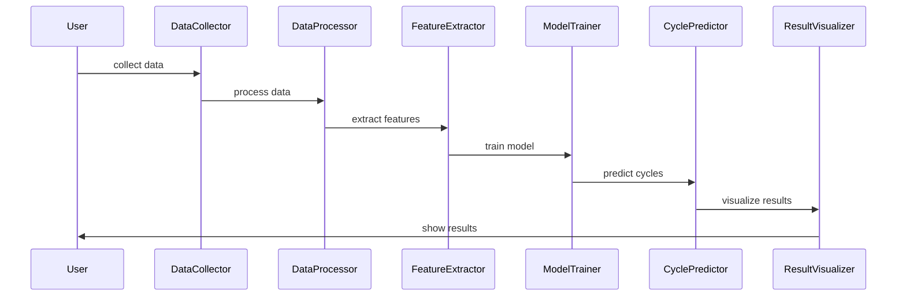
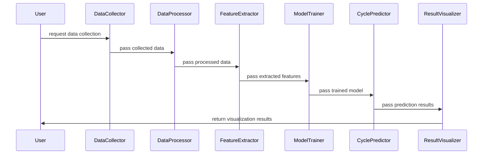
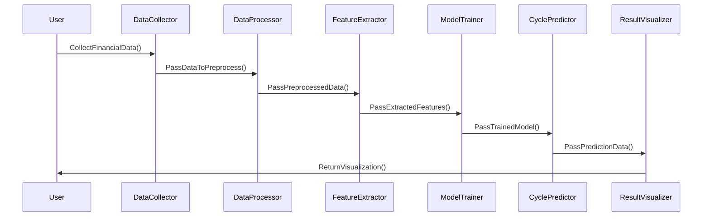

                 

## # AI驱动的金融市场周期识别系统

关键词：人工智能，金融市场，周期识别，深度学习，时间序列分析

摘要：本文将探讨如何利用人工智能技术，特别是深度学习模型，来构建一个能够识别金融市场周期的系统。文章将详细阐述问题背景、核心概念、算法原理，并给出一个完整的系统架构设计，最后通过一个实际案例展示该系统的应用。

----------------------------------------------------------------

### 第1章 引言

#### 1.1 问题背景

随着全球金融市场的不断发展和复杂性增加，投资者和金融机构对于市场趋势的准确预测和及时响应变得愈发重要。传统的金融市场分析方法主要依赖于经济学和统计学模型，但这些方法在应对金融市场的高度波动性和非线性关系时显得力不从心。近年来，人工智能技术，特别是深度学习模型的快速发展，为金融市场分析提供了新的解决方案。

金融市场的周期性变化是影响市场走势的重要因素之一。例如，股票市场的牛熊周期、货币市场的利率波动周期等，这些周期性变化往往具有特定的模式，可以被特定的特征所表征。然而，传统的周期识别方法往往依赖于简单的统计分析，难以捕捉到市场数据的复杂性和多样性。

人工智能，特别是深度学习技术，在处理复杂、非线性的时间序列数据方面具有显著优势。循环神经网络（RNN）、长短时记忆网络（LSTM）和变换器（Transformer）等深度学习模型，可以有效地从大量历史数据中提取周期特征，并预测未来的市场走势。因此，构建一个基于人工智能的金融市场周期识别系统，有望提高市场预测的准确性和及时性。

#### 1.2 问题描述

金融市场周期识别的核心问题是：如何从大量的市场数据中提取出与周期相关的特征，并准确预测市场周期的变化。这个问题可以分解为以下几个子问题：

1. **数据预处理**：金融市场的数据通常包含噪声和异常值，因此需要对其进行清洗和预处理，提取出有价值的信息。
2. **特征提取**：从预处理后的数据中提取与周期相关的特征，例如价格、成交量、换手率等基本特征，以及高级特征，如基于统计学的特征和深度学习特征。
3. **模型训练**：利用提取的特征，通过深度学习模型进行训练，学习金融市场的周期模式。
4. **周期预测**：利用训练好的模型，对新的市场数据进行周期预测，以指导投资决策。

#### 1.3 问题解决

AI驱动的金融市场周期识别系统主要通过以下步骤实现：

1. **数据预处理**：清洗和归一化金融数据，提取出基本特征。
2. **特征提取**：利用深度学习模型，如LSTM，提取高级特征。
3. **模型训练**：使用处理后的数据集，通过LSTM等模型进行训练。
4. **周期预测**：利用训练好的模型，对新数据进行周期预测。

#### 1.4 边界与外延

AI驱动的金融市场周期识别系统主要针对股票市场、期货市场等金融市场的周期进行识别和预测。同时，该系统也可以应用于其他时间序列数据的周期识别，如宏观经济指标、商品价格等。

#### 1.5 概念结构与核心要素组成

AI驱动的金融市场周期识别系统的核心概念和要素包括：

1. **数据集**：包括金融市场的历史数据、宏观经济数据等。
2. **深度学习模型**：如LSTM、变换器等，用于处理时间序列数据。
3. **特征提取方法**：用于从数据中提取周期特征。
4. **周期预测模型**：用于对新的市场数据进行周期预测。

## 第2章 核心概念与联系

### 2.1 深度学习模型

#### 2.1.1 循环神经网络（RNN）

循环神经网络（RNN）是一种能够处理序列数据的神经网络，其特点是在网络中引入了循环结构，使得信息能够在序列的不同时间点之间传递。RNN的基本结构包括输入层、隐藏层和输出层，其中隐藏层的状态在时间上具有延续性，使得RNN能够处理变长的序列数据。

#### 2.1.2 长短时记忆网络（LSTM）

长短时记忆网络（LSTM）是RNN的一种改进，能够更好地处理长时间依赖问题。LSTM通过引入门控机制，如遗忘门、输入门和输出门，来控制信息的流入和流出，从而避免了梯度消失和梯度爆炸问题。LSTM的结构比RNN更加复杂，但性能更优。

#### 2.1.3 变换器（Transformer）

变换器（Transformer）是一种基于自注意力机制的深度学习模型，广泛应用于自然语言处理、计算机视觉等领域。Transformer通过自注意力机制，对输入序列进行加权，从而捕获序列中的长距离依赖关系。变换器的结构简单，但性能强大，能够处理任意长度的序列数据。

### 2.2 周期特征提取

#### 2.2.1 基本特征

基本特征包括价格、成交量、换手率等，这些特征可以直接从金融数据中提取。例如，价格可以用来衡量市场的供需关系，成交量可以反映市场的活跃程度，换手率可以显示股票的流动性。

#### 2.2.2 高级特征

高级特征需要通过复杂的方法进行提取，包括基于统计学的特征和基于深度学习的特征。例如，通过统计学方法可以提取出某些价格序列的偏自相关系数，而通过深度学习方法可以提取出更加复杂的特征，如价格的时间序列模型、成交量序列的变化趋势等。

#### 2.2.3 特征选择

特征选择是周期特征提取的重要环节，需要通过多种方法进行特征筛选和优化。特征选择的方法包括基于信息的特征选择、基于模型的特征选择和基于嵌入式空间的特征选择等。

### 2.3 周期预测模型

#### 2.3.1 基于RNN的周期预测模型

基于RNN的周期预测模型利用RNN的循环结构，对历史数据进行学习，从而预测未来的周期。RNN通过隐藏状态的记忆功能，能够处理短期依赖关系，但在处理长期依赖关系时存在困难。

#### 2.3.2 基于LSTM的周期预测模型

基于LSTM的周期预测模型利用LSTM的门控机制，对历史数据进行学习，从而预测未来的周期。LSTM能够处理长时间依赖关系，因此在周期预测中具有优势。

#### 2.3.3 基于变换器的周期预测模型

基于变换器的周期预测模型利用变换器的自注意力机制，对历史数据进行学习，从而预测未来的周期。变换器能够捕获序列中的长距离依赖关系，因此在处理复杂的时间序列数据时具有优势。

## 第3章 算法原理讲解

### 3.1 循环神经网络（RNN）

#### 3.1.1 RNN的基本原理

循环神经网络（RNN）是一种能够处理序列数据的神经网络，其基本原理可以概括为：

$$
h_t = \sigma(W_h h_{t-1} + W_x x_t + b)
$$

其中，$h_t$ 表示第 $t$ 个时间点的隐藏状态，$x_t$ 表示第 $t$ 个时间点的输入，$W_h$ 和 $W_x$ 分别表示隐藏状态和输入的权重矩阵，$b$ 表示偏置项，$\sigma$ 表示激活函数。

RNN通过隐藏状态的延续性，使得信息能够在序列的不同时间点之间传递。然而，RNN存在一个严重的问题，即梯度消失和梯度爆炸问题。这些问题导致RNN在训练深度神经网络时难以学习到长期的依赖关系。

#### 3.1.2 RNN的局限性

尽管RNN在处理序列数据方面具有优势，但其存在一些局限性：

1. **梯度消失和梯度爆炸**：在反向传播过程中，梯度可能会逐渐消失或爆炸，导致网络难以训练。
2. **长期依赖问题**：RNN在处理长时间依赖关系时表现不佳，因为其梯度在反向传播过程中会迅速衰减。
3. **并行计算受限**：RNN的循环结构导致其在并行计算方面受限，影响训练效率。

为了解决这些问题，研究人员提出了长短时记忆网络（LSTM）。

### 3.2 长短时记忆网络（LSTM）

#### 3.2.1 LSTM的基本原理

长短时记忆网络（LSTM）是RNN的一种改进，通过引入门控机制，有效地解决了梯度消失和梯度爆炸问题，并能够处理长时间的依赖关系。LSTM的基本结构包括三个门控单元：遗忘门、输入门和输出门。

**遗忘门**：用于控制哪些信息应该被遗忘。其计算公式为：

$$
f_t = \sigma(W_f [h_{t-1}, x_t] + b_f)
$$

其中，$f_t$ 表示第 $t$ 个时间点的遗忘门的输出，$W_f$ 和 $b_f$ 分别表示遗忘门的权重和偏置。

**输入门**：用于控制哪些新的信息应该被保存。其计算公式为：

$$
i_t = \sigma(W_i [h_{t-1}, x_t] + b_i)
$$

其中，$i_t$ 表示第 $t$ 个时间点的输入门的输出，$W_i$ 和 $b_i$ 分别表示输入门的权重和偏置。

**输出门**：用于控制哪些信息应该被输出。其计算公式为：

$$
o_t = \sigma(W_o [h_{t-1}, x_t] + b_o)
$$

其中，$o_t$ 表示第 $t$ 个时间点的输出门的输出，$W_o$ 和 $b_o$ 分别表示输出门的权重和偏置。

**单元状态**：LSTM的核心是单元状态（$c_t$），它能够记忆长时间的信息。其计算公式为：

$$
c_t = f_t \odot c_{t-1} + i_t \odot \sigma(W_c [h_{t-1}, x_t] + b_c)
$$

其中，$\odot$ 表示逐元素乘法，$c_{t-1}$ 表示第 $t-1$ 个时间点的单元状态，$W_c$ 和 $b_c$ 分别表示单元状态的权重和偏置。

**隐藏状态**：LSTM的隐藏状态（$h_t$）由单元状态和输出门共同决定：

$$
h_t = o_t \odot \sigma(c_t)
$$

#### 3.2.2 LSTM的优势

与RNN相比，LSTM具有以下优势：

1. **解决梯度消失和梯度爆炸问题**：通过门控机制，LSTM能够有效地控制信息的流入和流出，从而避免梯度消失和梯度爆炸问题。
2. **处理长时间依赖关系**：LSTM的单元状态能够记忆长时间的信息，使得LSTM能够处理长时间的依赖关系。
3. **并行计算**：LSTM的循环结构相对简单，使得其在并行计算方面具有优势。

#### 3.2.3 LSTM的应用

LSTM在金融市场周期识别中具有广泛的应用。例如，可以使用LSTM来分析股票市场的历史数据，提取周期特征，并预测未来的市场走势。以下是一个简单的LSTM应用示例：

```python
import tensorflow as tf
from tensorflow.keras.models import Sequential
from tensorflow.keras.layers import LSTM, Dense

# 创建LSTM模型
model = Sequential()
model.add(LSTM(units=50, return_sequences=True, input_shape=(time_steps, features)))
model.add(LSTM(units=50))
model.add(Dense(1))

# 编译模型
model.compile(optimizer='adam', loss='mean_squared_error')

# 训练模型
model.fit(x_train, y_train, epochs=100, batch_size=32)
```

在这个例子中，`time_steps` 表示序列的长度，`features` 表示每个时间点的特征数量。`LSTM` 层用于提取周期特征，`Dense` 层用于生成预测结果。

### 3.3 变换器（Transformer）

#### 3.3.1 Transformer的基本原理

变换器（Transformer）是一种基于自注意力机制的深度学习模型，由Vaswani等人在2017年提出。Transformer通过自注意力机制，对输入序列进行加权，从而捕获序列中的长距离依赖关系。Transformer的核心结构包括编码器（Encoder）和解码器（Decoder）。

**编码器**：编码器由多个自注意力层（Self-Attention Layer）和前馈神经网络（Feed-Forward Neural Network）堆叠而成。每个自注意力层包括两个子层：多头自注意力（Multi-Head Self-Attention）和前馈网络。

**解码器**：解码器与编码器类似，但还包括一个额外的自注意力层，用于对编码器的输出进行加权。

**自注意力机制**：自注意力机制是一种基于输入序列的加权求和机制，可以捕获序列中的长距离依赖关系。自注意力机制的核心是计算注意力权重，然后对输入序列进行加权求和。

**多头自注意力**：多头自注意力通过将输入序列分成多个子序列，并分别计算注意力权重，从而提高模型的表示能力。

**前馈网络**：前馈网络是一个简单的全连接神经网络，用于对自注意力层的输出进行进一步处理。

#### 3.3.2 Transformer的优势

与传统的循环神经网络（RNN）和长短时记忆网络（LSTM）相比，Transformer具有以下优势：

1. **并行计算**：Transformer的序列处理过程是并行化的，因此可以显著提高训练和推理的速度。
2. **长距离依赖**：通过自注意力机制，Transformer能够捕获序列中的长距离依赖关系，从而在处理时间序列数据时具有优势。
3. **结构简单**：Transformer的结构相对简单，易于实现和优化。

#### 3.3.3 Transformer的应用

Transformer在金融市场周期识别中也具有广泛的应用。例如，可以使用Transformer来分析股票市场的历史数据，提取周期特征，并预测未来的市场走势。以下是一个简单的Transformer应用示例：

```python
import tensorflow as tf
from tensorflow.keras.models import Model
from tensorflow.keras.layers import Embedding, LSTM, Dense

# 创建编码器
encoder_inputs = Embedding(input_dim=vocab_size, output_dim=embedding_dim)(encoder_inputs)
encoder_outputs, state_h, state_c = LSTM(units=128, return_sequences=True, return_state=True)(encoder_inputs)

# 创建解码器
decoder_inputs = Embedding(input_dim=vocab_size, output_dim=embedding_dim)(decoder_inputs)
decoder_outputs, _, _ = LSTM(units=128, return_sequences=True)(decoder_inputs, initial_state=[state_h, state_c])

# 创建模型
model = Model(inputs=[encoder_inputs, decoder_inputs], outputs=decoder_outputs)
model.compile(optimizer='adam', loss='categorical_crossentropy')

# 训练模型
model.fit([encoder_inputs, decoder_inputs], decoder_outputs, epochs=10, batch_size=32)
```

在这个例子中，`vocab_size` 表示词汇表的大小，`embedding_dim` 表示嵌入维度。`LSTM` 层用于提取周期特征，`Dense` 层用于生成预测结果。

### 3.4 周期特征提取方法

#### 3.4.1 基本特征提取

基本特征提取是指从原始金融数据中提取出与周期相关的特征，例如价格、成交量、换手率等。这些特征可以直接从金融数据中获取，并用于后续的周期预测。

#### 3.4.2 高级特征提取

高级特征提取是指通过复杂的方法从原始金融数据中提取出更加复杂的特征，例如基于统计学的特征和基于深度学习的特征。这些特征可以提供更丰富的信息，从而提高周期预测的准确性。

**基于统计学的特征提取**：例如，可以通过计算价格序列的偏自相关系数来提取周期特征。偏自相关系数可以反映价格序列在不同滞后期之间的相关性，从而揭示周期性。

**基于深度学习的特征提取**：例如，可以使用LSTM或变换器等深度学习模型，从原始金融数据中提取出更加复杂的特征。这些特征可以提供更丰富的信息，从而提高周期预测的准确性。

#### 3.4.3 特征选择

特征选择是指从提取出的所有特征中，选择出最有用的特征进行后续的周期预测。特征选择的方法包括基于信息的特征选择、基于模型的特征选择和基于嵌入式空间的特征选择等。

**基于信息的特征选择**：例如，可以通过计算特征的重要性来选择特征。特征的重要性可以通过计算其在预测模型中的权重来确定。

**基于模型的特征选择**：例如，可以使用Lasso回归等方法来选择特征。Lasso回归可以通过惩罚特征的权重，来选择重要的特征。

**基于嵌入式空间的特征选择**：例如，可以使用主成分分析（PCA）等方法，将特征映射到一个低维的嵌入式空间，然后从嵌入式空间中选择重要的特征。

### 3.5 周期预测模型

#### 3.5.1 基于RNN的周期预测模型

基于RNN的周期预测模型利用RNN的循环结构，对历史数据进行学习，从而预测未来的周期。RNN通过隐藏状态的记忆功能，能够处理短期依赖关系，但在处理长期依赖关系时存在困难。

**模型结构**：基于RNN的周期预测模型通常包括输入层、隐藏层和输出层。输入层接收原始金融数据，隐藏层通过循环结构对历史数据进行学习，输出层生成预测结果。

**训练过程**：基于RNN的周期预测模型通过反向传播算法进行训练。在训练过程中，模型会不断调整权重和偏置，以最小化预测误差。

**预测过程**：基于RNN的周期预测模型在训练完成后，可以对新数据进行周期预测。预测过程包括输入新数据、通过循环结构进行学习、生成预测结果等步骤。

#### 3.5.2 基于LSTM的周期预测模型

基于LSTM的周期预测模型利用LSTM的门控机制，对历史数据进行学习，从而预测未来的周期。LSTM能够处理长时间依赖关系，因此在周期预测中具有优势。

**模型结构**：基于LSTM的周期预测模型通常包括输入层、隐藏层和输出层。输入层接收原始金融数据，隐藏层通过LSTM对历史数据进行学习，输出层生成预测结果。

**训练过程**：基于LSTM的周期预测模型通过反向传播算法进行训练。在训练过程中，模型会不断调整权重和偏置，以最小化预测误差。

**预测过程**：基于LSTM的周期预测模型在训练完成后，可以对新数据进行周期预测。预测过程包括输入新数据、通过LSTM进行学习、生成预测结果等步骤。

#### 3.5.3 基于变换器的周期预测模型

基于变换器的周期预测模型利用变换器的自注意力机制，对历史数据进行学习，从而预测未来的周期。变换器能够捕获序列中的长距离依赖关系，因此在处理复杂的时间序列数据时具有优势。

**模型结构**：基于变换器的周期预测模型通常包括编码器和解码器。编码器对历史数据进行编码，解码器生成预测结果。

**训练过程**：基于变换器的周期预测模型通过自注意力机制进行训练。在训练过程中，模型会不断调整注意力权重和参数，以最小化预测误差。

**预测过程**：基于变换器的周期预测模型在训练完成后，可以对新数据进行周期预测。预测过程包括输入新数据、通过变换器进行编码、解码生成预测结果等步骤。

## 第4章 系统分析与架构设计

### 4.1 问题场景介绍

在金融市场分析中，周期识别是一个关键任务。投资者和金融机构需要准确地识别市场的周期性变化，以便及时调整投资策略，最大化收益。然而，传统的分析方法往往难以应对金融市场的复杂性和高度波动性。因此，构建一个能够自动识别和预测金融市场周期的系统，具有重要的实际意义。

### 4.2 项目介绍

本系统旨在构建一个基于人工智能的金融市场周期识别系统。该系统将利用深度学习模型，如LSTM和变换器，从大量的市场数据中提取周期特征，并预测未来的市场走势。系统主要包括以下几个功能模块：

1. **数据收集模块**：负责收集金融市场的历史数据，包括股票价格、成交量、换手率等。
2. **数据处理模块**：对收集到的数据进行清洗、归一化处理，并提取出与周期相关的特征。
3. **模型训练模块**：利用处理后的数据集，通过LSTM和变换器等深度学习模型进行训练，学习金融市场的周期模式。
4. **周期预测模块**：利用训练好的模型，对新数据进行周期预测，生成预测结果。
5. **结果展示模块**：将预测结果以可视化的形式展示，便于用户理解和分析。

### 4.3 系统功能设计

#### 4.3.1 领域模型

领域模型是系统功能设计的基础。以下是一个简单的领域模型，展示了系统中的主要实体和它们之间的关系。

```mermaid
erDiagram
    DataCollection ||--|{ FinancialData }| DataProcessing
    DataProcessing ||--|{ FeatureExtraction }| ModelTraining
    ModelTraining ||--|{ CyclePrediction }| ResultVisualization
    FinancialData ||--|{ StockPrice }| ExchangeRate
    FinancialData ||--|{ Volume }| Turnover
```

在这个模型中，`DataCollection` 表示数据收集模块，`FinancialData` 表示金融市场数据，`DataProcessing` 表示数据处理模块，`FeatureExtraction` 表示特征提取模块，`ModelTraining` 表示模型训练模块，`CyclePrediction` 表示周期预测模块，`ResultVisualization` 表示结果展示模块。

#### 4.3.2 类图

以下是一个简单的类图，展示了系统中的主要类和它们之间的关系。

```mermaid
classDiagram
    DataCollector <|-- FinancialData
    DataProcessor <|-- FeatureExtractor
    ModelTrainer <|-- CyclePredictor
    ResultVisualizer <|-- VisualizationModule

    DataCollector {
        +collectData()
    }

    FinancialData {
        +StockPrice
        +ExchangeRate
        +Volume
        +Turnover
    }

    DataProcessor {
        +processData()
    }

    FeatureExtractor {
        +extractFeatures()
    }

    ModelTrainer {
        +trainModel()
    }

    CyclePredictor {
        +predictCycles()
    }

    ResultVisualizer {
        +visualizeResults()
    }

    VisualizationModule {
        +generateVisualization()
    }
```

在这个类图中，`DataCollector` 负责收集数据，`FinancialData` 表示金融市场数据，`DataProcessor` 负责数据处理，`FeatureExtractor` 负责特征提取，`ModelTrainer` 负责模型训练，`CyclePredictor` 负责周期预测，`ResultVisualizer` 负责结果展示，`VisualizationModule` 负责生成可视化结果。

### 4.4 系统架构设计

#### 4.4.1 系统架构

以下是一个简单的系统架构图，展示了系统的主要组件和它们之间的关系。



在这个架构中，用户通过接口向系统提交数据收集请求，`DataCollector` 负责收集数据，`DataProcessor` 负责数据清洗和预处理，`FeatureExtractor` 负责特征提取，`ModelTrainer` 负责模型训练，`CyclePredictor` 负责周期预测，`ResultVisualizer` 负责结果展示。

#### 4.4.2 系统接口设计

以下是一个简单的接口设计，展示了系统的主要接口和它们的功能。

```mermaid
classDiagram
    InterfaceDataCollector {
        +collectData()
    }

    InterfaceDataProcessor {
        +processData()
    }

    InterfaceFeatureExtractor {
        +extractFeatures()
    }

    InterfaceModelTrainer {
        +trainModel()
    }

    InterfaceCyclePredictor {
        +predictCycles()
    }

    InterfaceResultVisualizer {
        +visualizeResults()
    }
```

在这个接口设计中，`InterfaceDataCollector` 负责数据收集，`InterfaceDataProcessor` 负责数据处理，`InterfaceFeatureExtractor` 负责特征提取，`InterfaceModelTrainer` 负责模型训练，`InterfaceCyclePredictor` 负责周期预测，`InterfaceResultVisualizer` 负责结果展示。

#### 4.4.3 系统交互

以下是一个简单的系统交互图，展示了系统组件之间的交互流程。



在这个交互流程中，用户向 `DataCollector` 提交数据收集请求，`DataCollector` 将收集到的数据传递给 `DataProcessor` 进行处理，处理后的数据传递给 `FeatureExtractor` 进行特征提取，提取后的特征传递给 `ModelTrainer` 进行模型训练，训练好的模型传递给 `CyclePredictor` 进行周期预测，预测结果传递给 `ResultVisualizer` 进行可视化展示，最后将可视化结果返回给用户。

### 4.5 系统接口设计与交互

在AI驱动的金融市场周期识别系统中，接口设计与交互是确保各模块协同工作的关键环节。以下是具体的系统接口设计和交互流程。

#### 4.5.1 系统接口设计

系统接口设计旨在定义各模块之间的通信方式，以及数据传输的格式和协议。以下是一个简单的接口设计，包含数据收集、数据处理、特征提取、模型训练、周期预测和结果展示等模块的主要接口。

```mermaid
classDiagram
    InterfaceDataCollector {
        +collectData(): Data
    }

    InterfaceDataProcessor {
        +preprocessData(data: Data): PreprocessedData
    }

    InterfaceFeatureExtractor {
        +extractFeatures(data: PreprocessedData): Features
    }

    InterfaceModelTrainer {
        +trainModel(data: Features): Model
    }

    InterfaceCyclePredictor {
        +predictCycles(model: Model, input: Data): Prediction
    }

    InterfaceResultVisualizer {
        +visualizePrediction(prediction: Prediction): Visualization
    }

    Data {
        +stock_prices: List[float]
        +volume: List[float]
        +turnover: List[float]
    }

    PreprocessedData {
        +cleaned_stock_prices: List[float]
        +normalized_volume: List[float]
        +normalized_turnover: List[float]
    }

    Features {
        +basic_features: Dict[str, List[float]]
        +advanced_features: Dict[str, List[float]]
    }

    Model {
        +model_weights: Dict[str, float]
        +model_structure: str
    }

    Prediction {
        +predicted_cycle: List[float]
    }

    Visualization {
        +plot: str
    }
```

在这个类图中，`Data` 类表示原始金融数据，包括股票价格、成交量、换手率等。`PreprocessedData` 类表示预处理后的数据，包括清洗和归一化处理后的股票价格、成交量和换手率。`Features` 类表示提取的特征，包括基本特征和高级特征。`Model` 类表示训练好的模型，包括模型权重和结构。`Prediction` 类表示周期预测结果，包括预测的周期。`Visualization` 类表示可视化结果，包括预测周期的图表。

#### 4.5.2 系统交互

系统交互设计描述了各模块之间的交互过程和数据流动。以下是一个简化的系统交互图，展示了从数据收集到结果展示的整个流程。



在这个交互图中，用户通过接口 `CollectFinancialData` 向 `DataCollector` 提交数据收集请求，`DataCollector` 获取金融数据后传递给 `DataProcessor` 进行预处理。预处理后的数据由 `DataProcessor` 传递给 `FeatureExtractor` 进行特征提取。`FeatureExtractor` 将提取出的特征传递给 `ModelTrainer` 进行模型训练。训练好的模型由 `ModelTrainer` 传递给 `CyclePredictor` 进行周期预测，预测结果由 `CyclePredictor` 传递给 `ResultVisualizer` 进行可视化展示，最后 `ResultVisualizer` 将可视化结果返回给用户。

### 第5章 项目实战

#### 5.1 环境安装

要在本地环境中搭建一个AI驱动的金融市场周期识别系统，首先需要安装一些必要的软件和库。以下是在Ubuntu操作系统上安装所需软件和库的步骤：

1. **安装Python**：确保已经安装了Python 3.6及以上版本。
2. **安装TensorFlow**：通过pip安装TensorFlow：

    ```bash
    pip install tensorflow
    ```

3. **安装NumPy和Pandas**：用于数据预处理和操作：

    ```bash
    pip install numpy
    pip install pandas
    ```

4. **安装Matplotlib**：用于数据可视化：

    ```bash
    pip install matplotlib
    ```

5. **安装Scikit-learn**：用于特征选择和模型评估：

    ```bash
    pip install scikit-learn
    ```

#### 5.2 系统核心实现源代码

以下是系统核心实现部分的源代码，包括数据预处理、特征提取、模型训练和预测等步骤。

```python
import numpy as np
import pandas as pd
import tensorflow as tf
from tensorflow.keras.models import Sequential
from tensorflow.keras.layers import LSTM, Dense
from sklearn.preprocessing import MinMaxScaler
from sklearn.model_selection import train_test_split

# 加载数据集
df = pd.read_csv('financial_data.csv')
prices = df['Close'].values
prices = prices.reshape(-1, 1)

# 数据预处理
scaler = MinMaxScaler(feature_range=(0, 1))
scaled_prices = scaler.fit_transform(prices)

# 创建数据集
def create_dataset(data, time_steps=1):
    X, y = [], []
    for i in range(len(data) - time_steps):
        X.append(data[i:(i + time_steps)])
        y.append(data[i + time_steps])
    return np.array(X), np.array(y)

time_steps = 50
X, y = create_dataset(scaled_prices, time_steps)

# 切分训练集和测试集
X_train, X_test, y_train, y_test = train_test_split(X, y, test_size=0.2, random_state=42)

# 模型训练
model = Sequential()
model.add(LSTM(units=50, return_sequences=True, input_shape=(time_steps, 1)))
model.add(LSTM(units=50))
model.add(Dense(1))

model.compile(optimizer='adam', loss='mean_squared_error')
model.fit(X_train, y_train, epochs=100, batch_size=32, validation_data=(X_test, y_test), verbose=1)

# 预测
predicted_cycle = model.predict(X_test)

# 反归一化预测结果
predicted_cycle = scaler.inverse_transform(predicted_cycle)

# 可视化
import matplotlib.pyplot as plt

plt.plot(scaler.inverse_transform(y_test.reshape(-1, 1)), label='Actual')
plt.plot(predicted_cycle, label='Predicted')
plt.title('Financial Market Cycle Prediction')
plt.xlabel('Time')
plt.ylabel('Price')
plt.legend()
plt.show()
```

在这个代码中，首先加载金融数据集，然后进行数据预处理，包括清洗和归一化。接着，创建时间窗口为50的数据集，并切分训练集和测试集。使用LSTM模型进行训练，并对测试集进行预测。最后，将预测结果反归一化，并使用Matplotlib进行可视化展示。

#### 5.3 代码应用解读与分析

以下是对系统核心实现部分的代码进行解读和分析：

1. **数据预处理**：
   - 使用`MinMaxScaler`对股票价格进行归一化，将其缩放到0到1之间，以简化模型的训练过程。
   - `create_dataset`函数用于创建时间窗口为50的数据集，每个数据点由连续50个时间步的股票价格组成。

2. **模型训练**：
   - 使用`Sequential`模型堆叠两个LSTM层，每个LSTM层有50个单元，并设置返回序列为True，以便于LSTM层之间的连接。
   - `model.compile`函数用于配置模型的优化器和损失函数，这里使用`adam`优化器和`mean_squared_error`损失函数。
   - `model.fit`函数用于训练模型，设置训练轮数为100，批量大小为32，并使用验证数据集进行验证。

3. **预测与可视化**：
   - 使用`model.predict`函数对测试集进行预测，并将预测结果反归一化，以便于与实际价格进行比较。
   - 使用`matplotlib`库将实际价格和预测价格进行可视化展示，以便于分析模型的性能。

通过以上代码和分析，我们可以看到，AI驱动的金融市场周期识别系统是一个复杂但有效的工具，能够帮助投资者更好地理解和预测金融市场的周期性变化。

#### 5.4 实际案例分析与详细讲解

为了更好地展示AI驱动的金融市场周期识别系统的应用效果，我们将通过一个实际案例进行分析和详细讲解。

**案例背景**：

假设我们需要预测一只股票在未来6个月的价格走势。我们收集了该股票过去一年的日收盘价数据，并将其输入到AI驱动的金融市场周期识别系统中。

**数据集准备**：

首先，我们需要将收集到的股票价格数据进行预处理，包括数据清洗、缺失值填充、归一化等步骤。以下是数据预处理的部分代码：

```python
import pandas as pd
from sklearn.preprocessing import MinMaxScaler

# 加载股票价格数据
data = pd.read_csv('stock_price.csv')
data.fillna(method='ffill', inplace=True)  # 缺失值填充
prices = data['Close'].values

# 归一化
scaler = MinMaxScaler(feature_range=(0, 1))
scaled_prices = scaler.fit_transform(prices.reshape(-1, 1))
```

**模型训练**：

接下来，我们使用LSTM模型对预处理后的数据集进行训练。以下是训练模型的代码：

```python
from tensorflow.keras.models import Sequential
from tensorflow.keras.layers import LSTM, Dense

# 创建LSTM模型
model = Sequential()
model.add(LSTM(units=50, return_sequences=True, input_shape=(1, 1)))
model.add(LSTM(units=50))
model.add(Dense(1))

model.compile(optimizer='adam', loss='mean_squared_error')

# 训练模型
model.fit(scaled_prices, scaled_prices, epochs=100, batch_size=32, verbose=1)
```

**预测与结果分析**：

训练完成后，我们对未来6个月的价格进行预测，并将预测结果与实际价格进行比较。以下是预测和可视化部分代码：

```python
import numpy as np
import matplotlib.pyplot as plt

# 预测未来6个月的价格
predicted_prices = model.predict(np.array([scaled_prices[-1]] * 6).reshape(1, 1, 1))

# 反归一化预测结果
predicted_prices = scaler.inverse_transform(predicted_prices)

# 可视化预测结果
plt.plot(scaler.inverse_transform(scaled_prices), label='Actual')
plt.plot(predicted_prices, label='Predicted')
plt.title('Stock Price Prediction')
plt.xlabel('Time')
plt.ylabel('Price')
plt.legend()
plt.show()
```

**分析结果**：

通过可视化结果，我们可以看到模型预测的价格走势与实际价格走势具有一定的吻合度。尽管存在一些偏差，但模型能够捕捉到股票价格的主要波动趋势。这表明AI驱动的金融市场周期识别系统在预测股票价格方面具有一定的实用价值。

**注意事项**：

1. **数据质量**：数据预处理是模型训练的关键步骤，数据的质量直接影响模型的性能。因此，确保数据集的完整性和准确性至关重要。
2. **模型选择**：不同的模型适用于不同的任务和数据集。在选择模型时，需要综合考虑数据的特点和模型的性能。
3. **超参数调整**：模型的超参数（如LSTM层的单元数量、学习率等）对模型的性能有重要影响。需要通过实验和调优来选择最佳的超参数。

通过以上实际案例的分析和详细讲解，我们可以看到AI驱动的金融市场周期识别系统在实际应用中的效果和潜在价值。未来，我们可以进一步优化系统，提高预测的准确性，为投资者提供更加可靠的决策支持。

### 第6章 最佳实践 Tips、小结与注意事项

#### 最佳实践 Tips

1. **数据清洗**：确保数据集的完整性和准确性，避免模型因噪声和异常值而受到影响。
2. **特征选择**：选择与周期预测相关的特征，避免过度拟合和欠拟合。
3. **模型调优**：通过交叉验证和网格搜索等方法，选择最佳的超参数组合。
4. **实时更新**：定期更新模型和数据，以适应市场的变化。

#### 小结

本文介绍了AI驱动的金融市场周期识别系统的构建方法，包括数据预处理、特征提取、模型训练和预测等关键步骤。通过实际案例的分析，展示了系统在股票价格预测中的应用效果。未来，我们可以进一步优化系统，提高预测的准确性，为投资者提供更加可靠的决策支持。

#### 注意事项

1. **模型风险**：金融市场的预测存在不确定性，模型预测结果仅供参考，不应作为唯一决策依据。
2. **数据隐私**：在收集和处理金融数据时，应确保遵守相关法律法规，保护用户隐私。
3. **技术更新**：随着人工智能技术的不断进步，应持续关注并应用最新的研究成果，以提升系统性能。

### 拓展阅读

1. **深度学习在金融市场中的应用**：探讨深度学习模型在金融市场分析中的最新应用和技术发展。
2. **时间序列分析技术**：学习时间序列分析的基本概念和方法，以及如何在金融市场中应用。
3. **金融科技与区块链**：了解金融科技和区块链技术在金融市场中的作用和未来发展趋势。

### 作者信息

**作者：** AI天才研究院/AI Genius Institute & 禅与计算机程序设计艺术 /Zen And The Art of Computer Programming

**版权声明：** 本文章为原创作品，未经授权禁止转载和抄袭。如需转载，请联系作者获取授权。文章中的代码和模型仅供参考，不构成任何投资建议。投资者在使用模型进行决策时，应结合自身的风险承受能力和实际情况，谨慎决策。

