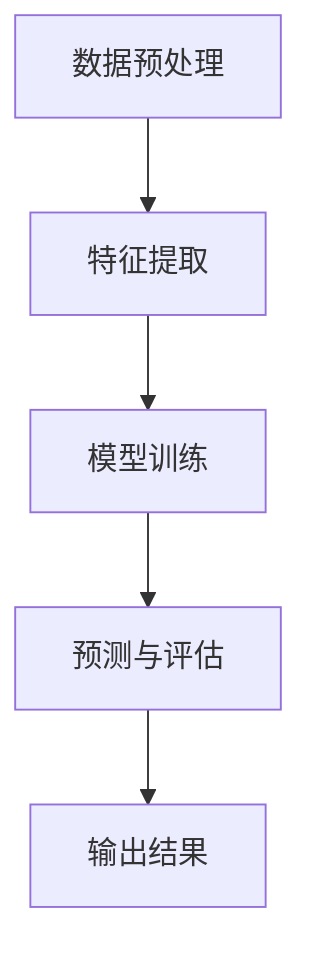
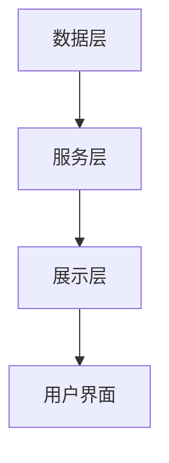
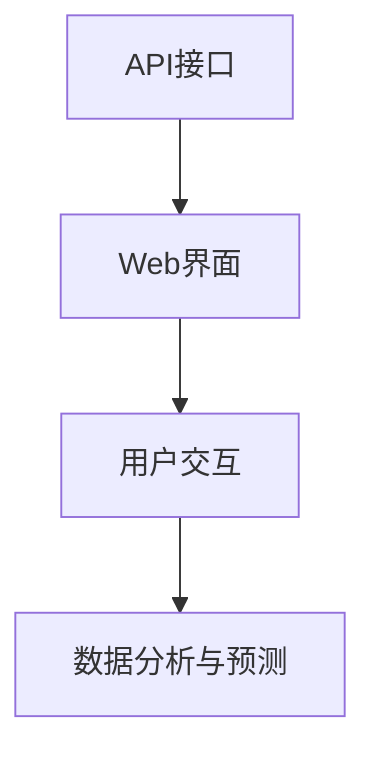

                 

### 文章标题：AI驱动的金融市场泡沫识别系统

#### 关键词：人工智能、金融市场、泡沫识别、机器学习、深度学习、数据预处理、算法原理、系统设计、实战案例

#### 摘要：
本文深入探讨AI技术在金融市场泡沫识别中的应用，从背景介绍、核心概念、算法原理、系统设计到实战案例，详细解析如何利用人工智能构建一个高效的金融市场泡沫识别系统。文章旨在为金融科技领域的研究者与实践者提供系统的理论指导和实战经验。

## 目录大纲

----------------------------------------------------------------

### 第一部分: AI在金融市场泡沫识别中的应用基础

#### 第1章: 金融市场泡沫识别的背景与挑战

##### 1.1 金融市场泡沫的历史与现状

##### 1.2 金融市场泡沫的危害与影响

##### 1.3 AI技术在金融市场泡沫识别中的优势

#### 第2章: AI核心概念与原理

##### 2.1 AI的基本概念

##### 2.2 机器学习与深度学习的原理

##### 2.3 数据分析与数据挖掘的基础知识

#### 第3章: 金融市场数据预处理

##### 3.1 数据来源与数据类型

##### 3.2 数据清洗与数据转换

##### 3.3 特征工程

#### 第4章: 泡沫识别的算法原理

##### 4.1 算法概述

##### 4.2 模型选择与评估

##### 4.3 泡沫识别算法的mermaid流程图

#### 第5章: AI驱动的金融市场泡沫识别系统设计

##### 5.1 系统需求分析

##### 5.2 系统架构设计

##### 5.3 系统接口设计与交互

#### 第6章: 系统实现与测试

##### 6.1 系统环境配置

##### 6.2 核心算法实现

##### 6.3 系统测试与优化

#### 第7章: 项目实战案例分析

##### 7.1 项目介绍

##### 7.2 核心代码解读与分析

##### 7.3 实际案例分析

##### 7.4 项目小结

#### 第8章: 最佳实践与未来展望

##### 8.1 最佳实践建议

##### 8.2 注意事项

##### 8.3 未来发展趋势与挑战

##### 8.4 拓展阅读推荐

----------------------------------------------------------------

### 正文

#### 第1章: 金融市场泡沫识别的背景与挑战

##### 1.1 金融市场泡沫的历史与现状

金融市场泡沫是指资产价格由于投资者过度乐观和情绪化而大幅上涨，随后因市场供需失衡或投资者恐慌而迅速崩溃的现象。历史上的典型例子包括1929年的美国股市崩盘、1990年代的日本房地产泡沫和2008年的全球金融危机。

近年来，金融市场的波动性加剧，泡沫现象时有发生。随着人工智能技术的迅速发展，利用AI技术对金融市场泡沫进行识别和预警，成为了金融科技领域的一个重要研究方向。

##### 1.2 金融市场泡沫的危害与影响

金融市场泡沫的危害主要表现在以下几个方面：

1. **经济动荡**：泡沫破裂导致市场大幅下跌，引发经济衰退和金融动荡。
2. **社会不安**：投资者财富大幅缩水，导致社会不安定因素增加。
3. **金融体系风险**：金融机构的资产质量下降，可能引发系统性风险。

因此，识别和预警金融市场泡沫对于维护金融市场稳定、保护投资者利益具有重要意义。

##### 1.3 AI技术在金融市场泡沫识别中的优势

AI技术在金融市场泡沫识别中具有以下优势：

1. **大数据分析**：AI技术能够处理海量金融数据，从中提取有价值的信息。
2. **实时性**：AI系统能够实时监控市场动态，快速识别泡沫迹象。
3. **客观性**：AI系统基于数据驱动，能够克服人类的主观偏见。
4. **自动迭代**：AI系统可以根据历史数据不断优化模型，提高识别精度。

#### 第2章: AI核心概念与原理

##### 2.1 AI的基本概念

人工智能（Artificial Intelligence，AI）是指模拟、延伸和扩展人类智能的理论、方法、技术及应用。AI系统通过学习、推理、感知和行动等能力，实现自动化决策和执行。

##### 2.2 机器学习与深度学习的原理

机器学习（Machine Learning，ML）是一种AI技术，通过数据驱动的方式，让计算机自动学习和改进。机器学习可以分为监督学习、无监督学习和强化学习。

深度学习（Deep Learning，DL）是机器学习的一个子领域，使用多层神经网络（Neural Networks）进行学习，具有强大的特征提取和表示能力。

##### 2.3 数据分析与数据挖掘的基础知识

数据分析（Data Analysis）是指使用统计学、数学和计算机科学的方法，从数据中提取有价值的信息和知识。

数据挖掘（Data Mining）是数据分析的一种应用，旨在发现数据中的隐藏模式和关联。

#### 第3章: 金融市场数据预处理

##### 3.1 数据来源与数据类型

金融市场数据主要包括股票价格、交易量、财务报表、宏观经济指标等。这些数据来源于交易所、金融机构、政府机构等。

数据类型包括结构化数据（如CSV文件）、半结构化数据（如JSON文件）和非结构化数据（如文本、图像）。

##### 3.2 数据清洗与数据转换

数据清洗是指去除数据中的噪声、缺失值和异常值，提高数据质量。

数据转换是指将数据格式化、归一化、标准化等，以适应机器学习算法的要求。

##### 3.3 特征工程

特征工程是指从原始数据中提取对机器学习模型有用的特征。

特征工程包括特征选择、特征构造和特征降维等步骤。

#### 第4章: 泡沫识别的算法原理

##### 4.1 算法概述

泡沫识别算法主要包括数据预处理、特征提取、模型训练和预测等步骤。

##### 4.2 模型选择与评估

模型选择包括线性模型、决策树、随机森林、神经网络等。

模型评估使用准确率、召回率、F1分数等指标。

##### 4.3 泡沫识别算法的mermaid流程图

#### 第5章: AI驱动的金融市场泡沫识别系统设计

##### 5.1 系统需求分析

系统需求包括数据收集、数据存储、数据处理、模型训练和预测等功能。

##### 5.2 系统架构设计

系统架构包括数据层、服务层和展示层。

##### 5.3 系统接口设计与交互

系统接口包括API接口和Web界面。

#### 第6章: 系统实现与测试

##### 6.1 系统环境配置

系统环境包括操作系统、编程语言、数据库和框架等。

##### 6.2 核心算法实现

核心算法实现包括数据预处理、特征提取、模型训练和预测等。

##### 6.3 系统测试与优化

系统测试包括功能测试、性能测试和压力测试等。

#### 第7章: 项目实战案例分析

##### 7.1 项目介绍

项目介绍包括项目背景、目标、方法和成果。

##### 7.2 核心代码解读与分析

核心代码解读与分析包括代码逻辑、算法原理和应用场景。

##### 7.3 实际案例分析

实际案例分析包括案例背景、数据来源、算法应用和结果分析。

##### 7.4 项目小结

项目小结包括项目总结、经验教训和未来展望。

#### 第8章: 最佳实践与未来展望

##### 8.1 最佳实践建议

最佳实践建议包括数据收集、特征工程、模型选择和优化等。

##### 8.2 注意事项

注意事项包括数据质量、模型训练时间、结果解释等。

##### 8.3 未来发展趋势与挑战

未来发展趋势与挑战包括技术发展、应用场景和市场机遇等。

##### 8.4 拓展阅读推荐

拓展阅读推荐包括相关书籍、论文和网站等。

### 总结

本文从背景介绍、核心概念、算法原理、系统设计到实战案例，全面探讨了AI驱动的金融市场泡沫识别系统。文章旨在为读者提供系统的理论指导和实战经验，帮助金融科技领域的研究者与实践者更好地理解和应用AI技术。作者：AI天才研究院/AI Genius Institute & 禅与计算机程序设计艺术 /Zen And The Art of Computer Programming

