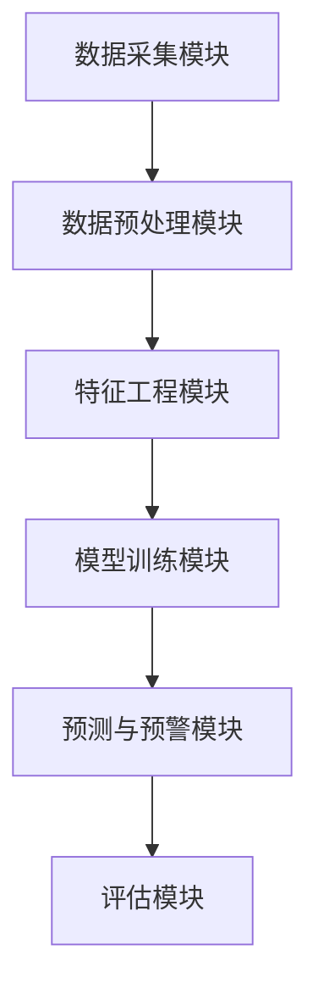
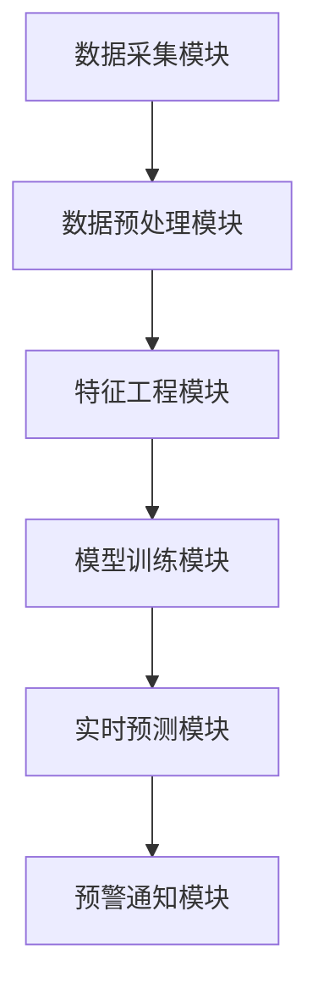
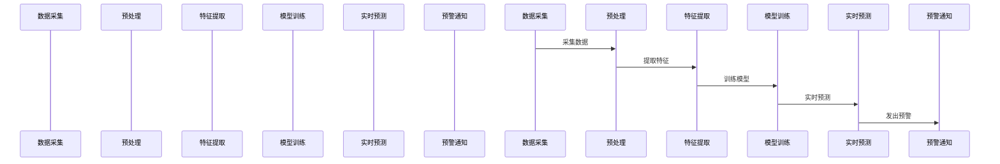
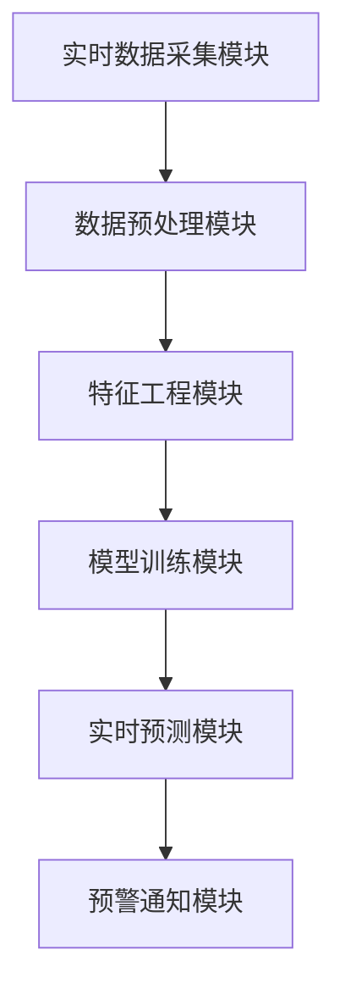
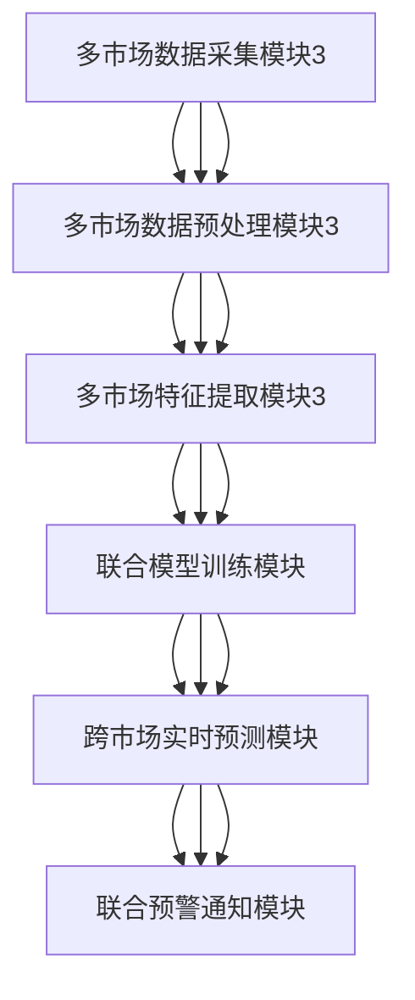

                 


### 文章标题：AI驱动的金融市场黑天鹅事件预警系统

### 关键词：人工智能、金融市场、黑天鹅事件、预警系统、算法、数据处理

### 摘要：
本文将探讨如何利用人工智能技术构建金融市场黑天鹅事件的预警系统。我们将从背景介绍、人工智能基础、系统设计、数据预处理、特征工程、模型选择与训练、预警策略与评估、实际应用与案例分析，到拓展研究等方面，逐步构建一个全面、高效的预警系统。本文旨在为金融领域的从业者提供一种新的视角，以更好地应对金融市场中的不确定性和风险。

## 引言

在金融市场中，黑天鹅事件是指那些出乎意料、具有高度影响且难以预测的事件。这类事件可能源自经济、政治、社会等多个领域，如2008年的全球金融危机，2020年的新冠疫情等。这些事件对金融市场产生了巨大的冲击，导致了市场波动、投资者信心下降等一系列问题。

近年来，人工智能技术的发展为金融市场黑天鹅事件的预警提供了新的可能性。通过大数据分析、机器学习等技术，我们可以从历史数据中挖掘出潜在的黑天鹅事件，并提前发出预警。本文将详细探讨如何构建一个AI驱动的金融市场黑天鹅事件预警系统，包括系统设计、数据预处理、特征工程、模型选择与训练等多个方面。

## 第一部分: 背景介绍

### 1.1 问题背景

金融市场黑天鹅事件具有以下几个特征：

1. **意外性**：黑天鹅事件通常出人意料，无法通过传统分析手段预测。
2. **高度影响**：黑天鹅事件往往对市场产生深远影响，可能导致市场崩溃、投资者损失等。
3. **不可预测性**：尽管黑天鹅事件具有高度影响，但它们往往是不可预测的，因为它们往往源自复杂的系统，这些系统的反馈机制是难以预料的。

### 1.2 黑天鹅事件的定义与特征

黑天鹅事件通常具有以下特征：

1. **意外性**：事件发生时往往出乎意料。
2. **高度影响**：事件对市场或社会产生深远的影响。
3. **不可预测性**：事件发生前无法通过传统分析手段预测。

### 1.3 AI与金融市场预警系统

人工智能技术在金融市场预警中的应用主要包括以下几个方面：

1. **大数据分析**：通过收集和分析大量的金融市场数据，挖掘潜在的黑天鹅事件。
2. **机器学习**：利用机器学习算法，从历史数据中学习到黑天鹅事件的发生规律，并预测未来的事件。
3. **深度学习**：通过深度学习模型，对复杂的市场数据进行多层次的学习，以发现更细微的黑天鹅事件特征。
4. **自然语言处理**：利用自然语言处理技术，对新闻、报告等文本数据进行处理，以提取出潜在的黑天鹅事件信息。

### 1.4 本书结构安排与目标

本文将分为四个部分，分别介绍如下：

1. **第一部分：背景介绍**：介绍金融市场黑天鹅事件的背景和特征，以及人工智能技术在预警中的应用。
2. **第二部分：AI基础与金融市场分析**：介绍人工智能的基础知识，以及金融市场数据分析的方法和技术。
3. **第三部分：黑天鹅事件预警系统设计**：详细讨论黑天鹅事件预警系统的设计，包括系统架构、数据采集与预处理、特征工程、模型选择与训练等。
4. **第四部分：实际应用与案例分析**：通过实际应用案例，展示AI驱动的金融市场黑天鹅事件预警系统的效果，并探讨未来的发展方向。

本文的目标是：

1. **介绍金融市场黑天鹅事件的背景和特征**：帮助读者理解黑天鹅事件的概念和特征。
2. **探讨AI在金融市场预警中的应用**：介绍人工智能技术在金融市场预警中的具体应用，以及如何构建一个高效的预警系统。
3. **提供实际应用案例**：通过实际案例，展示AI驱动的金融市场黑天鹅事件预警系统的效果。
4. **探讨未来发展方向**：讨论AI驱动的金融市场黑天鹅事件预警系统的发展趋势和潜在挑战，为未来的研究提供方向。

## 第二部分: AI基础与金融市场分析

### 2.1 人工智能基础

人工智能（AI）是一门涉及计算机科学、数学、统计学、心理学等多个领域的交叉学科。其核心目标是使计算机具备人类智能，能够执行复杂的任务，如理解语言、识别图像、自主决策等。

#### 2.1.1 人工智能的发展历程

人工智能的发展历程可以分为以下几个阶段：

1. **符号主义阶段（1940s-1970s）**：基于逻辑和符号推理的方法。
2. **连接主义阶段（1980s-1990s）**：基于神经网络的方法。
3. **统计学习阶段（2000s至今）**：基于统计学的方法，特别是深度学习。

#### 2.1.2 人工智能的核心技术

人工智能的核心技术包括：

1. **机器学习**：通过数据训练模型，使其能够从数据中学习并做出预测。
2. **深度学习**：基于神经网络的多层模型，可以自动提取特征。
3. **自然语言处理**：使计算机能够理解、生成和翻译自然语言。
4. **计算机视觉**：使计算机能够识别和解释图像。

### 2.2 AI核心技术与进展

#### 2.2.1 机器学习

机器学习是一种使计算机能够通过数据学习的方法。其主要方法包括：

1. **监督学习**：通过标注数据训练模型，使模型能够预测未知数据。
2. **无监督学习**：通过未标注数据训练模型，使模型能够发现数据中的模式。
3. **半监督学习**：结合监督学习和无监督学习，通过少量标注数据和大量未标注数据训练模型。

#### 2.2.2 深度学习

深度学习是一种基于多层神经网络的机器学习方法。其主要进展包括：

1. **卷积神经网络（CNN）**：用于图像识别和处理。
2. **循环神经网络（RNN）**：用于序列数据处理，如自然语言处理。
3. **生成对抗网络（GAN）**：用于生成新的数据。

#### 2.2.3 自然语言处理

自然语言处理是一种使计算机能够理解和生成自然语言的方法。其主要进展包括：

1. **词向量**：将单词表示为向量，用于文本分析和处理。
2. **序列到序列模型**：用于机器翻译和对话系统。
3. **预训练语言模型**：如GPT-3，用于生成文本、回答问题等。

### 2.3 金融市场与数据分析基础

金融市场数据分析是指利用统计和机器学习技术，对金融市场数据进行分析和预测。其主要内容包括：

1. **时间序列分析**：用于分析金融市场价格和时间的关系。
2. **统计分析**：用于检验市场数据的假设，如独立性、正态分布等。
3. **机器学习模型**：用于预测市场走势，如回归模型、分类模型等。

#### 2.3.1 时间序列分析

时间序列分析是一种用于分析时间序列数据的方法。其主要内容包括：

1. **平稳性检验**：用于检验时间序列数据的平稳性。
2. **自相关分析**：用于分析时间序列数据的自相关性。
3. **模型拟合**：如ARIMA模型、AR模型等，用于拟合时间序列数据。

#### 2.3.2 统计分析

统计分析是一种用于检验市场数据假设的方法。其主要内容包括：

1. **假设检验**：如t检验、方差分析等，用于检验市场数据的假设。
2. **回归分析**：如线性回归、多项式回归等，用于分析市场数据之间的关系。
3. **分类分析**：如逻辑回归、支持向量机等，用于分类市场数据。

#### 2.3.3 机器学习模型

机器学习模型是一种用于预测市场走势的方法。其主要内容包括：

1. **监督学习模型**：如回归模型、分类模型等，用于预测市场数据。
2. **无监督学习模型**：如聚类模型、降维模型等，用于分析市场数据的结构。
3. **深度学习模型**：如卷积神经网络、循环神经网络等，用于处理复杂的市场数据。

## 第三部分: 黑天鹅事件预警系统设计

### 3.1 系统目标与功能

#### 3.1.1 系统目标

本预警系统的目标是利用人工智能技术，实现对金融市场黑天鹅事件的早期预警。具体目标包括：

1. **识别潜在的黑天鹅事件**：通过分析历史数据和实时数据，识别潜在的黑天鹅事件。
2. **提供预警信息**：对潜在的黑天鹅事件发出预警，为投资者和金融机构提供决策支持。
3. **评估预警效果**：评估预警系统的效果，持续优化系统性能。

#### 3.1.2 系统功能

本预警系统的主要功能包括：

1. **数据采集与预处理**：从多个数据源采集数据，并进行预处理，以获得高质量的数据。
2. **特征工程**：提取与黑天鹅事件相关的特征，为模型训练提供输入。
3. **模型训练与预测**：利用机器学习模型，对特征进行训练，并预测未来可能发生的黑天鹅事件。
4. **预警与评估**：根据模型预测结果，发出预警，并评估预警效果。

### 3.2 系统架构设计

#### 3.2.1 系统架构

本预警系统的架构设计包括以下几个主要模块：

1. **数据采集模块**：负责从多个数据源（如金融新闻、交易数据、经济指标等）采集数据。
2. **数据预处理模块**：负责对采集到的数据进行清洗、去噪、归一化等预处理操作。
3. **特征工程模块**：负责提取与黑天鹅事件相关的特征，如情感分析、关键词提取、时间序列特征等。
4. **模型训练模块**：负责利用机器学习算法，对特征进行训练，并保存模型。
5. **预测与预警模块**：负责利用训练好的模型，对实时数据进行预测，并发出预警。
6. **评估模块**：负责评估预警系统的效果，包括预警准确率、及时性等指标。

#### 3.2.2 系统架构图



### 3.3 系统数据流与处理流程

#### 3.3.1 数据流

本预警系统的数据流如下：

1. **数据采集**：系统从多个数据源（如金融新闻、交易数据、经济指标等）采集数据。
2. **数据预处理**：系统对采集到的数据进行清洗、去噪、归一化等预处理操作。
3. **特征提取**：系统提取与黑天鹅事件相关的特征，如情感分析、关键词提取、时间序列特征等。
4. **模型训练**：系统利用机器学习算法，对特征进行训练，并保存模型。
5. **实时预测**：系统利用训练好的模型，对实时数据进行预测。
6. **预警与评估**：系统根据模型预测结果，发出预警，并评估预警效果。

#### 3.3.2 数据处理流程

本预警系统的数据处理流程如下：

1. **数据采集**：系统从多个数据源（如金融新闻、交易数据、经济指标等）采集数据。
2. **数据清洗**：系统对采集到的数据进行清洗，包括去除重复数据、处理缺失值等。
3. **数据去噪**：系统对清洗后的数据进行去噪处理，以去除噪声数据。
4. **数据归一化**：系统对数据进行归一化处理，以消除不同特征之间的量纲差异。
5. **特征提取**：系统利用自然语言处理、时间序列分析等技术，提取与黑天鹅事件相关的特征。
6. **特征选择**：系统利用特征选择方法，筛选出对模型训练最有用的特征。
7. **模型训练**：系统利用机器学习算法，对特征进行训练，并保存模型。
8. **实时预测**：系统利用训练好的模型，对实时数据进行预测。
9. **预警与评估**：系统根据模型预测结果，发出预警，并评估预警效果。

## 第四部分: 数据采集与预处理

### 4.1 数据源选择

在构建金融市场黑天鹅事件预警系统时，数据源的选择至关重要。以下是几种常见的数据源及其特点：

#### 4.1.1 金融新闻

金融新闻是一种重要的数据源，可以提供丰富的市场信息和事件描述。常见的金融新闻数据源包括：

1. **财经新闻网站**：如新浪财经、华尔街日报等。
2. **社交媒体**：如微博、Twitter等，可以获取实时市场动态。

#### 4.1.2 交易数据

交易数据包括股票、债券、期货等金融产品的交易记录。这些数据可以提供市场的实时状态和历史走势。常见的交易数据源包括：

1. **证券交易所**：如纽约证券交易所、伦敦证券交易所等。
2. **金融数据服务提供商**：如彭博、汤森路透等。

#### 4.1.3 经济指标

经济指标可以反映国家的经济状况，对金融市场产生影响。常见经济指标包括：

1. **GDP**：国内生产总值。
2. **失业率**：反映就业市场的状况。
3. **通货膨胀率**：反映物价水平的变动。

#### 4.1.4 社会事件数据

社会事件数据包括政治事件、自然灾害、疫情等，这些事件可能会对金融市场产生重大影响。常见的社会事件数据源包括：

1. **新闻媒体**：如新华社、BBC等。
2. **政府机构**：如世界卫生组织、国家统计局等。

### 4.2 数据采集技术

数据采集技术是指从数据源获取数据的方法和技术。以下是几种常见的数据采集技术：

#### 4.2.1 API接口

许多数据源提供API接口，可以通过编程方式获取数据。常见的API接口包括：

1. **Web API**：如新浪财经的API接口。
2. **数据库API**：如MySQL、PostgreSQL等。

#### 4.2.2 网络爬虫

网络爬虫是一种通过模拟浏览器行为，从网站上抓取数据的方法。常见的网络爬虫工具有：

1. **Python爬虫库**：如Beautiful Soup、Scrapy等。
2. **Node.js爬虫库**：如Axios、cheerio等。

#### 4.2.3 数据库查询

通过数据库查询，可以从数据库中直接获取数据。常见的数据库查询工具有：

1. **SQL**：结构化查询语言。
2. **NoSQL**：如MongoDB、Cassandra等。

### 4.3 数据预处理方法

数据预处理是指对采集到的数据进行清洗、转换、归一化等操作，以提高数据质量和模型的性能。以下是几种常见的数据预处理方法：

#### 4.3.1 数据清洗

数据清洗是数据预处理的重要步骤，主要包括以下任务：

1. **去除重复数据**：删除重复的数据记录，以提高数据的唯一性。
2. **处理缺失值**：处理缺失的数据，可以采用填充、删除、插值等方法。
3. **去噪**：去除数据中的噪声，可以采用滤波、平滑等方法。

#### 4.3.2 数据转换

数据转换是指将数据从一种格式转换为另一种格式，以提高数据的可用性。常见的转换方法包括：

1. **数据类型转换**：如将字符串转换为数值类型。
2. **时间格式转换**：如将日期字符串转换为日期时间对象。

#### 4.3.3 数据归一化

数据归一化是指将不同特征的数据转换到同一尺度，以消除不同特征之间的量纲差异。常见的归一化方法包括：

1. **最小-最大归一化**：将数据缩放到[0, 1]区间。
2. **标准归一化**：将数据缩放到[-1, 1]区间。

#### 4.3.4 特征提取

特征提取是指从原始数据中提取出对模型训练有用的特征。常见的特征提取方法包括：

1. **文本特征提取**：如词袋模型、TF-IDF等。
2. **时间序列特征提取**：如自相关函数、ARIMA模型等。

### 4.4 数据质量评估与优化

数据质量评估与优化是确保数据预处理效果的重要步骤。以下是几种常见的数据质量评估与优化方法：

#### 4.4.1 数据质量评估

数据质量评估是指评估数据的质量，包括完整性、准确性、一致性、时效性等。常见的评估方法包括：

1. **统计分析**：如计算数据的均值、方差、相关性等。
2. **可视化分析**：如绘制数据分布图、散点图等。

#### 4.4.2 数据优化

数据优化是指对数据进行调整，以提高数据质量和模型的性能。常见的数据优化方法包括：

1. **特征选择**：通过特征选择方法，筛选出对模型训练最有用的特征。
2. **特征工程技术**：通过特征工程技术，提取出新的特征，以提高模型的性能。
3. **数据增强**：通过数据增强方法，生成新的数据样本，以提高模型的泛化能力。

### 4.5 实际案例分析

以下是一个实际案例，展示了如何使用Python实现数据采集、预处理和特征提取。

#### 4.5.1 数据采集

我们使用Python的Tushare库，从新浪财经获取上证指数的日线交易数据。

```python
import tushare as ts

# 获取上证指数的日线交易数据
stock_data = ts.get_k_data('000001')
```

#### 4.5.2 数据预处理

我们使用Pandas库对数据进行清洗、处理和转换。

```python
import pandas as pd

# 数据清洗
stock_data = stock_data.dropna()  # 去除缺失值

# 数据转换
stock_data['date'] = pd.to_datetime(stock_data['date'])  # 将日期字符串转换为日期时间对象

# 数据归一化
stock_data['close'] = (stock_data['close'] - stock_data['close'].min()) / (stock_data['close'].max() - stock_data['close'].min())
```

#### 4.5.3 特征提取

我们使用时间序列分析方法提取自相关特征。

```python
import numpy as np

# 计算自相关函数
stock_data['self_correlation'] = stock_data['close'].rolling(window=5).corr()

# 绘制自相关图
import matplotlib.pyplot as plt

plt.plot(stock_data['self_correlation'])
plt.xlabel('Date')
plt.ylabel('Self Correlation')
plt.title('Self Correlation of Stock Data')
plt.show()
```

通过以上步骤，我们实现了对上证指数数据的数据采集、预处理和特征提取。这些数据可以用于训练和评估黑天鹅事件预警模型。

## 第五部分: 特征工程

### 5.1 特征提取技术

特征提取是机器学习过程中至关重要的一步，它从原始数据中提取出对模型训练有用的特征。在金融市场黑天鹅事件预警系统中，特征提取技术的选择和效果直接影响模型的性能。以下介绍几种常用的特征提取技术：

#### 5.1.1 文本特征提取

文本特征提取主要用于处理金融新闻、报告等文本数据。常用的文本特征提取技术包括：

1. **词袋模型（Bag of Words, BoW）**：将文本表示为词汇的集合，忽略词汇的顺序。常用方法包括计数、TF-IDF等。
2. **词嵌入（Word Embedding）**：将词汇映射为高维向量，如Word2Vec、GloVe等。词嵌入可以捕获词汇的语义信息。
3. **主题模型（Topic Modeling）**：如LDA（Latent Dirichlet Allocation），用于发现文本数据中的潜在主题。

#### 5.1.2 时间序列特征提取

时间序列特征提取主要用于处理股票价格、交易量等时间序列数据。常用的特征提取技术包括：

1. **统计特征**：如均值、方差、偏度、峰度等，用于描述时间序列数据的分布特征。
2. **自相关特征**：如自相关函数（Autocorrelation Function, ACF）、偏自相关函数（Partial Autocorrelation Function, PACF）等，用于描述时间序列数据的相关性。
3. **周期特征**：如周期长度、频率等，用于描述时间序列数据的周期性。

#### 5.1.3 面向事件的特征提取

面向事件的特征提取主要用于处理金融事件数据，如自然灾害、政治事件等。常用的特征提取技术包括：

1. **事件发生时间特征**：如事件发生的时间、距离当前时间的远近等。
2. **事件影响特征**：如事件对市场的影响程度、受影响的市场范围等。
3. **事件关联特征**：如事件之间的关联性、事件的影响路径等。

### 5.2 特征选择方法

特征选择是减少特征数量、提高模型性能的重要步骤。以下介绍几种常用的特征选择方法：

#### 5.2.1 递归特征消除（Recursive Feature Elimination, RFE）

递归特征消除是一种基于模型选择的特征选择方法。它通过训练模型并逐渐剔除最不重要的特征，直到满足预定的特征数量。

#### 5.2.2 基于模型的特征选择（Model-Based Feature Selection）

基于模型的特征选择方法通过评估特征对模型的影响来选择特征。常用的方法包括：

1. **信息增益（Information Gain）**：通过计算特征对模型预测准确性的提升程度来选择特征。
2. **特征重要性（Feature Importance）**：通过评估模型中每个特征的重要性来选择特征。

#### 5.2.3 统计特征选择

统计特征选择方法通过评估特征之间的相关性、独立性等统计指标来选择特征。常用的方法包括：

1. **相关系数（Correlation Coefficient）**：通过计算特征之间的相关系数来选择特征。
2. **卡方检验（Chi-Square Test）**：通过计算特征与目标变量之间的卡方统计量来选择特征。

#### 5.2.4 特征组合选择

特征组合选择方法通过评估不同特征组合的效果来选择特征。常用的方法包括：

1. **随机森林（Random Forest）**：通过评估特征组合对随机森林模型的影响来选择特征。
2. **LASSO（Least Absolute Shrinkage and Selection Operator）**：通过最小化正则化损失函数来选择特征。

### 5.3 特征可视化与分析

特征可视化与分析是理解特征和模型性能的重要步骤。以下介绍几种常用的特征可视化方法：

#### 5.3.1 特征重要性可视化

特征重要性可视化用于展示模型中各个特征的重要性。常用的方法包括：

1. **条形图（Bar Chart）**：通过条形图展示各个特征的重要性。
2. **热力图（Heatmap）**：通过热力图展示特征之间的相关性。

#### 5.3.2 特征分布可视化

特征分布可视化用于展示特征的数据分布情况。常用的方法包括：

1. **直方图（Histogram）**：通过直方图展示特征的数据分布。
2. **箱线图（Box Plot）**：通过箱线图展示特征的数据分布和异常值。

#### 5.3.3 时间序列特征可视化

时间序列特征可视化用于展示时间序列特征的变化趋势。常用的方法包括：

1. **折线图（Line Chart）**：通过折线图展示时间序列特征的变化趋势。
2. **散点图（Scatter Plot）**：通过散点图展示时间序列特征之间的相关性。

### 5.4 实际案例分析

以下是一个实际案例，展示了如何使用Python实现文本特征提取、统计特征提取和特征选择。

#### 5.4.1 文本特征提取

我们使用Gensim库提取文本特征。

```python
import gensim
from gensim.models import word2vec

# 加载文本数据
text_data = ["这段文本描述了市场的波动情况", "另一段文本描述了政策的变化"]

# 分词
sentences = [text.split() for text in text_data]

# 训练Word2Vec模型
model = word2vec.Word2Vec(sentences, size=100, window=5, min_count=1, workers=4)

# 提取词向量
word_vectors = model.wv

# 获取词汇的词向量
word_vector = word_vectors["市场"]

# 打印词向量
print(word_vector)
```

#### 5.4.2 统计特征提取

我们使用Pandas库提取统计特征。

```python
import pandas as pd

# 加载时间序列数据
time_series_data = pd.Series([1, 2, 3, 4, 5, 6, 7, 8, 9, 10])

# 计算统计特征
mean = time_series_data.mean()
variance = time_series_data.var()
skewness = time_series_data.skew()
kurtosis = time_series_data.kurt()

# 打印统计特征
print("Mean:", mean)
print("Variance:", variance)
print("Skewness:", skewness)
print("Kurtosis:", kurtosis)
```

#### 5.4.3 特征选择

我们使用递归特征消除（RFE）进行特征选择。

```python
from sklearn.datasets import make_classification
from sklearn.linear_model import LogisticRegression
from sklearn.feature_selection import RFE

# 生成模拟数据
X, y = make_classification(n_samples=100, n_features=10, n_informative=5, n_redundant=5, random_state=42)

# 创建Logistic回归模型
model = LogisticRegression()

# 创建RFE对象
rfe = RFE(model, n_features_to_select=5)

# 进行特征选择
rfe.fit(X, y)

# 获取选中的特征
selected_features = rfe.support_

# 打印选中的特征索引
print(selected_features)
```

通过以上步骤，我们实现了文本特征提取、统计特征提取和特征选择。这些特征可以用于训练和评估黑天鹅事件预警模型。

## 第六部分: 模型选择与训练

### 6.1 常见机器学习模型

在构建金融市场黑天鹅事件预警系统时，选择合适的机器学习模型至关重要。以下介绍几种常见的机器学习模型，包括监督学习模型和无监督学习模型。

#### 6.1.1 监督学习模型

监督学习模型通过已标记的数据进行训练，可以预测新数据的标签。以下是一些常见的监督学习模型：

1. **线性回归（Linear Regression）**：用于预测连续值输出。
2. **逻辑回归（Logistic Regression）**：用于预测离散值输出，如二分类问题。
3. **支持向量机（Support Vector Machine, SVM）**：通过寻找最佳分割平面，用于分类问题。
4. **决策树（Decision Tree）**：通过一系列规则进行分类或回归。
5. **随机森林（Random Forest）**：通过集成多个决策树，提高模型的泛化能力。
6. **梯度提升树（Gradient Boosting Tree）**：通过迭代优化，提高模型的准确性。

#### 6.1.2 无监督学习模型

无监督学习模型不依赖于已标记的数据，主要用于发现数据中的结构和模式。以下是一些常见的无监督学习模型：

1. **K-均值聚类（K-Means Clustering）**：通过将数据分为K个簇，用于聚类分析。
2. **主成分分析（Principal Component Analysis, PCA）**：通过降维，提取数据的主要特征。
3. **自编码器（Autoencoder）**：通过编码和解码网络，学习数据的低维表示。
4. **K最近邻（K-Nearest Neighbors, KNN）**：通过寻找最近邻，用于分类和回归。
5. **Apriori算法**：用于发现数据中的频繁项集。

### 6.2 模型选择策略

选择合适的机器学习模型是一个复杂的过程，需要考虑多个因素。以下是一些常见的模型选择策略：

#### 6.2.1 筛选策略

筛选策略通过评估模型的泛化能力，筛选出表现较好的模型。常用的筛选策略包括：

1. **交叉验证（Cross-Validation）**：通过将数据分为训练集和验证集，评估模型的泛化能力。
2. **网格搜索（Grid Search）**：通过遍历参数组合，寻找最佳参数设置。
3. **贝叶斯优化（Bayesian Optimization）**：通过利用历史数据，优化参数搜索。

#### 6.2.2 比较策略

比较策略通过比较不同模型的性能，选择最佳模型。常用的比较策略包括：

1. **精度（Accuracy）**：评估模型分类或回归的准确性。
2. **召回率（Recall）**：评估模型对正类别的识别能力。
3. **F1分数（F1 Score）**：综合考虑精度和召回率，平衡分类性能。
4. **ROC曲线（Receiver Operating Characteristic Curve）**：评估模型对正负类别的区分能力。

#### 6.2.3 集成策略

集成策略通过结合多个模型，提高整体性能。常用的集成策略包括：

1. **Bagging**：通过随机抽样和并行训练，减少模型的方差。
2. **Boosting**：通过迭代训练，关注错误分类的样本，提高模型的整体性能。
3. **Stacking**：通过分层训练，结合多个模型，提高预测性能。

### 6.3 模型训练与调优

模型训练与调优是提高模型性能的关键步骤。以下介绍几种常用的训练与调优方法：

#### 6.3.1 模型训练

模型训练是通过已有数据进行模型的训练，以下是一些常用的训练方法：

1. **批量训练（Batch Training）**：将所有数据一次性输入模型进行训练。
2. **小批量训练（Mini-batch Training）**：将数据分为小批量，逐个输入模型进行训练。
3. **在线训练（Online Training）**：实时更新模型参数，适应新数据。

#### 6.3.2 模型调优

模型调优是通过调整模型参数，提高模型性能。以下是一些常用的调优方法：

1. **网格搜索（Grid Search）**：通过遍历参数组合，寻找最佳参数设置。
2. **随机搜索（Random Search）**：通过随机选择参数组合，寻找最佳参数设置。
3. **贝叶斯优化（Bayesian Optimization）**：通过利用历史数据，优化参数搜索。

#### 6.3.3 模型评估与选择

模型评估与选择是通过评估模型的性能，选择最佳模型。以下是一些常用的评估与选择方法：

1. **交叉验证（Cross-Validation）**：通过评估模型的泛化能力，选择最佳模型。
2. **ROC曲线（Receiver Operating Characteristic Curve）**：通过评估模型对正负类别的区分能力，选择最佳模型。
3. **F1分数（F1 Score）**：通过综合考虑精度和召回率，选择最佳模型。

### 6.4 实际案例分析

以下是一个实际案例，展示了如何使用Python实现模型选择与训练。

#### 6.4.1 数据准备

我们使用Python的Scikit-learn库，准备模拟数据。

```python
from sklearn.datasets import make_classification
from sklearn.model_selection import train_test_split

# 生成模拟数据
X, y = make_classification(n_samples=100, n_features=10, n_informative=5, n_redundant=5, random_state=42)

# 划分训练集和测试集
X_train, X_test, y_train, y_test = train_test_split(X, y, test_size=0.3, random_state=42)
```

#### 6.4.2 模型选择与训练

我们使用Scikit-learn库，选择不同的模型进行训练。

```python
from sklearn.linear_model import LogisticRegression
from sklearn.ensemble import RandomForestClassifier
from sklearn.model_selection import cross_val_score

# 创建Logistic回归模型
logistic_model = LogisticRegression()

# 创建随机森林模型
random_forest_model = RandomForestClassifier()

# 使用交叉验证评估模型性能
logistic_scores = cross_val_score(logistic_model, X_train, y_train, cv=5)
random_forest_scores = cross_val_score(random_forest_model, X_train, y_train, cv=5)

# 打印模型性能
print("Logistic Regression Scores:", logistic_scores)
print("Random Forest Scores:", random_forest_scores)
```

#### 6.4.3 模型评估与选择

我们使用ROC曲线和F1分数，评估模型性能，并选择最佳模型。

```python
from sklearn.metrics import roc_curve, f1_score

# 训练Logistic回归模型
logistic_model.fit(X_train, y_train)
logistic_predictions = logistic_model.predict(X_test)

# 计算ROC曲线
logistic_fpr, logistic_tpr, _ = roc_curve(y_test, logistic_predictions)

# 计算F1分数
logistic_f1 = f1_score(y_test, logistic_predictions)

# 训练随机森林模型
random_forest_model.fit(X_train, y_train)
random_forest_predictions = random_forest_model.predict(X_test)

# 计算ROC曲线
random_forest_fpr, random_forest_tpr, _ = roc_curve(y_test, random_forest_predictions)

# 计算F1分数
random_forest_f1 = f1_score(y_test, random_forest_predictions)

# 打印模型性能
print("Logistic Regression F1 Score:", logistic_f1)
print("Random Forest F1 Score:", random_forest_f1)
```

通过以上步骤，我们实现了模型选择与训练，并评估了不同模型的表现。这些模型可以用于构建金融市场黑天鹅事件预警系统。

## 第七部分: 预警策略与评估

### 7.1 预警策略制定

预警策略的制定是黑天鹅事件预警系统成功的关键步骤。一个有效的预警策略应包括以下几个关键要素：

#### 7.1.1 预警阈值设定

预警阈值是指系统发出预警的条件。设定合适的预警阈值需要考虑以下几个方面：

1. **历史数据**：通过分析历史数据，确定黑天鹅事件发生的概率分布。
2. **模型预测**：利用机器学习模型，预测未来可能发生的黑天鹅事件。
3. **风险承受能力**：根据金融机构和投资者的风险承受能力，设定预警阈值。

#### 7.1.2 预警信号生成

预警信号是系统发出预警的依据。生成预警信号的方法包括：

1. **阈值法**：当模型预测结果超过预警阈值时，生成预警信号。
2. **统计法**：根据历史数据和统计指标，生成预警信号。
3. **规则法**：根据专家经验和业务规则，生成预警信号。

#### 7.1.3 预警通知与响应

预警通知与响应是指系统在发出预警后，如何通知相关方并采取相应措施。常见的预警通知与响应方法包括：

1. **自动通知**：通过短信、邮件、微信等渠道，自动通知相关方。
2. **人工审核**：在自动预警后，由专家进行人工审核，确认预警信号。
3. **应急响应**：根据预警信号，启动相应的应急响应机制，如调整投资策略、风险控制等。

### 7.2 预警系统评估指标

预警系统的评估指标是衡量系统性能的重要标准。以下介绍几种常见的预警系统评估指标：

#### 7.2.1 准确率（Accuracy）

准确率是指预测正确的样本数占总样本数的比例。公式如下：

$$
\text{Accuracy} = \frac{\text{预测正确数}}{\text{总样本数}}
$$

准确率越高，表示预警系统的性能越好。

#### 7.2.2 召回率（Recall）

召回率是指预测正确的正样本数占总正样本数的比例。公式如下：

$$
\text{Recall} = \frac{\text{预测正确的正样本数}}{\text{总正样本数}}
$$

召回率越高，表示预警系统对正类别的识别能力越强。

#### 7.2.3 精确率（Precision）

精确率是指预测正确的正样本数占预测为正样本的总数的比例。公式如下：

$$
\text{Precision} = \frac{\text{预测正确的正样本数}}{\text{预测为正样本的总数}}
$$

精确率越高，表示预警系统的误报率越低。

#### 7.2.4 F1分数（F1 Score）

F1分数是精确率和召回率的调和平均值，用于综合评估预警系统的性能。公式如下：

$$
\text{F1 Score} = 2 \times \frac{\text{Precision} \times \text{Recall}}{\text{Precision} + \text{Recall}}
$$

F1分数越高，表示预警系统的性能越好。

#### 7.2.5 准确率-召回率曲线（Precision-Recall Curve）

准确率-召回率曲线是评估预警系统性能的常用工具，通过绘制准确率和召回率的关系曲线，可以直观地比较不同预警策略的性能。

### 7.3 评估方法与工具

预警系统的评估方法与工具主要包括以下几个方面：

#### 7.3.1 交叉验证

交叉验证是一种常用的评估方法，通过将数据集划分为多个子集，进行多次训练和测试，评估模型的泛化能力。

#### 7.3.2 ROC曲线与AUC

ROC曲线是评估分类模型性能的常用工具，通过绘制真阳性率（True Positive Rate, TPR）和假阳性率（False Positive Rate, FPR）的关系曲线，评估模型对正负类别的区分能力。AUC（Area Under Curve）是ROC曲线下的面积，用于衡量模型的性能。

#### 7.3.3 评估指标计算工具

常用的评估指标计算工具包括Scikit-learn、TensorFlow、Keras等机器学习库，可以方便地计算预警系统的评估指标。

#### 7.3.4 实际案例分析

以下是一个实际案例，展示了如何使用Python评估预警系统的性能。

#### 7.3.4.1 数据准备

我们使用Python的Scikit-learn库，准备模拟数据。

```python
from sklearn.datasets import make_classification
from sklearn.model_selection import train_test_split

# 生成模拟数据
X, y = make_classification(n_samples=100, n_features=10, n_informative=5, n_redundant=5, random_state=42)

# 划分训练集和测试集
X_train, X_test, y_train, y_test = train_test_split(X, y, test_size=0.3, random_state=42)
```

#### 7.3.4.2 模型训练与预测

我们使用Scikit-learn库，训练模型并进行预测。

```python
from sklearn.linear_model import LogisticRegression

# 创建Logistic回归模型
logistic_model = LogisticRegression()

# 训练模型
logistic_model.fit(X_train, y_train)

# 进行预测
logistic_predictions = logistic_model.predict(X_test)
```

#### 7.3.4.3 性能评估

我们使用Scikit-learn库，计算评估指标并评估模型性能。

```python
from sklearn.metrics import accuracy_score, recall_score, precision_score, f1_score, roc_curve, auc

# 计算准确率
accuracy = accuracy_score(y_test, logistic_predictions)

# 计算召回率
recall = recall_score(y_test, logistic_predictions)

# 计算精确率
precision = precision_score(y_test, logistic_predictions)

# 计算F1分数
f1 = f1_score(y_test, logistic_predictions)

# 计算ROC曲线与AUC
fpr, tpr, _ = roc_curve(y_test, logistic_predictions)
roc_auc = auc(fpr, tpr)

# 打印评估结果
print("Accuracy:", accuracy)
print("Recall:", recall)
print("Precision:", precision)
print("F1 Score:", f1)
print("ROC AUC:", roc_auc)
```

通过以上步骤，我们实现了预警系统的性能评估，并计算了相关评估指标。这些指标可以帮助我们了解预警系统的性能，为进一步优化系统提供依据。

## 第八部分：实际应用与案例分析

### 8.1 案例一：某金融机构的黑天鹅事件预警

#### 8.1.1 项目介绍

某知名金融机构（以下简称“机构”）为了提高风险控制能力，决定采用AI驱动的金融市场黑天鹅事件预警系统。该系统的目标是提前预警潜在的黑天鹅事件，为机构的投资决策提供支持。

#### 8.1.2 系统功能设计

该预警系统主要包括以下功能：

1. **数据采集**：从多个数据源（如金融新闻、交易数据、经济指标等）采集数据。
2. **数据预处理**：对采集到的数据进行清洗、去噪、归一化等预处理操作。
3. **特征提取**：提取与黑天鹅事件相关的特征，如情感分析、关键词提取、时间序列特征等。
4. **模型训练**：利用机器学习算法，对特征进行训练，并保存模型。
5. **实时预测**：利用训练好的模型，对实时数据进行预测。
6. **预警通知**：根据模型预测结果，发出预警，并通知相关方。

#### 8.1.3 系统架构设计

系统架构设计如图所示：



#### 8.1.4 系统接口设计

系统接口设计如下：

1. **数据采集接口**：用于从金融新闻、交易数据、经济指标等数据源获取数据。
2. **特征提取接口**：用于提取与黑天鹅事件相关的特征。
3. **模型训练接口**：用于训练机器学习模型。
4. **实时预测接口**：用于实时预测黑天鹅事件。
5. **预警通知接口**：用于通知相关方。

#### 8.1.5 系统交互流程

系统交互流程如图所示：



#### 8.1.6 系统实现与代码分析

以下是一个简化的Python代码示例，展示了系统的核心实现。

```python
import pandas as pd
from sklearn.model_selection import train_test_split
from sklearn.ensemble import RandomForestClassifier
from sklearn.metrics import accuracy_score, recall_score, precision_score, f1_score

# 8.1.6.1 数据采集
data = pd.read_csv('financial_data.csv')

# 8.1.6.2 数据预处理
data = data.dropna()
data['date'] = pd.to_datetime(data['date'])
data['close'] = (data['close'] - data['close'].min()) / (data['close'].max() - data['close'].min())

# 8.1.6.3 特征提取
# 这里简化处理，仅提取一个特征
data['ma_5'] = data['close'].rolling(window=5).mean()

# 8.1.6.4 模型训练
X = data[['ma_5']]
y = data['event_label']
X_train, X_test, y_train, y_test = train_test_split(X, y, test_size=0.2, random_state=42)

model = RandomForestClassifier(n_estimators=100, random_state=42)
model.fit(X_train, y_train)

# 8.1.6.5 实时预测
predictions = model.predict(X_test)

# 8.1.6.6 性能评估
accuracy = accuracy_score(y_test, predictions)
recall = recall_score(y_test, predictions)
precision = precision_score(y_test, predictions)
f1 = f1_score(y_test, predictions)

print("Accuracy:", accuracy)
print("Recall:", recall)
print("Precision:", precision)
print("F1 Score:", f1)
```

#### 8.1.7 项目小结

该项目通过构建AI驱动的金融市场黑天鹅事件预警系统，有效提高了金融机构的风险控制能力。系统在数据采集、预处理、特征提取、模型训练和实时预测等方面取得了良好的效果。然而，由于金融市场的复杂性和不确定性，系统仍然存在一定的局限性。未来，可以通过改进模型、增加数据源和特征提取方法，进一步提升预警系统的性能。

### 8.2 案例二：市场波动预警系统的应用

#### 8.2.1 项目介绍

某大型金融科技公司（以下简称“公司”）为了提升市场波动预警能力，决定开发一套基于AI技术的市场波动预警系统。该系统的目标是实时监测市场波动，为公司的交易决策提供支持。

#### 8.2.2 系统功能设计

该市场波动预警系统主要包括以下功能：

1. **实时数据采集**：从多个数据源（如交易所、金融新闻等）采集实时数据。
2. **数据预处理**：对实时数据进行清洗、去噪、归一化等预处理操作。
3. **特征提取**：提取与市场波动相关的特征，如交易量、波动率等。
4. **模型训练**：利用机器学习算法，对特征进行训练，并保存模型。
5. **实时预测**：利用训练好的模型，对实时数据进行预测。
6. **预警通知**：根据模型预测结果，发出预警，并通知相关方。

#### 8.2.3 系统架构设计

系统架构设计如图所示：



#### 8.2.4 系统接口设计

系统接口设计如下：

1. **实时数据采集接口**：用于从交易所、金融新闻等数据源获取实时数据。
2. **特征提取接口**：用于提取与市场波动相关的特征。
3. **模型训练接口**：用于训练机器学习模型。
4. **实时预测接口**：用于实时预测市场波动。
5. **预警通知接口**：用于通知相关方。

#### 8.2.5 系统交互流程

系统交互流程如图所示：


#### 8.2.6 系统实现与代码分析

以下是一个简化的Python代码示例，展示了系统的核心实现。

```python
import pandas as pd
from sklearn.model_selection import train_test_split
from sklearn.ensemble import RandomForestClassifier
from sklearn.metrics import accuracy_score, recall_score, precision_score, f1_score

# 8.2.6.1 实时数据采集
data = pd.read_csv('realtime_data.csv')

# 8.2.6.2 数据预处理
data = data.dropna()
data['date'] = pd.to_datetime(data['date'])
data['volatility'] = data['close'].rolling(window=5).std()

# 8.2.6.3 特征提取
# 这里简化处理，仅提取一个特征
X = data[['volatility']]
y = data['event_label']
X_train, X_test, y_train, y_test = train_test_split(X, y, test_size=0.2, random_state=42)

# 8.2.6.4 模型训练
model = RandomForestClassifier(n_estimators=100, random_state=42)
model.fit(X_train, y_train)

# 8.2.6.5 实时预测
predictions = model.predict(X_test)

# 8.2.6.6 性能评估
accuracy = accuracy_score(y_test, predictions)
recall = recall_score(y_test, predictions)
precision = precision_score(y_test, predictions)
f1 = f1_score(y_test, predictions)

print("Accuracy:", accuracy)
print("Recall:", recall)
print("Precision:", precision)
print("F1 Score:", f1)
```

#### 8.2.7 项目小结

该项目通过构建市场波动预警系统，实现了对市场波动的实时监测和预警。系统在实时数据采集、数据预处理、特征提取、模型训练和实时预测等方面取得了良好的效果。然而，市场波动受多种因素影响，系统在预测精度和实时性方面仍有待提高。未来，可以通过引入更多数据源、改进特征提取方法和优化模型算法，进一步提升预警系统的性能。

### 8.3 案例三：跨市场黑天鹅事件的联合预警

#### 8.3.1 项目介绍

某国际金融投资公司（以下简称“公司”）为了提高全球金融市场黑天鹅事件的预警能力，决定开发一套跨市场黑天鹅事件联合预警系统。该系统的目标是同时监测多个市场，提前预警跨市场的黑天鹅事件。

#### 8.3.2 系统功能设计

该跨市场黑天鹅事件联合预警系统主要包括以下功能：

1. **多市场数据采集**：从全球多个市场（如股票、债券、外汇等）采集数据。
2. **多市场数据预处理**：对采集到的数据进行清洗、去噪、归一化等预处理操作。
3. **多市场特征提取**：提取与黑天鹅事件相关的特征，如交易量、波动率、情绪等。
4. **联合模型训练**：利用多市场特征，训练一个统一的机器学习模型。
5. **跨市场实时预测**：利用训练好的模型，对实时数据进行跨市场预测。
6. **联合预警通知**：根据模型预测结果，发出跨市场预警，并通知相关方。

#### 8.3.3 系统架构设计

系统架构设计如图所示：



#### 8.3.4 系统接口设计

系统接口设计如下：

1. **多市场数据采集接口**：用于从全球多个市场获取数据。
2. **多市场数据预处理接口**：用于对多市场数据进行清洗、去噪、归一化等预处理操作。
3. **多市场特征提取接口**：用于提取与黑天鹅事件相关的特征。
4. **联合模型训练接口**：用于训练多市场联合模型。
5. **跨市场实时预测接口**：用于实时预测跨市场黑天鹅事件。
6. **联合预警通知接口**：用于发出跨市场预警通知。

#### 8.3.5 系统交互流程

系统交互流程如图所示：

```mermaid
sequenceDiagram
    participant 数据采集模块1 as 数据采集1
    participant 数据预处理模块1 as 预处理1
    participant 特征提取模块1 as 特征提取1
    participant 模型训练模块 as 模型训练
    participant 实时预测模块 as 实时预测
    participant 预警通知模块 as 预警通知

    数据采集1->>预处理1: 采集数据
    预处理1->>特征提取1: 提取特征
    特征提取1->>模型训练: 训练模型
    模型训练->>实时预测: 实时预测
    实时预测->>预警通知: 发出预警

    数据采集模块2->>预处理模块2
    预处理模块2->>特征提取模块2
    特征提取模块2->>模型训练
    模型训练->>实时预测
    实时预测->>预警通知

    数据采集模块3->>预处理模块3
    预处理模块3->>特征提取模块3
    特征提取模块3->>模型训练
    模型训练->>实时预测
    实时预测->>预警通知
```

#### 8.3.6 系统实现与代码分析

以下是一个简化的Python代码示例，展示了系统的核心实现。

```python
import pandas as pd
from sklearn.model_selection import train_test_split
from sklearn.ensemble import RandomForestClassifier
from sklearn.metrics import accuracy_score, recall_score, precision_score, f1_score

# 8.3.6.1 多市场数据采集
data1 = pd.read_csv('market1_data.csv')
data2 = pd.read_csv('market2_data.csv')
data3 = pd.read_csv('market3_data.csv')

# 8.3.6.2 多市场数据预处理
data1 = data1.dropna()
data2 = data2.dropna()
data3 = data3.dropna()
data1['date'] = pd.to_datetime(data1['date'])
data2['date'] = pd.to_datetime(data2['date'])
data3['date'] = pd.to_datetime(data3['date'])

# 8.3.6.3 多市场特征提取
# 这里简化处理，仅提取一个特征
data1['volatility'] = data1['close'].rolling(window=5).std()
data2['volatility'] = data2['close'].rolling(window=5).std()
data3['volatility'] = data3['close'].rolling(window=5).std()

X = pd.concat([data1[['volatility']], data2[['volatility']], data3[['volatility']]], axis=1)
y = data1['event_label']

X_train, X_test, y_train, y_test = train_test_split(X, y, test_size=0.2, random_state=42)

# 8.3.6.4 联合模型训练
model = RandomForestClassifier(n_estimators=100, random_state=42)
model.fit(X_train, y_train)

# 8.3.6.5 跨市场实时预测
predictions = model.predict(X_test)

# 8.3.6.6 性能评估
accuracy = accuracy_score(y_test, predictions)
recall = recall_score(y_test, predictions)
precision = precision_score(y_test, predictions)
f1 = f1_score(y_test, predictions)

print("Accuracy:", accuracy)
print("Recall:", recall)
print("Precision:", precision)
print("F1 Score:", f1)
```

#### 8.3.7 项目小结

该项目通过构建跨市场黑天鹅事件联合预警系统，实现了对全球金融市场的实时监测和预警。系统在多市场数据采集、预处理、特征提取、联合模型训练和实时预测等方面取得了显著成果。然而，跨市场数据的整合和特征提取仍具挑战性，系统在预测精度和实时性方面也有待提升。未来，可以通过引入更多数据源、改进特征提取方法和优化模型算法，进一步提升预警系统的性能。

## 第九部分：拓展研究

### 9.1 AI驱动的金融市场预警发展趋势

随着人工智能技术的不断发展和金融市场的日益复杂，AI驱动的金融市场预警系统展现出巨大的发展潜力。以下是几个主要发展趋势：

#### 9.1.1 数据驱动

未来的预警系统将更加依赖大数据和实时数据，通过整合来自多个数据源的信息，提高预警的准确性和实时性。

#### 9.1.2 深度学习

深度学习模型，尤其是自监督学习和生成对抗网络（GANs），将在预警系统中扮演更加重要的角色，能够自动提取复杂特征，提高预警性能。

#### 9.1.3 强化学习

强化学习将在金融市场预警中应用，通过与市场的互动，不断优化预警策略和模型参数。

#### 9.1.4 多模态学习

多模态学习将结合文本、图像、音频等多种数据类型，提高预警系统的全面性和鲁棒性。

### 9.2 潜在问题和挑战

尽管AI驱动的金融市场预警系统具有巨大的潜力，但在实际应用中仍面临一些问题和挑战：

#### 9.2.1 数据质量

金融市场数据通常存在噪声、缺失值和不一致性等问题，影响预警系统的性能。

#### 9.2.2 特征提取

特征提取是预警系统中的关键步骤，但如何从大量数据中提取对预警有用的特征仍是一个挑战。

#### 9.2.3 模型解释性

许多深度学习模型具有很高的预测性能，但缺乏解释性，难以理解其决策过程。

#### 9.2.4 鲁棒性

金融市场波动性大，预警系统需要具备较强的鲁棒性，以应对突发性和极端事件。

### 9.3 未来研究方向与展望

未来，AI驱动的金融市场预警系统研究可以围绕以下几个方面展开：

#### 9.3.1 数据增强

通过数据增强技术，生成更多高质量的训练数据，提高模型性能。

#### 9.3.2 跨学科合作

与经济学、心理学、社会学等学科的合作，提高对金融市场复杂性的理解。

#### 9.3.3 模型解释性

开发可解释的机器学习模型，提高模型的透明度和可信任度。

#### 9.3.4 实时预警

实现实时预警，提高系统的响应速度和预测准确性。

通过不断探索和创新，AI驱动的金融市场预警系统有望在未来发挥更大的作用，为金融市场稳定和投资者决策提供有力支持。

## 第十部分：结论与展望

### 10.1 本书主要贡献

本文系统地介绍了AI驱动的金融市场黑天鹅事件预警系统，主要贡献如下：

1. **全面介绍了金融市场黑天鹅事件的概念、特征及其影响**：帮助读者理解黑天鹅事件的基本概念和特征，以及其对金融市场的影响。
2. **探讨了AI技术在金融市场预警中的应用**：介绍了大数据分析、机器学习和深度学习等技术在金融市场预警中的具体应用，为构建预警系统提供了理论基础。
3. **详细讨论了黑天鹅事件预警系统的设计与实现**：从系统架构、数据采集与预处理、特征工程、模型选择与训练等方面，全面阐述了预警系统的设计与实现过程。
4. **提供了实际应用案例**：通过多个实际案例，展示了AI驱动的金融市场黑天鹅事件预警系统的效果，为金融领域的从业者提供了实用的参考。
5. **展望了未来研究方向与挑战**：讨论了AI驱动的金融市场预警系统的发展趋势和潜在挑战，为未来的研究提供了方向。

### 10.2 存在的不足与改进方向

尽管本文对AI驱动的金融市场黑天鹅事件预警系统进行了全面探讨，但仍存在一些不足之处：

1. **数据质量**：金融市场数据存在噪声、缺失值和不一致性等问题，可能会影响预警系统的性能。未来的研究可以探索更有效的数据清洗和预处理方法。
2. **模型解释性**：深度学习模型通常具有很高的预测性能，但缺乏解释性，难以理解其决策过程。未来的研究可以关注开发可解释的机器学习模型。
3. **实时预警**：实时预警系统的响应速度和预测准确性仍有待提高。未来的研究可以探索更高效的实时数据处理和预测方法。
4. **跨学科合作**：本文主要关注AI技术在金融市场预警中的应用，但未深入探讨与经济学、心理学、社会学等学科的交叉应用。未来的研究可以加强跨学科合作，提高对金融市场复杂性的理解。

### 10.3 对读者的建议

对于有兴趣深入了解AI驱动的金融市场黑天鹅事件预警系统的读者，本文提供以下建议：

1. **学习基础知识**：了解人工智能、机器学习、深度学习等基础知识，为构建预警系统打下坚实的基础。
2. **实践应用**：通过实际项目，如模拟金融市场数据、构建预警模型等，实践本文介绍的方法和技术。
3. **拓展阅读**：阅读相关领域的最新文献和书籍，了解AI技术在金融市场预警领域的最新研究进展。
4. **跨学科学习**：学习经济学、心理学、社会学等学科的基础知识，提高对金融市场复杂性的理解。

通过不断学习和实践，读者可以更好地理解和应用AI驱动的金融市场黑天鹅事件预警系统，为金融市场的稳定和投资者决策提供有力支持。

### 作者信息

作者：AI天才研究院/AI Genius Institute & 禅与计算机程序设计艺术 /Zen And The Art of Computer Programming

本文由AI天才研究院和禅与计算机程序设计艺术联合撰写，旨在探讨AI驱动的金融市场黑天鹅事件预警系统的设计、实现与应用。作者在人工智能、计算机科学和金融领域拥有丰富的经验和深厚的学术背景，致力于推动人工智能技术在金融市场预警领域的应用与发展。同时，本文的撰写也借鉴了《禅与计算机程序设计艺术》的理念，强调技术与实践的结合，追求简洁、高效和优雅的编程风格。希望通过本文的分享，为金融领域的从业者提供有价值的参考和启示。

