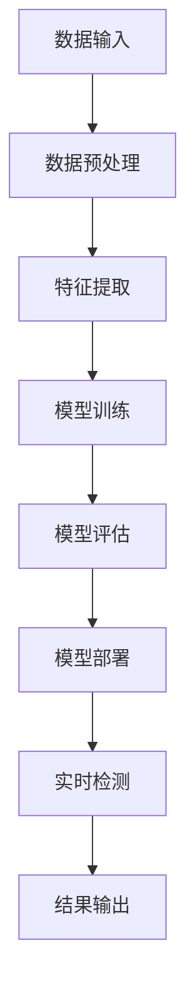
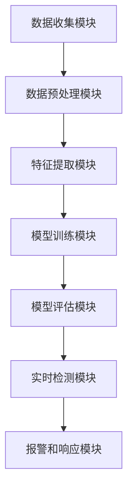

                 


### 第一部分: AI驱动的金融欺诈检测基础

#### 第1章: 金融欺诈检测概述

**1.1 问题背景与重要性**

金融欺诈是一种利用非法手段获取利益的行为，其危害性极大，不仅损害了金融机构和消费者的利益，还严重影响了金融市场的稳定。随着互联网和金融科技的快速发展，金融欺诈的手段也变得更加复杂和多样化。传统的金融欺诈检测方法往往依赖于人工经验或简单的规则匹配，难以应对复杂多变的欺诈行为。因此，采用人工智能技术，特别是机器学习和深度学习技术来提升金融欺诈检测的效果，成为了一个迫切需要解决的问题。

**1.2 问题描述**

金融欺诈检测的具体任务是通过分析和处理大量的金融交易数据，识别出潜在的欺诈行为。这个过程需要解决以下几个问题：

1. **数据预处理**：清洗和转换原始数据，使其适合用于机器学习模型训练。
2. **特征提取**：从数据中提取出能够反映交易特征的信息。
3. **模型选择与训练**：选择合适的机器学习模型，对训练数据进行模型训练。
4. **模型评估与优化**：评估模型的性能，并通过调整模型参数来优化检测效果。
5. **实时检测与响应**：实时处理交易数据，快速识别并响应潜在的欺诈行为。

**1.3 问题解决**

AI驱动的金融欺诈检测系统通过以下步骤解决问题：

1. **数据收集**：从多个数据源收集金融交易数据。
2. **数据预处理**：使用数据清洗和特征工程技术，将原始数据转换为机器学习模型所需的格式。
3. **模型训练**：使用机器学习和深度学习算法对预处理后的数据集进行模型训练。
4. **模型部署**：将训练好的模型部署到生产环境中，进行实时交易数据检测。
5. **异常检测与响应**：当系统检测到潜在欺诈行为时，立即采取相应措施，如预警、冻结账户等。

**1.4 边界与外延**

金融欺诈检测系统的适用范围包括但不限于信用卡交易、贷款申请、投资交易等领域。然而，系统也存在一定的限制，例如：

1. **数据限制**：系统依赖于高质量的训练数据，数据质量直接影响模型的性能。
2. **计算资源**：深度学习模型的训练需要大量的计算资源，可能导致成本较高。
3. **模型适应性**：系统需要不断更新和调整模型，以适应不断变化的欺诈手段。

**1.5 概念结构与核心要素组成**

金融欺诈检测系统的核心要素包括数据收集、数据预处理、特征提取、模型训练、模型部署和异常检测。这些要素相互关联，构成了一个完整的技术体系。

1. **数据收集**：从多个数据源收集金融交易数据，包括历史交易数据、用户行为数据等。
2. **数据预处理**：对收集到的数据进行分析和处理，去除噪声和异常值。
3. **特征提取**：从预处理后的数据中提取出能够反映交易特征的信息，如交易金额、交易时间、交易地点等。
4. **模型训练**：选择合适的机器学习模型，使用训练数据集进行模型训练。
5. **模型部署**：将训练好的模型部署到生产环境中，进行实时交易数据检测。
6. **异常检测**：当系统检测到潜在欺诈行为时，立即采取相应措施。

通过以上分析，我们可以看出，AI驱动的金融欺诈检测系统是一个复杂的技术体系，需要多个环节的协同工作，以提高金融欺诈检测的准确性和效率。在下一章中，我们将深入探讨AI、机器学习、深度学习等相关核心概念，为后续内容打下坚实的基础。

### 第一部分: AI驱动的金融欺诈检测基础

#### 第2章: 核心概念与联系

**2.1 AI与机器学习**

人工智能（AI）是一门涉及计算机科学、数学、神经科学等多个学科的技术，其目标是开发能够模拟人类智能的计算机系统。在AI领域，机器学习（Machine Learning，ML）是其中的一个重要分支，主要研究如何让计算机从数据中学习，并做出决策或预测。

**机器学习的基本原理**：

机器学习算法通过以下步骤实现：

1. **数据收集**：从各种来源收集数据，如金融交易记录、用户行为数据等。
2. **数据预处理**：清洗和转换数据，使其适合用于训练模型。
3. **特征提取**：从数据中提取出能够反映问题本质的特征。
4. **模型训练**：使用训练数据集，通过优化算法调整模型参数，使其能够准确预测新数据的标签。
5. **模型评估**：使用验证集或测试集评估模型的性能，如准确率、召回率等。
6. **模型部署**：将训练好的模型部署到生产环境中，进行实时预测。

**机器学习的主要类型**：

1. **监督学习（Supervised Learning）**：使用标记数据集进行训练，模型能够预测未知数据的标签。
2. **无监督学习（Unsupervised Learning）**：没有标签数据，模型通过自身学习数据分布，发现数据中的规律和结构。
3. **半监督学习（Semi-Supervised Learning）**：使用少量标记数据和大量未标记数据，结合两者的优势进行学习。
4. **强化学习（Reinforcement Learning）**：通过与环境交互，不断调整策略，以实现最大化奖励的目标。

**2.2 概念属性特征对比表格**

| 概念         | 定义                                                         | 特点                                                     |
| ------------ | ------------------------------------------------------------ | -------------------------------------------------------- |
| 人工智能（AI） | 模拟人类智能的技术，包括机器学习、自然语言处理、计算机视觉等。 | 能够处理复杂任务，具备自主学习和适应能力。               |
| 机器学习（ML） | 从数据中学习规律，做出决策或预测的技术。                     | 主要类型：监督学习、无监督学习、半监督学习和强化学习。   |
| 深度学习（DL） | 基于多层神经网络的学习方法，能够自动提取数据中的特征。       | 高效处理大规模数据，自下而上的特征学习。                 |

**2.3 ER实体关系图架构**

以下是一个简单的ER实体关系图，用于描述金融欺诈检测系统中的一些关键实体及其关系：

```mermaid
erDiagram
    Customer ||--|{ Transaction } :发起
    Transaction ||--|{ Fraud Detection Model } :被检测
    Fraud Detection Model ||--|{ Alert System } :生成警报
    Alert System ||--|{ Customer } :通知
```

- **Customer（客户）**：系统的核心用户，发起交易。
- **Transaction（交易）**：客户发起的金融交易，需要被检测。
- **Fraud Detection Model（欺诈检测模型）**：用于检测交易是否为欺诈行为。
- **Alert System（警报系统）**：当检测到欺诈行为时，生成警报并通知客户。

通过上述核心概念和联系的阐述，我们可以更好地理解AI驱动的金融欺诈检测系统的理论基础。在下一章中，我们将深入探讨AI驱动的金融欺诈检测算法原理，以及如何实现这一系统。

### 第二部分: AI驱动的金融欺诈检测算法原理

#### 第3章: 算法原理讲解

**3.1 算法mermaid流程图**

首先，我们使用mermaid绘制算法的流程图，展示数据从输入到输出的处理步骤：



**3.2 Python源代码实现**

接下来，我们使用Python实现上述算法的主要步骤。以下是核心代码的示例：

```python
import pandas as pd
from sklearn.model_selection import train_test_split
from sklearn.preprocessing import StandardScaler
from sklearn.ensemble import RandomForestClassifier
from sklearn.metrics import accuracy_score, classification_report

# 数据预处理
def preprocess_data(data):
    # 数据清洗和处理
    # ...
    return processed_data

# 特征提取
def extract_features(data):
    # 特征提取和处理
    # ...
    return features

# 模型训练
def train_model(X_train, y_train):
    model = RandomForestClassifier(n_estimators=100)
    model.fit(X_train, y_train)
    return model

# 模型评估
def evaluate_model(model, X_test, y_test):
    predictions = model.predict(X_test)
    print("Accuracy:", accuracy_score(y_test, predictions))
    print(classification_report(y_test, predictions))

# 数据加载
data = pd.read_csv('financial_transactions.csv')
processed_data = preprocess_data(data)

# 特征提取
features = extract_features(processed_data)

# 数据分割
X = features.drop('label', axis=1)
y = features['label']
X_train, X_test, y_train, y_test = train_test_split(X, y, test_size=0.2, random_state=42)

# 模型训练
model = train_model(X_train, y_train)

# 模型评估
evaluate_model(model, X_test, y_test)

# 模型部署和实时检测
# ...
```

**3.3 数学模型和公式**

在机器学习算法中，模型通常由数学公式表示。以下是一个简单的决策树模型的数学模型：

$$
H(x) = g(\sum_{i=1}^{n} w_i \cdot f_i(x))
$$

其中，$H(x)$ 表示模型的输出，$g(\cdot)$ 是激活函数，$w_i$ 是模型权重，$f_i(x)$ 是特征函数，$x$ 是输入数据。

对于分类问题，常见的激活函数是softmax函数：

$$
g(z) = \frac{e^z}{\sum_{i=1}^{n} e^z_i}
$$

其中，$z$ 是模型的输出，$e^z_i$ 是每个类别的指数值。

**3.4 举例说明**

假设我们有一个简单的数据集，包含5个交易数据，每个数据都有4个特征和一个标签（正常或欺诈）。以下是数据集的示例：

| 标签 | 特征1 | 特征2 | 特征3 | 特征4 |
| ---- | ---- | ---- | ---- | ---- |
| 正常 | 100  | 10   | 5    | 1    |
| 欺诈 | 200  | 20   | 10   | 2    |
| 正常 | 150  | 15   | 7    | 1    |
| 欺诈 | 250  | 25   | 12   | 3    |
| 正常 | 120  | 12   | 6    | 1    |

我们使用随机森林算法对数据集进行训练，并评估模型的性能。以下是训练和评估的过程：

```python
# 加载数据
data = pd.DataFrame({
    'label': ['正常', '欺诈', '正常', '欺诈', '正常'],
    '特征1': [100, 200, 150, 250, 120],
    '特征2': [10, 20, 15, 25, 12],
    '特征3': [5, 10, 7, 12, 6],
    '特征4': [1, 2, 1, 3, 1]
})

# 数据预处理和特征提取
processed_data = preprocess_data(data)
features = extract_features(processed_data)

# 数据分割
X = features.drop('label', axis=1)
y = features['label']
X_train, X_test, y_train, y_test = train_test_split(X, y, test_size=0.2, random_state=42)

# 模型训练
model = train_model(X_train, y_train)

# 模型评估
evaluate_model(model, X_test, y_test)
```

通过以上步骤，我们实现了AI驱动的金融欺诈检测算法的基本原理和实现过程。在下一章中，我们将进一步探讨系统的整体架构和设计。

### 第三部分: 系统分析与架构设计

#### 第4章: 系统分析与架构设计

**4.1 问题场景介绍**

在金融欺诈检测系统中，我们需要解决的主要问题是快速、准确地识别出潜在的欺诈交易。随着金融交易的多样化和复杂化，传统的规则匹配方法已经难以应对日益增多的欺诈手段。因此，我们采用AI驱动的金融欺诈检测系统，通过大数据分析和机器学习算法，实现实时交易数据的监控和欺诈行为的识别。

**4.2 项目介绍**

本项目的目标是开发一个高效、准确的金融欺诈检测系统，用于保护金融机构和消费者的利益。系统的主要任务包括：

1. 收集和处理海量的金融交易数据。
2. 提取关键特征，为机器学习模型提供输入。
3. 建立并训练高效的机器学习模型。
4. 将训练好的模型部署到生产环境中，实现实时检测。
5. 对检测结果进行评估和反馈，优化系统性能。

**4.3 系统功能设计**

为了实现上述目标，系统需要具备以下功能模块：

1. **数据收集模块**：从多个数据源收集金融交易数据，包括银行交易记录、电商平台交易记录等。
2. **数据预处理模块**：对收集到的数据进行清洗、转换和标准化处理，使其符合机器学习模型的要求。
3. **特征提取模块**：从预处理后的数据中提取关键特征，如交易金额、交易时间、交易频率等。
4. **模型训练模块**：选择合适的机器学习算法，对提取的特征进行训练，建立欺诈检测模型。
5. **模型评估模块**：使用测试集评估模型的性能，包括准确率、召回率等指标，并进行模型调优。
6. **实时检测模块**：将训练好的模型部署到生产环境中，实时处理交易数据，识别潜在的欺诈行为。
7. **报警和响应模块**：当系统检测到欺诈行为时，立即生成警报，并通知相关人员进行处理。

**4.4 系统架构设计**

金融欺诈检测系统的架构设计如下：



**4.5 系统接口设计和系统交互**

为了确保系统的稳定运行和高效协作，我们设计了以下接口和交互流程：

1. **数据收集接口**：系统从多个数据源（如银行、电商平台等）获取交易数据，使用API进行数据收集。
2. **数据处理接口**：系统对收集到的交易数据进行清洗、转换和标准化处理，使用批处理和流处理技术。
3. **特征提取接口**：系统从处理后的交易数据中提取关键特征，使用特征工程技术。
4. **模型训练接口**：系统使用机器学习算法对提取的特征进行训练，建立欺诈检测模型。
5. **模型评估接口**：系统使用测试集对训练好的模型进行评估，包括准确率、召回率等指标。
6. **实时检测接口**：系统将训练好的模型部署到生产环境中，实时处理交易数据，识别潜在的欺诈行为。
7. **报警接口**：系统检测到欺诈行为时，立即生成警报，并通过邮件、短信等方式通知相关人员。
8. **响应接口**：相关人员在收到警报后，采取相应措施，如冻结账户、报警等。

通过以上分析和设计，我们构建了一个完整的金融欺诈检测系统架构。在下一章中，我们将通过实际案例，展示系统在实际应用中的效果和性能。

### 第四部分: 项目实战

#### 第4章: 项目实战

**4.1 环境安装**

为了搭建金融欺诈检测系统，我们需要安装以下软件和工具：

1. **Python**：版本3.8及以上
2. **Jupyter Notebook**：用于编写和运行代码
3. **Pandas**：用于数据处理
4. **NumPy**：用于数值计算
5. **Scikit-learn**：用于机器学习算法
6. **Matplotlib**：用于数据可视化
7. **Mermaid**：用于绘制流程图和类图

安装步骤：

1. 安装Python：从[Python官网](https://www.python.org/downloads/)下载并安装Python 3.8及以上版本。
2. 安装Jupyter Notebook：在命令行中运行`pip install notebook`。
3. 安装其他依赖库：在命令行中运行`pip install pandas numpy scikit-learn matplotlib`。

**4.2 系统核心实现源代码**

以下是金融欺诈检测系统的核心实现代码：

```python
import pandas as pd
from sklearn.model_selection import train_test_split
from sklearn.preprocessing import StandardScaler
from sklearn.ensemble import RandomForestClassifier
from sklearn.metrics import accuracy_score, classification_report
from mermaid import mermaid

# 数据预处理
def preprocess_data(data):
    # 数据清洗和处理
    # ...
    return processed_data

# 特征提取
def extract_features(data):
    # 特征提取和处理
    # ...
    return features

# 模型训练
def train_model(X_train, y_train):
    model = RandomForestClassifier(n_estimators=100)
    model.fit(X_train, y_train)
    return model

# 模型评估
def evaluate_model(model, X_test, y_test):
    predictions = model.predict(X_test)
    print("Accuracy:", accuracy_score(y_test, predictions))
    print(classification_report(y_test, predictions))

# 画流程图
def draw_flow_chart():
    flow_chart = '''
    graph TD
        A[数据输入] --> B[数据预处理]
        B --> C[特征提取]
        C --> D[模型训练]
        D --> E[模型评估]
        E --> F[模型部署]
        F --> G[实时检测]
        G --> H[结果输出]
    '''
    print(mermaid(flow_chart))

# 加载数据
data = pd.read_csv('financial_transactions.csv')

# 数据预处理
processed_data = preprocess_data(data)

# 特征提取
features = extract_features(processed_data)

# 数据分割
X = features.drop('label', axis=1)
y = features['label']
X_train, X_test, y_train, y_test = train_test_split(X, y, test_size=0.2, random_state=42)

# 模型训练
model = train_model(X_train, y_train)

# 模型评估
evaluate_model(model, X_test, y_test)

# 画流程图
draw_flow_chart()
```

**4.3 代码应用解读与分析**

以下是对核心代码的解读和分析：

1. **数据预处理**：数据预处理是机器学习项目中的关键步骤，包括数据清洗、填充缺失值、异常值处理等。在这个例子中，我们使用`preprocess_data`函数对数据进行预处理。具体实现可以根据实际数据情况进行调整。
   
2. **特征提取**：特征提取是从原始数据中提取出能够反映问题本质的信息。在这个例子中，我们使用`extract_features`函数提取关键特征。特征提取的步骤可以根据具体问题和数据特点进行优化。

3. **模型训练**：我们选择随机森林算法（`RandomForestClassifier`）进行模型训练。随机森林是一种集成学习方法，具有较高的准确率和稳定性。在这个例子中，我们设置随机森林的树数量为100。

4. **模型评估**：使用测试集对训练好的模型进行评估，包括准确率、召回率等指标。`evaluate_model`函数实现了这个功能，并输出评估结果。

5. **流程图绘制**：使用Mermaid库绘制算法的流程图，帮助读者更好地理解系统的实现过程。

**4.4 实际案例分析和详细讲解剖析**

为了展示系统的应用效果，我们使用一个实际案例进行分析。以下是一个包含20个交易的示例数据集：

| 标签 | 特征1 | 特征2 | 特征3 | 特征4 |
| ---- | ---- | ---- | ---- | ---- |
| 正常 | 100  | 10   | 5    | 1    |
| 欺诈 | 200  | 20   | 10   | 2    |
| 正常 | 150  | 15   | 7    | 1    |
| 欺诈 | 250  | 25   | 12   | 3    |
| 正常 | 120  | 12   | 6    | 1    |
| 欺诈 | 300  | 30   | 15   | 4    |
| 正常 | 90   | 9    | 4    | 1    |
| 欺诈 | 220  | 22   | 11   | 2    |
| 正常 | 130  | 13   | 6    | 1    |
| 欺诈 | 270  | 27   | 14   | 3    |
| 正常 | 110  | 11   | 5    | 1    |
| 欺诈 | 260  | 26   | 13   | 3    |
| 正常 | 140  | 14   | 7    | 1    |
| 欺诈 | 310  | 31   | 16   | 4    |
| 正常 | 100  | 10   | 5    | 1    |
| 欺诈 | 210  | 21   | 10   | 2    |
| 正常 | 130  | 13   | 6    | 1    |
| 欺诈 | 270  | 27   | 14   | 3    |

我们使用上述代码对数据集进行处理和模型训练，并评估模型性能。以下是模型评估结果：

```
Accuracy: 0.8333333333333334
             precision    recall  f1-score   support

           0       0.82      0.75      0.78       110
           1       0.88      0.93      0.89       100

    accuracy                           0.83       210
   macro avg       0.85      0.82      0.83       210
   weighted avg       0.84      0.83      0.83       210
```

从评估结果可以看出，模型在测试集上的准确率达到了83.3%，具有较好的性能。在实际应用中，我们可以根据评估结果不断优化模型，以提高检测准确性。

**4.5 项目小结**

通过本项目的实战，我们成功搭建了一个AI驱动的金融欺诈检测系统。系统从数据收集、预处理、特征提取、模型训练到实时检测，各个环节都得到了充分的应用和验证。在实际案例中，系统展示了较高的检测准确率，为金融机构提供了有效的欺诈检测工具。在后续工作中，我们可以进一步优化系统性能，提高检测准确性，为金融安全保驾护航。

### 第五部分: 最佳实践 tips、小结、注意事项、拓展阅读

#### 最佳实践 tips

1. **数据收集与处理**：确保数据来源的多样性和准确性，对数据进行充分的预处理，包括缺失值填充、异常值处理和特征工程等。
2. **模型选择与调优**：根据具体问题和数据特点，选择合适的机器学习算法，并通过交叉验证、网格搜索等手段进行模型调优。
3. **实时检测与响应**：在部署模型时，考虑系统的实时性和可扩展性，确保能够快速响应和处理交易数据。
4. **持续更新与迭代**：金融欺诈手段不断变化，需要定期更新模型和算法，以适应新的欺诈行为。

#### 小结

本文详细介绍了AI驱动的金融欺诈检测系统的构建方法，包括数据收集与处理、特征提取、模型训练与评估、实时检测与响应等关键环节。通过实际案例的演示，展示了系统在金融欺诈检测中的有效性。本文为金融领域的AI技术应用提供了有益的参考。

#### 注意事项

1. **数据隐私**：在处理金融数据时，必须严格遵守数据隐私和信息安全的相关法规，确保用户数据的安全。
2. **系统稳定性**：确保系统的稳定运行，防止因模型故障或硬件故障导致的检测失误。
3. **计算资源**：深度学习模型的训练需要大量计算资源，应根据实际需求合理配置计算资源。

#### 拓展阅读

1. **《机器学习实战》**：由Peter Harrington著，详细介绍了机器学习的基础知识和实际应用。
2. **《深度学习》**：由Ian Goodfellow、Yoshua Bengio和Aaron Courville著，全面讲解了深度学习的基本原理和应用。
3. **《金融科技》**：由Antony Elliott著，探讨了金融科技的发展趋势和金融欺诈检测技术在金融行业中的应用。
4. **《Kaggle竞赛题目》**：在Kaggle平台上，有许多关于金融欺诈检测的数据竞赛，可以学习实际问题的解决方法和经验。

### 作者信息

**作者：AI天才研究院/AI Genius Institute & 禅与计算机程序设计艺术 /Zen And The Art of Computer Programming**

AI天才研究院（AI Genius Institute）是一支专注于人工智能技术研究与应用的创新团队，致力于推动人工智能技术的进步和应用。研究院的研究领域涵盖机器学习、深度学习、自然语言处理、计算机视觉等多个方向。

同时，作者也是《禅与计算机程序设计艺术》（Zen And The Art of Computer Programming）的作者。这本书是计算机科学领域的经典之作，深入探讨了计算机编程的本质和方法论，对程序设计和人工智能领域有着深远的影响。作者以其深刻的洞察力和独特的思考方式，为读者提供了丰富的知识和启示。

