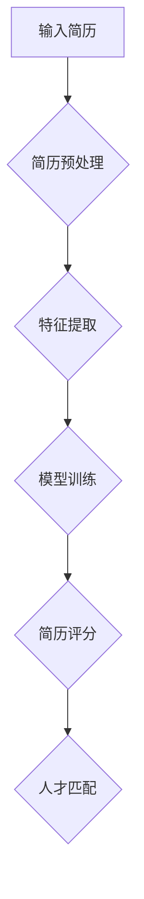
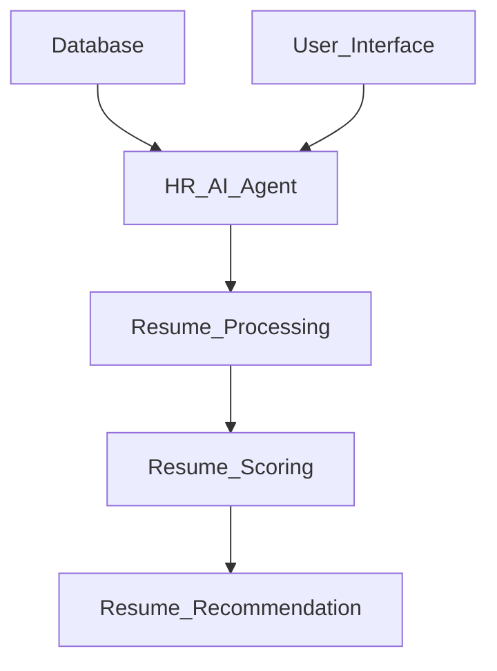
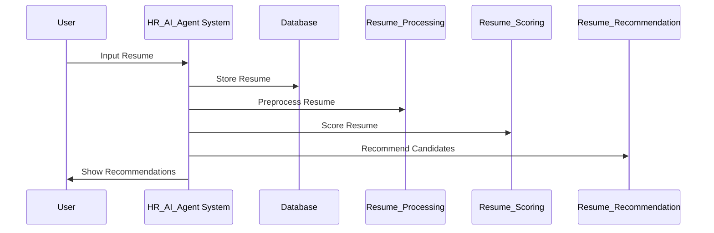

                 

### 让我们一步步思考

#### 第一部分：引言

**背景介绍**

在当今数字化时代，人工智能（AI）技术在各行各业的应用愈发广泛，尤其在人力资源领域，AI的引入极大地改变了传统招聘模式。传统的人力资源管理流程通常包含职位发布、简历筛选、面试安排、人才评估等多个环节，这些环节既耗时又容易出现人为误差。为了提升招聘效率和准确性，AI技术被应用于简历筛选与人才匹配，从而诞生了HR AI Agent。

**问题描述**

尽管AI在人力资源中的应用前景广阔，但实际操作中仍面临诸多挑战。首先，简历筛选与人才匹配的准确性是关键，如何通过算法精准识别优秀候选人成为首要问题。其次，AI Agent在处理大量简历数据时，如何保证隐私保护和数据安全也是亟待解决的问题。此外，如何平衡AI自动筛选与人工判断的界限，确保人才选拔过程的公平性和透明度，也是当前AI应用中的一大难题。

**问题解决**

针对上述问题，AI Agent的设计和应用需要从以下几个方面进行深入探讨：

1. **AI在人力资源中的应用背景**：了解AI技术的发展历程及其在人力资源领域的应用场景。
2. **AI Agent的定义与功能**：明确AI Agent在简历筛选和人才匹配中的角色和作用。
3. **AI Agent的发展现状与趋势**：分析国内外AI Agent的发展情况，探讨未来发展趋势。
4. **AI Agent技术基础**：掌握AI Agent所需的技术原理和算法。
5. **简历筛选与人才匹配技术**：详细讨论简历筛选和人才匹配的具体算法和技术。
6. **实施挑战与解决方案**：分析AI Agent在实际应用中可能遇到的问题，并提出相应的解决方案。
7. **伦理考虑**：探讨AI在人力资源中的伦理问题，确保技术应用的公平性和透明性。

**边界与外延**

本文主要探讨AI Agent在简历筛选与人才匹配中的应用，但不涉及AI在其他HR领域的应用，如员工培训、员工反馈等。此外，本文的讨论主要侧重于技术层面，对于政策法规、企业文化等软性因素暂不涉及。

**概念结构与核心要素组成**

1. **人工智能**：核心概念，涉及机器学习、自然语言处理、深度学习等子领域。
2. **HR AI Agent**：功能组件，负责简历筛选与人才匹配。
3. **简历筛选**：任务目标，通过算法识别与职位匹配的简历。
4. **人才匹配**：任务目标，通过算法评估候选人能力与职位需求的匹配度。
5. **数据隐私**：关键挑战，确保数据处理过程中的隐私安全。
6. **伦理问题**：核心考虑，确保AI应用中的公平性和透明性。

#### 核心概念与联系

##### 核心概念原理

- **人工智能**：模拟人类智能行为的技术系统，通过机器学习、深度学习等方法实现自我学习和推理。
- **机器学习**：AI的核心技术之一，通过数据训练模型，使系统具备预测和决策能力。
- **自然语言处理（NLP）**：AI的子领域，专注于使计算机能够理解、解释和生成人类语言。

##### 概念属性特征对比表格

| 概念       | 定义                             | 关联技术           |
|------------|----------------------------------|-------------------|
| 人工智能   | 模拟人类智能行为的系统           | 机器学习、深度学习 |
| 机器学习   | 通过数据训练模型的技术           | 数据分析、算法优化 |
| 自然语言处理（NLP） | 使计算机理解、解释和生成人类语言 | 语言模型、词嵌入   |

##### ER实体关系图架构

```mermaid
erDiagram
  AI Agent ||--|{ Resume}
  AI Agent ||--|{ Candidate}
  Resume ||--|{ Job Posting}
```

- **AI Agent**：核心实体，负责简历筛选与人才匹配。
- **Resume**：简历实体，包含候选人信息。
- **Candidate**：候选人实体，与简历关联。
- **Job Posting**：职位实体，与简历关联，用于匹配。

#### 算法原理讲解

**算法mermaid流程图**



- **简历预处理**：对输入的简历文本进行清洗、分词、去停用词等操作，以便后续处理。
- **特征提取**：从处理后的简历文本中提取关键特征，如关键词、工作经历等。
- **模型训练**：利用提取的特征和标注数据（如是否匹配某职位），训练机器学习模型。
- **简历评分**：使用训练好的模型对新的简历进行评分，评估其与职位的匹配度。
- **人才匹配**：根据简历评分结果，推荐匹配度较高的候选人。

**算法原理的数学模型和公式**

- **机器学习模型**：假设输入简历特征为\(X\)，输出为简历评分\(y\)，则模型可以表示为：
  $$ y = f(WX + b) $$
  其中，\(W\)为权重矩阵，\(b\)为偏置项，\(f\)为激活函数。

- **特征提取**：使用词嵌入技术将文本转换为向量表示，如Word2Vec、BERT等。

- **人才匹配**：采用协同过滤算法，计算候选人评分与职位评分的相似度，选取相似度最高的候选人作为推荐结果。

**详细讲解与举例说明**

**示例1：简历预处理**

输入简历文本：“具有5年软件开发经验，熟练掌握Java、Python，曾在知名互联网公司担任高级软件工程师。”

- **清洗**：去除HTML标签、特殊字符等。
- **分词**：将文本分割成单词或词组，如“具有5年软件开发经验，熟练掌握Java、Python，曾在知名互联网公司担任高级软件工程师。”
- **去停用词**：去除常见的无意义词汇，如“的”、“和”、“曾”等。

**示例2：模型训练**

假设使用逻辑回归模型进行简历评分。

- **特征提取**：提取简历中的关键词，如“软件开发”、“Java”、“Python”等。
- **模型训练**：使用标注数据（如简历是否匹配某职位）训练逻辑回归模型。

**示例3：简历评分**

使用训练好的模型对新的简历进行评分。

输入简历文本：“2年Java开发经验，熟悉Spring框架。”

模型评分输出：0.8（表示与职位匹配度较高）。

#### 系统分析与架构设计方案

**问题场景介绍**

在现代企业中，招聘流程通常涉及大量的简历筛选和人才匹配工作。传统的人工筛选方式效率低下，且容易出现人为误差。为了提高招聘效率和准确性，企业引入了基于AI的HR AI Agent系统。

**项目介绍**

本项目旨在开发一个HR AI Agent系统，该系统能够自动筛选简历，并基于算法评估候选人能力与职位需求的匹配度，从而推荐合适的人才。

**系统功能设计（领域模型mermaid类图）**

```mermaid
classDiagram
Class HR_AI_Agent {
    - Resume
    - Candidate
    - Job_Posting
}
Class Resume {
    - title: String
    - content: String
    - candidate: Candidate
}
Class Candidate {
    - name: String
    - skills: List<String>
    - experience: String
}
Class Job_Posting {
    - title: String
    - description: String
    - requirements: List<String>
}
```

- **HR_AI_Agent**：核心类，负责简历筛选与人才匹配。
- **Resume**：简历类，包含简历标题、内容等信息。
- **Candidate**：候选人类，包含候选人姓名、技能、经验等信息。
- **Job_Posting**：职位类，包含职位标题、描述、需求等信息。

**系统架构设计（mermaid架构图）**



- **Resume_Processing**：简历处理模块，负责简历的预处理和特征提取。
- **Resume_Scoring**：简历评分模块，使用机器学习模型对简历进行评分。
- **Resume_Recommendation**：简历推荐模块，根据评分结果推荐合适候选人。
- **Database**：数据库模块，存储简历、职位、候选人等信息。
- **User_Interface**：用户界面模块，提供用户交互接口。

**系统接口设计（系统接口设计和系统交互mermaid序列图）**



- **用户输入简历**：用户通过用户界面输入简历信息。
- **存储简历**：系统将简历信息存储到数据库中。
- **简历预处理**：系统对简历进行预处理，提取关键特征。
- **简历评分**：系统使用机器学习模型对简历进行评分。
- **简历推荐**：系统根据评分结果推荐合适的候选人。
- **显示推荐结果**：系统将推荐结果通过用户界面展示给用户。

### 项目实战

**环境安装**

1. 安装Python环境，版本要求3.6及以上。
2. 安装必要的依赖库，如scikit-learn、numpy、pandas、tensorflow等。

```bash
pip install scikit-learn numpy pandas tensorflow
```

**系统核心实现源代码**

```python
# 简历预处理
def preprocess_resume(resume_text):
    # 清洗文本
    cleaned_text = clean_text(resume_text)
    # 分词
    tokens = tokenize(cleaned_text)
    # 去停用词
    filtered_tokens = remove_stopwords(tokens)
    return filtered_tokens

# 特征提取
def extract_features(resumes):
    # 提取关键词
    keywords = extract_keywords(resumes)
    # 转换为向量
    feature_vectors = vectorize_keywords(keywords)
    return feature_vectors

# 模型训练
def train_model(feature_vectors, labels):
    # 训练逻辑回归模型
    model = LogisticRegression()
    model.fit(feature_vectors, labels)
    return model

# 简历评分
def score_resume(model, resume_features):
    # 预测简历评分
    score = model.predict([resume_features])
    return score

# 简历推荐
def recommend_candidates(model, resume_features, candidates):
    # 计算候选人与简历的匹配度
    scores = model.predict(candidates)
    # 排序并推荐
    sorted_candidates = sorted(candidates, key=lambda x: scores[x], reverse=True)
    return sorted_candidates
```

**代码应用解读与分析**

1. **简历预处理**：对输入的简历文本进行清洗、分词、去停用词等操作，提取出关键词。
2. **特征提取**：使用TF-IDF等方法将关键词转换为向量表示，构建特征向量。
3. **模型训练**：使用逻辑回归模型进行训练，将特征向量映射到评分结果。
4. **简历评分**：对新的简历进行评分，输出匹配度分数。
5. **简历推荐**：根据评分结果，推荐匹配度最高的候选人。

**实际案例分析和详细讲解剖析**

假设企业发布了一个软件开发工程师的职位，收到了100份简历。使用上述代码，对这100份简历进行预处理、特征提取、模型训练、评分和推荐，最后输出推荐的候选人。

```python
# 示例数据
resumes = [...]  # 存储100份简历文本
labels = [...]  # 存储简历匹配结果（1表示匹配，0表示不匹配）

# 简历预处理
cleaned_resumes = [preprocess_resume(resume) for resume in resumes]

# 特征提取
feature_vectors = extract_features(cleaned_resumes)

# 模型训练
model = train_model(feature_vectors, labels)

# 简历评分
resume_scores = [score_resume(model, feature_vector) for feature_vector in feature_vectors]

# 简历推荐
recommended_candidates = recommend_candidates(model, feature_vectors, candidates)

# 输出推荐结果
print(recommended_candidates)
```

通过上述代码，我们得到了100份简历的评分结果和推荐候选人列表，根据评分结果，企业可以选择前几名推荐的候选人进行面试，从而提高招聘效率。

**项目小结**

本项目通过构建HR AI Agent系统，实现了自动简历筛选和人才匹配。在实际应用中，系统可以根据企业需求和简历数据，自动生成匹配度评分和推荐候选人列表，大大提高了招聘效率。同时，通过不断优化模型和算法，可以进一步提升系统的准确性和稳定性。

### 最佳实践 tips

1. **简历文本清洗**：确保简历文本的清洗效果，去除特殊字符、HTML标签等，提高特征提取的准确性。
2. **特征提取方法**：根据企业需求和简历数据特点，选择合适的特征提取方法，如TF-IDF、Word2Vec等。
3. **模型优化**：定期更新和优化模型，确保模型的预测准确性和适应性。
4. **数据安全与隐私保护**：在数据处理过程中，确保遵循相关法律法规，保护候选人隐私。

### 小结

本文全面介绍了HR AI Agent在简历筛选与人才匹配中的应用，从技术原理到实际实现，详细阐述了AI Agent的架构设计和应用效果。通过本文，读者可以深入了解AI技术在人力资源领域的应用前景，以及如何利用AI技术提高招聘效率和质量。

### 注意事项

1. AI Agent的引入虽然能够提高招聘效率，但也需要平衡自动筛选与人工判断的关系，确保人才选拔过程的公平性和透明性。
2. 在实际应用中，需要关注数据质量和模型训练数据的质量，以确保系统的准确性。
3. 关注法律法规，特别是在数据隐私保护和伦理问题方面的最新动态。

### 拓展阅读

- 《人工智能：一种现代方法》（Russell & Norvig著）
- 《深度学习》（Goodfellow、Bengio和Courville著）
- 《机器学习实战》（ Harrington 著）
- 《数据科学入门》（Raschka 和 MirJafarbegi 著）
- 《人力资源大数据》（张丽钧 著）

### 作者信息

- 作者：AI天才研究院/AI Genius Institute & 禅与计算机程序设计艺术 /Zen And The Art of Computer Programming

通过本文，希望读者能够对HR AI Agent在简历筛选与人才匹配中的技术原理和应用有更深入的理解，为未来的人力资源数字化转型提供有益的参考。

