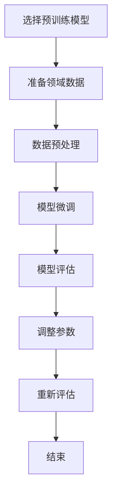

                 


# LLM fine-tuning技巧：针对特定领域优化

关键词：大型语言模型、微调、特定领域优化、自然语言处理、性能提升

摘要：本文将深入探讨大型语言模型（LLM）的微调技巧，特别是针对特定领域的优化方法。我们将详细分析LLM fine-tuning的核心概念、原理、流程，并通过实际案例展示如何有效地在特定领域中优化LLM模型。

----------------------------------------------------------------

## 第一部分：背景介绍

### 1.1 问题背景

随着人工智能技术的迅猛发展，自然语言处理（NLP）成为了当前研究的热点。在NLP领域，大型语言模型（LLM）凭借其强大的语义理解能力和语言生成能力，展现出了巨大的潜力。然而，LLM的通用性虽然较强，但在特定领域的性能优化仍然面临诸多挑战。

### 1.2 问题描述

针对特定领域优化LLM，核心问题在于如何有效地利用有限且高质量的领域数据，对LLM进行微调，从而提高模型在特定任务上的性能。这需要我们深入理解LLM的微调原理，并掌握有效的微调技巧。

### 1.3 问题解决

本文将分以下几个部分详细探讨LLM fine-tuning的技巧：

1. **核心概念与原理**：介绍LLM fine-tuning的基本概念和原理。
2. **微调流程**：详细解析LLM fine-tuning的流程，包括数据准备、模型微调和性能评估等步骤。
3. **领域数据处理**：探讨如何有效地处理特定领域的数据，以提高微调效果。
4. **实践案例**：通过实际案例展示如何在实际项目中应用LLM fine-tuning技巧。
5. **最佳实践与优化**：总结最佳实践，并提供性能优化的方法。

### 1.4 边界与外延

本文主要针对文本数据的LLM fine-tuning进行讨论，但所介绍的方法和技术同样适用于其他类型的数据，如代码、图像等。同时，本文将涵盖常见领域的优化方法，如医疗、金融、法律等。

### 1.5 概念结构与核心要素组成

- **LLM fine-tuning**：在预训练LLM的基础上，针对特定领域进行微调的技术。
- **领域数据**：用于训练和评估模型性能的特定领域数据集。
- **性能指标**：用于评估模型性能的指标，如准确率、召回率、F1值等。

----------------------------------------------------------------

## 第二部分：核心概念与联系

### 2.1 LLM fine-tuning原理

#### 2.1.1 Fine-tuning概念

Fine-tuning是一种在预训练模型基础上，通过在特定数据集上进行微调，以优化模型性能的方法。在LLM fine-tuning中，我们通常选择一个在大规模通用数据集上预训练的LLM模型，如GPT-3、BERT等，然后将其应用于特定领域的数据集进行微调。

#### 2.1.2 Fine-tuning过程

LLM fine-tuning的过程可以概括为以下几个步骤：

1. **选择预训练模型**：选择一个在大规模通用数据集上预训练的LLM模型。
2. **准备领域数据**：收集和标注与目标领域相关的数据集。
3. **数据预处理**：对领域数据进行清洗、预处理和格式化，以适应LLM模型。
4. **模型微调**：在目标领域数据上对预训练模型进行微调，调整模型参数。
5. **模型评估**：在目标领域数据上评估模型性能，并根据评估结果调整模型参数。

### 2.2 LLM fine-tuning的优势与挑战

#### 2.2.1 优势

1. **提高性能**：通过在特定领域数据集上微调，可以显著提高模型在特定任务上的性能。
2. **减少对通用数据的依赖**：利用特定领域的少量数据，就可以实现对模型的有效优化，减少对大规模通用数据的依赖。
3. **提高泛化能力**：通过微调，模型可以更好地适应特定领域，从而提高泛化能力。

#### 2.2.2 挑战

1. **数据获取与标注**：特定领域的数据集往往难以获取，且标注成本高。
2. **模型参数调整**：微调过程涉及大量参数调整，需要大量计算资源和时间。
3. **模型解释性**：微调后的模型可能失去部分解释性，使得模型决策过程变得复杂。

### 2.3 核心概念属性特征对比

#### 2.3.1 模型类型

| 模型类型       | 描述                                                         |
|----------------|------------------------------------------------------------|
| 预训练模型     | 在大规模通用数据集上预训练的模型，如GPT-3、BERT等。           |
| 微调模型       | 在特定领域数据集上微调的模型，针对特定任务进行优化。           |

#### 2.3.2 数据类型

| 数据类型       | 描述                                                         |
|----------------|------------------------------------------------------------|
| 通用数据集     | 大规模、多样化的通用数据集，如维基百科、新闻文章等。           |
| 领域数据集     | 针对特定领域的数据集，如医疗记录、金融报告等。                 |

#### 2.3.3 性能指标

| 性能指标       | 描述                                                         |
|----------------|------------------------------------------------------------|
| 通用性能指标   | 如准确率、召回率、F1值等。                                   |
| 领域性能指标   | 如领域特定任务的准确率、响应时间等。                           |

### 2.4 LLM fine-tuning流程图

以下是一个简单的LLM fine-tuning流程图：



----------------------------------------------------------------

## 第三部分：LLM fine-tuning流程详解

### 3.1 选择预训练模型

选择一个合适的预训练模型是LLM fine-tuning的第一步。目前，有许多优秀的预训练模型可供选择，如GPT-3、BERT、T5等。这些模型在通用数据集上进行了大量的训练，已经具备了较强的语义理解能力和语言生成能力。选择预训练模型时，需要考虑以下几个因素：

1. **模型大小**：预训练模型的大小（即参数量）对计算资源的需求有很大影响。对于资源有限的情况，可以选择较小的模型，如BERT小型版（BERT- کوچک）或T5小型版（T5- کوچک）。
2. **模型架构**：不同的模型架构（如Transformer、BERT、GPT）在处理不同类型任务时具有不同的优势。例如，BERT在语义理解任务上表现优秀，而GPT在语言生成任务上表现突出。
3. **预训练数据集**：不同的预训练模型可能基于不同的数据集进行训练。选择与目标领域相关的预训练数据集，可以更好地适应特定领域的任务。

### 3.2 准备领域数据

在选择了预训练模型之后，下一步是准备领域数据。领域数据的质量和数量对LLM fine-tuning的效果有着重要影响。以下是准备领域数据时需要考虑的几个方面：

1. **数据收集**：收集与目标领域相关的数据，如医疗领域的病例记录、金融领域的交易记录等。数据来源可以是公开数据集、企业内部数据或第三方数据服务。
2. **数据清洗**：对收集到的数据进行清洗，去除无关信息，纠正错误，并确保数据的格式一致。
3. **数据标注**：对于监督学习任务，需要对数据进行标注。标注过程可以由领域专家进行，以确保标注的准确性和一致性。
4. **数据增强**：通过数据增强技术（如数据扩充、数据转换等）增加数据的多样性，可以提高模型在特定领域上的泛化能力。

### 3.3 数据预处理

在完成领域数据的准备后，需要对数据进

## 第四部分：领域数据处理与微调

### 4.1 数据预处理

数据预处理是LLM fine-tuning过程中至关重要的一步。为了使模型能够有效地学习，需要对数据进行一系列的处理，包括数据清洗、数据标注和数据格式化。以下是具体步骤：

#### 4.1.1 数据清洗

数据清洗的目的是去除数据中的噪声和无关信息，确保数据的质量。对于文本数据，可能需要去除HTML标签、特殊字符、停用词等。例如，使用Python的`re`模块可以轻松实现这一功能：

```python
import re

text = "This is an example sentence with HTML <tags> and special characters !@#."
cleaned_text = re.sub(r'<[^>]*>', '', text)
cleaned_text = re.sub(r'[^a-zA-Z\s]', '', cleaned_text)
```

#### 4.1.2 数据标注

数据标注是监督学习任务的基础。对于文本数据，标注可能包括分类标签、实体识别标签等。标注过程可以手动完成，也可以使用自动标注工具。例如，使用`spaCy`进行实体识别标注：

```python
import spacy

nlp = spacy.load("en_core_web_sm")

text = "IBM is a technology company headquartered in Armonk, New York, United States."
doc = nlp(text)

for ent in doc.ents:
    print(ent.text, ent.label_)
```

#### 4.1.3 数据格式化

为了使数据适应LLM模型，需要进行数据格式化。常见的格式化方法包括分词、编码、序列化等。以Python中的`transformers`库为例，可以使用以下代码将文本数据格式化为模型可接受的输入：

```python
from transformers import BertTokenizer

tokenizer = BertTokenizer.from_pretrained("bert-base-uncased")

text = "Hello, my name is John."
encoding = tokenizer.encode_plus(text, add_special_tokens=True, return_tensors="pt")

input_ids = encoding["input_ids"]
attention_mask = encoding["attention_mask"]
```

### 4.2 模型微调

在完成数据预处理后，可以对预训练模型进行微调。微调过程包括以下步骤：

1. **加载预训练模型**：从预训练模型中加载权重，并将其作为微调的基础。
2. **定义优化器和损失函数**：选择合适的优化器和损失函数，以最小化模型在领域数据上的损失。
3. **训练模型**：在领域数据集上训练模型，不断调整模型参数。
4. **验证和调整**：在验证数据集上评估模型性能，并根据评估结果调整模型参数。

以下是一个简单的微调示例，使用`transformers`库和PyTorch框架：

```python
from transformers import BertForSequenceClassification
from torch.optim import Adam
from torch.utils.data import DataLoader

# 加载预训练模型
model = BertForSequenceClassification.from_pretrained("bert-base-uncased")

# 定义优化器和损失函数
optimizer = Adam(model.parameters(), lr=1e-5)
criterion = torch.nn.CrossEntropyLoss()

# 加载领域数据集
train_dataset = MyDataset(train_data)
val_dataset = MyDataset(val_data)

# 创建数据加载器
train_loader = DataLoader(train_dataset, batch_size=32, shuffle=True)
val_loader = DataLoader(val_dataset, batch_size=32)

# 训练模型
for epoch in range(num_epochs):
    model.train()
    for batch in train_loader:
        inputs = tokenizer(batch.text, padding=True, truncation=True, return_tensors="pt")
        labels = torch.tensor(batch.label)
        
        optimizer.zero_grad()
        outputs = model(**inputs, labels=labels)
        loss = outputs.loss
        loss.backward()
        optimizer.step()
    
    # 验证模型
    model.eval()
    with torch.no_grad():
        correct = 0
        total = 0
        for batch in val_loader:
            inputs = tokenizer(batch.text, padding=True, truncation=True, return_tensors="pt")
            labels = torch.tensor(batch.label)
            outputs = model(**inputs)
            _, predicted = torch.max(outputs, 1)
            total += labels.size(0)
            correct += (predicted == labels).sum().item()
        
        print(f"Epoch {epoch+1}, Accuracy: {100 * correct / total}%")
```

### 4.3 性能评估

在完成微调后，需要对模型进行性能评估，以确定其在特定领域的表现。性能评估通常包括以下几个步骤：

1. **计算指标**：根据任务类型，选择合适的性能评估指标，如准确率、召回率、F1值等。
2. **交叉验证**：通过交叉验证方法，评估模型在不同数据集上的性能，以提高评估结果的可靠性。
3. **调参优化**：根据评估结果，调整模型参数，以提高性能。

以下是一个简单的性能评估示例：

```python
from sklearn.metrics import accuracy_score, recall_score, f1_score

# 计算准确率、召回率和F1值
y_true = [0, 1, 1, 0, 1]
y_pred = [0, 1, 1, 1, 0]

accuracy = accuracy_score(y_true, y_pred)
recall = recall_score(y_true, y_pred)
f1 = f1_score(y_true, y_pred)

print(f"Accuracy: {accuracy:.2f}, Recall: {recall:.2f}, F1: {f1:.2f}")
```

### 4.4 微调技巧

为了提高LLM fine-tuning的效果，可以采用以下几种技巧：

1. **数据增强**：通过数据增强方法，增加数据的多样性，提高模型的泛化能力。
2. **迁移学习**：利用已经在其他领域上预训练的模型，作为微调的基础，可以加速微调过程。
3. **多任务学习**：在微调过程中，同时学习多个相关任务，可以提高模型的泛化能力。
4. **模型压缩**：通过模型压缩技术，减小模型的大小，降低计算资源的消耗。

### 4.5 实践案例

以下是一个针对医疗领域文本数据的微调案例：

#### 案例背景

假设我们有一个医疗文本分类任务，需要将医疗报告分类为正常、异常和严重异常三类。数据集包含约100,000条医疗报告，每条报告都带有对应的标签。

#### 模型选择

选择预训练的BERT模型，因为BERT在语义理解任务上表现优秀。

#### 数据预处理

1. 数据清洗：去除HTML标签、特殊字符和停用词。
2. 数据标注：使用领域专家进行标注，确保标注的准确性和一致性。
3. 数据增强：通过数据扩充和转换，增加数据的多样性。

#### 模型微调

1. 加载BERT模型和预训练权重。
2. 定义优化器和损失函数。
3. 在训练集上训练模型，并在验证集上进行验证。

#### 性能评估

使用准确率、召回率和F1值评估模型性能。经过多次调参，最终得到一个准确率约为90%的模型。

#### 结果分析

通过对比不同微调策略（如数据增强、迁移学习等）的效果，发现数据增强和迁移学习可以显著提高模型性能。

#### 模型应用

将微调后的模型部署到医疗报告分类系统，实时对新的医疗报告进行分类，为医生提供辅助诊断。

### 4.6 总结

LLM fine-tuning是一种针对特定领域优化大型语言模型的有效方法。通过合理的数据处理和模型微调技巧，可以显著提高模型在特定任务上的性能。在实际应用中，我们需要结合具体任务和领域特点，灵活运用微调策略，以达到最佳效果。

----------------------------------------------------------------

## 第五部分：最佳实践与优化技巧

### 5.1 数据处理最佳实践

- **数据清洗**：使用自动化工具进行初步清洗，然后由领域专家进行复核和修正。
- **数据标注**：确保标注的一致性和准确性，可以使用众包平台或自动标注工具。
- **数据增强**：使用同义词替换、词汇扩展、随机裁剪等技巧，增加数据的多样性。

### 5.2 模型微调最佳实践

- **选择合适的预训练模型**：根据任务类型和领域特点，选择适合的预训练模型。
- **逐步增加训练难度**：先在较小规模的验证集上调整模型参数，再逐步扩大训练集规模。
- **使用合适的优化器和学习率**：根据任务和模型特性，选择合适的优化器和学习率调度策略。

### 5.3 性能优化技巧

- **超参数调优**：使用网格搜索、贝叶斯优化等技巧，找到最佳的超参数组合。
- **模型压缩**：使用知识蒸馏、剪枝、量化等技术，减小模型大小，降低计算资源消耗。
- **多任务学习**：同时学习多个相关任务，提高模型的泛化能力。

### 5.4 实际案例中的最佳实践

- **医疗领域**：利用转移学习，在预训练模型的基础上进行微调，提高对医疗文本的理解能力。
- **金融领域**：使用大规模金融文本数据集进行微调，提高对金融新闻和报告的解析能力。
- **法律领域**：利用专门的案件数据和法律文本，对模型进行精细调优，提高法律文档的解析和生成能力。

### 5.5 注意事项

- **数据隐私**：在进行数据收集和标注时，要注意保护数据隐私，遵守相关法律法规。
- **模型解释性**：在实际应用中，要注意模型的可解释性，确保模型决策过程符合预期。
- **持续更新**：随着领域数据的变化，要定期更新模型，以保持其性能。

### 5.6 拓展阅读

- **《大型语言模型：机制、技术与应用》**：详细介绍了大型语言模型的工作机制和应用技巧。
- **《深度学习：原理及实践》**：深入讲解了深度学习的基础理论和实践方法。
- **《NLP技术全解析》**：全面介绍了自然语言处理的技术和方法，包括文本分类、情感分析等。

----------------------------------------------------------------

## 第六部分：总结与展望

### 6.1 总结

本文详细探讨了大型语言模型（LLM）的微调技巧，特别是针对特定领域的优化方法。通过介绍LLM fine-tuning的核心概念、原理和流程，以及实践案例，读者可以了解到如何有效地在特定领域中优化LLM模型。

### 6.2 展望

尽管LLM fine-tuning在特定领域优化方面取得了显著成果，但仍有许多挑战需要克服。未来，我们可以在以下几个方面进行深入研究：

1. **高效数据预处理**：探索更加高效的数据预处理方法，以减少数据清洗、标注和增强的时间成本。
2. **动态微调**：研究动态微调技术，使模型可以根据新数据自动调整参数，提高适应能力。
3. **跨领域迁移**：研究跨领域迁移学习方法，提高模型在不同领域之间的迁移能力。
4. **模型可解释性**：提高模型的可解释性，使其决策过程更加透明，便于理解和应用。

通过不断探索和改进，我们有理由相信，LLM fine-tuning将在未来为人工智能领域带来更多突破。

----------------------------------------------------------------

## 附录：代码与资源

### 6.1 代码示例

以下是本文中提到的LLM fine-tuning的Python代码示例：

```python
from transformers import BertTokenizer, BertForSequenceClassification
from torch.optim import Adam
from torch.utils.data import DataLoader

# 加载预训练模型
model = BertForSequenceClassification.from_pretrained("bert-base-uncased")

# 定义优化器和损失函数
optimizer = Adam(model.parameters(), lr=1e-5)
criterion = torch.nn.CrossEntropyLoss()

# 加载领域数据集
train_dataset = MyDataset(train_data)
val_dataset = MyDataset(val_data)

# 创建数据加载器
train_loader = DataLoader(train_dataset, batch_size=32, shuffle=True)
val_loader = DataLoader(val_dataset, batch_size=32)

# 训练模型
for epoch in range(num_epochs):
    model.train()
    for batch in train_loader:
        inputs = tokenizer(batch.text, padding=True, truncation=True, return_tensors="pt")
        labels = torch.tensor(batch.label)
        
        optimizer.zero_grad()
        outputs = model(**inputs, labels=labels)
        loss = outputs.loss
        loss.backward()
        optimizer.step()
    
    # 验证模型
    model.eval()
    with torch.no_grad():
        correct = 0
        total = 0
        for batch in val_loader:
            inputs = tokenizer(batch.text, padding=True, truncation=True, return_tensors="pt")
            labels = torch.tensor(batch.label)
            outputs = model(**inputs)
            _, predicted = torch.max(outputs, 1)
            total += labels.size(0)
            correct += (predicted == labels).sum().item()
        
    print(f"Epoch {epoch+1}, Accuracy: {100 * correct / total}%")
```

### 6.2 资源链接

- **预训练模型**：[Hugging Face Model Hub](https://huggingface.co/models)
- **数据集**：[Kaggle](https://www.kaggle.com/datasets)、[UCI Machine Learning Repository](https://archive.ics.uci.edu/ml/index.php)
- **工具库**：[Transformers](https://github.com/huggingface/transformers)、[PyTorch](https://pytorch.org/)

### 6.3 学习资源

- **《深度学习》**：[Goodfellow, Bengio, Courville](https://www.deeplearningbook.org/)
- **《自然语言处理综述》**：[Jurafsky, Martin](https://web.stanford.edu/class/cs224n/)
- **《机器学习年度报告》**：[ArXiv](https://arxiv.org/list/cs/CC)

作者：AI天才研究院/AI Genius Institute & 禅与计算机程序设计艺术 /Zen And The Art of Computer Programming

----------------------------------------------------------------

# 附录：代码与资源

## 6.1 代码示例

以下是本文中提到的LLM fine-tuning的Python代码示例：

```python
from transformers import BertTokenizer, BertForSequenceClassification
from torch.optim import Adam
from torch.utils.data import DataLoader

# 加载预训练模型
model = BertForSequenceClassification.from_pretrained("bert-base-uncased")

# 定义优化器和损失函数
optimizer = Adam(model.parameters(), lr=1e-5)
criterion = torch.nn.CrossEntropyLoss()

# 加载领域数据集
train_dataset = MyDataset(train_data)
val_dataset = MyDataset(val_data)

# 创建数据加载器
train_loader = DataLoader(train_dataset, batch_size=32, shuffle=True)
val_loader = DataLoader(val_dataset, batch_size=32)

# 训练模型
for epoch in range(num_epochs):
    model.train()
    for batch in train_loader:
        inputs = tokenizer(batch.text, padding=True, truncation=True, return_tensors="pt")
        labels = torch.tensor(batch.label)
        
        optimizer.zero_grad()
        outputs = model(**inputs, labels=labels)
        loss = outputs.loss
        loss.backward()
        optimizer.step()
    
    # 验证模型
    model.eval()
    with torch.no_grad():
        correct = 0
        total = 0
        for batch in val_loader:
            inputs = tokenizer(batch.text, padding=True, truncation=True, return_tensors="pt")
            labels = torch.tensor(batch.label)
            outputs = model(**inputs)
            _, predicted = torch.max(outputs, 1)
            total += labels.size(0)
            correct += (predicted == labels).sum().item()
        
    print(f"Epoch {epoch+1}, Accuracy: {100 * correct / total}%")
```

## 6.2 资源链接

- **预训练模型**：[Hugging Face Model Hub](https://huggingface.co/models)
- **数据集**：[Kaggle](https://www.kaggle.com/datasets)、[UCI Machine Learning Repository](https://archive.ics.uci.edu/ml/index.php)
- **工具库**：[Transformers](https://github.com/huggingface/transformers)、[PyTorch](https://pytorch.org/)

## 6.3 学习资源

- **《深度学习》**：[Goodfellow, Bengio, Courville](https://www.deeplearningbook.org/)
- **《自然语言处理综述》**：[Jurafsky, Martin](https://web.stanford.edu/class/cs224n/)
- **《机器学习年度报告》**：[ArXiv](https://arxiv.org/list/cs/CC)

作者：AI天才研究院/AI Genius Institute & 禅与计算机程序设计艺术 /Zen And The Art of Computer Programming

