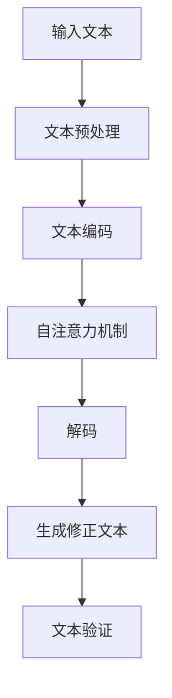

                 


### 《LLM在AI Agent中的文本纠错与改写应用》

> 关键词：LLM，AI Agent，文本纠错，文本改写，自然语言处理，算法原理

> 摘要：本文深入探讨了大型语言模型（LLM）在人工智能代理（AI Agent）中的文本纠错与改写应用。通过对LLM的基本原理、算法流程、应用案例的详细分析，揭示了LLM在提高文本准确性和可读性方面的巨大潜力，并探讨了其在实际项目中的应用。

---

# 第一部分：文本纠错与改写背景与核心概念

## 第1章：文本纠错与改写概述

### 1.1 文本纠错与改写的背景

文本纠错与改写是自然语言处理（NLP）领域中的关键任务。随着互联网和数字化信息爆炸式增长，文本数据的质量和准确性变得至关重要。然而，现实中的文本往往包含各种错误，如拼写错误、语法错误和语义错误。这些错误可能会影响信息的传达和理解，因此文本纠错成为了一个重要的研究课题。

#### 1.1.1 人工智能在自然语言处理中的挑战

人工智能（AI）在自然语言处理中面临许多挑战，包括理解语言的复杂结构、处理多语言环境、处理语境变化以及理解语言的隐含意义。这些挑战使得文本纠错与改写任务变得更加复杂。

#### 1.1.2 文本纠错与改写的重要性和应用领域

文本纠错与改写不仅对于个人用户而言非常重要，如文档编辑和电子邮件通信，还在许多专业领域具有广泛的应用，如医学记录管理、法律文档审查和新闻编辑。

#### 1.1.3 文本纠错与改写的边界与外延

文本纠错关注的是识别和修正文本中的错误，而文本改写则涉及文本的生成、重构和风格转换。两者的边界在于是否对原始文本进行实质性修改。

### 1.2 文本纠错与改写的核心概念

文本纠错通常包括以下几个步骤：错误检测、错误定位、错误修正和错误验证。文本改写则涉及理解原始文本的意图，并生成符合特定要求的文本。

#### 1.2.1 文本纠错的基本原理与流程

文本纠错通常基于模式匹配、规则匹配、统计方法和深度学习方法。其基本流程包括输入文本处理、错误检测、错误修正和结果验证。

#### 1.2.2 文本改写的目标与方法

文本改写的目标可以是提高文本的可读性、风格统一性或信息完整性。方法包括模板匹配、机器学习和自然语言生成（NLG）。

#### 1.2.3 文本纠错与改写的对比分析

文本纠错与改写的主要区别在于其处理方式。纠错关注于修复错误，而改写则注重文本的结构和风格。在某些情况下，两者可以相互结合，以达到更好的效果。

### 1.3 文本纠错与改写的概念属性对比表格

| 特性 | 文本纠错 | 文本改写 |
| --- | --- | --- |
| 目标 | 修正错误 | 重构文本 |
| 方法 | 模式匹配、规则匹配、统计方法、深度学习 | 模板匹配、机器学习、自然语言生成 |
| 输入 | 错误文本 | 原始文本 |
| 输出 | 无错误文本 | 改写后的文本 |

### 1.4 文本纠错与改写的ER实体关系图架构

ER（实体-关系）图是一种用于描述实体及其之间关系的图形化工具。在文本纠错与改写领域，实体可能包括“文本”、“错误”、“修正操作”等，关系则包括“检测”、“修正”和“验证”。

```mermaid
erDiagram
  错误 ||--|> 文本 : 存在
  修正操作 ||--|> 文本 : 应用
  验证 ||--|> 修正操作 : 结果
```

## 第2章：LLM在文本纠错中的应用

### 2.1 LLM概述

#### 2.1.1 LLM的定义与特点

大型语言模型（LLM）是一种能够理解和生成自然语言文本的深度学习模型。其特点包括：

- 基于大规模数据训练
- 高度的语言理解能力
- 可以生成连贯、自然的文本
- 支持多语言和多领域应用

#### 2.1.2 LLM的主要类型

LLM可以分为基于规则的模型、基于统计的模型和深度学习模型。深度学习模型是目前LLM的主流，其中Transformer架构被广泛应用。

#### 2.1.3 LLM的工作原理

LLM通常采用自注意力机制（Self-Attention）和编码器-解码器架构（Encoder-Decoder Architecture）来实现。自注意力机制能够捕捉文本中的长距离依赖关系，而编码器-解码器架构则能够生成目标文本。

### 2.2 LLM在文本纠错中的应用原理

#### 2.2.1 LLM在文本纠错中的优势

LLM在文本纠错中具有以下优势：

- 高效性：LLM可以快速处理大量文本，进行纠错。
- 准确性：通过大规模数据训练，LLM能够识别和修正各种类型的错误。
- 智能性：LLM可以理解上下文，提供更准确的纠错建议。

#### 2.2.2 LLM在文本纠错中的应用场景

LLM在文本纠错中可以应用于多个场景，包括但不限于：

- 文档编辑：自动纠正文档中的拼写和语法错误。
- 电子邮件通信：实时纠正电子邮件中的错误。
- 信息检索：提高搜索结果的准确性和相关性。

#### 2.2.3 LLM在文本纠错中的挑战与解决方案

LLM在文本纠错中面临的挑战包括：

- 低质量数据：训练数据质量影响模型性能。
- 多语言支持：需要针对不同语言进行专门训练。
- 复杂性：文本纠错涉及多个层面的错误，需要复杂的算法。

解决方案包括：

- 数据预处理：对训练数据进行清洗和预处理。
- 多语言训练：使用多语言数据集进行训练。
- 复杂算法：结合多种算法，提高纠错能力。

### 2.3 LLM在文本纠错中的算法原理

#### 2.3.1 LLM的算法流程图

LLM的算法流程图如下：



#### 2.3.2 LLM的数学模型与公式

LLM的数学模型通常基于Transformer架构。以下是一个简化的数学模型：

$$
\text{输出} = \text{softmax}(\text{W}_\text{out} \cdot \text{T}_\text{dec})
$$

其中，$\text{T}_\text{dec}$ 是解码器的输出，$\text{W}_\text{out}$ 是权重矩阵。

#### 2.3.3 LLM算法的Python实现

以下是使用Python实现的LLM算法的简化示例：

```python
import torch
import torch.nn as nn

class LLM(nn.Module):
    def __init__(self, embedding_dim, hidden_dim):
        super(LLM, self).__init__()
        self.embedding = nn.Embedding(embedding_dim, hidden_dim)
        self.decoder = nn.Linear(hidden_dim, embedding_dim)
        
    def forward(self, input_sequence):
        embedded = self.embedding(input_sequence)
        output = self.decoder(embedded)
        return output

# 示例使用
model = LLM(embedding_dim=100, hidden_dim=200)
input_sequence = torch.tensor([1, 2, 3, 4])
output = model(input_sequence)
print(output)
```

### 2.4 LLM在文本纠错中的应用案例

#### 2.4.1 案例一：自动纠错软件的开发

自动纠错软件可以使用LLM进行文本纠错。首先，收集大量的错误文本数据，然后使用LLM进行训练，最终部署到软件中，实现自动纠错功能。

#### 2.4.2 案例二：智能客服系统的文本纠错

智能客服系统可以使用LLM对用户输入的文本进行纠错，提高客服响应的准确性和效率。例如，当用户输入一个包含错误的查询时，LLM可以自动纠正错误，并提供更准确的回答。

#### 2.4.3 案例三：文本审核与过滤中的纠错应用

文本审核与过滤系统可以使用LLM对用户提交的文本进行纠错，减少潜在的恶意内容和错误信息。通过纠错，系统可以更准确地识别和处理文本内容。

---

以上是文本纠错与改写以及LLM在文本纠错中的应用的初步分析。接下来的章节将进一步探讨LLM在文本改写中的应用，以及LLM在AI Agent中的综合应用。通过深入分析，我们将揭示LLM在NLP领域的巨大潜力和实际应用价值。让我们继续探索LLM的奥秘吧！

