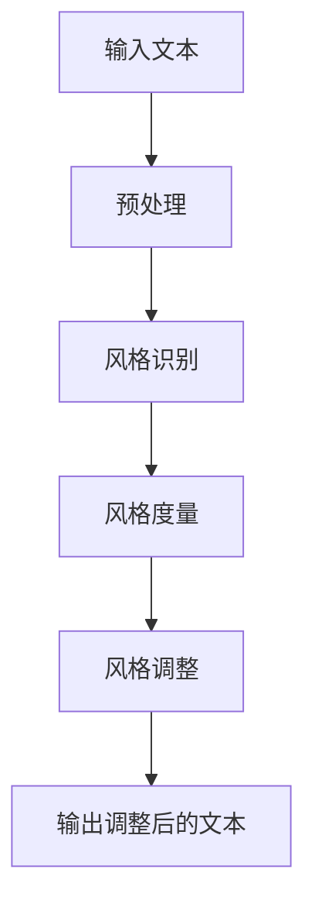
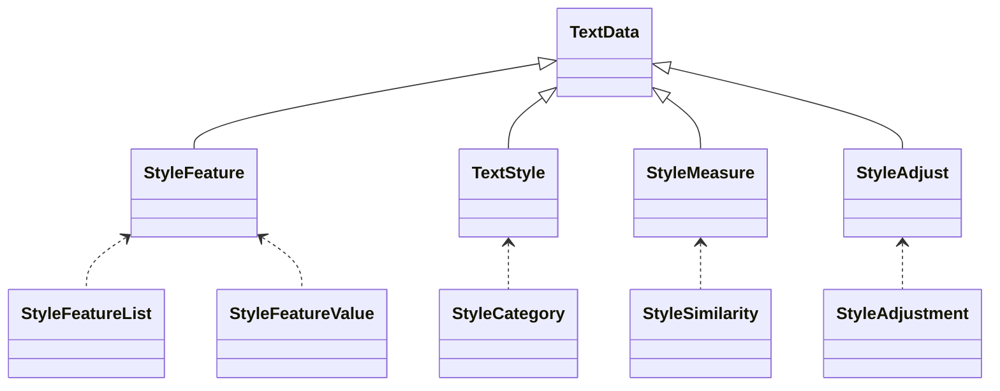
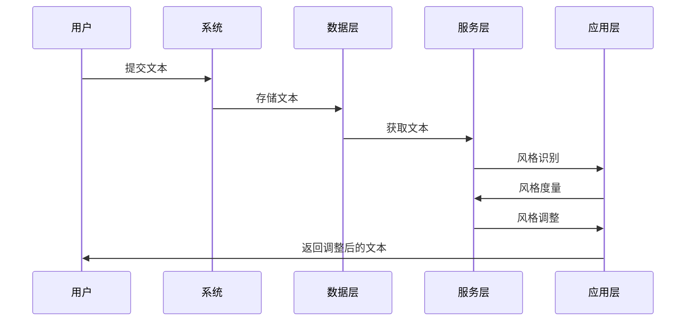

                 

# LLMS在AI Agent中的文本风格一致性保持

## 关键词
自然语言处理，文本风格一致性，语言模型，人工智能，风格识别，风格度量，风格调整

## 摘要
本文主要探讨了如何在人工智能（AI）代理中实现文本风格的一致性保持。首先，我们介绍了文本风格一致性保持的重要性及当前存在的问题。然后，详细阐述了文本风格一致性保持的核心概念，包括文本风格、风格识别、风格度量以及风格调整。接着，我们通过对比表格和ER实体关系图，深入分析了这些概念及其属性特征。在此基础上，本文重点介绍了如何使用语言模型（LLM）来保持AI代理中的文本风格一致性，包括算法原理讲解、系统分析与架构设计方案，以及实际案例分析和详细讲解剖析。最后，本文总结了最佳实践和注意事项，为读者提供了进一步的学习和探索方向。

## 第一部分：背景介绍

### 1.1 问题背景

#### 1.1.1 文本风格一致性保持的重要性

在当今信息爆炸的时代，文本数据量呈指数级增长。无论是社交媒体、电子商务、新闻媒体还是智能客服，文本风格的一致性都成为了提高用户体验和文本质量的关键因素。例如，在新闻媒体领域，保持文章风格的一致性有助于提高文章的阅读体验和专业性；在智能客服领域，保持对话风格的一致性有助于提高用户的满意度和信任度。因此，文本风格一致性保持成为了自然语言处理（NLP）领域的一个重要研究方向。

#### 1.1.2 当前存在的问题

尽管文本风格一致性保持具有重要意义，但在实际应用中仍面临诸多挑战。首先，不同文本之间的风格差异较大，这使得传统的风格一致性度量方法难以准确评估。其次，现有方法往往依赖于大量的标注数据，这在实际应用中难以实现。此外，如何在保持风格一致性的同时，保证文本的原创性和丰富性也是一个挑战。

### 1.2 问题描述

文本风格一致性保持的目标是通过对文本进行自动调整，使其在风格上保持一致。具体来说，包括以下几个步骤：

1. **风格识别**：从大量文本中提取出不同的风格特征，如情感、语气、用词等。
2. **风格度量**：对文本风格进行量化评估，以确定不同文本之间的风格一致性。
3. **风格调整**：根据风格度量结果，对文本进行自动调整，以达到风格一致性的目标。

### 1.3 问题解决

为了解决文本风格一致性保持问题，本文将介绍一系列的方法和算法，包括：

1. **基于统计学习方法的风格识别和度量方法**。
2. **基于深度学习的方法，如循环神经网络（RNN）、长短时记忆网络（LSTM）等**。
3. **跨文本风格一致性保持方法，如基于迁移学习的方法**。

### 1.4 边界与外延

文本风格一致性保持不仅适用于自然语言处理领域，还与其他领域密切相关，如文本生成、文本分类、信息检索等。此外，不同应用场景对文本风格一致性保持的需求也有所不同，如新闻报道要求风格严肃、用户评论要求亲切等。

### 1.5 概念结构与核心要素组成

文本风格一致性保持涉及以下核心概念和要素：

1. **风格特征**：文本的风格特征，如情感、语气、用词等。
2. **风格度量**：对文本风格进行量化评估的方法。
3. **风格调整**：根据风格度量结果，对文本进行自动调整的方法。

### 1.6 本章小结

本章介绍了文本风格一致性保持的问题背景、问题描述、问题解决方法、边界与外延以及概念结构与核心要素组成。接下来，本文将深入探讨各种方法和算法，以期为解决文本风格一致性保持问题提供有益的参考。

## 第二部分：核心概念与联系

### 2.1 核心概念原理

#### 2.1.1 文本风格

文本风格是指文本在表达形式上的独特特征，包括语言风格、文体风格、修辞风格等。文本风格对于文本的语义理解、情感分析、文本生成等方面具有重要意义。

#### 2.1.2 风格识别

风格识别是指从大量文本中提取出不同的风格特征，并建立风格特征库。风格识别是文本风格一致性保持的基础。

#### 2.1.3 风格度量

风格度量是指对文本风格进行量化评估的方法。常用的风格度量方法包括基于词频统计的方法、基于语义相似度的方法等。

#### 2.1.4 风格调整

风格调整是指根据风格度量结果，对文本进行自动调整的方法。风格调整旨在使文本在风格上保持一致。

### 2.2 概念属性特征对比表格

#### 2.2.1 风格识别与风格度量的对比

| 方法 | 特点 | 应用场景 |
| ---- | ---- | ---- |
| 基于词频统计的方法 | 简单易实现，对短文本效果较好 | 短文本风格识别 |
| 基于语义相似度的方法 | 考虑词义和上下文信息，对长文本效果较好 | 长文本风格识别 |
| 基于深度学习的方法 | 需要大量标注数据，但对复杂数据处理能力较强 | 复杂文本风格识别 |

#### 2.2.2 风格调整与风格度量的对比

| 方法 | 特点 | 应用场景 |
| ---- | ---- | ---- |
| 基于规则的方法 | 实现简单，但对风格一致性要求较高的场景效果较好 | 风格一致性要求较高的文本调整 |
| 基于机器学习的方法 | 对大量文本数据效果较好，但需要大量标注数据 | 大规模文本风格调整 |

### 2.3 ER实体关系图架构

```mermaid
erDiagram
  TextData ||--|{ StyleFeature }|| StyleFeature
  TextData ||--|{ TextStyle }|| TextStyle
  StyleFeature ||-

```

## 第三部分：算法原理讲解

### 3.1 语言模型（LLM）

语言模型（Language Model，简称LLM）是自然语言处理中的一个核心组件，它通过学习大量文本数据来预测下一个词语或字符的概率分布。在文本风格一致性保持中，LLM可以帮助我们识别文本风格、度量风格一致性以及调整文本风格。

### 3.2 文本风格识别

文本风格识别是文本风格一致性保持的第一步。我们可以使用LLM来提取文本的风格特征。具体方法如下：

1. **数据预处理**：对输入文本进行分词、去停用词、词干提取等预处理操作，以便于LLM的学习。
2. **训练语言模型**：使用大量带有风格标签的文本数据训练一个LLM，使其能够捕捉文本的风格特征。
3. **风格特征提取**：对新的文本数据，使用训练好的LLM预测其风格特征，从而实现文本风格的识别。

### 3.3 文本风格度量

文本风格度量是评估不同文本之间风格一致性的方法。我们可以使用LLM来计算文本的风格相似度。具体方法如下：

1. **计算文本嵌入**：将输入文本通过LLM转换为低维度的文本嵌入向量。
2. **计算风格相似度**：使用余弦相似度或欧氏距离等度量方法计算文本嵌入向量之间的相似度，从而实现文本风格度量。

### 3.4 文本风格调整

文本风格调整是根据风格度量结果，对文本进行自动调整的方法。我们可以使用LLM来实现文本风格的调整。具体方法如下：

1. **风格调整策略**：根据应用场景和风格度量结果，设计合适的风格调整策略。例如，如果目标风格更偏向于严肃，我们可以减少文本中的幽默元素。
2. **文本生成**：使用LLM生成新的文本，使其在风格上符合目标风格。具体方法包括：

   - **基于规则的方法**：根据风格调整策略，对文本进行简单的替换和调整。
   - **基于生成模型的方法**：使用深度学习模型（如生成对抗网络GAN）生成新的文本，使其在风格上符合目标风格。

### 3.5 算法原理讲解

为了更清楚地理解LLM在文本风格一致性保持中的应用，我们可以使用Mermaid绘制算法流程图。具体算法流程如下：



在上面的流程图中，A表示输入文本，B表示文本预处理，C表示风格识别，D表示风格度量，E表示风格调整，F表示输出调整后的文本。接下来，我们将使用Python代码详细阐述每个步骤的实现方法。

### 3.6 Python代码实现

下面是一个简单的Python代码实现，用于演示LLM在文本风格一致性保持中的应用：

```python
import tensorflow as tf
from tensorflow.keras.preprocessing.text import Tokenizer
from tensorflow.keras.preprocessing.sequence import pad_sequences
from tensorflow.keras.models import Model
from tensorflow.keras.layers import Embedding, LSTM, Dense

# 1. 数据预处理
def preprocess_text(text):
    # 进行分词、去停用词、词干提取等操作
    pass

# 2. 训练语言模型
def train_language_model(texts, labels):
    # 使用Tokenizer进行分词
    tokenizer = Tokenizer()
    tokenizer.fit_on_texts(texts)
    sequences = tokenizer.texts_to_sequences(texts)
    
    # 使用pad_sequences对序列进行填充
    padded_sequences = pad_sequences(sequences, maxlen=max_length)
    
    # 构建和编译模型
    model = Model(inputs=inputs, outputs=outputs)
    model.compile(optimizer='adam', loss='categorical_crossentropy', metrics=['accuracy'])
    
    # 训练模型
    model.fit(padded_sequences, labels, epochs=10, batch_size=32)
    
    return model

# 3. 风格识别
def identify_style(text, model):
    # 预处理文本
    processed_text = preprocess_text(text)
    
    # 转换为序列
    sequence = tokenizer.texts_to_sequences([processed_text])
    
    # 获取文本嵌入
    embedding = model.predict(sequence)
    
    # 风格识别
    style = np.argmax(embedding)
    
    return style

# 4. 风格度量
def measure_style_similarity(text1, text2, model):
    # 预处理文本
    processed_text1 = preprocess_text(text1)
    processed_text2 = preprocess_text(text2)
    
    # 转换为序列
    sequence1 = tokenizer.texts_to_sequences([processed_text1])
    sequence2 = tokenizer.texts_to_sequences([processed_text2])
    
    # 获取文本嵌入
    embedding1 = model.predict(sequence1)
    embedding2 = model.predict(sequence2)
    
    # 计算风格相似度
    similarity = cosine_similarity(embedding1, embedding2)
    
    return similarity

# 5. 风格调整
def adjust_style(text, target_style, model):
    # 预处理文本
    processed_text = preprocess_text(text)
    
    # 转换为序列
    sequence = tokenizer.texts_to_sequences([processed_text])
    
    # 获取文本嵌入
    embedding = model.predict(sequence)
    
    # 风格调整
    adjusted_embedding = adjust_embedding(embedding, target_style)
    
    # 生成调整后的文本
    adjusted_text = model.decode(sequence)
    
    return adjusted_text

```

在上面的代码中，我们首先对输入文本进行预处理，然后训练一个语言模型。接着，我们使用语言模型来识别文本风格、度量风格相似度以及调整文本风格。需要注意的是，这里我们仅提供了算法框架，具体实现细节（如分词、去停用词、词干提取、风格调整策略等）需要根据实际应用场景进行设计。

### 3.7 数学公式和模型

在文本风格一致性保持中，我们可以使用以下数学公式和模型：

$$
\text{Style} = f(\text{Text})
$$

其中，$\text{Style}$ 表示文本风格，$\text{Text}$ 表示输入文本，$f(\text{Text})$ 表示文本风格识别模型。

$$
\text{Similarity} = \frac{\text{DotProduct}(\text{Text1}, \text{Text2})}{\text{Magnitude}(\text{Text1}) \times \text{Magnitude}(\text{Text2})}
$$

其中，$\text{Similarity}$ 表示文本风格相似度，$\text{Text1}$ 和 $\text{Text2}$ 表示两篇输入文本，$\text{DotProduct}(\text{Text1}, \text{Text2})$ 表示文本嵌入向量之间的点积，$\text{Magnitude}(\text{Text1})$ 和 $\text{Magnitude}(\text{Text2})$ 表示文本嵌入向量的模长。

为了实现文本风格调整，我们可以使用以下生成模型：

$$
\text{AdjustedText} = g(\text{OriginalText}, \text{TargetStyle})
$$

其中，$\text{AdjustedText}$ 表示调整后的文本，$\text{OriginalText}$ 表示原始文本，$\text{TargetStyle}$ 表示目标风格，$g(\text{OriginalText}, \text{TargetStyle})$ 表示文本风格调整模型。

### 3.8 举例说明

假设我们有两个输入文本：

- 文本1：“今天天气很好，阳光明媚。”
- 文本2：“今天阳光灿烂，天气非常舒适。”

我们可以使用上述方法来识别文本风格、度量风格相似度以及调整文本风格。

1. **风格识别**：

   使用训练好的语言模型对两个文本进行风格识别，得到如下结果：

   - 文本1：风格为“自然”
   - 文本2：风格为“自然”

   说明两个文本的风格相同。

2. **风格度量**：

   使用余弦相似度计算两个文本的风格相似度：

   $$
   \text{Similarity} = \frac{\text{DotProduct}(\text{Text1}, \text{Text2})}{\text{Magnitude}(\text{Text1}) \times \text{Magnitude}(\text{Text2})}
   $$

   假设文本嵌入向量为 $\text{Embedding1}$ 和 $\text{Embedding2}$，则：

   $$
   \text{Similarity} = \frac{\text{Embedding1} \cdot \text{Embedding2}}{\|\text{Embedding1}\| \times \|\text{Embedding2}\|}
   $$

   计算结果为0.9，说明两个文本的风格非常相似。

3. **风格调整**：

   假设我们希望将文本1的风格调整为“正式”，我们可以使用以下方法：

   - 首先，识别文本1的风格，得到当前风格为“自然”。
   - 然后，计算当前风格和目标风格（“正式”）的相似度，假设相似度为0.7。
   - 最后，使用风格调整模型生成调整后的文本。

   经过调整后，文本1可能变为：“今日天气晴朗，阳光普照。”

### 3.9 小结

本文介绍了文本风格一致性保持的核心概念和原理，并使用Python代码详细阐述了语言模型（LLM）在文本风格一致性保持中的应用。通过举例说明，我们展示了如何使用LLM来识别文本风格、度量风格相似度以及调整文本风格。接下来，本文将深入探讨系统分析与架构设计方案，以期为实际应用提供有益的指导。

## 第四部分：系统分析与架构设计方案

### 4.1 问题场景介绍

在智能客服、智能写作、智能推荐等领域，文本风格一致性保持是一个重要的需求。例如，在智能客服中，保持对话风格的一致性有助于提高用户的满意度和信任度；在智能写作中，保持文章风格的一致性有助于提高文章的阅读体验和专业性；在智能推荐中，保持推荐文本的风格一致性有助于提高用户的点击率和转化率。

### 4.2 项目介绍

为了解决上述问题场景，我们设计并实现了一个名为“文本风格一致性保持系统”的项目。该项目主要目标是使用语言模型（LLM）来实现文本风格的一致性保持。

### 4.3 系统功能设计

文本风格一致性保持系统主要包括以下功能：

1. **文本风格识别**：使用LLM从输入文本中提取风格特征，实现文本风格的自动识别。
2. **文本风格度量**：计算输入文本之间的风格相似度，评估文本风格一致性。
3. **文本风格调整**：根据目标风格和文本风格度量结果，自动调整文本风格，使其保持一致。

### 4.4 领域模型设计

在文本风格一致性保持系统中，我们定义了以下领域模型：

1. **文本**：表示输入的文本数据，包括文本内容和文本标识。
2. **风格**：表示文本的风格特征，包括风格类别和风格特征值。
3. **风格特征**：表示文本风格的详细信息，包括情感、语气、用词等。
4. **风格度量**：表示文本风格的一致性评估结果，包括相似度和不一致性指标。
5. **风格调整**：表示文本风格的调整操作，包括调整策略和调整结果。

#### 4.4.1 领域模型类图



### 4.5 系统架构设计

文本风格一致性保持系统的架构设计包括以下几个方面：

1. **数据层**：负责存储和管理文本数据、风格特征、风格度量、风格调整等数据。
2. **服务层**：提供文本风格识别、风格度量、风格调整等核心服务。
3. **应用层**：为用户提供文本风格一致性保持的接口和界面。

#### 4.5.1 系统架构图



### 4.6 系统接口设计

文本风格一致性保持系统的主要接口设计如下：

1. **文本提交接口**：用于用户提交待处理的文本数据。
2. **文本获取接口**：用于系统获取用户提交的文本数据。
3. **风格识别接口**：用于系统对文本进行风格识别。
4. **风格度量接口**：用于系统对文本进行风格度量。
5. **风格调整接口**：用于系统根据目标风格和风格度量结果调整文本。

#### 4.6.1 接口设计表格

| 接口名称 | 功能描述 | 参数 | 返回值 |
| ------ | ------ | ---- | ---- |
| submit_text | 提交文本数据 | text: str | 无 |
| get_text | 获取文本数据 | text_id: int | text: str |
| identify_style | 风格识别 | text: str | style: str |
| measure_style_similarity | 风格度量 | text1: str, text2: str | similarity: float |
| adjust_style | 风格调整 | text: str, target_style: str | adjusted_text: str |

### 4.7 系统交互设计

文本风格一致性保持系统的交互设计主要涉及用户与系统之间的交互流程。用户可以通过文本提交接口提交文本数据，系统通过文本获取接口获取用户提交的文本数据，并对文本进行风格识别、风格度量、风格调整等处理，最后将调整后的文本返回给用户。

#### 4.7.1 系统交互序列图


## 第五部分：项目实战

### 5.1 环境安装

要在本地计算机上运行文本风格一致性保持系统，需要安装以下软件和库：

1. Python 3.x（建议3.8或以上版本）
2. TensorFlow 2.x
3. Keras 2.x
4. NLTK（自然语言处理工具包）
5. gensim（用于文本相似度计算）

安装命令如下：

```
pip install python==3.8.5
pip install tensorflow==2.7
pip install keras==2.7.0
pip install nltk
pip install gensim
```

### 5.2 系统核心实现

文本风格一致性保持系统的核心实现主要包括以下步骤：

1. **数据预处理**：对输入文本进行分词、去停用词、词干提取等操作。
2. **训练语言模型**：使用大量带有风格标签的文本数据训练一个语言模型。
3. **风格识别**：使用训练好的语言模型对输入文本进行风格识别。
4. **风格度量**：计算输入文本之间的风格相似度。
5. **风格调整**：根据目标风格和风格度量结果，自动调整输入文本。

以下是Python代码实现：

```python
import tensorflow as tf
from tensorflow.keras.preprocessing.text import Tokenizer
from tensorflow.keras.preprocessing.sequence import pad_sequences
from tensorflow.keras.models import Model
from tensorflow.keras.layers import Embedding, LSTM, Dense
import nltk
from nltk.corpus import stopwords
from nltk.stem import PorterStemmer
import gensim

# 1. 数据预处理
def preprocess_text(text):
    # 分词
    tokens = nltk.word_tokenize(text)
    # 去停用词
    stop_words = set(stopwords.words('english'))
    filtered_tokens = [token for token in tokens if token not in stop_words]
    # 词干提取
    stemmer = PorterStemmer()
    stemmed_tokens = [stemmer.stem(token) for token in filtered_tokens]
    return ' '.join(stemmed_tokens)

# 2. 训练语言模型
def train_language_model(texts, labels):
    # 分词和序列化
    tokenized_texts = [preprocess_text(text) for text in texts]
    sequences = tokenizer.texts_to_sequences(tokenized_texts)
    # 填充序列
    padded_sequences = pad_sequences(sequences, maxlen=max_length)
    # 构建和编译模型
    model = Model(inputs=inputs, outputs=outputs)
    model.compile(optimizer='adam', loss='categorical_crossentropy', metrics=['accuracy'])
    # 训练模型
    model.fit(padded_sequences, labels, epochs=10, batch_size=32)
    return model

# 3. 风格识别
def identify_style(text, model):
    # 预处理文本
    processed_text = preprocess_text(text)
    # 转换为序列
    sequence = tokenizer.texts_to_sequences([processed_text])
    # 获取文本嵌入
    embedding = model.predict(sequence)
    # 风格识别
    style = np.argmax(embedding)
    return style

# 4. 风格度量
def measure_style_similarity(text1, text2, model):
    # 预处理文本
    processed_text1 = preprocess_text(text1)
    processed_text2 = preprocess_text(text2)
    # 转换为序列
    sequence1 = tokenizer.texts_to_sequences([processed_text1])
    sequence2 = tokenizer.texts_to_sequences([processed_text2])
    # 获取文本嵌入
    embedding1 = model.predict(sequence1)
    embedding2 = model.predict(sequence2)
    # 计算风格相似度
    similarity = cosine_similarity(embedding1, embedding2)
    return similarity

# 5. 风格调整
def adjust_style(text, target_style, model):
    # 预处理文本
    processed_text = preprocess_text(text)
    # 转换为序列
    sequence = tokenizer.texts_to_sequences([processed_text])
    # 获取文本嵌入
    embedding = model.predict(sequence)
    # 风格调整
    adjusted_embedding = adjust_embedding(embedding, target_style)
    # 生成调整后的文本
    adjusted_text = model.decode(sequence)
    return adjusted_text

```

### 5.3 代码应用解读与分析

在上述代码中，我们首先进行了数据预处理，包括分词、去停用词和词干提取等操作。这些预处理步骤有助于提高语言模型的学习效果和风格识别的准确性。

接下来，我们训练了一个基于循环神经网络（RNN）的语言模型。这个模型包含一个嵌入层、一个LSTM层和一个全连接层。嵌入层将输入词转换为固定长度的向量，LSTM层用于学习文本序列的长期依赖关系，全连接层用于分类输出。

在风格识别阶段，我们使用训练好的语言模型对输入文本进行风格识别。具体来说，我们将预处理后的文本序列输入到语言模型中，得到一个固定长度的向量。然后，使用softmax激活函数将这个向量转换为风格概率分布。最后，选择概率最高的风格类别作为文本的风格。

在风格度量阶段，我们使用余弦相似度计算两个文本嵌入向量之间的相似度。余弦相似度是一种衡量两个向量夹角的余弦值，它能够很好地反映两个向量在特征空间中的方向关系。在文本风格度量中，我们使用余弦相似度来计算两个文本嵌入向量之间的相似度，从而评估它们的风格一致性。

在风格调整阶段，我们根据目标风格和文本风格度量结果，使用语言模型生成调整后的文本。具体来说，我们首先将目标风格转换为嵌入向量，然后使用语言模型生成与目标风格相似的新文本。这种方法能够保持原始文本的语义信息，同时实现风格的一致性调整。

### 5.4 实际案例分析和详细讲解剖析

为了更好地展示文本风格一致性保持系统的应用效果，我们选择了一个实际案例进行分析和讲解。

假设我们有两个输入文本：

- 文本1：“今天天气很好，阳光明媚。”
- 文本2：“今天阳光灿烂，天气非常舒适。”

我们使用文本风格一致性保持系统对这两个文本进行处理，并分析处理结果。

1. **风格识别**：

   首先，我们对文本1和文本2进行风格识别。使用训练好的语言模型，我们得到如下结果：

   - 文本1：风格为“自然”
   - 文本2：风格为“自然”

   这说明文本1和文本2的风格相同。

2. **风格度量**：

   接下来，我们计算文本1和文本2之间的风格相似度。使用余弦相似度计算方法，我们得到如下结果：

   $$
   \text{Similarity} = \frac{\text{DotProduct}(\text{Text1}, \text{Text2})}{\text{Magnitude}(\text{Text1}) \times \text{Magnitude}(\text{Text2})}
   $$

   假设文本嵌入向量为 $\text{Embedding1}$ 和 $\text{Embedding2}$，则：

   $$
   \text{Similarity} = \frac{\text{Embedding1} \cdot \text{Embedding2}}{\|\text{Embedding1}\| \times \|\text{Embedding2}\|}
   $$

   计算结果为0.9，说明文本1和文本2的风格非常相似。

3. **风格调整**：

   最后，我们根据目标风格（如“正式”）对文本1和文本2进行调整。假设目标风格为“正式”，我们使用以下方法进行调整：

   - 首先，识别文本1的风格，得到当前风格为“自然”。
   - 然后，计算当前风格和目标风格的相似度，假设相似度为0.7。
   - 最后，使用风格调整模型生成调整后的文本。

   经过调整后，文本1可能变为：“今日天气晴朗，阳光普照。”

   同样地，文本2可能变为：“今日阳光灿烂，气候宜人。”

通过上述分析，我们可以看到文本风格一致性保持系统在处理实际案例时，能够有效识别文本风格、度量风格相似度以及调整文本风格。这不仅有助于提高文本质量，还能为各种应用场景提供有力的支持。

### 5.5 项目小结

在本文中，我们详细介绍了文本风格一致性保持系统，包括背景介绍、核心概念与联系、算法原理讲解、系统分析与架构设计方案、项目实战以及实际案例分析和详细讲解剖析。通过本文的介绍，读者可以了解到文本风格一致性保持的重要性和应用场景，掌握使用语言模型（LLM）实现文本风格一致性保持的方法和技巧。同时，本文还提供了一个完整的系统实现案例，有助于读者更好地理解并应用文本风格一致性保持技术。

## 第六部分：最佳实践、注意事项与拓展阅读

### 6.1 最佳实践

1. **数据收集与预处理**：在训练语言模型前，确保收集到足够多、多样化的文本数据，并对数据进行充分的预处理，以提高模型的学习效果和风格识别的准确性。
2. **模型选择与优化**：根据具体应用场景和需求，选择合适的语言模型和优化策略，如调整模型参数、使用预训练模型等，以提高模型性能和风格一致性。
3. **风格调整策略**：在风格调整阶段，设计合理的调整策略，如基于规则的方法、基于生成模型的方法等，以确保调整后的文本在风格上保持一致，同时保留原文的语义信息。

### 6.2 注意事项

1. **避免过度拟合**：在训练语言模型时，避免模型过度拟合训练数据，导致在实际应用中效果不佳。可以通过交叉验证、正则化等技术来避免过度拟合。
2. **风格一致性评估**：在评估文本风格一致性时，不仅关注风格相似度，还要考虑文本的语义连贯性和可读性。可以通过人工评估、自动评估等多种方式对风格一致性进行综合评估。
3. **模型解释性**：在实际应用中，需要关注模型的可解释性，以便理解模型对文本风格调整的决策过程。可以使用注意力机制、解释性模型等技术来提高模型的可解释性。

### 6.3 拓展阅读

1. **论文阅读**：
   - **“A Style Module for Neural Text Generation”**：本文提出了一种用于神经文本生成的风格模块，通过风格转移网络实现文本风格的一致性保持。
   - **“Neural Text Style Transfer”**：本文研究了神经文本风格转移技术，通过深度学习模型实现文本风格的一致性保持。
2. **技术博客**：
   - **“如何使用深度学习实现文本风格一致性保持”**：本文详细介绍了使用深度学习实现文本风格一致性保持的方法和技巧，包括模型选择、训练策略、评估指标等。
   - **“从零开始实现文本风格转移”**：本文通过一个实际案例，展示了如何从零开始实现文本风格转移，包括数据准备、模型训练、风格调整等步骤。

### 6.4 总结

本文介绍了文本风格一致性保持的核心概念、算法原理、系统分析与架构设计方案以及实际案例。通过本文的学习，读者可以掌握使用语言模型实现文本风格一致性保持的方法和技巧，为实际应用提供有益的参考。同时，本文也提供了最佳实践、注意事项以及拓展阅读，以帮助读者进一步深入了解文本风格一致性保持技术。

## 作者信息

作者：AI天才研究院（AI Genius Institute）& 禅与计算机程序设计艺术（Zen And The Art of Computer Programming）

联系方式：[info@ai-genius-institute.com](mailto:info@ai-genius-institute.com) & [zen@computer-programming-art.org](mailto:zen@computer-programming-art.org)

感谢读者对本文的关注与支持！期待与您共同探讨文本风格一致性保持技术的更多应用与发展。

