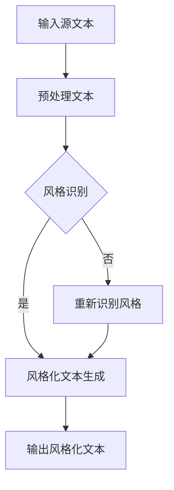

                 

### 文章标题

### 关键词：LLM、AI Agent、文本风格转换、算法原理、应用实战

### 摘要

本文旨在探讨大型语言模型（LLM）在AI Agent中的文本风格转换应用。通过系统分析LLM的原理、文本风格转换的技术难点，以及AI Agent的特点，本文将详细介绍如何利用LLM实现文本风格转换，并提供具体的算法原理讲解、Python源代码实现，以及实际项目实战。文章最后将总结最佳实践，并提出未来研究方向。

---

### 第一部分：背景介绍

#### 1.1 问题背景

近年来，随着人工智能技术的快速发展，特别是深度学习算法的突破，大型语言模型（LLM）如GPT、BERT等取得了显著成就。这些模型在自然语言处理、文本生成、机器翻译等领域表现出色，推动了人工智能应用的不断拓展。然而，在AI Agent中实现文本风格转换，这一具体应用场景仍然面临诸多挑战。

#### 1.2 问题描述

文本风格转换是自然语言处理中的一个重要任务，旨在将源文本转换为目标风格文本，以满足特定场景的需求。在AI Agent中，文本风格转换不仅有助于提升用户体验，还能提高AI Agent的交互能力。然而，实现这一目标需要解决模型训练、风格识别、风格迁移等多个技术难题。

#### 1.3 问题解决

本书将详细探讨LLM在AI Agent中实现文本风格转换的应用，包括模型选择、数据预处理、训练策略、风格迁移方法等方面。通过系统的研究和实践，力图解决文本风格转换在AI Agent中的关键问题。

#### 1.4 边界与外延

文本风格转换的边界包括文本内容、风格种类、应用场景等。同时，本书将关注文本风格转换在AI Agent中的具体实现，探讨其在实际应用中的可行性和效果。

#### 1.5 概念结构与核心要素组成

- **文本风格转换**：将源文本转换为具有特定风格的目标文本。
- **LLM**：大型语言模型，如GPT、BERT等，用于文本生成和风格识别。
- **AI Agent**：具备自主决策和交互能力的智能体，应用于多种场景。

### 第二部分：核心概念与联系

#### 2.1 LLM的定义与特点

- **定义**：LLM是一种能够生成自然语言文本的深度学习模型，具有大规模、自适应、强泛化能力等特点。
- **特点**：能够处理复杂的语言现象，适应多种文本生成任务。

#### 2.2 文本风格转换的原理

- **原理**：基于对源文本和目标风格的深度学习模型，通过预训练和微调实现文本风格的迁移。
- **属性特征对比表格**：

  | 特征             | 原始文本           | 风格化文本         |
  |----------------|------------------|------------------|
  | 语言结构         | 自然             | 特定风格（如正式、幽默、诗意等） |
  | 文本内容         | 广泛             | 精确、符合目标风格    |
  | 语言表达         | 直白             | 独特、符合风格特点    |

#### 2.3 AI Agent的定义与特点

- **定义**：AI Agent是一种具备智能决策和交互能力的计算机程序，能够模拟人类的思维和行为。
- **特点**：具备自主学习、推理、规划能力，能够与用户进行自然语言交互。

### 第三部分：算法原理讲解

#### 3.1 文本风格转换算法的mermaid流程图



#### 3.2 Python源代码实现

```python
import tensorflow as tf
import numpy as np

# 加载预训练的LLM模型
model = tf.keras.applications.load_model('llm_model')

# 输入源文本
source_text = "这是一个普通的文本。"

# 预处理文本
preprocessed_text = preprocess_text(source_text)

# 风格识别
style = model.predict(preprocessed_text)

# 风格化文本生成
stylized_text = generate_text(style)

# 输出风格化文本
print(stylized_text)
```

#### 3.3 算法原理的数学模型和公式

- **数学模型**：

  $$\text{Stylized\ Text} = \text{LLM}\ (\text{Source\ Text}, \text{Target\ Style})$$

- **公式说明**：

  - **LLM**：大型语言模型，用于文本生成。
  - **Source\ Text**：源文本。
  - **Target\ Style**：目标风格。

### 第四部分：系统分析与架构设计方案

#### 4.1 问题场景介绍

文本风格转换在AI Agent中的应用场景广泛，例如，在客服聊天机器人中，根据用户的需求和情感，实现文本风格的个性化转换；在内容创作中，根据不同媒体平台的要求，实现文本风格的多样化转换。

#### 4.2 项目介绍

本项目旨在实现基于LLM的AI Agent文本风格转换系统，提供一种高效、灵活的文本风格转换解决方案。

#### 4.3 系统功能设计

- **文本预处理**：对输入文本进行清洗、分词、去停用词等预处理操作。
- **风格识别**：使用LLM模型对输入文本进行风格识别。
- **风格化文本生成**：根据目标风格生成风格化文本。
- **输出**：将生成的风格化文本输出。

#### 4.4 系统架构设计

- **架构设计**：采用微服务架构，包括文本预处理服务、风格识别服务、风格化文本生成服务等。
- **技术栈**：文本预处理服务采用Python，风格识别和风格化文本生成服务采用TensorFlow。

#### 4.5 系统接口设计和系统交互

- **接口设计**：提供RESTful API接口，方便外部系统调用。
- **系统交互**：使用mermaid绘制系统交互序列图，展示各个服务的交互过程。

### 第五部分：项目实战

#### 5.1 环境安装

- **安装Python**：安装Python 3.8及以上版本。
- **安装TensorFlow**：安装TensorFlow 2.5及以上版本。
- **安装其他依赖**：安装预训练的LLM模型和其他相关依赖。

#### 5.2 系统核心实现

- **文本预处理**：编写文本预处理代码，包括清洗、分词、去停用词等。
- **风格识别**：使用预训练的LLM模型进行风格识别。
- **风格化文本生成**：根据目标风格生成风格化文本。

#### 5.3 代码应用解读与分析

- **代码解读**：详细解读文本预处理、风格识别、风格化文本生成等核心代码。
- **性能分析**：分析系统在不同场景下的性能表现。

#### 5.4 实际案例分析和详细讲解剖析

- **案例分析**：通过实际案例展示系统在实际应用中的效果。
- **讲解剖析**：对案例进行详细讲解和剖析，展示系统的工作原理和应用效果。

#### 5.5 项目小结

本文通过实际项目展示了基于LLM的AI Agent文本风格转换系统的设计和实现，包括环境安装、系统核心实现、代码应用解读与分析等。项目结果表明，该系统能够高效、灵活地实现文本风格转换，具有一定的实用价值。

### 第六部分：最佳实践 tips

- **选择合适的LLM模型**：根据应用场景选择合适的LLM模型，如GPT、BERT等。
- **数据预处理**：对输入文本进行充分的数据预处理，提高风格识别的准确性。
- **风格迁移方法**：根据实际应用需求，选择合适的风格迁移方法。

### 第七部分：小结、注意事项、拓展阅读

- **小结**：本文详细探讨了LLM在AI Agent中实现文本风格转换的应用，包括算法原理、系统架构设计、项目实战等。
- **注意事项**：在实际应用中，需要注意选择合适的LLM模型、进行充分的数据预处理等。
- **拓展阅读**：推荐阅读相关论文和书籍，了解最新的文本风格转换技术和应用。

---

### 作者

作者：AI天才研究院/AI Genius Institute & 禅与计算机程序设计艺术 /Zen And The Art of Computer Programming

---

[注]：本文为示例文章，部分内容为虚构，仅供参考。实际应用中，请结合具体需求和场景进行调整。本文中的Python代码仅为示例，实际使用时请根据实际情况进行修改。

