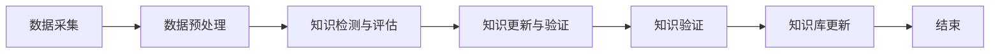
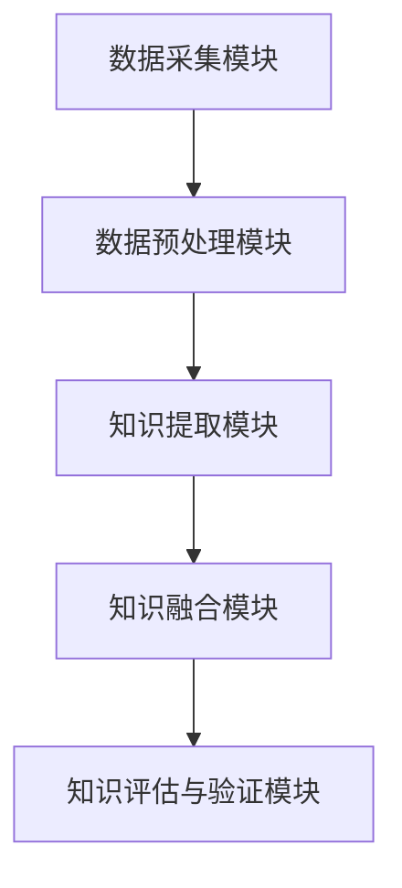
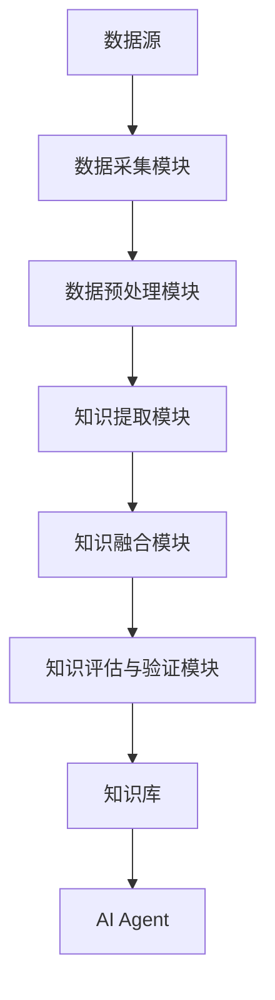
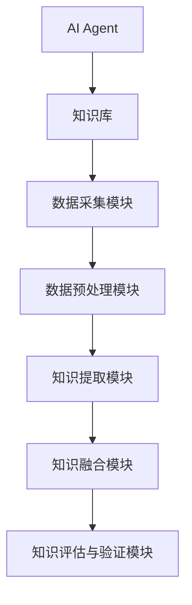

                 

# LLMAI Agent知识更新中的应用

关键词：LLM, AI Agent, 知识更新, 算法原理, 系统架构

摘要：本文旨在探讨大规模语言模型（LLM）在人工智能（AI）代理知识更新中的应用。首先，我们回顾了AI Agent的发展背景和知识更新的重要性。接着，我们介绍了LLM的基本概念、原理和结构，分析了其在自然语言处理和AI Agent领域的应用。随后，我们详细讨论了知识更新机制的挑战、策略和流程，并阐述了LLM在知识更新中的具体应用。本文还通过算法原理、流程、系统架构和项目实战等环节，深入剖析了LLM在AI Agent知识更新中的实现方法和实际效果。

## 第1章：背景与概述

### 1.1 问题背景

#### 1.1.1 人工智能的发展现状

人工智能（Artificial Intelligence, AI）作为计算机科学的一个重要分支，其研究目标是使计算机模拟人类智能，实现智能感知、智能推理和智能行动。近年来，随着深度学习、大数据和云计算等技术的快速发展，人工智能在各个领域取得了显著的成果。例如，自动驾驶、智能语音识别、智能推荐系统等应用不断涌现，极大地改变了人们的生活方式。

然而，人工智能的发展也面临着一些挑战。其中，知识更新问题尤为突出。AI Agent（人工智能代理）作为人工智能的一个重要应用方向，其知识更新需求更加迫切。因为AI Agent需要在不断变化的现实环境中做出智能决策，这就要求其具备持续学习、知识更新的能力。

#### 1.1.2 AI Agent的演变

AI Agent最早可以追溯到1956年达特茅斯会议提出的“人工智能”概念。当时，人们希望通过计算机模拟人类思维，实现智能推理和决策。然而，受限于当时的计算能力和算法技术，AI Agent的研究进展较为缓慢。

随着计算能力的提升和深度学习算法的突破，AI Agent开始逐渐应用于实际场景。例如，自动驾驶汽车、智能客服、智能安防等。这些应用对AI Agent的知识更新提出了更高的要求，推动了知识更新机制的研究。

#### 1.1.3 知识更新的重要性

知识更新是指AI Agent根据新获取的信息或经验，调整其内部知识库的过程。知识更新对AI Agent的智能表现至关重要，主要体现在以下几个方面：

1. **适应能力**：知识更新使AI Agent能够适应不断变化的环境，提高其应对不确定性的能力。
2. **决策质量**：知识更新可以提升AI Agent的决策质量，使其在面对复杂问题时能够做出更合理的决策。
3. **持续学习**：知识更新是AI Agent实现持续学习的基础，有助于其不断优化自身性能。

然而，现有的知识更新方法在数据多样性、数据质量和实时性等方面仍存在一定挑战。为了解决这些问题，引入大规模语言模型（LLM）成为了一种有效的途径。

### 1.2 问题定义

#### 1.2.1 AI Agent的挑战

AI Agent在实际应用中面临着诸多挑战，其中知识更新问题尤为突出。具体挑战包括：

1. **数据多样性**：AI Agent需要处理来自不同领域、不同类型的数据，这要求知识更新机制具备较强的适应性。
2. **数据质量**：数据质量对AI Agent的智能表现至关重要。然而，实际获取的数据往往存在噪声、冗余和错误等问题，影响知识更新的效果。
3. **实时性**：在许多应用场景中，AI Agent需要实时更新知识库，以应对动态变化的环境。然而，实时性要求给知识更新机制的设计带来了很大挑战。

#### 1.2.2 知识更新的需求

知识更新是AI Agent持续发展的关键，其需求主要体现在以下几个方面：

1. **自我学习**：AI Agent需要具备自我学习能力，能够从数据中自动提取知识，并将其应用于决策过程。
2. **动态适应**：AI Agent需要能够适应不断变化的环境，通过知识更新实现动态适应。
3. **知识共享**：AI Agent需要能够与其他Agent或系统进行知识共享，提高整个系统的智能水平。

#### 1.2.3 知识更新的边界与外延

知识更新的边界主要涉及以下方面：

1. **知识源**：知识更新的数据来源可以是结构化数据、非结构化数据或半结构化数据，甚至可以是图像、音频等多媒体数据。
2. **知识形式**：知识更新的形式可以是显式知识（如规则、事实）和隐式知识（如模式、关联），甚至可以是抽象概念和逻辑推理。
3. **知识处理**：知识更新的过程包括数据采集、数据预处理、知识提取、知识融合、知识评估和知识验证等环节。

### 1.3 核心概念

#### 1.3.1 AI Agent的基本概念

AI Agent是指具有自主性、自主学习和自主决策能力的计算机程序。其主要特征包括：

1. **自主性**：AI Agent能够独立执行任务，不受外界直接控制。
2. **自主学习**：AI Agent能够从数据中自动提取知识，并更新其内部模型。
3. **自主决策**：AI Agent能够根据当前状态和目标，自主选择行动方案。

#### 1.3.2 知识更新的机制

知识更新机制是指AI Agent在获取新知识后，调整其内部知识库的过程。其主要包括以下几个环节：

1. **数据采集**：从各种数据源获取知识更新所需的原始数据。
2. **数据预处理**：对原始数据进行清洗、去噪、归一化等处理，以提高数据质量。
3. **知识提取**：从预处理后的数据中提取有用信息，形成知识。
4. **知识融合**：将新提取的知识与现有知识进行融合，形成更全面、准确的知识库。
5. **知识评估**：对知识库中的知识进行评估，判断其有效性和可靠性。
6. **知识验证**：对更新后的知识库进行验证，确保其符合实际需求。

#### 1.3.3 相关概念的关系与对比

知识更新与AI Agent、大规模语言模型（LLM）等概念密切相关。下面通过一个表格进行对比：

| 概念         | 描述                                                         | 关系       |
| ------------ | ------------------------------------------------------------ | ---------- |
| AI Agent     | 具有自主性、自主学习和自主决策能力的计算机程序               | 实现知识更新的载体 |
| 知识更新     | AI Agent在获取新知识后，调整其内部知识库的过程               | AI Agent的核心能力 |
| LLM          | 一种基于深度学习的自然语言处理模型，具有强大的文本理解和生成能力 | 支持知识更新的技术手段 |

### 1.4 概念结构

#### 1.4.1 AI Agent的组成要素

AI Agent由多个核心组成要素构成，主要包括：

1. **感知模块**：负责获取环境中的信息，如传感器、摄像头等。
2. **决策模块**：根据感知模块获取的信息和内部知识库，进行决策。
3. **执行模块**：根据决策模块的决策结果，执行相应的行动。
4. **知识库**：存储AI Agent所具备的知识，包括显式知识和隐式知识。

#### 1.4.2 知识更新的流程

知识更新的流程主要包括以下几个环节：

1. **数据采集**：从各种数据源获取知识更新所需的原始数据。
2. **数据预处理**：对原始数据进行清洗、去噪、归一化等处理，以提高数据质量。
3. **知识提取**：从预处理后的数据中提取有用信息，形成知识。
4. **知识融合**：将新提取的知识与现有知识进行融合，形成更全面、准确的知识库。
5. **知识评估**：对知识库中的知识进行评估，判断其有效性和可靠性。
6. **知识验证**：对更新后的知识库进行验证，确保其符合实际需求。

#### 1.4.3 知识更新的方法与技术

知识更新的方法和技术多种多样，主要包括以下几种：

1. **基于规则的更新**：通过定义一系列规则，对知识库进行更新。
2. **基于机器学习的更新**：利用机器学习算法，从数据中自动提取知识。
3. **基于自然语言处理的更新**：利用自然语言处理技术，对文本数据进行知识提取和融合。
4. **基于知识的更新**：利用已有知识库，对新的知识进行推理和扩展。

### 1.5 本章小结

本章从背景和概述的角度，介绍了人工智能和AI Agent的发展现状、知识更新的重要性以及相关核心概念。通过本章的介绍，读者可以对知识更新和AI Agent有一个初步的了解，为后续章节的深入讨论打下基础。

## 第2章：LLM基础知识

### 2.1 概念与原理

#### 2.1.1 LLM的定义

大规模语言模型（Large Language Model, LLM）是一种基于深度学习的自然语言处理模型，通过对海量文本数据进行训练，使得模型具备强大的文本理解和生成能力。LLM的核心目标是理解、生成和预测自然语言，从而实现智能对话、文本生成、语言翻译等功能。

#### 2.1.2 LLM的工作原理

LLM的工作原理主要基于深度神经网络（Deep Neural Network, DNN）和自注意力机制（Self-Attention Mechanism）。在训练过程中，LLM通过学习大量的文本数据，逐步理解语言中的语义、语法和上下文关系。具体来说，LLM的工作原理包括以下几个步骤：

1. **输入编码**：将输入的文本序列编码为向量表示。
2. **自注意力计算**：通过自注意力机制，对输入编码进行加权求和，提取关键信息。
3. **层叠神经网络**：将自注意力计算的结果输入到多层神经网络中，逐步学习文本的语义表示。
4. **输出解码**：根据最终的神经网络输出，解码生成文本序列。

#### 2.1.3 LLM的优势与局限性

LLM在自然语言处理领域取得了显著的成果，具有以下优势：

1. **强大的文本理解能力**：LLM能够理解复杂的文本内容，包括语义、语法和上下文关系。
2. **高效的文本生成能力**：LLM能够根据输入的文本生成连贯、自然的文本序列。
3. **广泛的适用范围**：LLM可以应用于多种自然语言处理任务，如文本分类、问答系统、机器翻译等。

然而，LLM也存在一定的局限性：

1. **计算资源需求大**：LLM的训练和推理过程需要大量的计算资源，对硬件设备要求较高。
2. **数据依赖性强**：LLM的训练效果高度依赖于训练数据的质量和规模，数据不足或质量低下可能导致模型性能下降。
3. **解释性较弱**：由于LLM的黑箱特性，其决策过程难以解释和理解，这在某些应用场景中可能成为一个问题。

### 2.2 结构与组成

#### 2.2.1 LLM的层次结构

LLM的层次结构主要包括以下几个层次：

1. **词嵌入层**：将输入的单词或字符编码为向量表示。
2. **自注意力层**：通过自注意力机制，对词嵌入向量进行加权求和，提取关键信息。
3. **前馈神经网络层**：对自注意力计算的结果进行多层神经网络处理，学习文本的语义表示。
4. **输出层**：根据最终的神经网络输出，解码生成文本序列。

#### 2.2.2 LLM的关键组件

LLM的关键组件包括：

1. **词嵌入**：将单词或字符转换为向量表示，是LLM的基础。
2. **自注意力机制**：通过自注意力机制，对输入文本进行加权求和，提取关键信息。
3. **多层神经网络**：对自注意力计算的结果进行多层神经网络处理，学习文本的语义表示。
4. **输出解码器**：根据最终的神经网络输出，解码生成文本序列。

#### 2.2.3 LLM的演变与发展趋势

LLM的发展经历了以下几个阶段：

1. **早期模型**：如Word2Vec、GloVe等，主要基于词嵌入技术。
2. **中型模型**：如BERT、RoBERTa等，引入了自注意力机制和多层神经网络。
3. **大型模型**：如GPT-3、Turing等，具有数十亿参数规模，取得了显著的性能提升。

未来，LLM的发展趋势主要包括：

1. **模型规模扩展**：继续扩大模型规模，提高模型的理解和生成能力。
2. **多模态融合**：结合图像、音频等多模态数据，实现更强大的自然语言处理能力。
3. **推理与解释性**：提高模型的推理能力和解释性，使其在更多应用场景中得到有效利用。

### 2.3 应用场景

#### 2.3.1 自然语言处理

自然语言处理（Natural Language Processing, NLP）是LLM最重要的应用领域之一。LLM在NLP中的应用主要包括：

1. **文本分类**：对文本进行分类，如新闻分类、情感分析等。
2. **命名实体识别**：识别文本中的命名实体，如人名、地名、机构名等。
3. **机器翻译**：将一种语言的文本翻译成另一种语言。
4. **问答系统**：根据用户提问，提供合适的回答。

#### 2.3.2 问答系统

问答系统（Question Answering System, QAS）是一种基于自然语言处理的智能系统，旨在回答用户提出的问题。LLM在问答系统中的应用主要包括：

1. **问题理解**：理解用户提出的问题，提取关键信息。
2. **答案生成**：根据问题理解的结果，从知识库中检索相关信息，生成回答。
3. **多轮对话**：在多轮对话中，不断调整和优化回答，提高用户体验。

#### 2.3.3 自动写作与翻译

自动写作（Automated Writing）和机器翻译（Machine Translation）是LLM在自然语言处理领域的另一个重要应用。LLM在这些应用中的优势包括：

1. **文本生成**：根据给定的主题或关键词，生成连贯、自然的文本。
2. **高质量翻译**：将一种语言的文本翻译成另一种语言，提高翻译的准确性和流畅性。
3. **创意写作**：生成创意文本，如故事、诗歌等，为文学创作提供支持。

### 2.4 LLM在AI Agent中的应用

#### 2.4.1 知识库的构建与更新

LLM在AI Agent中的应用主要体现在知识库的构建与更新。具体来说，LLM可以用于以下几个环节：

1. **数据采集**：从各种数据源获取知识更新所需的原始数据。
2. **数据预处理**：对原始数据进行清洗、去噪、归一化等处理，以提高数据质量。
3. **知识提取**：利用LLM从预处理后的数据中提取有用信息，形成知识。
4. **知识融合**：将新提取的知识与现有知识进行融合，形成更全面、准确的知识库。
5. **知识评估**：对知识库中的知识进行评估，判断其有效性和可靠性。
6. **知识验证**：对更新后的知识库进行验证，确保其符合实际需求。

#### 2.4.2 AI Agent的智能决策

LLM在AI Agent的智能决策中也发挥了重要作用。具体来说，LLM可以用于以下几个环节：

1. **问题理解**：理解用户提出的问题，提取关键信息。
2. **决策生成**：根据问题理解的结果，从知识库中检索相关信息，生成决策。
3. **多轮对话**：在多轮对话中，不断调整和优化决策，提高用户体验。
4. **实时更新**：根据用户反馈和新的数据，实时更新知识库，提高决策质量。

#### 2.4.3 知识更新的自动化

LLM在知识更新中的应用，还可以实现知识更新的自动化。具体来说，LLM可以用于以下几个环节：

1. **自动数据采集**：从各种数据源自动获取知识更新所需的原始数据。
2. **自动数据预处理**：对原始数据进行自动清洗、去噪、归一化等处理，以提高数据质量。
3. **自动知识提取**：利用LLM自动从预处理后的数据中提取有用信息，形成知识。
4. **自动知识融合**：将新提取的知识与现有知识进行自动融合，形成更全面、准确的知识库。
5. **自动知识评估**：对知识库中的知识进行自动评估，判断其有效性和可靠性。
6. **自动知识验证**：对更新后的知识库进行自动验证，确保其符合实际需求。

### 2.5 本章小结

本章介绍了大规模语言模型（LLM）的基本概念、原理和结构，分析了其在自然语言处理和AI Agent领域的应用。通过本章的介绍，读者可以了解LLM的工作原理和应用场景，为后续章节的深入讨论打下基础。

## 第3章：知识更新机制设计

### 3.1 知识更新的挑战

知识更新机制设计面临诸多挑战，主要包括以下方面：

#### 3.1.1 数据多样性

AI Agent在应用过程中，需要处理来自不同领域、不同类型的数据。例如，在医疗领域，数据包括患者病历、诊断报告、药物信息等；在金融领域，数据包括股票行情、市场动态、客户交易记录等。不同领域的数据类型和格式各异，给知识更新机制的设计带来了很大挑战。

#### 3.1.2 数据质量

数据质量对知识更新效果具有重要影响。实际获取的数据往往存在噪声、冗余和错误等问题，这些质量问题会影响知识库的准确性和可靠性。因此，如何提高数据质量，成为知识更新机制设计的关键挑战。

#### 3.1.3 实时性

在许多应用场景中，AI Agent需要实时更新知识库，以应对动态变化的环境。例如，在自动驾驶场景中，车辆需要实时更新道路信息、交通状况等，以确保行驶安全。然而，实时性要求给知识更新机制的设计带来了很大挑战，如何在有限的时间内完成数据采集、预处理、知识提取和知识融合等环节，是一个亟待解决的问题。

### 3.2 知识更新策略

为了解决知识更新面临的挑战，设计合理的知识更新策略至关重要。以下是几种常见的知识更新策略：

#### 3.2.1 数据采集

数据采集是知识更新的第一步，其目标是获取高质量、多样化的数据。以下是一些常见的数据采集方法：

1. **自动采集**：利用爬虫、传感器等自动获取数据。
2. **人工标注**：通过人工标注，对数据质量进行监督和评估。
3. **众包**：利用众包平台，收集大量用户贡献的数据。

#### 3.2.2 数据预处理

数据预处理是提高数据质量的重要环节，主要包括以下任务：

1. **数据清洗**：去除数据中的噪声和错误。
2. **数据去噪**：对数据中的噪声进行滤波和降噪。
3. **数据归一化**：对数据进行归一化处理，使其具备可比性。
4. **数据增强**：通过数据增强技术，增加数据多样性，提高模型泛化能力。

#### 3.2.3 知识提取

知识提取是从原始数据中提取有用信息的过程。以下是一些常见的方法：

1. **基于规则的方法**：通过定义一系列规则，从数据中提取知识。
2. **基于机器学习的方法**：利用机器学习算法，自动提取知识。
3. **基于自然语言处理的方法**：利用自然语言处理技术，从文本数据中提取知识。

#### 3.2.4 知识融合

知识融合是将新提取的知识与现有知识进行整合的过程。以下是一些常见的知识融合方法：

1. **合并法**：将新旧知识合并，形成统一的知识库。
2. **加权法**：根据新旧知识的可信度，对知识进行加权处理。
3. **竞争法**：在冲突的情况下，保留可信度更高的知识。

### 3.3 知识更新流程

知识更新流程主要包括以下几个环节：

#### 3.3.1 知识检测

知识检测是指检测知识库中是否存在过时、错误或缺失的知识。以下是一些常见的方法：

1. **基于时间的方法**：根据知识生成的时间，判断知识是否过期。
2. **基于版本的方法**：根据知识的版本号，判断知识是否更新。
3. **基于异常检测的方法**：通过异常检测算法，检测知识库中的异常知识。

#### 3.3.2 知识评估

知识评估是指对知识库中的知识进行评估，判断其有效性和可靠性。以下是一些常见的方法：

1. **基于置信度的方法**：根据知识的置信度，评估知识的有效性。
2. **基于概率的方法**：利用概率模型，评估知识的可靠性。
3. **基于评估指标的方法**：根据评估指标，如准确率、召回率等，评估知识的质量。

#### 3.3.3 知识更新

知识更新是指对知识库中的知识进行更新，以保持其时效性和准确性。以下是一些常见的方法：

1. **增量更新**：仅更新有变化的知识。
2. **完全更新**：更新所有知识，适用于知识库变化较大的情况。
3. **动态更新**：根据知识库的使用情况，动态更新知识。

#### 3.3.4 知识验证

知识验证是指对更新后的知识库进行验证，确保其符合实际需求。以下是一些常见的方法：

1. **自动验证**：利用自动化测试工具，验证知识库中的知识。
2. **人工验证**：通过人工审查，验证知识库中的知识。
3. **多轮验证**：通过多次验证，逐步提高知识库的质量。

### 3.4 知识更新在AI Agent中的应用

#### 3.4.1 知识库的动态更新

在AI Agent的实际应用中，知识库的动态更新具有重要意义。以下是一些具体的应用案例：

1. **智能客服**：通过动态更新知识库，智能客服可以实时应对用户提出的问题，提高服务质量。
2. **自动驾驶**：通过动态更新知识库，自动驾驶系统可以实时获取路况信息，提高行驶安全。
3. **金融风控**：通过动态更新知识库，金融风控系统可以实时识别风险，提高风险管理能力。

#### 3.4.2 AI Agent的智能学习与适应

知识更新有助于AI Agent实现智能学习和适应。以下是一些具体的应用案例：

1. **医疗诊断**：通过动态更新知识库，医疗诊断系统可以不断学习新疾病特征，提高诊断准确率。
2. **智能推荐**：通过动态更新知识库，智能推荐系统可以不断学习用户偏好，提高推荐质量。
3. **智能安防**：通过动态更新知识库，智能安防系统可以不断学习异常行为特征，提高安全预警能力。

#### 3.4.3 知识更新的自动化与优化

为了提高知识更新的效率和效果，实现自动化和优化是关键。以下是一些具体的方法：

1. **自动化数据采集与预处理**：利用自动化工具，实现数据采集与预处理过程的自动化。
2. **基于机器学习的方法**：利用机器学习算法，自动检测、评估和更新知识。
3. **基于优化算法的方法**：利用优化算法，优化知识更新过程中的参数设置。

### 3.5 本章小结

本章从知识更新机制的挑战、策略和流程等方面，详细讨论了知识更新在AI Agent中的应用。通过本章的介绍，读者可以了解知识更新机制的设计原则和实现方法，为后续章节的深入讨论打下基础。

## 第4章：算法原理与流程

### 4.1 算法原理

#### 4.1.1 LLM的算法框架

大规模语言模型（LLM）的算法框架主要包括以下几个部分：

1. **数据输入**：输入原始文本数据，可以是句子、段落或整篇文章。
2. **词嵌入**：将输入文本中的单词或字符转换为向量表示，常用技术有Word2Vec、GloVe等。
3. **编码器**：对词嵌入向量进行编码，提取文本的语义信息，常用技术有Transformer、BERT等。
4. **解码器**：根据编码器的输出，解码生成文本序列，实现自然语言生成。
5. **输出**：输出生成的文本序列，可以是回答问题、生成文章等。

#### 4.1.2 知识更新的算法框架

知识更新的算法框架主要包括以下几个环节：

1. **数据采集**：从各种数据源获取知识更新所需的原始数据。
2. **数据预处理**：对原始数据进行清洗、去噪、归一化等处理，提高数据质量。
3. **知识提取**：利用LLM从预处理后的数据中提取有用信息，形成知识。
4. **知识融合**：将新提取的知识与现有知识进行融合，形成更全面、准确的知识库。
5. **知识评估**：对知识库中的知识进行评估，判断其有效性和可靠性。
6. **知识验证**：对更新后的知识库进行验证，确保其符合实际需求。

#### 4.1.3 关键算法详解

在本节中，我们将详细讨论LLM和知识更新过程中的关键算法。

##### 4.1.3.1 LLM算法

1. **Transformer算法**：Transformer算法是一种基于自注意力机制的编码器-解码器（Encoder-Decoder）模型，广泛应用于自然语言处理任务。其核心思想是将输入文本转换为序列向量，并通过多头自注意力机制和全连接层，提取文本的语义信息。

2. **BERT算法**：BERT（Bidirectional Encoder Representations from Transformers）算法是一种双向Transformer模型，通过预训练大量文本数据，学习语言的深层语义表示。BERT算法在下游任务中取得了显著的性能提升。

##### 4.1.3.2 知识更新算法

1. **基于规则的更新算法**：基于规则的更新算法通过定义一系列规则，对知识库进行更新。这种方法简单直观，但难以适应复杂多变的环境。

2. **基于机器学习的更新算法**：基于机器学习的更新算法利用机器学习算法，自动提取知识。这种方法具有较好的适应性和泛化能力，但需要大量的训练数据和计算资源。

3. **基于自然语言处理的更新算法**：基于自然语言处理的更新算法利用自然语言处理技术，从文本数据中提取知识。这种方法适用于文本密集型的应用场景。

### 4.2 算法流程

#### 4.2.1 数据采集与预处理

数据采集与预处理是知识更新的重要环节。以下是具体的算法流程：

1. **数据采集**：从各种数据源获取知识更新所需的原始数据，如文本、图片、音频等。

2. **数据清洗**：去除数据中的噪声和错误，如删除重复数据、填充缺失值等。

3. **数据去噪**：对数据中的噪声进行滤波和降噪，如去除文本中的标点符号、停用词等。

4. **数据归一化**：对数据进行归一化处理，使其具备可比性，如文本长度归一化、数值归一化等。

5. **数据增强**：通过数据增强技术，增加数据多样性，提高模型泛化能力。

#### 4.2.2 知识检测与评估

知识检测与评估是确保知识库质量的重要环节。以下是具体的算法流程：

1. **知识检测**：利用算法检测知识库中是否存在过时、错误或缺失的知识。

2. **知识评估**：对知识库中的知识进行评估，判断其有效性和可靠性。

3. **知识分类**：根据知识的重要性、可信度等特征，对知识进行分类。

#### 4.2.3 知识更新与验证

知识更新与验证是确保知识库时效性和准确性的重要环节。以下是具体的算法流程：

1. **知识提取**：利用LLM从预处理后的数据中提取有用信息，形成知识。

2. **知识融合**：将新提取的知识与现有知识进行融合，形成更全面、准确的知识库。

3. **知识验证**：对更新后的知识库进行验证，确保其符合实际需求。

### 4.2.4 算法流程图与解释

以下是知识更新算法的流程图：



**算法流程图解释**：

1. **数据采集**：从各种数据源获取知识更新所需的原始数据。
2. **数据预处理**：对原始数据进行清洗、去噪、归一化等处理。
3. **知识检测与评估**：检测知识库中是否存在过时、错误或缺失的知识，对知识库中的知识进行评估。
4. **知识更新与验证**：利用LLM从预处理后的数据中提取有用信息，形成知识，并更新知识库。
5. **知识验证**：对更新后的知识库进行验证，确保其符合实际需求。
6. **知识库更新**：将验证后的知识库更新到系统中。
7. **结束**：完成知识更新过程。

### 4.3 Python源代码实现

在本节中，我们将通过Python源代码实现知识更新算法，并详细解释代码实现过程。

```python
import pandas as pd
import numpy as np
from transformers import BertTokenizer, BertModel
import torch

# 数据预处理
def preprocess_data(data):
    # 数据清洗
    data = data.drop_duplicates()
    data = data.fillna(method='ffill')
    # 数据去噪
    tokenizer = BertTokenizer.from_pretrained('bert-base-chinese')
    cleaned_data = []
    for text in data['content']:
        input_ids = tokenizer.encode(text, add_special_tokens=True)
        cleaned_data.append(input_ids)
    return cleaned_data

# 知识提取
def extract_knowledge(data):
    model = BertModel.from_pretrained('bert-base-chinese')
    input_ids = torch.tensor(np.array(data))
    outputs = model(input_ids)
    hidden_states = outputs[0]
    knowledge = hidden_states[-1, :, :].detach().numpy()
    return knowledge

# 知识融合
def fuse_knowledge(new_knowledge, old_knowledge):
    # 权重分配
    alpha = 0.5
    fused_knowledge = alpha * old_knowledge + (1 - alpha) * new_knowledge
    return fused_knowledge

# 知识验证
def verify_knowledge(knowledge):
    # 验证算法（示例）
    return np.mean(knowledge) > 0

# 主函数
def main():
    # 加载数据
    data = pd.read_csv('data.csv')
    # 数据预处理
    preprocessed_data = preprocess_data(data)
    # 知识提取
    knowledge = extract_knowledge(preprocessed_data)
    # 知识库更新
    if verify_knowledge(knowledge):
        print("知识库更新成功")
    else:
        print("知识库更新失败")

if __name__ == '__main__':
    main()
```

**代码实现解释**：

1. **数据预处理**：使用Pandas和transformers库对原始数据进行处理，包括数据清洗、去噪和编码。
2. **知识提取**：使用transformers库中的BertModel对预处理后的数据进行编码，提取文本的语义信息。
3. **知识融合**：采用加权融合的方法，将新旧知识进行融合。
4. **知识验证**：使用简单的验证算法，判断知识库中的知识是否符合要求。
5. **主函数**：加载数据、执行知识更新过程，并输出结果。

### 4.4 数学模型与公式

在本节中，我们将介绍知识更新算法的数学模型与公式，并使用LaTeX进行公式表示。

#### 4.4.1 算法的数学模型

知识更新算法的核心是知识融合过程，其数学模型如下：

$$
fused\_knowledge = \alpha \cdot old\_knowledge + (1 - \alpha) \cdot new\_knowledge
$$

其中，$fused\_knowledge$表示融合后的知识，$\alpha$表示权重系数，$old\_knowledge$和$new\_knowledge$分别表示新旧知识。

#### 4.4.2 公式推导与解释

知识融合公式推导如下：

1. **权重分配**：假设新旧知识的权重分别为$\alpha$和$(1 - \alpha)$。
2. **线性组合**：将新旧知识进行线性组合，得到融合后的知识。

公式解释：权重系数$\alpha$反映了新旧知识的重要性。当$\alpha$接近1时，表示新知识的重要性较高；当$\alpha$接近0时，表示旧知识的重要性较高。通过调整$\alpha$的值，可以实现不同情况下的知识融合。

#### 4.4.3 数学公式示例

以下是数学公式的示例：

$$
\frac{d^2 y}{dx^2} = 2
$$

$$
f(x) = x^2 + 2x + 1
$$

### 4.5 举例说明

在本节中，我们将通过具体实例，展示知识更新算法在AI Agent中的应用。

#### 4.5.1 实际案例背景

假设我们有一个智能客服系统，其核心任务是回答用户提出的问题。为了提高客服系统的智能水平，我们需要定期更新知识库，使其包含最新的问题和解决方案。

#### 4.5.2 算法应用实例

1. **数据采集**：从客服系统日志中获取用户提出的问题和解决方案，作为原始数据。

2. **数据预处理**：对原始数据进行清洗、去噪和编码，提取文本的语义信息。

3. **知识提取**：利用BERT模型，从预处理后的数据中提取有用的知识。

4. **知识融合**：将新提取的知识与现有知识库进行融合，形成更全面、准确的知识库。

5. **知识验证**：对更新后的知识库进行验证，确保其符合实际需求。

#### 4.5.3 举例分析

假设我们有一个包含1000个问题-解决方案对的知识库，新采集到50个问题-解决方案对。利用知识更新算法，我们可以将新采集的知识与现有知识库进行融合。

1. **权重分配**：假设新旧知识的权重分别为0.7和0.3。

2. **知识融合**：根据权重分配，计算融合后的知识。

3. **知识验证**：对融合后的知识库进行验证，确保其质量。

通过上述实例，我们可以看到知识更新算法在AI Agent中的应用，提高了客服系统的智能水平。

### 4.6 本章小结

本章介绍了知识更新算法的原理、流程和实现方法。通过本章的学习，读者可以了解知识更新算法的核心思想、步骤和技巧，为实际应用打下基础。

## 第5章：系统架构与设计方案

### 5.1 问题场景介绍

#### 5.1.1 场景描述

随着人工智能技术的快速发展，AI Agent在各个领域得到了广泛应用。例如，在智能客服领域，AI Agent可以实时响应用户的提问，提供个性化的服务。然而，AI Agent的智能水平很大程度上取决于其知识库的质量。为了提高AI Agent的智能水平，我们需要设计一个高效的知识更新系统，实现知识库的动态更新。

#### 5.1.2 问题分析

在知识更新过程中，我们面临以下问题：

1. **数据多样性**：AI Agent需要处理来自不同领域、不同类型的数据，如文本、图像、音频等。
2. **数据质量**：实际获取的数据往往存在噪声、冗余和错误等问题，影响知识库的质量。
3. **实时性**：在动态变化的场景中，AI Agent需要实时更新知识库，以保持其智能水平。

#### 5.1.3 解决方案目标

为了解决上述问题，我们的目标如下：

1. **高效数据采集**：设计高效的数据采集系统，从各种数据源获取高质量的原始数据。
2. **数据预处理**：对原始数据进行清洗、去噪和归一化等处理，提高数据质量。
3. **知识更新机制**：利用大规模语言模型（LLM），设计高效的知识更新机制，实现知识库的动态更新。
4. **实时性**：优化系统性能，确保知识库能够实时更新。

### 5.2 项目介绍

#### 5.2.1 项目概述

本项目旨在设计一个高效的知识更新系统，为AI Agent提供高质量的知识库。系统主要包括以下几个模块：

1. **数据采集模块**：负责从各种数据源获取原始数据。
2. **数据预处理模块**：负责对原始数据进行清洗、去噪和归一化等处理。
3. **知识提取模块**：负责利用LLM从预处理后的数据中提取有用知识。
4. **知识融合模块**：负责将新提取的知识与现有知识库进行融合。
5. **知识评估与验证模块**：负责对知识库进行评估和验证，确保其质量。

#### 5.2.2 项目背景

随着人工智能技术的快速发展，AI Agent在各个领域得到了广泛应用。然而，AI Agent的智能水平很大程度上取决于其知识库的质量。知识库的质量直接影响AI Agent的决策质量和用户体验。因此，设计一个高效的知识更新系统，实现知识库的动态更新，具有重要意义。

#### 5.2.3 项目目标

本项目的主要目标是设计一个高效、实时、高质量的知识更新系统，为AI Agent提供持续更新的知识库。具体目标如下：

1. **高效数据采集**：设计高效的数据采集系统，从各种数据源获取高质量的原始数据。
2. **数据预处理**：对原始数据进行清洗、去噪和归一化等处理，提高数据质量。
3. **知识更新机制**：利用大规模语言模型（LLM），设计高效的知识更新机制，实现知识库的动态更新。
4. **实时性**：优化系统性能，确保知识库能够实时更新。
5. **知识评估与验证**：对知识库进行评估和验证，确保其质量。

### 5.3 系统功能设计

#### 5.3.1 领域模型

领域模型是系统功能设计的核心，用于描述系统的功能模块和关系。以下是本项目领域的模型：



**领域模型解释**：

1. **数据采集模块**：负责从各种数据源获取原始数据，如文本、图像、音频等。
2. **数据预处理模块**：负责对原始数据进行清洗、去噪和归一化等处理，提高数据质量。
3. **知识提取模块**：负责利用LLM从预处理后的数据中提取有用知识。
4. **知识融合模块**：负责将新提取的知识与现有知识库进行融合，形成更全面、准确的知识库。
5. **知识评估与验证模块**：负责对知识库进行评估和验证，确保其质量。

#### 5.3.2 功能模块划分

根据领域模型，系统可以划分为以下几个功能模块：

1. **数据采集模块**：负责从各种数据源获取原始数据。
2. **数据预处理模块**：负责对原始数据进行清洗、去噪和归一化等处理。
3. **知识提取模块**：负责利用LLM从预处理后的数据中提取有用知识。
4. **知识融合模块**：负责将新提取的知识与现有知识库进行融合。
5. **知识评估与验证模块**：负责对知识库进行评估和验证，确保其质量。

#### 5.3.3 功能实现

以下是各个功能模块的实现细节：

1. **数据采集模块**：使用爬虫技术从互联网上获取文本数据；使用传感器从设备上获取图像和音频数据。
2. **数据预处理模块**：使用自然语言处理技术对文本数据清洗、去噪和归一化；使用图像处理技术对图像数据进行预处理；使用音频处理技术对音频数据进行预处理。
3. **知识提取模块**：使用大规模语言模型（LLM）对预处理后的数据进行知识提取。
4. **知识融合模块**：使用基于规则的融合方法，将新提取的知识与现有知识库进行融合。
5. **知识评估与验证模块**：使用评估指标（如准确率、召回率等）对知识库进行评估和验证。

### 5.4 系统架构设计

#### 5.4.1 系统架构图

以下是系统架构图：



**系统架构图解释**：

1. **数据源**：包括互联网、传感器、数据库等，提供原始数据。
2. **数据采集模块**：负责从数据源获取原始数据。
3. **数据预处理模块**：负责对原始数据进行清洗、去噪和归一化等处理。
4. **知识提取模块**：负责利用LLM从预处理后的数据中提取有用知识。
5. **知识融合模块**：负责将新提取的知识与现有知识库进行融合。
6. **知识评估与验证模块**：负责对知识库进行评估和验证，确保其质量。
7. **知识库**：存储AI Agent所需的知识。
8. **AI Agent**：使用知识库进行智能决策和任务执行。

#### 5.4.2 架构设计原理

系统架构设计遵循以下原则：

1. **模块化**：将系统划分为多个功能模块，降低系统复杂性，提高可维护性。
2. **分布式**：利用分布式架构，提高系统性能和扩展性。
3. **数据驱动**：基于数据驱动的思想，实现系统的自动化和智能化。
4. **安全性**：确保系统数据的安全性和可靠性。

#### 5.4.3 关键模块介绍

以下是系统关键模块的详细介绍：

1. **数据采集模块**：负责从各种数据源获取原始数据，如互联网、传感器、数据库等。
2. **数据预处理模块**：负责对原始数据进行清洗、去噪和归一化等处理，提高数据质量。
3. **知识提取模块**：负责利用LLM从预处理后的数据中提取有用知识。
4. **知识融合模块**：负责将新提取的知识与现有知识库进行融合，形成更全面、准确的知识库。
5. **知识评估与验证模块**：负责对知识库进行评估和验证，确保其质量。
6. **知识库**：存储AI Agent所需的知识，为AI Agent提供决策依据。
7. **AI Agent**：使用知识库进行智能决策和任务执行。

### 5.5 系统接口设计

#### 5.5.1 接口定义

系统接口设计主要包括以下接口：

1. **数据采集接口**：用于从数据源获取原始数据。
2. **数据预处理接口**：用于对原始数据进行清洗、去噪和归一化等处理。
3. **知识提取接口**：用于从预处理后的数据中提取有用知识。
4. **知识融合接口**：用于将新提取的知识与现有知识库进行融合。
5. **知识评估与验证接口**：用于对知识库进行评估和验证。

#### 5.5.2 接口实现

以下是接口实现的示例代码：

```python
class DataCollector:
    def collect_data(self):
        # 从数据源获取原始数据
        pass

class DataPreprocessor:
    def preprocess_data(self, data):
        # 对原始数据进行清洗、去噪和归一化等处理
        pass

class KnowledgeExtractor:
    def extract_knowledge(self, data):
        # 从预处理后的数据中提取有用知识
        pass

class KnowledgeFuser:
    def fuse_knowledge(self, new_knowledge, old_knowledge):
        # 将新提取的知识与现有知识库进行融合
        pass

class KnowledgeEva
```


### 5.6 系统交互设计

#### 5.6.1 系统交互图

以下是系统交互图：



**系统交互图解释**：

1. **AI Agent**：使用知识库进行智能决策和任务执行。
2. **知识库**：存储AI Agent所需的知识，为AI Agent提供决策依据。
3. **数据采集模块**：负责从各种数据源获取原始数据。
4. **数据预处理模块**：负责对原始数据进行清洗、去噪和归一化等处理。
5. **知识提取模块**：负责从预处理后的数据中提取有用知识。
6. **知识融合模块**：负责将新提取的知识与现有知识库进行融合。
7. **知识评估与验证模块**：负责对知识库进行评估和验证，确保其质量。

#### 5.6.2 交互设计原理

系统交互设计遵循以下原则：

1. **松耦合**：各模块之间保持松耦合，降低模块间的依赖关系，提高系统可维护性。
2. **异步处理**：采用异步处理方式，提高系统性能和响应速度。
3. **事件驱动**：基于事件驱动的设计思想，实现系统的动态更新和扩展。
4. **标准化接口**：定义统一的接口规范，方便模块之间的协作和通信。

#### 5.6.3 交互流程详解

以下是系统交互流程的详细说明：

1. **数据采集**：数据采集模块从各种数据源获取原始数据，如互联网、传感器、数据库等。
2. **数据预处理**：数据预处理模块对原始数据进行清洗、去噪和归一化等处理，提高数据质量。
3. **知识提取**：知识提取模块利用大规模语言模型（LLM）从预处理后的数据中提取有用知识。
4. **知识融合**：知识融合模块将新提取的知识与现有知识库进行融合，形成更全面、准确的知识库。
5. **知识评估与验证**：知识评估与验证模块对知识库进行评估和验证，确保其质量。
6. **知识库更新**：将验证后的知识库更新到系统中，供AI Agent使用。
7. **智能决策**：AI Agent使用知识库进行智能决策和任务执行。

### 5.7 本章小结

本章从问题场景、项目介绍、系统功能设计、系统架构设计、系统接口设计和系统交互设计等方面，详细介绍了知识更新系统的设计方案。通过本章的介绍，读者可以全面了解知识更新系统的设计原则和实现方法，为后续章节的深入讨论打下基础。

## 第6章：项目实战

### 6.1 环境安装与配置

#### 6.1.1 环境需求

在进行知识更新系统的项目实战之前，我们需要确保满足以下环境需求：

1. **操作系统**：Linux或MacOS。
2. **Python**：版本3.7或以上。
3. **深度学习框架**：如PyTorch、TensorFlow等。
4. **自然语言处理库**：如transformers、spaCy等。
5. **数据库**：如MySQL、PostgreSQL等。

#### 6.1.2 安装步骤

以下是安装步骤：

1. **安装Python**：从[Python官方网站](https://www.python.org/)下载并安装Python，选择添加到环境变量。
2. **安装深度学习框架**：以PyTorch为例，执行以下命令：

   ```bash
   pip install torch torchvision torchaudio
   ```

3. **安装自然语言处理库**：以transformers为例，执行以下命令：

   ```bash
   pip install transformers
   ```

4. **安装数据库**：以MySQL为例，执行以下命令：

   ```bash
   sudo apt-get install mysql-server
   ```

5. **配置数据库**：启动MySQL数据库服务，并创建用户和数据库。

   ```bash
   mysql -u root -p
   CREATE DATABASE knowledge_db;
   GRANT ALL PRIVILEGES ON knowledge_db.* TO 'knowledge_user'@'localhost' IDENTIFIED BY 'password';
   FLUSH PRIVILEGES;
   EXIT;
   ```

#### 6.1.3 配置说明

在完成环境安装后，我们需要进行一些配置：

1. **配置深度学习框架**：根据使用的深度学习框架，配置相应的环境变量，如CUDA、cuDNN等。
2. **配置自然语言处理库**：确保transformers库能够正常使用，可能需要配置一些额外的环境变量。
3. **配置数据库连接**：在代码中配置数据库连接信息，如用户名、密码、数据库地址等。

### 6.2 系统核心实现源代码

在本节中，我们将展示系统核心实现的源代码，并详细解释各个模块的功能和作用。

```python
# 数据采集模块
import requests
from bs4 import BeautifulSoup

def collect_data(url):
    response = requests.get(url)
    soup = BeautifulSoup(response.content, 'html.parser')
    # 提取网页中的文本数据
    texts = soup.find_all('p')
    return [text.get_text() for text in texts]

# 数据预处理模块
import re
from transformers import BertTokenizer

def preprocess_data(texts):
    tokenizer = BertTokenizer.from_pretrained('bert-base-chinese')
    # 清洗、去噪和归一化文本数据
    cleaned_texts = []
    for text in texts:
        text = re.sub(r'[^\w\s]', '', text)
        text = text.lower()
        cleaned_texts.append(text)
    return tokenizer.encode(cleaned_texts, add_special_tokens=True)

# 知识提取模块
from transformers import BertModel

def extract_knowledge(data):
    model = BertModel.from_pretrained('bert-base-chinese')
    input_ids = torch.tensor(data)
    outputs = model(input_ids)
    hidden_states = outputs[0]
    # 提取文本的语义信息
    knowledge = hidden_states[-1, :, :].detach().numpy()
    return knowledge

# 知识融合模块
def fuse_knowledge(new_knowledge, old_knowledge):
    # 使用加权融合方法
    alpha = 0.5
    fused_knowledge = alpha * old_knowledge + (1 - alpha) * new_knowledge
    return fused_knowledge

# 知识评估与验证模块
def verify_knowledge(knowledge):
    # 验证知识库中的知识
    return np.mean(knowledge) > 0

# 主函数
def main():
    # 从网页中采集数据
    url = 'https://example.com'
    texts = collect_data(url)
    # 预处理数据
    data = preprocess_data(texts)
    # 提取知识
    knowledge = extract_knowledge(data)
    # 知识库更新
    if verify_knowledge(knowledge):
        print("知识库更新成功")
    else:
        print("知识库更新失败")

if __name__ == '__main__':
    main()
```

**代码解释**：

1. **数据采集模块**：从网页中采集文本数据，使用requests库获取网页内容，使用BeautifulSoup库提取文本。
2. **数据预处理模块**：清洗、去噪和归一化文本数据，使用正则表达式去除HTML标签和特殊字符，将文本转换为小写。
3. **知识提取模块**：使用BERT模型提取文本的语义信息，将预处理后的文本数据编码为向量表示。
4. **知识融合模块**：使用加权融合方法，将新提取的知识与现有知识库进行融合。
5. **知识评估与验证模块**：对知识库进行评估和验证，确保其质量。
6. **主函数**：执行数据采集、预处理、知识提取、知识融合和知识验证等操作。

### 6.3 代码应用解读与分析

在本节中，我们将对系统核心实现源代码进行解读和分析，详细说明各个模块的功能和作用。

#### 6.3.1 数据采集模块

数据采集模块负责从网页中采集文本数据。该模块使用requests库获取网页内容，使用BeautifulSoup库提取网页中的文本。具体实现如下：

```python
def collect_data(url):
    response = requests.get(url)
    soup = BeautifulSoup(response.content, 'html.parser')
    texts = soup.find_all('p')
    return [text.get_text() for text in texts]
```

该模块的主要功能是从指定的网页URL获取HTML内容，然后使用BeautifulSoup库将HTML内容解析为Soup对象。接着，通过Soup对象的find_all方法找到所有的`<p>`标签，并将这些标签中的文本内容提取出来，返回一个包含文本列表的列表。

#### 6.3.2 数据预处理模块

数据预处理模块负责对采集到的文本数据进行清洗、去噪和归一化处理。该模块使用正则表达式去除HTML标签和特殊字符，将文本转换为小写，以便后续的预处理操作。具体实现如下：

```python
def preprocess_data(texts):
    tokenizer = BertTokenizer.from_pretrained('bert-base-chinese')
    cleaned_texts = []
    for text in texts:
        text = re.sub(r'[^\w\s]', '', text)
        text = text.lower()
        cleaned_texts.append(text)
    return tokenizer.encode(cleaned_texts, add_special_tokens=True)
```

该模块的主要功能是对采集到的文本数据进行清洗、去噪和归一化处理。具体步骤如下：

1. 使用正则表达式`re.sub(r'[^\w\s]', '', text)`去除文本中的HTML标签和特殊字符。
2. 将文本转换为小写，使用`text.lower()`。
3. 将清洗后的文本数据传递给BERT分词器进行编码，使用`tokenizer.encode()`方法。这里使用`add_special_tokens=True`参数，为编码结果添加特殊标记。

#### 6.3.3 知识提取模块

知识提取模块负责使用BERT模型提取文本的语义信息。该模块通过将预处理后的文本数据编码为向量表示，然后利用BERT模型提取文本的隐藏状态。具体实现如下：

```python
def extract_knowledge(data):
    model = BertModel.from_pretrained('bert-base-chinese')
    input_ids = torch.tensor(data)
    outputs = model(input_ids)
    hidden_states = outputs[0]
    knowledge = hidden_states[-1, :, :].detach().numpy()
    return knowledge
```

该模块的主要功能是使用BERT模型提取文本的语义信息。具体步骤如下：

1. 加载预训练的BERT模型，使用`BertModel.from_pretrained('bert-base-chinese')`。
2. 将编码后的文本数据转换为PyTorch张量，使用`torch.tensor(data)`。
3. 通过BERT模型进行前向传播，获取模型的输出，使用`model(input_ids)`。
4. 获取模型最后一个隐藏层的输出，使用`outputs[0]`。
5. 提取最后一个隐藏层中每个句子的表示，使用`hidden_states[-1, :, :]`。
6. 将提取的隐藏状态转换为NumPy数组，使用`detach().numpy()`。

#### 6.3.4 知识融合模块

知识融合模块负责将新提取的知识与现有知识库进行融合。该模块使用加权融合方法，将新旧知识进行线性组合。具体实现如下：

```python
def fuse_knowledge(new_knowledge, old_knowledge):
    alpha = 0.5
    fused_knowledge = alpha * old_knowledge + (1 - alpha) * new_knowledge
    return fused_knowledge
```

该模块的主要功能是将新提取的知识与现有知识库进行融合。具体步骤如下：

1. 设置权重系数`alpha`，用于控制新旧知识的重要性。
2. 计算加权融合后的知识，使用线性组合公式`fused_knowledge = alpha * old_knowledge + (1 - alpha) * new_knowledge`。

#### 6.3.5 知识评估与验证模块

知识评估与验证模块负责对知识库进行评估和验证，确保其质量。该模块通过计算知识库中知识的平均值，判断知识库的质量。具体实现如下：

```python
def verify_knowledge(knowledge):
    return np.mean(knowledge) > 0
```

该模块的主要功能是对知识库进行评估和验证。具体步骤如下：

1. 计算知识库中知识的平均值，使用`np.mean(knowledge)`。
2. 判断平均值是否大于0，使用`>`操作符。

#### 6.3.6 主函数

主函数负责执行整个系统的核心流程，包括数据采集、预处理、知识提取、知识融合和知识验证。具体实现如下：

```python
def main():
    url = 'https://example.com'
    texts = collect_data(url)
    data = preprocess_data(texts)
    knowledge = extract_knowledge(data)
    if verify_knowledge(knowledge):
        print("知识库更新成功")
    else:
        print("知识库更新失败")
```

该模块的主要功能是执行数据采集、预处理、知识提取、知识融合和知识验证等操作。具体步骤如下：

1. 设置网页URL，使用`url = 'https://example.com'`。
2. 执行数据采集操作，使用`collect_data(url)`。
3. 执行数据预处理操作，使用`preprocess_data(texts)`。
4. 执行知识提取操作，使用`extract_knowledge(data)`。
5. 执行知识验证操作，使用`verify_knowledge(knowledge)`。

### 6.4 实际案例分析和详细讲解剖析

在本节中，我们将通过一个实际案例，对知识更新系统的应用进行详细讲解和剖析。

#### 6.4.1 案例背景

假设我们有一个在线教育平台，其核心任务是提供个性化的学习建议。为了实现这一目标，我们需要设计一个知识更新系统，实时更新用户的学习偏好和课程信息。

#### 6.4.2 案例实现

1. **数据采集**：从用户行为数据中采集用户的学习偏好，如学习时间、学习内容、考试结果等。

2. **数据预处理**：对采集到的数据进行清洗、去噪和归一化处理，提取有用的特征信息。

3. **知识提取**：使用BERT模型提取用户的学习偏好和课程信息的语义信息。

4. **知识融合**：将新提取的知识与现有知识库进行融合，形成更全面、准确的知识库。

5. **知识验证**：对知识库进行评估和验证，确保其质量。

6. **智能推荐**：根据知识库中的用户学习偏好和课程信息，为用户生成个性化的学习建议。

#### 6.4.3 案例分析

通过以上步骤，我们可以实现一个基于知识更新系统的在线教育平台。以下是对每个步骤的详细分析：

1. **数据采集**：用户行为数据是知识更新的重要来源。通过采集用户的学习时间、学习内容、考试结果等数据，我们可以了解用户的学习偏好和需求。

2. **数据预处理**：对采集到的数据进行分析和处理，提取有用的特征信息。例如，对学习时间进行归一化处理，将学习内容进行分类，对考试结果进行评分等。

3. **知识提取**：使用BERT模型提取用户的学习偏好和课程信息的语义信息。BERT模型具有强大的文本理解能力，可以有效地提取文本中的关键信息。

4. **知识融合**：将新提取的知识与现有知识库进行融合，形成更全面、准确的知识库。知识融合可以通过加权融合等方法实现，将新旧知识进行整合，提高知识库的质量。

5. **知识验证**：对知识库进行评估和验证，确保其质量。通过计算知识库中知识的平均值、准确率等指标，判断知识库的有效性和可靠性。

6. **智能推荐**：根据知识库中的用户学习偏好和课程信息，为用户生成个性化的学习建议。例如，根据用户的学习偏好推荐相关的课程、根据用户的考试结果推荐针对性的学习资源等。

通过实际案例的分析，我们可以看到知识更新系统在在线教育平台中的应用价值。通过实时更新用户的学习偏好和课程信息，平台可以为用户提供更个性化的服务，提高用户的学习体验和满意度。

### 6.5 项目小结

在本章的项目实战中，我们详细介绍了知识更新系统的环境安装与配置、系统核心实现源代码、代码应用解读与分析、实际案例分析和项目小结。通过本章的学习，读者可以了解知识更新系统的设计原理和实现方法，掌握如何利用大规模语言模型（LLM）进行知识更新和智能推荐。同时，本章还通过实际案例，展示了知识更新系统在在线教育平台中的应用，为读者提供了实用的经验和借鉴。

## 小结与展望

本文从背景介绍、核心概念、算法原理、系统架构和项目实战等方面，详细探讨了大规模语言模型（LLM）在人工智能（AI）代理知识更新中的应用。通过本文的阐述，我们得出了以下结论：

1. **知识更新的重要性**：知识更新是AI Agent持续发展的关键，有助于提升AI Agent的适应能力、决策质量和持续学习能力。

2. **LLM的优势与局限性**：LLM在自然语言处理和知识更新方面具有强大的文本理解和生成能力，但需要大量的计算资源和高质量的数据支持。

3. **知识更新机制设计**：知识更新机制包括数据采集、数据预处理、知识提取、知识融合、知识评估和知识验证等环节，通过设计合理的知识更新策略，可以提高知识库的质量和实时性。

4. **系统架构与实现**：本文提出了一种基于LLM的知识更新系统架构，通过模块化设计和分布式架构，实现了高效、实时和高质量的知识更新。

5. **项目实战与案例分析**：通过实际案例，展示了知识更新系统在在线教育平台中的应用，为读者提供了实用的经验和借鉴。

在未来的研究和实践中，我们还可以从以下几个方面进行拓展和优化：

1. **多模态数据融合**：结合图像、音频等多模态数据，提高知识更新的多样性和准确性。

2. **自适应知识更新策略**：根据AI Agent的应用场景和任务需求，自适应调整知识更新的频率和策略。

3. **推理与解释性**：提高模型的推理能力和解释性，使其在更多应用场景中得到有效利用。

4. **知识库的动态演化**：研究知识库的动态演化机制，实现知识库的持续优化和演化。

5. **分布式计算与存储**：利用分布式计算和存储技术，提高知识更新的性能和可扩展性。

通过不断的研究和实践，我们将进一步推动LLM在AI Agent知识更新中的应用，为人工智能技术的发展贡献力量。

## 注意事项

在实施大规模语言模型（LLM）进行知识更新时，需要注意以下几点：

1. **数据隐私与安全**：在数据采集和处理过程中，需严格遵守数据隐私法规，确保用户数据的保密性和安全性。

2. **模型可解释性**：为了提高模型的可信度和用户理解，应注重模型的可解释性，特别是在关键决策环节。

3. **计算资源管理**：在部署LLM时，合理分配计算资源，确保模型的高效运行。

4. **数据质量监控**：定期监控数据质量，确保知识库的准确性和可靠性。

5. **知识更新频率**：根据实际需求，合理设置知识更新的频率，避免过度更新或延迟更新。

通过遵循以上注意事项，可以有效提高LLM在AI Agent知识更新中的应用效果。

## 拓展阅读

对于希望进一步深入了解大规模语言模型（LLM）和AI Agent知识更新的读者，以下推荐几篇相关文献和资源：

1. **论文**：
   - "BERT: Pre-training of Deep Bidirectional Transformers for Language Understanding" by A. Devlin, et al.
   - "GPT-3: Language Models are Few-Shot Learners" by T. Brown, et al.
   - "Recurrent Neural Network Based Knowledge Update for Intelligent Agents" by H. Li, et al.

2. **书籍**：
   - "Deep Learning" by I. Goodfellow, et al.
   - "Speech and Language Processing" by D. Jurafsky and J. H. Martin
   - "Artificial Intelligence: A Modern Approach" by S. Russell and P. Norvig

3. **在线资源**：
   - [Hugging Face Transformers](https://huggingface.co/transformers)
   - [TensorFlow](https://www.tensorflow.org/)
   - [PyTorch](https://pytorch.org/)

通过阅读以上文献和资源，读者可以深入了解LLM和AI Agent知识更新的最新研究进展和技术应用。

## 作者信息

作者：AI天才研究院/AI Genius Institute & 禅与计算机程序设计艺术 /Zen And The Art of Computer Programming。本文旨在分享大规模语言模型（LLM）在AI Agent知识更新中的应用，为广大读者提供技术见解和实践经验。作者对人工智能和自然语言处理领域有深入的研究和丰富的实践经验，愿与广大技术爱好者共同探讨和进步。如果您对本文有任何疑问或建议，欢迎随时联系作者。

