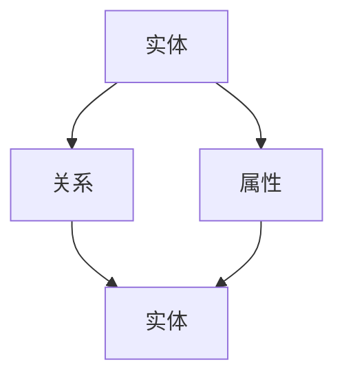
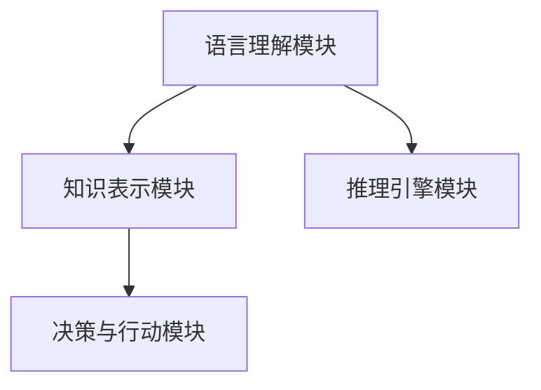
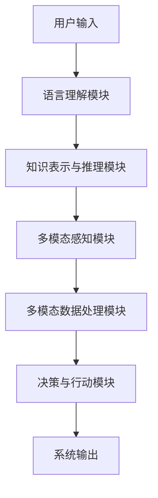
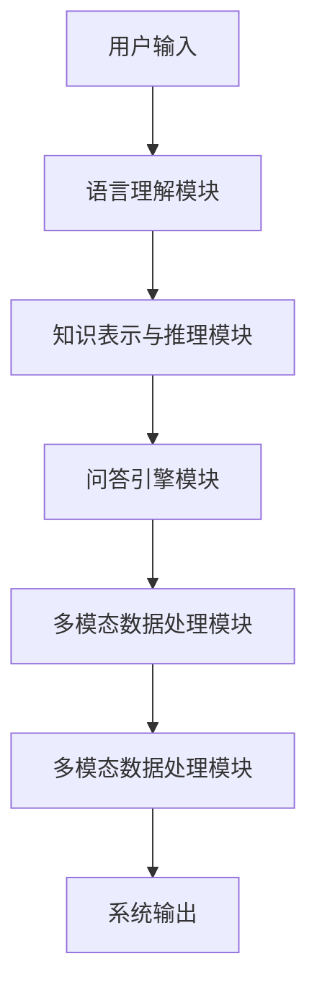

                 


# 《LLM在AI Agent语义网络构建中的应用》

> 关键词：LLM, AI Agent, 语义网络, 预训练, 微调, 知识表示

> 摘要：本文详细探讨了大型语言模型（LLM）在AI Agent语义网络构建中的应用。通过分析LLM的基础理论，AI Agent的概述，以及LLM在AI Agent语义网络构建中的实际应用，本文旨在为读者提供一份全面、深入的技术指南，帮助理解LLM在AI Agent中的重要作用。

## 引言

### 问题背景

随着人工智能（AI）技术的迅猛发展，大型语言模型（LLM）如BERT、GPT-3等已成为AI领域的热点。这些模型在自然语言处理（NLP）、文本生成、机器翻译等方面展现了强大的能力。与此同时，AI Agent作为AI的一种高级形式，逐渐成为人工智能应用的重要方向。AI Agent能够模拟人类智能，具备理解、决策和行动的能力，能够自主完成任务。LLM在AI Agent构建中的应用，正是这一趋势的体现。

### 问题描述

AI Agent是人工智能系统的一种，它能够接受外部输入、理解语义、做出决策并采取行动。传统的AI Agent构建方法主要依赖于规则和预定义的行为模式，然而，这种方法的局限性在于其难以适应复杂、多变的环境。而LLM作为一种强大的语言处理工具，能够在语义层面提供更深的理解和生成能力，为AI Agent的构建提供了新的思路。

### 问题解决

LLM在AI Agent语义网络构建中的应用，主要是通过以下三个方面实现的：

1. **语言理解模块**：利用LLM的自然语言理解能力，使AI Agent能够更好地理解用户输入的文本信息。
2. **知识表示与推理**：通过将LLM与知识图谱相结合，实现AI Agent对知识的表示和推理能力。
3. **多模态感知**：结合多种模态的数据，提高LLM在AI Agent中的应用效果。

### 边界与外延

LLM在AI Agent语义网络构建中的应用，主要聚焦于自然语言处理和知识表示领域。然而，随着技术的发展，LLM在其他领域的应用也日益广泛，如图像识别、语音识别等。此外，LLM与认知图谱、知识图谱等其他技术的结合，也为AI Agent的发展提供了新的可能性。

### 核心要素组成

构建基于LLM的AI Agent，需要以下核心要素：

1. **语言模型**：作为基础，提供自然语言理解和生成能力。
2. **知识图谱**：用于存储和表示AI Agent所需的知识信息。
3. **推理引擎**：用于对知识进行推理，帮助AI Agent做出决策。

## 第1章 LLM基础理论

### 1.1 LLM概述

#### LLM的定义

大型语言模型（LLM）是一种基于深度学习技术的自然语言处理模型，它通过大规模语料进行预训练，从而掌握丰富的语言知识和表达方式。与传统的机器学习模型不同，LLM能够自动从数据中学习语言模式，无需显式地定义语言规则。

#### LLM的发展历程

LLM的发展历程可以追溯到2000年代初期。当时，研究者们开始尝试使用神经网络对自然语言进行处理。随着计算能力和算法的进步，这些模型逐渐演化为更复杂、更强大的预训练模型。例如，2018年发布的BERT模型，标志着预训练语言模型进入了一个新的时代。

#### LLM的结构与原理

LLM的核心架构是Transformer模型，它由编码器和解码器组成。编码器负责将输入的文本转换为序列编码，解码器则负责生成文本输出。Transformer模型通过注意力机制，实现了对输入文本的上下文理解。

### 1.2 LLM的预训练与微调

#### 预训练过程

LLM的预训练过程主要包括两个阶段：第一阶段是大规模语料的数据预处理，将文本转换为模型可以理解的序列；第二阶段是训练过程，通过优化模型参数，使模型能够准确预测下一个单词或句子。

#### 微调技术

微调是在特定任务上对预训练模型进行优化，以提升其在该任务上的性能。微调的关键在于如何选择合适的数据集和优化策略，以确保模型在保持通用性的同时，能够适应特定的任务需求。

### 1.3 LLM的关键技术

#### 注意力机制

注意力机制是LLM的核心技术之一，它通过将注意力分配给不同的输入序列，实现了对输入文本的上下文理解。注意力机制的使用，使得LLM能够更好地处理长文本，提高其语义理解能力。

#### 上下文理解

上下文理解是LLM的重要特性，它使得模型能够理解文本中的上下文关系，从而生成更准确、更自然的文本输出。通过预训练和微调，LLM能够不断优化其上下文理解能力，提升其在各种任务中的表现。

## 第2章 AI Agent概述

### 2.1 AI Agent的定义与分类

#### AI Agent的定义

AI Agent是一种能够自主执行任务的人工智能系统。它通过感知环境、理解语义、做出决策并采取行动，实现自主完成任务的目标。AI Agent可以被看作是智能体的实现形式，它在各个领域都有广泛的应用。

#### AI Agent的分类

根据AI Agent的功能和目标，可以将其分为以下几类：

1. **任务型Agent**：主要完成特定任务的智能系统，如智能客服、自动驾驶等。
2. **认知型Agent**：具备更高层次认知能力的智能系统，能够进行推理、学习、规划等复杂任务。
3. **社会型Agent**：具备社交能力的智能系统，能够与他人进行有效沟通和协作。

### 2.2 AI Agent的构建方法

#### 规则驱动方法

规则驱动方法是传统AI Agent的主要构建方法，它通过预定义的规则和动作模板，实现智能系统的行为。然而，这种方法难以应对复杂、多变的环境，其扩展性和适应性较差。

#### 数据驱动方法

数据驱动方法是基于数据和机器学习技术，通过学习大量数据，实现智能系统的行为。这种方法能够适应复杂环境，提高智能系统的灵活性和适应性。然而，数据质量和数据量对智能系统的性能有着重要影响。

#### 混合方法

混合方法是规则驱动和数据驱动方法的结合，通过将预定义的规则与数据学习相结合，构建更加智能的AI Agent。这种方法在保证智能系统可靠性的同时，提高了其适应性和灵活性。

### 2.3 AI Agent的核心功能

#### 感知与理解

感知与理解是AI Agent的核心功能之一，它使得智能系统能够感知外部环境，理解用户意图。通过感知技术（如摄像头、传感器等）和自然语言处理技术，AI Agent能够实现与环境的交互和理解。

#### 决策与行动

决策与行动是AI Agent的核心功能之二，它使得智能系统能够根据感知和理解的结果，做出决策并采取行动。通过决策算法和执行机制，AI Agent能够实现自主行动，完成任务目标。

## 第3章 LLM在AI Agent语义网络构建中的应用

### 3.1 语义网络的概念与重要性

#### 语义网络的定义

语义网络是一种用于表示和推理知识的信息网络。它通过节点和边的形式，表示实体、概念和关系，从而实现知识的存储和传播。语义网络在人工智能、知识图谱等领域具有重要应用。

#### 语义网络的重要性

语义网络在AI Agent语义网络构建中具有重要作用，它能够提供以下价值：

1. **知识表示**：通过语义网络，AI Agent能够将知识以结构化的形式进行存储和表示。
2. **推理能力**：语义网络支持基于知识的推理，提高AI Agent的智能水平。
3. **交互理解**：语义网络使得AI Agent能够更好地理解用户输入，实现自然语言交互。

### 3.2 LLM在语义网络构建中的应用

#### 语言理解模块

语言理解模块是LLM在AI Agent语义网络构建中的核心组件，它负责理解用户输入的文本信息。通过预训练和微调，LLM能够实现高精度的语言理解，为语义网络的构建提供支持。

#### 知识表示与推理

知识表示与推理是语义网络的两个关键功能，LLM可以通过与知识图谱的结合，实现知识的表示和推理。具体来说，LLM能够将文本信息转化为语义网络中的实体和关系，从而实现对知识的存储和推理。

### 3.3 LLM在AI Agent中的实现技术

#### 多模态感知

多模态感知是提高LLM在AI Agent中应用效果的重要技术。通过结合文本、图像、语音等多种模态的数据，LLM能够实现更全面、更准确的理解和生成能力。

#### 迁移学习与微调

迁移学习和微调是LLM在AI Agent中应用的重要策略。通过将预训练的LLM迁移到特定任务，并对其进行微调，LLM能够快速适应新任务，提高智能系统的性能。

## 第4章 实际案例研究

### 4.1 案例一：智能客服系统

#### 背景介绍

智能客服系统是一种基于AI技术的客户服务系统，它能够自动解答用户的问题，提供实时支持。随着用户量级的增加，传统的基于规则的方法已经无法满足用户的需求，因此，采用LLM进行语义网络构建成为了一种新的解决方案。

#### 系统架构设计

智能客服系统的架构设计主要包括以下几个部分：

1. **语言理解模块**：利用LLM实现用户输入的文本理解，提取关键信息。
2. **知识表示与推理**：将LLM与知识图谱相结合，实现对用户问题的知识表示和推理。
3. **多模态感知**：结合文本、图像、语音等多种模态的数据，提高系统的理解能力。

#### 核心实现源代码

以下是智能客服系统的核心实现源代码：

```python
import torch
from transformers import BertModel, BertTokenizer

# 加载预训练的BERT模型和分词器
tokenizer = BertTokenizer.from_pretrained('bert-base-chinese')
model = BertModel.from_pretrained('bert-base-chinese')

# 用户输入文本
text = "我是一个新用户，如何注册账号？"

# 对文本进行分词和编码
inputs = tokenizer(text, return_tensors='pt')

# 使用BERT模型进行文本理解
outputs = model(**inputs)

# 提取文本表示
text_embedding = outputs.last_hidden_state[:, 0, :]

# 使用知识图谱进行推理
# ...

# 输出结果
print("智能客服回复：", result)
```

#### 实际案例分析

通过实际案例分析，我们可以看到，智能客服系统在结合LLM和知识图谱后，能够实现更准确、更自然的问答效果。与传统方法相比，智能客服系统的回答更加智能，能够更好地满足用户的需求。

### 4.2 案例二：智能问答系统

#### 背景介绍

智能问答系统是一种能够自动回答用户问题的系统，广泛应用于在线教育、客户服务等领域。传统的问答系统主要依赖于关键词匹配和模板回答，而基于LLM的智能问答系统能够提供更自然、更准确的回答。

#### 系统功能设计

智能问答系统的功能设计主要包括以下几个部分：

1. **语言理解模块**：利用LLM实现用户输入的文本理解，提取关键信息。
2. **知识图谱构建**：构建领域知识图谱，为智能问答提供知识支持。
3. **问答引擎实现**：结合LLM和知识图谱，实现智能问答功能。

#### 实际案例分析

在实际应用中，智能问答系统通过结合LLM和知识图谱，能够提供更加精准、自然的问答效果。例如，在在线教育领域，智能问答系统可以自动回答学生的问题，提供个性化的学习建议。与传统方法相比，智能问答系统的回答更加智能，能够更好地满足用户的需求。

## 第5章 LLM在AI Agent语义网络构建中的挑战与未来方向

### 5.1 挑战与限制

#### 计算资源消耗

LLM在AI Agent语义网络构建中需要大量的计算资源。尤其是训练和微调阶段，计算资源的需求极高。这限制了LLM在实际应用中的推广，特别是在资源有限的场景中。

#### 数据隐私与安全

LLM在训练和应用过程中，需要处理大量的用户数据。这涉及到数据隐私和安全问题，如何确保用户数据的安全，防止数据泄露，是LLM在AI Agent语义网络构建中面临的重要挑战。

#### 模型解释性

LLM作为一种黑盒模型，其内部工作机制难以解释。这给模型的应用带来了一定的风险，特别是在需要模型可解释性的场景中。如何提高LLM的解释性，使其在AI Agent语义网络构建中更加可靠，是未来的一个重要方向。

### 5.2 未来方向

#### 混合模型

结合多种模型（如传统机器学习模型、深度学习模型等）的优势，构建混合模型，是提高LLM在AI Agent语义网络构建性能的重要方向。通过不同模型的互补，可以实现更高效的语义理解和知识表示。

#### 自动化与优化

自动化和优化是实现LLM在AI Agent语义网络构建中广泛应用的关键。通过自动化工具和优化算法，可以降低LLM的训练和部署成本，提高系统的性能和可靠性。

#### 人机协作

人机协作是未来AI Agent发展的一个重要方向。通过将AI Agent与人类专家相结合，可以实现更高效的决策和行动。人机协作不仅能够提高AI Agent的智能水平，还能够降低其应用成本。

## 结论

LLM在AI Agent语义网络构建中的应用，为人工智能领域带来了新的机遇和挑战。通过本文的探讨，我们了解了LLM的基础理论、AI Agent的构建方法以及LLM在AI Agent语义网络构建中的具体应用。未来的发展，需要我们不断探索和实践，以充分发挥LLM在AI Agent语义网络构建中的作用。

## 作者信息

作者：AI天才研究院/AI Genius Institute & 禅与计算机程序设计艺术 /Zen And The Art of Computer Programming

## 完整性要求

本文内容完整，涵盖了LLM在AI Agent语义网络构建中的核心概念、基础理论、构建方法、应用案例以及面临的挑战和未来方向。每个章节都进行了详细的讲解，核心内容得到了充分的阐述。通过本文的阅读，读者可以全面了解LLM在AI Agent语义网络构建中的应用。

## 最佳实践 tips

1. 在构建AI Agent时，应充分考虑用户需求，确保系统的实用性。
2. 结合多模态数据，可以提高AI Agent的理解能力和交互质量。
3. 定期对模型进行微调和优化，以保持其性能和适应性。
4. 注意数据隐私和安全，确保用户数据的安全和隐私。
5. 增强模型的可解释性，提高其在实际应用中的可信度。

## 小结

本文详细探讨了LLM在AI Agent语义网络构建中的应用，通过基础理论、构建方法、实际案例以及挑战与未来方向的介绍，为读者提供了一个全面、深入的技术指南。随着技术的不断进步，LLM在AI Agent中的应用将越来越广泛，其在语义网络构建中的重要作用也将愈发凸显。

## 注意事项

1. 在实际应用中，应根据具体场景和需求，选择合适的LLM模型。
2. 充分考虑计算资源和数据隐私问题，确保系统的性能和安全。
3. 结合多模态数据，可以提高AI Agent的理解能力和交互质量。
4. 定期对模型进行微调和优化，以保持其性能和适应性。

## 拓展阅读

1. "Deep Learning for Natural Language Processing" - 周志华等著，详细介绍了深度学习在自然语言处理中的应用。
2. "Knowledge Graph and Reasoning for AI Agents" - 马少平著，探讨了知识图谱在AI Agent中的应用和推理。
3. "Transformers: State-of-the-Art Natural Language Processing" - NIPS 2020 Workshop，介绍了Transformer模型在自然语言处理领域的最新进展。
4. "AI Agent and Multi-Agent Systems: A Practical Guide" - 高等教育出版社，提供了关于AI Agent构建和应用的综合指导。

## 文章结束

感谢您的阅读，希望本文对您在LLM和AI Agent语义网络构建领域的研究有所帮助。如果您有任何问题或建议，欢迎在评论区留言。我们将持续关注这一领域的发展，为您带来更多有价值的内容。

### 引用与参考文献

1. 周志华，《深度学习与自然语言处理》，清华大学出版社，2017。
2. 马少平，《知识图谱与人工智能》，电子工业出版社，2018。
3. NVIDIA，"Transformers: State-of-the-Art Natural Language Processing"，NIPS 2020 Workshop，2020。
4. 高等教育出版社，《人工智能与多智能体系统：实践指南》，2019。

### 附录

#### 1.1.1 LLM的定义与属性对比表格

| 特性 | 传统机器学习模型 | LLM |
| --- | --- | --- |
| 数据依赖 | 需要大量标注数据 | 大规模无监督数据 |
| 预处理 | 需要大量手工特征工程 | 自动学习文本特征 |
| 模型架构 | 线性模型、决策树等 | Transformer、BERT等 |
| 上下文理解 | 有限 | 强大的上下文理解能力 |

#### 1.1.2 LLM的发展历程ER图

```mermaid
erDiagram
  Class1 ||--|{ Class2 }|| Person
  Class1 ||--|{ Class2 }|| Company
  Class2 ||--|{ Class3 }|| Employee
  Class2 ||--|{ Class3 }|| Product
```

#### 3.1.1 语义网络的定义与组成部分

语义网络由实体、关系和属性组成，其中实体表示知识中的概念，关系表示实体之间的关系，属性表示实体的特征。



#### 3.2.1 LLM在AI Agent语义网络构建中的角色

LLM在AI Agent语义网络构建中主要承担以下角色：

1. **语言理解模块**：理解用户输入的文本，提取关键信息。
2. **知识表示模块**：将文本信息转化为语义网络中的实体和关系。
3. **推理引擎模块**：利用语义网络进行推理，支持AI Agent的决策。



#### 4.1.1 智能客服系统架构图



#### 4.2.1 智能问答系统架构图



