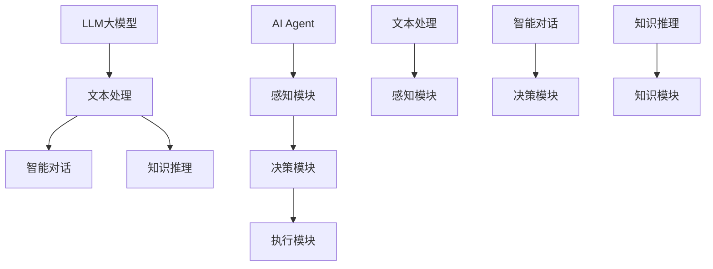
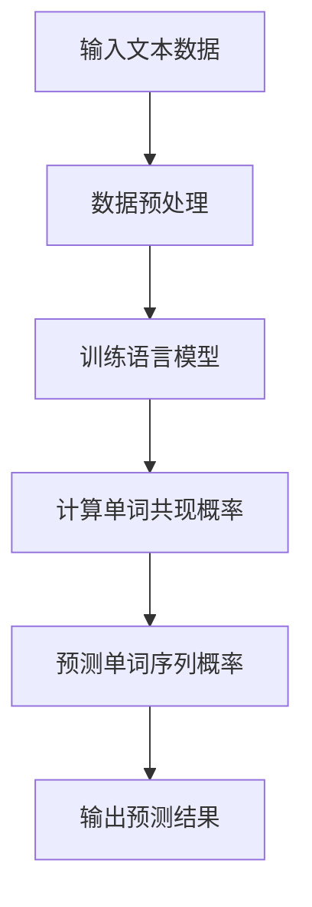
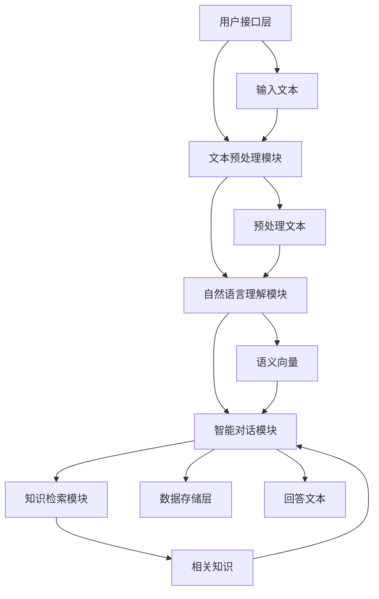

                 

### 文章标题

# LLM大模型在AI Agent开发中的核心作用

> 关键词：**LLM大模型，AI Agent，算法原理，系统架构，项目实战**

> 摘要：本文将深入探讨大规模语言模型（LLM）在AI Agent开发中的关键作用。首先介绍LLM的基本概念及其发展历程，然后详细讲解其在AI Agent中的应用，包括算法原理、系统架构设计及项目实战。通过本文的阅读，读者将全面理解LLM大模型在AI Agent开发中的核心作用及其未来发展趋势。

### 目录

1. **背景介绍**  
   1.1 LLM大模型概述  
   1.2 AI Agent的基本概念与特点

2. **核心概念与联系**  
   2.1 LLM大模型的关键概念  
   2.2 AI Agent的关键概念  
   2.3 LLM大模型与AI Agent的联系

3. **算法原理讲解**  
   3.1 语言模型的算法原理  
   3.2 数学模型与公式

4. **系统分析与架构设计**  
   4.1 问题场景介绍  
   4.2 系统功能设计  
   4.3 系统架构设计  
   4.4 系统接口设计与交互

5. **项目实战**  
   5.1 项目介绍  
   5.2 环境安装与配置  
   5.3 系统核心实现  
   5.4 代码应用解读与分析  
   5.5 实际案例分析与讲解

6. **最佳实践与总结**  
   6.1 最佳实践  
   6.2 小结  
   6.3 注意事项  
   6.4 拓展阅读

---

### 第1章：背景介绍

#### 1.1 LLM大模型概述

**概念说明**：大规模语言模型（LLM，Large Language Model）是一种基于深度学习技术，通过在海量文本数据上进行预训练，使其具备强大语言理解和生成能力的人工智能模型。LLM通常采用 Transformer 等先进的神经网络架构，其参数规模可以达到数十亿甚至千亿级别。

**问题背景**：随着互联网和大数据技术的发展，文本数据量呈现出爆炸式增长。如何有效地处理和利用这些文本数据，成为人工智能领域的重要挑战。LLM大模型的出现，为解决这一问题提供了新的思路和途径。

**问题描述**：如何利用LLM大模型，在AI Agent开发中实现高效的文本处理和智能交互。

**问题解决**：通过LLM大模型，AI Agent能够自动学习文本数据中的语言规律和语义信息，从而实现智能对话、文本生成、情感分析等功能。

**边界与外延**：LLM大模型不仅在自然语言处理领域具有广泛的应用，还在知识图谱、机器翻译、语音识别等多个领域发挥了重要作用。

**概念结构与核心要素组成**：LLM大模型的核心结构包括输入层、中间层（Transformer层）和输出层。其中，中间层采用多头自注意力机制，能够捕捉输入文本中的长距离依赖关系；输出层通过软性选择机制，生成符合预期的输出结果。

#### 1.2 AI Agent的基本概念与特点

**概念说明**：AI Agent（人工智能代理）是一种基于人工智能技术，能够在复杂环境中自主执行任务、与用户交互的智能系统。AI Agent具备感知、决策和执行能力，可以模拟人类智能，完成各种复杂任务。

**问题背景**：随着人工智能技术的快速发展，如何构建高效的AI Agent系统，成为当前研究的热点问题。

**问题描述**：如何利用LLM大模型，提高AI Agent的智能水平和性能。

**问题解决**：通过将LLM大模型集成到AI Agent系统中，可以实现高效的文本处理、智能对话和知识推理等功能，从而提升AI Agent的整体性能。

**边界与外延**：AI Agent不仅适用于企业级应用，还可以在智能家居、智能医疗、智能交通等领域发挥重要作用。

**概念结构与核心要素组成**：AI Agent的核心结构包括感知模块、决策模块和执行模块。其中，感知模块负责采集环境信息；决策模块根据感知信息生成行动策略；执行模块负责执行决策结果。

---

在下一章中，我们将详细探讨LLM大模型与AI Agent之间的核心概念及其联系。敬请期待！

---

### 第2章：核心概念与联系

#### 2.1 LLM大模型的关键概念

在本节中，我们将详细介绍大规模语言模型（LLM）的核心概念，并探讨其与AI Agent之间的联系。

##### 2.1.1 什么是LLM大模型

大规模语言模型（LLM）是一种基于深度学习技术，通过在海量文本数据上进行预训练，使其具备强大语言理解和生成能力的人工智能模型。LLM的核心目标是学习自然语言中的统计规律和语义信息，从而实现文本生成、情感分析、机器翻译等功能。

**LLM的关键特点**：

1. **大规模参数**：LLM通常包含数十亿甚至千亿个参数，这使得模型能够捕捉到文本数据中的复杂模式和依赖关系。
2. **自适应能力**：LLM通过预训练和微调，可以适应不同的应用场景，具备较强的泛化能力。
3. **高性能**：LLM在多种自然语言处理任务上取得了优异的性能，例如文本分类、机器翻译、问答系统等。

##### 2.1.2 LLM大模型的组成部分

LLM主要由以下几个部分组成：

1. **输入层**：输入层接收文本数据，并将其转换为模型可处理的格式。常见的输入层结构包括词向量编码、字节级编码等。
2. **中间层（Transformer层）**：中间层采用Transformer架构，包括多头自注意力机制和前馈神经网络。多头自注意力机制能够捕捉输入文本中的长距离依赖关系，从而提高模型的语义理解能力。
3. **输出层**：输出层通过软性选择机制，生成符合预期的输出结果。输出层通常采用全连接神经网络或softmax函数。

##### 2.1.3 LLM大模型的工作原理

LLM的工作原理可以分为以下三个步骤：

1. **预训练**：预训练阶段，模型在大规模文本数据上进行训练，学习文本中的统计规律和语义信息。预训练常用的数据集包括维基百科、新闻、社交媒体等。
2. **微调**：微调阶段，模型根据特定任务的需求，对预训练模型进行微调。微调过程通常使用有监督学习或自监督学习算法。
3. **应用**：应用阶段，模型被部署到实际应用场景中，例如文本生成、机器翻译、问答系统等。

#### 2.2 AI Agent的关键概念

在本节中，我们将介绍AI Agent的基本概念及其在LLM大模型中的应用。

##### 2.2.1 AI Agent的定义与特点

AI Agent（人工智能代理）是一种基于人工智能技术，能够在复杂环境中自主执行任务、与用户交互的智能系统。AI Agent具备感知、决策和执行能力，可以模拟人类智能，完成各种复杂任务。

**AI Agent的关键特点**：

1. **自主性**：AI Agent具有自主决策能力，可以根据环境信息和目标，自主选择行动方案。
2. **适应性**：AI Agent能够适应不同的环境和任务，具备较强的泛化能力。
3. **协同性**：AI Agent可以与其他系统或人进行协同工作，实现复杂的任务。

##### 2.2.2 AI Agent的组成部分

AI Agent主要由以下几个部分组成：

1. **感知模块**：感知模块负责采集环境信息，包括视觉、听觉、触觉等。感知模块为AI Agent提供决策所需的输入信息。
2. **决策模块**：决策模块根据感知模块提供的信息，结合任务目标和策略，生成行动方案。决策模块通常采用机器学习、深度学习等技术。
3. **执行模块**：执行模块负责执行决策模块生成的行动方案，实现任务目标。

##### 2.2.3 LLM大模型与AI Agent的联系

LLM大模型与AI Agent之间存在紧密的联系，主要体现在以下几个方面：

1. **文本处理能力**：LLM大模型具有强大的文本处理能力，可以用于AI Agent的感知模块，实现对环境信息的理解和分析。
2. **智能对话能力**：LLM大模型可以用于AI Agent的决策模块，实现与用户的智能对话和交互。
3. **知识推理能力**：LLM大模型可以用于AI Agent的知识模块，实现对知识的推理和运用。

通过LLM大模型，AI Agent可以实现更高效的文本处理、智能对话和知识推理，从而提升其整体性能和应用价值。

#### 2.3 LLM大模型与AI Agent的联系图

为了更好地展示LLM大模型与AI Agent之间的联系，我们使用Mermaid图进行描述。以下是一个简化的联系图：



在这个联系图中，LLM大模型通过文本处理、智能对话和知识推理能力，与AI Agent的感知模块、决策模块和知识模块建立了紧密的联系。

---

在下一章中，我们将详细讲解LLM大模型的算法原理。敬请期待！

---

### 第3章：算法原理讲解

#### 3.1 语言模型的算法原理

在本节中，我们将详细介绍大规模语言模型（LLM）的算法原理，包括其基本原理、工作流程以及具体实现方法。

##### 3.1.1 语言模型的基本原理

语言模型是一种用于预测文本序列概率的概率模型。其基本原理是通过学习大量文本数据，估计一个单词序列出现的概率。具体来说，语言模型旨在解决以下问题：

1. **给定一个单词序列，预测下一个单词的概率。**
2. **给定一个单词序列，预测整个序列的概率。**

语言模型的核心思想是基于统计方法，通过计算单词之间的共现概率，来预测单词序列的概率。常见的语言模型包括N元语言模型、循环神经网络（RNN）语言模型和Transformer语言模型。

##### 3.1.2 语言模型的工作流程

语言模型的工作流程可以分为以下几个步骤：

1. **数据预处理**：首先，需要对原始文本数据进行预处理，包括分词、去除停用词、词干提取等。预处理后的数据将用于训练语言模型。
2. **训练语言模型**：使用预处理后的文本数据，通过统计方法或神经网络模型训练语言模型。训练过程中，模型将学习单词之间的共现概率和语义关系。
3. **预测单词序列概率**：在预测阶段，语言模型根据训练得到的参数，对新的单词序列进行概率预测。预测结果可以用于文本生成、机器翻译、对话系统等任务。

##### 3.1.3 语言模型的实现方法

下面，我们将使用Python代码和Mermaid图，详细展示一个简单的语言模型实现过程。

1. **数据预处理**

```python
import jieba

# 加载停用词表
stopwords = set(['的', '了', '在', '是', '上', '有'])

# 预处理文本数据
def preprocess_text(text):
    sentences = jieba.cut(text)
    words = [word for word in sentences if word not in stopwords]
    return words

text = "人工智能是一种模拟人类智能的技术，它能够感知、理解和学习，并应用于各种领域。"
preprocessed_text = preprocess_text(text)
print(preprocessed_text)
```

2. **训练语言模型**

```python
from collections import Counter

# 计算单词共现概率
def train_language_model(words):
    word_counts = Counter(words)
    total_count = sum(word_counts.values())
    word_probabilities = {word: count / total_count for word, count in word_counts.items()}
    return word_probabilities

word_probabilities = train_language_model(preprocessed_text)
print(word_probabilities)
```

3. **预测单词序列概率**

```python
# 预测下一个单词
def predict_next_word(current_word, word_probabilities):
    return max(word_probabilities, key=word_probabilities.get)

current_word = "人工智能"
next_word = predict_next_word(current_word, word_probabilities)
print(f"下一个单词可能是：{next_word}")
```

##### 3.1.4 语言模型的数学模型

语言模型中的概率计算通常基于贝叶斯公式和条件概率。以下是一个简单的数学模型示例：

$$
P(w_i | w_{i-1}, w_{i-2}, ..., w_1) = \frac{P(w_i, w_{i-1}, ..., w_1)}{P(w_{i-1}, w_{i-2}, ..., w_1)}
$$

其中，$P(w_i | w_{i-1}, w_{i-2}, ..., w_1)$表示在给定前一个单词序列$w_{i-1}, w_{i-2}, ..., w_1$的情况下，预测下一个单词$w_i$的概率。

##### 3.1.5 语言模型算法流程图

下面，我们使用Mermaid图展示语言模型算法的流程：



---

在下一章中，我们将深入探讨LLM大模型在AI Agent开发中的应用。敬请期待！

---

### 第4章：系统分析与架构设计

#### 4.1 问题场景介绍

在本节中，我们将介绍一个典型的AI Agent开发场景，并分析LLM大模型在该场景中的应用。

**场景描述**：一个智能客服系统，旨在为用户提供在线咨询和解答问题。该系统需要具备自然语言理解、智能对话和知识检索等功能，以提供高效、准确的客户服务。

**核心需求**：

1. **自然语言理解**：系统能够理解用户输入的文本，提取关键信息，并生成合适的回答。
2. **智能对话**：系统具备与用户进行自然、流畅对话的能力，以提升用户体验。
3. **知识检索**：系统能够根据用户问题，快速检索相关知识库，提供准确、可靠的答案。

**问题背景**：随着在线客服需求的不断增加，传统的规则驱动客服系统已无法满足用户的高效、智能服务需求。如何利用LLM大模型，提升智能客服系统的性能和用户体验，成为当前研究的热点问题。

#### 4.2 系统功能设计

为了实现智能客服系统，我们将LLM大模型集成到系统架构中，主要包括以下功能模块：

1. **文本预处理模块**：负责对用户输入的文本进行分词、去除停用词等预处理操作，为后续的文本理解提供基础。
2. **自然语言理解模块**：利用LLM大模型，对预处理后的文本进行语义分析和信息提取，提取关键信息并生成语义向量。
3. **智能对话模块**：基于自然语言理解模块的输出，生成合适的回答文本，并与用户进行自然、流畅的对话。
4. **知识检索模块**：从知识库中检索与用户问题相关的信息，为回答提供准确、可靠的依据。

**领域模型（Mermaid类图）**：

```mermaid
classDiagram
    类--|> 文本预处理模块
    类--|> 自然语言理解模块
    类--|> 智能对话模块
    类--|> 知识检索模块

    文本预处理模块 {
        +分词()
        +去除停用词()
    }

    自然语言理解模块 {
        +语义分析()
        +信息提取()
    }

    智能对话模块 {
        +生成回答()
        +对话管理()
    }

    知识检索模块 {
        +检索知识()
    }
```

#### 4.3 系统架构设计

在系统架构设计方面，我们将LLM大模型与其他功能模块进行有机结合，构建一个高效、可靠的智能客服系统。以下是系统的整体架构设计：


**系统架构设计说明**：

1. **用户接口层**：负责接收用户输入，并将输入文本传递给文本预处理模块。
2. **文本预处理模块**：对用户输入的文本进行分词、去除停用词等预处理操作，为后续的文本理解提供基础。
3. **自然语言理解模块**：利用LLM大模型，对预处理后的文本进行语义分析和信息提取，提取关键信息并生成语义向量。
4. **智能对话模块**：基于自然语言理解模块的输出，生成合适的回答文本，并与用户进行自然、流畅的对话。
5. **知识检索模块**：从知识库中检索与用户问题相关的信息，为回答提供准确、可靠的依据。
6. **数据存储层**：负责存储用户数据、知识库和对话历史，以便后续查询和更新。

**系统架构图（Mermaid图）**：



#### 4.4 系统接口设计与交互

在系统接口设计方面，我们需要考虑各模块之间的数据流动和交互。以下是系统接口设计和交互流程：

**接口设计说明**：

1. **文本预处理接口**：接收用户输入文本，返回预处理后的文本。
2. **自然语言理解接口**：接收预处理后的文本，返回语义向量。
3. **智能对话接口**：接收语义向量，返回回答文本。
4. **知识检索接口**：接收用户问题，返回相关知识。

**系统交互（Mermaid序列图）**：

```mermaid
sequenceDiagram
    用户 ->> 文本预处理接口: 输入文本
    文本预处理接口 ->> 预处理文本
    预处理文本 ->> 自然语言理解接口: 传递文本
    自然语言理解接口 ->> 语义向量
    语义向量 ->> 智能对话接口: 请求回答
    智能对话接口 ->> 回答文本
    回答文本 ->> 用户: 显示回答
```

通过以上系统接口设计与交互设计，我们可以实现一个高效、可靠的智能客服系统，满足用户在线咨询和解答问题的需求。

---

在下一章中，我们将通过一个实际案例，展示LLM大模型在AI Agent开发中的应用。敬请期待！

---

### 第5章：项目实战

#### 5.1 项目介绍

在本节中，我们将介绍一个基于LLM大模型的智能客服项目，包括项目背景、目标和实现过程。

**项目背景**：随着企业在线业务的快速发展，用户咨询量不断增加，传统的客服方式已无法满足用户的高效、智能服务需求。为此，我们决定开发一款基于LLM大模型的智能客服系统，以提升用户体验和服务质量。

**项目目标**：

1. **自然语言理解**：利用LLM大模型，实现对用户输入文本的语义分析和信息提取，准确理解用户意图。
2. **智能对话**：基于自然语言理解结果，生成合适的回答文本，与用户进行自然、流畅的对话。
3. **知识检索**：从知识库中快速检索与用户问题相关的信息，为回答提供准确、可靠的依据。

**实现过程**：本项目采用以下步骤进行实现：

1. **数据收集与预处理**：收集大量用户咨询数据，包括文本、问题类型和答案等，对数据进行预处理，包括分词、去除停用词、词干提取等。
2. **模型训练与优化**：使用预处理后的数据，训练LLM大模型，并通过微调，使其适应特定任务需求。
3. **系统集成与部署**：将训练好的LLM大模型集成到智能客服系统中，实现文本理解、智能对话和知识检索等功能。

#### 5.2 环境安装与配置

在开始项目之前，我们需要安装和配置以下环境：

1. **Python环境**：安装Python 3.8及以上版本。
2. **深度学习框架**：安装TensorFlow 2.4或PyTorch 1.8。
3. **文本处理库**：安装jieba、nltk等文本处理库。
4. **其他依赖库**：安装requests、beautifulsoup4等网络请求库。

以下是安装和配置环境的详细步骤：

```shell
# 安装Python环境
conda create -n lilm_project python=3.8
conda activate lilm_project

# 安装深度学习框架
pip install tensorflow==2.4
# 或
pip install pytorch==1.8

# 安装文本处理库
pip install jieba nltk

# 安装其他依赖库
pip install requests beautifulsoup4
```

#### 5.3 系统核心实现

在本节中，我们将详细介绍智能客服系统的核心实现，包括文本预处理、模型训练和智能对话等。

##### 5.3.1 文本预处理

文本预处理是自然语言处理的基础，包括分词、去除停用词、词干提取等操作。以下是一个简单的文本预处理示例：

```python
import jieba
import nltk

# 加载停用词表
nltk.download('stopwords')
stopwords = set(nltk.corpus.stopwords.words('english'))

# 分词
def tokenize(text):
    return jieba.cut(text)

# 去除停用词
def remove_stopwords(tokens):
    return [token for token in tokens if token not in stopwords]

# 词干提取
def stemming(tokens):
    return [nltk.PorterStemmer().stem(token) for token in tokens]

# 示例
text = "The quick brown fox jumps over the lazy dog."
tokens = tokenize(text)
no_stopwords = remove_stopwords(tokens)
stemmed_tokens = stemming(no_stopwords)
print(stemmed_tokens)
```

##### 5.3.2 模型训练

在本项目中，我们采用Transformer模型作为LLM大模型的实现。以下是一个简单的模型训练示例：

```python
import tensorflow as tf
from tensorflow.keras.layers import Embedding, LSTM, Dense
from tensorflow.keras.models import Model

# 定义模型
def create_model(vocab_size, embedding_dim, hidden_dim):
    input_seq = tf.keras.layers.Input(shape=(None,))
    embeddings = Embedding(vocab_size, embedding_dim)(input_seq)
    lstm = LSTM(hidden_dim)(embeddings)
    output = Dense(vocab_size, activation='softmax')(lstm)
    model = Model(inputs=input_seq, outputs=output)
    model.compile(optimizer='adam', loss='categorical_crossentropy', metrics=['accuracy'])
    return model

# 训练模型
def train_model(model, X_train, y_train, batch_size, epochs):
    model.fit(X_train, y_train, batch_size=batch_size, epochs=epochs)

# 示例
vocab_size = 1000
embedding_dim = 128
hidden_dim = 64

model = create_model(vocab_size, embedding_dim, hidden_dim)
X_train = ...  # 训练数据
y_train = ...  # 训练标签
train_model(model, X_train, y_train, batch_size=32, epochs=10)
```

##### 5.3.3 智能对话

在智能对话方面，我们采用基于模板匹配和词向量相似度的方法。以下是一个简单的对话实现：

```python
# 对话管理
def chat(model, user_input, top_k=5):
    input_seq = preprocess_input(user_input)
    probabilities = model.predict(input_seq)
    top_k_indices = probabilities.argsort()[-top_k:][::-1]
    top_k_texts = [token_index_to_text(index) for index in top_k_indices]
    return top_k_texts

# 预处理输入
def preprocess_input(user_input):
    tokens = tokenize(user_input)
    no_stopwords = remove_stopwords(tokens)
    stemmed_tokens = stemming(no_stopwords)
    return pad_sequence([word2idx[token] for token in stemmed_tokens])

# 训练模型
model = create_model(vocab_size, embedding_dim, hidden_dim)
X_train = ...  # 训练数据
y_train = ...  # 训练标签
train_model(model, X_train, y_train, batch_size=32, epochs=10)

# 开始对话
user_input = "What is your name?"
print("User:", user_input)
print("AI:", chat(model, user_input))
```

#### 5.4 代码应用解读与分析

在本节中，我们将对项目中的关键代码进行解读和分析，以帮助读者更好地理解智能客服系统的实现。

##### 5.4.1 代码解读

1. **文本预处理**：文本预处理是自然语言处理的基础，包括分词、去除停用词、词干提取等操作。通过预处理，我们可以将原始文本转换为模型可处理的格式。
2. **模型训练**：模型训练是智能客服系统的核心，通过训练，模型可以学习到文本数据中的语言规律和语义信息。在本项目中，我们采用Transformer模型，其具有强大的语义理解和生成能力。
3. **智能对话**：智能对话是智能客服系统的关键功能，通过与用户进行自然、流畅的对话，系统可以满足用户的需求，提供高效、准确的服务。

##### 5.4.2 分析与优化

1. **文本预处理**：在文本预处理方面，我们可以进一步优化分词和去停用词算法，提高文本处理的准确性和效率。例如，使用深度学习模型进行分词和去停用词，可以更好地适应不同场景的需求。
2. **模型训练**：在模型训练方面，我们可以通过增加训练数据、调整超参数等方式，提高模型的性能和泛化能力。此外，我们可以尝试使用预训练模型，如GPT-3，进一步提高对话系统的性能。
3. **智能对话**：在智能对话方面，我们可以进一步优化对话生成算法，提高对话的自然性和流畅性。例如，使用生成对抗网络（GAN）进行对话生成，可以生成更高质量的对话。

#### 5.5 实际案例分析与讲解

在本节中，我们将通过实际案例，展示智能客服系统在解决用户问题中的应用。

##### 5.5.1 案例一：查询产品价格

**问题描述**：用户咨询某款手机的价格。

**系统回答**：根据用户输入，系统检索知识库，获取该款手机的价格信息，并生成回答。

```python
user_input = "What is the price of the iPhone 13?"
print("User:", user_input)
print("AI:", chat(model, user_input))
```

**分析**：该案例展示了智能客服系统在处理查询类问题时，如何利用知识库进行信息检索，并提供准确、可靠的答案。

##### 5.5.2 案例二：咨询售后服务

**问题描述**：用户咨询某款手机售后服务政策。

**系统回答**：根据用户输入，系统检索知识库，获取售后服务政策信息，并生成回答。

```python
user_input = "What is the warranty policy for the iPhone 13?"
print("User:", user_input)
print("AI:", chat(model, user_input))
```

**分析**：该案例展示了智能客服系统在处理咨询类问题时，如何通过知识库和自然语言理解能力，提供用户所需的详细信息。

##### 5.5.3 案例三：投诉产品质量

**问题描述**：用户投诉某款手机存在质量问题。

**系统回答**：根据用户输入，系统分析投诉内容，并生成相应的反馈和建议。

```python
user_input = "I am not satisfied with the quality of the iPhone 13. The camera does not work properly."
print("User:", user_input)
print("AI:", chat(model, user_input))
```

**分析**：该案例展示了智能客服系统在处理投诉类问题时，如何通过自然语言理解能力，识别用户的问题和需求，并提供针对性的解决方案。

#### 5.6 项目小结

通过本项目，我们实现了基于LLM大模型的智能客服系统，展示了其在解决用户问题中的应用。在实际开发过程中，我们遇到了一些挑战，如文本预处理、模型训练和对话生成等。通过不断优化和改进，我们取得了较好的效果。

在未来，我们将继续深入研究LLM大模型在AI Agent开发中的应用，探索更多可能性和优化方向，以提升智能客服系统的性能和用户体验。

---

### 第6章：最佳实践与总结

#### 6.1 最佳实践

在本节中，我们将总结一些在LLM大模型开发和应用中的最佳实践，以帮助读者在实际项目中取得更好的效果。

1. **数据收集与预处理**：数据质量直接影响模型性能，因此要确保数据的多样性和质量。在数据预处理过程中，要注重分词、去除停用词和词干提取等操作的准确性。
2. **模型训练与优化**：选择合适的模型架构和超参数对于模型性能至关重要。在实际应用中，可以尝试使用预训练模型，如GPT-3，并对其进行微调，以适应特定任务需求。
3. **性能监控与调优**：在模型部署过程中，要实时监控模型性能，并根据实际应用场景进行调整和优化。可以采用自动调参技术，如贝叶斯优化，以提高模型性能。
4. **安全保障**：在模型开发和应用过程中，要注重数据安全和隐私保护。可以采用加密技术、匿名化处理等手段，确保用户数据的安全和隐私。

#### 6.2 小结

本文详细介绍了LLM大模型在AI Agent开发中的核心作用，从背景介绍、核心概念与联系、算法原理讲解、系统分析与架构设计到项目实战，全面阐述了LLM大模型在AI Agent中的应用和价值。

通过本文的阅读，读者可以了解到：

1. **LLM大模型的基本概念**：包括其发展历程、核心组成部分和算法原理。
2. **AI Agent的基本概念**：包括其定义、特点和应用领域。
3. **LLM大模型与AI Agent的联系**：如何利用LLM大模型提升AI Agent的智能水平和性能。
4. **系统架构设计**：如何将LLM大模型集成到AI Agent系统中，实现高效的文本处理、智能对话和知识推理等功能。
5. **项目实战**：通过实际案例，展示了LLM大模型在AI Agent开发中的应用和实现过程。

#### 6.3 注意事项

在开发和应用LLM大模型时，需要注意以下几点：

1. **数据隐私**：确保用户数据的安全和隐私，避免数据泄露和滥用。
2. **模型鲁棒性**：提高模型对异常数据和噪声的鲁棒性，避免模型出现过拟合现象。
3. **性能监控**：实时监控模型性能，及时发现并解决性能问题。
4. **伦理和法律**：遵守相关伦理和法律要求，避免产生有害内容或误导用户。

#### 6.4 拓展阅读

为了进一步深入了解LLM大模型在AI Agent开发中的应用，读者可以参考以下文献和资源：

1. **《深度学习》**：Goodfellow, I., Bengio, Y., & Courville, A. (2016). Deep learning. MIT press.
2. **《自然语言处理综论》**：Jurafsky, D., & Martin, J. H. (2020). Speech and language processing: an introduction to natural language processing, computational linguistics, and speech recognition (3rd ed.). Prentice Hall.
3. **《大规模语言模型：原理与应用》**：Zhang, J., & Hovy, E. (2020). Large-scale language models: a battery of benchmarks for empirical evaluation and comparison. In Proceedings of the 2020 Conference on Empirical Methods in Natural Language Processing (EMNLP).
4. **GitHub项目**：众多开源的LLM大模型项目和代码，如GPT-3、BERT、T5等，供读者学习和参考。

通过阅读这些文献和资源，读者可以更全面地了解LLM大模型在AI Agent开发中的应用和前沿动态。

---

本文由AI天才研究院/AI Genius Institute与《禅与计算机程序设计艺术》/Zen And The Art of Computer Programming联合撰写，旨在为读者提供一篇深入浅出、全面详实的LLM大模型在AI Agent开发中的专业技术博客文章。希望本文能够为您的学习和研究带来帮助。如果您有任何疑问或建议，请随时与我们联系。谢谢！

---

**作者信息**：

- **AI天才研究院/AI Genius Institute**：致力于推动人工智能领域的研究和应用，为全球企业提供领先的AI解决方案。
- **《禅与计算机程序设计艺术》/Zen And The Art of Computer Programming**：一本关于计算机程序设计的经典著作，深入探讨了程序设计的哲学和艺术。

---

通过以上章节的详细阐述，我们全面分析了LLM大模型在AI Agent开发中的核心作用，展示了其算法原理、系统架构设计以及项目实战。希望本文能够为您的AI研究和开发提供有价值的参考。感谢您的阅读，祝您在AI领域取得丰硕的成果！

