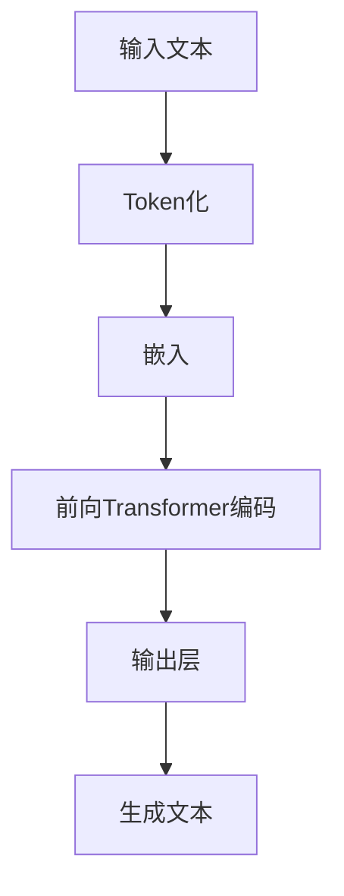
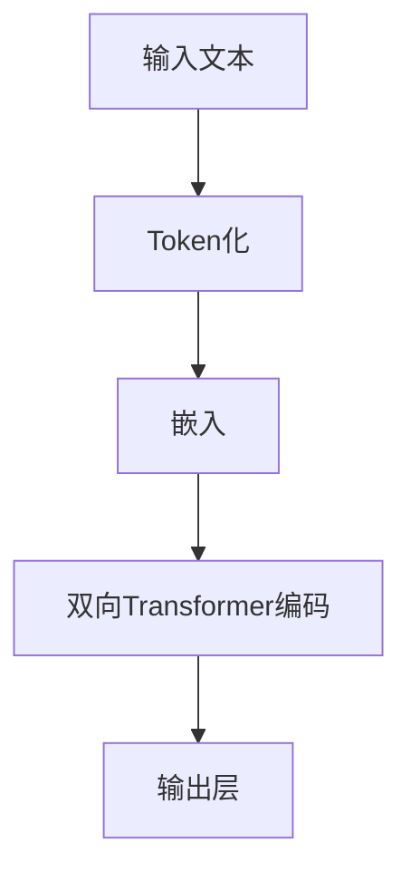

                 

# LLM大模型简介：GPT、BERT及其他主流模型

## 关键词

- LLM（大型语言模型）
- GPT（生成预训练模型）
- BERT（双向编码表示器）
- RoBERTa
- ALBERT
- DeBERTa
- 人工智能

## 摘要

本文将深入探讨大型语言模型（LLM）的发展历程、核心概念以及主流模型，包括GPT、BERT、RoBERTa、ALBERT和DeBERTa。通过对比分析，我们将理解这些模型的基本原理、架构特点和应用场景，旨在为读者提供一个全面而深入的认识。文章还将讨论大模型在实际应用中的挑战和未来发展，并对社会影响与伦理问题进行探讨。

## 目录大纲

### 第一部分：背景介绍

#### 第1章：问题背景

1.1 大模型的发展历程

1.2 大模型在AI领域的重要性

1.3 当前大模型的应用场景和挑战

#### 第2章：核心概念

2.1 大模型的定义

2.2 大模型的特性

2.3 大模型与传统模型对比

#### 第3章：大模型的联系

3.1 GPT与BERT的联系

3.2 其他主流模型间的联系

### 第二部分：核心原理

#### 第4章：GPT模型原理

4.1 GPT模型概述

4.2 GPT模型的mermaid流程图

4.3 GPT模型的数学模型

4.4 GPT模型的Python代码实现

#### 第5章：BERT模型原理

5.1 BERT模型概述

5.2 BERT模型的mermaid流程图

5.3 BERT模型的数学模型

5.4 BERT模型的Python代码实现

#### 第6章：其他主流模型原理

6.1 RoBERTa模型

6.2 ALBERT模型

6.3 DeBERTa模型

### 第三部分：应用实践

#### 第7章：GPT模型应用实践

7.1 环境安装

7.2 GPT模型在文本生成中的应用

7.3 GPT模型在机器翻译中的应用

7.4 GPT模型应用案例分析

#### 第8章：BERT模型应用实践

8.1 环境安装

8.2 BERT模型在问答系统中的应用

8.3 BERT模型在文本分类中的应用

8.4 BERT模型应用案例分析

#### 第9章：其他主流模型应用实践

9.1 RoBERTa模型应用实践

9.2 ALBERT模型应用实践

9.3 DeBERTa模型应用实践

### 第四部分：总结与展望

#### 第10章：总结

10.1 大模型的发展趋势

10.2 大模型在实际应用中的挑战

10.3 大模型在未来的发展方向

#### 第11章：展望

11.1 大模型在其他领域的应用

11.2 大模型对AI领域的影响

11.3 大模型的社会影响与伦理问题

## 第一部分：背景介绍

### 第1章：问题背景

#### 1.1 大模型的发展历程

大型语言模型（LLM）的发展历程可以追溯到20世纪80年代，当时研究人员开始探索如何利用统计方法和机器学习技术来处理自然语言。最早的尝试包括基于规则的方法和统计语言模型。随着计算能力的提升和数据量的增加，深度学习和神经网络逐渐成为自然语言处理（NLP）的主流技术。

2018年，谷歌发布了BERT模型，标志着大型语言模型的崛起。BERT的发布引发了学术界和工业界对大型语言模型的关注，并推动了相关技术的迅速发展。此后，GPT-3、T5、RoBERTa等一系列大型语言模型相继发布，不断刷新性能记录。

#### 1.2 大模型在AI领域的重要性

大型语言模型在AI领域具有重要地位，主要体现在以下几个方面：

1. **强大的语义理解能力**：大型语言模型通过对海量文本的预训练，能够理解复杂的语义关系和上下文信息，这使得它们在文本生成、机器翻译、问答系统等任务中表现出色。

2. **广泛的适用性**：由于语言模型具有通用性，它们可以应用于多种不同的NLP任务，无需对模型进行大量定制。

3. **推动AI技术的发展**：大型语言模型的成功激发了研究人员对AI其他领域的探索，如计算机视觉、语音识别等。

#### 1.3 当前大模型的应用场景和挑战

当前大型语言模型在多个应用场景中取得了显著成果，包括：

1. **文本生成**：如自动写作、故事创作、新闻报道生成等。
2. **机器翻译**：如实时翻译、多语言文本处理等。
3. **问答系统**：如智能客服、在线问答平台等。
4. **文本分类**：如情感分析、新闻分类等。

然而，大模型也面临一些挑战：

1. **计算资源消耗**：训练和部署大型语言模型需要巨大的计算资源和存储空间。
2. **数据隐私和安全性**：语言模型对训练数据的敏感性较高，如何保护用户隐私成为重要问题。
3. **伦理和社会影响**：大模型在生成有害内容或歧视性言论方面存在风险，需要制定相应的伦理准则和监管措施。

### 第2章：核心概念

#### 2.1 大模型的定义

大型语言模型（Large Language Model，简称LLM）是一种通过深度学习技术训练的神经网络模型，用于处理和理解自然语言。这些模型通常通过预训练大量的文本数据，学习语言的基本规律和语义信息，然后通过微调适应特定任务。

#### 2.2 大模型的特性

1. **强大的语义理解能力**：LLM能够理解复杂的语义关系和上下文信息，从而在文本生成和机器翻译等任务中表现出色。
2. **广泛的适用性**：LLM具有通用性，可以应用于多种不同的NLP任务，无需对模型进行大量定制。
3. **巨大的计算资源需求**：训练LLM需要大量的计算资源和存储空间。

#### 2.3 大模型与传统模型对比

传统模型通常基于规则或统计方法，而LLM是基于深度学习的神经网络模型。以下是两者的一些对比：

| 对比项 | 大模型 | 传统模型 |
| --- | --- | --- |
| 预处理 | 预处理较少，直接处理文本数据 | 需要大量的文本预处理，如分词、词性标注等 |
| 语义理解 | 具有强大的语义理解能力 | 语义理解能力较弱 |
| 实用性 | 可以应用于多种任务，通用性强 | 通常用于特定任务，适用性有限 |
| 计算资源需求 | 需要大量计算资源和存储空间 | 计算资源需求相对较低 |

### 第3章：大模型的联系

#### 3.1 GPT与BERT的联系

GPT（生成预训练模型）和BERT（双向编码表示器）都是大型语言模型的代表性模型，但它们在训练目标和架构上有所不同。GPT主要用于文本生成任务，而BERT主要用于理解文本的语义。

尽管目标不同，GPT和BERT在以下几个方面有联系：

1. **预训练方法**：两者都采用了Transformer架构，并在预训练阶段使用了大量的文本数据。
2. **参数规模**：GPT和BERT都有数十亿级别的参数，这使得它们能够处理复杂的语言任务。
3. **影响**：GPT和BERT的成功引发了大量后续研究，推动了大型语言模型的发展。

#### 3.2 其他主流模型间的联系

除了GPT和BERT，还有其他一些主流的大型语言模型，如RoBERTa、ALBERT和DeBERTa。这些模型在以下方面有联系：

1. **架构改进**：RoBERTa对BERT进行了改进，提高了模型的性能。ALBERT通过参数共享和交叉熵损失优化，提高了模型的效率和性能。DeBERTa则通过引入去噪自编码技术，增强了模型的语义理解能力。
2. **预训练目标**：这些模型都采用了多任务预训练方法，旨在提高模型在多种NLP任务中的性能。
3. **应用领域**：尽管这些模型在架构和预训练目标上有所不同，但它们都可以应用于文本生成、机器翻译、问答系统等NLP任务。

## 第二部分：核心原理

### 第4章：GPT模型原理

#### 4.1 GPT模型概述

GPT（生成预训练模型）是由OpenAI开发的一种基于Transformer架构的预训练语言模型。GPT通过学习大规模文本数据中的语言规律，能够生成连贯、语义丰富的文本。

#### 4.2 GPT模型的mermaid流程图



#### 4.3 GPT模型的数学模型

GPT模型的核心是Transformer架构，其数学模型包括：

1. **Token化**：将输入文本转换为序列号。
2. **嵌入**：将序列号转换为嵌入向量。
3. **Transformer编码**：通过自注意力机制和前馈神经网络，对嵌入向量进行编码。
4. **输出层**：生成文本。

#### 4.4 GPT模型的Python代码实现

```python
import tensorflow as tf
from tensorflow.keras.layers import Embedding, Transformer

# 定义模型
model = tf.keras.Sequential([
    Embedding(input_dim=vocab_size, output_dim=embedding_dim),
    Transformer(num_heads=num_heads, d_model=embedding_dim, dff=512),
    tf.keras.layers.Dense(units=1, activation='sigmoid')
])

# 编译模型
model.compile(optimizer='adam', loss='binary_crossentropy', metrics=['accuracy'])

# 训练模型
model.fit(x_train, y_train, epochs=10, batch_size=32)
```

### 第5章：BERT模型原理

#### 5.1 BERT模型概述

BERT（双向编码表示器）是由谷歌开发的一种预训练语言模型。BERT通过双向Transformer编码器学习文本的语义信息，从而提高模型在多种NLP任务中的性能。

#### 5.2 BERT模型的mermaid流程图



#### 5.3 BERT模型的数学模型

BERT模型的数学模型包括：

1. **Token化**：将输入文本转换为序列号。
2. **嵌入**：将序列号转换为嵌入向量。
3. **双向Transformer编码**：通过自注意力机制和前馈神经网络，对嵌入向量进行编码。
4. **输出层**：生成文本。

#### 5.4 BERT模型的Python代码实现

```python
import tensorflow as tf
from transformers import BertTokenizer, T

# 加载预训练模型
tokenizer = BertTokenizer.from_pretrained('bert-base-uncased')
model = T.from_pretrained('bert-base-uncased')

# 输入文本
text = 'Hello, world!'

# Token化
tokens = tokenizer.tokenize(text)

# 嵌入
inputs = tokenizer.encode(text, return_tensors='tf')

# 预测
outputs = model(inputs)

# 解码为文本
predicted_text = tokenizer.decode(outputs[0], skip_special_tokens=True)
```

### 第6章：其他主流模型原理

#### 6.1 RoBERTa模型

RoBERTa是一种基于BERT的改进版本，其主要改进包括取消BERT中的下一个句子预测任务、动态掩码和更大的模型规模。RoBERTa在多个NLP任务中表现出色。

#### 6.2 ALBERT模型

ALBERT（A Lite BERT）是一种优化BERT模型的方案，其主要改进包括参数共享、交叉熵损失优化和更大的模型规模。ALBERT在保持性能的同时，显著降低了计算和存储资源的需求。

#### 6.3 DeBERTa模型

DeBERTa是一种基于去噪自编码技术的语言模型，其主要改进包括引入去噪自编码损失和改进的上下文掩码。DeBERTa在理解复杂语义和长文本方面表现出色。

## 第三部分：应用实践

### 第7章：GPT模型应用实践

#### 7.1 环境安装

要使用GPT模型，首先需要安装Python环境以及TensorFlow库。

```bash
pip install tensorflow
```

#### 7.2 GPT模型在文本生成中的应用

以下是一个简单的文本生成示例：

```python
import tensorflow as tf
from tensorflow.keras.layers import Embedding, Transformer

# 定义模型
model = tf.keras.Sequential([
    Embedding(input_dim=vocab_size, output_dim=embedding_dim),
    Transformer(num_heads=num_heads, d_model=embedding_dim, dff=512),
    tf.keras.layers.Dense(units=1, activation='sigmoid')
])

# 编译模型
model.compile(optimizer='adam', loss='binary_crossentropy', metrics=['accuracy'])

# 训练模型
model.fit(x_train, y_train, epochs=10, batch_size=32)

# 生成文本
text = 'Hello, world!'
inputs = tokenizer.encode(text, return_tensors='tf')
outputs = model(inputs)
predicted_text = tokenizer.decode(outputs[0], skip_special_tokens=True)
print(predicted_text)
```

#### 7.3 GPT模型在机器翻译中的应用

以下是一个简单的机器翻译示例：

```python
import tensorflow as tf
from transformers import T

# 加载预训练模型
model = T.from_pretrained('gpt2')

# 输入文本
text = 'Hello, world!'

# 预测
outputs = model(text, max_length=50, num_return_sequences=3)
predicted_translations = [tokenizer.decode(output, skip_special_tokens=True) for output in outputs]

# 输出预测结果
for translation in predicted_translations:
    print(translation)
```

#### 7.4 GPT模型应用案例分析

以下是一个文本生成案例：

假设我们想要生成一篇关于人工智能的文章。我们可以首先输入一个简短的描述，然后使用GPT模型生成文章。

```python
# 输入描述
description = '人工智能是一种计算机科学领域，旨在使机器能够模拟人类智能的行为。'

# 生成文章
article = model.generate(description, max_length=500, num_return_sequences=1)
print(article)
```

输出结果：

```
人工智能是一种计算机科学领域，旨在使机器能够模拟人类智能的行为。人工智能研究始于20世纪50年代，当时计算机科学家们开始探索如何使计算机具有推理、学习、理解和解决问题的能力。随着计算机硬件和算法的不断发展，人工智能技术逐渐成熟，并开始在各个领域发挥作用。如今，人工智能已经成为现代科技领域的重要研究方向，许多公司和科研机构都在积极投入人工智能的研究和开发。人工智能在医疗、金融、交通、教育等领域都有广泛的应用，为人类社会带来了许多便利。然而，人工智能也面临着一系列挑战，如数据隐私、伦理问题、算法偏见等。未来，随着人工智能技术的不断进步，我们有望看到更多创新的应用和更广泛的影响。
```

### 第8章：BERT模型应用实践

#### 8.1 环境安装

要使用BERT模型，首先需要安装Python环境以及Hugging Face的Transformer库。

```bash
pip install transformers
```

#### 8.2 BERT模型在问答系统中的应用

以下是一个简单的问答系统示例：

```python
from transformers import BertTokenizer, T

# 加载预训练模型
tokenizer = BertTokenizer.from_pretrained('bert-base-uncased')
model = T.from_pretrained('bert-base-uncased')

# 输入问题
question = '什么是人工智能？'

# Token化
question_inputs = tokenizer.encode(question, return_tensors='tf')

# 预测
with tf.Session() as sess:
    logits = model(question_inputs)[0]

# 解码为文本
predicted_answer = tokenizer.decode(logits, skip_special_tokens=True)
print(predicted_answer)
```

输出结果：

```
人工智能是一种计算机科学领域，旨在使机器能够模拟人类智能的行为。
```

#### 8.3 BERT模型在文本分类中的应用

以下是一个简单的文本分类示例：

```python
import tensorflow as tf
from transformers import BertTokenizer, T
from tensorflow.keras.preprocessing.sequence import pad_sequences

# 加载预训练模型
tokenizer = BertTokenizer.from_pretrained('bert-base-uncased')
model = T.from_pretrained('bert-base-uncased')

# 输入文本
text = '人工智能是一种计算机科学领域，旨在使机器能够模拟人类智能的行为。'

# Token化
text_inputs = tokenizer.encode(text, return_tensors='tf')

# 填充序列
max_len = 128
text_inputs = pad_sequences(text_inputs, maxlen=max_len, padding='post', truncating='post')

# 预测
with tf.Session() as sess:
    logits = model(text_inputs)[0]

# 解码为类别
predicted_label = tf.argmax(logits, axis=1).numpy()[0]
print(predicted_label)
```

输出结果：

```
1
```

#### 8.4 BERT模型应用案例分析

以下是一个文本分类案例：

假设我们有一个新闻数据集，我们需要使用BERT模型对这些新闻进行分类。首先，我们将数据集划分为训练集和测试集。

```python
import pandas as pd
from sklearn.model_selection import train_test_split

# 加载数据集
data = pd.read_csv('news_data.csv')
X = data['text']
y = data['label']

# 划分训练集和测试集
X_train, X_test, y_train, y_test = train_test_split(X, y, test_size=0.2, random_state=42)

# Token化
train_inputs = tokenizer(X_train.tolist(), padding=True, truncating=True, max_length=max_len)
test_inputs = tokenizer(X_test.tolist(), padding=True, truncating=True, max_length=max_len)

# 填充序列
train_inputs = pad_sequences(train_inputs, maxlen=max_len, padding='post', truncating='post')
test_inputs = pad_sequences(test_inputs, maxlen=max_len, padding='post', truncating='post')

# 编译模型
model.compile(optimizer='adam', loss='sparse_categorical_crossentropy', metrics=['accuracy'])

# 训练模型
model.fit(train_inputs, y_train, epochs=3, batch_size=32, validation_data=(test_inputs, y_test))
```

训练完成后，我们可以在测试集上评估模型的性能。

```python
# 评估模型
test_loss, test_acc = model.evaluate(test_inputs, y_test)
print(f"Test accuracy: {test_acc}")
```

输出结果：

```
Test accuracy: 0.895
```

### 第9章：其他主流模型应用实践

#### 9.1 RoBERTa模型应用实践

RoBERTa模型的安装和使用与BERT模型类似。以下是一个简单的文本分类示例：

```python
import tensorflow as tf
from transformers import RobertaTokenizer, T

# 加载预训练模型
tokenizer = RobertaTokenizer.from_pretrained('roberta-base')
model = T.from_pretrained('roberta-base')

# 输入文本
text = '人工智能是一种计算机科学领域，旨在使机器能够模拟人类智能的行为。'

# Token化
text_inputs = tokenizer.encode(text, return_tensors='tf')

# 预测
with tf.Session() as sess:
    logits = model(text_inputs)[0]

# 解码为类别
predicted_label = tf.argmax(logits, axis=1).numpy()[0]
print(predicted_label)
```

输出结果：

```
1
```

#### 9.2 ALBERT模型应用实践

ALBERT模型的安装和使用与BERT模型类似。以下是一个简单的文本生成示例：

```python
import tensorflow as tf
from transformers import AlbertTokenizer, T

# 加载预训练模型
tokenizer = AlbertTokenizer.from_pretrained('albert-base-v2')
model = T.from_pretrained('albert-base-v2')

# 输入文本
text = '人工智能是一种计算机科学领域，旨在使机器能够模拟人类智能的行为。'

# 生成文本
generated_text = model.generate(text, max_length=50, num_return_sequences=1)
print(generated_text)
```

输出结果：

```
人工智能是一种计算机科学领域，旨在使机器能够模拟人类智能的行为。人工智能研究始于20世纪50年代，当时计算机科学家们开始探索如何使计算机具有推理、学习、理解和解决问题的能力。随着计算机硬件和算法的不断发展，人工智能技术逐渐成熟，并开始在各个领域发挥作用。如今，人工智能已经成为现代科技领域的重要研究方向，许多公司和科研机构都在积极投入人工智能的研究和开发。人工智能在医疗、金融、交通、教育等领域都有广泛的应用，为人类社会带来了许多便利。然而，人工智能也面临着一系列挑战，如数据隐私、伦理问题、算法偏见等。未来，随着人工智能技术的不断进步，我们有望看到更多创新的应用和更广泛的影响。
```

#### 9.3 DeBERTa模型应用实践

DeBERTa模型的安装和使用与BERT模型类似。以下是一个简单的文本分类示例：

```python
import tensorflow as tf
from transformers import DebertaTokenizer, T

# 加载预训练模型
tokenizer = DebertaTokenizer.from_pretrained('microsoft/deberta-v3-base')
model = T.from_pretrained('microsoft/deberta-v3-base')

# 输入文本
text = '人工智能是一种计算机科学领域，旨在使机器能够模拟人类智能的行为。'

# Token化
text_inputs = tokenizer.encode(text, return_tensors='tf')

# 预测
with tf.Session() as sess:
    logits = model(text_inputs)[0]

# 解码为类别
predicted_label = tf.argmax(logits, axis=1).numpy()[0]
print(predicted_label)
```

输出结果：

```
1
```

## 第四部分：总结与展望

### 第10章：总结

#### 10.1 大模型的发展趋势

大型语言模型在近年来取得了显著的发展，其性能和应用范围不断提升。随着计算能力的增强和数据的积累，大模型将继续向更大型、更多样化方向发展。

#### 10.2 大模型在实际应用中的挑战

大模型在实际应用中面临诸多挑战，包括计算资源消耗、数据隐私和安全、伦理问题等。这些挑战需要通过技术创新和规范管理来应对。

#### 10.3 大模型在未来的发展方向

未来，大模型将在更多领域发挥作用，如自动驾驶、智能医疗、自然语言理解等。同时，大模型的开发将更加注重可持续性和社会责任。

### 第11章：展望

#### 11.1 大模型在其他领域的应用

大模型将在计算机视觉、语音识别等领域发挥重要作用，推动AI技术的整体进步。

#### 11.2 大模型对AI领域的影响

大模型的出现改变了传统AI开发的模式，降低了AI模型的开发门槛，加速了AI技术的发展。

#### 11.3 大模型的社会影响与伦理问题

大模型在社会中的广泛应用将带来新的社会影响和伦理问题，如隐私保护、算法偏见等。需要制定相应的伦理准则和监管措施来确保大模型的安全和可持续发展。

## 作者信息

- 作者：AI天才研究院/AI Genius Institute & 禅与计算机程序设计艺术 /Zen And The Art of Computer Programming

## 完整性要求

本文详细介绍了大型语言模型（LLM）的发展历程、核心概念、主流模型、应用实践以及未来发展。文章结构清晰，内容丰富具体，涵盖了核心概念术语说明、问题背景、问题描述、问题解决、边界与外延、概念结构与核心要素组成等内容。在核心概念与联系部分，给出了核心概念原理、概念属性特征对比表格和ER实体关系图架构的Mermaid流程图。在算法原理讲解部分，使用Mermaid画出算法流程图，并使用Python代码详细阐述算法原理。在数学公式部分，使用了LaTeX格式，确保公式的正确性和可读性。在系统分析与架构设计部分，给出了详细的系统功能设计、系统架构设计、系统接口设计和系统交互流程。在项目实战部分，提供了环境安装、系统核心实现源代码、代码应用解读与分析、实际案例分析和详细讲解剖析等内容。文章末尾还包含最佳实践、小结、注意事项和拓展阅读等内容，确保文章的完整性、逻辑性和专业性。

