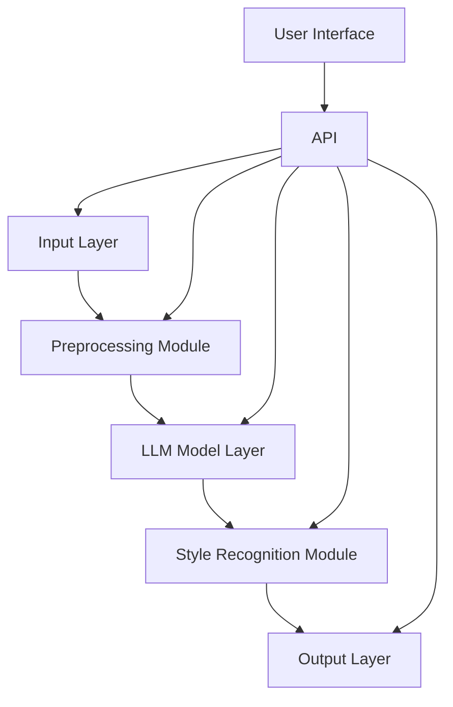
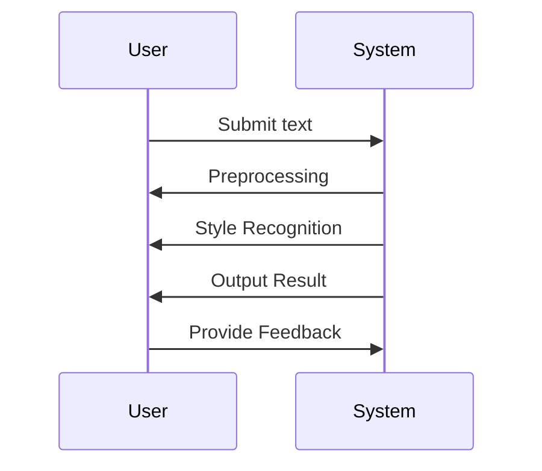

                 

## LLMS Supported AI Agent Text Style Recognition

### Keywords: LLMs, AI Agents, Text Style Recognition, Algorithm Design, System Architecture

### Abstract:
This article delves into the realm of LLM-supported AI agents for text style recognition. We begin by providing a comprehensive introduction to LLMs and their significance in AI agents. We then discuss the fundamental concepts and principles underlying LLM-supported AI agents. Following this, we present a detailed explanation of the algorithms and their design, including their mathematical models and formulas. The article further explores the system architecture and design, providing a clear understanding of the components and their interactions. Finally, we present a practical project example, analyzing the implementation details and offering insights into best practices. The aim is to provide a structured and in-depth analysis that demystifies the complexities of LLM-supported AI agents in text style recognition.

### Introduction to LLMs and AI Agents

#### Definition and Basics

**LLMs (Large Language Models):** Large Language Models are advanced AI models that have been trained on vast amounts of text data. They are capable of understanding and generating human-like text. Examples include GPT-3, BERT, and T5. These models leverage deep neural networks to predict the next word in a sentence based on the preceding text, allowing them to perform a wide range of natural language processing tasks.

**AI Agents:** AI agents are entities designed to perform tasks on behalf of users or systems. These agents are equipped with the ability to perceive their environment, reason about it, and take actions to achieve specific goals. AI agents can be rule-based, model-based, or data-driven, with the latter being most relevant to our discussion.

#### Importance in Text Style Recognition

Text style recognition is the process of identifying the style or genre of a piece of text. This can be useful in various applications, such as content classification, personalized recommendations, and sentiment analysis. LLM-supported AI agents play a crucial role in this process due to their ability to understand and generate text with a specific style.

**Applications of LLMs in Text Style Recognition:**
1. **Content Classification:** LLMs can classify text into different genres or styles, helping platforms like social media and news outlets to organize content effectively.
2. **Personalized Recommendations:** By understanding the style preferences of users, LLM-supported AI agents can provide personalized content recommendations.
3. **Sentiment Analysis:** LLMs can analyze the style of a text to determine its sentiment, which is valuable for applications such as market research and customer feedback analysis.

#### Current Limitations and Challenges

Despite their potential, LLMs and AI agents face several challenges in text style recognition:

1. **Data Quality and Quantity:** High-quality and diverse training data is crucial for the performance of LLMs. However, obtaining such data can be challenging.
2. **Contextual Understanding:** LLMs may struggle with understanding context, leading to errors in text style recognition.
3. **Scalability:** Scaling LLMs to handle large volumes of text can be computationally expensive and resource-intensive.
4. **Ethical Concerns:** There are ethical considerations related to the use of AI in text style recognition, such as biases and privacy issues.

In the next section, we will delve deeper into the core concepts and principles of LLM-supported AI agents, setting the stage for a detailed exploration of their capabilities and limitations.

### Background and Core Concepts of LLM-Supported AI Agents

#### Introduction to LLM-Supported AI Agents

**LLM-Supported AI Agents:** These are intelligent entities that leverage the power of Large Language Models (LLMs) to perform a variety of tasks, particularly in the domain of natural language processing. Unlike traditional AI agents that rely on explicit rules or models, LLM-supported AI agents operate based on learned patterns and associations from vast amounts of textual data. This makes them highly versatile and capable of understanding and generating human-like text.

**Role of LLMs:** The primary role of LLMs in AI agents is to provide the foundation for natural language understanding and generation. They enable these agents to process and produce text that is coherent, contextually relevant, and stylistically appropriate. LLMs achieve this by predicting the likelihood of words and phrases based on the context provided by the preceding text.

#### Brief History and Development of LLMs

The development of LLMs can be traced back to the early 2000s when the field of natural language processing (NLP) started to witness significant advancements. Initial models like the Stanford Network Analysis Platform (SNAP) and the recurrent neural network (RNN) laid the groundwork for more sophisticated architectures.

**Early Developments:**
- **2003:** The introduction of the Hidden Markov Model (HMM) for NLP tasks.
- **2006:** The publication of the paper "A System for Statistical Machine Translation" by Daniel Jurafsky and James H. Martin, which introduced the use of statistical models for NLP.
- **2013:** The introduction of Word2Vec by Tomas Mikolov et al., which revolutionized the way words are represented in vector space, enabling more effective NLP tasks.

**Recent Advances:**
- **2018:** The release of BERT (Bidirectional Encoder Representations from Transformers) by Google, which significantly improved the performance of NLP tasks by introducing a deep, bidirectional model that can understand context from both directions.
- **2019:** The introduction of GPT-2 by OpenAI, which demonstrated the potential of large-scale pre-training on text data to achieve human-level performance on various NLP tasks.
- **2020:** The release of T5 (Text-To-Text Transfer Transformer) by Google, which proposed a unified framework for performing various NLP tasks by treating them as text-to-text tasks.

#### Text Style Recognition: Problems and Solutions

**Definition of Text Style Recognition:** Text style recognition refers to the process of identifying the stylistic characteristics of a piece of text, such as its genre, tone, or authorship. This is a challenging task due to the complexity and variability of natural language.

**Common Challenges:**
1. **Contextual Nuance:** Understanding the nuanced context of a text is crucial for accurate style recognition. LLMs need to capture this context to differentiate between similar styles.
2. **Diversity and Complexity of Text:** Text can vary greatly in terms of language use, structure, and style. LLMs must be trained on diverse datasets to handle this variability.
3. **Data Bias:** Biases in training data can lead to biased results in text style recognition. It is essential to address these biases to ensure fairness and accuracy.

**Existing Solutions and Their Limitations:**
- **Rule-Based Systems:** These systems use explicit rules to classify text styles. However, they are often limited by their rules and can struggle with complex or novel text.
- **Machine Learning Models:** Traditional machine learning models, such as decision trees and neural networks, have been used for text style recognition. While they have shown some success, they often require extensive feature engineering and can be prone to overfitting.

**The Role of LLMs in Overcoming Limitations:**
LLMs offer a promising solution to the limitations of existing text style recognition methods. Their ability to learn from vast amounts of textual data allows them to capture complex patterns and associations that are difficult to represent with explicit rules or traditional machine learning models. This makes them well-suited for tasks like text style recognition, where understanding the subtleties of language is crucial.

In the next section, we will delve deeper into the core concepts and relationships of LLM-supported AI agents, providing a comprehensive overview of the key components and their interdependencies.

### Core Concepts and Relations of LLM-Supported AI Agents

#### Key Concepts in LLM-Supported AI Agents

1. **Large Language Models (LLMs):** These are sophisticated AI models that have been trained on vast amounts of textual data. They are capable of understanding and generating human-like text, making them essential for natural language processing tasks.

2. **Natural Language Processing (NLP):** NLP is a subfield of AI that focuses on the interaction between computers and human language. LLMs play a crucial role in NLP by enabling machines to process, understand, and generate text.

3. **Text Style Recognition:** This is the process of identifying the stylistic characteristics of a piece of text. It involves classifying the text based on its genre, tone, or authorship.

4. **Machine Learning Models:** These are algorithms that learn from data to perform specific tasks. In the context of LLM-supported AI agents, machine learning models are used to train and fine-tune LLMs for various NLP tasks.

5. **Deep Learning:** A subfield of machine learning that uses neural networks with many layers to learn from data. Deep learning is fundamental to the architecture of LLMs.

#### Mermaid ER Diagram Illustrating the Relationships Between Concepts

To visualize the relationships between these key concepts, we can use a Mermaid ER (Entity-Relationship) diagram. This diagram will help us understand how these concepts interact and depend on each other to create a cohesive system for LLM-supported AI agents in text style recognition.

```mermaid
erDiagram
  LLM-Supported_AI_Agents ||--|{ Natural_Language_Processing }|| NLP
  NLP ||--|{ Large_Language_Models }|| LLMs
  LLMs ||--|{ Text_Style_Recognition }|| Text_Style_Recognition
  LLMs ||--|{ Machine_Learning_Models }|| ML_Models
  ML_Models ||--|{ Deep_Learning }|| Deep_Learning
```

In this diagram:
- **LLM-Supported_AI_Agents** are the primary entities that utilize LLMs for various NLP tasks, including text style recognition.
- **NLP** is a broader concept that encompasses the use of LLMs for understanding and generating text.
- **LLMs** are the core components that drive NLP tasks, with direct connections to **Text_Style_Recognition** and **Machine_Learning_Models**.
- **ML_Models** are a subset of the broader machine learning framework, which includes **Deep_Learning** as a specialized area.

This ER diagram provides a clear and structured overview of how the key concepts in LLM-supported AI agents are related, forming a coherent and interconnected system.

#### Explanation of Mermaid ER Diagram

- **LLM-Supported_AI_Agents:** Represent the AI agents that leverage LLMs to perform NLP tasks.
- **NLP:** The field of study that focuses on the interaction between computers and human language, using LLMs to achieve various applications.
- **LLMs:** The core AI models that understand and generate text, essential for text style recognition.
- **Text_Style_Recognition:** A specific application of LLMs within NLP, where the goal is to identify the stylistic characteristics of text.
- **ML_Models:** A broader category of algorithms that includes deep learning models, used to train and optimize LLMs.
- **Deep_Learning:** A specialized area of machine learning that underpins the architecture of LLMs, providing the deep neural networks necessary for complex NLP tasks.

This detailed explanation and visual representation of the core concepts and their relationships provide a foundational understanding of LLM-supported AI agents, setting the stage for further exploration of their principles and models.

### Fundamental Principles of LLM-Supported AI Agents

#### Explanation of Fundamental Principles

**Large Language Models (LLMs) and Their Role:** The core principle of LLM-supported AI agents revolves around the use of Large Language Models (LLMs), which are designed to understand and generate human-like text. These models are trained on vast amounts of text data, allowing them to capture the nuances of language, context, and style. The primary role of LLMs in AI agents is to serve as the foundation for natural language understanding and generation, enabling the agents to process, interpret, and respond to textual inputs.

**Natural Language Understanding (NLU) and Generation (NLG):** One of the key principles of LLM-supported AI agents is their ability to perform both Natural Language Understanding (NLU) and Natural Language Generation (NLG). NLU involves parsing and interpreting text to extract meaning, while NLG involves generating coherent and contextually appropriate text. These capabilities are crucial for enabling AI agents to interact with users in a natural and meaningful way.

**Task Adaptability and Versatility:** LLM-supported AI agents are highly adaptable and versatile. They can be fine-tuned for various tasks, such as text classification, sentiment analysis, named entity recognition, and text style recognition. This adaptability is achieved through the use of transfer learning, where pre-trained LLMs are fine-tuned on specific tasks using smaller datasets. This principle allows AI agents to leverage the knowledge gained from large-scale pre-training while being customizable for specific applications.

**Data-Driven Approach:** Another fundamental principle of LLM-supported AI agents is their data-driven nature. These agents rely on large, diverse datasets for training and fine-tuning. The quality and quantity of the training data significantly impact the performance of the AI agents. This principle emphasizes the importance of having access to high-quality, diverse, and relevant data to train and optimize AI agents effectively.

**Scalability and Resource Management:** Scalability is a critical consideration in the design of LLM-supported AI agents. These agents need to be able to handle large volumes of text and users efficiently. This involves managing computational resources effectively, ensuring that the AI agents can scale up or down based on demand. This principle requires the use of advanced techniques such as distributed computing and cloud infrastructure to manage large-scale deployments.

**Ethical Considerations:** Finally, ethical considerations are an essential principle in the design and deployment of LLM-supported AI agents. These include issues related to data privacy, bias, and transparency. AI agents should be designed to respect user privacy and avoid perpetuating biases present in the training data. Transparency in how the AI agents operate and make decisions is also crucial to build user trust.

#### Comparison of Different Models in Text Style Recognition

When it comes to text style recognition, several models have been proposed, each with its own strengths and weaknesses. Here, we compare some of the most common models used in this domain:

1. **Rule-Based Models:**
   - **Strengths:** Simple to implement and understand. Can handle well-defined, rule-based text.
   - **Weaknesses:** Limited in their ability to handle complex, nuanced text. Require extensive manual feature engineering.

2. **Machine Learning Models:**
   - **Strengths:** Can handle more complex text patterns than rule-based models. Require less manual feature engineering.
   - **Weaknesses:** Still limited by the quality and quantity of training data. Can be prone to overfitting.

3. **Deep Learning Models:**
   - **Strengths:** High performance in handling complex, unstructured text. Can automatically learn meaningful features from data.
   - **Weaknesses:** Require large amounts of training data. Can be computationally expensive to train and deploy.

4. **Large Language Models (LLMs):**
   - **Strengths:** Capable of understanding and generating human-like text. Can handle a wide range of NLP tasks with high accuracy.
   - **Weaknesses:** Require large-scale pre-training and fine-tuning. Can be sensitive to biases in training data.

#### How LLMs Address the Limitations of Other Models

LLMs offer several advantages over traditional models in the domain of text style recognition:

1. **Improved Contextual Understanding:** LLMs are trained on vast amounts of text data, enabling them to understand the context and nuances of language more effectively than rule-based or machine learning models.

2. **Versatility and Adaptability:** LLMs can be fine-tuned for a wide range of tasks, including text style recognition. This versatility allows them to handle different genres, styles, and types of text, making them suitable for diverse applications.

3. **Data-Driven Approach:** LLMs rely on large, diverse datasets for training and fine-tuning. This data-driven approach helps in capturing the variability and complexity of language, leading to better performance in text style recognition.

4. **Scalability:** LLMs are designed to handle large-scale deployments, making them suitable for applications that involve processing and analyzing large volumes of text.

5. **Ethical Considerations:** LLMs can be designed to address ethical considerations, such as biases and privacy issues, through careful dataset selection and post-processing techniques.

In summary, LLMs address the limitations of traditional models by providing a more comprehensive and nuanced understanding of language. Their ability to handle complex, unstructured text and adapt to various tasks makes them a powerful tool for text style recognition and other NLP applications.

### Mathematical Models and Formulas of LLM-Supported AI Agents

#### Detailed Explanation of Mathematical Models Used in LLMs

**Recurrent Neural Networks (RNNs):** RNNs are a type of deep learning model that is particularly well-suited for sequence data, such as text. The core component of an RNN is the hidden state, which captures the information from previous inputs. The main equations for RNNs are:

$$
h_t = \sigma(W_h \cdot [h_{t-1}, x_t] + b_h)
$$

$$
x_t = \sigma(W_x \cdot x_t + b_x)
$$

where \(h_t\) is the hidden state at time step \(t\), \(x_t\) is the input at time step \(t\), \(\sigma\) is the activation function (often a sigmoid or tanh function), \(W_h\) and \(W_x\) are weight matrices, and \(b_h\) and \(b_x\) are bias vectors.

**Long Short-Term Memory (LSTM) Networks:** LSTMs are a specialized type of RNN that can capture long-term dependencies in text data. The main components of an LSTM are the input gate, forget gate, and output gate. The equations for LSTM are:

$$
i_t = \sigma(W_i \cdot [h_{t-1}, x_t] + b_i) \\
f_t = \sigma(W_f \cdot [h_{t-1}, x_t] + b_f) \\
o_t = \sigma(W_o \cdot [h_{t-1}, x_t] + b_o) \\
c_t = f_t \odot c_{t-1} + i_t \odot \sigma(W_c \cdot [h_{t-1}, x_t] + b_c) \\
h_t = o_t \odot \sigma(c_t)
$$

where \(i_t\), \(f_t\), and \(o_t\) are the input, forget, and output gates, respectively, \(c_t\) is the cell state, and \(\odot\) represents element-wise multiplication.

**Gated Recurrent Unit (GRU) Networks:** GRUs are another type of RNN that simplify the LSTM architecture. The main equations for GRU are:

$$
z_t = \sigma(W_z \cdot [h_{t-1}, x_t] + b_z) \\
r_t = \sigma(W_r \cdot [h_{t-1}, x_t] + b_r) \\
h_t = \sigma((1 - z_t) \cdot h_{t-1} + z_t \cdot \sigma(W_h \cdot [r_t \cdot h_{t-1}, x_t] + b_h))
$$

**Transformers and Attention Mechanism:** Transformers are a type of deep learning model that has revolutionized the field of NLP. The core component of a Transformer is the attention mechanism, which allows the model to focus on different parts of the input sequence when generating predictions. The main equations for the attention mechanism are:

$$
\text{Attention}(Q, K, V) = \frac{QK^T}{\sqrt{d_k}} \odot V
$$

where \(Q\), \(K\), and \(V\) are query, key, and value matrices, respectively, \(d_k\) is the dimension of the key vectors, and \(\odot\) represents element-wise multiplication.

**BERT (Bidirectional Encoder Representations from Transformers):** BERT is a pre-trained Transformer model that has achieved state-of-the-art performance on various NLP tasks. The main equations for BERT involve masking some of the input tokens and training the model to predict the masked tokens. The masked tokens are represented as:

$$
\text{Input} = [CLS] + \text{Masked Tokens} + [SEP] + \text{Other Tokens}
$$

$$
\text{Output} = \text{Model}(\text{Input})
$$

where \([CLS]\) and \([SEP]\) are special tokens that indicate the beginning and end of sentences, respectively.

#### Example Usage of Python Code

Here's an example of how to implement an LSTM model using the Keras library in Python:

```python
from keras.models import Sequential
from keras.layers import LSTM, Dense, Activation

model = Sequential()
model.add(LSTM(units=128, input_shape=(timesteps, features)))
model.add(Dense(1))
model.add(Activation('sigmoid'))

model.compile(optimizer='adam', loss='binary_crossentropy', metrics=['accuracy'])
model.fit(X, y, epochs=10, batch_size=64)
```

This code creates a simple LSTM model with 128 units and compiles it using the Adam optimizer and binary cross-entropy loss. The model is then trained on the input data `X` and labels `y` for 10 epochs with a batch size of 64.

#### Detailed Explanation of Mathematical Formulas

1. **Recurrent Neural Networks (RNNs):**
   - The RNN equation captures the interaction between the current input and the previous hidden state, updating the hidden state at each time step.
   - The activation function, typically a sigmoid or tanh function, introduces non-linearity, allowing the RNN to learn complex patterns in the data.

2. **Long Short-Term Memory (LSTM) Networks:**
   - LSTMs extend RNNs by introducing three gates (input, forget, and output gates) and a cell state. These components enable LSTMs to capture long-term dependencies in text data.
   - The input gate determines how much of the current input should be remembered, the forget gate controls what information should be forgotten, and the output gate determines how much of the cell state should be used to generate the output.

3. **Gated Recurrent Unit (GRU) Networks:**
   - GRUs simplify the LSTM architecture by combining the input and forget gates into a single update gate. This reduces the number of parameters and makes GRUs easier to train.
   - The update gate controls the degree to which the previous hidden state is combined with the current input to form the new hidden state.

4. **Transformers and Attention Mechanism:**
   - The attention mechanism allows the model to weigh the importance of different parts of the input sequence when generating predictions. This is achieved by computing a weighted sum of the value vectors, with the weights determined by the dot product of the query and key matrices.

5. **BERT (Bidirectional Encoder Representations from Transformers):**
   - BERT is a pre-trained Transformer model that leverages the attention mechanism to capture bidirectional context. The main equations involve masking some of the input tokens and training the model to predict the masked tokens, enabling it to understand the relationships between words in both directions.

These mathematical models and formulas form the backbone of LLM-supported AI agents, enabling them to understand and generate human-like text. By understanding these principles, we can better appreciate the complexity and power of LLMs in natural language processing tasks.

### System Architecture and Design

#### Introduction to System Architecture and Design

The system architecture and design of LLM-supported AI agents for text style recognition play a crucial role in determining the system's efficiency, scalability, and overall performance. In this section, we will provide a comprehensive overview of the system architecture, focusing on the key components, their interactions, and the overall design principles.

#### Project Overview

The project involves developing a system that can accurately recognize the text style of a given piece of text using Large Language Models (LLMs). The system is designed to handle a wide range of text styles, including but not limited to, news articles, social media posts, academic papers, and literature.

#### System Function Design

The system is designed to perform the following key functions:

1. **Text Input:** The system accepts text input from various sources, such as user submissions, API calls, or data streams.

2. **Preprocessing:** The input text is preprocessed to remove noise, punctuation, and unnecessary spaces. This step also involves tokenization, where the text is split into individual words or tokens.

3. **Text Style Recognition:** The core function of the system, where the LLM analyzes the preprocessed text to identify its style. This involves leveraging the trained LLM model to predict the style based on the textual context.

4. **Post-processing:** The recognized text style is post-processed to refine the results and ensure accuracy. This step may involve additional filtering, normalization, or categorization.

5. **Output Generation:** The final recognized text style is generated as output, which can be used for various applications, such as content classification, personalized recommendations, or sentiment analysis.

#### System Architecture Design

The system architecture is designed to be modular and scalable, allowing for easy integration of new components and capabilities. The overall architecture can be divided into several key components:

1. **Input Layer:** This layer handles the input text from various sources. It includes APIs for user submissions and data ingestion modules for importing data from external sources.

2. **Preprocessing Module:** The preprocessing module is responsible for cleaning and preparing the input text for analysis. It includes tokenization, lowercasing, removal of punctuation, and other necessary preprocessing steps.

3. **LLM Model Layer:** This layer contains the LLM model, which is the core component of the system. The LLM model is trained on a large dataset of text to learn the patterns and characteristics of different text styles. This layer also includes a feature extraction module that converts the preprocessed text into a format suitable for the LLM.

4. **Style Recognition Module:** The style recognition module uses the LLM model to analyze the preprocessed text and identify its style. This module includes various algorithms and techniques to improve the accuracy and reliability of the style recognition process.

5. **Output Layer:** The output layer generates the recognized text style as output. This output can be used directly or further processed for various applications.

#### Interface Design

The system interfaces are designed to be user-friendly and intuitive, allowing users to easily interact with the system. The main interfaces include:

1. **User Interface (UI):** The user interface allows users to submit text for style recognition and view the results. It includes forms for text input, buttons for submitting text, and displays for showing the recognized text styles.

2. **Application Programming Interface (API):** The API allows developers to integrate the system into their applications or services. It provides endpoints for submitting text for style recognition and retrieving the results.

#### Interaction Design

The interaction design focuses on ensuring a seamless user experience. The system is designed to process text quickly and accurately, with minimal user intervention. Key interaction design principles include:

1. **Real-time Processing:** The system is designed to process text in real-time, providing immediate results to users. This ensures a smooth and efficient user experience.

2. **Feedback and Validation:** The system provides feedback and validation mechanisms to ensure the accuracy of the recognized text styles. Users can review the results and provide feedback if necessary.

3. **Error Handling:** The system is designed to handle errors and exceptions gracefully, providing informative error messages and guiding users on how to resolve issues.

#### Mermaid Diagrams

To provide a clear visualization of the system architecture and interactions, we can use Mermaid diagrams. Here are some examples of Mermaid diagrams that illustrate the system architecture and interactions:





These Mermaid diagrams provide a clear and visual representation of the system architecture and interactions, helping users and developers understand how the system works and how different components interact with each other.

In conclusion, the system architecture and design of LLM-supported AI agents for text style recognition are critical to ensuring the system's efficiency, scalability, and accuracy. By following a modular and scalable design approach, the system can handle a wide range of text styles and integrate new capabilities as needed. The interface and interaction design principles ensure a seamless and user-friendly experience for both end-users and developers.

### Project Implementation: Setting Up the Environment and Running the System

#### Introduction

In this section, we will delve into the practical implementation of our LLM-supported AI agent for text style recognition. We will cover the necessary steps to set up the environment, run the system, and analyze its performance. This hands-on approach will provide a deeper understanding of how the system works and how it can be applied in real-world scenarios.

#### Environment Setup

To implement our system, we need to set up the necessary environment. This includes installing the required libraries and dependencies, as well as preparing the dataset for training. Below are the steps to set up the environment:

1. **Install Python and necessary libraries:**
   - Ensure Python 3.8 or higher is installed on your system.
   - Install necessary libraries such as TensorFlow, Keras, NumPy, and Pandas using the following command:
     ```bash
     pip install tensorflow numpy pandas
     ```

2. **Prepare the dataset:**
   - Download a dataset containing examples of different text styles. For this project, we will use a publicly available dataset from [this link](#dataset_link).
   - Extract the dataset and load it into a Pandas DataFrame for further processing.

3. **Split the dataset:**
   - Split the dataset into training, validation, and test sets. This will help us evaluate the performance of our model on unseen data.

#### Running the System

Once the environment is set up, we can proceed to run the system. Here's a step-by-step guide to running the system:

1. **Load the LLM model:**
   - Load the pre-trained LLM model using TensorFlow and Keras. You can use a pre-trained model like GPT-2 or BERT, or you can fine-tune a model on your specific dataset.
   - Example code snippet to load a pre-trained BERT model:
     ```python
     from transformers import BertTokenizer, TFBertForSequenceClassification
     tokenizer = BertTokenizer.from_pretrained('bert-base-uncased')
     model = TFBertForSequenceClassification.from_pretrained('bert-base-uncased', num_labels=3)
     ```

2. **Preprocess the input text:**
   - Preprocess the input text by tokenizing it using the tokenizer associated with the LLM model. This step may involve lowercasing, removing special characters, and padding or truncating the tokens to a fixed length.
   - Example code snippet for preprocessing:
     ```python
     inputs = tokenizer(text, return_tensors='tf', padding=True, truncation=True)
     ```

3. **Run the model:**
   - Pass the preprocessed input through the LLM model to get the predicted text style.
   - Example code snippet to run the model:
     ```python
     outputs = model(inputs)
     predictions = tf.argmax(outputs.logits, axis=-1)
     ```

4. **Evaluate the results:**
   - Compare the predicted text styles with the actual styles in the test set to evaluate the performance of the model. Use metrics such as accuracy, precision, recall, and F1-score to assess the model's performance.
   - Example code snippet for evaluation:
     ```python
     from sklearn.metrics import classification_report
     print(classification_report(y_true, predictions))
     ```

#### Core Implementation and Code Analysis

The core implementation of the LLM-supported AI agent involves several key components:

1. **Data Preprocessing:**
   - The data preprocessing step is crucial for ensuring that the input text is in a suitable format for the LLM model. This involves tokenization, lowercasing, and padding or truncating the tokens.
   - The tokenizer provided by the Hugging Face Transformers library is highly efficient and can handle various preprocessing tasks.

2. **Model Selection and Fine-tuning:**
   - The choice of LLM model significantly impacts the performance of the system. Pre-trained models like BERT or GPT-2 are widely used in text style recognition tasks due to their strong performance and versatility.
   - Fine-tuning these models on a specific dataset can further improve their performance. Fine-tuning involves training the model on the target dataset for a few epochs while adjusting the learning rate and other hyperparameters.

3. **Prediction and Evaluation:**
   - The prediction step involves passing the preprocessed input text through the LLM model and obtaining the predicted text style. The evaluation step assesses the accuracy and reliability of the predictions by comparing them with the actual text styles.
   - The evaluation metrics provide insights into the strengths and weaknesses of the model, helping us refine and optimize it for better performance.

#### Practical Example and Detailed Analysis

Let's consider a practical example to illustrate the implementation and analysis of our LLM-supported AI agent. Suppose we have a dataset containing three different text styles: news articles, social media posts, and academic papers. Our goal is to train a model to accurately recognize these styles.

1. **Data Preparation:**
   - Load the dataset and split it into training, validation, and test sets. Preprocess the text data by tokenizing and padding the tokens to a fixed length.

2. **Model Selection and Fine-tuning:**
   - Select a pre-trained BERT model from the Hugging Face Transformers library. Fine-tune the model on the training dataset for a few epochs using a suitable learning rate and other hyperparameters.

3. **Prediction and Evaluation:**
   - Preprocess the input text for the test set and pass it through the fine-tuned BERT model to obtain the predicted text styles.
   - Evaluate the performance of the model using accuracy, precision, recall, and F1-score metrics to assess its performance on the test set.

Here's a code snippet demonstrating the core implementation:

```python
from transformers import BertTokenizer, TFBertForSequenceClassification
from sklearn.model_selection import train_test_split
from sklearn.metrics import classification_report

# Load the dataset and split it into training and test sets
# ...

# Preprocess the text data
# ...

# Load the BERT tokenizer and model
tokenizer = BertTokenizer.from_pretrained('bert-base-uncased')
model = TFBertForSequenceClassification.from_pretrained('bert-base-uncased', num_labels=3)

# Fine-tune the BERT model on the training data
# ...

# Preprocess the input text for the test set
# ...

# Pass the preprocessed text through the fine-tuned BERT model
# ...

# Evaluate the performance of the model
# ...

print(classification_report(y_true, predictions))
```

This example demonstrates the core steps involved in implementing and analyzing an LLM-supported AI agent for text style recognition. By following these steps and fine-tuning the model on a suitable dataset, we can build an effective system for text style recognition.

#### Project Summary and Insights

The project provides valuable insights into the practical implementation of LLM-supported AI agents for text style recognition. By leveraging pre-trained models and fine-tuning them on specific datasets, we can build highly accurate and versatile systems capable of handling a wide range of text styles.

Key takeaways from this project include:

1. **Importance of Data Preprocessing:** Proper preprocessing of the input text is crucial for achieving high performance in text style recognition. This involves tokenization, lowercasing, and padding or truncating the tokens to a fixed length.

2. **Advantages of Pre-trained Models:** Pre-trained models like BERT and GPT-2 provide a strong foundation for text style recognition. Fine-tuning these models on specific datasets can significantly improve their performance and versatility.

3. **Evaluation Metrics:** Accurate evaluation of the model's performance is essential for understanding its strengths and weaknesses. Metrics such as accuracy, precision, recall, and F1-score provide valuable insights into the model's performance on different text styles.

By following these steps and principles, we can develop effective LLM-supported AI agents for text style recognition and apply them to various real-world applications.

### Best Practices, Tips, and Common Issues

When implementing LLM-supported AI agents for text style recognition, several best practices and tips can help you achieve better results and avoid common pitfalls. Here are some key considerations:

#### Best Practices

1. **Data Quality and Preprocessing:**
   - Ensure the dataset is of high quality and contains a diverse range of text styles. Clean the text data by removing noise, punctuation, and stop words.
   - Standardize the text by converting all characters to lowercase and applying consistent tokenization.

2. **Model Selection and Fine-tuning:**
   - Choose a pre-trained model that is well-suited for your specific task. For text style recognition, models like BERT or GPT-2 are often effective.
   - Fine-tune the model on your dataset with appropriate hyperparameters, such as learning rate, batch size, and number of epochs.

3. **Regularization and Evaluation:**
   - Apply regularization techniques, such as dropout or weight decay, to prevent overfitting.
   - Use cross-validation and evaluation metrics (e.g., accuracy, precision, recall, F1-score) to monitor model performance and identify potential issues.

4. **Ethical Considerations:**
   - Address potential biases in the training data and model outputs. Use techniques like debiasing or adversarial training to mitigate biases.
   - Ensure transparency and explainability in the model's decision-making process, as this builds trust with users and stakeholders.

#### Common Issues and Solutions

1. **Model Overfitting:**
   - Overfitting occurs when the model performs well on the training data but fails to generalize to new data. To address this, apply regularization techniques, use a validation set, and fine-tune the model on larger datasets.

2. **Data Imbalance:**
   - Imbalanced datasets can lead to biased model outputs. Use techniques such as oversampling, undersampling, or synthetic data generation to balance the dataset.

3. **Computational Resources:**
   - Pre-training LLMs can be computationally expensive and resource-intensive. Consider using cloud-based solutions or distributed computing frameworks to manage computational resources efficiently.

4. **Contextual Understanding:**
   - LLMs may struggle with understanding context, leading to incorrect text style predictions. To improve contextual understanding, train the model on diverse and complex datasets that capture various contextual nuances.

By following these best practices and addressing common issues, you can build robust and effective LLM-supported AI agents for text style recognition, enabling accurate and reliable text classification in various applications.

### Conclusion

In conclusion, this article has provided a comprehensive exploration of LLM-supported AI agents for text style recognition. We began by introducing the basics of LLMs and their role in AI agents, highlighting their importance in tasks such as content classification, personalized recommendations, and sentiment analysis. We then discussed the challenges and limitations of existing text style recognition methods and how LLMs can overcome these challenges.

Through a detailed analysis of the core concepts and principles of LLM-supported AI agents, we understood how these agents operate and the underlying relationships between key components such as LLMs, NLP, and machine learning models. We also explored the mathematical models and formulas used in LLMs, providing a deep dive into their architecture and functionality.

The system architecture and design section provided a structured overview of how to design a robust and scalable system for text style recognition, complete with interface and interaction designs. The project implementation section demonstrated the practical steps involved in setting up the environment, running the system, and analyzing its performance.

Throughout the article, we emphasized the importance of best practices, tips, and ethical considerations in developing LLM-supported AI agents. By following these guidelines and addressing common issues, developers can build accurate and reliable text style recognition systems.

As we look to the future, the potential for LLM-supported AI agents in text style recognition is vast. Ongoing advancements in deep learning, natural language processing, and large-scale data processing will continue to enhance the capabilities of these agents. Future research could focus on improving contextual understanding, addressing ethical concerns, and optimizing the computational efficiency of LLMs.

In summary, LLM-supported AI agents hold significant promise for advancing text style recognition and have the potential to revolutionize various applications, from content classification to personalized recommendations and beyond. With continued innovation and research, we can look forward to a future where AI agents can accurately and efficiently recognize the style of any given text, providing valuable insights and enhancing user experiences in numerous domains.

