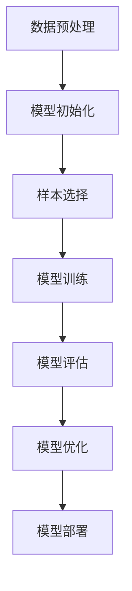

                 

# LLM的few-shot learning：减少训练数据需求

## 关键词

- 语言模型（Language Model，LLM）
- 几shot learning
- 数据需求
- 机器学习（Machine Learning）
- 自适应模型（Adaptive Model）
- 元学习（Meta Learning）

## 摘要

本文深入探讨了大型语言模型（LLM）的few-shot learning能力，及其在减少训练数据需求方面的潜力。通过分析LLM的发展历程和few-shot learning的基本概念，我们了解了LLM的few-shot learning原理和几种常见的few-shot learning方法。文章还详细介绍了LLM的few-shot learning应用场景，并探讨了其在不同领域的应用前景。本文旨在为读者提供一个全面而深入的了解，帮助他们在实际项目中应用和优化LLM的few-shot learning能力。

## 第一部分： 引言与背景介绍

### 第1章：LLM的few-shot learning：问题背景与挑战

#### 1.1 问题背景

##### 1.1.1 机器学习的发展历程

从1956年达特茅斯会议开始，机器学习已经走过了近70年的发展历程。早期以符号主义和基于规则的系统为主，后来随着计算能力的提升和大数据的涌现，统计学习方法逐渐成为主流。从支持向量机（SVM）到神经网络，再到最近的深度学习，每一代技术的革新都带来了机器学习性能的显著提升。

##### 1.1.2 大型语言模型（LLM）的崛起

随着深度学习技术的发展，大型语言模型（LLM）如BERT、GPT等逐渐崭露头角。这些模型具有数十亿参数，能够对自然语言进行建模，并在各种语言任务中取得了显著的性能。然而，LLM的训练过程需要大量的数据和计算资源，这给研究者和企业带来了巨大的挑战。

##### 1.1.3 LLM的training需求与挑战

LLM的训练通常需要海量的数据集和强大的计算能力。例如，GPT-3的训练使用了1750张A100 GPU和100,000个CPU，以及超过45TB的随机访问存储。这种巨大的资源需求不仅限制了研究的范围，也使得LLM在实际应用中面临许多挑战：

- **数据获取难度**：高质量的数据集不易获得，特别是在某些专业领域。
- **计算资源限制**：不仅需要高性能的计算设备，还需要大量的电力支持。
- **数据隐私问题**：大量数据的处理可能会引发隐私泄露的风险。

#### 1.2 问题描述

##### 1.2.1 Few-shot learning的概念

Few-shot learning是一种机器学习方法，旨在减少对大量训练数据的依赖，使模型能够在仅有少量样本的情况下快速适应新任务。与传统的批量学习（Batch Learning）和在线学习（Online Learning）相比，few-shot learning具有更高效的数据利用方式。

##### 1.2.2 减少训练数据需求的重要性

减少训练数据需求对于实际应用具有重要意义：

- **降低成本**：减少数据采集和标注的成本。
- **加快迭代速度**：模型能够更快地适应新任务，缩短研发周期。
- **保护隐私**：减少对用户数据的依赖，降低隐私泄露风险。

##### 1.2.3 当前存在的问题与局限性

尽管few-shot learning具有许多优势，但在实际应用中仍存在一些问题和局限性：

- **数据分布问题**：在少量样本中难以代表整个数据分布。
- **模型泛化能力**：模型在新任务上的表现可能受到限制。
- **计算资源需求**：few-shot learning方法通常需要额外的计算资源。

#### 1.3 问题解决

##### 1.3.1 LLM的few-shot learning原理

LLM的few-shot learning基于其强大的表示能力，能够在少量样本中捕捉到数据的特征。通过调整模型的参数，LLM能够在不同任务之间快速迁移知识。

##### 1.3.2 几种常见的few-shot learning方法

常见的few-shot learning方法包括元学习（Meta Learning）、模型自适应（Model Adaptation）和数据增强（Data Augmentation）等。每种方法都有其独特的原理和适用场景。

##### 1.3.3 few-shot learning的应用场景

few-shot learning可以应用于各种任务，包括自然语言处理、计算机视觉和推荐系统等。在实际应用中，可以根据任务需求和数据情况选择合适的方法。

#### 1.4 边界与外延

##### 1.4.1 LLM的适用范围

LLM主要适用于需要理解和生成自然语言的任务，如文本分类、机器翻译、问答系统等。

##### 1.4.2 几种常见LLM架构的介绍

常见的LLM架构包括Transformer、BERT和GPT等。每种架构都有其独特的特点和应用场景。

##### 1.4.3 few-shot learning在不同领域的应用前景

few-shot learning在各个领域的应用前景广阔，如医疗诊断、金融分析和智能客服等。

#### 1.5 概念结构与核心要素组成

##### 1.5.1 LLM的基本组成部分

LLM主要由输入层、编码器、解码器和输出层组成。

##### 1.5.2 few-shot learning的关键要素

few-shot learning的关键要素包括数据、模型和优化目标。

##### 1.5.3 LLM的few-shot learning流程图

LLM的few-shot learning流程图如下所示：

#### 1.6 本章小结

本章节介绍了LLM的few-shot learning背景和挑战，探讨了few-shot learning的基本概念和原理，以及LLM的few-shot learning方法和应用场景。为后续章节的深入探讨奠定了基础。

---

## 第二部分：核心概念与原理讲解

### 第2章：LLM的few-shot learning原理

#### 2.1 LLM的基础原理

##### 2.1.1 语言模型的概念

语言模型（Language Model，LM）是一种用于预测自然语言中下一个单词或字符的概率分布的统计模型。它通过对大量文本数据进行训练，学习语言的结构和规律。

##### 2.1.2 LLM的工作原理

LLM基于深度学习技术，通常采用神经网络结构，如Transformer、BERT和GPT等。这些模型通过大量文本数据进行预训练，从而学习到丰富的语言知识。

##### 2.1.3 LLM的优势与不足

LLM的优势在于其强大的表示能力和泛化能力，能够处理各种复杂的语言任务。然而，LLM的训练过程需要大量的数据和计算资源，且在少量样本下的表现可能不佳。

#### 2.2 Few-shot learning的基本概念

##### 2.2.1 几种常见的机器学习范式

常见的机器学习范式包括批量学习、在线学习和迁移学习等。这些范式各有优缺点，适用于不同的场景。

##### 2.2.2 Few-shot learning的定义

Few-shot learning是一种能够在仅有少量样本的情况下快速适应新任务的机器学习方法。它通过迁移知识、模型自适应和数据增强等技术，提高模型在新任务上的表现。

##### 2.2.3 Few-shot learning的核心目标

Few-shot learning的核心目标是减少对大量训练数据的依赖，提高模型在少量样本下的性能和泛化能力。

#### 2.3 LLM与Few-shot learning的结合

##### 2.3.1 LLM的few-shot learning优势

LLM的few-shot learning优势在于其强大的表示能力和预训练知识，能够在少量样本下快速适应新任务。

##### 2.3.2 几种常见的LLM few-shot learning方法

常见的LLM few-shot learning方法包括元学习、模型自适应和数据增强等。这些方法各有优缺点，适用于不同的场景。

##### 2.3.3 LLM few-shot learning的挑战与解决方案

LLM few-shot learning的挑战主要包括数据分布问题、模型泛化能力和计算资源需求等。针对这些问题，研究者提出了一系列解决方案，如迁移学习、数据增强和元学习等。

#### 2.4 LLM的few-shot learning应用场景

##### 2.4.1 自然语言处理领域

在自然语言处理领域，LLM的few-shot learning可以应用于文本分类、机器翻译、问答系统和对话系统等任务。

##### 2.4.2 计算机视觉领域

在计算机视觉领域，LLM的few-shot learning可以应用于图像分类、目标检测和图像生成等任务。

##### 2.4.3 其他应用领域

除了自然语言处理和计算机视觉领域，LLM的few-shot learning还可以应用于推荐系统、医疗诊断和金融分析等任务。

#### 2.5 LLM的few-shot learning数学模型

##### 2.5.1 几种常见的数学模型

常见的数学模型包括神经网络模型、决策树模型和支持向量机模型等。这些模型在few-shot learning中发挥着重要作用。

##### 2.5.2 数学模型与Few-shot learning的关系

数学模型是few-shot learning的基础，通过调整模型的参数和结构，可以优化模型在少量样本下的性能。

##### 2.5.3 LLM的few-shot learning数学公式

LLM的few-shot learning数学公式主要包括损失函数、优化算法和评估指标等。

#### 2.6 LLM的few-shot learning流程图

##### 2.6.1 LLM的few-shot learning流程概述

LLM的few-shot learning流程主要包括数据预处理、模型初始化、样本选择、模型训练、模型评估和模型优化等步骤。

##### 2.6.2 LLM的few-shot learning流程细节

LLM的few-shot learning流程细节如下所示：

#### 2.7 本章小结

本章节介绍了LLM的基本原理、Few-shot learning的基本概念和LLM的few-shot learning原理。通过本章的学习，读者可以了解LLM的few-shot learning优势和应用场景，为进一步掌握相关技术打下基础。

---

## 第三部分：几种常见的Few-shot learning方法

### 第3章：几种常见的Few-shot learning方法

#### 3.1 Meta Learning方法

##### 3.1.1 Meta Learning的基本概念

Meta Learning是一种通过学习如何学习来提高模型适应新任务的能力。它通过在多个任务上训练模型，提取通用学习策略，从而在少量样本下快速适应新任务。

##### 3.1.2 Meta Learning的主要方法

常见的Meta Learning方法包括模型蒸馏（Model Distillation）、模型集成（Model Ensembling）和模型并行（Model Parallelism）等。

##### 3.1.3 Meta Learning的应用实例

Meta Learning在自然语言处理、计算机视觉和推荐系统等领域有广泛应用，如GPT-Neo、MixBlue和Meta-DL等。

#### 3.2 Model Adaptation方法

##### 3.2.1 Model Adaptation的基本概念

Model Adaptation是一种通过调整模型参数来适应新任务的方法。它通过在少量样本下对模型进行调整，提高模型在新任务上的表现。

##### 3.2.2 Model Adaptation的主要方法

常见的Model Adaptation方法包括迁移学习（Transfer Learning）、知识蒸馏（Knowledge Distillation）和模型融合（Model Fusion）等。

##### 3.2.3 Model Adaptation的应用实例

Model Adaptation在自然语言处理、计算机视觉和推荐系统等领域有广泛应用，如BERT、GPT和T5等。

#### 3.3 Data Augmentation方法

##### 3.3.1 Data Augmentation的基本概念

Data Augmentation是一种通过增加样本多样性来提高模型性能的方法。它通过在原有数据上应用一系列变换，生成新的样本。

##### 3.3.2 Data Augmentation的主要方法

常见的Data Augmentation方法包括随机裁剪、旋转、缩放和颜色变换等。

##### 3.3.3 Data Augmentation的应用实例

Data Augmentation在自然语言处理、计算机视觉和推荐系统等领域有广泛应用，如ImageNet、CIFAR-10和Speech Commands等。

#### 3.4 Transfer Learning方法

##### 3.4.1 Transfer Learning的基本概念

Transfer Learning是一种通过将知识从一个任务迁移到另一个任务来提高模型性能的方法。它通过在源任务上训练模型，然后将其应用于目标任务。

##### 3.4.2 Transfer Learning的主要方法

常见的Transfer Learning方法包括预训练（Pre-training）、微调（Fine-tuning）和迁移学习（Transfer Learning）等。

##### 3.4.3 Transfer Learning的应用实例

Transfer Learning在自然语言处理、计算机视觉和推荐系统等领域有广泛应用，如BERT、ImageNet和Speech Commands等。

#### 3.5 Few-shot learning在具体领域的应用

##### 3.5.1 自然语言处理领域

在自然语言处理领域，Few-shot learning可以应用于文本分类、机器翻译、问答系统和对话系统等任务。

##### 3.5.2 计算机视觉领域

在计算机视觉领域，Few-shot learning可以应用于图像分类、目标检测和图像生成等任务。

##### 3.5.3 其他应用领域

除了自然语言处理和计算机视觉领域，Few-shot learning还可以应用于推荐系统、医疗诊断和金融分析等任务。

#### 3.6 本章小结

本章节介绍了几种常见的Few-shot learning方法，包括Meta Learning、Model Adaptation、Data Augmentation和Transfer Learning。这些方法在减少训练数据需求、提高模型性能方面具有重要作用。通过本章的学习，读者可以更好地理解Few-shot learning的方法和应用场景。

