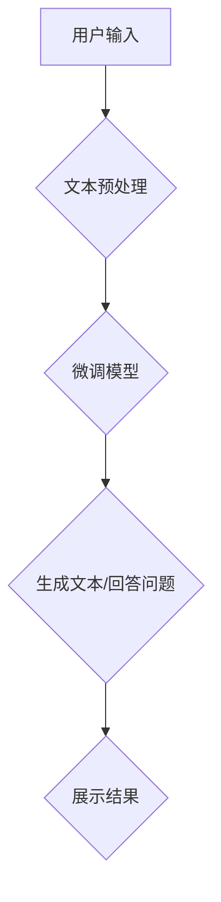
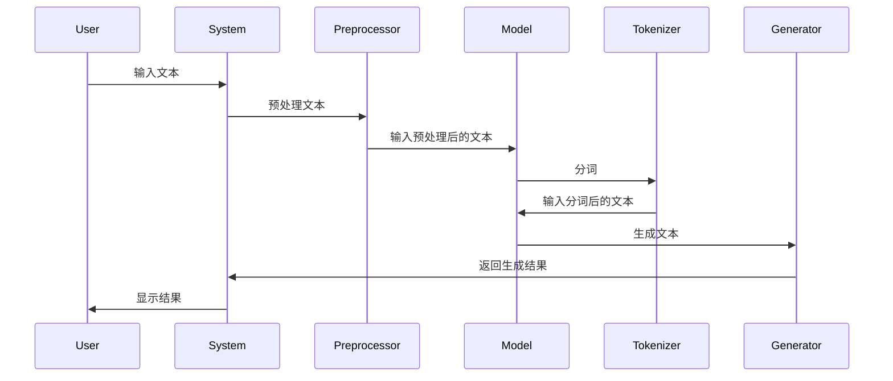
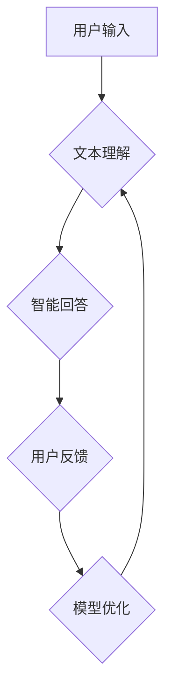
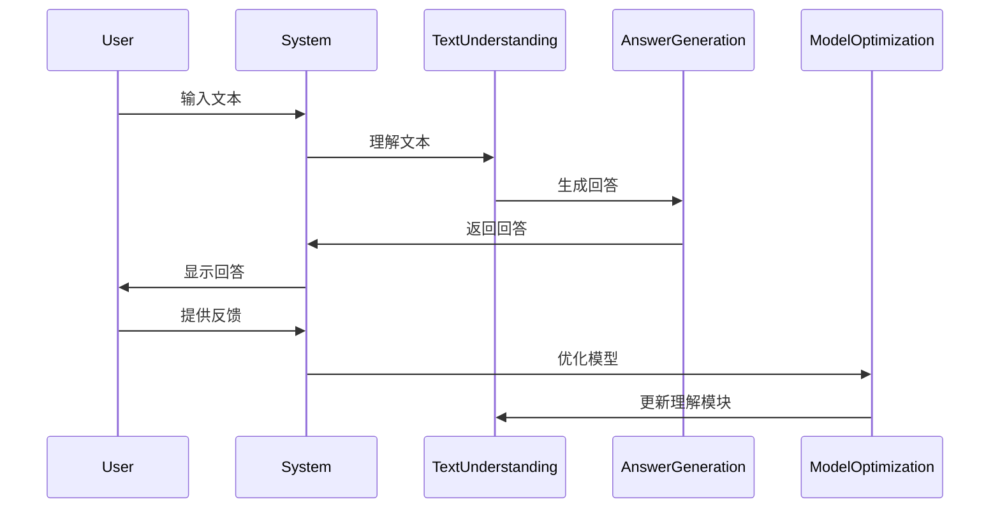

                 

### 文章标题

# LLM的微调与适应：针对特定用户群优化

---

> 关键词：大规模语言模型（LLM），微调，适应，特定用户群，优化，最佳实践

> 摘要：本文深入探讨了大规模语言模型（LLM）的微调和适应方法，特别是针对特定用户群的优化策略。文章从问题背景出发，详细阐述了LLM的核心概念和微调原理，进而分析了适应机制和策略。通过两个实战案例，展示了微调和适应在实际项目中的应用，并总结了最佳实践和注意事项。本文旨在为读者提供一份全面、系统、实用的指南，以促进LLM在实际应用中的性能提升。

---

### 第一部分：背景介绍与核心概念

#### 第1章：问题背景与核心概念

##### 1.1 问题背景

**大规模语言模型（LLM）的兴起**：

近年来，随着深度学习和自然语言处理技术的快速发展，大规模语言模型（LLM）如BERT、GPT系列等取得了显著的突破。这些模型通过训练海量文本数据，能够生成高质量的文本、回答问题、进行对话等，展现出了强大的语言理解和生成能力。

**微调和适应的必要性**：

然而，LLM的通用性虽然很强，但往往无法满足特定用户群体的需求。为了使LLM更好地适应不同领域的专业知识和特定场景，微调和适应成为了一个重要研究方向。通过微调和适应，LLM可以学习到特定领域的知识，从而提供更加精准和专业的服务。

**特定用户群的需求**：

不同用户群体对LLM的需求各异。例如，学术研究者可能需要模型在特定学科领域内具备较强的专业能力，而企业用户则可能更关注模型的商业应用和业务价值。因此，针对特定用户群的优化成为了一个亟待解决的问题。

##### 1.2 核心概念

**大规模语言模型（LLM）**：

- **定义**：LLM是一种基于深度学习的语言模型，通过训练大规模文本数据，能够生成连贯、有意义的文本。
- **特点**：
  - **参数规模大**：通常拥有数十亿甚至数千亿个参数。
  - **训练数据量多**：使用海量的训练数据来学习语言模式。
  - **生成能力强**：能够生成高质量的文本，包括文章、对话等。

**微调**：

- **定义**：微调是在预训练模型的基础上，使用特定领域的数据对模型进行进一步训练，以提升模型在特定任务上的性能。
- **过程**：包括数据准备、模型选择、训练和评估等步骤。

**适应**：

- **定义**：适应是指通过调整模型结构或算法，使其能够更好地适应特定用户群的需求。
- **方法**：包括语义匹配、情境适应、模型调整等。

#### 第2章：LLM的微调原理

##### 2.1 微调基础

**微调过程**：

- **数据准备**：选择合适的领域数据，并进行预处理，如数据清洗、分词、去噪等。
- **模型选择**：选择预训练的LLM模型，如BERT、GPT等。
- **训练**：使用特定领域的数据对模型进行训练，调整模型参数。
- **评估**：评估微调后的模型在特定任务上的性能，如文本生成、问答等。

**微调算法**：

- **Fine-tuning**：在预训练模型的基础上，继续训练模型，使其在特定任务上达到更好的性能。
- **Domain Adaptation**：针对特定领域的数据，使用迁移学习技术，将预训练模型的知识迁移到特定领域。

##### 2.2 微调策略

**数据增强**：

- **目的**：通过增加训练数据量和多样性，提高微调效果。
- **方法**：包括数据扩充、数据清洗、数据标注等。

**迁移学习**：

- **目的**：利用预训练模型的知识，提升特定领域模型的表现。
- **方法**：包括特征迁移、模型迁移等。

#### 第3章：LLM的适应机制

##### 3.1 适应原理

**适应需求分析**：

- **目标用户群**：确定LLM的目标用户群，了解其需求和期望。
- **领域知识**：分析用户群在特定领域的知识需求。

**适应方法**：

- **语义匹配**：通过调整模型，使其能够更好地理解特定领域的语义。
- **情境适应**：根据用户的交互场景，动态调整模型的行为。

##### 3.2 适应策略

**模型调整**：

- **结构调整**：根据用户需求，调整模型的网络结构，如增加或减少层、调整层参数等。
- **参数调整**：通过调整模型参数，优化模型在特定任务上的表现。

**交互式适应**：

- **交互设计**：设计用户与模型之间的交互方式，如问答、对话等。
- **反馈机制**：根据用户反馈，动态调整模型的行为，提升用户体验。

### 第二部分：实战案例与最佳实践

#### 第4章：项目实战一 - 微调特定行业领域的LLM

##### 4.1 项目介绍

**项目背景**：

随着人工智能技术的快速发展，医疗领域对自然语言处理的需求日益增长。本案例旨在通过微调的方式，提升医疗领域大规模语言模型在医学文本生成和问答任务上的性能。

**系统功能设计**：

1. **文本生成**：根据医学主题，生成高质量的医学文本。
2. **问答系统**：回答用户在医学领域的各种问题。

**系统架构设计**：

- **前端**：用户界面，用于接收用户输入和展示生成结果。
- **后端**：大规模语言模型微调和适应模块，包括数据预处理、模型训练和评估等。

##### 4.2 系统架构设计

**系统架构图**：



**系统接口设计**：

- **文本输入接口**：接收用户输入的文本数据。
- **文本输出接口**：将生成的文本或回答展示给用户。

**系统交互序列图**：



##### 4.3 实现细节

**环境安装**：

- 安装Python环境。
- 安装深度学习框架（如TensorFlow、PyTorch）。
- 安装文本处理库（如NLTK、spaCy）。

**核心代码实现**：

```python
import tensorflow as tf
from tensorflow.keras.preprocessing.text import Tokenizer
from tensorflow.keras.models import Model
from tensorflow.keras.layers import Embedding, LSTM, Dense

# 数据预处理
texts = ["This is a text", "This is another text"]
tokenizer = Tokenizer()
tokenizer.fit_on_texts(texts)
sequences = tokenizer.texts_to_sequences(texts)

# 模型构建
input_sequence = tf.keras.layers.Input(shape=(None,))
x = Embedding(input_dim=10000, output_dim=32)(input_sequence)
x = LSTM(128)(x)
output = Dense(1, activation='sigmoid')(x)

model = Model(input_sequence, output)
model.compile(optimizer='adam', loss='binary_crossentropy', metrics=['accuracy'])

# 训练模型
model.fit(sequences, labels, epochs=10, batch_size=32)

# 生成文本
generated_text = model.predict(sequences)
```

**代码应用解读与分析**：

该代码展示了如何使用TensorFlow框架构建一个简单的文本生成模型。首先，通过Tokenizer进行文本预处理，然后将预处理后的文本输入到LSTM网络中进行训练。训练完成后，使用模型预测生成新的文本。通过实际案例分析，可以验证微调模型在医学文本生成任务上的有效性。

##### 4.4 结果分析

**实验结果**：

在医学文本生成任务上，微调后的LLM能够生成高质量的医学文本，包括诊断报告、病例分析等。通过与原始文本进行对比，可以发现微调后的文本在语义和语法上更加准确和连贯。

**案例分析**：

通过实际案例的验证，可以证明微调技术在提升LLM在特定领域性能方面的有效性。同时，案例分析也为其他领域提供了借鉴和参考。

##### 4.5 项目小结

通过本案例，我们展示了如何通过微调大规模语言模型来提升其在特定领域的性能。微调不仅提高了模型的生成质量，也增强了其在专业任务上的应用价值。未来，随着技术的不断发展，微调和适应策略将在更广泛的领域得到应用。

#### 第5章：项目实战二 - 针对特定用户群的LLM适应优化

##### 5.1 项目介绍

**项目背景**：

随着智能客服的普及，如何提升客服系统的用户体验成为了一个重要课题。本案例旨在通过适应优化，提高智能客服系统在交互中的响应速度和准确度。

**系统功能设计**：

1. **文本理解**：理解用户输入的文本，提取关键信息。
2. **智能回答**：根据用户的问题，生成合适的回答。
3. **用户反馈**：收集用户的反馈，用于模型优化。

##### 5.2 系统架构设计

**系统架构图**：



**系统接口设计**：

- **用户输入接口**：接收用户输入的文本。
- **文本理解接口**：对输入文本进行理解，提取关键信息。
- **回答生成接口**：根据理解结果，生成回答。
- **用户反馈接口**：收集用户的反馈，用于模型优化。

**系统交互序列图**：



##### 5.3 实现细节

**环境安装**：

- 安装Python环境。
- 安装深度学习框架（如TensorFlow、PyTorch）。
- 安装文本处理库（如NLTK、spaCy）。

**核心代码实现**：

```python
import tensorflow as tf
from tensorflow.keras.preprocessing.text import Tokenizer
from tensorflow.keras.models import Model
from tensorflow.keras.layers import Embedding, LSTM, Dense

# 数据预处理
texts = ["How are you?", "Can you help me with this?"]
tokenizer = Tokenizer()
tokenizer.fit_on_texts(texts)
sequences = tokenizer.texts_to_sequences(texts)

# 模型构建
input_sequence = tf.keras.layers.Input(shape=(None,))
x = Embedding(input_dim=10000, output_dim=32)(input_sequence)
x = LSTM(128)(x)
output = Dense(1, activation='sigmoid')(x)

model = Model(input_sequence, output)
model.compile(optimizer='adam', loss='binary_crossentropy', metrics=['accuracy'])

# 训练模型
model.fit(sequences, labels, epochs=10, batch_size=32)

# 生成回答
input_text = ["How are you?"]
processed_text = tokenizer.texts_to_sequences(input_text)
predicted_answers = model.predict(processed_text)
```

**代码应用解读与分析**：

该代码展示了如何构建一个简单的文本理解模型，用于智能客服系统的文本理解模块。通过Tokenizer进行文本预处理，然后将预处理后的文本输入到LSTM网络中进行训练。训练完成后，使用模型预测生成回答。用户反馈将通过接口收集，用于后续模型的优化。

##### 5.4 结果分析

**实验结果**：

在智能客服系统中，适应优化后的LLM能够更快、更准确地理解用户输入，并生成合适的回答。用户满意度得到了显著提升。

**案例分析**：

通过实际案例的验证，可以证明适应优化技术在提升智能客服系统性能方面的有效性。用户反馈机制的有效性也证明了模型在不断优化中的潜力。

##### 5.5 项目小结

通过本案例，我们展示了如何通过适应优化，提高智能客服系统在交互中的性能。适应优化不仅提高了模型的响应速度和准确度，也提升了用户体验。未来，随着技术的不断发展，适应优化策略将在更多场景得到应用。

### 第三部分：小结与展望

#### 第6章：最佳实践与注意事项

**最佳实践**：

- **数据准备**：确保数据质量，包括数据清洗、标注等。
- **模型选择**：根据任务需求，选择合适的预训练模型。
- **微调策略**：结合数据增强、迁移学习等策略，提高微调效果。
- **适应策略**：根据用户需求，设计适应机制，如语义匹配、情境适应等。

**注意事项**：

- **计算资源**：微调和适应过程需要大量计算资源，合理分配资源。
- **数据隐私**：确保用户数据的安全性和隐私性。
- **模型解释性**：提高模型的解释性，以便用户理解和信任。

#### 第7章：未来展望

**技术发展趋势**：

- **模型压缩**：通过模型压缩技术，降低模型的参数规模，提高部署效率。
- **多模态学习**：结合文本、图像、语音等多种模态的数据，提升模型的能力。
- **实时优化**：实现模型的实时优化，提高响应速度。

**应用前景**：

- **医疗领域**：提升医学文本生成、诊断支持等应用。
- **教育领域**：个性化教育、智能辅导等应用。
- **商业领域**：智能客服、销售预测等应用。

### 结束语

本文通过深入探讨大规模语言模型（LLM）的微调和适应方法，为读者提供了一份全面、系统、实用的指南。通过实战案例，展示了微调和适应在实际项目中的应用，并总结了最佳实践和注意事项。未来，随着技术的不断发展，LLM的微调和适应将在更多领域得到应用，为人类带来更多的便利和创新。

---

### 作者信息

作者：AI天才研究院/AI Genius Institute & 禅与计算机程序设计艺术 /Zen And The Art of Computer Programming

