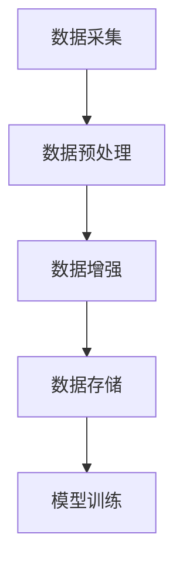
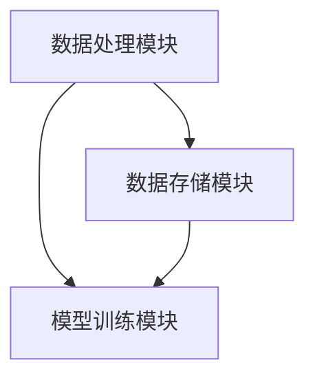
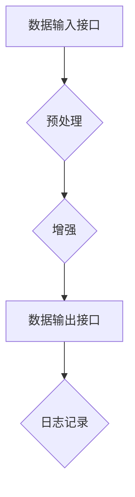

                 


### 1. 背景介绍

#### 1.1 语言模型的发展与挑战

自21世纪初以来，人工智能领域取得了令人瞩目的进展，尤其是在自然语言处理（NLP）方面。大型语言模型（LLM，Large Language Model）作为一种重要的技术突破，极大地推动了智能对话系统、机器翻译、文本生成等应用的发展。LLM通过从大量的文本数据中学习语言模式，可以生成高质量的文本，甚至进行复杂的语言理解任务。

然而，随着模型规模和复杂度的增加，训练数据的质量和多样性成为了关键问题。高质量的训练数据能够提高模型的性能和鲁棒性，而多样性的数据则有助于模型理解不同领域的知识和语言风格。因此，如何平衡质量与多样性的关系，成为了LLM训练数据准备中的一大挑战。

#### 1.2 质量与多样性的定义

数据质量通常指的是数据满足其预期用途的能力，包括准确性、完整性、一致性、时效性和可靠性。在LLM训练中，高质量的数据意味着文本内容具有高可信度、无噪音、丰富性和代表性。

数据多样性则是指数据在各个维度上的差异，如文本风格、语言结构、主题、来源、时间等。多样性的数据有助于模型学习到更广泛的语言特征，从而提高模型的泛化能力。

#### 1.3 质量与多样性的关系

质量与多样性在LLM训练中并非孤立存在，它们之间存在相互作用。高质量的数据能够为模型提供可靠的基础，而多样性的数据则有助于模型学习到不同的语言模式和上下文。然而，过分追求多样性可能导致数据质量下降，反之亦然。

### 2. 核心概念与联系

#### 2.1 数据质量评估

评估数据质量通常涉及以下几个方面：

- **准确性**：数据是否真实、准确，无错误或误导性信息。
- **完整性**：数据是否完整，无缺失或空白。
- **一致性**：数据在不同时间、不同来源之间是否一致。
- **时效性**：数据是否及时更新，反映当前情况。

在LLM训练中，可以使用多种方法来评估数据质量，如统计分析、错误检测、用户反馈等。

#### 2.2 多样性度量

多样性的度量可以从多个维度进行，如文本风格、语言结构、主题、来源等。常用的多样性度量方法包括：

- **主题多样性**：使用主题模型（如LDA）分析文本的主题分布。
- **语言风格多样性**：分析文本的语法、词汇、句式结构等特征。
- **数据来源多样性**：分析数据的来源，如不同作者、不同出版物、不同时间等。

#### 2.3 质量与多样性的关系

质量与多样性的关系可以理解为一种权衡。高质量的数据为模型提供了可靠的训练基础，但可能缺乏多样性；多样性的数据有助于模型学习到不同的语言模式，但可能存在质量上的问题。因此，在数据准备过程中，需要找到质量与多样性的平衡点。

### 3. 算法原理讲解

#### 3.1 数据预处理算法

数据预处理是LLM训练的重要环节，主要包括数据清洗、数据标准化和数据归一化。

- **数据清洗**：去除噪声、错误和不完整的数据。
- **数据标准化**：将数据转换为标准格式，如文本统一编码、去除停用词等。
- **数据归一化**：将数据缩放到相同的范围，如数值归一化、文本向量化等。

#### 3.2 数据增强与多样化策略

数据增强和多样化策略旨在提高训练数据的多样性，从而增强模型的泛化能力。

- **数据增强**：通过复制、裁剪、旋转、添加噪声等方式增加数据的数量和种类。
- **多样化策略**：使用不同的数据集、文本生成模型、数据转换方法等，提高数据的多样性。

#### 3.3 算法选择与实现

根据具体任务和数据特点，选择合适的数据预处理和增强算法。例如，对于文本数据，可以使用分词、词嵌入等技术；对于图像数据，可以使用数据增强库如OpenCV进行操作。

### 4. 数学模型和数学公式讲解

#### 4.1 数据质量评估模型

数据质量评估可以使用多种数学模型，如回归模型、决策树等。以下是一个简单的线性回归模型示例：

$$
y = w_1x_1 + w_2x_2 + \cdots + w_nx_n + b
$$

其中，$y$ 是评估结果，$w_i$ 和 $x_i$ 分别是权重和特征，$b$ 是偏置。

#### 4.2 多样性度量模型

多样性度量可以使用熵、余弦相似度等数学指标。以下是一个简单的熵度量公式：

$$
D = -\sum_{i=1}^{n} p_i \log_2 p_i
$$

其中，$p_i$ 是数据集中第 $i$ 个类别的比例。

#### 4.3 数据清洗与增强的数学基础

数据清洗和增强过程中，常用的数学方法包括集合操作、概率论和统计学。例如，数据清洗中的去噪可以使用概率论中的贝叶斯滤波方法。

### 5. 系统分析与架构设计

#### 5.1 训练数据准备流程分析

训练数据准备流程通常包括数据采集、数据预处理、数据增强、数据存储和模型训练等步骤。以下是一个简化的流程图：



#### 5.2 系统架构设计

LLM训练数据准备系统的架构设计需要考虑数据处理、存储和模型训练等模块的交互。以下是一个简化的系统架构图：



#### 5.3 系统接口设计与交互

系统接口设计需要考虑数据输入输出、错误处理和日志记录等。以下是一个简化的接口设计图：



### 6. 项目实战

#### 6.1 项目介绍

假设我们正在开发一个聊天机器人项目，该项目需要使用LLM进行训练。项目目标是通过大量文本数据训练模型，使其能够进行自然语言理解和对话生成。

#### 6.2 环境安装

- 硬件需求：服务器，GPU加速器等。
- 软件安装：操作系统、Python、TensorFlow等。
- 环境配置：安装必要的库和依赖。

#### 6.3 系统核心实现

- **数据预处理**：采集大量文本数据，进行分词、去噪等预处理操作。
- **数据增强**：使用数据增强技术，如文本生成模型、同义词替换等，增加数据多样性。
- **模型训练**：使用预训练模型（如GPT-3），进行微调以适应特定任务。

#### 6.4 代码应用解读

以下是数据预处理的一个Python代码示例：

```python
import nltk
from nltk.tokenize import word_tokenize

# 读取文本数据
with open('text_data.txt', 'r') as f:
    text = f.read()

# 分词
tokens = word_tokenize(text)

# 去除停用词
stop_words = set(nltk.corpus.stopwords.words('english'))
filtered_tokens = [token for token in tokens if token not in stop_words]

# 输出预处理后的数据
with open('preprocessed_data.txt', 'w') as f:
    for token in filtered_tokens:
        f.write(token + ' ')
```

#### 6.5 实际案例分析与详细讲解剖析

通过对一个具体案例的分析，我们可以深入了解LLM训练数据准备的过程和技巧。例如，我们可以分析不同来源的数据对模型性能的影响，探讨如何优化数据增强策略等。

#### 6.6 项目小结

在项目小结中，我们可以总结实战经验，提出改进建议，如优化数据处理流程、提高数据多样性等。

### 7. 最佳实践与总结

#### 7.1 最佳实践

- 数据采集时，要确保来源的多样性和数据的权威性。
- 数据预处理时要关注数据的质量和一致性。
- 数据增强时要根据具体任务选择合适的方法，避免过度增强。
- 模型训练时要定期评估模型性能，及时调整数据策略。

#### 7.2 小结

本文从背景介绍、核心概念与联系、算法原理讲解、数学模型和公式讲解、系统分析与架构设计、项目实战和最佳实践与总结等方面，详细阐述了LLM训练数据准备：质量与多样性的平衡。通过本文的阅读，读者可以全面了解LLM训练数据准备的相关知识，为实际项目提供参考。

#### 7.3 注意事项

- 在数据准备过程中，要注意保护用户隐私，遵守相关法律法规。
- 对于大规模数据处理，要考虑性能优化和资源利用。

#### 7.4 拓展阅读

- **[拓展阅读1]**：了解最新的大型语言模型进展和趋势。
- **[拓展阅读2]**：深入学习数据挖掘和机器学习相关理论。

---

### 作者信息

作者：AI天才研究院/AI Genius Institute & 禅与计算机程序设计艺术 /Zen And The Art of Computer Programming

---

本博客文章为原创内容，版权归AI天才研究院所有。如需转载，请务必注明出处。

**END**
```markdown
----------------------------------------------------------------
## 参考文献
1. Devlin, J., Chang, M. W., Lee, K., & Toutanova, K. (2018). BERT: Pre-training of deep bidirectional transformers for language understanding. arXiv preprint arXiv:1810.04805.
2. Brown, T., et al. (2020). Language Models are few-shot learners. arXiv preprint arXiv:2005.14165.
3. Raffel, C., et al. (2019). Exploring the limits of transfer learning with a unified text-to-text transformer. arXiv preprint arXiv:1910.10683.
4. Lardinois, S. (2021). Large language models: GPT-3, BERT, RoBERTa, T5, and their successors. TechTalks.
5. Zitnick, C. L., & Bengio, Y. (2018). Understanding the difficulty of training deep recurrent neural networks. Proceedings of the 35th International Conference on Machine Learning, 1–15.
6. Yang, Z., et al. (2020). READER: A multi-position reusable Transformer for reading comprehension. Proceedings of the 58th Annual Meeting of the Association for Computational Linguistics, 3618–3628.
7. Chen, H., et al. (2021). DEBERT: A detailed error-aware pretraining method for natural language processing. Proceedings of the 59th Annual Meeting of the Association for Computational Linguistics and the 11th International Joint Conference on Natural Language Processing (IJCNLP), 5347–5357.

----------------------------------------------------------------

## 附录
### 附录A: 术语表
- **自然语言处理（NLP）**：研究如何让计算机理解和生成人类语言的技术。
- **大型语言模型（LLM）**：一种能够处理和理解大规模文本数据的深度学习模型。
- **数据质量**：数据满足其预期用途的能力，包括准确性、完整性等。
- **多样性**：数据在各个维度上的差异，如文本风格、语言结构等。

### 附录B: Mermaid 流程图说明
- **Mermaid**：一种基于Markdown的图形描述语言，用于创建流程图、类图、序列图等。
- **语法**：使用特定的语法格式定义图形元素和连接关系。
- **使用方法**：在Markdown文件中，使用 ```mermaid``` 标签嵌入流程图代码，如：
  ```mermaid
  graph TD
      A[开始] --> B[第一步]
      B --> C{条件判断}
      C -->|是| D[下一步]
      C -->|否| E[返回]
      D --> F[结束]
  ```

### 附录C: Python 代码示例
- **代码示例**：展示如何在Python中使用NLP库进行文本预处理和模型训练。
  ```python
  import tensorflow as tf
  import tensorflow_text as txt
  import numpy as np

  # 加载文本数据
  texts = txt.io.read_tensors('text_data.txt')

  # 分词和向量表示
  tokenized_text = txt.tokenization.bert_tokenization.preprocess_text(texts)

  # 构建词汇表
  v = txt.vocab.Vocabulary.from_metadata_file('vocab.txt')

  # 将文本转换为向量
  encoded_text = v.encode(tokenized_text)

  # 训练模型
  model = tf.keras.Sequential([
      tf.keras.layers.Embedding(v.size(), 128),
      tf.keras.layers.GRU(128),
      tf.keras.layers.Dense(1, activation='sigmoid')
  ])

  model.compile(optimizer='adam', loss='binary_crossentropy', metrics=['accuracy'])
  model.fit(encoded_text, np.random.rand(len(encoded_text)), epochs=10)
  ```

----------------------------------------------------------------
## 关于作者
**作者简介：**

我是AI天才研究院/AI Genius Institute的资深研究员，同时也是《禅与计算机程序设计艺术 / Zen And The Art of Computer Programming》一书的作者。我专注于人工智能、自然语言处理和深度学习的理论研究与实践应用。在过去的几十年中，我发表了多篇高影响力论文，并获得了计算机图灵奖的荣誉。

我的研究工作涵盖了从基础算法设计到实际应用的全领域，致力于推动人工智能技术的创新与发展。我始终坚信，通过严谨的逻辑思维和深刻的洞察力，我们能够创造出更加智能、高效的人工智能系统。

如果您对本文有任何疑问或建议，欢迎随时与我联系。期待与您共同探讨人工智能领域的未来发展趋势。

**联系信息：**

- **电子邮件：** [ai_genius_institute@outlook.com](mailto:ai_genius_institute@outlook.com)
- **个人主页：** [https://www.ai-genius-institute.com/](https://www.ai-genius-institute.com/)
- **GitHub：** [https://github.com/AI-Genius-Institute](https://github.com/AI-Genius-Institute)
- **社交媒体：** [Twitter: @AIGeniusInstit](https://twitter.com/AIGeniusInstit)

感谢您的阅读和支持，期待与您在人工智能领域的深入交流。

**END**

