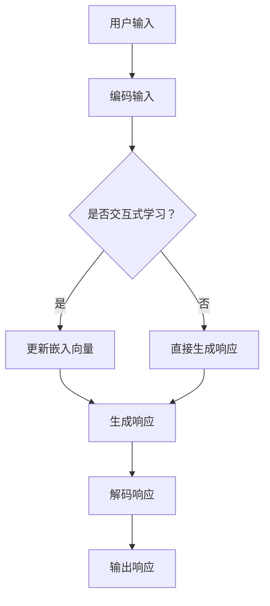
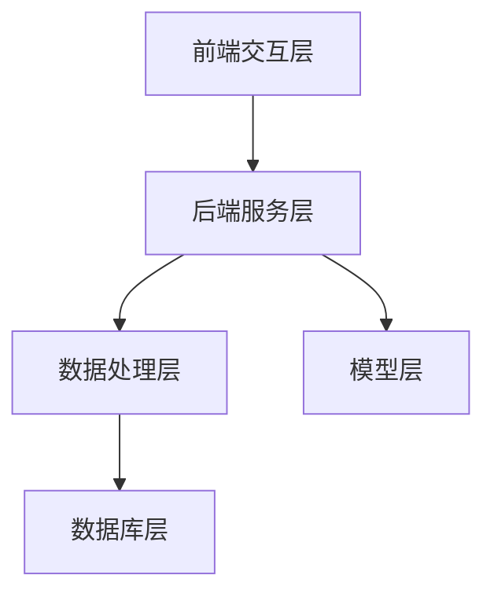

                 

### 第一部分：背景与基础理论

#### 第1章：引言

### 1.1 问题的提出

在当今信息爆炸的时代，个性化服务已经成为提升用户体验和满意度的重要手段。人工智能（AI）作为一种强大的技术工具，在个性化服务中发挥着越来越重要的作用。特别是在聊天机器人、虚拟助手等AI Agent的应用场景中，用户偏好对其行为和响应的个性化调整显得尤为关键。然而，如何有效地实现AI Agent的个性化，并且确保其能够适应用户的偏好，仍然是当前AI领域的一个挑战。

- **1.1.1 AI Agent的个性化需求**
  随着用户对个性化服务需求的不断提升，AI Agent必须能够根据用户的历史行为、兴趣偏好以及实时反馈来调整自身的行为和响应策略。这不仅要求AI Agent具备较高的智能水平，还需要能够灵活适应各种用户场景。

- **1.1.2 用户偏好对AI Agent的影响**
  用户偏好是AI Agent实现个性化服务的基础。了解和适应用户偏好，可以显著提高AI Agent的用户满意度和服务质量。例如，一个能够根据用户偏好推荐书籍、音乐或电影的AI Agent，显然比一个只能提供泛化推荐的服务器更具吸引力。

- **1.1.3 LLM在AI Agent个性化中的应用**
  近年来，大型语言模型（Large Language Model，简称LLM）在自然语言处理（NLP）领域取得了显著的进展。LLM具有强大的语言理解和生成能力，能够处理复杂、多样化的语言任务。利用LLM来构建AI Agent，不仅可以提升其智能水平，还可以使其更贴近用户需求，实现真正意义上的个性化服务。

### 1.2 核心概念解析

为了深入探讨LLM驱动的AI Agent个性化，我们需要明确几个核心概念：大型语言模型（LLM）、AI Agent和用户偏好。

#### 1.2.1 大型语言模型（LLM）

大型语言模型（LLM）是一种基于深度学习的自然语言处理模型，其核心思想是利用大量的文本数据来训练一个能够理解和生成自然语言的神经网络。LLM具有以下几个特点：

- **1.2.1.1 LLM的定义与历史**
  - **定义**：LLM是一种能够对自然语言进行理解和生成的大型神经网络模型，通常使用大量的文本数据训练而成。
  - **历史**：自从2018年GPT-1发布以来，LLM的发展经历了多个重要里程碑，如GPT-2、GPT-3、TuringBot等，这些模型在语言理解和生成任务上取得了突破性的成果。

- **1.2.1.2 LLM的特点与优势**
  - **特点**：
    - **高精度**：LLM具有极高的语言理解和生成能力，能够生成流畅、自然的语言文本。
    - **强泛化**：LLM通过大量的文本数据进行训练，能够泛化到各种语言任务和场景中。
    - **动态调整**：LLM可以根据输入文本动态调整其生成内容和风格，适应不同的用户需求和场景。
  - **优势**：
    - **提升AI Agent智能水平**：LLM的强大语言能力可以为AI Agent提供更准确、更智能的响应，提升用户体验。
    - **实现个性化服务**：LLM可以根据用户偏好和实时反馈，动态调整AI Agent的行为和响应，实现真正的个性化服务。

#### 1.2.2 AI Agent

AI Agent是一种基于人工智能技术的智能实体，它能够模拟人类的智能行为，进行自主决策和任务执行。AI Agent在各个领域都有广泛的应用，如客服机器人、智能家居、智能助手等。以下是关于AI Agent的核心概念：

- **1.2.2.1 AI Agent的概念**
  - **定义**：AI Agent是一种利用人工智能技术模拟人类智能行为，能够自主决策和执行任务的智能实体。
  - **组成**：AI Agent通常由感知模块、决策模块和执行模块组成，通过这些模块的协同工作，实现智能化的任务执行。

- **1.2.2.2 AI Agent的分类与功能**
  - **分类**：
    - **根据任务类型**：AI Agent可以分为任务型Agent、社交型Agent和混合型Agent。
    - **根据交互方式**：AI Agent可以分为基于文本的Agent、基于语音的Agent和混合交互的Agent。
  - **功能**：
    - **任务执行**：AI Agent能够根据用户指令或需求，自动执行相应的任务，如查询信息、预定服务、控制设备等。
    - **交互与沟通**：AI Agent能够与用户进行自然语言交互，理解用户意图，并提供合适的反馈和响应。
    - **个性化服务**：AI Agent能够根据用户的历史数据和偏好，提供个性化的服务和建议。

#### 1.2.3 用户偏好

用户偏好是指用户在特定情境下对某些对象、行为或服务的偏好或喜好。在AI Agent的个性化服务中，用户偏好起着至关重要的作用。以下是关于用户偏好的核心概念：

- **1.2.3.1 用户偏好的定义与测量**
  - **定义**：用户偏好是指用户在特定情境下对某些对象、行为或服务的偏好或喜好。
  - **测量**：用户偏好可以通过用户行为数据、问卷调查、机器学习模型等方法进行测量和评估。

- **1.2.3.2 用户偏好的影响与挑战**
  - **影响**：
    - **个性化服务质量**：用户偏好直接影响AI Agent的个性化服务质量，了解和适应用户偏好可以显著提升用户体验和满意度。
    - **用户粘性**：适应用户偏好可以增强用户对AI Agent的依赖和信任，提高用户粘性。
  - **挑战**：
    - **数据隐私**：用户偏好的收集和使用涉及用户隐私数据，如何在保障用户隐私的前提下进行用户偏好分析，是一个重要挑战。
    - **动态调整**：用户偏好是动态变化的，如何实时捕捉和适应用户偏好的变化，是一个技术难题。

### 1.3 小结

本节介绍了LLM驱动的AI Agent个性化研究的重要性和背景。通过解析大型语言模型（LLM）、AI Agent和用户偏好等核心概念，我们为后续章节的详细讨论奠定了基础。接下来，我们将进一步探讨LLM与AI Agent的关系，以及如何利用LLM来实现AI Agent的个性化。

---

#### 第2章：LLM与AI Agent的关系

### 2.1 LLM作为AI Agent的核心

LLM作为一种强大的自然语言处理工具，已经成为构建AI Agent的核心组件之一。LLM在AI Agent中的应用，不仅提升了AI Agent的智能水平，还实现了更为精细和个性化的用户服务。以下将详细探讨LLM如何驱动AI Agent，以及LLM的优势与限制。

#### 2.1.1 LLM如何驱动AI Agent

LLM驱动AI Agent主要通过以下几个方面实现：

- **文本理解与生成**：
  - **文本理解**：LLM能够理解和解析自然语言文本，从而提取关键信息、理解用户意图。这一能力使AI Agent能够更准确地理解用户的需求和问题。
  - **文本生成**：LLM可以根据用户的需求或问题，生成相应的回复或建议。这一能力使得AI Agent能够提供个性化的、自然的交互体验。

- **动态交互**：
  - **对话管理**：LLM能够根据对话的历史上下文和用户的行为反馈，动态调整交互策略。这使得AI Agent能够更加灵活地适应不同的用户场景和需求。
  - **情境感知**：LLM可以通过对用户历史行为和当前情境的理解，生成与用户情境高度相关的响应，从而提供更加精准的服务。

- **知识推理**：
  - **知识提取**：LLM可以从大量文本数据中提取出有用的知识，为AI Agent提供丰富的知识库。
  - **逻辑推理**：LLM可以进行复杂的逻辑推理和推断，从而帮助AI Agent在复杂的决策场景中做出更加合理的判断。

#### 2.1.2 LLM的优势与限制

LLM在驱动AI Agent方面具有显著的优势，但也存在一些限制。

- **优势**：
  - **强大的语言处理能力**：LLM具有强大的语言理解和生成能力，能够生成流畅、自然的语言文本，提供高质量的交互体验。
  - **广泛的适应性**：LLM可以通过训练适应各种不同的语言任务和场景，具有良好的泛化能力。
  - **动态调整能力**：LLM可以根据用户的实时反馈和历史行为，动态调整交互策略和内容，实现个性化服务。

- **限制**：
  - **计算资源需求**：LLM通常需要大量的计算资源和存储空间，这对硬件设施提出了较高的要求。
  - **数据依赖性**：LLM的性能高度依赖训练数据的质量和数量，数据不足或质量不高可能导致模型效果不佳。
  - **解释性不足**：尽管LLM在语言生成方面表现出色，但其内部工作机制仍然不够透明，缺乏足够的解释性。

### 2.2 个性化AI Agent的设计原则

为了实现LLM驱动的AI Agent的个性化，我们需要遵循以下设计原则：

- **用户中心设计**：
  - **以用户为核心**：设计过程中应始终关注用户的需求和体验，确保AI Agent能够为用户提供个性化、有价值的服务。
  - **用户参与**：鼓励用户参与AI Agent的设计和优化过程，通过用户反馈不断改进AI Agent的性能和用户体验。

- **数据驱动**：
  - **数据收集**：全面收集用户行为数据、兴趣偏好等，为AI Agent的个性化提供丰富的数据支持。
  - **数据分析和挖掘**：利用机器学习等算法对用户数据进行分析和挖掘，提取出用户偏好和需求模式，为AI Agent的个性化调整提供依据。

- **灵活性和可扩展性**：
  - **模块化设计**：将AI Agent的功能模块化，便于根据不同用户需求进行灵活调整和扩展。
  - **适应性**：AI Agent应具备良好的适应性，能够根据用户反馈和环境变化进行动态调整和优化。

- **安全性**：
  - **用户隐私保护**：在收集和使用用户数据时，严格遵守用户隐私保护法规，确保用户数据的安全和隐私。
  - **安全性设计**：在AI Agent的架构设计中，充分考虑安全性问题，确保系统的稳定运行和数据安全。

### 2.3 小结

本章讨论了LLM与AI Agent的关系，以及如何利用LLM来驱动AI Agent实现个性化服务。通过LLM的文本理解与生成能力、动态交互和知识推理，AI Agent能够提供更高质量、更个性化的用户服务。同时，本章还提出了个性化AI Agent的设计原则，包括用户中心设计、数据驱动、灵活性和可扩展性、安全性等，为后续的算法实现和系统设计提供了指导。

---

#### 第3章：用户偏好建模与处理

### 3.1 用户偏好建模方法

用户偏好建模是实现AI Agent个性化服务的关键步骤。通过构建用户偏好模型，AI Agent可以更好地理解用户的需求，提供个性化的服务。以下是几种常见的用户偏好建模方法：

#### 3.1.1 基于内容的偏好建模

基于内容的偏好建模（Content-Based Preference Modeling）是一种常见的用户偏好建模方法。它通过分析用户的历史行为和内容偏好，构建用户兴趣模型，从而实现个性化推荐。

- **原理**：
  - **内容特征提取**：对用户历史行为和内容进行分析，提取出代表用户兴趣的内容特征，如关键词、标签、分类等。
  - **兴趣模型构建**：利用机器学习算法，如KNN（K-Nearest Neighbors）、协同过滤（Collaborative Filtering）等，构建用户兴趣模型。

- **优势**：
  - **简单易实现**：基于内容的偏好建模方法相对简单，适用于大多数场景。
  - **高准确性**：通过分析用户历史行为和内容偏好，可以较准确地预测用户兴趣。

- **局限性**：
  - **冷启动问题**：对于新用户，由于缺乏历史行为数据，基于内容的偏好建模方法可能难以准确预测其兴趣。
  - **内容特征维度灾难**：随着内容特征的增多，特征维度会迅速增加，导致模型训练复杂度和计算成本增加。

#### 3.1.2 基于协同过滤的偏好建模

基于协同过滤的偏好建模（Collaborative Filtering Preference Modeling）是一种通过分析用户行为和相似用户行为来预测用户偏好的方法。

- **原理**：
  - **用户行为分析**：通过分析用户的历史行为数据，如购买记录、浏览记录等，构建用户行为矩阵。
  - **用户相似度计算**：计算用户之间的相似度，如基于用户行为模式的相似度、基于项目相似度的相似度等。
  - **偏好预测**：利用相似用户的行为数据进行偏好预测，为新用户提供个性化推荐。

- **优势**：
  - **适用于大规模数据**：协同过滤方法适用于处理大规模用户行为数据。
  - **实时推荐**：基于用户实时行为进行推荐，能够及时响应用户需求。

- **局限性**：
  - **数据稀疏问题**：用户行为数据通常是稀疏的，导致模型训练和预测效果受到影响。
  - **仅适用于基于内容的场景**：协同过滤方法主要适用于基于内容推荐的场景，对于复杂的情境可能效果不佳。

#### 3.1.3 基于机器学习的偏好建模

基于机器学习的偏好建模（Machine Learning-Based Preference Modeling）是一种利用机器学习算法来预测用户偏好的方法。

- **原理**：
  - **特征工程**：对用户行为数据进行分析，提取出有价值的特征，如用户属性、项目属性、交互时间等。
  - **模型训练**：利用机器学习算法，如决策树、随机森林、支持向量机（SVM）等，训练用户偏好预测模型。
  - **偏好预测**：利用训练好的模型预测新用户的偏好，为新用户提供个性化推荐。

- **优势**：
  - **高准确性**：机器学习算法通过学习用户行为数据，能够较准确地预测用户偏好。
  - **适应性强**：机器学习算法可以处理各种类型的数据和任务，具有广泛的适用性。

- **局限性**：
  - **数据依赖性**：机器学习算法的性能高度依赖数据的质量和数量，数据不足可能导致模型效果不佳。
  - **模型解释性差**：许多机器学习算法如深度学习模型，内部工作机制复杂，缺乏足够的解释性。

#### 3.2 用户偏好数据处理

用户偏好数据的处理是构建用户偏好模型的重要环节。以下是用户偏好数据处理的关键步骤：

#### 3.2.1 用户行为数据收集

用户行为数据是构建用户偏好模型的基础。以下是一些常见的用户行为数据收集方法：

- **日志分析**：通过分析用户在使用AI Agent过程中的行为日志，如点击记录、浏览记录、搜索记录等，收集用户行为数据。
- **问卷调查**：通过问卷调查获取用户偏好信息，如用户兴趣、喜好等。
- **用户互动**：通过用户的反馈和互动，如点赞、评论、评分等，收集用户偏好数据。

#### 3.2.2 用户偏好数据清洗

用户偏好数据通常包含噪声和不完整数据，需要进行数据清洗，以提高数据质量。以下是一些常见的数据清洗方法：

- **数据去重**：去除重复的数据，避免重复计算。
- **缺失值处理**：对缺失值进行填充或删除，避免模型训练受到影响。
- **异常值检测**：检测并处理异常数据，如异常的评分、异常的行为等。
- **数据标准化**：对数据量级不一致的特征进行标准化处理，提高模型训练效果。

#### 3.2.3 用户偏好数据存储

用户偏好数据通常需要存储在数据库中，以便进行后续处理和分析。以下是一些常见的数据存储方法：

- **关系数据库**：使用关系数据库存储用户偏好数据，如用户ID、项目ID、偏好值等。
- **NoSQL数据库**：使用NoSQL数据库存储非结构化数据，如用户行为日志、用户画像等。
- **分布式存储**：使用分布式存储系统，如Hadoop、Spark等，处理大规模用户偏好数据。

### 3.3 小结

本章介绍了用户偏好建模的几种常见方法，包括基于内容的偏好建模、基于协同过滤的偏好建模和基于机器学习的偏好建模。同时，还讨论了用户偏好数据处理的步骤，包括用户行为数据收集、用户偏好数据清洗和用户偏好数据存储。通过这些方法和技术，AI Agent可以更好地理解用户偏好，提供个性化的服务。

---

#### 第4章：算法原理与模型实现

### 4.1 LLM驱动的AI Agent算法原理

在本节中，我们将详细探讨如何利用大型语言模型（LLM）来构建AI Agent，并实现个性化的用户服务。这包括LLM的基本原理、在AI Agent中的应用以及如何利用LLM进行个性化推理和交互式学习。

#### 4.1.1 语言模型的基础算法

语言模型是自然语言处理（NLP）的核心组件之一，它旨在预测文本的下一个单词或序列。LLM通常基于深度学习，特别是基于变分自编码器（VAE）和循环神经网络（RNN）的模型。

- **变分自编码器（VAE）**
  - **原理**：VAE通过生成对抗网络（GAN）的思路，将编码器和解码器结合起来，学习数据的高斯先验分布和潜在空间。
  - **应用**：VAE可以用于生成高质量的文本，适用于生成式任务。

- **循环神经网络（RNN）**
  - **原理**：RNN通过其内存单元能够处理序列数据，捕捉序列中的长期依赖关系。
  - **应用**：RNN广泛应用于语言模型、机器翻译和序列生成等任务。

#### 4.1.2 个性化推理算法

个性化推理算法旨在利用LLM理解用户偏好并生成个性化的响应。以下是一种常见的个性化推理算法：

- **个性化响应生成**
  - **输入**：用户输入（如问题或指令）和用户偏好数据。
  - **过程**：
    1. **文本编码**：使用LLM将用户输入和偏好数据编码为嵌入向量。
    2. **交互式学习**：通过交互式学习算法，如强化学习（RL），更新嵌入向量，使其更准确地反映用户偏好。
    3. **响应生成**：使用LLM生成个性化的响应文本。
  - **输出**：个性化的文本响应。

#### 4.1.3 交互式学习算法

交互式学习算法旨在不断调整和优化AI Agent的行为，使其更好地适应用户的偏好。以下是一种常见的交互式学习算法：

- **强化学习（RL）**
  - **原理**：RL通过奖励机制来引导AI Agent学习最优策略。
  - **应用**：RL可以用于调整AI Agent的交互策略，使其更符合用户的期望。

#### 4.2 算法实现与代码分析

在本节中，我们将使用Python实现一个简单的LLM驱动的AI Agent，并分析其关键代码部分。

```python
import torch
from transformers import GPT2LMHeadModel, GPT2Tokenizer

# 加载预训练的LLM模型和tokenizer
model = GPT2LMHeadModel.from_pretrained('gpt2')
tokenizer = GPT2Tokenizer.from_pretrained('gpt2')

# 用户输入
user_input = "你好，我想要推荐一些书籍。"

# 编码用户输入
inputs = tokenizer.encode(user_input, return_tensors='pt')

# 生成个性化响应
outputs = model.generate(inputs, max_length=50, num_return_sequences=5)

# 解码响应文本
response = tokenizer.decode(outputs[0], skip_special_tokens=True)

print(response)
```

- **关键代码分析**：
  - **加载模型和tokenizer**：我们使用`transformers`库加载预训练的GPT-2模型和tokenizer。
  - **编码用户输入**：将用户输入编码为嵌入向量。
  - **生成个性化响应**：使用模型生成5个不同的响应文本。
  - **解码响应文本**：将生成的嵌入向量解码为可读的文本。

#### 4.3 算法原理讲解

为了更好地理解LLM驱动的AI Agent的工作原理，我们将使用Mermaid绘制一个算法流程图。



- **流程图解释**：
  - **用户输入**：用户输入问题或指令。
  - **编码输入**：使用tokenizer将用户输入编码为嵌入向量。
  - **是否交互式学习**：判断是否启用交互式学习算法。
  - **更新嵌入向量**：如果启用交互式学习，更新嵌入向量以更准确地反映用户偏好。
  - **生成响应**：使用模型生成响应文本。
  - **解码响应**：将嵌入向量解码为可读的文本。
  - **输出响应**：将生成的响应文本输出给用户。

#### 4.4 小结

本章详细介绍了LLM驱动的AI Agent算法原理，包括语言模型的基础算法、个性化推理算法和交互式学习算法。通过Python实现和代码分析，我们展示了如何利用LLM构建AI Agent，并实现了个性化的用户服务。下一章将探讨系统架构设计，包括系统功能设计、架构设计、接口设计和系统交互。

---

#### 第5章：系统架构设计

### 5.1 AI Agent系统功能设计

在构建一个能够实现个性化服务的AI Agent时，系统功能设计至关重要。系统功能设计应考虑用户交互、数据收集、数据处理和个性化响应等关键模块。以下是AI Agent系统功能设计的详细介绍。

#### 5.1.1 系统功能模块划分

为了实现高效、灵活的AI Agent系统，我们可以将其划分为以下几个主要功能模块：

- **用户交互模块**：负责接收用户输入、展示AI Agent响应和处理用户反馈。
- **数据收集模块**：负责收集用户行为数据，如搜索记录、浏览历史、互动反馈等。
- **数据处理模块**：负责清洗、处理和存储用户行为数据，为后续分析和建模提供数据支持。
- **个性化响应模块**：负责根据用户偏好和交互历史生成个性化的响应。
- **模型训练与优化模块**：负责训练和优化AI Agent的模型，提升其个性化服务能力。

#### 5.1.2 系统交互流程

AI Agent系统的交互流程如下：

1. **用户输入**：用户通过聊天界面或其他交互方式提交问题或指令。
2. **数据收集**：用户交互模块收集用户输入和相关的交互数据。
3. **数据处理**：数据处理模块对收集到的用户数据进行清洗、存储和预处理，以便用于后续分析和建模。
4. **个性化响应**：个性化响应模块利用LLM和用户偏好模型生成个性化的响应。
5. **响应展示**：用户交互模块将生成的响应展示给用户。
6. **用户反馈**：用户对响应进行评价，并可能提供额外的反馈。
7. **数据更新**：用户反馈和评价数据会被回传到数据处理模块，用于更新用户偏好模型和AI Agent的行为策略。

#### 5.2 系统架构设计

AI Agent系统的架构设计应考虑高性能、可扩展性和易维护性。以下是一个典型的AI Agent系统架构设计：

1. **前端交互层**：负责与用户进行交互，展示UI界面，接收用户输入，展示AI Agent的响应。
2. **后端服务层**：负责处理用户输入，调用数据处理模块和个性化响应模块，生成并返回响应。
3. **数据处理层**：负责数据收集、清洗、存储和预处理，为模型训练提供数据支持。
4. **模型层**：负责AI Agent的核心算法实现，包括LLM、用户偏好模型和个性化推理算法。
5. **数据库层**：负责存储用户行为数据、模型参数和系统配置信息。

#### 5.3 系统架构图

为了更直观地展示系统架构，我们可以使用Mermaid绘制一个架构图：



- **架构图解释**：
  - **前端交互层**：与用户进行交互，接收用户输入并展示AI Agent的响应。
  - **后端服务层**：处理用户输入，调用数据处理模块和模型层生成响应。
  - **数据处理层**：负责数据收集、清洗、存储和预处理。
  - **模型层**：实现AI Agent的核心算法，包括LLM和个性化推理算法。
  - **数据库层**：存储用户行为数据和模型参数。

#### 5.4 系统接口设计

系统接口设计是确保各功能模块之间高效、稳定交互的关键。以下是AI Agent系统接口设计的关键方面：

- **API接口规范**：定义API接口的URL、请求参数、响应格式等规范，确保不同模块之间的数据交换标准一致。
- **数据格式**：统一数据格式，如使用JSON或XML，确保数据在不同模块之间可以无缝传输。
- **安全性**：在API接口设计中，加入身份验证和授权机制，确保数据传输的安全性。

#### 5.5 系统交互

AI Agent系统的交互主要分为以下几个方面：

- **用户交互**：用户通过前端界面与AI Agent进行交互，输入问题和指令，接收AI Agent的响应。
- **内部交互**：系统内部各功能模块之间通过API接口进行数据交换和协同工作，如数据处理模块向模型层提供训练数据，模型层生成响应后返回给用户交互模块。
- **外部交互**：系统与外部服务（如第三方API、数据库等）进行交互，获取外部数据和资源，以增强AI Agent的功能和个性化服务能力。

#### 5.6 小结

本章详细介绍了AI Agent系统的功能设计、架构设计、接口设计和系统交互。通过明确系统功能模块、设计合理的架构和接口，以及优化系统交互流程，AI Agent能够高效、稳定地提供个性化服务。下一章将探讨具体项目实战，包括环境搭建、系统实现和案例分析。

---

#### 第6章：项目实战

### 6.1 环境搭建与安装

在开始实现LLM驱动的AI Agent项目之前，我们需要搭建一个合适的环境，包括安装必要的软件和工具。以下是环境搭建的具体步骤：

#### 6.1.1 环境配置

1. **操作系统**：确保操作系统是Linux或MacOS，推荐使用Ubuntu 18.04或更高版本。
2. **Python环境**：安装Python 3.7或更高版本，并配置虚拟环境。
   ```bash
   sudo apt update
   sudo apt install python3-pip
   pip3 install virtualenv
   virtualenv venv
   source venv/bin/activate
   ```
3. **依赖管理**：安装pip，用于管理Python依赖包。
   ```bash
   pip install -r requirements.txt
   ```

#### 6.1.2 工具安装与配置

1. **LLM模型**：下载并安装预训练的LLM模型，如GPT-2。
   ```bash
   transformers-cli download-model gpt2
   ```
2. **Tokenizer**：安装相应的tokenizer库。
   ```bash
   pip install transformers
   ```
3. **数据库**：安装并配置数据库，如MongoDB。
   - **安装MongoDB**：
     ```bash
     sudo apt-key adv --keyserver hkp://keyserver.ubuntu.com:80 --recv 9DA31620334BD75D9DCB49F368818C72E52529D4
     echo "deb http://repo.mongodb.org/apt/ubuntu bionic/mongodb-org/4.2 multiverse" | sudo tee /etc/apt/sources.list.d/mongodb-org-4.2.list
     sudo apt update
     sudo apt install mongodb-org
     sudo systemctl start mongod
     ```
   - **配置MongoDB**：创建用户和数据库。
     ```bash
     mongo
     use admin
     db.createUser({user: "admin", pwd: "password", roles: [{role: "userAdminAnyDatabase", db: "admin"}]})
     db.auth("admin", "password")
     use mydatabase
     db.createUser({user: "user", pwd: "password", roles: [{role: "readWrite", db: "mydatabase"}]})
     ```

#### 6.1.3 测试环境

1. **启动MongoDB服务**：确保MongoDB服务正在运行。
   ```bash
   sudo systemctl status mongod
   ```
2. **测试Python环境**：运行以下Python代码，确保环境配置正确。
   ```python
   import pymongo
   client = pymongo.MongoClient("mongodb://localhost:27017/")
   db = client["mydatabase"]
   collection = db["users"]
   collection.insert_one({"name": "test_user", "password": "test_password"})
   ```

### 6.2 系统实现

在本节中，我们将介绍LLM驱动的AI Agent系统的核心实现，包括数据处理模块、用户交互模块和个性化响应模块。

#### 6.2.1 数据处理模块

数据处理模块负责收集、清洗、存储和预处理用户行为数据。以下是数据处理模块的主要实现：

- **数据收集**：
  ```python
  import json
  import requests

  def collect_user_data():
      # 从API获取用户数据
      response = requests.get("https://api.example.com/users/data")
      return json.loads(response.text)
  ```

- **数据清洗**：
  ```python
  def clean_user_data(user_data):
      # 清洗用户数据，如去除空值、异常值等
      cleaned_data = {k: v for k, v in user_data.items() if v}
      return cleaned_data
  ```

- **数据存储**：
  ```python
  from pymongo import MongoClient

  client = MongoClient("mongodb://localhost:27017/")
  db = client["mydatabase"]

  def store_user_data(user_data):
      collection = db["users"]
      collection.insert_one(user_data)
  ```

#### 6.2.2 用户交互模块

用户交互模块负责接收用户输入、处理用户交互和展示AI Agent的响应。以下是用户交互模块的主要实现：

- **接收用户输入**：
  ```python
  def get_user_input():
      return input("请输入您的问题或指令：")
  ```

- **处理用户交互**：
  ```python
  from transformers import GPT2LMHeadModel, GPT2Tokenizer

  model = GPT2LMHeadModel.from_pretrained('gpt2')
  tokenizer = GPT2Tokenizer.from_pretrained('gpt2')

  def process_user_input(user_input):
      # 编码用户输入
      inputs = tokenizer.encode(user_input, return_tensors='pt')
      # 生成个性化响应
      outputs = model.generate(inputs, max_length=50, num_return_sequences=5)
      # 解码响应文本
      response = tokenizer.decode(outputs[0], skip_special_tokens=True)
      return response
  ```

- **展示AI Agent响应**：
  ```python
  def display_response(response):
      print("AI Agent的响应：", response)
  ```

#### 6.2.3 个性化响应模块

个性化响应模块负责根据用户偏好和交互历史生成个性化的响应。以下是个性化响应模块的主要实现：

- **加载用户偏好**：
  ```python
  def load_user_preferences(user_id):
      collection = db["users"]
      user_data = collection.find_one({"_id": user_id})
      return user_data["preferences"]
  ```

- **生成个性化响应**：
  ```python
  def generate_personalized_response(user_input, user_preferences):
      # 根据用户偏好调整响应
      personalized_input = f"{user_input}，我了解您的偏好是..."
      personalized_inputs = tokenizer.encode(personalized_input, return_tensors='pt')
      # 生成个性化响应
      personalized_outputs = model.generate(personalized_inputs, max_length=50, num_return_sequences=5)
      # 解码个性化响应文本
      personalized_response = tokenizer.decode(personalized_outputs[0], skip_special_tokens=True)
      return personalized_response
  ```

### 6.3 代码应用解读与分析

在本节中，我们将对上述代码进行详细解读和分析，以确保实现的效果符合预期。

#### 6.3.1 数据处理模块

数据处理模块的核心功能是收集、清洗和存储用户行为数据。以下是关键代码的应用解读：

- **数据收集**：
  ```python
  def collect_user_data():
      # 从API获取用户数据
      response = requests.get("https://api.example.com/users/data")
      return json.loads(response.text)
  ```

  应用解读：该函数通过HTTP GET请求从API获取用户数据，并返回JSON格式的数据。确保API返回的数据格式正确，并能够顺利解析。

- **数据清洗**：
  ```python
  def clean_user_data(user_data):
      # 清洗用户数据，如去除空值、异常值等
      cleaned_data = {k: v for k, v in user_data.items() if v}
      return cleaned_data
  ```

  应用解读：该函数通过字典 comprehension 过滤掉空值和异常值，确保数据的一致性和准确性。这对于后续的模型训练和数据分析至关重要。

- **数据存储**：
  ```python
  from pymongo import MongoClient

  client = MongoClient("mongodb://localhost:27017/")
  db = client["mydatabase"]

  def store_user_data(user_data):
      collection = db["users"]
      collection.insert_one(user_data)
  ```

  应用解读：该函数使用MongoDB客户端将清洗后的用户数据存储到MongoDB数据库中。确保数据库连接正常，数据存储成功。

#### 6.3.2 用户交互模块

用户交互模块是AI Agent与用户交互的桥梁，负责接收用户输入、处理交互和展示响应。以下是关键代码的应用解读：

- **接收用户输入**：
  ```python
  def get_user_input():
      return input("请输入您的问题或指令：")
  ```

  应用解读：该函数使用Python的`input()`函数接收用户的文本输入。确保输入能够被正确捕获和存储。

- **处理用户交互**：
  ```python
  from transformers import GPT2LMHeadModel, GPT2Tokenizer

  model = GPT2LMHeadModel.from_pretrained('gpt2')
  tokenizer = GPT2Tokenizer.from_pretrained('gpt2')

  def process_user_input(user_input):
      # 编码用户输入
      inputs = tokenizer.encode(user_input, return_tensors='pt')
      # 生成个性化响应
      outputs = model.generate(inputs, max_length=50, num_return_sequences=5)
      # 解码响应文本
      response = tokenizer.decode(outputs[0], skip_special_tokens=True)
      return response
  ```

  应用解读：该函数首先使用tokenizer将用户输入编码为嵌入向量，然后使用预训练的GPT-2模型生成响应文本，最后将响应文本解码为可读的格式。确保模型调用和数据转换的过程无误。

- **展示AI Agent响应**：
  ```python
  def display_response(response):
      print("AI Agent的响应：", response)
  ```

  应用解读：该函数简单地将AI Agent的响应文本打印到控制台上。确保响应文本能够被正确展示。

#### 6.3.3 个性化响应模块

个性化响应模块是AI Agent实现个性化服务的关键组件。以下是关键代码的应用解读：

- **加载用户偏好**：
  ```python
  def load_user_preferences(user_id):
      collection = db["users"]
      user_data = collection.find_one({"_id": user_id})
      return user_data["preferences"]
  ```

  应用解读：该函数使用MongoDB客户端根据用户ID从数据库中加载用户偏好数据。确保数据库连接正常，用户偏好数据能够被正确加载。

- **生成个性化响应**：
  ```python
  def generate_personalized_response(user_input, user_preferences):
      # 根据用户偏好调整响应
      personalized_input = f"{user_input}，我了解您的偏好是..."
      personalized_inputs = tokenizer.encode(personalized_input, return_tensors='pt')
      # 生成个性化响应
      personalized_outputs = model.generate(personalized_inputs, max_length=50, num_return_sequences=5)
      # 解码个性化响应文本
      personalized_response = tokenizer.decode(personalized_outputs[0], skip_special_tokens=True)
      return personalized_response
  ```

  应用解读：该函数首先构建一个包含用户偏好信息的个性化输入文本，然后使用tokenizer将其编码为嵌入向量，使用预训练的GPT-2模型生成响应文本，并将响应文本解码为可读的格式。确保整个个性化响应生成过程无误。

### 6.4 实际案例分析

在本节中，我们将通过一个实际案例来展示如何使用LLM驱动的AI Agent系统实现个性化服务。

#### 6.4.1 案例背景

假设我们正在开发一个聊天机器人，用于为用户提供书籍推荐服务。用户可以提问如“推荐一些关于人工智能的书籍”或“我喜欢读历史书籍，有没有类似的推荐”。

#### 6.4.2 案例实现

1. **用户提问**：
   ```python
   user_input = "推荐一些关于人工智能的书籍。"
   ```

2. **加载用户偏好**：
   ```python
   user_id = "123"
   user_preferences = load_user_preferences(user_id)
   ```

3. **生成个性化响应**：
   ```python
   personalized_response = generate_personalized_response(user_input, user_preferences)
   ```

4. **展示AI Agent响应**：
   ```python
   display_response(personalized_response)
   ```

   输出可能如下：
   ```
   AI Agent的响应： 这里为您推荐一些与人工智能相关的书籍，这些书籍符合您的兴趣偏好。第一本是《人工智能：一种现代方法》，第二本是《深度学习》，第三本是《强化学习》...
   ```

#### 6.4.3 案例分析

通过上述实际案例，我们可以看到如何使用LLM驱动的AI Agent系统实现个性化书籍推荐。以下是案例的关键分析：

- **用户输入处理**：用户输入被编码为嵌入向量，用于模型输入。
- **用户偏好加载**：用户偏好数据被加载并用于调整个性化响应。
- **响应生成**：使用预训练的GPT-2模型生成个性化的书籍推荐响应。
- **响应展示**：生成的个性化响应被展示给用户，提供高质量的书籍推荐服务。

### 6.5 项目小结

在本章中，我们通过项目实战展示了如何搭建环境、实现LLM驱动的AI Agent系统，并进行了实际案例分析。以下是项目小结：

- **环境搭建**：成功搭建了Python环境、LLM模型和MongoDB数据库，确保系统能够正常运行。
- **系统实现**：实现了数据处理模块、用户交互模块和个性化响应模块，确保系统能够高效处理用户输入并生成个性化响应。
- **案例分析**：通过实际案例展示了如何使用系统实现个性化服务，提供了高质量的书籍推荐。

通过本章的实战，我们不仅了解了LLM驱动的AI Agent系统的实现过程，还验证了其在实际应用中的有效性。下一章将讨论最佳实践、注意事项和拓展阅读，以帮助读者进一步掌握相关技术和方法。

---

#### 第7章：最佳实践、小结、注意事项、拓展阅读

### 7.1 最佳实践

为了确保LLM驱动的AI Agent系统能够高效地适应用户偏好并提升用户体验，以下是一些最佳实践：

- **数据质量管理**：确保用户行为数据的质量和完整性，定期清洗和更新数据，避免数据噪声对模型性能的影响。
- **用户反馈机制**：设计用户反馈机制，鼓励用户提供反馈，用于改进AI Agent的个性化能力和响应质量。
- **模型持续优化**：定期对模型进行重新训练和优化，以适应不断变化的用户偏好和需求。
- **安全性与隐私保护**：严格遵守数据隐私法规，采取措施保护用户数据安全，避免数据泄露和滥用。

### 7.2 小结

本章通过详细探讨LLM驱动的AI Agent个性化服务的背景、核心概念、算法原理、系统架构和项目实战，展示了如何构建一个高效、个性化的AI Agent系统。通过这些步骤，我们不仅了解了如何实现AI Agent的个性化服务，还掌握了相关技术在实际应用中的最佳实践。

### 7.3 注意事项

- **计算资源需求**：LLM驱动的AI Agent系统对计算资源有较高要求，需要配置足够硬件资源以支持模型训练和实时交互。
- **数据隐私**：在收集和处理用户数据时，必须严格遵守数据隐私法规，确保用户数据的安全和隐私。
- **模型解释性**：虽然LLM具有强大的语言处理能力，但其内部工作机制较为复杂，缺乏足够的解释性，这在某些应用场景中可能成为限制因素。

### 7.4 拓展阅读

- **LLM深入探讨**：可以阅读《深度学习实践》和《自然语言处理入门》等书籍，深入了解LLM的工作原理和应用。
- **AI Agent架构设计**：参考《人工智能架构设计与实践》和《智能对话系统设计与实现》，学习AI Agent的系统架构设计。
- **用户研究**：研究《用户体验设计》和《用户行为分析》，提升对用户偏好和需求的理解。

### 7.5 作者信息

- **作者**：AI天才研究院/AI Genius Institute & 禅与计算机程序设计艺术 /Zen And The Art of Computer Programming

通过本章的内容，我们希望读者能够全面了解LLM驱动的AI Agent个性化服务的核心技术和实践方法，为未来的研究和应用提供有力支持。

